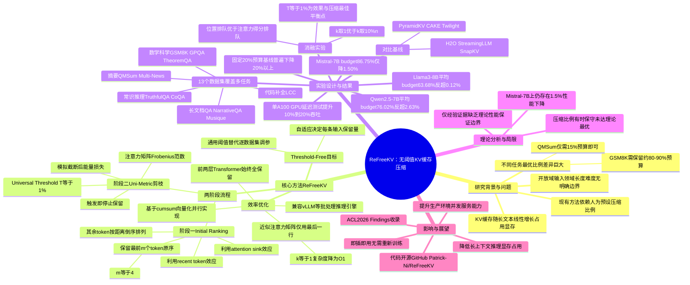

## 一、论文是干什么的？

大语言模型在回答问题时，需要把之前看过的每一个字（专业说法叫token）的中间计算结果都存起来，这部分存储被称为"KV缓存"。可以把它想象成你一边读一本很厚的书一边做笔记：书越长，笔记本就越厚，占用的桌面（也就是显卡的显存）就越多。当输入的文本很长时，这个笔记本会大到装不下，于是研究者们想出各种办法来"精简笔记"，只保留重要的部分，这就是"KV缓存压缩"或"KV缓存剪枝"。

但现有的精简笔记方法有一个很麻烦的毛病：你得提前告诉它"这次笔记要精简到原来的百分之多少"，比如"只留20%"或"只留50%"。问题是，不同类型的题目适合的精简程度完全不同——做数学题（比如GSM8K数据集）可能需要留下80%甚至90%的笔记才能不出错，而做摘要类的任务（比如QMSum数据集）留15%可能就够用了。现实世界里输入五花八门，没人能提前知道每一条输入该留多少，硬性规定一个统一的比例，要么精简过头导致答错，要么精简不够导致省不下空间。这篇论文提出的ReFreeKV，就是想让模型自己判断"这道题该记多少笔记"，不需要人提前告诉它一个固定比例，只需要给一个通用的、放之四海皆准的"停止信号阈值"，模型就能对不同输入自适应地决定保留多少缓存。

## 二、核心方法与创新

ReFreeKV的核心思路可以类比成"一边翻笔记一边判断还要不要继续往前翻"。具体分成两个步骤：

**第一步：给笔记重新排队（Initial Ranking）。** 研究发现，语言模型有两个特点：一是"锚点效应"（attention sink），也就是最开始的几个字往往格外重要，就像书的开头总要交代背景一样；二是"临近效应"，离当前位置最近的字通常也比较重要，就像你看书时刚翻过的那几页记得最清楚。基于这两点，ReFreeKV把所有缓存的token重新排了个队：把最前面的m个token（论文中设为**m=4**）保持原顺序放在队首，剩下的token按照"离当前位置从近到远"的顺序倒序排列。这样一来，越靠前排队的token，通常就是越重要的。

**第二步：用统一指标"Uni-Metric"决定在哪里喊停（Eviction）。** 有了排好队的顺序后，模型会沿着这个队伍一个一个地"计入笔记"，同时不断检查一个叫作**Uni-Metric**的指标——它是注意力矩阵（attention matrix，也就是模型内部衡量"当前字对之前每个字的关注程度"的一张表格）的Frobenius范数，可以粗略理解成"整张关注度表格的整体能量大小"。每往后多保留一个token，模型就模拟一下"如果只用到这里为止，还剩下多少关注度能量"，一旦发现"哪怕再往下砍，损失的能量都小于**1%**"，就在这里喊停，不再继续保留。这个1%被称为"通用阈值"（Universal Threshold, T=1%），是论文经过大量实验后找到的一个对各种任务、各种模型都适用的固定数字——它不需要因为换了数据集或换了模型就重新调整，这正是"threshold-free（无阈值）"这个名字的含义：不是没有阈值，而是只有一个从头到尾通用、不用因输入而变的阈值，压缩比例则由模型根据这个统一标准自动算出来，而不是人为提前钦定。

为了让这套判断过程不拖慢速度，论文还做了一个简化：本来要算整张很大的关注度表格代价很高（计算复杂度是O(n²)，n是文本长度），作者发现只用"最后一行"的关注度信息（把参数k设为1）就足够近似整体情况，这样计算开销直接降到与文本长度无关的常数级别（O(1)）。另外，模型最开始的两层（因为这两层往往关注得比较均匀、承担理解语义的基础作用）会被无条件保留完整缓存，不参与精简。整个"边排队边判断"的过程通过PyTorch里的累加求和（cumsum）等操作并行完成，不需要一步步循环，所以速度很快，也支持同时处理多条输入（批处理）。

简单来说，ReFreeKV的创新在于：把"该留多少缓存"这个问题，从"人提前拍脑袋定一个比例"，变成了"模型根据一个通用标准自己算出该留多少"，从而在长文本、短文本、数学题、摘要题等各种五花八门的场景下都能保持接近不压缩时的效果，同时还能省下不少显存空间。

## 三、使用了哪些模型和计算资源？

- **基座大语言模型**：论文在多个开源大模型上做了实验，包括 Llama3-8B-Instruct、Llama3-70B-Instruct、Mistral-7B-Instruct-v0.3、Qwen2.5-7B-Instruct、Qwen2.5-32B-Instruct、Qwen2.5-72B-Instruct。
- **GPU硬件**：论文在4.3节的端到端延迟/吞吐量实验中明确说明使用了**单张NVIDIA A100 GPU**，并以标准的HuggingFace Accelerate库作为对比基线。对于主实验（准确率对比）具体使用了多少张、什么型号的GPU，论文正文未明确说明——暂无相关信息。
- **训练/推理耗时**：ReFreeKV本身不需要额外训练，是一种推理阶段即插即用的压缩方法。论文表4给出了单条样本的推理耗时示例，例如在Llama3-8B模型上处理GSM8K数据集时，不压缩（Full）整体耗时约4.693秒，使用ReFreeKV（k=1）整体耗时约4.638秒，其中用于判断"该留多少"的额外计算（Prune）只占约0.034秒。论文还指出，相比原生生成，ReFreeKV能带来**10%到20%**的吞吐量提升。具体是否有更大规模训练集群、是否使用了云服务API，论文中未提及——暂无相关信息。

## 四、实验结果

论文在**13个数据集**上做了测试，涵盖数学与科学推理（如GSM8K、GPQA、TheoremQA）、常识推理（TruthfulQA、CoQA）、单文档/多文档问答（NarrativeQA、Qasper、2WikiMultihopQA、Musique）、摘要（QMSum、Multi-News）、小样本学习和代码补全（LCC）等多种任务类型，对比的方法包括H2O、StreamingLLM、SnapKV、PyramidKV、CAKE等主流KV缓存压缩方法，以及一种较新的自适应方法Twilight。

| 模型 | 完整缓存(基准) | ReFreeKV表现 | 平均保留的缓存比例 |
|---|---|---|---|
| Llama3-8B-Instruct | 100% | **反而高出0.12%** | 63.68% |
| Qwen2.5-7B-Instruct | 100% | **反而高出2.63%** | 76.02% |
| Mistral-7B-Instruct-v0.3 | 100% | 略降1.50% | 86.75% |

也就是说，在Llama3-8B和Qwen2.5-7B上，ReFreeKV不仅没有因为"省笔记"而答错更多题，反而表现比不省笔记时还略好一点点，同时平均只用了六到八成的缓存空间；在Mistral-7B上虽然有小幅下降，但幅度很小（1.5%），换来的是空间的节省。

作为对比，其他方法如果被要求"固定只留20%的缓存"，表现会大幅下滑：例如在Llama3-8B上，固定20%预算时H2O下降23.33%，StreamingLLM下降28.21%，SnapKV下降24.45%，PyramidKV下降25.33%，CAKE下降23.47%——差距非常明显。而ReFreeKV完全不需要提前设定这样一个固定比例，是让模型对每条输入自己判断。

论文还在更大的模型上验证了效果的可推广性：Llama3-70B-Instruct、Qwen2.5-32B-Instruct、Qwen2.5-72B-Instruct上都观察到类似的"几乎无损压缩"现象，并且论文指出"在上下文更长的数据集上，平均压缩比例可以提升到接近50%"，说明文本越长，ReFreeKV省下的空间比例越可观。

消融实验方面，论文验证了：(1) 用于近似计算的参数k取1（只用最后一行信息）时效果最稳、开销最小，取更大的k（如10%的文本长度）在有些数据集上（如NarrativeQA）反而会导致效果大幅下滑；(2) 如果换成按"传统注意力得分"来给token排序（类似H2O的做法），效果明显更差且不稳定，证明论文提出的"按位置排队"方式更可靠；(3) 通用阈值T取1%是效果与压缩比例之间较好的平衡点，调得更小（0.1%）几乎不再提升效果，调得更大（10%）则会明显损伤表现。

论文也在"局限性"部分坦诚指出两点不足：一是ReFreeKV有时会偏保守，实际保留的缓存比例比"理论最优"要多（例如在Mistral-7B上处理QMSum时，ReFreeKV保留了84.3%的缓存，但其实50%就足够不掉分）；二是该方法目前只是"经验上"表现接近无损，并没有从理论上证明什么情况下一定不会掉分（Mistral-7B上确实出现了1.5%的下降）。

## 五、潜在应用与已落地应用

**潜在应用方向：**
- 在大语言模型对话系统、长文档问答、代码助手等需要长上下文的实际产品中，帮助降低显存占用，从而让同一块显卡能同时服务更多用户请求（提升并发量）；
- 面向真实世界"输入类型混杂、长度差异巨大"的在线推理场景（比如既要处理简短问答又要处理长篇文档摘要），无需为每种输入类型单独调参，简化部署和运维复杂度；
- 可以与现有推理引擎（论文提到与vLLM等支持"按样本分配KV缓存"的推理框架天然兼容）结合，作为一个可插拔的中间层集成进生产系统。

**已落地应用**：论文作者已将代码开源在 [GitHub - Patrick-Ni/ReFreeKV](https://github.com/Patrick-Ni/ReFreeKV)，供其他研究者和开发者直接使用与验证。截至目前搜索到的信息中，暂无相关信息显示该方法已被集成进某个具体的商业产品或大规模线上系统；论文本身已被ACL 2026 Findings接收（论文页面注明"Accepted to ACL 2026 Findings"）。

## 六、网络上的讨论与评价

经过在网络上搜索"ReFreeKV"、arxiv编号"2502.16886"及相关关键词组合，未找到Twitter/X、Reddit或独立博客上的实质性讨论。在HuggingFace论文页面（huggingface.co/papers/2502.16886）上，除了47个点赞外，只有一条由自动化的"Librarian Bot"账号发布的评论（发布于2026年7月1日），列出了若干主题相关的后续论文（例如"Reformulating KV Cache Eviction Problem for Long-Context LLM Inference"、"Coverage-Driven KV Cache Eviction"、"CompressKV"等），并非真人评价或深入讨论。因此，暂无相关讨论可供总结。

## 七、思维导图

