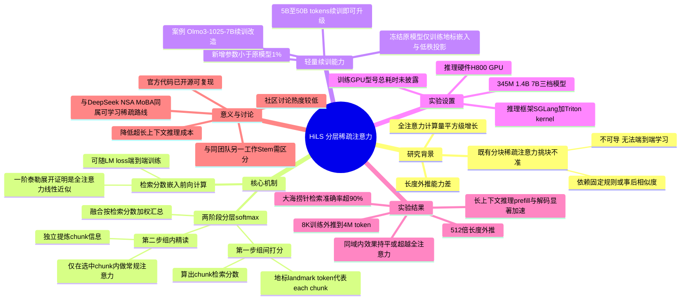

## 一、论文是干什么的？

大模型读长文章的时候，标准的做法是"全注意力"——每一个字都要和文章里其他所有字两两对比、算一遍相关性。这样做的问题是：文章越长，计算量涨得越快（是平方级增长），而且模型在处理比训练时见过的更长的文章时，表现会明显变差（这叫"长度外推能力差"）。

一种常见的省钱做法叫"分块稀疏注意力"：把长文章切成一个个小块，每次只挑几个"看起来相关"的块来精读，其余块直接跳过不看，这样能省下大量计算量。但问题在于，以往这类方法"挑块"的方式往往是靠固定规则或者事后计算相似度来判断，不是跟着模型的真实训练目标一起学出来的，所以挑得不够准，导致效果始终比不上"老老实实全部看一遍"的全注意力模型。

这篇论文由腾讯混元团队主导（联合上海科技大学、香港科技大学、加州大学圣地亚哥分校），提出了一种叫**HiLS（Hierarchical Landmark Sparse，分层地标稀疏）注意力**的机制，核心目标就是解决"挑块挑不准"这个老大难问题——让模型自己在训练过程中学会"该重点看哪一块"，而不是靠人工规则替它做决定。

打个比方：以前的稀疏注意力像是一个新员工，被要求"先扫一眼各个文件夹的标签，凭经验猜哪几个文件夹可能有用，然后只打开这几个看"，猜不准就容易漏掉重要信息。HiLS则像是把"该看哪个文件夹"这件事也纳入了员工的绩效考核，让他在长期工作中真正学会准确判断"这次任务该重点翻哪个文件夹"，而不是凭一套死板规则。

## 二、核心方法与创新

HiLS的核心机制可以理解成"先分组讨论、再综合意见"的两步流程：

- **第一步（组间打分）**：模型先给每个文本块生成一个"代表"（地标token，landmark token），当前要处理的这个字（query）会先跟每个文本块的"代表"打一次交道，算出一个"这个块这次有多重要"的检索分数——相当于"先扫一眼各组的摘要，判断这次发言该重点参考哪几个组"。
- **第二步（组内精读）**：根据第一步的分数，选出最重要的几个文本块，然后这个字只在这几个被选中的块内部，和真实的字逐一做常规的注意力计算，独立提炼出"这个块能提供的具体信息"——相当于"被选中的几个小组各自展开详细讨论，形成组内的具体结论"。
- **融合**：最后把每个被选中块单独算出来的"组内结论"，按第一步算出的检索分数加权汇总，得到最终输出——相当于"主持人把几个小组的结论，按其重要程度加权汇总成一个最终意见"。

这个设计最关键的创新在于：**检索分数不是靠事后计算相似度或人工规则定的，而是直接写进了注意力计算的数学展开式里**。论文用数学证明（一阶泰勒展开）说明，这个检索分数其实就是"完整全注意力"的一种线性近似——正因为它被自然地嵌入了前向计算过程，所以可以直接跟着语言建模的loss一起被端到端训练优化，让"怎么挑块"这件事本身也变成了模型学习的一部分，而不是一个写死的、不可求导的规则。

**另一个重要贡献是"轻量续训"能力**：论文证明，已经训练好的全注意力大模型，不需要从头重新训练，只需要额外训练极少量新增参数（新增的地标token嵌入和低秩投影矩阵，新增参数量不到原模型的1%），只用大约5B～50B tokens的续训数据，就能把一个普通的全注意力模型"改造"成HiLS-Attention模型，在保持原有能力的同时获得超长上下文外推能力——这意味着已经训练好的大模型不用整个报废重来，用较低成本就能"升级"。

论文的核心实验展示：一个只在**8K**长度上下文上训练过的模型，最终能外推到**400万（4M）token**的上下文长度，且在"大海捞针"（needle-in-a-haystack）式的长文本检索测试中，仍能保持超过90%的检索准确率——远超同样条件下的全注意力模型。

## 三、使用了哪些模型和计算资源？

- **三档模型规模用于不同实验**：
  - 345M参数（仿GPT-2 Medium配置，head dim=64，chunk size=64），用于验证8K训练、400万token外推的核心结果。
  - 1.4B参数，从零开始训练，训练量300B tokens。
  - 7B参数，基于开源模型 **Olmo3-1025-7B** 的基座checkpoint做续训实验，用于验证"轻量续训"改造已有模型的效果。
- **续训数据量**：完整改造约需50B tokens续训，论文提到最少5B tokens的续训就已经足够看到效果。
- **推理测试硬件**：论文明确提到用单张 **NVIDIA H800 GPU**（bf16精度，batch size为1）做推理延迟基准测试。
- **推理框架**：**SGLang** 推理引擎，配合Triton编写的attention kernel。
- **训练框架**：官方GitHub仓库要求 Python 3.11 + **PyTorch 2.8.0**，使用分布式checkpoint（DCP）格式；论文正文中**未点名**具体使用了Megatron/DeepSpeed/FSDP等哪一种分布式训练框架，训练阶段具体用了多少张、什么型号的GPU，以及总训练耗时，论文中也**未明确提及**，不应臆测具体数字。
- **是否使用商用API**：不涉及，全部基于自建GPU资源和开源模型权重进行训练与推理实验。
- **开源情况**：官方代码已开源，仓库地址为 [Tencent-Hunyuan/HiLS-Attention](https://github.com/Tencent-Hunyuan/HiLS-Attention)，包含训练/评测代码及345M、Olmo3-7B改造版的预训练/续训checkpoint。

## 四、实验结果

- **长度外推能力**：训练时上下文长度仅8K tokens，评测时外推到400万token，对应512倍的长度外推倍数，在大海捞针检索任务上仍保持超过90%准确率；同等条件下的全注意力模型外推能力远不及此。
- **推理效率**：论文报告在长上下文场景下（如512K长度），相较全注意力，HiLS-Attention在预填充（prefill）阶段和逐token解码阶段均有数量级的速度提升，得益于其稀疏的KV访问和计算方式（具体倍数建议以论文原文表格为准，本文引用的数字来自二手转述，未做逐字核对）。
- **同域内表现**：在训练时用过的正常长度范围内，HiLS-Attention的效果与全注意力持平，部分场景下甚至更好，说明它不是靠"牺牲效果换效率"的妥协方案。
- **轻量续训验证**：用少量续训数据即可把7B规模的现成开源模型（Olmo3-1025-7B）改造成具备超长上下文外推能力的HiLS版本，同时保持原模型在正常长度任务上的能力不下降。

## 五、潜在应用与已落地应用

- **降低长文本推理成本**：这类"端到端可学习"的稀疏注意力机制，理论上能让处理超长文档、超长对话记录、代码仓库级别上下文的大模型推理成本大幅降低，同时不像传统稀疏注意力那样明显牺牲效果。
- **已开源可用**：腾讯混元团队已经把代码和多个预训练/续训checkpoint开源，说明这不仅仅是一篇理论论文，而是已经落地为可复现、可直接使用的工程实现。
- **与业界其他稀疏注意力方案的关系**：这个方向和DeepSeek提出的NSA（Native Sparse Attention）、MoBA（Mixture-of-Block Attention）等方法属于同一条技术路线——都强调"稀疏性要端到端可训练"而不是靠事后剪枝或固定规则。HiLS的独特之处在于给出了"检索分数近似全注意力"的数学证明，并且验证了"轻量续训改造已有模型"这一实用能力。需要注意的是：腾讯混元团队在2026年6月还发布过另一个**不同的**稀疏注意力工作"Stem"（曾有报道称其能将128K上下文下的首token延迟降低3.7倍），这是同团队的另一项工作，与本文的HiLS是两个不同的项目，不应混淆。

## 六、网络上的讨论与评价

**未搜索到**任何Twitter/X、Reddit、Hacker News上关于"HiLS Attention"或该arXiv编号的实质性讨论帖。HuggingFace Papers页面显示59个点赞，但未能获取到具体的社区评论内容。目前该论文的公开曝光主要限于arXiv页面本身、HuggingFace点赞数和已开源的官方GitHub仓库，尚未在主流技术社区形成明显的讨论热度。

## 七、思维导图

