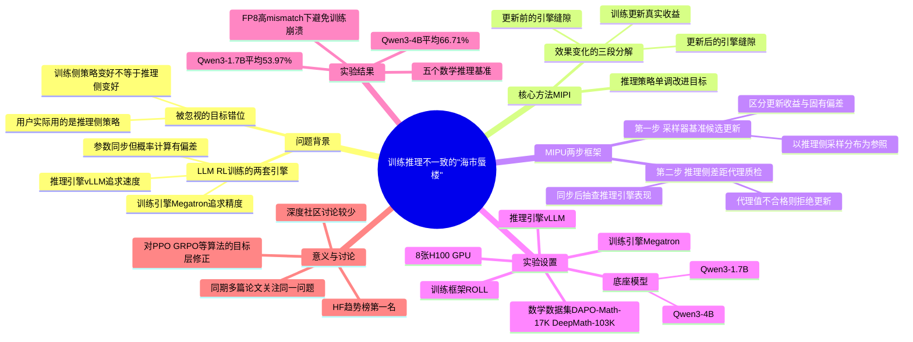

## 一、论文是干什么的？

现在训练大模型的"推理能力"（比如做数学题、写代码），很流行用强化学习（RL）：让模型自己生成一堆答案，做对了奖励、做错了惩罚，模型就会越来越会做题。但这篇论文发现，这套流程里藏着一个很多人没意识到的"系统性bug"。

问题出在一个工程细节上：训练大模型的时候，公司通常会用两套不同的软件系统——一套叫"训练引擎"（比如Megatron），专门负责精确计算怎么调整参数；另一套叫"推理引擎"（比如vLLM），专门负责快速生成答案。这两套系统为了追求各自的效率，在数值计算上会有细微差异，导致同一段文字，"训练引擎"和"推理引擎"算出来的概率并不完全一样——哪怕两边用的模型参数是完全同步的。

打个比方：这就像一家餐厅有两位大厨，一位专门"研发新菜"（训练侧），一位专门"批量出餐"（推理侧）。两人用的是同一份菜谱（模型参数），但因为厨具、火候习惯的细微差别，同一道菜做出来的味道总有点不一样。餐厅一直在优化"研发大厨"的手艺，却没人去检查——"研发大厨"觉得改良成功的菜谱，"出餐大厨"做出来是不是真的更好吃？而顾客（也就是产品的实际用户）吃到的，永远是"出餐大厨"做的那份。

论文指出：过去大家一直在想办法"稳住训练侧的策略"，但都默认了一个未经检验的假设——训练侧变好，等于部署时（也就是推理侧）用的那个策略也跟着变好。这篇论文说：这个假设不成立，这是一种"目标错位"（objective misalignment）。

## 二、核心方法与创新

论文提出了一个新的优化目标，叫**MIPI（Monotonic Inference Policy Improvement，推理策略的单调改进）**。核心思想很直白：**别再只想着让训练侧的策略变好，要直接把"推理侧实际部署的策略会不会变好"当成真正要优化的目标**。

论文把"推理策略从这一步到下一步的效果变化"拆成了三部分（用类比理解）：

> 部署效果的变化 = 这次训练更新带来的真实收益 + 更新前存在的"厨具差异"缝隙 + 更新后新产生的"厨具差异"缝隙

也就是说，用户实际感受到的变化，不仅取决于"这次训练教了模型什么"，还取决于"训练引擎和推理引擎之间那道原本就存在、且会被更新过程放大或缩小的缝隙"。以前的方法只关注怎么让训练那一部分更稳，完全没有把"缝隙"本身当成需要主动检验和控制的对象。

基于这个目标，论文提出了配套的两步算法**MIPU（Monotonic Inference Policy Update）**：

- **第一步：以"采样器"为基准构造候选更新（sampler-referenced candidate updates）**。传统PPO/GRPO这类算法，计算"这次更新该走多大步子"时，参照系是训练侧自己的旧策略。MIPU改成以"实际生成这些训练数据的采样器（也就是推理引擎当时的状态）"为参照系去算重要性权重和优势值，这样能把"训练更新本身带来的变化"和"两套引擎本来就有的偏差"区分开，不会把偏差错当成需要压制的信号，导致更新步子被不必要地缩小。
- **第二步：用"推理侧差距代理"做质检、决定接不接受这次更新（inference-side gap proxy）**。算完候选更新之后，先不急着确认，而是把新参数同步到推理引擎里，用一个专门设计的指标去抽查："这次更新在真正要用的推理引擎上，表现是不是也确实变好了？"如果抽查结果很差（说明训练侧和推理侧的差距在这次更新后被明显放大），就直接拒绝这次更新、回滚到上一个checkpoint，而不是稀里糊涂地把它用到下一轮训练里。

用回餐厅的比喻：MIPU相当于给"研发大厨"改良菜谱的动作加了两道保险——第一，改良时就得参考"出餐大厨"平时的实际手法，而不是闭门造车；第二，改良完成后必须先让"出餐大厨"实际做一次、经理亲自试吃过关了才能正式换菜单，试吃不过关就退回旧菜谱。

## 三、使用了哪些模型和计算资源？

- **底座模型**：Qwen3-4B 和 Qwen3-1.7B（阿里巴巴Qwen3系列开源模型，非自研模型），论文用这两个不同参数规模来验证方法的普适性。
- **对照基线**：与其他off-policy修正方法在相同底座模型上做公平对比。
- **训练数据**：DAPO-Math-17K 和 DeepMath-103K（经过筛选、保留有奖励区分度的数学题样本）。
- **训练框架**：**ROLL**（阿里巴巴内部的大规模强化学习训练框架）。
- **训练引擎与推理引擎**：训练用 **Megatron**，生成rollout用 **vLLM**——这正是产生"训练推理不一致"问题的两套系统。
- **GPU资源**：论文提到使用了 **8张 NVIDIA H100 GPU**，但更细的总训练时长、每个RL训练步骤的具体耗时，论文正文中**未提及**，不建议臆测具体数字。
- **训练超参**：学习率1e-6，batch size 64，每组采样8条回复。
- **是否使用商用API**：没有使用OpenAI/Anthropic等商用API，整套实验基于自部署的开源框架和Qwen3开源权重完成。
- 论文特别测试了**FP8量化rollout场景**下的高mismatch情况，用来验证方法在"训练推理不一致更严重"时依然有效。

## 四、实验结果

论文在五个数学推理基准（MATH-500、AIME24、AMC23、Minerva、OlympiadBench）上用pass@1准确率评测：

| 底座模型 | MIPU 平均 pass@1 |
|---|---|
| Qwen3-4B | 66.71% |
| Qwen3-1.7B | 53.97% |

在高mismatch场景下（比如FP8量化rollout），传统方法容易出现训练不稳定甚至"性能崩溃"（模型越训越差），而MIPU能保持训练稳定，避免了这种崩溃现象，并且在两个模型尺度上都比对照基线取得了更好的平均推理表现。

## 五、潜在应用与已落地应用

这篇论文瞄准的是当前所有做LLM强化学习训练的团队都会遇到的一个底层工程问题——只要你的训练系统用了"分离的训练引擎+推理引擎"这种主流架构（几乎所有大规模RL训练的公司都是这么做的，因为一套引擎很难同时兼顾训练精度和生成速度），就一定会遇到这种"训练推理不一致"的隐患。

- **对现有RL训练框架的改进意义**：论文提出的MIPI/MIPU思路，本质上是对PPO、GRPO等主流策略优化算法的一种"目标层面"的修正，可以理解成给现有算法加装一个"部署效果质检环节"，理论上可以被其他RL训练框架借鉴或集成。
- **同期相关研究**：2026年上半年，"训练推理不一致"已经成为LLM RL领域的一个热门方向，同期还有《Diagnosing Training Inference Mismatch in LLM Reinforcement Learning》《LLMs Can Learn to Reason Via Off-Policy RL》等多篇论文在讨论类似问题，说明这是业界公认的一个真实痛点，而不是这篇论文自己"造出来"的问题。
- 论文使用的是阿里巴巴自研的ROLL训练框架，暗示阿里内部很可能已经在实际的大模型RL训练管线中验证或应用了类似思路，但目前**没有查到公开证据**证明该方法已被其他公司或开源框架（如verl、OpenRLHF）正式采用。

## 六、网络上的讨论与评价

该论文在发布后不久（约2026年7月7日前后）一度登上HuggingFace Papers趋势榜第一名，反映出业内对"训练推理不一致"这一问题的关注度较高。有资讯聚合站点用"标志着（LLM RL训练）从实验性好奇转向工业级工程"来形容这篇论文的意义。但除此之外，**未搜索到 Reddit、Hacker News、知乎等平台上的实质性深度讨论**，目前公开的讨论热度主要集中在HuggingFace点赞和少量AI资讯聚合站的简短提及上。

## 七、思维导图

