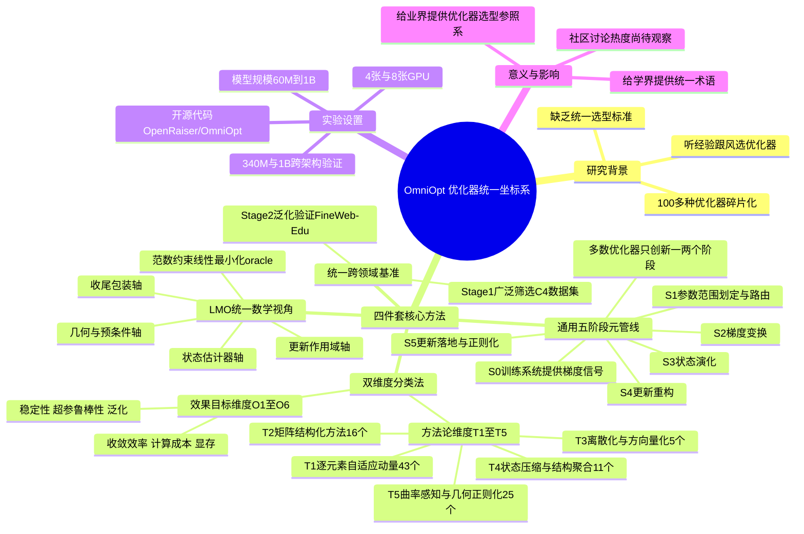

## 一、论文是干什么的？

训练一个大模型，最核心的一步是"优化器"——它决定了每看到一批数据算出梯度之后，具体该怎么调整模型参数。这些年冒出来的优化器五花八门，光是有名有姓的就超过100种：Adam、AdamW、Lion、Muon、Shampoo、SOAP、GaLore……每篇论文都说自己的方法更好，但选哪个、什么场景该用哪个，业内其实没有一个统一的参照系，大多是"听说XX公司用了Muon所以我们也试试"这种口口相传。

这篇论文做的事情，就像是给"优化器"这个乱糟糟的江湖画一张统一的武功谱。作者们不是又发明一种新优化器，而是退后一步，问了一个更根本的问题：这100多种优化器，能不能用同一套"分解动作"和同一套"评分卡"来描述和比较？

打个比方：这就像有100多种不同门派的"武功招式"，看起来五花八门，但如果你把每一招都拆解成"起手式、发力方式、内力运转、收招方式"这几个固定环节，你会发现很多招式其实只是在其中一两个环节上做了创新，其他环节和"基本功"没什么区别。这篇论文就是把优化器的"每一步参数更新"拆解成一套固定的环节，然后发现：**绝大多数优化器只在其中一两个环节上做了文章，其余环节其实都是标准套路**。

## 二、核心方法与创新

论文的核心贡献可以概括成"四件套"，层层嵌套：

**1. 通用五阶段元管线（Universal Meta-Pipeline）**

论文认为，每一次优化器的参数更新，都可以拆解成固定的处理流程：训练系统先提供一个原始梯度信号（记作S0，这一步不算优化器自己的动作，是"原材料"），然后优化器依次经过五个内部阶段：

- **S1 参数范围划定与路由（Scoping & Routing）**：决定这次更新是对"整个参数矩阵"、"矩阵的某些结构"还是"某个低维子空间"下手。
- **S2 梯度变换（Gradient Transformation）**：对原始梯度做一次结构化处理，比如取符号、做矩阵正交化等。
- **S3 状态演化（State Evolution）**：维护和更新优化器的"记忆"，比如Adam里那两条滑动平均线（一阶动量、二阶动量）。
- **S4 更新重构（Reconstruction）**：如果前面几步把信息压缩或变换过（比如降维），这一步要把方向重新映射回原始参数空间。
- **S5 更新落地与正则化（Update & Regularization）**：确定学习率、权重衰减等最终生效的更新幅度。

论文发现一个很有意思的现象：**绝大多数流行优化器只在其中一到两个阶段做了真正的创新，其余阶段基本沿用默认做法**。比如Adam的招牌动作主要发生在S3（维护动量），Muon的招牌动作主要发生在S2/S3（做矩阵正交化）。这就像发现："原来市面上大部分武功秘籍，其实只在'发力方式'这一个环节上真正与众不同，其他环节都是通用基本功。"

**2. 用"范数约束线性最小化"（LMO）统一数学视角**

论文进一步把"S2-S4"这几个阶段用一个统一的数学工具——范数约束线性最小化oracle（LMO）——重新表达。通俗理解：不同优化器本质上都是在问同一个问题——"在允许的更新幅度（用某种'范数'衡量的球形范围）内，哪个方向和当前掌握的信号最匹配？"只是各家选的"范数"形状不一样（有的按元素逐个衡量、有的按矩阵整体衡量），这就导致了不同优化器"迈步子"的几何形状不一样。论文把这个统一视角进一步拆成四个坐标轴：**更新作用域**（全参数/矩阵/子空间）、**状态估计器**（怎么记忆历史信号）、**几何与预条件**（LMO对应哪种度量方向）、**收尾包装**（学习率/衰减/投影回原空间怎么处理）。

**3. 双维度分类法**

有了前面两层拆解，论文把100多种优化器（论文中统计为**108种**）组织进一个双维度的分类体系：

- **维度A：方法论分类**——按"主要在哪个阶段做创新"把优化器分成5大机制家族：
  - **T1 逐元素自适应动量（43个成员）**：如AdamW一类，逐参数维护动量和自适应步长。
  - **T2 矩阵结构化方法（16个成员）**：如Muon一类，把参数当矩阵整体处理。
  - **T3 离散化与方向量化（5个成员）**：如Lion一类，只保留梯度的符号方向。
  - **T4 状态压缩与结构聚合（11个成员）**：如GaLore、APOLLO一类，为了省内存对优化器状态做压缩。
  - **T5 曲率感知与几何正则化（25个成员）**：如Shampoo、SOAP一类，利用二阶曲率信息。
- **维度B：效果目标分类**——记录每种优化器主要想改善的是哪类可衡量指标，共6类：收敛效率(O1)、单步计算成本(O2)、显存开销(O3)、训练稳定性(O4)、超参数鲁棒性(O5)、泛化能力(O6)。

**4. 统一的跨领域基准测试**

最后，论文把这套分类体系落地成一个实际可跑的基准测试平台，让不同"门派"的优化器在同一套受控实验条件下真刀真枪地比一比。

## 三、使用了哪些模型和计算资源？

- **基准测试分两个阶段**：
  - **Stage 1（广泛筛选）**：在C4数据集上、仿LLaMA-3架构，测试了AdamW、AdaBelief、Adafactor、Adam8bit、Adam-mini、AdamP、Adan、CAME、Conda、GaLore、LAMB、Lion、MARS系列、Muon、NAdam、Prodigy、RAdam、RMNP、Shampoo、SOAP、Sophia、APOLLO等超过20种优化器，模型规模覆盖 **60M / 130M / 350M / 1B** 参数，训练步数从1万到10万步不等。
  - **Stage 2（高质量泛化验证）**：在FineWeb-Edu数据集上，把Stage 1中表现较强的12种优化器迁移到Transformer++、GLA（门控线性注意力）、DeltaNet、Gated DeltaNet四种不同架构上，模型规模为**340M / 1B**，序列长度32k tokens，训练约30720步。
- **GPU数量**：根据官方GitHub仓库README，350M规模实验用了**4张GPU**，1B规模及Stage 2全部实验用了**8张GPU**；但**具体GPU型号（如A100/H100）、总训练时长、总算力消耗，论文正文和仓库均未明确说明**，不建议臆测具体数字。
- **训练框架**：Stage 1基于APOLLO（继承自GaLore/Q-GaLore的代码库），Stage 2基于集成了flash-linear-attention项目的OpenToMe训练框架。
- **是否使用商用API**：不涉及，全部是自建GPU集群上的开源模型训练实验，不依赖OpenAI/Anthropic等API。
- **开源情况**：代码已开源，仓库地址为 [OpenRaiser/OmniOpt](https://github.com/OpenRaiser/OmniOpt)。

## 四、实验结果

论文没有得出"哪个优化器绝对最强"这种单一结论，而是系统性地展示了每个机制家族在六个效果目标（收敛效率、计算成本、显存、稳定性、超参鲁棒性、泛化）上的取舍关系（trade-off）。**需要说明的是**：由于本文调研未能逐一核对论文正文中每张实验结果表格的具体数字，以下几点更偏向机制家族的一般性特征归纳，具体的量化对比数据请以论文原文的实验结果章节为准：

- T1（AdamW一类逐元素方法）通常被认为在超参数鲁棒性和训练稳定性上表现均衡，是较为"万金油"的选择。
- T2/T5（Muon、Shampoo一类矩阵/曲率方法）通常被认为在收敛效率上有优势，但计算和调参成本可能更高。
- T4（GaLore、APOLLO一类压缩方法）主打显存节省，但可能在收敛速度或泛化上有所权衡。

论文用受控实验（架构、数据、调度都保持一致，只调优每种优化器自身的超参数）来验证这套五阶段+双维度的分类框架是否能把"表现相近的优化器"聚到同一类里，以此说明这个分类体系不只是理论上好看，而是希望能被实验数据支持的组织方式（具体验证结果的细节，同样建议以论文原文为准）。

## 五、潜在应用与已落地应用

- **对业界训练大模型团队的实际价值**：把过去"听说Muon快但难调、Adam稳但普通"这类零散经验，转化成在同一套受控条件下、跨模型规模和架构的可比较数据。团队可以根据自己的实际约束（算力预算、显存限制、调参资源、下游任务类型），按图索骥地在这张"坐标系地图"上找到合适的优化器机制家族，而不必凭感觉或跟风选择。
- **对研究社区的价值**：这套统一术语（S0-S5阶段、T1-T5机制家族、O1-O6效果目标）也为未来提出新优化器的论文提供了一个"通用语言"，方便说清楚"我的新方法到底在哪个阶段做了创新、想改善哪个指标"，而不是自说自话地起一个新名字。
- 由于论文发布时间很新（2026年7月），**目前没有查到公开证据**表明已有具体团队公开宣布采用OmniOpt的分类标准作为选型依据，但代码和基准已经开源可用。

## 六、网络上的讨论与评价

**未搜索到**该论文在Reddit、Hacker News、Twitter/X上的专门讨论帖；搜索相关关键词时命中的多是同领域其他背景讨论（比如Muon/Shampoo在其他基准上的社区调优讨论），与这篇论文本身无关。目前该论文的公开曝光主要体现在HuggingFace Papers页面的72个点赞和已开源的GitHub代码仓库上，尚未形成明显的社区讨论热度。

## 七、思维导图

