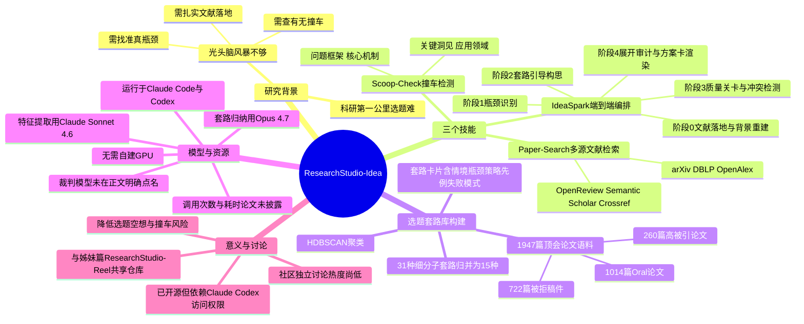

## 一、论文是干什么的？

现在的大模型已经能很轻松地"头脑风暴"出一堆研究方向，但对做科研的人来说，真正难的从来不是"想出一个点子"，而是把一个模糊的想法打磨成一个真正站得住脚的研究方案：这个问题在现有文献里到底处在什么位置？真正的瓶颈是什么？和别人已经做过的工作有什么本质区别？这个方向有没有被别人抢先做过、或者早就被证明走不通？

这篇论文由南洋理工大学、微软研究院、新加坡国立大学等团队合作完成，是"ResearchStudio"系列项目的姊妹篇之一（另一篇是专门做论文宣传物料自动化的ResearchStudio-Reel）。这一篇聚焦的是科研的"第一公里"——从一个模糊的研究方向，走到一份有理有据、值得投入实现的选题方案。他们的做法不是简单地让大模型"随便想几个点子"，而是先系统性地研究了近2000篇真实的顶会论文（包括入选口头报告的、高被引的、以及被拒稿的），从中总结出人类科研人员实际使用过的、可以重复套用的"选题套路"，再把这些套路做成一套AI工具，让AI按照这些经过验证的套路来帮你打磨选题，而不是天马行空地瞎猜。

打个比方：这有点像一个刚入行的年轻厨师想要研发一道新菜，与其自己关起门来瞎琢磨，不如先去翻遍近几年所有参赛过的菜谱大赛记录——不仅看获奖的菜（相当于顶会里的Oral论文），也看被淘汰的菜和评委给出的具体差评理由（相当于被拒论文和审稿意见），从中总结出"哪几类创新思路评委真的买账、哪几类看似新颖其实评委一眼就能看穿是老套路"，把这些经验整理成一本"选题参考手册"，然后每次研发新菜时，先对照这本手册看看自己的思路属于哪一类、有没有别人已经用过的雷区。

## 二、核心方法与创新

这套工具由三个技能组成：

- **Paper-Search（多源文献检索）**：独立的检索技能，同时查询 arXiv、DBLP、OpenAlex、OpenReview、Semantic Scholar、Crossref 等多个学术数据源，把一个研究问题和现有文献的证据对应起来。
- **Scoop-Check（撞车/抢发检测）**：独立的新颖性核查技能，把一个新颖性主张拆解成四个要素——问题框架（怎么定义这个问题）、核心机制（用什么方法解决）、关键洞见（背后的核心想法）、应用领域，然后把这四个要素分别和检索到的已有工作逐项比对，判断这个想法是不是已经被别人做过了。
- **IdeaSpark（端到端编排）**：把证据落地、瓶颈识别、套路引导生成、冲突检索、结构化审计、方案卡渲染这一整套动作串联成一条完整流程，具体分为五个阶段：
  - **阶段0：文献落地**——多源检索相关文献，提取已有工作的观察结果、局限性、尚未解决的问题，同时评估现有证据是否充分、重建研究背景。
  - **阶段1：瓶颈识别**——从检索到的文献里诊断出真正值得投入创新的约束或空白，而不是泛泛而谈"这个方向还有改进空间"。
  - **阶段2：套路引导构思**——从下面提到的选题套路库中挑出相关的套路，套用到当前问题上，实例化出一个具体的候选研究方向。
  - **阶段3：质量关卡**——检查这个候选方向是不是真的填补了识别出的瓶颈、套路是不是真的用对了地方、有没有踩到常见的"反面套路"、以及调用Scoop-Check检查是否与已有工作冲突。
  - **阶段4：展开与审计**——把核心想法进一步展开细化、检验可行性、生成结构化的"方案卡"（idea card），并执行一系列确定性的校验规则。

**选题套路库的构建过程**：作者收集了**1947篇**来自ICLR（2021-2025）、ICML（2023-2025）、NeurIPS（2023-2025）的机器学习顶会论文，其中包括**1014篇**入选口头报告（Oral）的论文、**260篇**按引用数排名靠前的高被引论文、以及**722篇**有完整审稿意见记录的被拒稿件（部分论文同时具有多个标签）。作者用聚类算法（HDBSCAN）从这些论文的"创新特征"里挖掘出**31种**细粒度的"选题子套路"，再归并整理成**15种**更概括、可复用的"选题套路（ideation pattern）"。每种套路都被整理成一张结构化卡片，包含适用的研究情境、常见的瓶颈类型、差异化策略、可参考的支持性先例、以及常见的失败模式。举例来说，已核实到的部分子套路包括："通过孤立变量做受控诊断构造"（比如专门设计一个简化实验来隔离验证某个变量的真实作用）、"跨模态的底层适配"（把一种模态上验证有效的方法迁移改造到另一种模态）、"通过等价性证明统一概率类优化目标"、"全对注意力（all-pairs attention）算子替换"（把模型里全对注意力这个模块换成另一种结构）、"基于极限假设的可识别性定理转向"（围绕某个"取极限"式的假设条件，重新推导一个可识别性定理，从而转出新的研究角度）等。

## 三、使用了哪些模型和计算资源？

- **底层使用的LLM（论文原文明确提及）**：从每篇论文里提取"创新特征"这一步，用的是 **Claude Sonnet 4.6**（喂给它论文标题、摘要、引言、以及可获得的审稿意见）；对提取出的特征做聚类归纳、总结出15种选题套路这一步，用的是 **Opus 4.7**。
- **运行载体**：和姊妹篇ResearchStudio-Reel一致，整套技能设计为运行在 **Claude Code** 和 **OpenAI Codex** 之上，官方推荐使用Claude Opus 4.6、GPT-5.5或更新版本，而不是自己搭建裸API调用或自建GPU推理服务。
- **盲测自动裁判**：论文用了两个自动化裁判分别评估生成方案的"质量"和"新颖性"（质量维度用"idea-quality技能"，新颖性维度用"scoop-check技能"），但论文正文中**没有明确点名**这两个裁判具体调用的模型型号是什么，这部分信息可能在附录里，未能完全核实。
- **计算资源与耗时**：论文正文中**没有找到**关于"生成一个研究方向平均要调用多少次模型、耗时多久、消耗多少token"的具体数字，不应臆测。作为侧面参考，姊妹篇ResearchStudio-Reel披露过处理一篇论文（做海报/视频/博客）大约耗时89分钟、消耗260万输入token——但这是完全不同任务（生成宣传物料）的数据，不能直接套用到本文的选题生成任务上。
- **GPU需求**：不需要，整套系统基于Claude Code/Codex的云端模型调用，本地无需GPU。
- **开源情况**：项目和代码与ResearchStudio-Reel共享同一个仓库 [microsoft/ResearchStudio](https://github.com/microsoft/ResearchStudio)（MIT协议），项目主页为 [microsoft.github.io/ResearchStudio](https://microsoft.github.io/ResearchStudio)。

## 四、实验结果

论文用"盲测自动裁判评估（blind automated-judge evaluations）"的方式来验证IdeaSpark生成方案的质量：把IdeaSpark生成的研究方案，与"不使用任何选题技能、直接让模型头脑风暴"（no-skill基线）和"使用通用型选题提示词技能，但不带这套选题套路库"（generic-skill基线）两种对照方式生成的方案放在一起，让自动化裁判在不知道来源的情况下打分对比。结果显示，IdeaSpark生成的方案在"质量"评分上持续优于这两种基线，同时在"新颖性"评分上也保持了有竞争力的水平（即没有为了追求方案听起来"扎实"而牺牲掉新颖性）。论文正文中**未找到**具体的量化打分数字（比如具体高出多少分），这部分细节建议以论文原文表格为准。

## 五、潜在应用与已落地应用

- **对科研新手的实际帮助**：把"选题"这件容易流于空想的事情，拆解成有实证支撑、可复用的具体步骤——不是让AI随便"头脑风暴"，而是先做扎实的文献落地，找准真正的瓶颈，从1947篇真实顶会论文（包括大量被拒稿件里的失败教训）总结出的15种"套路卡片"里挑一个来具体套用，再自动检查是否与已有工作撞车、审计逻辑是否站得住脚，最后产出一份结构化的方案卡片。对研究生或刚入门的科研人员来说，这能显著降低"辛苦想出的点子其实早被人做过"或者"想法听起来新颖但缺乏文献支撑、经不起推敲"的风险。
- **是否开源可试用**：已开源，与姊妹篇共用同一个GitHub仓库和项目主页，可以通过克隆仓库配合安装脚本，或使用交互式安装器选择安装Paper-Search、Scoop-Check、IdeaSpark中的特定技能。需要注意，使用该工具依赖Claude Code或OpenAI Codex的模型访问权限，并非一个可以完全独立离线运行的软件。

## 六、网络上的讨论与评价

该论文提交时间较新（2026年7月初），目前独立的社区讨论还比较少。可以确认的信息包括：HuggingFace官方在X（Twitter）上的推广帖简要介绍了这一工作（大意为"微软发布ResearchStudio-Idea——一个能把研究方向变成审稿人认可的方案卡片的AI合作者，基于1947篇ICLR/ICML/NeurIPS论文，提炼出15种可复用的选题套路，内置文献检索、撞车检测和风险审计"）；AI资讯网站AI Weekly对姊妹篇ResearchStudio-Reel有过一篇较详细的报道，但侧重内容是海报/视频/博客生成，并未展开讨论这篇选题工具本身；GitHub趋势统计站trendshift.io收录了共用仓库microsoft/ResearchStudio的关注度数据。**未搜索到**该论文在Reddit或Hacker News上的专门讨论帖，说明这两个平台上截至目前尚无明显讨论热度。

## 七、思维导图

