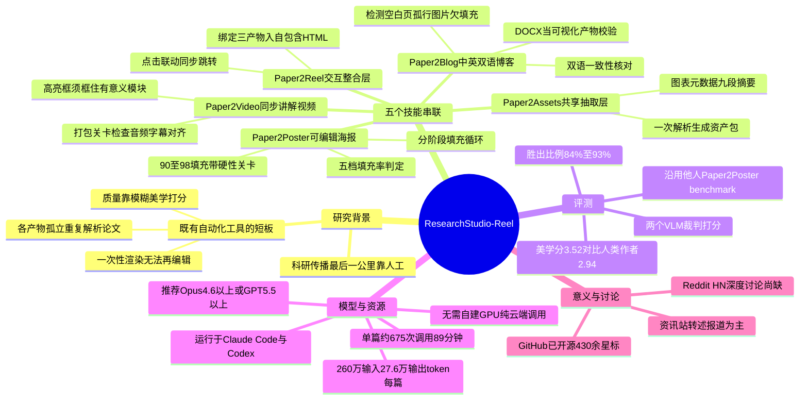

## 一、论文是干什么的？

一篇论文写完发表之后，研究者通常还要把它"翻译"成好几种别的形式来宣传：做一张会议海报、录一段讲解视频、写一篇通俗易懂的博客推文。这个过程被称为科研传播的"最后一公里"，但直到现在，这一步基本靠人工手动完成，费时费力。

以前也有一些自动化工具尝试解决这个问题，但都存在明显短板：每种产物（海报、视频、博客）各自独立生成，每次都要重新从头解析一遍论文，效率低还容易内容不一致；生成的东西往往是"一次性渲染图"，作者拿到手之后没法在PowerPoint或Word里重新打开编辑，等于"能看不能改"；质量好坏还只靠一些偏"感觉分"的AI打分标准，很容易在还有大段内容明显是空的情况下，分数却已经"看起来不错"。

这篇论文由微软研究院主导（联合新加坡南洋理工、新加坡国立、清华、北大等多所高校），提出了一套叫**ResearchStudio-Reel**的工具，用五个可以在Claude Code和Codex这类AI编程助手上运行的"技能包（skill）"，一次性把这"最后一公里"自动化到底——不仅生成海报、视频、博客，而且生成的都是可以重新打开编辑的文件（PowerPoint、Word），还设计了一套"硬性及格线"来确保质量，而不是靠模糊的美学打分蒙混过关。

打个比方：以前的自动化工具像是一个只会"复印"的实习生——你让他做海报，他把论文粗暴地截图排版一下；让他做视频，又从头再看一遍论文重新理解一遍，做出来的东西风格还可能对不上，而且"复印件"没法再改。ResearchStudio-Reel则更像一个专业的科研传播团队：先有一个人统一把论文"吃透"，整理成一份大家都能用的共享素材包，再由三个专业分工的同事分别做海报、做视频、做博客，做完之后主编还要拿一份"验收清单"逐项打勾检查，不合格就退回重做，最后再有人把海报、视频、博客拼成一个可以互相跳转的网页。

## 二、核心方法与创新

系统由五个技能组成，串联成一条完整的生产流水线：

- **Paper2Assets（共享抽取层）**：论文只被完整解析一次，抽取出图表、元数据、结构化的九段式摘要、每个章节的编号、图注handle、论点锚点等信息，打包成一份"资产包"，供后面三个生成器复用——避免了每个生成器各自重复解析论文、内容互相打架的问题。
- **Paper2Poster（生成可编辑海报）**：产出可以在PowerPoint里直接打开编辑的海报。核心机制是"分阶段填充循环"：给每个版面区块计算一个"填充率"（内容高度÷卡片高度），分成五档——太空(<70%)、偏空(70%-90%)、刚好(90%-100%，目标区间)、溢出(100%-110%)、严重溢出(>110%)，每种情况触发对应的自动修复动作（缩小内容、扩写文字、换更合适的图等），反复循环直到所有区块都落在"刚好"区间才允许交付。出稿前还有一道强制关卡：所有区块必须落在90%-98%的填充带内、不能有空版也不能有溢出、图片至少要占据其所在卡片一个方向70%的面积，任何一项不达标都不允许交付。
- **Paper2Video（生成同步讲解视频）**：出片前有"打包关卡"检查——是否缺音频、字幕是否为空、高亮框是否畸形、画面和音轨时间轴是否对齐、有没有空白帧等，且高亮框必须真正框住有意义的图表/模块，而不是随便框住一两个零碎的词。
- **Paper2Blog（生成中英双语博客）**：把生成的Word文档当作一个"可视化产物"来校验——检测图片是否因排版挤压被推到下一页（其实稍微缩小一点就能放下）、是否有孤零零吊在页尾的段落等版式问题；在严格模式下还会把文档渲染成图片，检测有没有大片近乎空白的页面；此外还会比对中英文两个版本，确保插图数量、顺序、关键数字、术语翻译前后一致。
- **Paper2Reel（交互式整合层）**：把海报、视频、博客三样东西绑定进一个自包含的HTML网页查看器，用户点击其中任意一段内容（比如视频里的某一句话），页面会自动把视频进度、幻灯片、字幕和博客对应段落一起同步跳转过去。

## 三、使用了哪些模型和计算资源？

这篇论文在"用什么LLM、什么计算资源"这两点上信息相对透明，因为它本身就是围绕Claude Code和Codex构建的：

- **运行载体**：不是自己搭建裸API调用管线，而是把五个技能实现为**Claude Code**（Anthropic官方的命令行AI编程助手）和 **OpenAI Codex** 可以直接读取执行的"技能包"（thin agent-readable contracts），本质上是驾驭这些通用编程Agent去完成科研传播这个具体任务。
- **推荐模型版本**：官方GitHub仓库建议使用 Claude Opus 4.6 及以上，或 GPT-5.5 及以上版本；论文正文/评测环节实际使用的评测裁判模型包括claude-opus-4.8、GPT-5.5、Gemini-3.1 Pro等（不同来源引用的版本号略有出入，可能存在模型迭代或转述差异，建议以论文原文为准）。
- **单篇论文处理成本**（据论文数据）：完整跑完全部四个产物（海报+视频+博客+交互整合），大约需要调用 **675次** turn（Paper2Assets约112次、Paper2Poster约166次、Paper2Video约193次、Paper2Blog约112次、Paper2Reel约92次），墙钟耗时约 **89分钟/篇**（三个生成器可以并行执行以缩短实际等待时间），Token消耗约为 **260万输入token、27.6万输出token/篇**（其中大部分输入是可复用的缓存上下文，按较低价格计费）。论文和项目页均**未给出具体的美元成本数字**，需要读者自行按当时的API定价换算。
- **GPU需求**：完全不需要自建GPU，本地只需运行Python脚本和CLI工具，所有推理都在云端由Claude Code / Codex完成。
- **开源情况**：代码已开源，[microsoft/ResearchStudio](https://github.com/microsoft/ResearchStudio)（MIT协议），抓取时约有430余颗star、23个fork。

## 四、实验结果

论文使用业内已有的"Paper2Poster benchmark"（100篇论文的论文-海报配对基准，来自其他团队此前的工作，并非本文自己提出）来测试生成的海报质量，用两个独立的多模态大模型（claude-opus-4.8和gpt-5.5）打分。结果显示，ResearchStudio-Reel生成的海报在美学与信息量各项子指标上全面领先此前的自动化系统和单次生成的前沿大模型，甚至在多数论文上超过了作者本人手工制作的海报，按论文统计，整体胜出比例在84%到93%之间（依对比对象不同而变化），美学得分为3.52分（满分5分），高于人类作者基准的2.94分。

对比对象覆盖三类：单次生成型前沿LLM直接做海报、此前的自动化pipeline系统（如原版Paper2Poster工具/PosterAgent等）、以及论文作者本人制作的海报。ResearchStudio-Reel在这三类对比中都取得了领先，其中最值得注意的是相对"作者本人海报"这一人类基准也取得了多数论文的胜出，说明其海报质量已经达到甚至超过了部分人工制作水平。

## 五、潜在应用与已落地应用

- **应用价值**：对科研人员而言，这意味着一篇论文定稿之后，只需要提供PDF文件，就能自动获得一整套宣传物料——可以在PowerPoint里继续微调的海报、配好音轨和字幕的讲解视频、排版妥当的中英双语博客，以及一个可以点击联动的网页展示页，省去了过去大量重复性的人工制作劳动。
- **已经开源可用**：项目已在GitHub公开发布并附带详细文档，任何拥有Claude Code或Codex访问权限的研究者理论上都可以直接尝试使用（需要注意，这依赖于Claude/Codex的模型订阅或API访问，并非一个可以完全离线运行的独立软件）。
- **实际试用情况**：目前只查到AI资讯类网站（如AI Weekly）对该项目的转述性报道，尚未发现独立第三方（非官方）撰写的详细实测复现或深度使用体验报告。

## 六、网络上的讨论与评价

多次搜索"ResearchStudio-Reel"、"Paper2Poster Paper2Video Paper2Blog"等关键词，**未找到**该论文在Reddit或Hacker News上的专门讨论帖；Twitter/X上搜索到的相关讨论主要是2025年发布的**前作**（即本文所依赖的评测基准"Paper2Poster"及其原始论文）当时的社区反应，而非本文（ResearchStudio-Reel）本身引发的讨论。目前可确认的公开报道包括AI资讯站AI Weekly的一篇转述报道（标题类似"微软研究院联合NTU/NUS/A*STAR发布ResearchStudio-Reel，在84%-93%的论文上超越作者本人海报"），以及GitHub趋势统计站trendshift.io收录了该仓库的关注度数据。总体来说，该项目主要通过官方渠道和资讯站转述获得曝光，尚未在主流社区（Reddit/HN）形成独立的深度讨论。

## 七、思维导图

