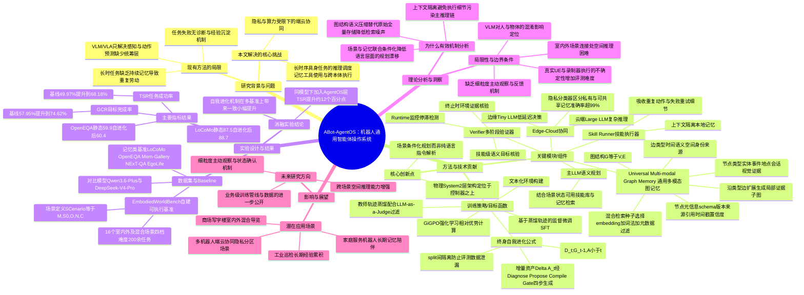

## 一、论文是干什么的？

想象你雇了一个新来的家政机器人。它能听懂话、能走路、能抓东西，但每次执行任务都像失忆一样：昨天你告诉它"钥匙放在玄关抽屉里"，今天它完全不记得，还得重新找一遍；执行"去客厅把杯子拿来"这种任务时，它走两步撞到桌子腿也不知道该重新规划还是硬撞；任务做到一半失败了，也没人告诉它哪里错了、以后该怎么改进。

这篇论文要解决的正是这个问题：现在的机器人大多依赖视觉-语言模型（VLM）或视觉-语言-动作模型（VLA）来"看懂"和"动手"，但缺一个像电脑操作系统一样的中间层——负责统筹规划、记忆、验证、任务调度，让机器人在长时间、多任务的真实环境里持续可靠地工作，并且能把每次的经验积累下来变成"记忆"，越用越聪明。作者提出的 ABot-AgentOS，就是这样一个搭在底层控制器之上的"智能体操作系统"（Agent OS），类似于给机器人的"大脑"加装了一层负责统筹调度和记忆管理的系统软件，而不是又造一个新的感知或动作模型。

## 二、核心方法与创新

可以把 ABot-AgentOS 理解成给机器人配了一个"项目经理 + 执行工人 + 质检员 + 备忘录本"的四件套团队：

**1. 场景条件化任务规划（Scene-Conditioned Planning）**
传统的语言模型规划任务时，往往只根据"你说的话"来拆解步骤，容易脱离实际情况——就像你让一个只听你说话、不看现场的项目经理来安排装修任务。ABot-AgentOS 里的主 LLM 在规划时，会同时参考当前"看到的场景状态""手头可用的技能库"和"过去的记忆"，相当于项目经理边看工地现场边排计划，而不是闭着眼睛纸上谈兵。

**2. 上下文隔离的技能执行（Context-Isolated Skill Execution）**
执行具体动作（比如"绕过桌子走到冰箱"）的过程中会产生大量琐碎细节：走错路、重试、微调姿态等。如果这些细节全部塞进主脑的"思考记忆"里，会把主脑搞得很乱、决策变慢。论文设计了一个"技能执行器（Skill Runner）"，专门用独立的、临时的小本子记录这些执行细节，执行完就把结果汇报给主脑，中间的"脏活累活"不打扰主脑的思路——类似工地上的工人自己处理施工细节，只跟项目经理汇报"完成了"或"卡住了"。

**3. 多阶段验证（Multi-Stage Verification）**
论文设置了一个"验证员（Verifier）"角色，在三个阶段把关：运行中检查有没有原地打转（Runtime 监控）、技能完成后检查是不是真的达成了语义目标（技能级验证）、任务结束时用环境中的实际证据核实终止条件是否满足（终止验证）。这相当于质检员不是只在竣工时验收一次，而是全程巡查、阶段验收、最终验收三重把关，避免"机器人以为做完了但其实没做完"的假阳性。

**4. 通用多模态图记忆（Universal Multi-modal Graph Memory）**
这是本文最核心的创新。传统做法是把每次对话、每帧画面原封不动地存下来，时间一长记忆库爆炸、检索又慢又不准。作者把对话、视觉观察、空间位置、时间关系、任务轨迹统一转换成"节点（Node）"和"边（Edge）"构成的图结构，用数学表示为 $\mathcal{G}=(\mathcal{V},\mathcal{E})$：节点代表实体、事件、地点、会话、视觉证据等，边代表节点之间的时间先后、语义关联、空间位置、身份归属、来源可溯等关系。每个节点还带有版本号、来源引用、时间戳、证据摘要、置信度等元信息，方便日后追溯"这条记忆是什么时候、从哪来的、有多可信"。检索时不是简单的关键词匹配，而是先用向量相似度、关键词匹配、元数据过滤等混合方式选出"种子节点"，再沿着与当前任务相关的边扩展出一个局部的"证据子图"，而不是零散地拼凑几条互不相关的片段——这就像人回忆往事时，会顺着一个线索联想出一整段相关的场景，而不是干巴巴地背几条孤立的句子。

**5. 端云协同（Edge-Cloud Collaboration）**
机器人本地（边缘端）跑一个轻量的小模型（Tiny LLM），负责每一轮交互里快速、低延迟的决策；遇到复杂问题再上报给云端的大模型处理。同时记忆也分两部分：机器人私有的、涉及具体家庭隐私的记忆存在本地边缘端，可以共享的公共知识才同步到云端，论文提到这套隐私分类机制识别"某条记忆是否适合同步到云端"的准确率超过 99%。

**6. 终身自我进化（Lifelong Self-Evolution）**
系统会分批次（split）运行任务，出现失败后，会诊断失败原因、生成经验教训，但这些"教训"只能应用到未来批次的任务上，绝不能用来"抄答案"影响当前批次的评测——用公式表示是 $\mathcal{T}_t, G_t=\mathrm{Run}(\mathcal{D}_t; G_{t-1}, A_{<t})$，新增经验 $\Delta A_t=\mathrm{Gate}(\mathrm{Compile}(\mathrm{Propose}(\mathrm{Diagnose}(\mathcal{T}_t))))$。这保证了"越用越聪明"是真实的能力提升，而不是提前看到了考题。这些经验被存成结构化的 JSON 规则（而不是直接生成可执行代码去运行），涉及记忆写入方式、证据挑选策略、答案组织方式、时间信息标准化等方面的改进。

## 三、使用了哪些模型和计算资源？

- 主规划模型（Main LLM）：论文对比测试了 **Qwen3.6-Plus**（作为基线）和 **DeepSeek-V4-Pro**（作为更强的主模型）。
- 视觉理解模型：**Qwen3-VL-Plus**，用于处理视觉观察相关任务。
- 边缘端模型：论文提到会在边缘设备上运行一个"轻量 Tiny LLM"，但未给出具体模型名称或参数规模。
- 具体参数量：论文全文未披露以上模型的参数规模。
- GPU 型号、数量：论文未给出任何具体的 GPU 型号或数量信息。
- 训练/推理耗时：论文未给出训练一个 epoch 或跑一次完整实验所需的具体时间。
- 训练管线方面，论文提到使用了文本化环境构建、教师轨迹蒸馏（结合 LLM-as-a-Judge 过滤）、基于蒸馏轨迹的监督微调，以及使用 GiGPO（一种相对优势计算的强化学习方法）进行强化学习，但强调这部分"面向业务部署"，相关的私有数据和生产环境结果并未公开。

综上，计算资源和具体训练时长方面，论文暂无相关信息公开。

## 四、实验结果

论文自建了一个名为 **EmbodiedWorldBench** 的可执行评测基准，覆盖 16 个室内、室外及混合场景，超过 200 个任务，涵盖导航、物品搜索、NPC 对话、动态指令响应等能力，用任务成功率（TSR，全部子目标和终止条件都满足）和目标完成率（GCR，达成的子目标占比）两个指标衡量。

**Agent 层面结果（EmbodiedWorldBench 子集）：**

| 配置 | TSR | GCR |
|---|---|---|
| Qwen3.6-Plus 基线（ReAct 方式） | 49.97% | 57.95% |
| ABot-AgentOS + Qwen3.6-Plus | 61.96% | 68.79% |
| ABot-AgentOS + DeepSeek-V4-Pro | 68.18% | 74.62% |

也就是说，在使用同一个底层模型的前提下，套上 ABot-AgentOS 这套系统后，任务成功率提升了约 12 个百分点，目标完成率提升了约 10.8 个百分点——相当于同一个"员工"换了套更好的工作流程和记忆本子，办事效率明显提高。

**记忆系统层面结果（多个记忆类基准）：**

| 基准 | 静态记忆得分 | 加入自我进化后得分 |
|---|---|---|
| LoCoMo | 87.5 | 88.7 |
| OpenEQA（EM-EQA） | 59.9 | 60.4 |
| Mem-Gallery | 88.6 | 89.0 |

此外在 NExT-QA 上 Acc@All 达到 76.5，在 EgoLife 上也单独报告了结果。整体上可以看出，加入"终身自我进化"机制后，各项记忆相关指标都有小幅但一致的提升，说明系统确实能从失败案例中学到东西并应用到后续任务，而不是原地踏步。

## 五、潜在应用与已落地应用

**潜在应用场景：**
- 家庭服务机器人：记住家里物品摆放位置、家庭成员习惯，长期陪伴式服务。
- 商场/写字楼导览机器人：结合室内外混合场景地图，进行长时间导航和对话式引导。
- 工业巡检机器人：长时间在同一场地反复巡检，累积经验、识别异常。
- 需要多机器人/多终端协同、且要考虑隐私分区（哪些信息可以上云共享、哪些必须留在本地）的场景。

**已落地/开源情况：**
项目已在 GitHub 开源，仓库地址为 [amap-cvlab/ABot-AgentOS](https://github.com/amap-cvlab/ABot-AgentOS)，由阿里巴巴高德地图计算机视觉实验室（AMAP CV Lab）维护。截至撰写本综述时，仓库星标数约为 10，提交记录较少（约 2 次），README 内容相对简略，具体代码和文档完整度有限，属于刚刚公开的早期阶段项目，暂未看到面向公众的产品化落地案例。

## 六、网络上的讨论与评价

该论文在 Hugging Face 论文页面获得了 82 个点赞，并在 2026 年 7 月 14 日当天位列 Hugging Face"每日论文"第 3 名，说明在 AI/机器人研究社区内受到了一定关注。此外还被 BItwiki、Paperium 等论文摘要聚合站收录并生成了简介条目，以及被一份中文科技资讯简报（Buttondown 的"趋势"栏目）提及。但目前没有搜索到 Twitter/X、Reddit 等社交平台上的深入讨论帖，也没有找到独立博客或权威媒体的详细评测文章，整体来看社区讨论主要停留在"论文页面点赞与转发摘要"层面，暂无广泛的技术圈深入评价或争议讨论。

## 七、思维导图

