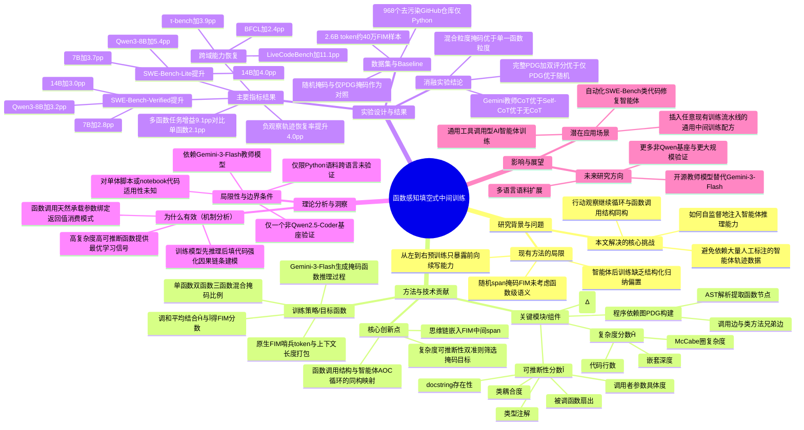

## 一、论文是干什么的？

想象你在教一个学徒修车。传统的教法是让他从头到尾顺着看维修手册，一步步学怎么装配零件——这就像现在大多数代码大模型的训练方式：从左到右预测下一个词，读代码从第一行读到最后一行。但真正修车的时候，师傅经常是这样工作的：先看一眼故障灯（这是"观察"），再决定拧哪个螺丝（这是"行动"），然后根据拧完之后的反馈决定下一步该干什么。这种"行动—观察—再行动"的循环，恰恰是编程智能体（比如自动修 bug、自动写代码的 AI 助手）真正工作的方式，而不是简单地从头写到尾。

问题在于：现有的代码大模型主要是通过"从左到右阅读代码"来预训练的，这种方式很少专门训练模型如何把"外部工具返回的结果"揉进正在进行的推理里。换句话说，模型擅长"写连续的代码"，但不太擅长"根据一个函数调用返回的结果，继续把后面的代码补完"。这篇论文的作者发现了一个巧妙的类比：函数调用本身——调用者传参数、被调用的函数处理并返回一个值、后续代码使用这个返回值——这个结构，和编程智能体的"行动—观察—继续"循环，在结构上是同构的（一模一样的模式）。既然如此，能不能利用海量已有的普通代码里的"函数调用"结构，来专门训练模型学会这种"根据返回结果继续推理"的能力，而不需要额外造大量的智能体交互数据？这就是本文要解决的核心问题。

## 二、核心方法与创新

论文提出了一种叫做"函数感知填空训练"（Function-Aware Fill-in-the-Middle，简称 FIM）的方法，插在预训练和最终的智能体强化学习/微调之间，作为一个"中间训练"（mid-training）阶段。可以把它理解成：在正式训练学徒修车之前，先做一轮"补全练习"——把维修手册里的某些关键步骤挖空，让学徒根据前后文猜出这一步该怎么做，而且要挑那些"信息量大、有推理价值"的步骤挖空，而不是随便挖。

具体做法分几步：

1. **画出代码的"依赖关系图"（Program Dependency Graph，PDG）**：先把代码解析成抽象语法树（AST），提取出所有函数节点，并画出函数之间的调用关系和同类方法之间的兄弟关系。这就像画一张"零件之间谁依赖谁"的关系图。

2. **给每个函数打两个分数**：
   - **复杂度分数（Ĥ）**：综合代码行数、圈复杂度（McCabe cyclomatic complexity，衡量代码分支多少的指标）、嵌套深度算出来，代表这个函数"内容有多丰富、值得学"。
   - **可推断性分数（Î）**：综合调用者传参数的具体程度、被调用函数的"扇出"（被多少地方调用）、类型注解、文档字符串（docstring）、类之间的耦合程度这五个线索，代表"根据上下文，这个函数能不能被合理地猜出来"。

   打个比方：如果一个函数被挖空后，光看上下文完全无从下手（比如变量名毫无意义、没有文档），那挖空它对训练没有帮助，反而是在逼模型"瞎蒙"；但如果函数虽然复杂但上下文线索充足，挖空它就是绝佳的训练素材。

3. **两个分数用调和平均数结合**，并加一个"难度惩罚项"ρ(Δ)，专门压低那些"太难学不会"的目标，确保训练集里挖空的都是"有价值又能学会"的函数。

4. **加入思维链（Chain-of-Thought）增强**：用 Gemini-3-Flash 模型为每一个被挖空的函数生成一段"如何一步步推导出这个函数"的解题过程，并把这段推理文字直接嵌入到填空的"中间span"里。也就是说，模型不是直接学"填什么代码"，而是先学"怎么想"，再学"想完了写什么代码"。这一步筛选后保留了大约 40 万条高质量样本。

5. **训练时打包成模型原生的上下文长度**，用模型自带的 FIM 特殊标记（sentinel tokens）来标注"这里是空缺，请填写"，让模型在正常预训练的续写能力基础上，专门强化"利用前后文补全中间关键推理片段"的能力。

这套方法的巧妙之处在于：它完全是自监督的（不需要人工标注的智能体交互数据），却利用了普通开源代码里天然存在的"函数调用"结构，来教会模型智能体所需要的"处理返回结果、继续推理"的核心能力,而且这个能力后续被证明可以迁移到非编程的工具使用场景。

## 三、使用了哪些模型和计算资源？

**基础模型（LLM）：**
- Qwen2.5-Coder-Instruct 7B 和 14B
- Qwen3-8B

**教师模型（用于生成思维链）：**
- Gemini-3-Flash（用于给挖空的函数生成推理过程）

**训练数据：**
- 968 个经过去污染处理的 GitHub 仓库（全部为 Python 代码）
- 约 26 亿（2.6B）token
- 约 40 万条 FIM 训练样本，其中 32 万条为单函数挖空、6 万条为双函数配对挖空、2 万条为三函数挖空

**后训练（智能体微调）管线：**
- R2E-Gym、SWE-Smith（应用于 Qwen2.5-Coder）
- SWE-Lego（应用于 Qwen3-8B）

**计算资源（GPU 型号、数量）：** 论文正文及可获取的附录内容中没有明确列出具体的 GPU 型号、数量或总训练时长等硬件细节，暂无相关信息。

**训练/实验耗时：** 论文中没有给出中间训练阶段或每次实验具体花费的时间（如小时数、epoch 数对应时长），暂无相关信息。

## 四、实验结果

简单来说：在原有的智能体训练流程前面，先加上这个"函数感知填空"的中间训练步骤，模型在修 bug（SWE-Bench）等任务上的表现都有明显提升，而且几乎不损失原本的通用编程能力，甚至在一些原本会"变差"的能力上还有所恢复。

**智能体核心任务提升（SWE-Bench）：**

| 模型 | 测试集 | 提升幅度 |
|------|--------|----------|
| Qwen2.5-Coder 7B | SWE-Bench-Verified | +2.8 个百分点 |
| Qwen2.5-Coder 7B | SWE-Bench-Lite | +3.7 个百分点 |
| Qwen2.5-Coder 14B | SWE-Bench-Verified | +3.0 个百分点 |
| Qwen2.5-Coder 14B | SWE-Bench-Lite | +4.0 个百分点 |
| Qwen3-8B | SWE-Bench-Verified | +3.2 个百分点 |
| Qwen3-8B | SWE-Bench-Lite | +5.4 个百分点 |

**能力保留/恢复（以 14B 模型 + R2E-Gym 流程为例）：**

智能体微调往往会让模型在其他任务上的能力有所"退化"（能力侵蚀），而加入这个中间训练阶段后：
- LiveCodeBench（代码能力）：恢复 +11.1 个百分点
- BFCL（函数调用基准）：恢复 +2.4 个百分点
- τ-bench（工具使用基准）：恢复 +3.9 个百分点

值得注意的是，训练语料只包含 Python 代码,却能让模型在这些"跨领域"（比如工具调用、非编程任务）的基准上也表现更好，说明这种"函数调用结构"带来的能力是可以迁移的。

**关键行为发现：**
- 在那些"包含负面观察结果"（也就是中途出错、需要根据错误反馈调整策略）的任务轨迹中，成功率从 24.8% 提升到 28.8%（+4.0 个百分点），这直接印证了论文的核心假设——训练确实增强了模型"处理返回结果并继续推理"的能力。
- 需要跨多个函数修改的任务，提升幅度达到 +9.1 个百分点，远高于只需修改单个函数的任务（+2.1 个百分点），说明这个方法尤其擅长解决"结构上匹配"（即涉及多函数调用关系）的问题。

**消融实验（去掉某个组件后效果如何）：**
- 思维链来源：不用思维链只有 +1.18 个百分点提升；用模型自己生成的思维链（Self-CoT）能恢复到 +1.68；用 Gemini-3-Flash 生成的思维链效果最好，达到 +2.43。
- 挖空目标选择算法：随机挖空得分 13.95（最差）；只用依赖图（PDG）挖空得分 14.85；完整方法（PDG + 复杂度分数 + 可推断性分数）得分 15.60（最好）。
- 挖空粒度：只挖单个函数得分 15.60；按 80%单函数/15%双函数/5%三函数的比例混合挖空得分 16.10（最优）。

## 五、潜在应用与已落地应用

**潜在应用场景：**
- 自动修复代码 bug 的智能体（如自动化的 SWE-Bench 类工具）
- 需要调用外部工具、API 或函数并根据返回结果继续推理的通用 AI 智能体（不仅限于编程，还包括工具调用类任务）
- 代码补全与代码理解类产品，尤其是需要理解跨函数依赖关系的场景
- 作为一种通用的"中间训练"配方，可以插入到任意现有的代码大模型训练流水线中，作为智能体后训练之前的一个"预热"步骤

**已落地应用案例：** 目前论文本身及公开检索结果中，没有找到明确的开源代码仓库或已上线产品案例，暂无相关信息。论文作者中包含来自 Verdent AI 的成员，但没有检索到该公司或其他机构已将此方法应用于具体产品的公开信息。

## 六、网络上的讨论与评价

通过检索论文标题关键词及 arxiv 编号,只找到了论文本身（arxiv 摘要页、HTML 全文页）以及少量搜索引擎索引到的相关工作（如同类的 Fill-in-the-Middle 代码训练研究,例如 Structure-Aware Fill-in-the-Middle Pretraining for Code 等）,没有找到 Twitter/X、Reddit 或博客上的广泛讨论。该论文提交时间非常新（2026 年 7 月 14 日提交,7 月 16 日修订),暂无广泛讨论。

## 七、思维导图

