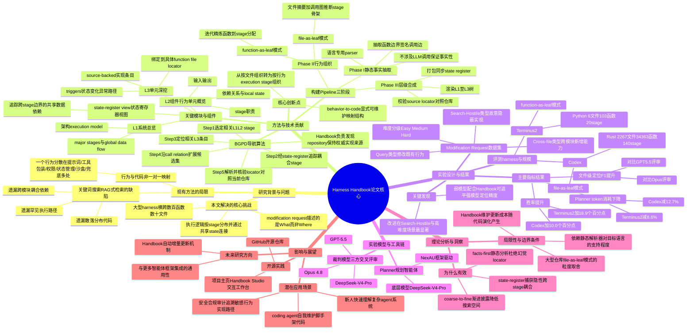

## 一、论文是干什么的？

想象你接手了一个别人写了三年的超大型项目——这个项目就是所谓的「Agent Harness」（智能体脚手架），也就是驱动一个AI智能体运行的那套软件：它负责拼接提示词、管理对话状态、调用各种工具、决定什么时候执行、什么时候收尾。现在产品经理跟你说："我们希望智能体在删除文件前先问一下用户"。这句话听起来很简单，但实际上，"询问是否删除"这个行为可能分散藏在提示词模板里、工具调用的包装函数里、权限检查模块里、状态管理逻辑里、沙盒执行代码里、还有失败后的兜底逻辑里——散落在成百上千个函数、几十个文件当中。你要改对地方，得先把这些藏在各处的碎片全部挖出来，稍微漏掉一处，改出来的效果就会不对，甚至引入新bug。

这就像你想给一栋没有图纸的老房子加装一个新水龙头，得先把墙里的水管走向摸清楚——可现实是没人给你留下图纸，你只能一根根管子敲墙去猜。论文里说的核心痛点就是：现有的做法是"看代码猜行为"，模型或者人类只能靠读代码、搜关键词去拼凑一个行为到底是怎么实现的，既慢又容易漏掉分散、很少被执行到的、或者跨模块耦合的代码位置。而随着模型和产品需求不断变化，这类脚手架代码需要频繁修改，"该改哪里"比"怎么改"更成为瓶颈。

论文提出的解决办法叫「Harness Handbook」（脚手架说明书），相当于自动给这栋"老房子"画一张按房间功能（而不是按砖头位置）组织的水电图纸，让开发者或者AI智能体一眼就能定位到该动哪根管子。

## 二、核心方法与创新

论文的核心创新可以概括为"从按文件组织，改成按行为组织"，再加上一套"逐层收窄"的查阅流程。

**1. 三层文档结构（L1-L3）**

普通代码库是按文件、目录组织的，但一个"行为"往往横跨很多文件。Harness Handbook反其道而行，按照代码运行时的"执行阶段"来组织：

- **L1（系统总览）**：描述整个智能体从接收请求到给出结果的整体架构、主要执行阶段和全局数据是怎么流动的，相当于房子的总平面图。
- **L2（组件/行为单元概览）**：把系统拆成一个个"行为单元"（比如"权限校验""工具调用""失败重试"），说明每个单元负责什么、输入输出是什么、依赖谁，相当于每个房间的功能说明。
- **L3（实现深挖）**：具体到每个行为单元背后对应哪些函数、哪些代码位置、触发条件、状态变化、异常路径，并且每一条描述都要能对应到真实源代码证据（不是模型瞎编的），相当于图纸上标注的具体管线走向和阀门位置。

此外还有一个**状态寄存器视图（state-register view）**，专门追踪那些跨越多个执行阶段、被不同模块共享读写的数据（比如一个"是否已经确认删除"的状态标志），因为这类耦合最容易被漏掉。

**2. 三阶段自动构建流程**

Handbook不是靠人工写文档，而是自动生成的，分三步：

- **阶段一：静态事实抽取**——用编程语言专用的解析器（不调用任何LLM）把代码中的函数边界、函数签名、调用关系抽成一张"程序图"，保证抽出来的都是"铁一般的事实"，不会有幻觉。
- **阶段二：行为组织**——把这些函数/文件归类到不同的"执行阶段"里。论文提供两种模式："函数即叶子"模式（适合小型代码库，逐个函数细化归类）和"文件即叶子"模式（适合超大型代码库，先给文件做摘要，再通过调用图推断整体阶段骨架），这是为了在准确度和处理超大代码库（几万个函数）的效率之间做取舍。
- **阶段三：层级合成**——把上一步的阶段划分渲染成正式的L1-L3文档树，并且逐条核对每一个"源码定位符"是否真的能对应到仓库里的实际代码，把不实的描述过滤掉，最后把状态寄存器视图同步打包进去。

**3. Behavior-Guided Progressive Disclosure（行为引导式渐进披露，简称BGPD）**

这是配套的"查阅/定位"算法,好比一个智能导航流程：

1. 先从L1/L2里挑出跟这次修改请求相关的执行阶段（"这次改动大概涉及房子的哪几个房间"）；
2. 再通过状态寄存器视图，把因为共享状态而被"隐性牵连"的其他阶段也拉进来（"这个房间的水管其实和隔壁房间是连通的"）；
3. 在选中的阶段里找到具体相关的L3条目（"具体是哪根管子"）；
4. 沿着函数调用关系再往外扩展候选集合，防止漏掉调用链上的相关代码；
5. 最后把所有候选定位符跟当前实际仓库代码再核对一遍，确保不是过时或者虚构的位置。

这个设计的巧妙之处在于"先粗后细"——不用一上来就在几万个函数里地毯式搜索，而是先靠行为地图缩小范围，再精确定位，因此比传统的"关键词搜索/RAG式检索"更省token、更不容易漏掉"藏得很深、很少执行、跨模块耦合"的代码（论文专门测试了这类"搜索敌对/Search-Hostile"场景）。

## 三、使用了哪些模型和计算资源？

根据论文全文内容：

- **规划智能体（Planner）**：基于内部框架 NexAU 构建，底层驱动模型为 **DeepSeek-V4-Pro**。
- **评审/打分模型**：由三个模型独立评审生成的修改方案质量，分别是 **GPT-5.5**、**Opus 4.8**、**DeepSeek-V4-Pro**（三者互相印证，减少单一裁判的偏差）。
- **Handbook构建阶段**：静态事实抽取阶段不使用LLM，只用语言专用的解析器；行为组织与层级合成阶段使用LLM辅助结构化整理（论文未明确点名具体用于该环节的模型型号，可能沿用同一套模型）。
- **计算资源（GPU型号、数量等）**：全文未提及具体GPU型号、显卡数量或本地算力细节，实验主要通过调用上述大模型的API完成，暂无相关信息。
- **训练/实验耗时**：本论文中的方法不涉及模型训练（Handbook是静态分析+LLM辅助生成的中间产物，不是训练出来的模型），因此不存在"训练一个epoch需要多久"这类概念；论文也未给出构建单个Handbook或跑完一次完整实验所需的具体时间（如小时数），暂无相关信息。

## 四、实验结果

论文选取了两个真实的开源智能体脚手架代码库进行测试：

| 项目 | 语言 | 规模 | 组织模式 |
|------|------|------|----------|
| Terminus-2 | Python | 6个源文件，103个内部函数，20个执行阶段 | 函数即叶子 |
| Codex | Rust | 2267个文件，34363个内部函数，140个执行阶段 | 文件即叶子 |

每个代码库配套设计了30条真实的修改请求，按类型分为三种：**Query（修改已有行为）**、**Cross-file（新增跨模块能力）**、**Search-Hostile（实现位置故意藏得很深、很难搜到）**；难度分为简单（单点修改）、中等（需要协调多处修改）、困难（存在间接耦合）三档。

关键结果（使用Handbook辅助 vs 不使用）：

| 指标 | Codex | Terminus-2 |
|------|-------|-----------|
| 修改方案胜率提升 | 38.3% vs 28.3%（+10.0个百分点） | 45.6% vs 26.7%（+18.9个百分点） |
| 规划阶段token消耗降低 | -12.7% | -8.6% |
| 文件级定位F1对比Opus评审 | +15.2个百分点 | +10.6个百分点 |
| 文件级定位F1对比GPT-5.5评审 | +5.0个百分点 | +12.8个百分点 |

用大白话说：给智能体配上这本"说明书"之后，它在改代码之前能更准地找到该改哪些文件（定位准确率明显提升），生成的修改方案质量评审胜率也更高（提升10-19个百分点），而且反而更省token（规划过程消耗减少约9-13%）。论文还提到一个有意思的发现：用了Handbook之后，**较弱的模型也能在代码定位准确度上追平较强的模型**，说明这套"地图"本身能弥补模型能力上的差距。改进在所有请求类型和难度等级上都比较一致，其中"Search-Hostile"（故意藏得很深的实现）这类场景提升幅度最大，这也印证了Handbook确实解决了"分散、少执行、跨模块耦合"这一核心痛点。

## 五、潜在应用与已落地应用

**潜在应用场景：**

- 大型编码智能体（coding agent）在维护、升级自身脚手架代码时，用Handbook做"改前地图"，减少改漏、改错的概率；
- 团队新人接手复杂智能体系统代码库时的入职学习工具；
- 代码审计/安全审查场景，用行为地图追溯某个敏感操作（比如文件删除、权限提升）具体由哪些代码路径实现，做合规审查；
- 作为AI编码助手（如Claude Code、Codex CLI一类工具）的底层辅助模块，在执行"重构""加功能"类任务前先自动生成/复用行为地图，提升定位准确率并降低token开销。

**已落地的项目/代码：**

- 论文项目主页：[Harness Handbook — Making Agent Harnesses Understandable, Auditable & Editable](https://ruhan-wang.github.io/Harness-Handbook/)
- 开源代码仓库：[github.com/Ruhan-Wang/Harness_Handbook](https://github.com/Ruhan-Wang/Harness_Handbook)
- 项目主页提到配套有一个交互式工具「Handbook Studio」，可以连接一个代码仓库、自动生成三层说明书，并在同一个行为地图上阅读、核验、提出修改建议。

## 六、网络上的讨论与评价

通过网络搜索，除了论文自身的 arXiv 页面、HuggingFace Papers 页面和作者搭建的项目主页/GitHub仓库外，暂未搜索到 Twitter/X、Reddit 等平台上关于本论文的广泛讨论或第三方博客评测。检索中发现同一时期（2026年6-7月）arXiv上出现了多篇主题相近的"Agent Harness"研究（如《Rethinking the Evaluation of Harness Evolution for Agents》《Self-Harness: Harnesses That Improve Themselves》《Agentic Harness Engineering》等），说明"如何让智能体脚手架本身可维护、可进化"是当前一个受关注的研究方向，但尚未找到专门针对本论文的独立评价或深入讨论内容，暂无广泛讨论可供转述。

## 七、思维导图

