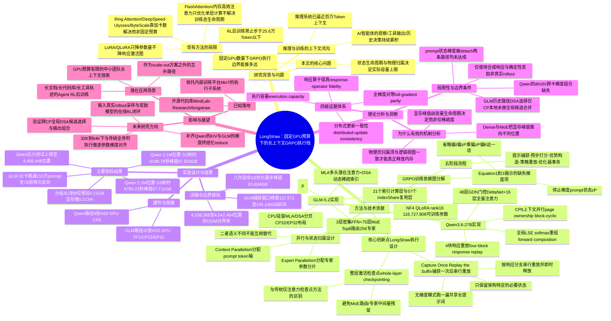

## 一、论文是干什么的？

这篇论文关注一个很现实的矛盾：现在的大模型推理（inference）已经可以轻松处理上百万Token的上下文，比如让模型读一整本书或者一堆工具调用记录；但当我们要用强化学习（RL）去训练模型、让它在这么长的上下文里变得更聪明时，训练所用的上下文长度往往还停留在25.6万Token左右，远远跟不上推理的能力。对于需要不断调用工具、翻文档、积累历史决策的AI智能体（agent）来说，这个差距尤其致命——推理时"脑子"能装下的东西，训练时根本装不下。

打个比方：推理就像让学生做开卷考试，可以把一整套参考书摊在桌上边看边答，看完一页就可以把这页翻过去，不用一直占着桌面；但强化学习训练更像是要求学生把这堆参考书内容全部记在脑子里，还要同时对好几种不同的答题思路（response）逐一打分、逐一修改，每种思路都要能追溯回参考书的具体内容。这就要求"桌面"（GPU显存）同时摆开参考书全文、外加好几份答案草稿的完整计算过程，显存自然扛不住。

论文的目标不是造更大的GPU集群去硬扛，而是问一个"抠门"的问题：在GPU数量完全固定不变的前提下，通过更聪明的显存管理，训练时的上下文长度到底能推多远？作者给出的答案是：可以推到200万Token以上，用的还是常规的8张或32张GPU。

## 二、核心方法与创新

论文提出的系统叫 LongStraw，核心思想只有一句话："只在需要的时候留东西，其余的看完就扔"。具体拆解成三个关键设计：

**1. 共享的长提示词（prompt）只算一遍，而且不留计算图。** GRPO（Group Relative Policy Optimization，组相对策略优化）算法的做法是：给同一个很长的问题（prompt），采样出一组不同的回答（比如2个或8个),再互相比较打分。这些回答共享同一段很长的上文。论文的做法是：先把这段长上文完整地过一遍模型，但是关闭自动求导（autograd），也就是不记录用于反向传播的计算图——就像学生看书只是"扫一遍记笔记"，不需要把每一页翻阅的过程都录像存档。看完之后，只留下"读书笔记"（模型内部需要的状态），把翻书过程中产生的中间数据（临时的注意力打分、前馈网络中间结果等）立刻释放掉。

**2. 不同模型结构，"该留的笔记"完全不一样，作者按架构量身定制。** 论文选了两个差异很大的模型来验证：
- Qwen3.6-27B：64层里有48层是"循环记忆"式的层（GDN，门控DeltaNet），这类层不管上文多长，留下的状态大小是固定的，就像看书只记一个"总结要点"；另外16层是传统的全量注意力（full attention），这类层必须把每个Token的Key/Value都存下来，笔记量随上文长度线性增长。作者把这些KV缓存按页（page）切分，通过8卡的上下文并行（Context Parallel，CP8）分摊存储，还专门把"逻辑上是切片、物理上却占用大块内存"的视图（view）问题解决掉，让释放内存真正生效。
- GLM-5.2：78层全部用MLA（多头潜在注意力，把KV压缩成一个"潜向量"）加DSA（动态稀疏注意力，每个问题只挑最相关的2048个位置计算），其中只有21层需要真正计算这个"挑选"过程，另外57层直接复用邻近层算好的挑选结果（IndexShare）。同时78层里有75层是混合专家（MoE，256个专家，每个Token只激活8个）。这些状态被放到CPU内存里（而不是GPU），训练时哪一层要用就现"搬"哪一层到GPU上，用完立刻搬走，类似于图书馆借书还书，而不是把全套书搬回自己家。

**3. 短回答分支"一次只算一个，算完就扔"（串行重放，serial replay）。** 一组要打分对比的回答（比如8个候选答案），常规做法是同时把8份计算图都摆在显存里，显存需求随回答数量线性增长。LongStraw改成：一次只重建一个回答的计算图，做完反向传播、把梯度累积下来，就立刻释放这份图，再处理下一个。这样显存峰值基本上只取决于"最长的那一个回答"，而不是"回答的总数"。代价是要多花时间去反复"重放"，这也是论文标题里"trading additional replay time for lower GPU memory usage"（用更多重放时间换取更低显存占用）的含义，论文名字"LongStraw"（长麦秆/长吸管）也暗示了这种"细水长流、一点点抽取"的执行方式。

需要特别指出的是，作者在论文中非常坦诚地说明：这套系统目前证明的是"执行能到这一步、跑得通、数值有限不发散"（他们称为execution capacity，执行容量），而不是"分布式梯度完全正确、模型学习效果好"。比如Qwen那条路径里，8张卡的注意力反向传播只对query的梯度做了all-reduce（跨卡同步求和），而Key/Value对应的适配器（LoRA）梯度还没有同步，这意味着目前八张卡上各自独立更新出来的模型参数可能会产生偏差。GLM那条路径里，跨卡的稀疏注意力选择目前还只是"各卡自扫门前雪"（每张卡只在自己拥有的那一部分上文里选Top-2048），还没有做到全局意义上的"从全部200万Token里挑最相关的2048个"。这种"知道自己还差什么、把每一层验证证据都摊开写清楚"的写作风格，是这篇报告的一大特点。

## 三、使用了哪些模型和计算资源？

- **模型**：
  - Qwen3.6-27B：64层解码器，隐藏层宽度5120，48层门控DeltaNet（GDN，循环式注意力）+16层全量注意力（分组查询注意力GQA，24个查询头/4个KV头，头维度256），每层带密集门控前馈网络（SwiGLU，中间宽度17408）。微调方式是NF4 QLoRA，秩16，约1.167亿个可训练参数。
  - GLM-5.2：78层解码器，隐藏层宽度6144，注意力用MLA（多头潜在注意力，64个查询头，KV潜在维度512）+DSA（动态稀疏注意力，32个索引头，每次挑2048个位置），其中21层真正计算索引、57层复用邻近层结果；前馈网络前3层为密集层，后75层为MoE（256个路由专家，Top-8路由+1个共享专家，专家中间宽度2048）。微调方式是rank-8 LoRA。
- **计算资源**：
  - Qwen路径：8张NVIDIA H20 GPU，采用CP8（8路上下文并行）。
  - GLM路径：32张NVIDIA H20 GPU，采用TP1/CP32/EP32/ETP1/PP1的并行布局（32路上下文并行叠加32路专家并行）。
  - 论文明确说明本工作依托内部训练管理系统MinT（Mind Lab, 2026）来管理模型权重、LoRA版本和外层调度，LongStraw是嵌在其训练侧的执行子系统。

**每个完整实验单位耗费的时间：** 论文报告的是"单次执行事务"（一次完整的GRPO更新，包含读长上文、给若干候选回答打分、反向传播、优化器更新一次）的实测时间和显存峰值，都是单次运行的记录，不是多次实验的平均值：

| 场景 | 上下文长度 | 分组大小G | 总耗时 | 其中读长上文耗时 | 显存峰值 |
|---|---|---|---|---|---|
| Qwen，8张H20 | 2,097,152 Token | 2 | 5,198.78秒（约1.44小时） | 4,656.2秒（约占89.6%） | 97.503 GB |
| Qwen，8张H20 | 2,097,152 Token | 8 | 6,785.23秒（约1.88小时） | 4,653.4秒 | 97.711 GB |
| Qwen压力测试，8张H20 | 最高到4,456,448 Token（约446万） | - | 未单独给出 | - | - |
| GLM，32张H20 | 2,097,152 Token（跑通全部78层两次反向传播+终端优化器调用） | 2 | 未给出完整端到端总时长 | - | 每卡112.571–145.148 GB（仅捕获阶段峰值，非全流程峰值） |

关键发现：把回答组从2个增加到8个（增加了6个要单独重放的候选答案），总时间增加了约1586秒，但显存峰值只增加了0.208 GB（约0.213%）——这说明显存占用主要由"读一遍长上文"决定，而不是由"要对比几个候选答案"决定，验证了论文的核心设计目标。此外Qwen的压力测试把上下文一路推到约453.8万Token（4,538,368）才开始在下一个4096长度的分块处逼近显存上限（4,542,464 Token OOM），也从侧面反映了固定8卡预算下的容量边界大致在哪里。

## 四、实验结果

用大白话说，这篇论文的"实验"更像是一次"压力测试报告"而不是常规的"训练效果对比"：

- 8张H20 GPU上，跑通了Qwen3.6-27B在210万Token上下文下的GRPO打分和反向传播，分组大小2和8都验证通过，显存稳定在约97.5–97.7GB/卡（H20单卡显存上限通常在96GB左右，这里报告的是分配的峰值，与具体统计口径有关）。
- 单独做压力测试时，Qwen路径能把上下文一路推到约446万Token（4,456,448）而不崩溃。
- 32张H20 GPU上，把GLM-5.2在210万Token的上下文下，完整跑通了全部78层的两次反向传播和分布式优化器调用。
- 论文反复强调：这些是"执行容量"（execution capacity）证据，即"跑得通、数值不发散、每张卡都执行完了"，还不是"模型确实学到了东西"或"分布式梯度完全正确"的证据。作者在结论和"局限性"两节里非常详细地列出了目前还没打通的环节，比如Qwen的K/V梯度还没跨卡同步、GLM的稀疏注意力选择还是"各卡自己选自己的"、以及提示词状态的梯度目前是被"停止梯度"（detach）处理的，也就是说没有对Softmax里"提示词本身如何影响参数"这一项求梯度。

简单来说：这篇论文的贡献不是"效果多好"，而是"在不加GPU的情况下，把能跑通的上下文长度硬生生撑大了8倍以上（Qwen原生上下文25.6万，实测跑到210万，即8倍；压力测试跑到约446万，约17倍）"，属于系统工程和显存管理层面的突破。

## 五、潜在应用与已落地应用

**潜在应用场景**：
- 需要处理长文档、长代码库、长工具调用轨迹的AI智能体（agent）的强化学习后训练，例如自动化代码调试、长程任务规划、多轮工具调用的智能助手。
- 显存/GPU数量有限的中小型研究团队和实验室，如果不需要动辄成百上千张GPU的"堆卡"方案，也能探索百万级Token的长上下文RL训练。
- 作为其他长上下文RL系统（如DeepSpeed-Ulysses、Ring Attention、ByteScale等"加卡"方案）的补充路径：在预算不允许扩容的场景下，用更精细的显存生命周期管理来换取上下文长度。

**已落地情况**：
- 论文提供了开源代码仓库：[MindLab-Research/longstraw](https://github.com/MindLab-Research/longstraw)。
- 论文提到该系统运行在其团队内部的训练管理平台MinT之上，是MinT训练侧的一个执行组件，但MinT本身另有专门论文，并非本文重点。
- 除此之外没有找到关于LongStraw已经被第三方产品或团队采用的公开信息，属于较新发布的系统研究工作。

## 六、网络上的讨论与评价

截至综述撰写时，本论文在arXiv上是较新的提交（2026年7月16日），公开的大范围社区讨论（如Twitter/X热帖、Reddit专帖、知名博客解读）暂未搜索到。在Hugging Face论文页面的评论区，能看到零星的技术讨论，例如用户"O96a"提出的一个实操性问题："如果agent的运行轨迹不能被干净地切分成'提示词+生成'两段，这套方法还能不能撑住？"，质疑该架构是否能处理不可预测增长的上下文（比如训练过程中源源不断产生的流式工具输出）。论文投稿者也在讨论中确认了论文的核心权衡："用更多的重放时间换取更低的GPU显存占用"。整体来看，目前网络上关于这篇论文的讨论还很有限，可以说是"暂无广泛讨论"，其174个Hugging Face点赞更多反映了论文标题（"突破200万Token"）本身的吸引力和话题热度，而非经过广泛验证的社区共识。

## 七、思维导图

