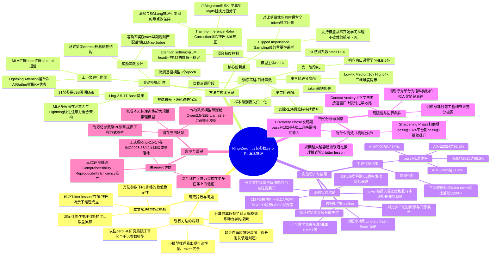

## 一、论文是干什么的？

想象你在教一个学生做数学题，但你手头没有任何标准解题步骤，只有一本只写着答案的习题册。学生每次尝试解题，你只告诉他"对"或"错"，从不告诉他该怎么想。神奇的是，只要这个学生足够聪明、练习次数足够多，他会自己摸索出分步骤写、自己检查、多角度尝试等一整套解题习惯——这就是论文里说的"零强化学习"（Zero RL）：不给任何人写的解题过程作为教材，只靠"对错"这个可验证的奖励信号，让模型自己在做题中学会推理。

过去大家做这类实验，学生（模型）的"脑子"都比较小（几十亿到千亿参数），一是因为万亿参数模型训练起来极其昂贵、极容易训崩，二是没人验证过"学生脑子越大、是否真的能无师自通学会更高级的推理技巧"。这篇论文的核心贡献，就是第一次把这套"零标注、只靠对错反馈"的强化学习方法，稳定地推到了一个万亿参数（1T）级别的模型上，并系统观察它在训练过程中自发涌现出来的推理行为——比如自己写"第一步、第二步"、自己验证前面算错没算错、甚至在草稿里自言自语"这个想法有点意思"。这些都不是人教的，是模型在海量对错反馈中自己"悟"出来的。

## 二、核心方法与创新

如果把强化学习训练比作"健身"，模型每天靠做题（rollout）、看奖励（对/错）来练"推理肌肉"。但当健身房（模型）变成万亿参数级别时，教练稍有不慎，学生就会"抽筋"（训练崩溃）或者"练岔气"（学出奇怪的、啰嗦的、不可读的推理习惯）。论文做了几件关键的事：

**1. 裁剪重要性采样（Clipped Importance Sampling）**：强化学习里，模型每更新一次参数，"新我"和"旧我"给同一段推理打分会有差异，这个差异如果不控制会让训练失控。论文的做法是：给这个比值设一个"安全带"（裁剪），但在计算梯度时仍然让所有token参与反向传播，这样即使模型一开始完全不会推理，也能从零"拽"出推理能力，而不是一开始就被裁剪机制堵死。

**2. 训练-推理比值校正（Training-Inference Ratio Correction）**：论文用两套引擎——Megatron 负责算梯度训练、SGLang 负责生成推理样本（rollout）。这两套引擎因为底层实现不同，对同一段文字算出来的概率会有极其微小的浮点数差异，就像两把尺子刻度略有误差。论文的做法是直接用训练引擎自己算出的"官方数字"替换掉这个比值的分子，把这种"尺子误差"从根源上消掉，避免误差累积导致训练不稳定。

**3. 混合精度控制**：模型主体用节省显存的 BF16 格式计算，但涉及到 attention 的 softmax 和最后输出层（LM head）这些对数值特别敏感的地方，切换回更精确的 FP32，避免万亿参数规模下微小的数值误差被无限放大。

**4. 上下文并行优化**：由于模型用了 MLA（多头潜在注意力）和 Lightning Attention（线性注意力）两种注意力机制混合的架构，论文针对这两种结构分别设计了不同的并行通信方式（比如 MLA 用按"头"维度的 all-to-all 通信，Lightning Attention 用一次性 AllGather 收集 KV 状态），让千卡级别的分布式训练更高效。

**5. 多阶段训练流程**：不是一次性放开训练，而是像升学一样分阶段——先在较短的回答长度（4千到6.4万字符逐步放开）下训练，中间插入一次"自我蒸馏"（挑出模型自己给出的又短又对的答案，用来微调自己，相当于把"精华笔记"重新学一遍），再进行不带 KL 惩罚的第二阶段训练，最后按题目难度分层（简单题短答案、难题长答案）训练，让模型学会"看菜吃饭"——简单题不啰嗦，难题才展开长篇推理。

**6. 奖励设计**：奖励 = 准确率奖励 + 格式奖励，准确率早期靠规则匹配答案，后期换成用另一个大模型当裁判（LLM-as-Judge）来判断对错，格式奖励则检查回答有没有按规定的标签结构书写。

论文最重要的发现，用大白话讲就是"力大砖飞"（也就是他们说的"苦涩的教训 / bitter lesson"）：模型规模从小做到 1T，同样的训练方法，越大的模型学习效率越高、上限越高，而且大模型更容易自己涌现出高级推理行为，这些行为在小模型上很难或者需要更多技巧才能诱导出来。

论文还发现训练分为两个阶段："发现期"（模型的 pass@1024，即采样1024次里只要对一次就算过的指标持续上升，说明强化学习在唤醒模型本来就有但没被激活的推理套路）和"打磨期"（pass@1024 不再涨了，但 pass@1，即一次就答对的概率还在稳步上升，说明模型在已经摸清的套路里精益求精）。

## 三、使用了哪些模型和计算资源？

- **基座模型**：
  - Ling-2.5-1T-Base：1 万亿总参数，MoE 架构下实际激活约 630 亿参数（混合 MLA 多头潜在注意力 + Lightning 线性注意力）
  - Ling-2.5-flash-Base：作为对照的小规模版本，1040 亿总参数，激活约 74 亿参数
- **训练后得到的模型**：Ring-2.5-1T-Zero（本论文主角）
- **计算资源**：320 张 H200 GPU 组成的集群
- **训练框架**：Megatron 负责梯度计算训练，SGLang 负责生成推理轨迹（rollout），Areal 作为整体调度编排框架
- **批次配置**：初期 batch size 512（minibatch 32），后期调整为 256（minibatch 32）
- **训练时长**：论文原文未给出具体的墙钟训练总时长（如"训练一次耗时多少天"），暂无相关信息；能确认的是训练分为第一阶段 RL、自我蒸馏（3 个 epoch）、第二阶段 RL、第三阶段分层 RL 共四个环节。

## 四、实验结果

在七个数学竞赛类基准上评测 pass@1（一次做对的准确率），部分结果如下：

| 基准测试 | Ring-2.5-1T-Zero | 对比说明 |
|---------|------------------|---------|
| AIME 2024 | 93.2% | 对标前沿模型区间约 77.9%–98.3% |
| AIME 2025 | 91.0% | 对标前沿模型区间约 63.5%–96.5% |
| AIME 2026 | 91.4% | 对标前沿模型区间约 84.2%–98.3% |
| HMMT Feb 2025 | 86.3% | 对标前沿模型区间约 55.2%–94.8% |

各训练阶段在 AIME 2024 上的提升轨迹：第一阶段 RL 达到 89.1% → 自我蒸馏后升到 92.3% → 第二阶段 RL 到 93.5% → 第三阶段分层高难度模式最终稳定在 93.2%。

在效率维度上，Ring-2.5-1T-Zero 平均只需约 6,368 个 token 就能给出正确答案，而对比的基线模型往往需要 12,000 个以上的 token，说明它的推理更"言简意赅"，不啰嗦。

据后续官方发布的 Ring-2.5-1T（正式版，非 Zero 版本），在 AIME 2026 上用约 5,890 个 token 就能匹配需要 15,000–23,000 token 的前沿模型效果；正式的混合线性架构版本 Ring-2.5-1T 在 IMO 2025 上拿到 35/42（达到金牌标准），CMO 2025 上拿到 105/126（超过中国国家队分数线）。

论文还提出了一套"不只看对错"的三维评测框架：
- **可理解性（Comprehensibility）**：用 LLM 当裁判，成对比较推理过程的逻辑连贯性、因果表达清晰度、有没有胡编乱造
- **可复现性（Reproducibility）**：把模型的推理过程蒸馏给更弱的模型（如 Qwen2.5-32B、Llama3.3-70B），用 10 万条训练样本看下游模型能提升多少，来间接检验推理过程"教得会不会"
- **效率（Efficiency）**：正确答案平均用了多少 token

消融实验的关键结论：
- 几种强化学习算法对比（CISPO 最快但最不稳定，DAPO 居中，GRPO 最稳，GSPO 能保持探索多样性但限制了探索深度）
- 去掉 KL 惩罚项会导致训练发散、奖励崩溃
- 不设格式奖励，回答长度会失控暴涨
- 用 token 级别损失会促使回答变长，样本级别损失能防止这种"越写越长"的惯性膨胀（哪怕题目已经会做了，模型也会因为 token 级别损失的数学偏置而多写废话）

## 五、潜在应用与已落地应用

**潜在应用场景**：
- 数学、代码等有明确对错标准的任务上，用极低成本（无需人工标注推理过程）训练出高水平推理模型
- 作为"教师模型"，把推理能力蒸馏给更小、更便宜部署的模型
- 探索超大规模模型训练的稳定性工程方案，为业界其他万亿参数模型训练提供可复用的工程经验（重要性采样裁剪、训练推理引擎数值对齐等）

**已落地应用案例**：
- Ant Group（蚂蚁集团）已经将该系列模型开源发布，正式版本 Ring-2.5-1T 及其配套的基座模型 Ling-2.5-1T 已上线 [Hugging Face（inclusionAI/Ring-2.5-1T）](https://huggingface.co/inclusionAI/Ring-2.5-1T)
- 代码仓库开源在 [GitHub（inclusionAI/Ring-V2.5）](https://github.com/inclusionAI/Ring-V2.5)，采用 MIT 协议，支持通过 transformers 或定制版 SGLang 分支（`ling_2_5`）部署
- 该模型被官方宣传为"全球首个基于混合线性注意力架构的万亿参数思考模型"，并在 IMO 2025、CMO 2025 等数学竞赛基准上取得金牌级成绩

## 六、网络上的讨论与评价

搜索结果显示该论文在 Hacker News 上有一条讨论帖（[Ring-Zero: Scaling Zero RL to a Trillion Parameters for Emergent Reasoning](https://news.ycombinator.com/item?id=48940603)），但由于服务器访问限制（HTTP 429），未能成功抓取到帖子内具体评论内容，暂无法转述其中的具体观点。

另外可以确认的是，蚂蚁集团通过 [FinTech Weekly](https://www.fintechweekly.com/news/ant-group-ling-2-5-1t-ring-2-5-1t-open-source-ai-models) 和 [Business Wire](https://www.businesswire.com/news/home/20260215551663/en/Ant-Group-Releases-Ling-2.5-1T-and-Ring-2.5-1T-Evolving-Its-Open-Source-AI-Model-Family) 等渠道对配套发布的正式模型 Ling-2.5-1T / Ring-2.5-1T 进行了官方新闻稿宣传，强调其"世界首个混合线性架构万亿参数思考模型"的定位。截至目前该论文在 arXiv 上属于较新的预印本（提交于2026年7月14日），尚未有正式的同行评审记录，社区层面（如 Reddit、Twitter/X）暂无检索到广泛、深入的独立评价或争议讨论，整体讨论热度信息有限，暂无更多相关信息。

## 七、思维导图

