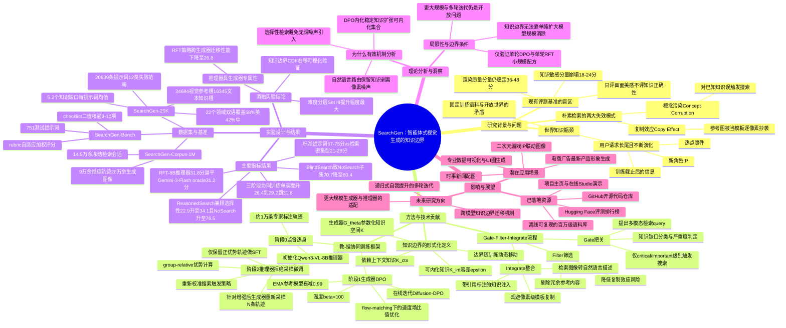

## 一、论文是干什么的？

想象一位画家，画技非常娴熟，但知识却停留在几年前。你让他画一个刚出道的网红角色，或者画上个月发生的新闻事件，他不会说「我不知道」，而是会凭空想象出一个似是而非的画面——画得很好看，但内容是错的。这就是当今图像生成模型普遍存在的问题：它们擅长把画面画得漂亮，却经常「自信地编造」自己并不了解的知识性内容，比如新出现的动漫角色、热门品牌的最新造型、刚发生的事件场景等。

论文作者把这个现象称为「世界知识瓶颈」。他们发现，即便是最前沿的开源图像生成模型，在面对需要具体知识（而不仅仅是画面美感）的提示词时，得分会从正常的 67-75 分（满分100）暴跌到 21-28 分——这是一个高达40分的性能崩塌，而且是现有评测基准根本没有测出来的盲区，因为大多数评测只关心画面好不好看，不关心画面内容对不对。

为了系统性研究这个问题，作者构建了一个专门的数据集 SearchGen-20K，里面有超过2万条覆盖12类「知识陷阱」（比如时效性事件、虚构IP角色、专业概念、文化符号、数据可视化等）的提示词，并设计了配套的评测基准 SearchGen-Bench。

## 二、核心方法与创新

### 2.1 为什么「直接上网搜索」不管用？

一个自然的想法是：既然模型不知道，那就让它像人一样上网查资料，查完了再画。但作者发现，直接粗暴地加检索会带来两个新问题：

1. **概念污染**：模型本来就已经知道的东西（比如画一只普通的猫），非要去搜索一下，结果搜到的参考图反而把模型原本准确的认知带偏了，越搜越错。
2. **复制效应**：搜到的参考图被模型当成了「抄的模板」，直接把图里的构图、风格生搬硬套过来，而不是把其中的知识（比如这个角色穿什么颜色的衣服）提炼出来创造性地画。

这就好比一个学生做开卷考试：如果什么题目都翻书抄答案，反而会把本来会做的简单题也抄错；如果直接把参考书上的图片描红上去，考卷也不会得高分——真正该做的是「该查的时候查，查完要理解消化再自己写」。

### 2.2 核心创新：可训练的「知识边界」

论文最核心的概念是：每个生成模型都有一条**知识边界**，把知识分成两类：
- **可内化知识**（Internalizable）：模型自己已经掌握得很好、搜索也帮不了太多忙的知识；
- **依赖上下文的知识**（Contextual）：模型确实不知道、必须靠外部检索才能画对的知识。

关键洞察在于，这条边界不是固定不变的，而是**随着训练不断移动**的——模型学得越多，原本需要查资料的内容就会逐渐变成「不用查也会」的内容，就像学生复习久了，原来要翻书的知识点渐渐变成了脱口而出的常识。

### 2.3 Gate-Filter-Integrate（把关-筛选-整合）流程

论文设计了一个「抗噪声的智能体推理器」，作为图像生成模型的智能助手，分三步走：

1. **Gate（把关）**：先判断这条提示词里到底有没有知识盲区，盲区有多严重，只有「关键」或「重要」级别的盲区才会触发搜索——避免了「什么都搜」的滥用。
2. **Filter（筛选）**：从搜到的一堆参考图/资料中挑出最相关、干扰信息最少的内容，避免把无关的画面噪声也带进来。
3. **Integrate（整合）**：这一步是全文最精妙的设计——不是把参考图片原样怼给生成模型抄,而是把图片里的关键知识**翻译成一段自然语言描述**，并标注引用来源（例如「角色穿着参照图片I中的青绿配金色长袍」）。这样既保留了知识，又避免了逐像素抄袭参考图，从根源上解决了「复制效应」。

这个思路类似于写论文引用文献：你不会把参考文献的原图整段复制粘贴进自己的论文里，而是用自己的话把其中的关键信息转述出来，并标注引用来源。

### 2.4 「先教后搜」的协同训练（Teach-then-Search Co-training）

整个训练分三个阶段，逐步把「搜索能力」和「作画能力」拧成一股绳：

- **阶段0（监督热身）**：用大约1万条专家标注的 Gate/Filter/Integrate 示例，先让推理器学会基本的把关-筛选-整合套路。
- **阶段1（生成器的偏好训练）**：让生成模型针对同一个提示词生成多张图，用评测协议打分，把分数最高和最低的图配成一对「正负样本」，用一种适配了 flow-matching（流匹配）生成范式的 DPO（直接偏好优化）损失函数训练生成器，让它更倾向于生成得分高的画面。这一步的效果是让生成器把「稳定出现、值得记住」的知识真正内化进参数里，边界因此往「不用查也会」的方向扩张。
- **阶段2（推理器的拒绝采样微调）**：生成器变强了以后，原来的推理器策略可能就过时了（比如原来该查的东西现在生成器自己就会了，就不该再触发搜索）。于是让推理器针对更新后的生成器重新采样多条路径，只保留那些「让最终结果变得更好」的路径（正优势样本）来微调推理器，从而让搜索策略与生成器的最新能力重新对齐。

这三步循环下去，理论上可以形成「生成器越学越强、推理器越来越懂什么时候该查、边界越推越远」的良性循环，作者称之为「递归式自我提升」的雏形。

## 三、使用了哪些模型和计算资源？

- **图像生成器（Generator）**：Flux.2-Klein-4B（流匹配架构）、Bagel-7B（统一视觉语言模型），均训练出对应的 DPO 微调版本。
- **智能体推理器（Reasoner）**：以 Qwen3-VL-8B 为初始 checkpoint 进行监督微调和后续的拒绝采样微调。
- **评分/参照基线模型**：Gemini-3-Flash，用作评测打分和前沿模型基线对比。
- **搜索工具**：通过 SERP API 调用 Google 图片搜索与网页搜索。
- **计算资源**：
  - 阶段0（监督热身）：论文未明确给出具体GPU小时数，暂无相关信息；
  - 阶段1（在线DPO）：论文未明确给出具体GPU小时数，是在2万余条训练提示词上进行的迭代式在线训练；
  - 阶段2（拒绝采样微调）：论文明确提到「整个RFT循环可在4×8个GPU小时内完成」（The full RFT cycle fits in 4×8 GPU hours）。
  - 论文强调这是一个刻意设计得很「小」的训练配方（生成器仅4B参数，推理器仅8B参数），用以验证方法论本身，而非追求极限规模。

## 四、实验结果

| 阶段 | 生成器 | 无需搜索的题目 | 难度组I | 难度组II | 难度组III（最难） | 总分 |
|------|--------|------|------|------|------|------|
| 阶段0（基线） | Klein-4B | 54.6 | 28.9 | 29.2 | 21.2 | 26.4 |
| 阶段1（DPO后） | Klein-4B-DPO | 54.0 | 31.8 | 31.1 | 24.7 | 29.2 |
| 阶段2（DPO+拒绝采样微调后） | Klein-4B-DPO+RFT | **56.9** | **34.1** | **33.6** | **27.4** | **31.8** |

几个值得关注的发现：

1. **世界知识瓶颈确实存在且巨大**：普通提示词下模型能拿到 67-75 分，一旦涉及需要检索的知识性内容，开源模型直接掉到 21-28 分，而这种崩塌在传统评测（只看画面质量）里完全看不出来，因为「画面质量」这类不依赖知识的指标依然能维持在36-48分左右，说明问题不是画得不好看，而是画错了内容。
2. **瞎搜索反而会拉低分数**：对不需要查资料的题目强行加检索（BlindSearch），Qwen-Image-2 的分数从 70.7 掉到 60.4；而用本文提出的「有选择性的搜索」（ReasonedSearch），既能把需要查资料的题目从 22.9 提升到 34.1，又能把不需要查资料的题目维持在 70.7→76.5（不降反升）。
3. **协同训练带来持续、单调的提升**：每一个训练阶段都比前一阶段有实打实的提升（阶段0→1提升2.8分，阶段1→2再提升2.6分），且在最难的难度组（Set III）里提升幅度最大，说明知识边界移动的空间最大。
4. **8B小模型的搜索策略能追平万亿级参数的前沿模型**：经过阶段2校准后的 Qwen3-VL-8B 推理器（配合 Klein-4B-DPO 生成器）总分 31.8，甚至略微超过了作为「裁判/参照标准」的 Gemini-3-Flash 在同一生成器上的 31.2 分。
5. **知识边界具有「生成器专属性」**：把针对 Klein-4B-DPO 校准好的推理器直接换配到未经DPO训练的原始 Klein-4B 上，分数会掉到 26.8（低于31.8），证明这套搜索策略是「生成器+推理器」这一对组合共同拥有的特性，不能随便挪用到别的模型上。
6. Bagel-7B 生成器上也观察到类似的一致性提升趋势（阶段2达到26.8，高于基线的24.7）。

## 五、潜在应用与已落地应用

**潜在应用场景**：
- 电商/广告场景中生成需要准确还原品牌最新产品外观的宣传图；
- 新闻/时事配图，需要准确反映最近发生的具体事件细节；
- 二次元/游戏行业中生成粉丝向的最新角色、联动IP形象；
- 教育/科普配图中需要准确呈现具体的数据可视化、UI界面、专业概念图；
- 文化敏感场景中生成准确反映特定文化符号、习俗的图像。

**已落地/已开源的资源**：
- 项目主页：[haozheh3.github.io/SearchGen](https://haozheh3.github.io/SearchGen)，包含在线演示 Studio 及静态演示。
- 代码仓库：[github.com/HaozheH3/SearchGen](https://github.com/HaozheH3/SearchGen)
- 评测排行榜（Hugging Face Space）：[huggingface.co/spaces/CongWei1230/SearchGen-Bench](https://huggingface.co/spaces/CongWei1230/SearchGen-Bench)
- 论文还发布了 SearchGen-Corpus-1M 数据集，包含约9万条推理轨迹、约28万次图像生成结果、约14.5万条冻结的检索会话（含约56万条唯一网页链接、约37万条缓存下载内容），目的是让其他研究者无需重新调用付费搜索API即可离线复现整套研究流程。

需要说明的是，与本文同期还存在一个方向类似的相关工作 Gen-Searcher（[github.com/tulerfeng/Gen-Searcher](https://github.com/tulerfeng/Gen-Searcher)），同样基于 Qwen3-VL-8B 做智能体式检索增强图像生成，可以作为对照参考，但两者是不同的独立项目。

## 六、网络上的讨论与评价

经过检索，除了 arXiv 摘要页、HTML全文页和论文自身的项目主页/Hugging Face Papers 页面外，暂未搜索到 Reddit、X（Twitter）或知名科技博客上有关本论文的专门讨论帖或评价文章。Hugging Face Papers 页面显示该论文获得了 83 次点赞（hfVotes），说明在 Hugging Face 社区内已获得一定关注度，但具体的评论内容页面未展示。整体来看，目前该论文仍处于发布不久、讨论热度正在积累的阶段，暂无广泛的第三方深度评测或争议性讨论。

## 七、思维导图

