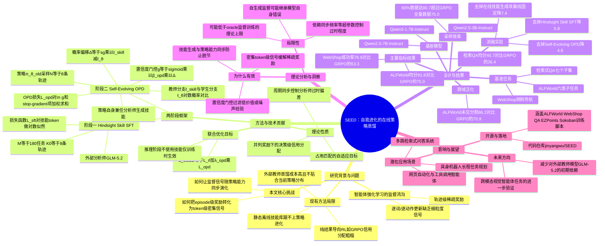

## 一、论文是干什么的？

想象一下你在教一个新员工做一系列复杂的任务，比如在网上超市里帮客户找到指定商品并下单。传统的做法是：员工做完整个任务后，你只告诉他一个结果——「这次任务成功了」或者「失败了」，给个总分。但员工这一路上做了几十个动作（点开哪个链接、搜索什么关键词、点了哪个按钮），你却不告诉他具体哪一步做得好、哪一步做错了。这就是强化学习训练智能体大模型时的一个核心痛点，论文称之为「监督鸿鸟」（supervision gap）：整条任务轨迹只有一个稀疏的、发生在最后的奖励信号，但模型的每一个词、每一个动作都需要被更新，导致学习效率很低，尤其是任务步骤很长的时候。

SEED这篇论文想解决的正是这个问题：能不能让模型在完成任务后，自己复盘总结出「这次任务中，我学到了什么有用的经验」，然后把这些经验转化成对每一步动作都有意义的、更加稠密的训练信号，而不是仅仅依赖最后那一个笼统的分数？这就好比让员工做完任务后自己写一份复盘笔记（比如「下次遇到搜索无结果时应该换用同义词而不是重复搜索」），然后教练根据这份笔记去校准员工每一步的具体表现，而不是只告诉他任务成功与否。

## 二、核心方法与创新

SEED的核心创新可以理解为「一个模型分饰两角，自问自答，自我进化」。具体来说分为两个阶段：

**第一阶段：事后经验的启蒙训练（Hindsight Skill SFT）。** 论文先让模型在若干任务上跑若干次（论文中是180个任务、每个任务跑8次，共1440条轨迹），然后用一个外部的更强大模型（GLM-5.2）来阅读这些完整的轨迹，用自然语言总结出「可复用的工作流程」「关键的观察点」「应该避免的失败模式」，这些统称为「事后技能」（hindsight skill）。这一阶段的目的是让模型初步学会两件事：既会做任务（当演员），也会总结经验（当分析师）。

**第二阶段：自我进化的在线策略蒸馏（Self-Evolving On-Policy Distillation，简称OPD）。** 这是全文最核心的部分。做法是：让当前的策略模型（记作旧版本 π_θ_old）自己去跑任务、收集轨迹，然后这个模型自己给自己复盘，生成事后技能（不再依赖外部大模型GLM-5.2，模型自己既是演员又是分析师）。接着，论文比较模型在两种情况下对同一个动作的打分：一种是「什么提示都没有」的普通情况（学生视角），另一种是「已经知道了事后总结出的技能」的情况（教师视角，相当于开了「事后诸葛亮」的天眼）。两者打分的差值反映了「如果模型提前知道这个经验，会更倾向于做出这个动作还是更不倾向」——这个差值就被当作一个稠密的、逐词的训练信号，把教师视角（知道经验后更聪明的判断）蒸馏回普通的学生视角（不知道经验、但要在实战中直接做决策的模型）。

打个比方：员工做完任务后写了复盘笔记，然后你让他假装「如果一开始就看过这份笔记」重新给自己每一步动作打分，再对比「没看笔记时」的打分，两者的差距就是「这条经验到底有多大用」；如果差距大，说明这条经验很关键，就要重点强化学习这一步该怎么做，如果差距很小，说明这一步无论有没有经验都差不多，就不必特别强调。为了避免把噪声也当成信号，论文还加了一个「置信度门控」（confidence gate），用一个sigmoid函数来控制这个信号的强弱，只有当教师和学生的判断差异达到一定程度时，才会赋予较高权重。

论文还有个重要设计叫「自我进化」：如果永远用一开始（还很弱）的模型来生成经验总结，那这些经验的质量会一直很差、跟不上模型的进步。所以SEED让当前正在训练的策略模型本身周期性地去承担分析师的角色，模型每更新一次，产生的经验总结也跟着更新，经验的水平跟着模型能力一起进化，这样就不会出现「老师原地踏步、学生却一直在进步」的脱节问题。最终这个蒸馏损失（OPD loss）会和常规的结果导向强化学习损失（如GRPO）联合优化，注意推理阶段（模型真正上线干活时）完全不需要这些技能提示，技能只在训练时起作用，相当于训练时开小灶补课，考试时凭真本事上阵。

论文中还给出了几条理论性质（Propositions），大致说明：这种「同步事后复盘」的方式能产生「占用匹配的自适应目标」（即经验总结的分布始终紧跟当前策略实际会遇到的状态分布，不会跑偏）；即使两条轨迹拿到相同的最终奖励，也能提供更细粒度的、针对具体决策点的信用分配；通过周期性同步分析师和策略网络的参数，可以控制「分析师过时」带来的偏差。

## 三、使用了哪些模型和计算资源？

**基座模型（被训练的智能体策略模型）：**
- Qwen2.5-3B-Instruct
- Qwen2.5-7B-Instruct
- Qwen3-1.7B-Instruct

**辅助模型：**
- GLM-5.2：用于第一阶段（Hindsight Skill SFT）里作为外部分析师，从轨迹中提炼初始的事后技能文本，之后训练过程中分析师角色逐渐替换为策略模型自身。

**训练配置：**
- 第一阶段收集 M=180 个训练任务，每个任务采样 K₀=8 条轨迹，共 1,440 条轨迹用于监督微调（SFT）。
- 强化学习阶段每次用当前策略采样 N=8 条轨迹（group size），批大小在ALFWorld/WebShop任务上为16，在检索式问答任务上为128，策略共更新150次。

**计算硬件：** 论文HTML正文中未给出具体的GPU型号、数量或训练总时长等细节（这些信息据称写在附录B.4中，但从抓取到的正文内容里无法获取具体数值），因此这部分暂无相关信息，无法进一步确认。

## 四、实验结果

论文在三大类智能体任务上做了实验：**ALFWorld**（家居环境中的具身任务，包含Pick、Look、Clean、Heat、Cool、Pick2六类子任务）、**WebShop**（网购导航，128个测试任务）、**检索式问答**（Search-based QA，涵盖Natural Questions、TriviaQA、PopQA、HotpotQA、2WikiMultiHopQA、MuSiQue、Bamboogle七个子集）。

以Qwen2.5-3B-Instruct为基座模型的主要结果如下：

| 方法 | ALFWorld平均分 | 检索QA平均分 | WebShop得分 | WebShop成功率 |
|------|------|------|------|------|
| 未训练的原始模型（Vanilla） | 21.9 | 31.7 | 6.7 | 0.8 |
| 常规强化学习基线（GRPO） | 75.0 | 36.4 | 79.8 | 63.3 |
| SEED（本文方法） | **91.8** | **45.7** | **88.5** | **78.9** |

也就是说，相比只靠最后成败一个分数来训练的GRPO方法，SEED在ALFWorld上又多提升了16.8分（3B模型）、14.9分（7B模型）、45.9分（更小的1.7B模型上提升尤其明显）；在检索问答任务上提升6.6到9.3分；在网购任务的得分和成功率上也都有明显提高（成功率从63.3%提升到78.9%）。

**采样效率：** 只用60%的训练数据，SEED在ALFWorld上就能达到80.7分，已经超过了GRPO用100%数据训练出的75.0分,说明经验总结确实能让训练更「省数据」。

**跨场景泛化：** 在ALFWorld的未见过的新任务分割上，SEED达到86.2的宏平均分，而GRPO只有70.9分，领先15.3分，说明总结出的经验不只是死记硬背当前任务,也能迁移到没见过的新场景。

**消融实验**（去掉某个组件后效果下降多少，基于ALFWorld、Qwen2.5-3B）：

| 变体 | 平均表现 |
|------|------|
| 完整SEED | 91.8 |
| 去掉事后技能SFT（第一阶段） | 86.0（下降5.8） |
| 去掉自我进化的OPD机制 | 87.0（下降4.8） |
| 去掉在线（on-policy）技能生成，改用离线固定技能 | 84.4（下降7.4） |

这说明三个组件都各自贡献了明显的提升，其中「让分析师和策略模型一起进化、始终基于最新策略生成技能」这一点的贡献最大。

## 五、潜在应用与已落地应用

**潜在应用场景：**
- 需要多步骤决策的智能体任务，例如网页自动化操作、软件工具调用、复杂检索式问答、具身机器人在虚拟或真实环境中的长程任务规划。
- 任何「结果反馈稀疏但过程很长」的强化学习场景，理论上都可以借鉴这种「自己复盘、把复盘经验蒸馏成逐步信号」的思路,不仅限于语言智能体。
- 论文中也提到该方法同时在文本类和视觉类的智能体任务上验证有效，说明具备一定的跨模态通用性。

**已落地/开源情况：**
- 论文作者已开源代码仓库：[jinyangwu/SEED](https://github.com/jinyangwu/SEED)，仓库中包含针对ALFWorld、WebShop、检索式问答、EZPoints、Sokoban等多个任务的训练脚本。
- 据检索到的信息,作者还发布了训练好的模型（如Seed-AlfWorld-3B）到Hugging Face,但具体模型页面链接未能在检索结果中确认,这部分暂无法给出准确链接。
- 目前未发现该方法已被集成进商业产品或第三方平台的公开报道，多为学术研究阶段的开源发布。

## 六、网络上的讨论与评价

通过检索arxiv、GitHub、Hugging Face以及一般网络搜索，暂未发现关于本论文的Reddit、Twitter/X等社交媒体上的广泛讨论帖或深度博客解读。检索到的主要是论文本身的arxiv页面、作者的GitHub仓库说明，以及一些同期的相关研究（如「Self-Distilled Agentic Reinforcement Learning」「ReSkill」「UCOB」等同类工作，同一作者Jinyang Wu也参与了其中一篇「SDAR」）。GitHub仓库README中作者自述的核心结论包括：稠密的事后复盘监督能改善纯结果导向的强化学习；SEED在多个基准上持续优于GRPO；即便推理阶段不使用任何技能提示，SEED依然能超过在评测时直接给出技能提示的基线方法；自我进化式蒸馏（分析师随策略一起更新）比使用静态、不更新的分析师效果更好。由于论文发布时间非常新（作者提交于2026年7月），加之HuggingFace页面本身未能直接抓取到评论区内容，因此关于本文的社区评价目前暂无广泛讨论,以上信息仅供参考。

## 七、思维导图

