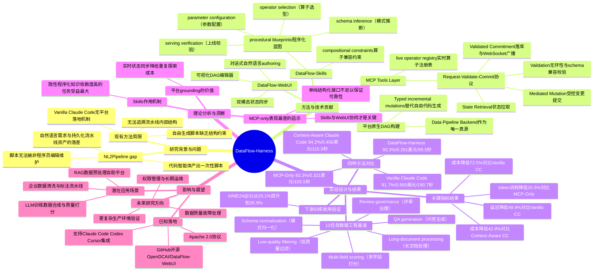

## 一、论文是干什么的？

现在很多人已经习惯让 Claude Code、Codex 这类「代码智能体」帮忙写数据处理脚本：给它一句需求，比如「帮我把这批文档做质量打分再过滤低质量样本」，它就能唰唰唰写出一段 Python 脚本跑起来。但论文作者发现一个很现实的问题：这些脚本用完就完了，**它们不会自动变成一个可以长期维护、可以被非程序员打开看懂、还能随时增删改的"数据流水线资产"**。下次需求稍微变一下，往往又是让智能体从头重写一遍脚本，而不是在已有流水线上改一小块。作者把这个"自然语言需求"和"持久化、可编辑的流水线"之间的落差，称为「NL2Pipeline gap」（自然语言到流水线的鸿沟）。

打个比方，这就像请一个很厉害的木匠上门，你说要个书架，他确实很快用现有的木料钉出一个书架，效果也不错——但他没有留下任何图纸，书架内部的榫卯结构只有他自己心里清楚。下次你想加一层隔板、换个尺寸，他只能重新估算、重新拼装，你也没法自己动手改，因为根本没有"设计图"可看可编辑。论文提出的 DataFlow-Harness，做的事情就是**逼着这个木匠一边干活一边画图纸**：不让代码智能体自由发挥写脚本，而是让它按照平台规定的"结构化搭建动作"，一步步把流水线搭成一张可视化、可持久保存、随时可以再打开修改的有向无环图（DAG），普通用户也能在网页上直接拖拽调整。

## 二、核心方法与创新

DataFlow-Harness 的核心思路是：与其让智能体"天马行空写代码"，不如给它一套受限但足够灵活的"搭建工具箱+说明书+实时对讲机"，让它每次只能做平台认可的、类型化的、增量式的操作（typed, incremental mutations），而不是生成一段随意的自由文本脚本。具体由三个部件配合完成，可以用「装修队」的比喻来理解：

**1. DataFlow-Skills（施工手册）**：相当于给智能体一本"老师傅的经验手册"，里面写好了常见的施工顺序（比如先做「schema 推断」、再选「算子」、再配参数、最后做「上线校验」），以及各种"搭配禁忌"（哪些算子前后接在一起会不兼容、字段类型对不上会出问题）。这些是隐性的、只有经验丰富的工程师才知道的"潜规则"，论文把它们写成显性的知识文档提供给智能体查阅，避免智能体凭感觉乱拼。

**2. MCP 工具层（工地对讲机/中控台）**：这是三个组件里最关键的"胶水层"，基于 Model Context Protocol 实现，论文称之为「Request-Validate-Commit 协议」，分四步走：
   - **State Retrieval（拿图纸）**：智能体每次动手前，先问中控台要"当前最新的流水线状态"——包括人类可能刚刚在网页上手动改过的部分，保证智能体看到的不是过时信息；
   - **Mediated Mutation（提交施工请求）**：智能体不能直接乱改，只能按照 Skills 手册的指导，通过结构化的 MCP 工具调用提出"我想加一个算子""我想改一个参数"这样的具体请求；
   - **Validation（质检）**：中控台检查这次改动会不会让流水线出现环（不再是一张合法的 DAG）、算子之间的输入输出字段类型是否兼容；
   - **Validated Commitment（正式落架）**：通过质检的改动才会真正写入后端存储，并通过 WebSocket 广播通知所有正在看这个流水线的客户端（比如网页编辑器）实时刷新。

**3. DataFlow-WebUI（双屏展示厅）**：给用户提供两块同步的"屏幕"——一块是对话框，可以继续用自然语言跟智能体聊着改流水线；另一块是可视化的 DAG 编辑器，用户可以直接拖拽节点、连线、改参数。两块屏幕通过前面说的 MCP 状态同步机制保持一致，你在对话框里让智能体加一个算子，可视化图上马上就会多出一个节点；反过来你在图上手动删了一条线，智能体下次读状态时也会立刻看到这个改动，不会"以为"流水线还是它上次留下的样子。

这套设计的创新点在于：它把"代码智能体自由生成"和"平台强约束的结构化编辑"结合了起来——智能体依然用自然语言交互、依然自主决策该怎么搭，但每一步实际落地的动作都被平台的类型系统和校验逻辑"收编"成了合法、可回滚、可持久化的操作，而不是一次性甩出一段没人能追溯结构的脚本。

## 三、使用了哪些模型和计算资源？

论文在 Experimental Setup 部分明确写道：**所有实验都使用 Claude Opus 4.7 作为底层大语言模型**（原文："All experiments use Claude Opus 4.7 as the underlying large language model"）。论文中没有提到任何自建 GPU 集群或本地推理硬件，从描述看应属于**纯 API 调用**方式（通过 Claude Code 等客户端调用 Claude Opus 4.7 API），论文正文也没有单独列出 GPU 型号信息。

评测方法上，论文对 12 个任务、4 种方法配置（Vanilla Claude Code、Context-Aware Claude Code、MCP-Only、DataFlow-Harness）各重复执行 10 次，总计 120 次任务运行来统计成功率、成本和延迟。

关于用户特别关心的成本和延迟数字，论文 Table 1 给出的具体数据是：

| 方法 | 观测通过率 | 平均花费（美元） | 平均生成延迟 |
|---|---|---|---|
| Vanilla Claude Code（纯代码智能体，无平台辅助） | 91.7% | 0.950 | 190.7秒 |
| Context-Aware Claude Code（喂入上下文的代码智能体） | 94.2% | 0.456 | 115.9秒 |
| MCP-Only（只有MCP层，没有Skills和WebUI） | 83.3% | 0.321 | 105.5秒 |
| **DataFlow-Harness（完整方案）** | **93.3%** | **0.261** | **95.5秒** |

论文里提到的「72.5% 成本降低」和「49.9% 延迟降低」，**基准都是 Vanilla Claude Code**：花费从0.950美元降到0.261美元，正好是降低 72.5%；延迟从 190.7 秒降到 95.5 秒，正好是降低 49.9%。此外论文还给出了相对更强基线 Context-Aware Claude Code 的对比：DataFlow-Harness 通过率仅低 0.9 个百分点，但成本低 42.8%、延迟低 17.6%；相比 MCP-Only 配置，总 token 消耗降低了 25.5%。这些数字论文都是以「平均每个任务运行一次」的口径给出，没有单独换算成"每个 pipeline 构建的绝对分钟数或美元数"之外的更细粒度拆分，也没有说明具体用的 Claude API 定价版本或按 token 计价的详细公式。

## 四、实验结果

用大白话总结这张表：**同一批需求，交给"裸奔"的 Claude Code 去写脚本，成功率91.7%，但又贵又慢（接近一美元、超过三分钟）；DataFlow-Harness 把成功率维持在93.3%（甚至比裸奔的还略高），但花费只要原来的四分之一多一点，速度快了将近一倍。** 唯一比它通过率还高一点点的 Context-Aware Claude Code（94.2%），是靠给智能体喂了大量上下文信息硬堆出来的，代价是仍然比 DataFlow-Harness 贵了42.8%。而单纯加了 MCP 层但没有 Skills 手册和 WebUI 配合的版本（MCP-Only），通过率反而是四种方法里最低的（83.3%），说明光有"结构化操作接口"还不够，Skills 提供的经验指导同样重要。

论文还做了一个很有意思的下游验证：用 DataFlow-Harness 搭出来的一条数学训练数据流水线，产出的数据拿去训练模型一个 epoch 后，在 AIME24@32 这个数学能力评测上的准确率从 25.1% 提升到了 35.9%，说明这套工具搭出来的流水线不只是"能跑通"，产出的数据是真的有训练价值的。

论文也在讨论部分坦承局限性：目前的 12 任务基准规模还比较小，尚未覆盖权限管理、长期运维、数据质量故障、更复杂生产环境等问题，这些留待未来工作解决。

## 五、潜在应用与已落地应用

**潜在应用方向**：这套框架天然适合任何需要"反复迭代、长期维护"数据处理流程的场景，比如企业内部的数据清洗/标注流水线、面向大模型训练的数据合成与质量打分流程、多阶段的检索增强生成（RAG）数据预处理、乃至面向非技术人员开放的"自助式数据加工平台"——因为流水线一旦被固化成可视化 DAG，业务人员不需要懂代码也能自己微调。

**已落地情况**：这不是一篇纯理论论文，**已经开源**，仓库地址是 [OpenDCAI/DataFlow-WebUI](https://github.com/OpenDCAI/DataFlow-WebUI)（Apache 2.0 协议），文档站点为 [DataFlow-Doc](https://opendcai.github.io/DataFlow-Doc/)。经核实，截至综述撰写时该仓库有 79 颗星、27 个 fork，README 中明确说明可以配合 Claude Code、Codex、Cursor 等多种代码智能体客户端使用，并直接引用了 DataFlow-Harness 这篇论文作为其架构依据，同时也引用了同团队更早的框架论文《DataFlow: An LLM-Driven Framework for Unified Data Preparation and Workflow Automation in the Era of Data-Centric AI》（arXiv:2512.16676）。从星标数和 fork 数看，目前更像是一个活跃维护中的早期开源项目，暂未查到有公开资料显示已被外部大型数据工程团队正式采用（论文和仓库均未提供第三方企业采用的公开案例）。

## 六、网络上的讨论与评价

搜索了 Twitter/X、Reddit、Hacker News、知乎、公众号等渠道，**没有搜到严格意义上的"用户自发讨论"帖子或评论**。搜索结果中出现的相关页面主要是几家论文自动摘要/资讯聚合站点，例如 [AI Weekly](https://aiweekly.co/alerts/dataflow-harness-hits-933-pass-rate-725-cost-cut-vs-claude)、[HyperAI](https://hyper.ai/en/papers/2607.16617)、[CCTest](https://cctest.ai/en/articles/dataflow-harness-turns-code-agents-into-editable-data-pipeline-builders)，它们都是对论文摘要的 AI 自动生成式转述，CCTest 页面甚至明确标注"This AI-generated summary is provided for a quick overview"，其评论区也只显示"Loading comments..."，没有真实用户留言。因此如实说明：**暂未搜索到关于本论文的实质性网络社区讨论**；唯一可确认的社区信号是 Hugging Face Papers 页面上的 134 个 upvotes（截至综述撰写时）。

## 七、思维导图

