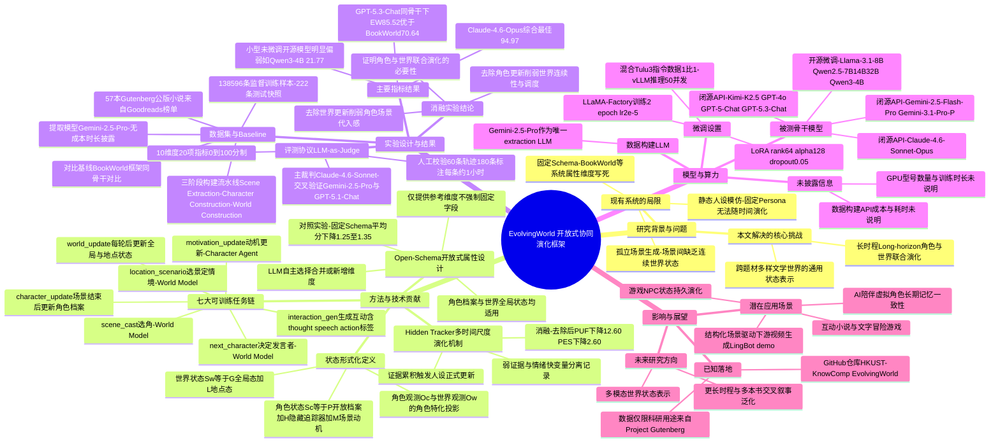

## 一、论文是干什么的？

想象你在玩一个基于《傲慢与偏见》的互动小说游戏：伊丽莎白会跟你对话，环境也会随着剧情推进变化。现有的很多"角色扮演AI"系统做得并不好，它们要么只会死记硬背角色的固定人设（比如"伊丽莎白：聪明、独立、爱讽刺"），角色永远长不大，剧情几十轮下来性格毫无变化；要么只管生成孤立的场景描述，一个场景和下一个场景之间没有连续的世界状态——上一秒房间着火了，下一秒又若无其事地恢复原样。

EvolvingWorld 这篇论文要解决的正是这个问题：如何让"角色"和"世界"在长达几十甚至上百个场景的互动小说模拟中，像真实小说里那样共同成长、互相影响。论文提出了一个框架和配套的评测基准，把互动小说模拟建模成一个长时程过程——角色互动、场景推进、角色状态和世界状态被持续记录并更新，而不是每次对话都从头开始的"失忆式"扮演。

论文的作者来自香港科技大学、LIGHTSPEED 和华中科技大学，围绕57本经典小说（如《傲慢与偏见》《远大前程》《化身博士》、多篇福尔摩斯故事等，均来自 Project Gutenberg 公版书库）构建了一个包含138,596条训练样本的数据集，并设计了7个可训练的子任务，最终用一套跨越10个维度、20项指标的"LLM当裁判"评测协议来衡量各类大模型在这个框架下的表现。

## 二、核心方法与创新

### 用一个类比理解"共同演化"

可以把整个系统想象成一部舞台剧的两个角色：**导演**和**演员**。

- **World Model**（世界模型）扮演"导演"的角色：它决定这一幕戏谁登场（选角）、在哪个地点发生（选景）、谁先说话谁后说话（安排出场顺序），并且在每一句台词说完之后，负责更新舞台布景和世界状态——比如"火已经被扑灭了""桌上的信被拿走了"。
- **Character Agent**（角色智能体）扮演"演员"：给定导演安排的场景，它要决定自己这个角色此刻的动机是什么（比如"我想试探一下他的态度"），然后说出具体的台词或做出动作，戏演完之后，还要根据这场戏里发生的事情，更新自己这个角色的"人设卡"——性格是不是变了、和别人的关系是不是变了。

关键在于：导演的决定要参考演员刚说的话来更新布景，演员下一步要演什么又要参考导演给的最新舞台状态和场景安排。两者像接力棒一样一轮一轮地把信息传给对方，一个场景演完，进入下一个场景时,角色和世界都已经不是原来的样子了——这就是"协同演化"。

具体来说，论文把一个场景内的推进拆成了7个可训练的子任务，按固定顺序执行：

1. `scene_cast`（选角，World Model 执行）：从当前世界状态里选出这场戏要出现的角色集合
2. `location_scenario`（选景与情境，World Model 执行）：确定发生地点和这场戏的具体情境
3. `motivation_update`（动机更新，Character Agent 执行）：每个参演角色根据情境更新自己此刻的场内动机
4. `next_character`（决定下一个发言者，World Model 执行）：可以是某个角色，也可以是环境本身或群体
5. `interaction_gen`（生成互动内容，Character Agent 执行）：生成该角色的想法（用方括号标注）、台词或动作（用圆括号标注）；每个角色只能看到自己过去的内心想法，看不到别人的
6. `world_update`（世界状态更新，World Model 执行）：每一轮互动之后，立即更新全局状态和该地点的状态
7. `character_update`（角色状态更新，Character Agent 执行）：整场戏结束后，每个参演角色根据发生的一切和最新的世界状态，更新自己的角色状态

这7个任务反复循环，就构成了一条完整的模拟轨迹：世界状态和角色状态在"导演"与"演员"的交替动作中不断被改写，彼此的输出互为对方下一步的输入，形成紧密耦合的闭环。

论文的消融实验（附录G）也验证了这种耦合的必要性：如果去掉"世界更新"这一步，角色一侧的场景代入感和互动质量会下降；如果去掉"角色更新"这一步，世界一侧的场景连续性和调度合理性反而也会跟着变差——说明长时程模拟确实依赖二者的联合演化，而不是各自为政。

### "开放式属性记录"（open-schema）具体是什么意思

传统做法（论文点名对比的是此前的 BookWorld 系统）会给每个角色和世界预先规定一套固定的属性表格，比如角色永远只有"背景、性格、人际关系、目标、当前状态"这5项，世界永远只有"设定、社会规则、机构、冲突、当前事件"这5项。问题是，《化身博士》里角色需要记录"人格分裂倾向"这种维度，而《傲慢与偏见》里角色需要记录"婚恋观念""家族地位"这种维度——用同一套固定表格去套所有小说，要么维度不够用，要么很多维度根本用不上。

EvolvingWorld 的做法是：只给大模型一些"参考维度"作为起点，不强制填满或局限于这些维度，而是让大模型自己根据这本书的题材、背景设定和写作风格，自主选择保留哪些维度、合并哪些维度，或者创造全新的维度。也就是说，属性表格的"字段"本身也是可以生长、可以因书而异的，不是写死在代码里的固定模板——这就是"开放式属性"（open-schema）的含义，它同时应用在角色的人设档案和世界的全局状态上。

论文还专门做了对照实验（附录G，"开放式 vs 固定式属性"）：把开放式属性替换成前面提到的那种固定5维表格，结果发现固定属性表格会让相关的评测平均分下降约1.25到1.35分，说明因书而异的开放式维度确实比"一刀切"的固定模板效果更好。

### 为什么要引入"隐藏追踪器"（Hidden Tracker）

论文观察到一个细节：角色状态里不同维度的变化速度是不一样的——心情可能一句话就变了，但性格这种深层特质需要多次场景的证据累积才应该改变。如果每场戏结束都直接改写性格字段，很容易"闪变"得不自然。为此，Character Agent 引入了一个隐藏追踪器，专门记录那些还不够充分、暂时不足以正式写入人设档案的"弱证据"或"新苗头"，等到多个场景里反复出现类似的迹象，证据积累到一定程度后，才真正触发人设档案的正式更新。消融实验显示，去掉这个隐藏追踪器会让"人设更新的忠实度"指标下降12.60分、"人设演化平滑度"指标下降2.60分，两项平均下降7.60分，说明这个机制确实起到了防止角色性格"跳变"的作用。

## 三、使用了哪些模型和计算资源？

这一点论文写得比较分散，下面逐条列出确认到的信息，找不到的部分也如实说明。

**数据集构建所用的模型：** 论文明确写道"我们使用 Gemini-2.5-Pro 作为抽取用大模型"（We use Gemini-2.5-Pro as extraction LLM），也就是说57本小说的场景切分、角色档案初始化与逐场景更新、世界状态初始化与更新，整个数据构建流水线都是调用 Gemini-2.5-Pro 的 API 自动完成的，没有使用人工标注来构建训练数据。

**评测所用的裁判模型：** 主评测裁判是 Claude-4.6-Sonnet（"Claude-4.6-Sonnet is our main judge"），另外在鲁棒性检验中还用 Gemini-2.5-Pro 和 GPT-5.1-Chat 作为交叉验证的裁判模型。

**被评测的角色智能体/世界模型骨干模型：** 论文测试了大量闭源API模型，包括 Kimi-K2.5、Gemini-2.5-Flash、Gemini-2.5-Pro、Gemini-3.1-Pro-P、GPT-4o、GPT-5-Chat、GPT-5.3-Chat、Claude-4.6-Sonnet、Claude-4.6-Opus 等，其中 Claude-4.6-Opus 在未经微调的模型里综合表现最好。同时也测试了多款开源模型（如 Qwen 系列、Llama-3.1-8B-Instruct 等）。

**微调所用的开源模型与方法：** 论文对 Llama-3.1-8B-Instruct、Qwen2.5-7B/14B/32B-Instruct、Qwen3-4B-Instruct 这几个开源模型做了监督微调，具体方法是用 LLaMA-Factory 框架配合 LoRA（秩64、alpha 128、dropout 0.05），训练2个epoch，学习率2×10⁻⁵，最大序列长度32,768 tokens，单卡batch size为1、梯度累积64步（等效每卡batch size 64），使用bf16精度、梯度检查点和FlashAttention-2，并额外混入 Tulu3 通用指令数据（按1:1比例），训练后用 vLLM 部署做推理，推理时用50个并发请求。经过这样微调后，一个32B规模的 Qwen 模型在世界模型任务上的平均分甚至超过了未经微调的 Claude-4.6-Sonnet 和 Gemini-2.5-Flash。

**GPU硬件型号与训练时长：** 论文全文没有提到具体使用了哪种GPU（如A100、H100、V100），也没有给出训练所用的GPU数量或训练所花费的具体时长，这部分论文未明确说明。

**API调用成本与数据集构建耗时：** 论文全文没有给出构建57本书、138,596条样本这个数据集所花费的美元成本或具体耗时，这部分论文也未明确说明。唯一和"时间成本"相关的数字出现在人工评估环节而非数据构建环节：论文提到为了验证LLM裁判的可靠性，找了3名以英语为母语的标注员，对60条模拟轨迹（覆盖3组模型对比）分别独立打分，共产生180条人工标注，"由于多场景模拟轨迹篇幅长、内容复杂，标注员平均每条样本大约花费1小时"，且标注员的报酬高于当地最低工资标准。这属于评测校验环节的人力投入，并非57本书数据集本身的构建成本。

综合来看：整个系统是纯粹基于云端API调用构建和评测的（Gemini、Claude、GPT系列均为API），只有微调开源模型这部分涉及本地/云端GPU训练，但具体GPU型号、数量和训练耗时论文没有透露。

## 四、实验结果

论文设计了一套涵盖 CHARACTER（角色）和 WORLD（世界）两大类、共10个维度、20项指标的"LLM当裁判"评测协议，评分范围0到100分。部分关键结果如下：

**角色智能体表现排行（由Claude-4.6-Sonnet裁判，部分模型的综合平均分）：**

| 模型 | 角色任务综合平均分 |
|---|---|
| Claude-4.6-Opus | 94.97（表现最佳） |
| Claude-4.6-Sonnet | 89.23 |
| GPT-5.3-Chat | 85.36 |
| Gemini-2.5-Pro | 85.20 |
| Gemini-3.1-Pro-P | 82.14 |
| GPT-5-Chat | 78.92 |
| Kimi-K2.5 | 75.89 |
| Gemini-2.5-Flash | 65.19 |
| GPT-4o | 67.65 |
| 未微调的小型开源模型（如Qwen3-4B-Instruct） | 21.77（明显偏低） |

可以看到，模型规模和综合能力越强，在这套长时程角色扮演任务上表现越好；而没有专门微调过的小型开源模型表现明显吃力。

**与已有系统 BookWorld 的对比：** 论文在相同骨干模型（如GPT-5.3-Chat、Gemini-3.1-Pro-P、Llama-3.1-8B-Instruct、Qwen2.5-14B-Instruct）条件下，比较了 EvolvingWorld 框架和 BookWorld 框架的表现。例如用GPT-5.3-Chat做骨干时，角色任务平均分从 BookWorld 的70.64分提升到 EvolvingWorld 的85.52分，世界任务平均分从65.78分提升到71.33分。论文还指出，随着模拟轨迹变长，BookWorld 的"人设演化平滑度"和"场景连续性"会明显退化，而 EvolvingWorld 的对应指标反而会随着轨迹变长而提升，说明其长时程一致性设计确实有效。

**消融实验结论：** 去掉世界状态更新会削弱角色一侧的场景代入感和互动质量；去掉角色状态更新则会进一步损害世界一侧的场景连续性和调度合理性；去掉隐藏追踪器会导致人设更新忠实度和演化平滑度明显下降；把开放式属性换成固定属性表格会让相关指标平均下降1.25到1.35分。这些结果共同说明，"角色-世界"耦合演化和"开放式属性设计"都是这套框架里真正起作用的部分，而不是可有可无的点缀。

**一个演示性应用：** 论文附录中还展示了一个概念验证——把 EvolvingWorld 生成的结构化场景输入到一个名为"LingBot"的视频生成模型里，自动为《爱丽丝梦游仙境》生成了一段4个场景的短片，用来说明这套结构化场景数据可以直接喂给下游的视频/内容生成系统，但这部分只是展示性质，没有给出量化评测数据。

## 五、潜在应用与已落地应用

**潜在应用方向：**
- **互动小说/文字冒险游戏：** 让玩家在经典文学世界（或原创小说世界）里进行长期、有连续记忆的角色互动，角色和世界背景会随剧情自然演化，而不是每次对话都"失忆重置"。
- **AI陪伴/虚拟角色：** 长期陪伴型的虚拟角色如果具备类似的"人设持久演化"能力，可以避免角色互动几十轮后出现前后设定矛盾的问题。
- **游戏NPC设计：** 游戏里的非玩家角色（NPC）如果采用类似的角色状态与世界状态耦合更新机制，可以让NPC的记忆和态度随玩家的长期互动而变化，减少"NPC永远像复读机"的观感。
- **下游内容生成的结构化中间层：** 如论文附录所展示的，结构化的场景/角色/世界状态数据可以作为视频生成、有声书生成等下游多模态生成任务的输入。

**已落地情况：** 论文提供了配套的代码与数据仓库，地址为 [https://github.com/HKUST-KnowComp/EvolvingWorld](https://github.com/HKUST-KnowComp/EvolvingWorld)（论文脚注中给出的链接）。需要说明的是，论文中注明其构建的数据集来源于 Project Gutenberg 的公版文本，且明确声明该数据"仅供科研使用，不可用于商业用途"。截至本综述撰写时，该工作尚处于论文/基准发布阶段，未发现独立于论文作者之外的第三方产品化应用案例。

## 六、网络上的讨论与评价

在 HuggingFace 论文页面（[huggingface.co/papers/2607.17250](https://huggingface.co/papers/2607.17250)）上，该论文获得了88个点赞。页面下的讨论区只有两条内容：一条是提交者对摘要的简要复述性介绍，另一条是自动化的"Librarian Bot"生成的相关论文推荐列表（如《Orchestrated Reality》《DynSess》《Staying In Character》等），二者都不算是实质性的社区讨论或评价。

经过在 Twitter/X、Reddit、Hacker News、知乎、微信公众号等平台的多轮关键词搜索（包括论文标题、arxiv编号 2607.17250 等），暂未搜索到围绕这篇论文的专门讨论或评价。搜索中唯一相关的中文内容是一篇关于 BookWorld（该论文对比的基线系统，来自更早的复旦大学团队工作）的知乎文章，与 EvolvingWorld 本身无关。因此，目前可以确认的是：这篇论文尚未在主流社交媒体和技术社区引发广泛讨论。

## 七、思维导图

