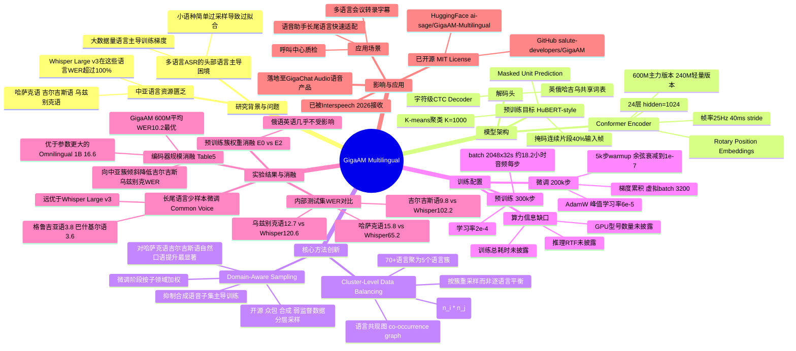

## 一、论文是干什么的？

这篇论文来自俄罗斯 Sber 旗下的 Salute Devices 团队（也就是做 GigaChat 大模型的那个团队），主题是语音识别（ASR，把一段语音自动转成文字）。但它关心的不是英语或中文这种"资源大户"语言，而是中亚地区的哈萨克语、吉尔吉斯语、乌兹别克语——这些语言使用人数不少，但网上能找到的高质量标注语音数据非常稀缺，属于"资源匮乏语言"。

打个比方：训练语音识别模型就像教一个孩子学听写。如果你给孩子听 1000 小时英语、10 小时哈萨克语，孩子自然会把英语学得炉火纯青，哈萨克语却学得结结巴巴——这就是当前很多"大而全"的多语言语音模型（比如 OpenAI 的 Whisper）的通病：数据量大的语言表现好，数据量小的语言表现差，而且往往差很多。论文作者做的事情，就是设计了一套"因材施教"的训练方法，让模型在总共 2 百万小时、覆盖 70 多种语言的海量语音数据中，专门给这些"小语种学生"多开小灶，从而在不牺牲主流语言（俄语、英语）质量的前提下，大幅提升哈萨克语、吉尔吉斯语、乌兹别克语等语言的识别准确率。

最终产出是一个名为 GigaAM Multilingual 的开源语音基础模型（编码器 + 识别头），可以直接下载使用，也可以在此基础上针对新语言做少量数据微调。

## 二、核心方法与创新

### 1. 底层架构：Conformer 编码器 + HuBERT 式自监督预训练

模型的"大脑"是一个 Conformer 编码器（一种把卷积和自注意力结合起来处理语音信号的网络结构），有两档规模：一个约 600M 参数（24 层、隐藏维度 1024，并在自注意力层中使用了旋转位置编码 RoPE），另一个是约 240M 参数的轻量版，供效率敏感场景使用（业内资料中也常把这两档称为 600M / 220M）。编码器每 40 毫秒（相当于 25Hz 帧率）产出一个语音特征帧。

预训练阶段采用 HuBERT 风格的"掩码单元预测"任务：先用 K-means 聚类（K=1000）把语音信号的声学特征切分成 1000 个"发音类别"，相当于给语音贴上离散的"音素标签"；然后随机遮住输入语音中约 40% 的连续片段（类似完形填空，一次挖掉一整段而不是零散几个点），要求模型根据上下文猜出被遮住片段对应的聚类标签。这个过程不需要任何文字标注，只需要海量的原始语音，因此可以"喂"进 2 百万小时的音频。

类比一下：这就像让学生反复做"听力填空题"——把一段录音中间挖掉几秒钟，让他根据前后语境猜测那段大概是什么发音类型的内容。做的题目足够多之后，学生自然就学会了这门语言（甚至多门语言）发音的内在规律，而这个过程完全不需要老师提前把每句话的文字都写出来。

### 2. 核心创新一：聚类级数据平衡（Cluster-Level Balancing）

论文最关键的创新在预训练阶段的数据配比上。70 多种语言直接放在一起训练，会导致数据量大的语言（如俄语、英语）主导训练过程，小语种被"淹没"。但如果反过来强行把每种语言的数据量都拉平，又会导致模型对小语种数据"过拟合"（重复看太多遍同样的少量样本，学傻了）。

作者的解法是：不对语言逐一做平衡，而是先构建一张"语言共现图"——如果两种语言经常出现在同一批数据源、同一批说话人或同一场景里，就在图上给这两种语言连一条边，边的权重用公式 $w_{ij} = c_{ij} / \sqrt{n_i \times n_j}$ 计算（$c_{ij}$ 是两种语言的共现次数，$n_i$、$n_j$ 是各自的数据量，这个公式和常见的余弦相似度归一化思路类似，避免了数据量本身大小的干扰）。基于这张图做聚类，最终把 70 多种语言归并成 5 个"语言簇"。之后是按"簇"为单位做重采样平衡，而不是按单一语言平衡。

类比：与其给班里每个学生（每种语言）都定一个一模一样的作业量（容易让基础差的学生反复刷同一套题导致钻牛角尖），不如先把学生按"学习小组"（语言簇，比如中亚语言一组、斯拉夫语言一组）分组，组内适度互相搭配、组间做平衡，这样既能保证小组内的弱势语言获得更多关注，又不会让某一种语言的少量样本被反复"嚼烂"。

### 3. 核心创新二：领域感知采样（Domain-Aware Sampling）

到了微调阶段（用少量带文字标注的数据训练识别能力），论文发现同一语言内部也存在"数据来源不均衡"的问题：比如哈萨克语的标注数据里，合成语音（TTS 生成的、发音字正腔圆）可能占了大头，而真实的、口语化的"自然对话"数据很少。如果不加处理，模型会被合成数据的"标准腔调"带偏，一遇到真实场景里带口音、停顿、语气词的自然说话，识别就翻车。

论文的做法是在同一语言内部，对不同"子领域"（如开源数据、众包数据、合成数据、弱监督数据）分别赋予采样权重，防止体量最大的合成语音数据"喧宾夺主"。实验显示，这个方法对哈萨克语和吉尔吉斯语的自然口语（Internal 测试集）识别效果提升最明显，但对乌兹别克语没有明显帮助（论文如实报告了这一点，没有夸大效果）。

### 4. 识别头：共享字符级 CTC 解码器

在编码器之上，模型接了一个 CTC（联结时序分类）解码器，直接输出字符序列，且英语、俄语、哈萨克语、吉尔吉斯语、乌兹别克语共用同一套字符词表。这比每种语言单独训练一个识别头更省参数，也让模型在语言之间可以共享发音-字符的映射知识。

## 三、使用了哪些模型和计算资源？

**基础模型架构**：本论文不是调用现成的大语言模型（LLM），而是从零训练了一个语音专用的 Conformer 编码器（600M 参数为主力版本，另有 240M 轻量版），配合 CTC 解码器做语音识别，预训练目标采用 HuBERT 风格的掩码单元预测（K-means 聚类 K=1000）。

**训练数据规模**：预训练用了约 200 万小时音频，覆盖 70 多种高频语言（通过 MMS LID 4017 语言识别模型做筛选和语音活动检测）；微调阶段使用约 5 万小时的多语言标注数据（英语约 2.67 万小时开源数据、俄语约 5800 小时、哈萨克语约 9800 小时、吉尔吉斯语约 7300 小时（其中合成语音占大头，约 6400 小时）、乌兹别克语约 600 小时，具体来自开源、众包、合成语音、弱监督等多个来源）。

**训练步数与超参数（论文原文明确给出）**：
- 预训练：300,000 步，学习率 $2 \times 10^{-4}$，每步总音频批量约为 2048×32 秒（约合每次更新 18.2 小时音频）。
- 微调：200,000 步，使用 AdamW 优化器，峰值学习率 $6 \times 10^{-5}$，5000 步预热后余弦衰减至 $1 \times 10^{-7}$，通过梯度累积实现约 3200 的虚拟批量大小。

**GPU 型号、数量与训练/推理耗时**：论文全文（包括实验设置部分）**未明确说明**具体使用了哪种型号、多少块 GPU 来完成训练，也没有给出总训练所耗费的真实时钟时间（如"多少 GPU 小时"），更没有报告推理阶段的实时率（RTF）或单次推理耗时等数据。这些是本文核实后可以确认的信息缺口，因此如实标注为"论文未明确说明"，未做推测或编造。

**开源情况**：模型代码与权重已在 GitHub 的 [salute-developers/GigaAM](https://github.com/salute-developers/GigaAM) 仓库开源，采用 MIT 许可证；模型权重同时发布在 Hugging Face 的 [ai-sage/GigaAM-Multilingual](https://huggingface.co/ai-sage/GigaAM-Multilingual) 页面，可直接下载使用。

## 四、实验结果

论文把 GigaAM Multilingual 与几个主流的开源多语言语音模型做了对比，包括 Meta 的 Omnilingual-1B、Seamless M4T v2，以及 OpenAI 的 Whisper Large v3。核心指标是词错率 WER（Word Error Rate，越低越好）。

**内部测试集（自然口语场景）上的词错率对比：**

| 语言 | GigaAM | Omnilingual 1B | Seamless M4T v2 | Whisper Large v3 |
|---|---|---|---|---|
| 哈萨克语 | 15.8 | 32.2 | 62.9 | 65.2 |
| 吉尔吉斯语 | 9.8 | 25.0 | 78.3 | 102.2 |
| 乌兹别克语 | 12.7 | 30.2 | 40.0 | 120.6 |

可以看到，GigaAM 相比 Whisper Large v3，在这三种语言上的相对词错率降低了约 76%到90%，差距非常悬殊——尤其是吉尔吉斯语和乌兹别克语，Whisper Large v3 的错误率甚至超过 100%（意味着识别结果比原文还长，出现大量插入错误），基本处于"不可用"状态，而 GigaAM 能把错误率压到 10到16 左右的可用区间。

**编码器规模消融（平均 WER，含哈、吉、乌等语言）：**

| 模型 | 平均 WER |
|---|---|
| GigaAM 240M | 12.2 |
| **GigaAM 600M** | **10.2** |
| Omnilingual 1B | 16.6 |
| Whisper Large v3 | 14.1 |

值得注意的是，GigaAM 的 600M 参数版本反而比参数量更大的 Omnilingual 1B 表现更好，说明"因材施教"的数据平衡策略比单纯堆参数量更有效。

**长尾语言快速适配（Common Voice 数据集，格鲁吉亚语、巴什基尔语，这两种语言并未出现在原始训练语言列表里）：**

| 模型 | 格鲁吉亚语 WER | 巴什基尔语 WER |
|---|---|---|
| **GigaAM** | **3.8** | **3.6** |
| Omnilingual 1B | 7.8 | 8.2 |
| Whisper Large v3 | 13.4 | 11.1 |

这说明这个基础模型不仅对训练时"照顾"过的中亚语言有效，用少量标注数据微调后，也能很好地泛化到训练时完全没见过的新语言上，验证了它作为"基础模型"的可迁移性。

**消融实验要点**：
- 预训练阶段调整语言簇采样权重后（实验 E2，向中亚语言簇倾斜），吉尔吉斯语 WER 从 9.4 降到 8.5，乌兹别克语从 10.5 降到 9.7，而作为"资源大户"的俄语几乎不受影响（4.6→4.7），英语只有轻微上升（14.4→15.4）——证明"照顾小语种"并没有明显伤害主流语言。
- 微调阶段的领域感知采样，对哈萨克语、吉尔吉斯语这种自然口语测试集帮助最大，但对乌兹别克语没有观察到明显收益，论文对此如实报告，没有回避负面结果。

## 五、潜在应用与已落地应用

**潜在应用方向**：呼叫中心语音质检与工单转写、多语言智能语音助手、会议/访谈/播客的自动转录、字幕自动生成、多语言语音输入法等——特别适合中亚及俄语圈这种多语言混杂使用的场景。

**已落地情况**：
- 模型已经完全开源，代码和权重发布在 GitHub 的 [salute-developers/GigaAM](https://github.com/salute-developers/GigaAM) 仓库（MIT 许可证），权重同时托管于 Hugging Face 的 [ai-sage/GigaAM-Multilingual](https://huggingface.co/ai-sage/GigaAM-Multilingual)。
- 论文已被 Interspeech 2026 接收。
- 该系列模型隶属于 Sber 旗下 Salute Devices 团队，是其 GigaChat 生态中语音能力（GigaChat Audio）的底层技术之一；据媒体报道，Sber 已将相关语音模型能力整合进 GigaChat 的语音理解功能中（含情绪识别、说话人分离等），说明该技术方向已经在商业产品中落地，而不仅停留在论文阶段。
- 官方资料显示 GigaAM 系列此前的版本（GigaAM v3）已被称为"俄罗斯首个开源的多语言语音识别模型"，本次的 Multilingual 版本是其面向中亚弱势语言的进一步扩展。

## 六、网络上的讨论与评价

在 Hugging Face 论文页面上，该论文获得了 33 个赞（upvote），提交者在页面上强调这是"面向弱势语言的开源（MIT 协议）语音基础模型"，页面上的自动关联工具（Librarian Bot）还识别出了 7 篇处理低资源语音识别的相关论文。

通过网络搜索，未能找到 Twitter/X、Reddit、Hacker News、知乎或公众号上针对本篇论文的专门讨论帖或深度点评；搜索到的主要是与 GigaAM/GigaChat Audio 相关的科技媒体报道（如 HackerNoon、ITBrief、Electronics Media 等）介绍 Sber 语音技术升级，但这些报道更多聚焦于 GigaChat 语音助手产品层面的功能更新（情绪识别、说话人分离等），并非针对本篇论文本身的技术讨论。因此，**暂未搜索到专门针对这篇论文的社区级技术讨论**，如实说明。

## 七、思维导图

