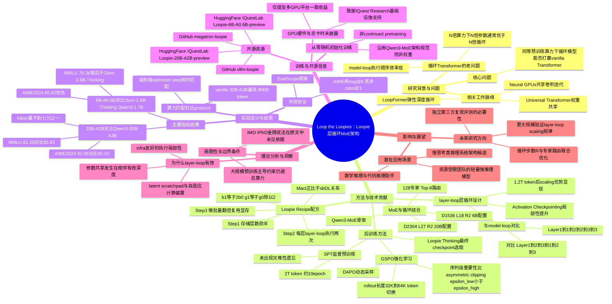

## 一、论文是干什么的？

设想两种造大楼的方式：第一种是多买地、多盖楼层，楼越盖越高（这是"堆参数"）；第二种是只盖三层楼，但让电梯反复在这三层之间打转，出电梯的人被反复"折返"加工好几遍才算完工（这就是"循环"，即looped transformer）。长期以来，AI 圈子里有个几乎公认的经验规律：如果算力预算增加到原来的N倍，与其把同一批楼层循环使用N次，不如老老实实把楼盖高N倍（也就是直接增加参数量），效果通常更好。也就是说，"循环复用层"这个点子听起来节省参数，但在真刀真枪的大规模预训练比拼中，一直打不过"参数量的暴力堆砌"。

这篇论文叫《Loop the Loopies!》（可以戏称为"把循环体再循环一遍"），作者来自 IQuest Research，提出了 Loopie 系列模型，试图正面回答一个问题："在同样的预训练算力预算下，循环 Transformer 到底能不能打赢普通 Transformer？" 他们给出的答案是"能"，并且训练出两个模型：一个 200 亿参数、但每次推理只激活 20 亿参数的 Loopie-20B-A2B，以及一个 60 亿参数、激活 6 亿参数的 Loopie-6B-A0.6B。论文的核心贡献，就是找到了一套让"循环"真正省算力、而不是纸面上省参数但实际更慢的训练配方（论文称之为 Loopie Recipe）。同时论文还展示了一套后训练（监督预训练+强化学习）方法，让这两个循环模型具备了较强的数学、代码推理能力。

## 二、核心方法与创新

**先解释什么是"循环 Transformer"，什么是普通堆参数模型。** 普通大模型好比一条工厂流水线，有很多道工序（层），每道工序用的都是独立的一套工人和工具（独立的参数）；工序越多，工厂占地面积和人力成本（参数量）就越大。循环 Transformer 则像是只请了少数几组工人，但让半成品在这几组工人手里反复过几遍（例如同一组工人加工两遍再交给下一组），本质上是"参数共享+多次计算"，用计算量换参数量。以前大家发现，这种"反复过手"的做法虽然参数少，但同等算力下效果往往不如老老实实多请几组工人（多堆参数层）。

**论文最重要的创新叫"层循环"（layer-loop），用来对比过去常见的"整模型循环"（model-loop）。** 这两者的区别可以用绕圈的顺序来类比：假设一个模型本来有三层（Layer 1、2、3），要循环两遍。model-loop 的做法是先完整走一遍全部三层，再从头完整走第二遍，顺序是 Layer 1→2→3→1→2→3；而本文的 layer-loop 做法是每一层内部先自己反复循环够次数、再交给下一层，顺序是 Layer 1→1→2→2→3→3。听起来只是执行顺序的区别，但作者发现这个顺序对训练效率影响很大：layer-loop 在训练 token 数超过约1.2万亿（1.2T）之后，扩展性（scaling）明显更好；而且因为每次只需要在显存里保留一层的参数、反复对它做梯度检查点（activation checkpointing），显存访问的局部性更好，工程实现上更省资源；同时相邻的"有效深度"之间天然形成了参数共享的规律结构。

**"Loopie Recipe"（Loopie配方）是把这个发现转成实操配方的三步法：**
1. 把基准模型存储的层数砍半（比如从54层砍到27层）；
2. 让每一层通过 layer-loop 循环执行两次，凑够原来的"有效深度"；
3. 因为存储的层数变少了，训练时显存腾出了空间，于是把每张卡的微批量（micro-batch）大小翻倍，用腾出来的显存换来更高的硬件吞吐，再把这部分效率收益重新投入到模型容量里。

用公式表达其中的关键关系就是激活值显存大致正比于批大小、序列长度和存储的层数，即 $M_{\mathrm{act}} \propto s\,b\,D\,L$（其中 $s$、$b$、$D$、$L$ 分别代表序列长度、批大小、隐藏维度、存储层数）。因为 layer-loop 只需要存储 $L$ 而不是"存储层数乘以循环次数"，砍半存储层数后可以把微批量 $b$ 翻倍（$b_1=2b_0$），同时把梯度累积步数减半（$g_1=g_0/2$），从而在保持"每个优化步骤处理的 token 总数不变"的前提下，把省下来的显存转化成了更快的训练速度或更大的模型容量。

**Mixture-of-Experts（MoE，专家混合）如何与循环结合？** 可以把 MoE 理解成"专家会诊"：模型内部准备了一大堆"专家"（子网络），但每次只挑其中一小部分专家来处理当前的词，这样总参数量很大（知识面广），但每次实际计算用到的参数（激活参数）很小（推理快、省钱）。Loopie 把 layer-loop 直接套用在 MoE 层上：模型骨架沿用 Qwen3-MoE 架构，共 128 个专家、每次路由激活其中 8 个（Top-8 路由），稀疏模式等架构细节与 Qwen3-MoE 系列保持一致；不同的是，这些 MoE 层本身会按 layer-loop 的方式被反复调用。换句话说，"专家会诊"这件事本身也被"多问几遍、反复推敲"了一遍，而不是只问一次就拍板。20B 模型的具体形状是隐藏维度 $D=2304$、存储层数 $L=27$、循环次数 $R=2$；6B 模型是 $D=1536$、$L=18$、$R=2$。

**后训练阶段的创新点：** 论文先用一种"监督预训练"（Supervised Pre-Training，SPT）方式，在约2万亿 token 上持续训练约10个epoch，作者观察到一个反直觉的现象——这样长期"续训"并没有像传统认知那样导致灾难性遗忘（ARC-Challenge、MMLU 等通用能力指标不降反升）。随后用强化学习进一步激发推理能力，优化算法基于 Group Sequence Policy Optimization（GSPO），并引入了 DAPO 中的非对称裁剪（asymmetric clipping）和动态采样（dynamic sampling）技巧。强化学习训练时先用32K token的推理长度上限（多数回答能在此长度内自然结束，效率高），一旦截断率超过10%，就切换到64K token的上限给模型更多"打草稿"的空间；训练持续到验证集分数不再提升、开始下滑为止，取下滑前的检查点作为最终的"Loopie Thinking"模型。

## 三、使用了哪些模型和计算资源？

**是否从零训练：** 论文明确写道模型是"从零开始的大规模预训练"（large-scale pre-training from scratch），即 Loopie-20B-A2B 和 Loopie-6B-A0.6B **都是从随机初始化开始训练的**，并不是在某个已有开源模型权重基础上继续训练（continued pre-training）。不过其网络架构设计（稀疏度、路由方式等细节）沿用了 Qwen3-MoE 系列的架构规范，即"借用了架构设计图纸，但没有借用现成的权重"。

**训练数据量：** 预训练分两阶段，第一阶段在高质量数据上训练 2.28 万亿（2.28T）token（相当于把数据集刷了约4个epoch），第二阶段用 1.26 万亿（1.26T）token 的退火（annealing）数据收尾，Loopie-20B 总计约 3.5 万亿 token 的预训练量。对比基线"vanilla 30B-A3B"模型则是在等同算力预算下训练了 8000 亿（800B）token。代码数据方面提到构建了约 2620 亿 token 的代码语料。

**GPU型号、数量、集群规模：** 论文正文、致谢部分和附录都**没有给出具体的 GPU 型号（如 H100 / H800 / A100）、GPU 数量或集群规模**。论文提到训练框架用的是 Megatron-LM，并表示 Loopie Recipe 在"多种GPU平台上"都验证过能带来一致的基础设施层面收益，但没有列出具体型号或数量。致谢部分感谢了 IQuest Research 的 Zhengmao Ye 提供"基础设施支持"，但同样没有透露具体硬件配置。**这部分信息论文未明确说明。**

**训练总耗时/总卡时：** 论文同样**未给出**具体的总训练天数、总 GPU-小时数或 FLOPs 总量等绝对数值。作者的比较方法是"算力匹配"而非"报告绝对耗时"：他们在 Megatron-LM 里对候选配置做大规模基准测试，挑选出"实测端到端优化器步耗时"与非循环参照模型最接近的 Loopie 配置，由于两者用的 token 预算和优化步数相同，因此近似认为两者的总训练墙钟时间（wall-clock time）也基本匹配。也就是说，论文提供的是"两者训练成本大致相等"的相对论证，而不是绝对的卡时数字。**这部分信息论文未明确说明具体数值。**

**优化器与学习率：** 使用 AdamW，$\beta_1=0.9$，$\beta_2=0.95$，权重衰减 0.1，梯度裁剪阈值 1.0。峰值学习率 20B 模型为 $3\times10^{-4}$，6B 模型为 $5\times10^{-4}$，采用warmup后学习率不衰减的"warmup-stable"调度。

**达到强推理水平的推理配置：** 论文评测采用 EvalScope 评测框架；对 AIME 2024/2025 报告的是 avg@8（即采样8次取平均），其余基准报告 pass@1（单次采样）。强化学习训练阶段的推理长度上限是先32K后按需升到64K token，但论文**没有明确说明**最终对外报告分数时，每道题具体用了多少推理token、耗时多久，也没有说明是否使用了额外的测试时算力扩展（test-time scaling，如多数投票、树搜索等）技巧用于最终评测。**关于"IMO/IPhO金牌水平"的说法需要特别澄清：** 经过对 arxiv 全文（含摘要、正文、致谢）逐字检索核实，论文正文和摘要中**均未出现「IMO」「IPhO」「gold medal」「olympiad」等字样**，论文摘要的原话是模型"develops strong reasoning abilities and achieves frontier-level reasoning performance"（发展出较强的推理能力，达到前沿水平的推理表现），并没有提及国际数学奥林匹克（IMO）或国际物理奥林匹克（IPhO）金牌。网络上一些二手报道（如 aiweekly.co 的一篇文章标题《Loopie looped MoE claims 2025 IMO and IPhO gold without tools》）提到了这个说法，但该说法**在论文原文中找不到对应依据**，很可能是二手信源的误传或与其他论文混淆，本综述在此如实标注这一出入，不采信"IMO/IPhO金牌"这一具体说法。

## 四、实验结果

论文的实验设计核心是"算力匹配对比"：在相同预训练算力预算下，比较 Loopie 与不循环的普通 Transformer（vanilla baseline，如 30B-A3B）孰优孰劣。

Loopie-20B-A2B 与同等激活参数规模的 MoE 模型对比（节选自论文 Table 3，pass@1 / AIME 为 avg@8）：

| 基准测试 | Loopie-20B-A2B | Qwen3-30B-A3B | Nemotron 3 Nano 30B |
|---|---|---|---|
| MMLU | 81.28 | 85.83 | 80.52 |
| ARC-Challenge | 93.52 | 96.67 | 91.96 |
| BBH | 82.28 | 86.59 | 68.76 |
| AIME 2024 | 92.09 | 90.10 | 85.00 |
| AMC | 94.21 | 96.73 | 91.80 |

论文特别强调："Loopie 使用的预训练 token 量不到对比模型的七分之一，却在大多数知识类和通用能力基准上打平甚至超过了两者。" 也就是说在数学推理（AIME、AMC）上 Loopie 反而领先，只是在部分通用知识类指标（MMLU、BBH）上略逊于用了7倍数据训练的 Qwen3-30B-A3B。

Loopie-6B-A0.6B 与同量级的紧凑推理模型对比：

| 基准测试 | Loopie-6B-A0.6B | Ouro-2.6B-Thinking | Qwen3-1.7B |
|---|---|---|---|
| MMLU | 78.36 | 82.70 | 63.33 |
| HumanEval | 84.15 | 95.12 | 79.27 |
| AIME 2024 | 80.42 | 62.50 | 38.33 |
| GSM8K | 93.63 | 96.13 | 90.60 |

可以看到 Loopie-6B 在数学推理（AIME 2024）上大幅领先同量级模型，但在知识类（MMLU）上其实落后于参数更多的 Ouro-2.6B-Thinking，在代码生成（HumanEval）和 GSM8K 简单数学题上也并非全面最优。

另外一个关键的消融结论是：作者在"监督预训练"（SPT）阶段观察到，持续在2万亿token上训练约10个epoch并未导致通常认为会出现的灾难性遗忘，反而 ARC-Challenge、MMLU 等指标随着训练不断上升——这挑战了"继续大量训练同一批数据会让模型退化"的传统看法。

## 五、潜在应用与已落地应用

**潜在应用方向：** 这套"层循环+MoE"的组合思路，最直接的价值在于降低大模型的部署与推理成本——用较少的"实际占用显存/存储的参数"，通过反复计算换取接近甚至超过大参数量模型的效果，这对资源受限的团队（无法负担千卡集群从零训练超大模型）尤其有吸引力。论文本身展示的强项集中在数学推理（AIME、AMC、OlympiadBench）、代码生成、通用知识问答等任务，可以视为面向"数学推理类AI助手""轻量级科学计算辅助推理"的一种候选架构方向；层循环这种"反复推敲"的计算模式，天然也契合"深度思考""慢思考"类推理场景。

**目前是否已经落地开源：** 是的，论文在正文中给出了具体的开源地址：
- 模型权重（HuggingFace，均标注为 preview 预览版）：[Loopie-20B-A2B-preview](https://huggingface.co/IQuestLab/Loopie-20B-A2B-preview)、[Loopie-6B-A0.6B-preview](https://huggingface.co/IQuestLab/Loopie-6B-A0.6B-preview)
- 训练代码仓库：[megatron-loopie](https://github.com/IQuestLab/loopie/megatron)（基于 Megatron-LM 的层循环训练实现）
- 推理部署代码仓库：[vllm-loopie](https://github.com/IQuestLab/loopie/vllm)（基于 vLLM 的层循环推理实现）

两个模型都标注为"preview"（预览版），意味着仍在持续迭代中，尚未是最终正式发布版本。**经审阅时实测核实**，上述 HuggingFace 模型页面和 GitHub 代码仓库链接目前均返回 404 / 无法访问，可能尚未正式上线，建议读者关注后续更新，暂不能直接下载使用。

## 六、网络上的讨论与评价

综合搜索 X（Twitter）、HuggingFace 论文页评论、AI资讯站点等，找到以下讨论：

- **HuggingFace 论文页**（截至综述时 71 个点赞）上，用户 jmtsh21 提问"模型和训练数据集会开源吗？"（"Will the models/training sets be released?"），反映社区对模型和数据开放程度的关注；从上文第五节可知，模型权重和训练/推理代码确实已经以 preview 形式开源。
- **alphaXiv 官方账号**在 X 上发帖评价："这篇论文 Loopie 说明循环 Transformer 可以是算力高效的，而不只是参数高效的。与我们习惯堆更多层不同，他们让每个 MoE 层在移动到下一层之前循环两次，这实际上节省了激活显存、提升了吞吐量"（[原帖](https://x.com/askalphaxiv/status/2079283518224691582)），这条讨论准确复述了论文中 layer-loop 与显存/吞吐收益的核心机制。
- 另有网友 Benhao Huang（论文致谢中提到的卡内基梅隆大学审稿人之一）在 X 上转发了论文链接（[原帖](https://x.com/huskydogewoof/status/2079049358050509267)），未附带详细评论。
- **AI Weekly 网站**发布了一篇题为《Loopie looped MoE claims 2025 IMO and IPhO gold without tools》的报道，文中承认这是"单篇作者自我报告的预印本"，摘要中"仅与单一的 vanilla 基线对比"，后训练管线细节、评分方式、推理延迟等均未披露，编辑建议在有独立团队复现验证之前，应将奥数金牌这类说法视为"已报道但尚未证实"（reported, not settled）。**需要特别提醒：** 经本综述逐字核对 arxiv 论文原文，正文与摘要中均查不到「IMO」「IPhO」「金牌」相关字样，该说法很可能是二手报道层面的误传或夸大，请读者对这一具体宣称保持谨慎，不宜直接采信。
- 目前**暂未搜索到** Reddit、Hacker News、知乎、微信公众号等平台上有实质性的独立讨论帖或深度分析文章；如后续出现，建议持续关注 IQuestLab 的 HuggingFace 和 GitHub 主页动态。

## 七、思维导图

