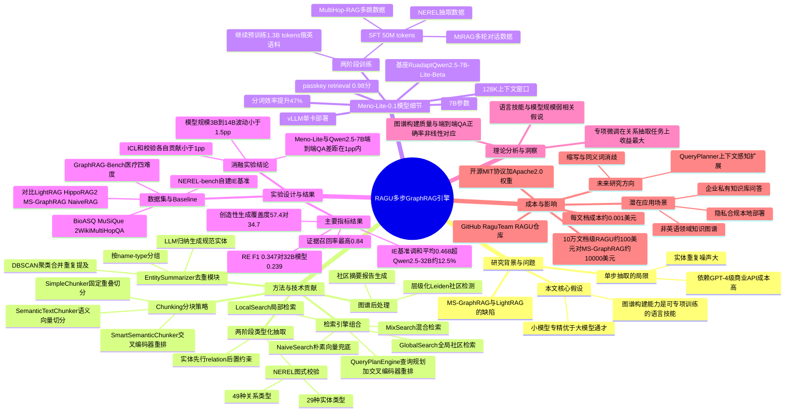

## 一、论文是干什么的？

想象你要把一整座图书馆的书都读完，然后随时能回答任何跨越多本书的问题——比如"哪些角色在第三卷和第七卷里都出现过，他们的关系是什么"。普通的 RAG（检索增强生成）只会把和问题字面相似的几段文字捞出来给大模型看，遇到这种需要"跨文档串联信息"的问题就很容易抓瞎。

GraphRAG 的思路是先把全部文档"读一遍"，抽取出里面的实体（人名、地名、概念等）和它们之间的关系，搭建成一张知识图谱，再把图谱里相近的内容聚成一个个"社区"（community），并为每个社区写一份摘要。回答问题时，既可以顺着图谱走关系链条找答案（类似人工侦探翻案卷牵线索），也可以直接看社区摘要（类似先读目录再决定翻哪一章）。

但已有的 GraphRAG 系统（如微软的 GraphRAG、LightRAG）通常是"一步到位"：丢给一个超大模型一段文字，让它同时把实体和关系都抽出来，结果往往抽得又乱又重复（同一个人名可能被识别成三四个不同的实体），而且这类系统通常依赖 GPT-4 级别的商业大模型付费调用，处理海量文档时账单非常吓人。

RAGU 这篇论文的目标，就是把知识图谱的构建过程拆成多个可控的步骤（这也是标题里"Multi-Step"的含义），并配上一个专门为这套流程"量身定制"的小模型 Meno-Lite-0.1，从而用远低于调用商业大模型的成本，做出质量不输、甚至在检索完整性上更好的 GraphRAG 系统。

## 二、核心方法与创新

RAGU 的核心创新可以用"流水线工厂"来类比：与其让一个工人从头到尾一个人把汽车造完（容易出错、效率低），不如把造车拆成分工明确的多道工序，每道工序做好自己的活儿再交给下一道。

**1. 分块（Chunking）：先把原料切好**
论文提供了三种切文档的方式：固定长度重叠切分（SimpleChunker）、基于向量语义相似度切分（SemanticTextChunker），以及在语义切分基础上再用交叉编码器（cross-encoder）重新打分排序的 SmartSemanticChunker，好比切菜时既可以用固定刀距切，也可以按食材的天然纹理切。

**2. 两阶段的"先分类、后连线"抽取**
这是本文最关键的设计之一。不同于其他系统"实体+关系一锅炖"的做法，RAGU 先做实体抽取，并把结果对照 **NEREL 图式**（一种预定义的标注体系，包含 29 种实体类型和 49 种关系类型）进行校验，确认这些实体确实合规；然后才把这些"验过身份"的实体作为约束条件，喂给下一步的关系抽取。这就好比先给所有登场人物核对身份证、确认职业身份，再去梳理"谁认识谁、谁和谁是什么关系"，避免了在身份都没搞清楚时就乱连线。

**3. EntitySummarizer：实体去重"合并同类项"**
文档一多，同一个实体（比如"联合国"）可能在不同段落里以略有差异的说法反复出现，直接搭图谱会造出一堆看似不同、实际是同一个东西的"影子节点"。RAGU 设计了 EntitySummarizer 模块：先把实体按"名字+类型"分组，对同一组里重复提及很多的实体，用 **DBSCAN 聚类算法**（一种能自动发现"扎堆"数据点、不需要预先指定簇数的聚类方法）把相似的提及聚成堆，再用大模型对每一堆做归纳总结，合并成一个干净的规范实体节点。这好比图书馆管理员把散落各处、写法不同的同一本书的多个条目合并成一条唯一的目录记录。

**4. 社区发现与摘要生成**
用**层级化 Leiden 聚类算法**把整张知识图谱切分成一个个"社区"（关系紧密的实体子集群），再让大模型为每个社区生成结构化摘要报告，方便后续做"全局性"问题的检索（比如"这批文档整体讲了什么主题"）。

**5. 多种检索引擎**
RAGU 提供了 LocalSearch（局部检索，围绕具体实体）、GlobalSearch（全局检索，基于社区摘要）、NaiveSearch（朴素向量检索兜底对比）、MixSearch（混合检索）和 QueryPlanEngine（带查询规划和交叉编码器重排序的检索）五种检索方式，可以按场景灵活切换。

**6. 自研小模型 Meno-Lite-0.1：让流水线上的每道工序都"配得起"便宜又好用的工人**
论文的核心假设是：知识图谱构建过程中需要的能力——读懂给定上下文、按格式抽取信息、在有限范围内做推理——本质上是一种"语言技能"，并不需要模型参数量堆得特别大就能做好，反而是有没有"专门练过这门手艺"更关键。为验证这一点，作者专门训练了一个 70 亿参数的小模型 Meno-Lite-0.1，用于承担流水线里实体/关系抽取、社区摘要等环节的工作，试图证明"一个训练得当的小模型"可以媲美甚至超过没有专门训练过、参数量大得多的通用模型（论文对比了 Qwen2.5-32B）。这好比与其请一个"什么都懂一点"的通才顾问按天计费，不如培养一个专精特定几道工序的熟练技工，干得又快又便宜还更专业。

## 三、使用了哪些模型和计算资源？

这是本次综述重点核实的部分，以下内容全部来自 arxiv 全文（含附录），未标注来源的均为论文原文明确写出的信息；论文没有写清楚的，如实注明"论文未明确说明"。

**Meno-Lite-0.1 模型本身：**
- **基座模型**：RuadaptQwen2.5-7B-Lite-Beta（一个针对俄语适配过的 Qwen2.5 系列模型）
- **参数量**：70 亿（7B）
- **训练方式（两阶段）**：
  - 继续预训练（continued pretraining）：使用约 13 亿（1.3B）token 的俄语与英语教育/科学类文本
  - 有监督微调（SFT）：使用约 5000 万（50M）token 的数据，包括基于 NEREL 图式的抽取数据、多跳问答数据（来自 MultiHop-RAG 基准）、多轮对话数据（来自 MtRAG 基准）以及查询日志，目的是"让模型学会利用给定上下文而不是凭记忆回答"
  - **微调具体方法（是否用 LoRA、学习率、batch size、训练轮数等超参数）：论文未明确说明**，全文和附录都没有给出这些细节
- 上下文窗口：128K tokens；论文称在俄语文本上分词效率比原版 Qwen2.5 提升 47%（3.77 对比 2.57 字符/token）；128K 长度下的"密钥检索"（passkey retrieval）得分为 0.98；通过 vLLM 部署
- 开源协议：Apache 2.0，模型权重发布在 [huggingface.co/bond005/meno-lite-0.1](https://huggingface.co/bond005/meno-lite-0.1)

**流水线中其他用到的模型：**

| 用途 | 模型 | 类型 |
|---|---|---|
| 图谱构建（实体/关系抽取、社区摘要） | Meno-Lite-0.1（7B）、或 Qwen2.5-7B/14B/32B、或 gpt-oss-20b | 开源权重，本地运行 |
| 答案生成（所有对比系统统一使用，目的是排除生成模型差异这一变量，只比较图谱构建质量） | gpt-4o-mini | OpenAI 商业 API |
| 评测打分 | google/gemini-3-flash-preview | 商业 API |

**训练用的硬件（GPU 型号、数量）：论文未明确说明。** 全文和附录都没有给出继续预训练和 SFT 阶段具体用了什么型号、多少张 GPU、训练了多久。

**推理/部署用的硬件：** 论文只说系统"可在单张 GPU 上运行"，支持"通过 vLLM 在单张消费级 GPU 上部署"，但**没有指明具体是哪款 GPU 型号**（比如没有提及是 A100、H100 还是 RTX 4090 等），也没有给出具体数量，只反复强调"单卡即可"。

**耗时与成本信息（附录 C，Table 8 "Cost Analysis"）：** 这是论文里少数给出的具体数字：
- 图谱构建吞吐量：约每份文档 8000 tokens，处理速度约 2000 tokens/秒（据此换算，处理一篇文档大约需要几秒钟，这是根据论文数字推算的，并非原文直接给出的"每篇文档耗时"表述）
- 每篇文档的成本：约 **0.001 美元/篇**，基于租用 GPU 大约 1 美元/小时的价格估算
- 处理 10 万篇文档规模的语料库时的成本对比：
  - RAGU + Meno-Lite-0.1（本地 GPU）：约 **100 美元**
  - 微软 GraphRAG + gpt-4o API：约 **10000 美元**
  - 论文称这是"低了大约两个数量级"

**训练总耗时、单次微调具体花了多久：论文未明确说明。**
**单次查询的响应延迟：论文未明确说明。**

## 四、实验结果

论文在多个基准上做了对比，基线系统包括 LightRAG、HippoRAG 2、微软 GraphRAG（MS-GraphRAG）和朴素向量检索 NaiveRAG。

**使用的数据集/基准：**
- GraphRAG-Bench（医疗领域，分事实检索、复杂推理、语境摘要、创造性生成四个难度层级）
- BioASQ、MuSiQue、2WikiMultiHopQA（多跳问答基准）
- MERA（俄语评测基准）
- NEREL-bench（论文自建的知识图谱构建/信息抽取基准）

**GraphRAG-Bench 生成质量（答案正确率 %，节选）：**

| 系统 | 用于建图的模型 | 事实检索 | 复杂推理 | 语境摘要 | 创造性生成 |
|---|---|---|---|---|---|
| RAGU | Meno-Lite-0.1 | 54.2 | 53.7 | 64.1 | 59.0 |
| RAGU | Qwen2.5-7B | 54.1 | 54.6 | 64.9 | 58.1 |
| HippoRAG 2 | Meno-Lite-0.1 | 72.4 | 68.4 | 65.0 | 56.9 |
| HippoRAG 2 | Qwen2.5-7B | 72.7 | 67.9 | 64.6 | 57.2 |
| LightRAG | Meno-Lite-0.1 | 26.2 | 20.2 | 22.6 | — |

值得注意的是，在这张"答案正确率"表里，HippoRAG 2 在事实检索和复杂推理上的分数其实高于 RAGU，RAGU 真正的优势并不体现在这个指标上全面领先，而是体现在下面这两点：
- **证据召回率（检索完整性）**：论文强调"RAGU 在各个事实颗粒度上都能检索到最完整的上下文，证据召回率最高达 0.84，而对手系统均不超过 0.76"
- **创造性生成任务的覆盖度指标**：RAGU 为 57.4，HippoRAG 2 为 34.7，差距明显

**多跳问答（简洁生成协议下的答案正确率）：**

| 系统 | BioASQ | MuSiQue | 2WikiMultiHop |
|---|---|---|---|
| RAGU（Meno-Lite-0.1） | 72.8 | 40.7 | 55.1 |
| RAGU（gpt-oss-20b） | 72.9 | 40.1 | 58.0 |
| HippoRAG 2（gpt-oss-20b） | 72.4 | 54.4 | 63.5 |
| NaiveRAG | 71.7 | 36.6 | 53.7 |

**知识图谱构建/信息抽取基准（论文自建，越高越好）：**

| 模型 | 参数量 | NER F1 | 定义生成 chrF++ | 关系抽取 F1 | 关系定义 chrF++ | 调和平均 |
|---|---|---|---|---|---|---|
| Meno-Lite-0.1 | 7B | 0.504 | 0.527 | 0.347 | 0.558 | **0.468** |
| Qwen2.5-32B | 32B | 0.536 | 0.528 | 0.239 | 0.599 | 0.416 |
| Qwen2.5-7B | 7B | 0.477 | 0.479 | 0.192 | 0.541 | 0.356 |

这张表是论文"小模型专精可胜过大模型通才"论点最直接的证据：Meno-Lite-0.1 虽然实体识别（NER F1）略逊于参数量大它 4 倍多的 Qwen2.5-32B，但在关系抽取 F1 上以 0.347 大幅领先 Qwen2.5-32B 的 0.239，最终综合调和平均分反而领先约 12.5%。

**消融实验（附录 B）：** 论文发现上下文学习（in-context learning）和实体校验环节各自带来的答案正确率提升都"不超过 1 个百分点"；模型规模从 3B 到 14B 变化时，答案正确率波动也"不超过 1.5 个百分点"；而且"Meno-Lite-0.1 和 Qwen2.5-7B 在各种配置下的差距都在 1 个百分点以内"。这说明 Meno-Lite-0.1 的优势更集中体现在图谱构建/信息抽取这类"专项技能"上，而不是在端到端问答正确率上有压倒性领先。

## 五、潜在应用与已落地应用

**潜在应用方向：**
- 企业内部海量文档（合同、技术手册、法规、病历等）的知识库问答，尤其适合预算有限、不想为每篇文档都付费调用 GPT-4 级 API 的场景
- 非英语语种（论文特别针对俄语场景做了大量适配，比如分词效率优化）的领域知识图谱构建
- 需要跨文档、跨段落做多跳推理的问答系统，比如医疗、法律、科研文献检索
- 对隐私和数据合规有要求、必须本地私有化部署大模型的场景（因为 Meno-Lite-0.1 可在单张 GPU 上本地跑，不需要把数据发给外部 API）

**已落地情况：**
- **已开源**：代码仓库为 [github.com/RaguTeam/RAGU](https://github.com/RaguTeam/RAGU)（截至研究时约 112 星），可通过 `pip install graph_ragu` 直接安装使用，代码库中还包含约 374 个自动化测试
- 模型权重已发布在 HuggingFace：[huggingface.co/bond005/meno-lite-0.1](https://huggingface.co/bond005/meno-lite-0.1)（Apache 2.0 协议），RAGU 代码本身采用 MIT 协议
- 提供了演示网站（[RAGU Demo](https://raguteam.github.io/web/#!api=https%3A%2F%2Fragu-back.duckdns.org)）和演示视频（[YouTube](https://youtu.be/bicJDMJuQfg)）
- 该项目获得了 GitVerse、Cloud.ru 与 Habr 联合举办的"Code Without Borders"开源资助计划 AI 创新赛道第一名，以及 Yandex 开源资助计划 AI 赛道第一名（授予作者 Mikhail Komarov）
- 目前没有发现被某家具体商业公司或产品正式采用的公开证据，落地目前主要体现在开源社区层面

## 六、网络上的讨论与评价

- **HuggingFace 论文页**：截至研究时获得 143 个点赞（upvotes），并被评为 2026 年 7 月 20 日的"当日热门论文第一名"，有 8 位署名贡献者及 135 位额外支持者。评论区有一条较有实质内容的技术讨论，聚焦于实体去重环节如何处理"字面上相差较大的同义词"和缩写词歧义问题，并提到作者计划在 QueryPlanner 中加入基于上下文的缩写消歧扩展功能。
- **Twitter/X**：搜索到一条疑似分享该论文的推文（来自一个经常转发 NLP/IR 新论文的账号），但由于 X 平台内容抓取返回 402 付费墙错误，未能确认具体推文内容和互动数据。
- **Habr（俄语技术社区）**：搜索结果中出现一篇疑似相关的 Habr 文章链接，但抓取时因连接被重置未能确认具体内容；考虑到 Habr 是该项目资助方之一，二者存在关联的可能性较高，但内容未经核实。
- **Reddit / Hacker News**：未搜索到专门针对 RAGU 或 Meno-Lite 的讨论帖，搜索结果只返回了与本论文无关的、关于微软早期 GraphRAG 发布的旧讨论。
- **知乎、公众号等中文平台**：暂未搜索到关于本论文的中文讨论，搜索结果只返回了与本论文无关的 GraphRAG 科普类文章。
- 另有一个论文摘要聚合站 chatpaper.com 收录了本文页面，但这属于自动化索引，不代表存在真实的社区讨论。
- **总结**：除 HuggingFace 评论区外，暂未搜索到确凿的 Twitter/X、Reddit、Hacker News 或中文平台上的实质性讨论。

## 七、思维导图

