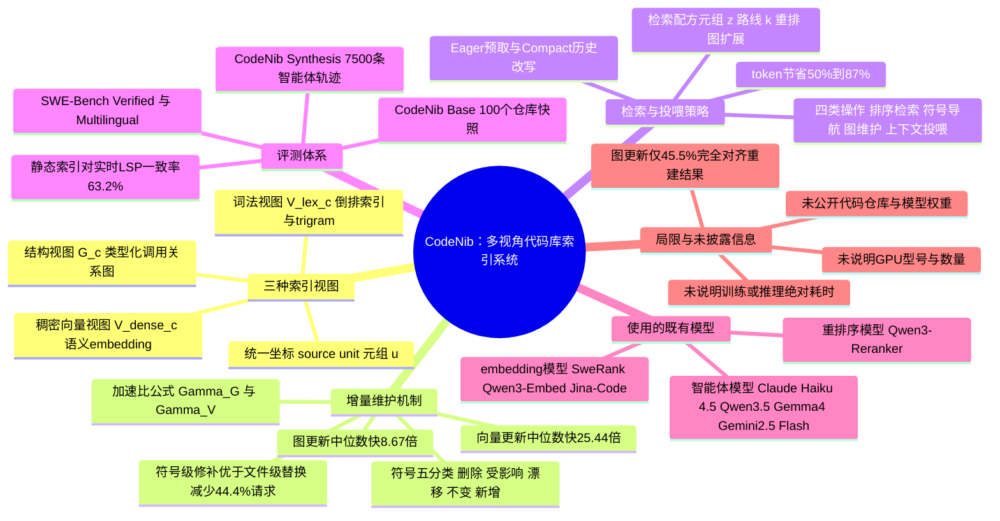

## 一、论文是干什么的？

想象你请了一个新同事来帮你改一个几十万行代码的大项目。这个新同事(也就是编程 AI 智能体,比如 Claude Code、Cursor 这类工具)每次接到任务,都得先自己动手在代码库里到处 `grep` 关键词、一个个文件翻开来读,才能搞清楚"这个函数在哪、被谁调用、改了会影响谁"。这个过程既慢,又占用大量"脑容量"——也就是大模型的上下文窗口(能一次性看到并记住的文字量)。

CodeNib 要解决的就是这个问题:与其让 AI 智能体每次都从零开始"翻箱倒柜",不如提前给整个代码库建好几套不同类型的"索引卡片"——有点像图书馆同时准备了关键词卡片目录(方便按词找)、语义分类卡片(方便按意思找相近的书)、还有一张标注了"这本书引用了哪些书、被哪些书引用"的关系图。当代码库发生一次小改动(比如提交了一次 commit),系统不需要把所有卡片全部重做一遍,而是只修补被改动影响到的那一小部分,省时又省力。同时,当 AI 智能体需要代码上下文时,系统会精心挑选最相关的一小段代码喂给它,而不是把整个文件糊过去,从而节省宝贵的上下文空间(也就是能省 token,省钱又省时间)。

## 二、核心方法与创新

### 1. 三种"视图"(view),各管一摊

论文认为,给代码库建索引这件事,天生就分裂成三种不同性质的数据,没法用一套物理存储硬凑合:

- **词法视图(lexical view, $V^{lex}_c$)**:类似搜索引擎的倒排索引/字符 trigram(三字符片段)记录,专门对付"找变量名、找路径、找注释里的关键词"这种精确文本匹配。
- **稠密向量视图(dense view, $V^{dense}_c$)**:把代码片段用 embedding(嵌入向量)模型转成向量,方便做语义相似度检索——即使你没写对关键词,意思相近的代码也能被找到。
- **结构视图(structural view, $G_c$)**:一张图(graph),节点是文件、作用域、函数定义等,边是"包含""调用""引用"这类关系,类似代码的"family tree"。

这三种视图都挂在同一个 commit(代码提交版本)之下,并且都必须能精确地映射回代码库里的具体文件路径和行号范围,不能"查到了但不知道在哪一行"。

### 2. 用一个统一的"坐标系"描述代码位置

论文定义了一个叫"源单元"(source unit)的元组来统一描述代码库里任意一个位置:

$$
u = \langle p, r_s, r_e, \ell, \tau, x, s \rangle
$$

其中 $p$ 是相对代码库根目录的文件路径,$[r_s, r_e]$ 是起止行号范围,$\ell \in \{L_0, L_1, L_2\}$ 表示颗粒度(分别对应"整个文件""作用域""可调用的函数/方法"三个粒度),$\tau$ 是节点类型,$x$ 是源代码文本本身,$s$ 是解析出来的符号(比如这个函数叫什么名字)。有了这个统一坐标系,三种视图查出来的结果才能对得上号。

### 3. 增量维护:改一点,修一点,不用全部重建

这是论文的一个核心卖点。代码库每次提交都会有改动,如果每次都把索引全部推倒重建,代价太大。CodeNib 在做图(结构视图)维护时,会把改动涉及的符号分成五类:**已删除、受影响、位置漂移(shifted)、未变、新增**,然后只针对性地修补这些部分,尽量保留没变的那部分索引事实(facts),而不是把整个文件的索引推倒重来。

论文用一个速度比值来衡量这种"增量修补"比"全量重建"划算多少:

$$
\Gamma_G = \frac{T^{G}_f}{T^{G}_{u} + T^{G}_{s} / n_{share}}, \qquad \Gamma_V = \frac{T^{V}_f}{T^{V}_u}
$$

这里 $T^G_f$ 是全量重建图索引的耗时,$T^G_u$ 是增量更新耗时,$T^G_s$ 是共享的解析开销,$n_{share}$ 是共享该开销的更新数;向量索引同理用 $T^V_f$(全量重建)和 $T^V_u$(增量更新)对比。比值大于 1,就说明增量更新比全量重建划算,数字越大越划算。

### 4. 检索"配方"与给智能体喂料的策略

论文把"怎么检索"也抽象成一个可调的元组 $z = \langle r, k, \rho, h \rangle$:$r$ 决定走词法、语义、混合还是结构化路线,$k$ 控制召回多少候选再筛选多少,$\rho$ 决定要不要用重排序模型(reranker)进一步精排,$h$ 决定要不要沿着结构图做扩展检索(比如顺着调用关系多找几层)。

在给智能体真正"喂"上下文时,论文比较了三种策略:
- **Grep/read**:什么都不预先准备,让模型自己动手翻代码库(基线做法,也是很多现有工具的默认方式);
- **Eager(急切预取)**:提前把 Top-10 的函数级(L₂)候选代码块塞进对话历史,让模型全程都能看到;
- **Eager+Compact(急切预取+精简改写)**:先塞入候选代码块,但在模型第一次真正读取代码之后,把此前冗长的历史一次性改写压缩,公式表示为把历史 $H_j = [s, q \Vert C_{10}^{ctx}, e_{1:j}]$ 精简改写成 $\hat H_j = [s, q \Vert d_j]$(即去掉已经用过的候选清单,只留关键摘要),从而省掉大量不再需要的 token。

## 三、使用了哪些模型和计算资源？

**实验中涉及的语言模型(作为"智能体"来跑评测,而非论文自己训练的模型):**
- Claude Haiku 4.5
- Qwen3.5(9B / 27B 两个规模)
- Gemma 4(12B-IT)
- Gemini 2.5 Flash

**用于构建稠密向量索引的 embedding 模型:**
- SweRank-Small(约1.37亿参数)、SweRank-Large(约70亿参数)
- Qwen3-Embed(0.6B / 4B)
- Jina-Code(1.5B)

**用于重排序的模型:**
- Qwen3-Reranker(0.6B / 4B / 8B)

以上模型均通过 API 调用或已有的开源权重直接使用,CodeNib 本身**不训练任何新模型**,而是一套围绕这些既有模型搭建的数据检索与索引系统。

**关于 GPU 型号、数量、训练/推理具体耗时:** 论文全文没有明确说明使用了哪种 GPU、多少张,也没有给出训练时长(因为本身不训练模型)。经过对 arxiv HTML 全文的逐字检索,论文只报告了系统层面的相对耗时指标,例如"索引构建的中位数耗时对比""符号导航请求的中位延迟比为 4.72 倍""图/向量增量更新在匹配重建结果的情形下,中位数分别快 8.67 倍和 25.44 倍"等相对倍数,但均未给出具体的绝对秒数、机器规格或加速卡信息。论文中提到"评测在隔离的静态代码库快照和全新运行时进程上进行,但使用了预热过的机器缓存(warm machine caches)",除此之外没有更多硬件细节。因此,GPU 型号/数量、训练时长这两项**论文未明确说明**。

## 四、实验结果

论文构建了两套评测集:**CodeNib Base**(100个代码库快照,取自 SWE-Bench Verified 和 SWE-Bench Multilingual,每种语言组挑5个代表性仓库)用于系统层面的检索/维护性能评测;**CodeNib Synthesis**(5个模型 × 3种上下文策略,共2500个"查询-模型"组合、7500条完整轨迹)用于智能体端到端评测。

| 评测项 | 具体设置 | 结果 |
|---|---|---|
| 符号导航:静态索引 vs 实时 LSP | 100个快照上的1000次请求 | 静态索引在63.2%的请求上能复现实时 LSP 给出的一致定位结果;在这些一致的请求子集里,实时 LSP 的中位延迟是静态索引的4.72倍(即静态索引明显更快) |
| 结构图增量维护(Q4) | 8个仓库,共40次代码变更(33次涉及图更新,31次涉及向量更新) | 图更新中有15/33(45.5%)次结果与独立全量重建完全一致,在这些一致情形下中位数快8.67倍;向量更新中有28/31(90.3%)次一致,一致情形下中位数快25.4倍 |
| 图维护策略对比(消融) | 全量重建 vs 文件级替换 vs 符号级修补 | 一个示例场景中,符号级修补比文件级替换减少了44.4%的 LSP 请求次数(从9次降到5次) |
| 智能体上下文投喂策略(Q5) | Grep/read vs Eager vs Eager+Compact,5个模型 | 在保持代码定位准确度基本不下降(容忍度 ε=0.05)的前提下,Eager/Eager+Compact 比传统的 grep/read 方式减少了50%到87%的对话轨迹 token 消耗(不同模型区间不同) |
| 稠密索引构建/检索(Q2) | 5种embedding模型 × Flat/IVF/HNSW三种索引结构 | 近似索引(IVF/HNSW)在最快配置下与精确的 Flat 索引相比,召回重合率仍能保持在0.95以上 |

**大白话总结:** 效果的核心结论是"增量修补通常比全量重建快一个数量级左右(尤其向量索引,常见能快25倍左右),静态索引大多数时候能跟实时语言服务器(LSP)给出一样的定位结果、而且明显更快;给智能体喂代码时,提前精选并适时压缩上下文,能在几乎不损失定位准确率的情况下省下五成到八成多的token"。消融实验进一步说明:符号级别的精细修补比粗暴的整文件替换更省力,近似向量索引在配置得当时几乎不损失精度却能提速。

需要提醒的是,图更新只有45.5%的情形能完全对上独立重建的结果,说明增量修补并非总是"完美等价"于全量重建,这也是论文如实报告的一个局限。

## 五、潜在应用与已落地应用

**潜在应用方向:**
- 集成进 Claude Code、Cursor、Cline、GitHub Copilot 这类编程智能体的"记忆/检索"层,减少它们在大型代码库里反复摸索的时间和token开销;
- 作为企业内部代码库的"上下文服务中间件",在 CI/CD 流水线里随每次提交自动增量更新索引;
- 应用于代码评审(code review)助手、自动化重构工具、跨仓库代码搜索引擎等需要"精确定位+语义检索"结合的场景。

**已落地情况:** 经过对 arxiv 全文的逐字检索以及网络搜索(包括 GitHub 搜索关键词 CodeNib、论文标题、机构名等),**没有找到该论文对应的开源代码仓库或预训练模型权重发布**。论文正文提到系统"基于 Python 3.10+ 实现,包含编译器(compiler)、图(graph)、索引(index)、智能体运行时(agent-runtime)、服务适配层(serving-adapter)等模块",但并未给出具体的 [GitHub](https://github.com) 或 [HuggingFace](https://huggingface.co) 链接,目前看是一篇纯研究论文,尚无公开产品或 demo。

## 六、网络上的讨论与评价

按照要求,分别用论文标题、arxiv ID(2607.25431)、机构名("SysEvol AI Research")、作者姓名等中英文关键词在网络上搜索,也尝试搜索 Hacker News、Reddit 等平台的关键词组合,均未搜到任何专门针对 CodeNib 这篇论文的讨论、转发或评价文章。搜索到的相关结果多是关于"编程智能体上下文管理"这一大主题的泛泛讨论,但并未直接提及 CodeNib 或其作者。因此,**暂未搜索到关于本论文的社区讨论**。需要说明的是,由于该论文提交时间较新(2026年7月28日),后续可能会有讨论陆续出现,当前搜索结果可能无法反映之后的情况。

另外需要如实说明一点:HuggingFace 论文页面上标注的机构信息为"SysEvol AI Research",经查证这只是 HuggingFace 用来聚合/归类论文的组织名称标签,而论文作者自身在 arxiv 页面标注的真实所属机构为加州大学圣地亚哥分校(UC San Diego,主要作者所在单位)、斯坦福大学(Stanford University)、加州大学河滨分校(UC Riverside)、南加州大学(University of Southern California)。因此本文 frontmatter 中的 institution 字段已按真实机构填写,而非沿用 HuggingFace 的聚合标签。

## 七、思维导图

