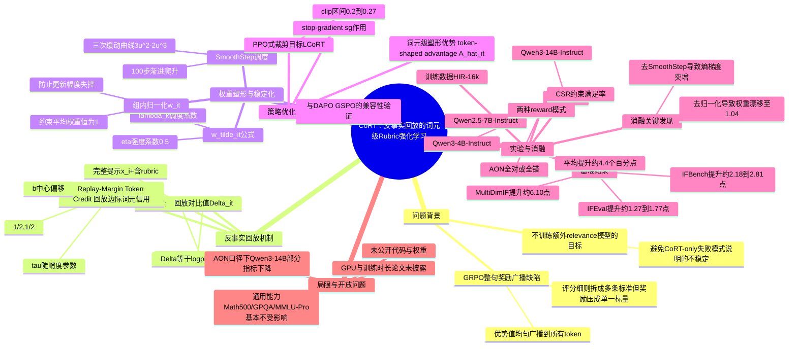

## 一、论文是干什么的？

想象你在批改一篇学生作文，评分细则（rubric）里写着好几条要求，比如"要有引言""要控制在300字以内""要用第三人称"。传统的自动化打分方式很粗暴：读完全文后只给一个总分，比如"这篇作文得85分"。但这85分到底是因为哪一句话、哪几个字写得好，学生完全不知道，只能笼统地把这个总分"平摊"到全文每一个字上，仿佛每个字对最终得分的贡献都一样大。这显然不合理——决定"是否用了第三人称"的可能只是文中的几个代词，其余大段描述性文字跟这条规则毫无关系。

现在大语言模型的训练也面临同样的问题。业界流行用"评分细则+强化学习"（rubric-based RL）的方式来教模型更好地遵循指令：把一条复杂指令拆解成好几条可以逐一打勾的具体标准（正确性、格式、安全性等），模型生成回答后按标准打分，再把这个分数转成一个"优势值"（advantage），用类似 GRPO（Group Relative Policy Optimization）的算法去更新模型参数。但问题就出在这里：这个优势值是针对整句话算出来的一个数字，训练时却被平均地广播到回答里的每一个词元（token，可以粗略理解为一个字或一个词）上——就像前面批改作文的例子一样，模型没法知道回答里具体是哪几个词真正决定了它是否符合某条规则，学习信号因此变得又粗又钝。CoRT这篇论文要解决的正是"如何把整句的评分细则奖励，精确拆分到每个具体的词元上"这个问题，而且做到不用额外训练一个新模型来判断"哪个词重要"。

## 二、核心方法与创新

### 核心思路：反事实回放（Counterfactual Replay）

CoRT的关键想法很巧妙：既然想知道某个词是不是"因为评分细则才被这样生成的"，那就把同一个已经生成好的回答，分别放到两种不同的提示语境下，让模型重新计算一遍"我在这个语境下说出这句话里每个词的概率有多大"。第一种语境是完整提示（带着评分细则的具体要求），第二种语境是"反事实"提示——把评分细则去掉，只留下最基础的任务描述。如果某个词是模型专门为了满足某条规则而写的（比如某个格式标记、某个关键限定词），那么去掉规则后，模型说出这个词的概率就会明显下降；而对于那些跟规则无关的、纯粹描述性的普通词，去掉规则前后模型说它的概率几乎不会变。这个"概率变化的对比"就是判断一个词是否与评分细则相关的信号，完全不需要额外训练一个判别器。

用公式表示：对第 $i$ 个回答里第 $t$ 个词元，分别在带评分细则的完整提示 $x_i^+$ 和去掉评分细则的提示 $x_i^-$ 下计算对数似然：

$$
\ell_{i,t}^{+} = \log \pi_{\bar\theta}(y_{i,t}\mid x_i^{+}, y_{i,<t}), \qquad \ell_{i,t}^{-} = \log \pi_{\bar\theta}(y_{i,t}\mid x_i^{-}, y_{i,<t})
$$

两者之差就是"回放对比值"：

$$
\Delta_{i,t} = \ell_{i,t}^{+} - \ell_{i,t}^{-}
$$

$\Delta_{i,t}$ 越大，说明这个词越依赖评分细则的存在。

### 第二步：把对比值变成有界的词元权重

原始的 $\Delta_{i,t}$ 数值范围不稳定，直接拿来用会让训练变得不稳定，所以论文用一个 sigmoid 函数把它压缩到一个有界区间里，再乘上一个强度系数和调度系数，得到最终的原始权重：

$$
s_{i,t} = \mathrm{sigmoid}\big(\tau(\Delta_{i,t} - b)\big) - \frac{1}{2} \in \left(-\frac{1}{2}, \frac{1}{2}\right)
$$

$$
\tilde w_{i,t} = 1 + \eta\,\lambda_k\, s_{i,t}
$$

这里 $\tau$ 控制这个映射曲线有多"陡"（越陡代表越敏感地区分相关/不相关词），$b$ 是一个中心偏移量，$\eta$ 是控制这个机制整体强度的系数，$\lambda_k$ 是一个随训练步数变化的调度系数（下面会讲为什么需要它）。

### 第三步：SmoothStep调度——训练初期先别急着用

训练刚开始时，模型对"哪些词依赖评分细则"的判断还很不准（毕竟这时模型本身还没学好），如果一上来就用这套词元权重去调整训练信号，容易造成训练震荡。所以论文引入了一个平滑渐进的调度函数，让这套机制在训练前期的影响力从0慢慢爬升到满值：

$$
\lambda_k = 3u_k^2 - 2u_k^3, \qquad u_k = \mathrm{clip}\left(\frac{k-k_0}{K}, 0, 1\right)
$$

这是一个经典的"三次缓动曲线"（SmoothStep），前期平缓、中期加速、后期再平缓，跟游戏动画里做渐入渐出效果用的曲线类似，作用就是让新机制不要"猛地"介入训练。

### 第四步：组内归一化，防止整体信号偏移

为了避免这些词元级别的权重调整改变了整个回答的"总奖励量级"（否则相当于变相调大了学习率，可能破坏训练稳定性），论文对每个回答内部的权重做了归一化，让一个回答里所有词元权重的平均值恒等于1：

$$
w_{i,t} = \frac{\tilde w_{i,t}}{\bar w_i}, \qquad \bar w_i = \frac{1}{T_i}\sum_t \tilde w_{i,t}, \qquad \frac{1}{T_i}\sum_t w_{i,t} = 1
$$

### 最终训练目标

把这个归一化后的词元权重乘到原本 GRPO 里"整句共享"的组相对优势值 $A_i$ 上（$A_i$ 本身还是用标准 GRPO 方式算出的组内归一化奖励），得到逐词元的"定向优势值" $\hat A_{i,t}$，再套用类似 PPO/GRPO 的裁剪目标函数进行策略更新：

$$
\hat A_{i,t} = \mathrm{sg}(w_{i,t})\, A_i, \qquad \mathcal{L}_{\mathrm{CoRT}} = -\mathbb{E}_{i,t}\left[\min\big(\rho_{i,t}\hat A_{i,t},\ \bar\rho_{i,t}\hat A_{i,t}\big)\right]
$$

其中 $\mathrm{sg}(\cdot)$ 表示"停止梯度"（这个权重只用来加权，不参与反向传播求导），$\rho_{i,t}$ 是新旧策略在该词元上的概率比值（PPO里常见的重要性采样比率），$\bar\rho_{i,t}$ 是裁剪后的版本。

简单打个比方：原来是老师批改完作文只给一个总分，然后不管三七二十一把这个分数"平均"记到每一句话头上；CoRT相当于老师先把评分细则藏起来重新读一遍作文，看看哪些句子"没有细则也照样这么写"、哪些句子"明显是为了迎合某条细则专门加的"，然后按这个线索给不同句子分配不同权重的表扬或批评，但整体表扬批评的总量还是跟原来打的总分挂钩，不会无故放大或缩小。

论文还测试了两种奖励口径：**CSR**（Constraint Satisfaction Rate，约束满足率）是"满足了几条细则就按比例给分"，**AON**（All-or-Nothing，全对或全错）是"必须全部满足才给分，否则一分都没有"，两种口径下CoRT都能带来提升。

## 三、使用了哪些模型和计算资源？

**基座模型（LLM）：**
- Qwen3-4B-Instruct（主实验模型）
- Qwen2.5-7B-Instruct（主实验模型）
- Qwen3-14B-Instruct（用于消融/扩展验证）

**训练超参数（论文明确给出）：**
- 每次训练的提示（prompt）批大小：64
- 每个提示采样的回答数：8
- 最大提示/回答长度：2048词元 / 4096词元
- Actor学习率：$10^{-6}$，warmup占比3%
- 采样温度：1.0，top-p：0.99，top-k：100
- PPO式裁剪区间：[0.2, 0.27]
- CoRT专属超参数：$\eta = 0.5$，SmoothStep渐进爬升期为100步，sigmoid陡峭度 $\tau = 1.0$（零中心化）
- 训练数据集：HIR-16k（提供"提示+指令列表"配对，用来构造带评分细则的完整提示和去掉细则的反事实提示）
- 训练评估窗口：主要在前500个训练步内比较，另有延伸到第530步的观察

**GPU型号、数量与训练/推理耗时：** 论文未明确说明。我逐字检索了arxiv HTML全文中的实验设置、训练配置、附录部分，未找到任何关于GPU型号（如H100/H800/A100等）、GPU数量、训练总时长（小时/天）或单步训练耗时的描述；论文也未提及调用了任何按次计费的商业API（AdvancedIF评测中提到用o3-mini作为裁判模型打分，但未说明调用次数或耗时）。因此这部分只能如实标注为"论文未明确说明"。

## 四、实验结果

CoRT主要在指令遵循类基准上测试，对比的基线是标准GRPO（即没有词元级权重、整句奖励平均分配的做法）。下表整理了论文报告的部分关键数值（均为相对标准GRPO基线的提升幅度）：

| 模型 | 基准测试 | 指标 | CoRT（CSR口径）相对GRPO的提升幅度 |
|---|---|---|---|
| Qwen3-4B-Instruct | IFEval | prompt级准确率 | 约+1.77个百分点 |
| Qwen3-4B-Instruct | IFEval | instruction级准确率 | 约+1.27个百分点 |
| Qwen3-4B-Instruct | IFBench | prompt级准确率 | 约+2.18个百分点 |
| Qwen3-4B-Instruct | IFBench | instruction级准确率 | 约+2.81个百分点 |
| Qwen3-4B-Instruct | MultiDimIF | 多维约束准确率 | 约+6.10个百分点 |
| Qwen3-4B-Instruct | AdvancedIF（用o3-mini当裁判） | 综合得分 | 约+1.33个百分点 |
| Qwen2.5-7B-Instruct | IFEval | prompt级准确率 | 约+3.36个百分点 |
| Qwen2.5-7B-Instruct | IFEval | instruction级准确率 | 约+3.10个百分点 |
| Qwen2.5-7B-Instruct | IFBench | prompt级准确率 | 约+6.40个百分点 |
| Qwen2.5-7B-Instruct | IFBench | instruction级准确率 | 约+6.45个百分点 |
| Qwen2.5-7B-Instruct | MultiDimIF | 多维约束准确率 | 约+11.85个百分点 |
| Qwen2.5-7B-Instruct | AdvancedIF（用o3-mini当裁判） | 综合得分 | 约+3.27个百分点 |

（以上均为相对标准GRPO基线的提升幅度，论文正文未给出各基准的绝对分数，故此表统一只呈现提升幅度。）

论文摘要中给出的总体结论是：相对标准GRPO，CoRT平均带来约4.4个百分点的提升，同时与"额外训练一个词元相关性判别模型"的方法相比效果相当甚至更好，且不需要训练那个额外模型，训练过程也保持稳定。

**Qwen3-14B-Instruct的扩展验证**：在CSR口径下，各项指标均有提升；但在AON（全对或全错）口径下表现不一，IFBench和MultiDimIF上有提升，IFEval上则略有下降，说明这套方法在更严苛的"全对才给分"场景下的收益不完全稳定。

**通用能力是否受损**：论文在Math500、GPQA-Diamond、MMLU-Pro（mean@5指标）上做了检查——Qwen3-4B模型上变化很小（平均约±0.27%），Qwen2.5-7B模型在CSR口径下有小幅下降（平均约-0.62%）。说明针对指令遵循做优化，基本没有明显损害模型的数学、知识类通用能力。

**消融实验结论：**
1. **去掉组内归一化**：训练中平均词元权重会逐渐漂移到约1.04，后期出现长度截断比例、梯度范数、生成熵的急剧上升，说明归一化是控制更新幅度、防止训练"失控放大"的关键。
2. **去掉SmoothStep渐进调度**：一开始就满强度介入会导致训练后期梯度和熵出现突然的尖峰，长度截断比例也比完整方案更高，说明"先慢慢来"的渐进策略对稳定性很重要。
3. **兼容性测试**：把CoRT机制接到DAPO算法上，在IFEval、IFBench、MultiDimIF三个指标上都有提升；接到GSPO算法上，5个指标里有4个提升，仅MultiDimIF小幅下降。说明CoRT这套词元加权思路不是只能配GRPO用，跟其他同类策略优化算法也能搭配。
4. **失败模式**：如果去掉GRPO本身的整句优势值、只单独用CoRT的词元对比信号做训练，训练奖励会更低、长度截断比例更高，说明词元级别的对比信号必须依附在"整句奖励方向"之上才能稳定生效，不能单独作为奖励来源。

## 五、潜在应用与已落地应用

**潜在应用方向：**
- 对话助手、写作助手等场景中，需要模型同时满足多条具体格式/内容要求（如字数限制、语气要求、必须包含某些信息）的指令遵循能力强化训练；
- 企业内部的AI客服、合规审核类应用，这类场景天然带有"评分细则"式的多条硬性规则（如必须免责声明、不能给出投资建议等），需要精细化的规则遵从训练；
- 更广泛地，任何"用打勾式评分细则做强化学习奖励"的场景（如代码规范检查、安全对齐训练）都可能受益于把整句奖励拆解到词元级别这一思路；
- 该反事实对比思路本身也可能启发其他"事后归因/可解释性"研究，比如分析大模型某个输出片段究竟受哪个提示条件影响最大。

**已落地应用与开源情况：** 经过检索arxiv全文以及在GitHub、HuggingFace上搜索"CoRT"“Counterfactual Replay”"rubric"等关键词组合，未找到该论文对应的官方代码仓库、模型权重或demo发布地址。论文正文中提及作者的ByteDance实习背景，暗示训练所用的具体基础设施可能是内部专有系统，目前没有公开的开源实现。

## 六、网络上的讨论与评价

我使用论文标题、arxiv编号（2607.25659）、机构名"ByteDance"等关键词组合，在通用网络搜索中查找了Reddit、Hacker News、X(Twitter)、知乎等平台的讨论，搜索结果主要返回的是与该论文主题相近的其他论文（如"Enhancing Rubric-based RL via Self-Distillation""GTPO and GRPO-S""Rubrics to Tokens (RTT)"等同类"rubric+RL+词元级信用分配"方向的研究），未能找到专门针对本论文CoRT的社区讨论、评论或转发。由于该论文提交于2026年7月28日，距离本次撰写综述的时间较近，也可能是社区讨论尚未充分展开。因此如实说明：**暂未搜索到关于本论文的专门网络讨论**。

## 七、思维导图

