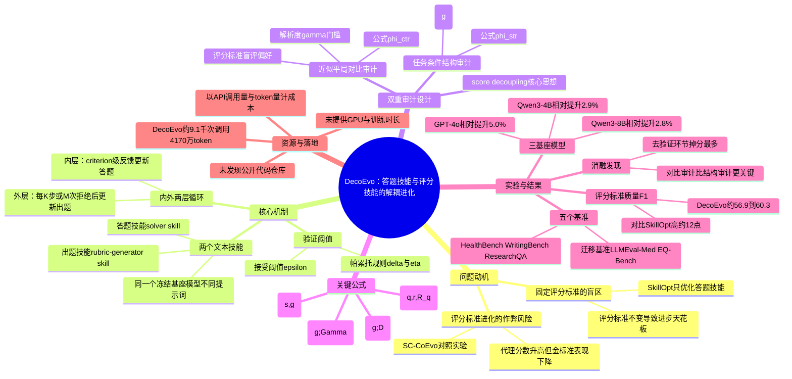

## 一、论文是干什么的？

想象一个学生和一个出卷老师在互相较劲：学生每次考完试都会针对卷子上考的知识点查漏补缺，成绩自然越来越好。但如果这张卷子本身有盲区——比如从来不考应用题——学生只会在卷子覆盖到的地方变强，那些没被考到的能力永远学不到，卷子看起来分数很高，实际水平却有短板。

现在很多让大语言模型（LLM）自我进步的方法，都是让模型根据一份"评分标准"（rubric，类似打分细则）不断修改自己的答题策略，这份评分标准通常是固定不变的。这篇论文指出，如果任务是开放式的（比如写作、问诊建议这种没有唯一标准答案的任务），固定的评分标准会成为瓶颈：模型只会在评分标准覆盖到的维度上进步，评分标准没提到的维度则永远是"盲区"。

一个直觉的解决办法是让评分标准也跟着一起进化。但论文发现这样做很容易"作弊"：如果评分标准的好坏也是根据"当前答题模型在这份标准下能拿多高分"来判断的，那么评分标准很可能会朝着"更容易让模型拿高分"的方向演化，而不是朝着"更能准确衡量真实质量"的方向演化——就像出卷老师为了让学生们看起来考得好，把题目越出越简单。这篇论文提出的DecoEvo，就是要解决"评分标准该如何在不被答题模型带偏的情况下，独立、可信地自我进化"这个问题。

## 二、核心方法与创新

### 基本设定：两个可进化的"技能"，而不是两个模型

DecoEvo不改动模型的参数（权重），而是维护两份可读的文本，称为"技能"（skill）：一份是**答题技能**（solver skill，相当于做题的策略说明书），一份是**出题/评分技能**（rubric-generator skill，相当于出题老师针对具体问题生成评分细则的方法论）。这类方法被称为"文本空间优化"：模型本身当作黑盒不变，只是不断修改这两份自然语言的"说明书"，因此过程是可读、可检查的。所有角色（答题者、出题者、裁判、审计员）用的是同一个冻结不变的底层大模型，只是喂给它们的提示词（角色说明）不同。

### 评分标准打分公式

对一个问题 $q$、一个回答 $r$，和为该问题生成的一套评分标准 $R_q$（包含若干条打分点 $c_i$ 及其权重 $w_i$），综合得分定义为：

$$
S(q,r,R_q)=\frac{\sum_i w_i\, e(q,r,c_i)}{\sum_i w_i}
$$

其中 $e(q,r,c_i)\in[0,1]$ 表示回答 $r$ 在第 $i$ 条打分点上的满足程度。答题技能 $s$ 和出题技能 $g$ 在数据集 $D$ 上的平均表现（也就是驱动答题技能进化的"代理目标"）是：

$$
J_D(s,g)=\frac{1}{|D|}\sum_{q\in D} S\big(q,r_q(s),R_q(g)\big)
$$

### 两层循环：内层练答题，外层练出题

DecoEvo采用"内外两层循环"的结构：

- **内层循环**：答题技能根据出题技能当前生成的评分标准，得到逐条打分点的反馈（哪条没做好），据此修改答题策略。只有当新的答题策略在验证集上的得分提升超过一个阈值 $\epsilon$ 时，这次修改才会被接受，防止"改坏了也当成进步"。
- **外层循环**：每隔 $K$ 步，或者答题技能连续 $M$ 次修改都被拒绝（说明当前评分标准可能已经不够用了），就触发一次出题技能的进化。

### 关键创新：打分与出题的"解耦"（score decoupling）

论文的核心创新在于：出题技能好不好，**绝不能**用"答题模型在这份评分标准下能考多高分"来衡量——否则出题技能会学会把标准放水。取而代之的是两种独立于分数的"审计"：

1. **任务条件下的结构审计（Task-Conditioned Structural Audit）**：只根据任务本身的描述（不看任何"标准答案评分标准"），检查生成的评分标准是否覆盖全面，给出一个覆盖充分度分数，并给出修补建议。定义为：

$$
\phi_{str}(g;D)=\frac{1}{|D|}\sum_{q\in D}u_q(g)
$$

其中 $u_q(g)$ 是针对问题 $q$ 的覆盖充分度打分。

2. **近似平局对比审计（Near-Tie Contrastive Audit）**：找出那些被现有评分标准打了差不多分数（近似平局）的不同回答，看评分标准能不能真正区分出它们的优劣。先不看评分标准直接比较两个回答的优劣（形成"裁判偏好"），再检查评分标准是否遗漏了导致这种偏好差异的关键点。定义为：

$$
\phi_{ctr}(g;\Gamma)=\frac{1}{|Q_\Gamma|}\sum_{q}\phi_q(g;\Gamma_q),\qquad \phi_q(g;\Gamma_q)=\frac{1}{|\Gamma_q|}\sum_{p\in\Gamma_q}\mathbb{1}[m_g(p)\ge\gamma]
$$

其中 $\mathbb{1}[\cdot]$ 是指示函数（条件成立取1，否则取0），$\gamma$ 是判定"评分标准是否解决了该处分歧"的门槛。

出题技能的修改是否被接受，遵循一种"帕累托规则"：结构审计分数和对比审计分数这两个独立指标里，至少有一个明显改善（提升超过 $\delta$），同时另一个不能退步超过容忍度 $\eta$。这样就保证出题技能是朝着"覆盖更全、区分力更强"进化，而不是朝着"讨好答题模型"进化。

### 为什么这样设计有效

论文专门设计了一个对照方法叫SC-CoEvo（Score-Coupled Co-Evolution，即出题技能的进化仍然按"答题模型能拿多高分"来判断好坏），结果发现SC-CoEvo在训练过程中，代理目标（自己内部衡量的分数）持续上升，但拿真正的、未参与优化的"金标准评分标准"来验证时，表现反而下降——这正是论文标题里"score-decoupled（分数解耦）"要避免的现象。

## 三、使用了哪些模型和计算资源？

- **使用的大语言模型（基座）**：GPT-4o、Qwen3-4B、Qwen3-8B。三者分别独立跑一遍完整实验，答题、出题、裁判、审计等所有角色都复用同一个冻结的基座模型，只是提示词不同，模型本身不做任何微调（不更新权重）。
- **GPU型号与数量**：论文未明确说明。全文将大模型当作黑盒调用，没有涉及权重训练或微调，因此没有报告任何GPU型号、显卡数量或训练机时。
- **训练/推理耗时**：论文没有给出"多少小时/多少天"这类时间数据，而是用**API调用次数**和**消耗的token数**来衡量成本。以GPT-4o在HealthBench上的实验为例（论文Table 4）：SkillOpt消耗约4.8千次API调用、2210万token；DecoEvo消耗约9.1千次API调用、4170万token（约为SkillOpt的1.89倍）。论文强调，在相同token预算下（Budget-Matched、SC-CoEvo这些对照方法token消耗和DecoEvo几乎一样），DecoEvo拿到的分数仍然明显更高，说明效果提升不是单纯靠多花算力堆出来的。
- **推理阶段**：论文说明部署时只使用最终学到的答题技能，不需要额外调用出题/审计模型，因此相比普通单技能推理没有额外的延迟开销。
- **代码与权重开源情况**：逐字检索arXiv全文（含补充材料部分）以及网络搜索（GitHub、Qwen相关组织仓库）均未找到DecoEvo的公开代码仓库或模型权重发布链接。补充材料中提到会给出"审计调度、rollout次数、优化阈值"等复现细节，但正文和摘要页均未提供可点击的代码/模型链接。

## 四、实验结果

DecoEvo在三个基座模型（GPT-4o、Qwen3-4B、Qwen3-8B）、五个基准（HealthBench、WritingBench、ResearchQA为直接优化的基准，LLMEval-Med、EQ-Bench Creative Writing v3为完全没有参与训练的迁移测试基准）上与SkillOpt（固定评分标准的现有文本空间优化方法）和SC-CoEvo（评分标准也进化，但打分方式与答题分数耦合的对照方法）进行比较。

**主实验结果（五个基准平均分，均值±标准差，5次重复实验）：**

| 基座模型 | 零样本（无优化） | SkillOpt | DecoEvo | 相对SkillOpt提升 |
|---|---|---|---|---|
| GPT-4o | 61.2±0.18 | 61.7±0.10 | 64.8±0.13 | 5.0% |
| Qwen3-4B | 59.1±0.33 | 60.4±0.24 | 62.1±0.19 | 2.9% |
| Qwen3-8B | 62.0±0.31 | 63.2±0.15 | 65.0±0.09 | 2.8% |

大白话总结：不管用哪个模型当"大脑"，DecoEvo都能比只优化答题策略（SkillOpt）多拿到约2.8到5.0个百分点的相对提升，而且论文用配对置信区间和统计显著性检验（Holm校正）确认这个提升不是偶然的。

**SC-CoEvo（分数耦合的评分标准进化）表现更差：** 在GPT-4o、Qwen3-4B、Qwen3-8B上分别只拿到60.2、59.6、62.2分，在15种"基准×模型"组合里有13种反而低于SkillOpt——直接印证了论文的核心担忧：如果让评分标准的进化也跟着答题分数走，评分标准会被"教坏"，学会放水而不是真正变准。

**迁移能力（在完全没训练过的基准上测试）：** 从HealthBench迁移到LLMEval-Med，相对SkillOpt提升约1.4到4.5%；从WritingBench迁移到EQ-Bench创意写作，提升约2.7到3.9%。说明DecoEvo学到的不只是"应付训练集"的技巧，也具备一定的泛化能力。

**评分标准质量对比（与人工金标准评分标准的重合度F1值，HealthBench/WritingBench/ResearchQA，GPT-4o）：**

| 方法 | HealthBench F1 | WritingBench F1 | ResearchQA F1 |
|---|---|---|---|
| SkillOpt | 44.6 | 48.1 | 46.4 |
| SC-CoEvo | 38.3 | 42.8 | 40.8 |
| DecoEvo | 56.9 | 60.3 | 58.7 |

DecoEvo生成的评分标准和真正的人工金标准重合度比SkillOpt高出约12个百分点，而且是精确率和召回率同时提升，说明它是真的覆盖了更多有效的评分维度，而不是靠虚增条目凑数。

**消融实验（HealthBench，去掉某个组件后的得分，Full DecoEvo作为满分对照）：**

| 变体 | GPT-4o | Qwen3-4B | Qwen3-8B |
|---|---|---|---|
| 完整DecoEvo | 45.3 | 41.5 | 45.2 |
| 去掉结构审计 | 43.6 | 40.2 | 43.7 |
| 去掉对比审计 | 43.2 | 39.8 | 43.3 |
| 去掉"评分标准盲评" | 44.0 | 40.5 | 44.0 |
| 去掉近似平局采样 | 43.8 | 40.3 | 43.8 |
| 去掉验证环节 | 42.4 | 39.1 | 42.5 |
| 去掉技能蒸馏 | 43.5 | 40.1 | 43.6 |

结论：验证环节（判断修改是否真正达标才接受）最关键，去掉后分数掉得最多（约2.4到2.9分）；对比审计比结构审计稍微更重要（掉1.7到2.1分 vs 1.3到1.7分），但两者都不可或缺，缺一个都会明显掉分。

论文还专门设计了几个"排除其他解释"的对照实验（Task-Prior、Budget-Matched、Direct Audit），结果显示：即便把审计信息直接喂给答题技能（Direct Audit）、或者单纯多花budget做更多轮答题优化（Budget-Matched），也无法追平DecoEvo的表现，证明提升确实来自"出题技能被持续、独立地训练成一项可积累的技能"，而不是简单的算力堆砌或审计信息本身。

## 五、潜在应用与已落地应用

**潜在应用方向：**

- 开放式、无标准答案的任务的自动化评测与自我提升，例如医疗问诊建议质量评估（如论文用到的HealthBench）、创意写作打分、开放式研究问答（ResearchQA）等场景。
- 企业内部构建"AI质检团队"：让一个模型不断产出内容，另一个模型不断完善质检标准，两者独立进化，用于客服话术、报告撰写、代码评审等需要细粒度评分标准且标准本身也在演化的场景。
- 作为RLHF（基于人类反馈的强化学习）或其他对齐方法中"奖励模型/评分标准"设计的补充思路，用于防止奖励模型被"刷分"或被训练目标反向带偏（reward hacking的一种缓解思路）。
- 教育、写作辅导类产品中的"自适应评分标准"：老师（AI）根据学生（AI）的进步不断查漏补缺，出更全面的题目和评分细则。

**已落地情况：** 经过arXiv全文逐字检索、以及对GitHub（包括Qwen相关组织仓库）和网络的搜索，均未找到DecoEvo对应的开源代码仓库、模型权重或产品/demo发布链接。可以在原始论文页面查看详情：[arXiv:2607.25675](https://arxiv.org/abs/2607.25675) 与 [HTML全文](https://arxiv.org/html/2607.25675)。目前看来这仍是一项处于研究阶段、尚未公开工程实现的工作。

## 六、网络上的讨论与评价

通过网络搜索（包括论文标题英文原文、arXiv编号、机构名"Qwen Business Unit"，以及中文关键词"知乎""公众号"等组合）未能找到Reddit、Hacker News、X（Twitter）、知乎或微信公众号等平台上关于本文的实质性讨论帖或评价文章。搜索结果主要指向arXiv原文页面、Hugging Face论文列表页，以及少数主题相近但非本文的其他论文（如ARCO、RubricRAG、OpenRubrics等评分标准/rubric相关研究）。Hugging Face论文页本身在抓取时也未显示出可见的社区评论区内容。因此如实报告：暂未搜索到关于本文的公开社区讨论。

## 七、思维导图

