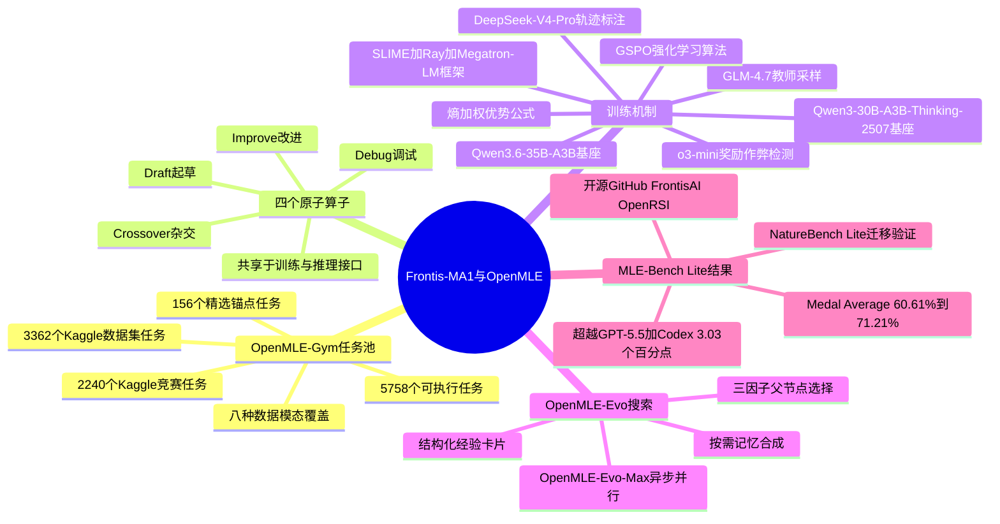

## 一、论文是干什么的？

想象一下，你请了一位数据科学家来帮你做一个机器学习项目：先写一版能跑通的代码，然后看看效果不好就去调参、修bug、换模型，反复试验几个小时甚至几天，最终交出一份能拿奖牌的方案。现在的大语言模型（比如GPT、Claude这些）已经能在一定程度上完成这个流程，但这篇论文关心一个更进一步的问题：能不能训练一个专门的AI，让它自己学会怎样更好地"改进机器学习方案"这件事本身，而且这种改进能力可以像滚雪球一样越滚越大——也就是所谓的"递归自我改进"（Recursive Self-Improvement，简称RSI）。

论文把这类"用AI来打造和改进AI"的研究方向叫作AI4AI（AI for AI）。作者选择了"机器学习工程"（MLE）作为练兵场，因为这是一个可以被"打分"的任务：你写的代码能不能跑起来、预测准不准，都可以通过真实执行反馈客观检验，而不是靠人主观打分。于是他们搭建了一整套开源系统OpenMLE，并在此基础上训练了一个350亿参数（35B）的模型Frontis-MA1，专门用来充当"会自我进化的机器学习工程师"。有意思的是，这个模型的名字本身也点出了它在整个技术路线图里的位置——从"进化"（Evolution，靠外部搜索算法反复试错）迈向"元进化"（Meta-Evolution，让模型本身学会怎么做这些试错动作），这正是通往"递归自我改进"这一终极目标路上的关键一步。

## 二、核心方法与创新

### 2.1 三层积木：OpenMLE-Gym、OpenMLE-ERL、OpenMLE-Evo

OpenMLE这套系统就像一套三层积木，缺一不可：

- **OpenMLE-Gym（练习场）**：相当于给AI准备了5758道"编程作业题"，这些题目来自人工精选的经典基准、Kaggle数据集和Kaggle竞赛，涵盖表格数据、图像、文本、时间序列、音频等8种数据形态。每道题都配有公开数据、隐藏答案（用来打分但不给AI看）、评分脚本和沙盒执行环境，就像考试有标准答案一样，AI提交的代码会被自动跑一遍，看看预测得准不准。
- **OpenMLE-ERL（练功房）**：这一步教会AI四个"基本功"操作，作者称之为原子算子（atomic operators）：**Draft**（起草）从零写一版方案，**Improve**（改进）在已有方案上打磨提升，**Debug**（调试）修复报错的代码，**Crossover**（杂交）把两个不同方案的优点合并成一个更强的方案（有点像生物学里的基因重组）。这些操作先通过监督微调（SFT，即让模型模仿优秀范例）打好基础，再通过强化学习（RL，即让模型在真实试错中自己摸索哪种做法能拿高分）进一步提升。
- **OpenMLE-Evo（实战场）**：把训练好的四个操作组合起来，在一个较长的时间预算内（比如12小时）反复试验、层层进化，最终找出得分最高的方案。这个过程会像种树一样不断分叉出新的候选方案，形成一棵"方案进化树"。

三者合起来的巧妙之处在于：无论是训练阶段（ERL）还是推理搜索阶段（Evo），用的都是同一套Draft/Improve/Debug/Crossover接口。这意味着模型训练时学的"怎么改进代码"和它实际部署时"怎么搜索更好方案"用的是同一套语言，从而把学习和搜索这两个原本分离的环节耦合成一个闭环——这正是论文标题里"元进化"的含义所在。

### 2.2 怎么把"好坏各异的任务打分"统一起来

不同任务的评分标准五花八门：有的看准确率（越高越好），有的看误差（越低越好），数值范围也天差地别。论文首先把所有分数统一转换成"越大越好"的形式，记作$\tilde{s}$，然后用下面的公式把它压缩到0到1之间，作为一个"基础奖励"：

$$
r_{\mathrm{base}}(\tilde{s}; b_{\mathrm{best}}, b_{\mathrm{worst}}) = \mathrm{clip}\left(\frac{\tilde{s} - b_{\mathrm{worst}}}{b_{\mathrm{best}} - b_{\mathrm{worst}}}, 0, 1\right)^{\alpha}, \quad \alpha > 0
$$

但固定的理论上下限往往太宽，导致同一批候选方案的得分挤在一起分不出高下。于是论文进一步引入"自适应区间"：动态统计当前策略实际能达到的分数分布（比如取历史最好分和第16名的分数作为区间两端），让分数差异重新变得清晰可辨，这样模型才能学到"谁真的更好"。

### 2.3 只重点奖励"最拔尖的那个"：熵加权优势

一组候选方案里，如果只有一个特别突出，其余的马马虎虎，传统强化学习的做法（类似GRPO那种组内归一化）会把奖励差距"抹平"。论文提出用一种熵加权的优势函数，让最好的候选方案获得成倍放大的学习信号：

$$
A_i^{\mathrm{ent}} \approx \frac{\exp(\beta r_{\mathrm{proc},i})}{\frac{1}{G-1}\sum_{j \neq i}\exp(\beta r_{\mathrm{proc},j})} - 1
$$

其中$\beta$控制着"偏爱拔尖者"的程度，越大就越只关注表现最好的那个候选。论文的实验显示，加上这个机制后，最佳候选获得的平均优势值从1.58提升到6.39，相当于放大了约4倍的学习信号。

### 2.4 挑"该练什么"：三因子父节点选择

进化搜索的过程像是不断从一棵树上挑一个"父节点"去继续改进。如果只挑当前分数最高的节点，很容易一直死磕同一个方向。论文设计了一个综合效用函数：

$$
U_i = \lambda_s \tilde{s}_i + \lambda_\Delta \tilde{\Delta}_i + \lambda_n \nu_i, \qquad P(i \mid \mathcal{I}) = \frac{\exp(U_i/\tau)}{\sum_{j\in\mathcal{I}}\exp(U_j/\tau)}
$$

这里同时考虑三件事：这个方案本身的质量（$\tilde{s}_i$）、它相比"父辈"进步了多少（$\tilde{\Delta}_i$），以及它代表的方法路线有多新颖、少人尝试（$\nu_i$）。这样搜索既不会放弃当前的强者，也会给那些"进步快"或"路子新"的候选方案更多机会，避免思路单一化。论文举了一个具体例子：在一次"鲸鱼分类"任务里，得分第一的方案A（AUC 0.99187）和得分只排第六但进步幅度最大的方案B（AUC 0.98773），综合三因子权重后，B被选中的概率从只看分数时的10.47%提高到17.09%，最终B被选中改进后反而拿到了更高的最终得分（0.99203）。

### 2.5 让"经验"变得可查询、按需生成

传统方法（如AIRA-Evo）在每次评估完新方案后，都会不分青红皂白地调用一次大模型，把这个节点的历史总结成自然语言"记忆"，即使这个节点以后根本不会被选中，这份总结也白白浪费了。OpenMLE-Evo反其道而行之：先把每个候选方案的关键信息（谁是父节点、进步了多少、耗时多久、报错类型等）存成结构化的"经验卡片"，只有当某个节点真的被选中要执行Improve、Crossover或Debug时，才现场调用大模型，把这个节点和它的"祖先""兄弟"节点结构化经验综合成一段有针对性的自然语言记忆，供本次改进参考。这种"按需生成"避免了无谓的算力浪费，也让生成的记忆更聚焦、更有用。

## 三、使用了哪些模型和计算资源？

**基座模型**：Frontis-MA1的两个版本分别基于开源模型 **Qwen3.6-35B-A3B**（得到Frontis-MA1-35B）和 **Qwen3-30B-A3B-Thinking-2507**（得到Frontis-MA1-30B）进行全参数微调（Full-parameter SFT）加强化学习。

**训练数据的教师模型**：论文用 **GLM-4.7** 驱动大部分监督微调数据的采样和进化路径搜索，第二批数据额外混入了 **Qwen3-30B-A3B-Thinking-2507** 的样本；对多步演化轨迹的因果筛选标注则由 **DeepSeek-V4-Pro**（温度设为0，最长输出4096 token）完成。

**训练框架**：SFT阶段使用 **SLIME 框架（配合 Ray 和 Megatron-LM）**；强化学习阶段使用 **SLIME 框架（配合 Ray 和 SGLang）**，强化学习算法为 **GSPO**（结合TTT-Discover风格的奖励后处理），优化器为Adam（学习率$1.0\times10^{-6}$）。

**奖励作弊检测**：论文提到用 **o3-mini** 作为强化学习过程中的"裁判"模型，在代码真正提交到沙盒执行前检查是否存在"奖励作弊"行为（比如模型把样例提交文件随机打乱后直接当作答案提交），一旦被判定作弊则跳过执行，直接给予-0.5的惩罚分。

**GPU型号与训练时长**：论文对训练阶段（SFT和RL）具体使用了多少块、什么型号的GPU，以及训练总耗时多久，均未明确说明——笔者逐字检索了正文第4节、附录B.2/B.3训练超参数表格以及全文，均只给出了批大小、学习率等超参数，未出现具体GPU型号/数量或训练小时数的表述。唯一明确的硬件信息是**评估/推理阶段**的设定：每个任务限定"单块RTX 4090（显存上限12GB）、每任务12小时"的沙盒执行预算；此外附录中一个示例任务请求里出现过`gpu_count: 1`的字段，说明沙盒执行单个候选程序时通常分配1块GPU，但这并非训练所用的资源规模。作者提到强化学习阶段采用同步与异步两种rollout方式，异步方式下40个匹配训练步的平均单步耗时为50.8分钟，同步方式下为97.0分钟（约1.91倍差距），但这也不等同于全程训练总时长。

## 四、实验结果

主要基准是**MLE-Bench Lite**（22个任务的Kaggle式机器学习工程竞赛），每个任务给12小时、单块RTX 4090（限12GB显存）的执行预算，重复三次评估取平均。核心指标：Valid Rate（多少任务能跑出合法提交，满分22）、Medal Average（平均获得Kaggle奖牌的任务比例）、Human Rank（超过人类参赛者的比例，越高越好）。

| 模型 / 系统 | 搜索框架 | Valid Rate | Medal Average | Human Rank |
|---|---|---|---|---|
| Qwen3.6-35B-A3B（基座） | OpenMLE-Evo | 19.67/22 | 39.39% | 0.5828 |
| **Frontis-MA1-35B** | OpenMLE-Evo | 21.67/22 | **60.61%** | 0.7647 |
| **Frontis-MA1-35B** | OpenMLE-Evo-Max | 22.00/22 | **71.21%** | **0.8126** |
| Qwen3-30B-A3B-Thinking-2507（基座） | OpenMLE-Evo | 17.33/22 | 34.85% | 0.5573 |
| Frontis-MA1-30B | OpenMLE-Evo | 21.67/22 | 53.03% | 0.7055 |
| Frontis-MA1-30B | OpenMLE-Evo-Max | 22.00/22 | 66.67% | 0.8053 |
| GPT-5.5（对照，Codex脚手架） | Codex | 21.00/22 | 68.18% | 0.7833 |
| GPT-5.6 Sol（对照） | Codex | 22.00/22 | 72.73% | 0.8891 |
| Kimi K3（对照） | Claude Code | 22.00/22 | 72.73% | 0.8574 |
| Claude Opus 4.8（对照） | Claude Code | 22.00/22 | 63.64% | 0.8219 |

大白话总结：光换上OpenMLE-Evo搜索框架而不换模型，35B基座模型的成绩已经从39.39%提升到一定水平；再把基座模型换成经过专门训练的Frontis-MA1-35B，成绩进一步跳到60.61%；如果再叠加更强的搜索配置OpenMLE-Evo-Max（引入跨任务经验先验、允许多GPU异步并行搜索但沙盒总算力预算不变），最终达到71.21%，超过了"GPT-5.5搭配Codex"这套业界强力组合3.03个百分点，接近但仍略逊于表现最强的GPT-5.6 Sol与Kimi K3（均为72.73%）。30B版本的模型在同样设置下也复现了类似的提升趋势（34.85%到66.67%），说明这种训练方法并非只对一个特定模型规模有效。

**消融/机制分析结论**：
- 论文对比了OpenMLE-Evo和原始AIRA-Evo搜索框架（模型都用同一个Frontis-MA1-35B），发现OpenMLE-Evo消耗的模型token数少了41.7%，但发现"新的最佳方案"的效率反而提升了84.3%，说明结构化经验记忆确实让搜索更高效，而不只是省算力。
- 论文额外在**NatureBench Lite**（用于检验AI能否复现或超越Nature系列论文已发表结果的基准，10个任务子集）上做了迁移验证：固定使用同样的NatureBench适配框架，Frontis-MA1-35B相比基座模型在"匹配SOTA"（Match-SOTA）指标上从50%提升到70%；固定同一个基座模型，把搜索框架从原始AIRA-Evo换成OpenMLE-Evo，同一指标从20%提升到50%。这说明训练得到的模型能力和搜索框架的改进都能迁移到竞赛式机器学习工程之外的场景。
- 论文还展示了具体案例：在"叶片分类"和"鸟类多模态检测"等任务中，靠后期的Crossover和Improve操作（而非重复调试同一分支）贡献了85%到91.9%左右的最终提升，印证了"经验引导的长期搜索"这一设计思路的有效性。

## 五、潜在应用与已落地应用

**潜在应用方向**：
- 自动化数据科学/机器学习工程助手，帮助企业和研究者更快搭建、迭代机器学习方案；
- 作为"AI训练AI"研究的基础设施，供学界进一步探索递归自我改进的边界；
- 迁移到更广泛的科学AutoResearch场景（论文已在NatureBench上做了初步验证），未来有可能扩展到帮助复现或改进已发表的科研成果。

**已落地的开源资源**：
- 代码仓库：[FrontisAI/OpenRSI（GitHub）](https://github.com/FrontisAI/OpenRSI)，采用CC BY-NC 4.0协议（仅限非商业使用），包含完整的OpenMLE训练与评测框架代码。
- 模型权重：[FrontisAI/Frontis-MA1-35B（Hugging Face）](https://huggingface.co/FrontisAI/Frontis-MA1-35B)、[FrontisAI/Frontis-MA1-30B（Hugging Face）](https://huggingface.co/FrontisAI/Frontis-MA1-30B)，以及对应的GGUF量化版本，方便本地部署运行。
- 论文页面：[Frontis-MA1 arXiv 页面](https://arxiv.org/abs/2607.28568)。

未发现独立对外的产品化demo或商业化落地信息。

## 六、网络上的讨论与评价

通过网络搜索（英文与中文关键词均已尝试，包括论文标题、arxiv编号、机构名"Frontis AI"、"OpenMLE"等），仅检索到该论文在Hugging Face论文页本身的信息（截至笔者查证时点赞158-159次，提交者为论文作者之一Kaiyan Zhang）以及arXiv摘要页、GitHub仓库README等一手资料，未搜索到Reddit、Hacker News、X(Twitter)、知乎或公众号等平台上针对这篇论文的专门讨论帖或评价文章。由于未遇到明显的HTTP 429或反爬拦截（搜索工具正常返回结果），因此未使用Playwright做进一步重试。综合判断为：暂未搜索到该论文在主流社区的专门讨论。

## 七、思维导图

