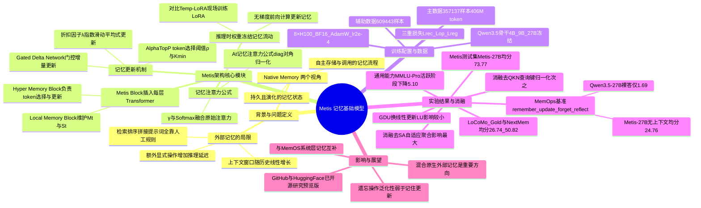

## 一、论文是干什么的？

现在很多带记忆功能的 AI 助手，做法其实是"外挂"：把你之前说过的话存进一个外部数据库（向量库、笔记文件），下次提问时再检索出相关片段，塞回提示词里让模型重新读一遍。这有点像一个人不记笔记，而是雇了个秘书专门帮他翻抽屉找旧文件——每次都要重新翻、重新读，效率不高，而且翻得准不准全看检索这一步做得好不好。

这篇论文提出了一个不同的思路：与其在外面接一个"记忆秘书"，不如直接把记忆能力焊进大模型自己的神经网络结构里，让模型自己学会"记什么、怎么记、怎么用记住的东西"。作者把这类模型叫做"记忆基础模型"（Memory Foundation Model），并做出了第一个原型系统 Metis。简单说，Metis 想让大模型拥有类似人脑短期记忆的机制：信息不需要重新读一遍原文，而是被压缩存放在模型内部一块固定大小的"状态"里，之后模型自己知道怎么去用这块状态回答问题，整个过程都在模型的前向计算中完成，不需要额外的检索、排序、拼提示词这些人工规则。

## 二、核心方法与创新

### 1. 什么是"原生记忆"（Native Memory）

论文把记忆分成两种视角：一是**持久且不断演化的记忆状态**（存在骨干网络内部，不是外部数据库）；二是**原生记忆流程**，即模型通过自身的前向计算自主完成存储和调用，而不是靠人写的检索、重排、拼提示词规则。打个比方：外部记忆像是随身携带一个笔记本，要用的时候翻出来找；原生记忆则像是把内容直接编码进大脑的神经连接里，想用的时候直接"反应"出来，不用翻本子。

### 2. Metis Block：塞进每一层 Transformer 里的记忆模块

Metis 在 Transformer 的每一层里插入一个叫作 **Metis Block** 的组件，它包含两部分：

- **Local Memory Block（本地记忆块）**：维护一个会随时间演化的记忆矩阵 $M_t^{(l)}$（第 $l$ 层、第 $t$ 步的记忆状态）和一个归一化统计量 $S_t^{(l)}$，两者会在多轮交互之间持续保留。
- **Hyper Memory Block（超记忆块）**：负责决定"该记住输入里的哪些token""怎么把它们投影成键值对""用什么规则去更新记忆矩阵"。它包含一个专门用来查询记忆的、可学习的记忆查询向量（不与原始注意力共用查询）。

当模型读到新的一段对话或文本后，Hyper Memory Block 会挑出信息量大的隐藏状态，把它们压缩写入 Local Memory Block 维护的这块固定大小的记忆矩阵里。之后如果用户提出新问题，模型不需要把之前的原文重新读一遍，而是通过"记忆注意力"直接从这块压缩状态里取出有用信息，再和常规注意力的结果融合。

### 3. 记忆注意力与更新公式

记忆注意力的计算方式为：

$$
\tilde{A}_t^{(l)} = \mathrm{diag}(\tilde{Q}_t^{(l)} S_t^{(l)})^{-1} \tilde{Q}_t^{(l)} M_t^{(l)}
$$

其中 $\tilde{Q}_t^{(l)}$ 是专门用于查询记忆的向量，$S_t^{(l)}$ 起到归一化的作用，避免记忆读取结果被数值大小干扰。这个记忆注意力结果会和原本的自注意力结果按权重 $\gamma$ 融合：

$$
\gamma \cdot \mathrm{Softmax}(\cdot) + (1-\gamma) \cdot \mathrm{Norm}(\tilde{A}_t^{(l)})
$$

也就是说，模型每次生成回答时，既看"当前这段话原本的上下文"，也看"压缩过的历史记忆"，两者按比例融合。

记忆矩阵的更新方式类似"指数滑动平均"再叠加当前新信息：

$$
M_{t+1}^{(l)} = \lambda M_t^{(l)} + \frac{1-\lambda}{L_t'} \cdot \frac{(\tilde{K}_t^{(l)})^{\top}}{\sqrt{d_k}} \tilde{V}_t^{(l)}
$$

其中 $\lambda$ 是一个"折扣因子"（可以理解为遗忘速度：$\lambda$ 越大，旧记忆保留得越久），$\tilde{K}_t^{(l)}$、$\tilde{V}_t^{(l)}$ 是被选中要写入记忆的信息对应的键值投影。归一化统计量 $S_t^{(l)}$ 也按类似规则同步更新。

默认实现中，这个更新规则用的是一种叫 **Gated Delta Network（GDN，门控增量网络）** 的机制，它来自"快速权重编程"（Fast Weight Programming）这一支研究脉络，能在写入新记忆的同时选择性地"擦除"部分旧记忆，而不是简单地叠加。作者在消融实验里也测试了更简单的线性更新（Linear Update），发现在 4B 规模下两者整体表现差距不大，但完整的记忆流程（尤其是"自适应聚合"和"查询-键归一化"两个部件）对效果影响更明显（见第四节消融结果）。

### 4. 推理时"权重冻结，记忆流动"

一个关键设计是：在推理阶段，模型的所有参数权重都保持冻结不变，唯一会变化的是这块记忆状态，而且更新记忆状态只需要一次无梯度的前向计算，不需要像某些"用 LoRA 现场微调"的方法那样在线做反向传播。这让 Metis 比"边推理边训练"的方案（论文对比的基线 Temp-LoRA，就是在推理时现场训练一个临时 LoRA 模块来编码历史）在效率上更有优势。

### 5. 训练目标

Metis 的训练包含三个互补的损失函数：**记忆重建目标**（$L_{rec}$，约束记忆能无损存住信息）、**记忆操作目标**（$L_{op}$，约束模型能按指令完成"记住/遗忘/更新/反思"等操作）、**正则化目标**（$L_{reg}$，防止记忆之间互相干扰、污染）。训练时骨干网络本身是冻结的，只训练记忆相关的参数，这些参数用骨干对应层的键值投影矩阵做初始化。

## 三、使用了哪些模型和计算资源？

- **基座模型（backbone）**：论文明确说明 Metis 建立在 **Qwen3.5** 系列骨干之上，训练并评测了三个规模：**Metis-4B、Metis-9B、Metis-27B**（骨干网络本身在训练中保持冻结，只训练记忆相关的新增参数）。
- **训练硬件**：论文原文逐字写明"trained on $8\times$ H100 GPUs"，即使用 **8 张 NVIDIA H100 GPU**、BF16 精度训练。
- **训练步数（无总耗时说明）**：
  - Metis-4B：训练 14,000 步，约合 1 个 epoch；
  - Metis-27B：同样训练 14,000 步，约合 0.4 个 epoch；
  - Metis-9B：训练 8,000 步（约 0.5728 个 epoch），根据验证集表现做早停选出。
  - 优化器为 AdamW，学习率 $2\times10^{-4}$，200 步预热后转为恒定学习率，权重衰减 0.01，$\beta=(0.9,0.999)$，$\epsilon=10^{-8}$，梯度裁剪阈值 1.0，随机种子 42，每 2000 步保存一次checkpoint。
- **训练/推理具体耗时（小时/天）**：论文全文中**未明确说明**总的墙钟训练时长（多少小时或多少天跑完）。我逐字检索了 arxiv HTML 全文（搜索"hours""wall-clock""training time"等关键词）均未找到具体耗时数字，只给出了 GPU 数量、训练步数和 epoch 比例，因此这部分如实标注为"论文未明确说明"。
- **推理效率**：论文附录 G 专门做了"Efficiency"分析，包括在 LoCoMo(Gold) 上的端到端延迟、延迟随上下文长度的变化规律，以及不同上下文长度下每个会话占用的存储空间，但正文摘录中没有给出可直接引用的具体延迟数值（如"每次推理多少毫秒"），因此本文不编造具体数字，只如实说明附录里有这项分析。
- **训练数据规模**：主数据集包含 357,137 条样本、约 4.06 亿 token，覆盖 27 个基准数据集，围绕"记住、遗忘、更新、反思"四类操作构建；辅助数据集包含 609,443 条样本，用于多实体绑定、选择性遗忘、记忆后对话、无关对话等场景的补充训练。
- **代码与权重**：训练与推理代码开源在 [GitHub - MemTensor/Metis](https://github.com/MemTensor/Metis)，模型权重发布在 HuggingFace 的 [IAAR-Shanghai/metis 合集](https://huggingface.co/collections/IAAR-Shanghai/metis)，包含 Metis-4B、Metis-9B、Metis-27B 三个完整模型。

## 四、实验结果

论文的核心实验设计了三种"上下文可见程度"：**Full Context**（把完整历史原文喂给模型，作为效果上限的参照）、**Partial Context**（只给部分证据）、**No Context**（完全不给原文，模型必须依赖自己内部维护的记忆状态作答，这是 Metis 真正要验证的场景）。对比的基线包括原始 Qwen3.5（在无上下文时只能"裸答"）、Temp-LoRA（推理时现场训练临时 LoRA 模块编码历史）、以及另一个参数化记忆方法 δ-Mem。

在 MemOps 基准（专门评测"记住、更新、遗忘、反思"四种记忆操作）与论文自建的 Metis 测试集上，No Context 设置下的关键结果如下（单位：百分比得分，数值越高越好）：

| 模型/方法（No Context） | MemOps(Gold) 平均分 | Metis测试集 平均分 |
|---|---|---|
| Qwen3.5-27B（无记忆机制，裸答） | 1.69 | 16.87 |
| Temp-LoRA-27B（推理时现场训练LoRA） | 9.70 | 23.86 |
| **Metis-27B（本文方法）** | **24.76** | **73.77** |
| 参照：Qwen3.5-27B（Full Context上限） | 87.90 | 78.87 |

大白话解读：如果完全不给原始聊天记录，普通的 Qwen3.5 几乎"失忆"，在自建测试集上平均只能拿到 16.87 分；而 Metis-27B 只靠内部压缩的记忆状态，就能拿到 73.77 分，非常接近"把全部原文都喂进去"的上限 78.87 分——说明记忆状态确实学到了原文里的关键信息。不过在更看重"精确操作"的 MemOps 基准上（尤其是"遗忘"这类操作），Metis 的分数明显低于测试集表现（24.76 分），论文也承认"在共享的潜在空间里删除或压制某条信息，比存储或更新信息更难泛化"，这是当前方法的一个明显短板。

在记忆型问答任务（LoCoMo(Gold) 和 NextMem 数据集）上，Metis-27B 同样在"无上下文"的方法中拿到最高分，论文报告其在这两个任务上的平均得分分别约为 26.74 和 50.82（其余细分小项数值论文以表格形式给出，因排版限制未能在文本提取中完全还原表头对应关系，这里只给可确认的平均分）。此外在 ATM-Bench 这个跨领域（Out-of-Distribution）记忆任务上，论文报告 Metis 相比记忆基线方法表现出更强的迁移能力。

**消融实验结论**（均基于 Metis-4B）：

- 去掉"自适应聚合"机制（直接用最后一个 token 的隐藏状态代表整段历史）：造成的性能下降**最大**，说明只看最后一个 token 无法有效捕捉分布在整段输入里的信息。
- 去掉"查询-键归一化"：同样造成明显下降，尤其是在记忆型问答任务上，说明缺少归一化会让无关信息干扰更严重。
- 去掉"可学习的记忆专用查询向量"（复用原始注意力的查询）：各项任务都下降，问答类任务下降更明显。
- 把 GDN（Gated Delta Network）更新换成更简单的线性更新（Linear Update）：在 4B 规模下整体平均分变化不大，说明更新规则本身不是当前最关键的瓶颈。
- 去掉辅助训练数据（Multi-fact Scenario、Memory Pollution 数据）：整体表现出现明显更大幅度的下降，尤其是在 Metis 自建测试集上，说明这些数据对提升记忆泛化能力很重要。

**副作用**（General Capability Studies）：论文额外测试了 Metis-4B 相比原始 Qwen3.5-4B 在通用能力基准（MMLU-Pro 等）上是否有退化。以 MMLU-Pro 为例，在"记忆状态为空"的初始阶段，Metis-4B 比原始骨干只低 0.80 分（46.00 到 45.20）；但在"记忆里已经存了一些无关信息"的活跃阶段，差距扩大到 5.10 分（46.00 到 40.90）。这说明引入原生记忆机制之后，模型的通用能力会有一定程度的、随着记忆负载增加而放大的轻微损耗。

## 五、潜在应用与已落地应用

**潜在应用方向**：

- **长期陪伴型 AI 助手/智能体**：记住用户长期以来的偏好、历史对话、人物关系，而不需要每次都重新检索、拼接海量历史文本，降低长对话场景下的成本和延迟。
- **多轮任务型 Agent**：在执行长流程任务（比如多步骤客服、代码协作）时，把中间状态、已确认的事实压缩存进记忆，避免频繁重复读取整个历史上下文。
- **知识更新与遗忘管理**：论文专门设计了"更新"和"遗忘"操作的评测（如让模型学会忘记过时或需要删除的信息），未来可用于隐私合规场景（如按用户要求"遗忘"某些个人信息）。
- **与外部记忆系统（如检索增强/RAG）结合**：论文明确指出 Metis 是"早期研究系统而非外部记忆的完全替代品"，混合"原生记忆+外部记忆"是重要的后续方向；论文还提到 Metis 与作者团队此前的系统级记忆方案 MemOS 是互补关系，MemOS 负责外部长期状态的生成、调度与治理，Metis 尝试把记忆的读写更新机制进一步内化到模型架构本身。

**已落地/开源情况**：

- 代码与推理示例已开源：[GitHub - MemTensor/Metis](https://github.com/MemTensor/Metis)（仓库标注为"Research preview"，提供架构代码、数据格式文档、推理示例、多步中训练与评测工具，训练数据本身未随仓库发布）。
- 模型权重已发布：[HuggingFace 合集 IAAR-Shanghai/metis](https://huggingface.co/collections/IAAR-Shanghai/metis)，包含 Metis-4B、Metis-9B、Metis-27B 三个完整模型权重。
- 论文本身license为 CC BY-NC-SA 4.0（非商用），仓库代码 license 为 PolyForm Noncommercial License 1.0.0，即目前明确**不允许商业使用**，仅供研究目的。
- 未发现独立的第三方 demo 网站或商业产品集成信息。

## 六、网络上的讨论与评价

通过关键词（论文标题、arxiv ID、机构名 MemTensor 的中英文组合）搜索 Reddit、Hacker News、X(Twitter)、知乎等平台，**没有搜索到关于这篇论文本身的独立社区讨论帖或评测文章**。搜索结果主要指向论文本身（arxiv/HTML 版）、GitHub 仓库以及 HuggingFace 模型页面，未见到 Reddit/HN/知乎上的专门讨论串。

搜索中找到一篇英文科技媒体文章（[36Kr 英文版对 MemTensor 的报道](https://eu.36kr.com/en/p/3903339717920393)），但内容主要是介绍 MemTensor 公司整体的技术路线（包括创始人关于"传统模型像考前突击学习、考试一开始就停止学习"的比喻），以及 Metis 与该公司另一款系统 MemOS 的分工关系，文章中**没有给出关于 Metis 论文的具体点赞数、转发量等社区反响数据**，因此本文不据此编造热度描述。综合来看，本文暂未搜索到关于这篇论文的实质性网络讨论或评价，如实说明"暂未搜索到"。

## 七、思维导图

