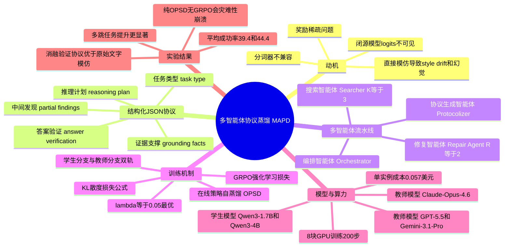

## 一、论文是干什么的？

想象一下，你请了一位经验丰富的侦探（闭源大模型，比如GPT或Claude）帮你破案，同时又想培养一个刚入职的新手侦探（开源小模型，比如Qwen3）。最理想的方式是让新手全程跟着老侦探学习——看老侦探每一步是怎么想的、怎么查资料、怎么排除干扰信息的。但问题是，这位老侦探是"闭源"的：他的思考过程（内部概率分布，术语叫logits）根本不对外公开，你甚至连他和你说话用的"词典"（分词器/tokenizer）都可能不一样，没法逐字逐句对照学习。

这篇论文要解决的正是这个"没法直接抄作业"的难题。它研究的场景是"智能体搜索"（agentic search）：模型需要一边推理、一边多次调用搜索引擎查资料，最后综合信息给出答案，类似人做研究时反复查文献、反复推敲的过程。以前的做法要么用强化学习让小模型自己摸索（但只有做对了最终答案才有奖励信号，中间过程摸索效率很低，术语叫"奖励稀疏"），要么直接把老侦探写的完整推理文字抄给小模型模仿（但小模型会学到老侦探说话的"文风习惯"甚至编造细节，而不是学到真正有用的解题思路，论文里称之为"style drift"和幻觉问题）。这篇论文提出了一个折中方案：让老侦探先把自己的办案思路整理成一份"标准化案情简报"（结构化JSON协议），新手侦探照着这份简报的骨架去学习思考方式，而不是逐字模仿说话方式。

## 二、核心方法与创新

### 用"标准化协议"代替"逐字抄写"

论文的方法叫MAPD（Multi-Agent Protocol Distillation，多智能体协议蒸馏）。核心思路是：既然没法直接对齐闭源老师模型的内部概率分布，那就设计一种双方都能"读懂"的中间语言——结构化JSON协议，把老师模型在解题过程中的关键信息提炼出来，作为学生模型训练时的"提示卡"。

这份协议包含五个维度的信息：

- **任务类型**（Task Type）：这道题是简单的单跳问答，还是需要多步串联的多跳问题，或者是需要对比多个实体的比较类问题。
- **推理计划**（Reasoning Plan）：把解题拆成一步步的子目标，按顺序排列。
- **证据支撑**（Grounding Facts）：从搜索结果里摘出的原文片段，必须是逐字摘录，不能是模型自己编的话，用来防止幻觉。
- **中间发现**（Partial Findings）：如果某一步搜索失败了，记录下当时找到的部分线索。
- **答案与验证**（Answer Verification）：最终答案，以及一个"是否有证据支撑"的布尔标记。

### 一套多智能体流水线来生成协议

这些协议不是随便生成的，而是由一套多智能体系统（Multi-Agent System, MAS）离线生产出来的，一共四个角色分工合作：

- **编排智能体（Orchestrator）**：把一个复杂问题拆解成带依赖关系的多个子任务。
- **搜索智能体（Searcher）**：每个子任务最多发起3次检索（对应论文中的参数K=3），并把检索到的长文段压缩成简短的"发现"。
- **修复智能体（Repair Agent）**：如果某一步推理表达有问题或搜索没找到东西，负责诊断原因，并触发最多2轮（R=2）的重新拆解。
- **协议生成智能体（Protocolizer）**：把前面几步跑出来的探索日志，整理压缩成前面说的标准化JSON协议，并做质量校验。

### 训练阶段：学生分支 + 教师分支的"双轨"学习

在训练学生模型时，论文设计了一种叫"在线策略自蒸馏"（Online Policy Self-Distillation, OPSD）的机制，让同一个学生模型同时跑两条分支：

- 学生分支：只看到原始问题和自己已经生成的内容，记作 $s_t=(x,y_{<t})$，这是真实推理时的输入。
- 教师分支：额外多看到那份协议里的"特权信息" $p$（相当于开卷提示），记作 $s_t^+=(x,p,y_{<t})$。

只有学生分支会真正更新参数，教师分支的作用是给学生分支一个"标准答案式"的概率分布参考，两者之间算一个逐token的KL散度损失：

$$
\mathcal{L}_{OPSD}^{(t)} = \mathbb{D}_{KL}\big(\pi_{\theta_k}(\cdot|s_t) \parallel \pi_{\theta_k}(\cdot|s_t^+)\big)
$$

这样一来，即使最终答案对不对要等到很久以后才知道（奖励稀疏问题），模型在每一步生成时都能得到"更接近开卷参考"的密集监督信号。

这个OPSD损失会和常规的强化学习损失GRPO（Group Relative Policy Optimization，一种通过组内多次采样比较好坏来更新策略的强化学习算法）加权相加，构成总的训练目标：

$$
\mathcal{L}(\theta) = \lambda_{OPSD} \cdot \mathcal{L}_{OPSD}(\theta) + \mathcal{L}_{GRPO}(\theta)
$$

其中GRPO损失的具体形式为：

$$
\mathcal{L}_{GRPO} = -\frac{1}{G}\sum_{i=1}^{G}\frac{1}{|y^{(i)}|}\sum_{t=1}^{|y^{(i)}|}\Big[J_t^{(i)} - \beta\,\mathbb{D}_{KL}\big(\pi_\theta \parallel \pi_{ref}\big)\Big]
$$

论文通过消融实验确定了权重 $\lambda_{OPSD}=0.05$ 是效果最好的取值，权重设得过大（比如0.1）反而会让模型"偷懒"，学会用最少的思考（最多只调用3次工具）就草草给出答案，论文称之为"行为退化"。

## 三、使用了哪些模型和计算资源？

**教师模型（闭源，充当讲课老师）：** Claude-Opus-4.6（主要教师）、GPT-5.5、Gemini-3.1-Pro，论文验证了换用不同教师模型，效果差异都在2个百分点以内，说明协议这种中间表示对具体教师模型不敏感。

**学生模型（开源，被训练的对象）：** Qwen3-1.7B、Qwen3-4B。

**训练配置：** 论文原文写明"Training runs for 200 steps across 8 GPUs"（训练共200步，使用8块GPU），批大小（batch size）为128，最大提示长度4096 token，最大回复长度512 token，每个提示采样组大小 $n=8$。但论文全文没有指明这8块GPU的具体型号（比如是H100、A100还是其他型号），也没有给出训练总共花费了多少小时或多少天的时钟时间，也没有给出推理阶段单次查询或单次完整搜索流程的耗时。这一点经过对arxiv HTML全文的逐字检索确认，确实未提及，因此如实标注为"论文未明确说明"。

**协议生成的API调用成本：** 这是论文里给出的少数具体的量化数字之一——用Gemini-3.1-Pro作为教师批量生成训练用协议时，平均每条训练样本需要调用约6.3次教师大模型、消耗约1.25万个token、花费约0.057美元；生成全部2.56万条训练样本总成本约1454美元，成功率高达99.94%。论文强调这是一次性的离线成本，之后学生模型训练和推理阶段不再需要调用这些昂贵的闭源API。

## 四、实验结果

论文在7个知名的开放域问答/多跳问答基准上做了评测，包括单跳问答（NQ、TriviaQA、PopQA）和多跳问答（HotpotQA、2WikiMultihopQA、MuSiQue、Bamboogle）。评测指标是任务成功率（Success Rate，百分比）。

| 学生模型 | 方法 | NQ | TriviaQA | PopQA | HotpotQA | 2Wiki | MuSiQue | Bamboogle | 平均 |
|---|---|---|---|---|---|---|---|---|---|
| Qwen3-1.7B | GRPO（纯强化学习基线）| 36.9 | 54.6 | 43.1 | 29.8 | 27.5 | 6.8 | 22.4 | 31.6 |
| Qwen3-1.7B | SDAR（对比方法）| 43.4 | 58.1 | 47.6 | 37.0 | 34.3 | 10.6 | 32.0 | 37.6 |
| Qwen3-1.7B | **MAPD（本文方法）**| **45.1** | **58.6** | **48.6** | **39.0** | **36.2** | **11.2** | **36.8** | **39.4** |
| Qwen3-4B | GRPO（纯强化学习基线）| 40.4 | 61.0 | 43.5 | 36.7 | 37.3 | 10.3 | 32.8 | 37.4 |
| Qwen3-4B | SDAR（对比方法）| 46.1 | 62.4 | 48.5 | 43.3 | 43.1 | 13.1 | 44.8 | 43.0 |
| Qwen3-4B | **MAPD（本文方法）**| **47.7** | **62.5** | **49.4** | **44.3** | **45.7** | **14.0** | **47.2** | **44.4** |

大白话总结：不管是1.7B这种很小的模型，还是4B这种稍大一点的模型，用MAPD方法训练后，平均成功率都比只用强化学习（GRPO）高出约8个百分点，也比另一个对比方法SDAR略高（相对提升1.7B模型约4.8%，4B模型约3.3%）。而且提升幅度在多跳问答（需要串联多步推理的更难任务）上更明显，1.7B模型在多跳任务上相对提升约7.9%，说明这套方法确实是在教会模型"怎么想问题"，而不只是让它多蒙对几道简单题。

**消融实验（拆解各个组件看谁起作用）：**

| 配置 | Qwen3-1.7B | Qwen3-4B |
|---|---|---|
| GRPO+OPSD（用原始文字对齐，无协议）| 30.5 | 38.3 |
| 单个教师模型直接给原始推理文字模仿 | 30.1 | 37.3 |
| 多智能体系统生成原始推理文字模仿 | 29.2 | 36.1 |
| 单个教师模型生成结构化协议 | 37.1 | 42.9 |
| **完整MAPD（多智能体+结构化协议）**| **39.4** | **44.4** |

结论很清楚：把"结构化协议"这一步拿掉、换成直接模仿老师模型的原始推理文字，效果反而下降（甚至比纯强化学习基线还差一点），说明直接模仿说话方式确实会带来论文说的"style drift"负面效果；而只要用上结构化协议，不管是不是多智能体生成的，效果都有明显提升。此外，论文还发现如果只用OPSD损失而不配合GRPO强化学习信号，模型会出现"灾难性失败"，成功率骤降到1.7B模型5.9%、4B模型20.9%，说明协议蒸馏必须和真实的结果奖励反馈搭配使用，单独依赖协议本身是不够的。

## 五、潜在应用与已落地应用

**潜在应用方向：**
- 企业内部知识库/客服系统里，用低成本的开源小模型替代调用昂贵闭源API的智能体搜索流程，同时保留较强的多步推理能力。
- 需要频繁调用搜索、又对推理延迟和API费用敏感的场景（比如实时问答助手、垂直领域调研工具），可以用这种"协议蒸馏"方式把大模型的能力迁移到小模型上离线运行。
- 这种"结构化中间协议"的思路也可能被推广到其他闭源到开源的能力迁移任务上，不局限于搜索问答，比如代码调试智能体、多步工具调用智能体等。

**已落地情况：** 作者在论文和HuggingFace页面提供了代码仓库 [github.com/AaronLiu0702/MAPD](https://github.com/AaronLiu0702/MAPD)。经实际查看，该仓库目前处于"敬请期待"（Coming soon）状态，仅有README占位说明，尚未上传具体训练代码或模型权重，仓库当前约有42个star、2个fork、2次提交。论文中没有提供HuggingFace模型权重下载链接，也没有找到对外公开的demo或产品。

## 六、网络上的讨论与评价

按照论文标题、arxiv编号2607.24280、以及关键词"MAPD""Protocol Distillation""agentic search"分别用中英文在网络上搜索，没有找到Reddit、Hacker News、X(Twitter)或知乎等平台上关于这篇论文的具体讨论帖。搜索结果主要指向知识蒸馏相关的通用背景资料（如IBM、Quanta Magazine关于蒸馏技术的科普文章）以及其他同类研究论文（如同期的"Seed: Self-Evolving On-Policy Distillation"、"MAD-OPD"等），但均非针对这篇论文本身的讨论。由于该论文提交于2026年7月27日，距综述撰写时间较近，可能是讨论热度尚未充分扩散，或相关讨论确实较为有限。暂未搜索到相关讨论。

## 七、思维导图

