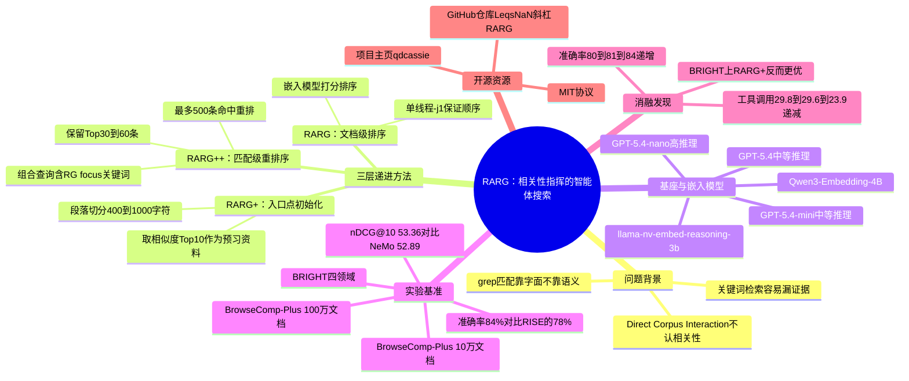

## 一、论文是干什么的？

想象你在一个巨大的图书馆里找一条具体的线索来回答一个复杂问题，比如"某位作者在哪本书的哪一页提到了某个观点"。传统的做法有两种：一种是"关键词搜索"（类似图书馆的检索卡片），根据你问题里的关键词直接定位相关书籍，但如果关键词选得不好，可能会漏掉真正有用的书；另一种是"逐本翻阅"（类似 grep 逐字搜索文本），虽然不会漏掉任何包含关键词的段落，但翻阅顺序是随机的，可能翻了很久才碰到有用的证据，效率很低。

这篇论文来自腾讯的研究团队，他们发现现有的"智能体搜索"（让大语言模型像侦探一样自主决定去哪找、找什么的检索方式）虽然已经开始用"直接语料交互"（Direct Corpus Interaction，简称DCI，也就是让模型直接用类似 grep 的工具在文本里搜索关键词），但这种搜索本身是"不认相关性"的：grep只匹配字面上的关键词，不管这段话是不是真的对回答问题有用，所以模型经常要翻很多无用的段落才能凑齐证据，既慢又容易翻车。论文提出的核心想法很简单也很直接：与其把"相关性"只当作事先筛选文档的一道门槛，不如让它全程参与、指挥搜索——先看哪些文档更可能有用，就先翻哪些；在最可能有用的文档里先给模型准备好一些"预习资料"当作搜索的起点；最后从一堆搜索命中结果里，把真正有价值的片段挑出来放在最前面给模型看。

## 二、核心方法与创新

论文提出的系统叫做**RARG**（Relevance-Aware RipGrep Search Agent，"相关性感知的ripgrep搜索智能体"），ripgrep（简称rg）是一种在大量文本文件里做快速关键词搜索的命令行工具，类似加强版的grep。RARG的核心创新在于把"相关性"从一个简单的"筛选阀门"变成贯穿搜索全过程的"指挥棒"，具体分为三个由浅入深的层次，对应论文里的三个递进版本：

**第一层：文档级排序（RARG）。** 系统先用一个嵌入模型（embedding model，也就是把文字转换成一串数字向量、方便计算相似度的模型）给语料库里所有候选文档打相关性分数，然后按分数从高到低排序，再让智能体用ripgrep在这个排好序的文档列表里依次搜索关键词。这样一来，模型会先看到最可能相关的文档中的匹配结果,而不是随机顺序里可能藏在很靠后的证据。为了保证这个排序不被打乱，实现上还专门加了单线程标志（`-j1`）来强制顺序扫描。

**第二层：入口点初始化（RARG+）。** 只排好文档顺序还不够,模型有时候在正式开始grep搜索前，需要一些"热身资料"。RARG+的做法是：把排名最靠前的几篇文档切成一个个400到1000字符的小段落,用嵌入模型给每个段落和当前查询计算相似度分数，取分数最高的10段直接作为初始上下文喂给模型，相当于提前帮模型划好重点。

**第三层：匹配级重排序（RARG++）。** 即便文档排序和入口点都准备好了，一次grep搜索也可能命中几十上百条结果，其中有用的可能反而排在后面。RARG++的做法是把原始查询和grep用到的关键词拼在一起构造一个新的组合查询（论文里的格式类似"[查询内容] RG focus: [关键词1] [关键词2]..."），用这个组合查询去给最多500条grep命中结果重新打分排序，只把排名最靠前的30到60条展示给模型，把真正有信息量的片段"捞"到最前面。

简单类比一下：如果把整个语料库比作一栋图书馆，RARG相当于告诉你"先去几楼书架找"（文档级排序），RARG+相当于"进门先看这几本书的这几页摘要热热身"（入口点初始化），RARG++相当于"翻到有关键词的那几页后，把最像答案的那几页挑出来放你面前"（匹配级重排序）。论文强调，这三层是"由粗到细"（coarse-to-fine）层层递进的关系，且都不需要重新训练模型，只是改变了模型与语料库交互的方式和顺序。论文中没有给出严格的数学公式来定义相关性打分或重排序函数，这些过程都是以流程化、工程化的方式描述的，而非公式化推导。

## 三、使用了哪些模型和计算资源？

**智能体所用的大语言模型（不做任何微调，直接调用）：**
- GPT-5.4-mini（thinking effort 设为 medium，即中等推理强度）
- GPT-5.4-nano（thinking effort 设为 high，即高推理强度）
- GPT-5.4（thinking effort 设为 medium）

**用于相关性打分/重排序的嵌入模型：**
- Qwen3-Embedding-4B（论文简称Q3E）：用于BrowseComp-Plus基准的文档排序、入口点初始化和匹配重排序，也用于BRIGHT基准的匹配重排序
- llama-nv-embed-reasoning-3b（论文简称NV，一个偏"推理型"的嵌入模型）：用于BRIGHT基准的文档排序和入口点初始化

**硬件与耗时：** 论文原文写道"RARG is implemented in Python and tested on Linux with one H20 GPU"，即整个系统在一台配备单张H20 GPU的Linux机器上实现和测试，这张GPU主要用于跑本地嵌入模型的推理（打分、排序），大语言模型本身则是通过API调用完成推理，并未在本地训练或微调。

论文全文中**没有给出**具体的训练时长、推理耗时（比如每次查询用了多少秒）、API调用费用等信息。经过对arxiv HTML全文逐字检索确认，论文只报告了"工具调用次数"（tool calls）和"对话轮次"（turns）这两个效率指标，用来衡量智能体搜索过程的"步数"，但没有把这些步数换算成实际的墙钟时间或金钱成本，因此这部分内容如实标注为"论文未明确说明"。

## 四、实验结果

论文主要在两个基准上做实验：**BrowseComp-Plus**（一个考验"浏览式"问答能力的基准，分为10万文档规模和100万文档规模两个语料库版本，各抽取100条查询测试）和**BRIGHT**（一个覆盖4个不同领域、注重"推理密集型"检索能力的基准，每个领域约103到116道题）。

| 基准 | 语料规模 | 方法 | 使用模型 | 结果 |
|---|---|---|---|---|
| BrowseComp-Plus | 10万文档 | RISE（基线） | GPT-5.4-mini | 78% 准确率 |
| BrowseComp-Plus | 10万文档 | RARG++ | GPT-5.4-mini | 84% 准确率 |
| BrowseComp-Plus | 10万文档 | RARG++ | GPT-5.4 | 91% 准确率 |
| BrowseComp-Plus | 100万文档 | RARG++ | GPT-5.4-mini | 79% 准确率 |
| BRIGHT（4个领域均值） | - | NeMo（基线） | GPT-5.4-mini | 52.89 nDCG@10 |
| BRIGHT（4个领域均值） | - | RARG+ | GPT-5.4-mini | 53.36 nDCG@10 |

（nDCG@10是检索领域常用的排序质量指标，数值越高说明真正相关的结果排在前面的程度越好。）

**消融实验（三个版本层层递进的效果对比，均在BrowseComp-Plus 10万文档、GPT-5.4-mini上测试）：**

| 版本 | 准确率 | 平均工具调用次数 |
|---|---|---|
| RARG（仅文档级排序） | 80% | 29.8次 |
| RARG+（加入入口点初始化） | 81% | 29.6次 |
| RARG++（加入匹配级重排序） | 84% | 23.9次 |

大白话总结：从RARG到RARG+再到RARG++，准确率逐步从80%升到84%，同时智能体需要的工具调用次数反而从29.8次降到23.9次——也就是说，相关性指挥得越细致，模型不但答得更准，还能少走弯路、更快收敛。不过论文也指出，在BRIGHT基准上出现了一个权衡：RARG+的整体表现（nDCG@10）反而略好于RARG++，而RARG++虽然收敛速度最快，但召回率（找全所有相关证据的能力）略低一些，说明"更快"和"更全"之间在某些任务上存在取舍，并非在所有场景下都是版本越新越好。

## 五、潜在应用与已落地应用

**潜在应用方向：**
- 企业内部知识库/代码库的智能问答助手，尤其是文档量巨大、关键词检索容易"淹没"在无关匹配中的场景
- 法律、医疗、科研文献等需要"精确定位证据出处"而非"泛泛给出摘要"的深度检索场景
- 需要在超大规模语料（论文测试到百万文档级别）中做多跳推理和证据整合的智能体应用
- 作为现有RAG（检索增强生成）系统的增强模块，在保留精确关键词匹配能力的同时降低无效搜索步骤

**已知开源资源：**
- 官方代码仓库：[github.com/LeqsNaN/RARG](https://github.com/LeqsNaN/RARG)（截至撰写本文时约37颗星，MIT开源协议，包含智能体实现、模型服务与嵌入后端组件、FAISS索引构建工具，以及BrowseComp-Plus和BRIGHT的评测脚本）
- 项目主页：[qdcassie-li.github.io/RARG](https://qdcassie-li.github.io/RARG/)
- 论文本身（HuggingFace Papers页面）：[huggingface.co/papers/2607.24223](https://huggingface.co/papers/2607.24223)

未发现官方发布的预训练模型权重（因为该方法本身不需要额外训练模型，只是复用了现成的大语言模型API和开源嵌入模型）。

## 六、网络上的讨论与评价

通过关键词组合（论文标题、arxiv ID、"RARG"、"Relevance-Aware RipGrep"、机构名"Tencent"等，中英文均尝试）在网络上搜索，暂未搜索到 Reddit、Hacker News、X(Twitter)、知乎或公众号上的专门讨论帖或评价文章。搜索结果主要指向论文本身的arxiv页面，以及一些与"AI智能体是否还需要向量检索""grep与RAG的对比"相关的泛化博客内容，未见到直接针对这篇论文的社区讨论。该论文在HuggingFace Papers页面获得91个赞，说明在HuggingFace社区内有一定关注度，但页面本身未见提交者评论或用户讨论区的实质性文字内容。

## 七、思维导图

