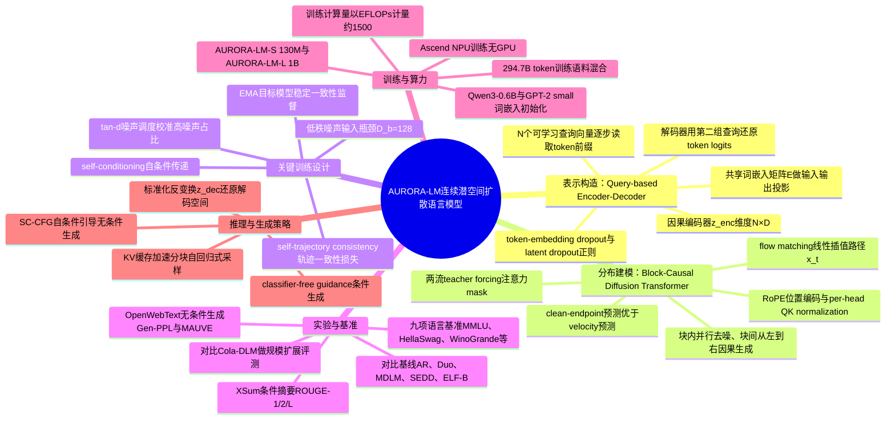

## 一、论文是干什么的？

现在的图像、视频、音频生成模型（比如Stable Diffusion这类扩散模型）大多在连续的潜空间里工作：先把图片压缩成一串连续的数字向量，再让扩散模型在这个连续空间里去噪生成。但语言模型不一样，无论是GPT这类自回归模型，还是近年流行的LLaDA等文本扩散模型，本质上都是在离散的词元（token）上操作——文字先被切成一个个像积木块一样的离散符号，模型再一个个预测这些符号。这篇论文要问的问题是：能不能让文字也像图像一样，被表示成连续的潜空间，然后用扩散模型直接在这个连续空间里生成？

这件事说起来简单，做起来有个两难。如果把文字压缩得太紧凑光滑（方便扩散模型学习），就会丢失还原成准确文字所需要的细节信息，导致生成的文字对不上原意、错字错序；但如果保留足够多细节以便准确解码，这个潜空间就会变得高维复杂，扩散模型又很难学会它的分布规律。以前的方法要么用现成的词向量空间（不是为生成任务设计的），要么把自编码器的潜空间压得很小很光滑来迁就扩散模型，本质上都是在这两者之间做妥协。AURORA-LM的思路是不妥协：先用一个专门的编解码器构造一个高容量、能精确解码回文字的连续潜空间，再专门设计一个扩散模型去学习这个高容量潜空间的分布，两件事分开做、分开优化。

## 二、核心方法与创新

AURORA-LM把整个系统拆成两个独立训练的模块，可以类比成"先造一个精密的密码本，再学会怎么随机生成合理的密码"。

**第一步：查询式编码器-解码器（Query-based Encoder-Decoder），负责造出高质量的连续潜空间。**

普通的文本自编码器往往是把每个词嵌入直接拿来用，或者用一个固定长度的"压缩包"把整段话压扁。AURORA-LM设计了一种更巧妙的结构：用 $N$ 个可学习的查询向量（query）去"读取"输入文本，每个查询向量对应看到越来越长的文本前缀。可以想象成派 $N$ 个记者去采访同一件事，第1个记者只看了故事开头一小段就写报道，第2个记者看得稍微多一点，第 $N$ 个记者看完了整个故事——这样构造出来的 $N$ 段连续向量 $z_{enc} \in \mathbb{R}^{N \times D}$（$D$ 是每个位置的通道宽度）天然带有从左到右的顺序结构，为后面按块生成做好了铺垫。解码器则反过来，用另一组可学习查询，根据这些潜向量逐步还原出原始词元。整个自编码器只用普通的词元重建交叉熵损失来训练：

$$
\mathcal{L}_{AE} = -\mathbb{E}_w\left[\frac{1}{L}\sum_{j=1}^{L}\log \mathrm{softmax}(o_j)_{w_j}\right]
$$

训练时还加入了词嵌入随机丢弃（embedding dropout，概率 $p_x=0.3$）和潜特征随机丢弃（latent dropout，概率 $p_z=0.6$），逼着模型不能偷懒依赖个别词或个别通道，必须让每个潜向量都携带真正有用的语义信息。训练完之后，这个自编码器就被冻结，不再更新，专心给第二阶段提供一个稳定的"目标空间"。

**第二步：分块因果扩散模型（Block-Causal Diffusion Transformer），负责学习这个连续潜空间里的概率分布。**

有了潜向量之后，剩下的问题是：怎么生成新的、合理的潜向量序列？论文没有选择"一次性生成全部位置"（会浪费编码器辛苦构造出来的从左到右的顺序结构），也没有选择"一个位置一个位置地生成"（会丢失扩散模型并行去噪的效率优势），而是选了折中方案——分块因果（block-causal）：把 $N$ 个潜位置切成若干个块（block），块与块之间保持从左到右的因果顺序，但每个块内部的所有位置可以同时并行去噪。这有点像写文章时按段落顺序写，但同一段里的每个句子可以脑内同时构思。

生成过程用的是flow matching（流匹配）技术。简单说，就是从一个纯高斯噪声出发，沿着一条直线路径慢慢"拉"向真实的干净潜向量，路径上任意时刻 $t$ 的状态是

$$
x_t = (1-t)x_0 + t\varepsilon, \quad \varepsilon \sim \mathcal{N}(0,I)
$$

模型的任务就是学会在噪声混合状态下，把干净的目标 $x_0$ 猜出来。AURORA-LM在这一步引入了三个关键设计：

1. **低秩噪声输入瓶颈（Noisy-input Bottleneck）**：虽然要预测的干净潜向量是高维的（比如 $D=1024$），但作者发现，噪声很大的时候，输入里的大部分变化其实只是随机噪声本身，没必要让模型用满宽的通道去处理带噪输入。于是只在"输入这一侧"加一个低秩投影（先压缩到瓶颈维度 $D_b=128$ 再放大），而"输出预测目标"仍然保持满宽 $D$。这好比一个人透过一个较窄的窥视孔观察嘈杂的画面，但依然要在脑中重建出完整清晰的画面。

2. **按潜空间宽度校准噪声强度分布**：潜向量越宽（$D$越大），能容纳的信息越多，此时应该让训练时更多地采样高噪声区间，模型才能学到有效的去噪能力。论文用tan-d噪声调度公式

$$
\sigma(\tau;d) = \frac{d\tan(\pi\tau/2)}{1+d\tan(\pi\tau/2)}
$$

通过调节参数 $d$（实验中最终取 $d=7$）把训练时的噪声强度采样重心往高噪声端偏移，实验证明这样做能明显提升生成质量（用MAUVE指标衡量）。

3. **自轨迹一致性（Self-Trajectory Consistency）**：flow matching训练时，每个噪声样本是独立随机采样的，但实际生成时，模型要沿着同一条去噪轨迹反复调用自己、一步步降噪。这就造成训练和推理之间的"错位"：模型从没被要求过在相邻的两个去噪时间点上给出前后一致的预测。论文额外加了一个一致性损失，让模型在相邻状态（用一个滑动平均的EMA模型作为稳定目标）上的干净潜向量预测尽量一致，这样在只用很少去噪步数（比如16步）时也能生成出高质量结果，减少了误差在轨迹上累积的问题。

最终的训练目标是 $\mathcal{L}_{train} = \mathcal{L}_{FM} + \lambda_{ct}\mathcal{L}_{ct}$，前者是flow matching的干净目标回归损失，后者是自轨迹一致性损失。

生成阶段（推理时），模型从左到右逐块生成：每个新块从纯高斯噪声开始，在已经生成好的前缀基础上，用ODE/SDE求解器逐步去噪，还用了classifier-free guidance（无条件生成用self-conditioning版本的引导SC-CFG，有提示词的条件生成用标准CFG）来提升生成质量。生成完的连续潜向量最后经过反标准化，再送入冻结的解码器还原成文字。

## 三、使用了哪些模型和计算资源？

**用到的（预训练）模型：**
- **GPT-2 small**：用于初始化AURORA-LM-S（1.3亿参数版本）自编码器的词嵌入表。
- **Qwen3-0.6B**：用于AURORA-LM-L（约10亿参数版本）的分词方式（tokenizer）和词嵌入初始化。
- **GPT-2 Large**：仅作为外部固定评测工具，用来计算生成文本的困惑度指标（Gen-PPL），不参与训练。
- 论文中未提及使用GPT-4o、Claude、Qwen2.5-72B等大型闭源或开源对话类LLM进行数据生成或辅助训练。
- 对比基线模型（用于效果比较，而非AURORA-LM自身使用）：AR（自回归Transformer）、Duo、Duo-distilled、SEDD、MDLM、ELF-B，以及规模更大的公开潜空间扩散语言模型Cola-DLM（约18亿参数的DiT）。

**计算资源：** 论文明确说明"所有实验都在Ascend NPU（华为昇腾系列神经网络处理器）上进行"，但没有说明具体的NPU型号（比如是否为昇腾910B）、使用数量，也没有给出GPU信息（论文全程未使用GPU）。

**训练/推理耗时：** 论文没有给出以小时或天为单位的具体训练时长，而是用EFLOPs（$10^{18}$次浮点运算）来衡量训练计算量：
- AURORA-LM-S：自编码器训练约43 EFLOPs，去噪器在OpenWebText上训练约155 EFLOPs，在XSum上训练约23 EFLOPs。
- AURORA-LM-L：自编码器训练约157 EFLOPs，去噪器训练约1,406 EFLOPs，总计约1,500 EFLOPs。
- 对照的Cola-DLM检查点对应其发布的scaling曲线中约2,000 EFLOPs的节点。

训练数据方面，AURORA-LM-L使用了一个2947亿（294.7B）词元的训练语料混合，其中网页文本占54.7%、书籍和百科占17.1%、学术数学及知识类文本占28.2%。论文中未提及具体的训练轮数对应的真实钟表时间（如"每个epoch用了多少小时"），也没有提及推理单条样本的实际耗时（秒/条），只给出了去噪步数（如16步、32步、64步）。

## 四、实验结果

论文在三个层面做了评测：小规模消融实验、1.3亿参数量级的系统级对比（AURORA-LM-S，1.3亿参数去噪器）、以及扩展到约10亿参数的规模评测（AURORA-LM-L）。

**无条件文本生成（OpenWebText，1024词元长度）：**

| 模型 | 骨干参数量 | Gen-PPL（越低越好） | MAUVE（越高越好） |
|---|---|---|---|
| AR | 85M | 39.40 | 0.851 |
| Duo | 92M | 86.57 | 0.704 |
| MDLM | 92M | 121.36 | 0.668 |
| ELF-B | 105M | 24.11 | 0.229 |
| **AURORA-LM-S** | **130M** | **23.56** | **0.890** |

AURORA-LM-S在困惑度和分布相似度（MAUVE）两个指标上都拿到了同类方法里的最好成绩，说明生成的文字既流畅又更接近真实文本的风格分布。

**条件摘要生成（XSum数据集，用ROUGE指标衡量摘要质量）：**

| 模型 | ROUGE-1 | ROUGE-2 | ROUGE-L |
|---|---|---|---|
| ELF-B | 36.0 | 12.2 | 27.8 |
| AR | 30.5 | 10.2 | 24.4 |
| MDLM | 33.4 | 11.6 | 25.8 |
| **AURORA-LM-S** | **36.6** | **13.4** | **28.9** |

AURORA-LM-S在三项ROUGE指标上都超过了所有对比方法。

**规模扩展评测（AURORA-LM-L约10亿参数 vs Cola-DLM约18亿参数）：**

在涵盖常识推理、知识问答、阅读理解等9个公开语言基准（包括MMLU、ARC-C、OBQA、HellaSwag、WinoGrande、StoryCloze、SIQA、RACE、SQuAD EM）上，AURORA-LM-L的宏平均分为32.6，而参数量比它大约80%的Cola-DLM只有25.1分，且在全部9项任务上AURORA-LM-L都表现更好。这说明这套"高容量潜空间+分块因果扩散"的方案不仅在小规模上有效，扩展到更大规模后优势依然保持，甚至能用更小的模型打赢更大的对手。

## 五、潜在应用与已落地应用

**潜在应用方向（论文中提到或可合理推断）：**
- 作为连续扩散生成模型与离散文本解码之间的桥梁，为未来把文本、图像、视频、音频统一到同一个连续潜空间生成框架下提供基础，论文结论部分明确提到这一愿景（"developing unified generative models that operate across language and other continuous modalities"）。
- 更长上下文、更高效的并行文本生成（分块并行去噪相比逐词自回归生成有并行加速潜力）。
- 摘要等条件式文本生成任务。

**已知落地应用案例：** 这是一篇2026年8月刚发布的研究性论文，论文和网络检索均未发现任何产品化、商业化或工业落地的案例，属于纯学术研究阶段。论文提供了代码仓库（[GitHub: fyv587/AURORA-LM](https://github.com/fyv587/AURORA-LM)）和项目主页（[aurora-lm-project.github.io](https://aurora-lm-project.github.io/)），可供其他研究者复现和二次开发。

## 六、网络上的讨论与评价

通过WebSearch分别用英文和中文关键词（"AURORA-LM diffusion language model"、"AURORA-LM 扩散语言模型"等）检索，未搜索到Twitter/X、Reddit、Hacker News或中文技术社区（如知乎、公众号）上关于这篇论文的专门讨论或博客解读。搜索结果主要是arXiv页面本身以及同类研究工作（如Cola-DLM、CoDAR、LangFlow等连续/扩散语言模型论文）。该论文在HuggingFace Papers页面获得75个赞（upvotes），说明在HuggingFace社区内有一定关注度，但目前暂未搜索到公开的深入讨论文章。如后续出现相关讨论，需要另行补充。

## 七、思维导图

