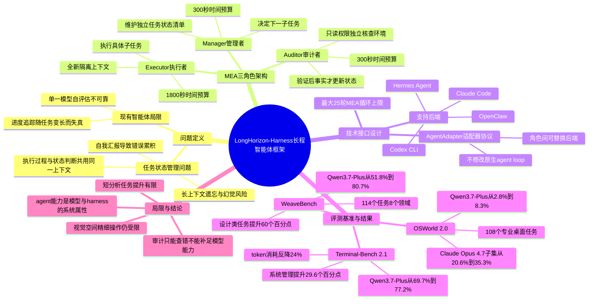

## 一、论文是干什么的？

想象你请一个新来的实习生帮你完成一个复杂项目，比如装修一套房子。如果这个实习生每做一步就把之前发生的事全忘光，只靠自己嘴上说的进度汇报来判断下一步该做什么，那很快就会出问题——他可能会把已经刷好的墙又刷一遍，或者以为水管已经装好了（其实根本没装），结果整个项目乱成一团。这正是当前大语言模型（LLM）智能体在执行长任务时遇到的核心困境：任务越长、步骤越多，模型越容易"自己骗自己"，把没做完的事当成已经做完，把执行过程中的错误一步步累积放大。

这篇论文来自阿里巴巴 DreamX 团队，提出了一个名为 LongHorizon-Harness（可以理解为长程任务执行"脚手架"或"外骨骼"）的系统。它不是训练一个新的大模型，而是给现有的大模型智能体（比如 Qwen、Claude 等）装上一套外部的项目管理机制：单独有人（其实是另一个模型角色）负责记台账、单独有人负责干活、单独有人负责去现场检查活干得对不对。通过这种"分工不分心"的方式，论文让同一个大模型在处理办公软件操作、编程、桌面软件使用等复杂长任务时，完成率大幅提升，证明了"好用不好用不只看模型本身，还要看给它配的工作流程和工具"。

## 二、核心方法与创新

论文的核心洞察是：现有的智能体系统往往把"干活"和"记录进度、判断有没有干完"这两件事混在同一个不断增长的对话上下文里。这就好比一个人一边施工一边口头念叨"我做完了这个，做完了那个"，却没有人去现场验收——念叨的内容和真实的施工现场可能早已脱节，而且随着任务变长，这段"念叨"（也就是模型的上下文）越滚越大，模型会开始遗忘、混淆早期信息，甚至产生幻觉，把没做的事当成做完的事。

为了解决这个问题，论文把长任务执行重新定义为一个**任务状态管理问题**，并设计了一个叫作 **Manage-Execute-Audit（管理-执行-审计，简称 MEA）循环** 的三角色架构：

1. **管理者（Manager）**：相当于项目经理，专门维护一份"任务状态清单"，这份清单独立存在于执行过程之外，不会随着执行细节的堆积而变得混乱。管理者根据这份清单和审计者反馈回来的验证结果，决定下一步应该让执行者去做什么子任务。管理者每一轮的工作时间预算是300秒。

2. **执行者（Executor）**：相当于具体干活的工人，每次接到一个子任务后，都在一个**全新、干净的上下文**里工作（就像每次施工前工人都不带任何"我以为已经做过什么"的先入之见，只带着这次要做的具体任务说明），执行完就交差。这样可以避免早期任务的杂乱信息干扰当前这一步的判断。每一轮执行者的时间预算是1800秒（半小时）。

3. **审计者（Auditor）**：相当于验收员，它拥有**只读权限**，会独立地去检查真实的环境（比如打开文件看看内容对不对、检查系统状态是否如预期），而不是听执行者自己汇报"我做完了"。只有经过审计者独立核实过的事实，才会被写入任务状态清单，用来指导下一步决策。审计者每一轮预算也是300秒。

这个设计的关键在于：**任务状态只根据独立验证过的事实来更新，而不是模型自己的一面之词**。这就好比工程验收里"谁施工谁不能自己签字验收"的原则——把"做事的人"和"判断事情有没有做好的人"彻底分开，防止一步走错、步步错下去，而且不会被误导性的自我汇报污染。

另一个重要设计是 **AgentAdapter（智能体适配器）接口**：管理者、执行者、审计者这三个角色可以分别使用不同的模型或不同的智能体框架（比如 Claude Code、Codex CLI、OpenClaw、Hermes Agent 等），彼此可以自由组合、互相替换，而且不需要修改这些智能体原本的工作逻辑。这意味着这套"项目管理制度"是一个通用的外挂系统，谁都能用，不用改造自己的模型。

论文还给每一轮 MEA 循环设置了最多25轮的上限，防止任务无限循环下去。整个框架的定位很清楚：**它不训练新模型，只是给已有的模型配上更好的工作流程**，论文用这一点证明了"智能体的能力是模型和工作流程共同决定的系统属性"，而不仅仅取决于底层大模型有多聪明。

## 三、使用了哪些模型和计算资源？

**LLM模型：**
- 主要测试的底座模型：**Qwen 3.7-Plus**（阿里自家模型）
- 额外验证的模型：**Claude Opus 4.7**
- 作为执行后端被测试或对比的智能体框架/模型还包括：Claude Code（版本 2.1.76、2.1.176、2.1.211）、Codex CLI、OpenClaw、Hermes Agent，以及在对比表格中出现的 GPT-5.5、GPT-5.6 Luna、Claude Sonnet 4.6、MiniMax M3、Kimi 2.6、Gemini 3.1 Pro 等（这些主要作为基线参照对象，不一定是自己训练或深度使用的对象）。

**计算资源（GPU等硬件）：** 论文中未提及具体的GPU型号、数量或使用的云服务/API细节。这篇论文关注的是"推理阶段"如何设计更好的工作流程，而不是训练模型，因此没有像训练类论文那样列出GPU集群配置。

**训练/推理耗时：** 论文没有提及"训练"耗时（因为它不训练新模型）。但是给出了推理阶段的时间预算设定：
- 执行者每一轮最多1800秒（30分钟）
- 管理者每一轮最多300秒（5分钟）
- 审计者每一轮最多300秒（5分钟）
- 每个任务最多进行25轮 MEA 循环
- 在 Terminal-Bench 2.1 测试中，每个任务最长允许5小时，并且每个任务独立跑三次取结果

**token消耗（可以理解为"计算成本"的一种衡量）：**
- 管理者角色消耗的token只占总量的2.0%到8.1%
- 审计者角色消耗的token占总量的19.4%到38.1%
- 相比不用这套框架，总体token成本在 WeaveBench 上多花2.3倍，在 OSWorld 2.0 上多花3.6倍，但有意思的是在 Terminal-Bench 上反而**减少了24%**的token消耗（说明有了清晰的状态管理后，模型少走了很多弯路，反而更省）

## 四、实验结果

论文在三个长任务测试基准上做了实验，效果都很明显：

| 测试基准 | 任务类型 | 不用框架（基线） | 用了 LongHorizon-Harness | 提升幅度 |
|---|---|---|---|---|
| WeaveBench（114个任务，覆盖8个领域） | 综合办公/创作类任务 | Qwen 3.7-Plus 完成率 51.8% | 80.7% | 提升约29个百分点 |
| Terminal-Bench 2.1 | 命令行/系统运维类任务 | Qwen 3.7-Plus 成功率 69.7% | 77.2% | 提升约7.5个百分点 |
| OSWorld 2.0（108个专业桌面任务） | 真实桌面软件操作 | Qwen 3.7-Plus 完成率 2.8% | 8.3% | 完成率提高约3倍 |
| OSWorld 2.0（34任务子集） | 真实桌面软件操作 | Claude Opus 4.7 完成率 20.6% | 35.3% | 提升约14.7个百分点 |

几个值得关注的细节：

- 在 WeaveBench 上，提升最明显的是"设计类"任务（提升60个百分点）、"空间/3D类"任务（提升50个百分点）、"游戏类"任务（提升约29个百分点），说明这套框架对那种步骤多、容易半途走偏的任务帮助特别大。
- 在 Terminal-Bench 上，系统管理类任务提升约29.6个百分点，游戏类任务提升约33.3个百分点。
- 这套方法不挑模型，不管是阿里自己的 Qwen 还是 Anthropic 的 Claude Opus，用上之后都有明显提升，说明这不是"专门为某个模型量身定制的技巧"，而是一种通用的工作流程改进。
- 论文也诚实地指出了局限：对于那种任务步骤很短、主要考验模型自身单次判断能力的简单分析类任务，这套框架帮助不大；对于需要精细"手眼协调"式操作（比如需要非常精准的鼠标点击定位）的任务，框架也无能为力；而且这套系统只能帮忙"检查错误"，如果底层模型本身压根不具备完成某项任务的能力，审计者发现问题了也无法替模型把事情做对。

## 五、潜在应用与已落地应用

**潜在应用方向：**
- 办公自动化：文档编辑、表格处理、幻灯片制作等需要多步骤持续操作的场景
- 软件开发与运维：命令行操作、代码调试、系统管理等长流程工程任务
- 跨界面协同工作：既要操作图形界面（GUI）软件，又要在命令行（CLI）中执行命令的混合工作流
- 设计与创作类工作：如论文中提到的设计类任务提升明显
- 游戏分析、空间/3D相关的操作类任务
- 医疗表单处理等需要严谨核对的场景（GitHub仓库说明中提到）

**已落地应用案例：**
根据检索到的信息，该项目已经在 [GitHub](https://github.com/AMAP-ML/LongHorizon-Harness) 上开源发布，仓库名为 LongHorizon-Harness，采用 MIT 开源协议，截至查阅时已获得约373个星标（stars），提供了 `uv tool install lh-harness` 等一键安装方式，并原生支持接入 Claude Code、Codex CLI 等现有智能体工具，同时配有专门的项目介绍网站 [lh-harness.pages.dev](https://lh-harness.pages.dev/)。除此之外，论文中未提及被具体企业或产品采用的落地案例，暂无更多相关信息。

## 六、网络上的讨论与评价

通过网络搜索，找到以下信息：该论文在 [HuggingFace Daily Papers 周榜](https://huggingface.co/papers/week/2026-W32)（2026年第32周）上排名第一，获得158个点赞（upvotes），说明在 AI 研究社区内受到了较高关注度。具体数字请以 [HuggingFace论文页](https://huggingface.co/papers/2608.01964) 实时显示为准，可能随时间继续增长。

除了 HuggingFace 热榜信息和该项目在 GitHub 上积累的约373个星标外，暂未搜索到来自 Twitter/X、Reddit、Hacker News 或中文技术社区（如知乎、小红书）等平台的具体讨论帖文或评价内容，如实说明为暂未搜索到公开讨论。

## 七、思维导图

