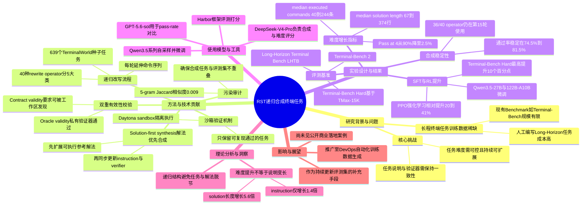

## 一、论文是干什么的？

现在很多AI智能体（agent）需要在电脑的命令行终端里干活，比如配置服务器、修复代码报错、批量处理文件等等，这类任务往往步骤很多、环节环环相扣，业内叫「长程任务」（long-horizon task，意思是要走很多步才能完成）。要训练出擅长做这种复杂任务的AI，最大的难题不是算法，而是没有足够多、足够难、又确保答案正确的训练题目。人工编写这样的题目非常费时费钱，就像想开一所专门培养全能水电工的学校，却发现全世界只有几百道靠谱的练习题，远远不够用。

这篇论文提出了一种叫RST（Recursive Synthetic Terminal Tasks，递归合成终端任务）的方法，专门用来「批量出题」。它的思路有点像给一道简单的数学题不断加难度：先从一批已经验证过、答案确实正确的简单题目出发，然后一轮一轮地把解题步骤变长、变复杂，同时保证每一次改造后题目、验证方法和标准答案三者仍然对得上号。这样只需要花很少的钱（论文里说平均每道通过验证的题目大约0.05美元），就能自动生产出数万道由易到难、有真实可执行解法作为保证的训练题目。

## 二、核心方法与创新

RST的核心创新可以用「教练带学员逐级加练」来类比。假设最初有一位学员已经能正确完成一个基础的终端任务（比如「创建一个文件夹并写入一段文本」），教练不是凭空想象一个更难的新题目，而是在这个已经跑通的操作基础上，往后面再接上几步新的、同样能跑通的操作（比如「再把这个文件夹打包压缩，并且计算校验和」），从而得到一个更长、更难的新任务。这种做法论文里称为「solution-first synthesis（解法优先的合成）」：先保证扩展后的解法本身是可执行、可验证通过的，再回过头去调整任务的文字说明（指令）和自动打分的验证器（verifier），确保三者始终匹配，而不是先编一个听起来很难的任务描述，再指望某个解法能凑上去。

具体流程是一个「递归」的多轮循环：

1. **种子任务**：从639个已经验证过的基础任务（来自TerminalWorld项目）出发。
2. **挑选改写算子**：每一轮从40种预先设计好的「改写操作」（分成5大类，比如增加一个新的子任务、给已有步骤增加约束条件、引入需要排错恢复的环节等）中选一种，用来扩展当前的参考解法。
3. **延伸解法**：让模型基于挑选的算子，在原来正确的解法后面继续往下写出新的、可执行的命令序列。
4. **同步更新说明和验证器**：因为解法变了，任务的文字说明（告诉AI要做什么）和用来判断AI是否做对了的验证脚本也要跟着更新，确保三者一致，不能说明写的是A、验证的是B。
5. **沙箱验证**：把新任务丢进一个全新的、干净的沙箱环境里，让参考解法自己跑一遍，只有真的能顺利跑通、通过验证器检查，这道题才算「合格」，被保留下来。
6. **滚雪球式积累**：合格的任务会被当作下一轮的「种子」，继续重复以上过程，这样任务会像滚雪球一样一轮比一轮长、一轮比一轮难。

论文还专门设计了两类「有效性」检查来防止题目变得文不对题：一是「Oracle有效性」——参考解法必须能通过私有验证器；二是「Contract有效性」——验证器检查的每一项要求，必须在任务说明里写清楚，或者AI能从工作环境中自己发现，不能出现验证器要求了但题目完全没提的「暗坑」。另外论文用n-gram相似度等方式做了「污染审计」，确认合成出来的题目和最终用来评测的Benchmark题目没有重叠抄袭的情况（论文报告最大5-gram Jaccard相似度只有0.009）。

用这种方法滚了15轮之后，任务的复杂程度出现了非常明显的跃升：参考解法的中位数长度从67行代码涨到374行（约5.6倍），执行的命令数从中位数40条涨到244条（约6.1倍），用到的独特命令行工具种类从17种涨到71种。有意思的是，任务说明文字本身只涨了1.4倍（从85个词到122个词）——也就是说题目「看起来」没变长很多，但实际要做的事情却复杂了好几倍，这正是长程任务训练数据最缺、也最难人工造出来的那种「说得简单、做起来难」的题目。

## 三、使用了哪些模型和计算资源？

- **任务合成与难度评估所用模型**：论文使用DeepSeek-V4-Pro来递归生成越来越难的任务，并且用同一个模型在各轮任务子集上做难度评分（Pass@4从第1轮的90%一路降到第15轮的2.5%，用来验证任务确实越来越难）。
- **对比评估模型**：论文中提到GPT-5.6-sol被用于解题通过率（pass-rate）的对比评估。
- **训练/强化学习的基座模型**：用Qwen3.5自身在合成任务上做轨迹采样（self-rollout），收集到的轨迹数据被用来微调Qwen3.5-27B和Qwen3.5-122B-A10B两个规格的模型，随后还对Qwen3.5-27B做了强化学习（PPO）训练。
- **沙箱与评测基础设施**：验证环节使用Daytona沙箱环境来跑参考解法，评测打分用的是Harbor框架。
- **GPU型号、云服务商等硬件信息**：论文中未提及具体的GPU型号（如A100、H100等）或使用的云计算平台。
- **训练/推理耗时**：论文中未给出单个任务生成或模型训练所花费的具体时间（如小时、天数等墙钟时间），只给出了成本信息——平均每道通过验证的任务约0.05美元，折算下来每1000道合格任务约50美元；以及产出效率——每1000次种子尝试大约能产出498到572道通过验证的任务。
- **数据规模**：从639个种子任务出发，经过15轮递归，最终产出37,484道合成任务，并通过对Qwen3.5做拒绝采样收集到327,189条训练轨迹（平均每道题约8.7条轨迹）。

## 四、实验结果

论文在三个终端智能体评测集上做了测试：Terminal-Bench 2（89道题）、Terminal-Bench Hard（100道题，来自TMax-15K）、以及Long-Horizon Terminal Bench即LHTB（46道题，专门考验长程任务能力）。

**用RST合成数据做监督微调（SFT）后的效果提升：**

| 模型 | 评测集 | 微调前 | 用第3轮合成数据微调后 | 提升幅度 |
|---|---|---|---|---|
| Qwen3.5-27B | Terminal-Bench 2 | 41.2% | 47.9% | 提升6.7个百分点 |
| Qwen3.5-27B | Terminal-Bench Hard | 22.7% | 28.3% | 提升5.6个百分点 |
| Qwen3.5-27B | LHTB | 18.1% | 22.4% | 提升4.3个百分点 |
| Qwen3.5-122B-A10B | Terminal-Bench 2 | 43.8% | 49.4% | 提升5.6个百分点 |
| Qwen3.5-122B-A10B | Terminal-Bench Hard | 20.0% | 30.0% | 提升10.0个百分点 |
| Qwen3.5-122B-A10B | LHTB | 18.9% | 23.6% | 提升4.7个百分点 |

**在SFT基础上再做强化学习（PPO）**，Qwen3.5-27B进一步提升：Terminal-Bench 2达到49.44%（相对基线提升约20%），Terminal-Bench Hard达到32.00%（相对提升约41%），LHTB达到22.07%（相对提升约22%）。（说明：论文正文表格Table 4给出的数字是49.44%，但论文结论段落中另有一处写作46.07%，两处存在细微出入，本文以论文正文数据表格为准。）

此外论文还验证了合成流程本身的稳定性：15轮下来，候选任务的通过率始终维持在74.5%到81.5%之间，没有出现随着任务变难而「产量崩溃」的情况；40种改写算子里36种在第15轮仍在被使用，没有哪一种算子占比超过12.2%，说明生成出来的任务类型比较多样，没有明显偏科。简单说就是：这套自动出题机器不仅能一直造出更难的题，而且造出来的题目质量稳定、种类也够丰富，用这些题目喂给模型训练，模型在正式考试（各个Benchmark）上的成绩确实变好了。

## 五、潜在应用与已落地应用

**潜在应用方向：**
- 训练更擅长处理复杂运维、DevOps、服务器管理类任务的AI终端助手，减少人工编写训练题目的成本。
- 这套「从已验证的简单案例出发、递归延伸出复杂案例」的合成思路，理论上不只局限于终端命令行任务，也可能推广到其他需要「可验证长链条操作」的领域，比如自动化测试脚本编写、复杂的数据处理流水线搭建等。
- 可以作为评测集构造的补充手段，持续生产不与现有Benchmark重复、难度可控的新题目，用于长期追踪模型能力的进步曲线。

**已知落地应用案例：** 论文中未提及已经在产品或商业场景中落地的具体案例，目前仍属于研究阶段的方法与实验验证。

## 六、网络上的讨论与评价

通过关键词（论文标题、arxiv编号、RST、Qwen3.5终端智能体等）在网络上进行了搜索，暂未搜索到明显的公开讨论，例如没有找到相关的Twitter/X热帖、Reddit讨论串、Hacker News帖子或中文技术社区（如知乎、V2EX等）的专门讨论帖。该论文在Hugging Face Papers页面获得了168个点赞（upvotes），说明在AI研究社区内已经有一定关注度，但尚未检索到进一步的评论性文章或社交媒体热议内容。

## 七、思维导图

