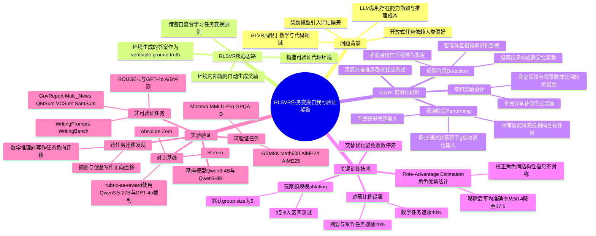

## 一、论文是干什么的？

想象一下，教一个学生做数学题很容易：答案对不对，一眼就能判断，老师根本不用亲自批改，用标准答案核对就行。这就是现在大模型训练里很火的一种方法——RLVR（用可验证奖励做强化学习），专门用来教模型做数学、写代码这类有唯一正确答案的任务，效果很好。

但问题来了：如果要教模型写一篇好的新闻摘要、写一段有创意的小说，该怎么打分呢？摘要写得好不好、故事写得精不精彩，根本没有标准答案，只能靠人来读、来评，或者找另一个更聪明的模型来当裁判。这样做既贵（要花钱调用裁判模型或雇人评审），又容易不公平（裁判自己也可能看走眼，或者被模型的花招骗过去）。

这篇论文要解决的就是这个矛盾：能不能让摘要、创意写作这类**没有标准答案**的开放式任务，也像做数学题一样，拥有一种自动、可靠、不需要人或裁判模型介入的打分方式？作者提出的方法叫RLSVR（用自我可验证奖励做强化学习），核心思路是设计一个巧妙的游戏规则，让"谁做得好"这件事本身变成一道有标准答案的题目。

## 二、核心方法与创新

论文的核心创新可以用一个大家都玩过的游戏来理解——谁是卧底（英文里叫Who Is the Spy）。作者把这个游戏机制搬进了模型训练里，起名叫SpyRL。

**游戏怎么玩**：想象几个模型（比如5个）组成一局游戏。其中大多数模型（平民）拿到的是完整、清晰的任务信息，比如一篇完整的新闻稿要求它们写摘要；但有一个模型（卧底）拿到的信息被故意打了马赛克——原文被遮掉了一部分（论文里对遮盖比例做了设定，摘要和写作任务遮20%，数学任务遮40%）。所有模型都不知道谁是卧底，大家各自完成同一个任务（比如都写一段摘要），然后把大家的输出放在一起，让所有模型互相"投票"，猜谁是那个信息不完整、写得比较心虚露馅的卧底。

这里最巧妙的地方在于：**卧底是谁，系统自己是知道的**（因为是系统故意分配的），这就是一个天然、100%正确、不需要人工介入的标准答案。所以"投票猜对了没有"这件事，可以像判断数学题对错一样，直接给出可验证的奖励，不需要请裁判模型来打分。

那么这跟"摘要写得好不好"有什么关系呢？作者的洞察是：如果一个模型因为信息不全（是卧底），它写出来的东西大概率会露出破绽——逻辑不连贯、内容对不上、比其他人的输出显得奇怪，因此更容易被大家投票认出来。反过来，如果一个平民模型能把摘要写得足够好、足够像"信息完整的正常输出"，就不容易被误认成卧底。这样一来，模型为了在游戏里"少被抓、多抓对别人"，就必须尽力把任务本身做好——把摘要写得逻辑清楚、贴合原文，把创意故事写得合情合理。游戏的输赢和任务质量被巧妙地绑在了一起。

具体训练流程分两个阶段：
- **表演阶段（Performing）**：所有智能体（有的是平民有的是卧底）各自完成目标任务，产出自己的答案。
- **侦察阶段（Detection）**：所有智能体阅读大家的答案，投票猜测谁是卧底。

奖励也是零和设计：如果卧底被大家看穿（票数多），卧底会受到与得票数成比例的负奖励；平民们则分享相应的正奖励作为补偿。而表演阶段的奖励，则和自己作为"嫌疑对象"获得的票数（怀疑度）挂钩——写得越像正常人（不容易被怀疑），奖励越高。

论文中还有两个重要的技术细节，用来让这套机制真正训练得动：
1. **交替优化**：如果只训练"表演"或者只训练"侦察"其中一个阶段，模型很快就会陷入停滞（比如都学会摆烂或者都学会乱猜），必须两个阶段交替、耦合地训练，才能持续进步。
2. **角色优势估计（Role-Advantage Estimation，RAE）**：因为卧底和平民天生信息不对等（卧底信息更少，先天更容易输），如果直接比较两者的奖励分数并不公平，就像让一个蒙眼的人和一个正常人比赛投篮再打分一样不合理。RAE就是用来校正这种结构性不对等，把不同角色的奖励基准重新对齐，论文的消融实验显示，去掉RAE后模型表现从50.4分明显掉到37.5分，说明这一步非常关键。

总结一下，这篇论文最大的创新点是借用了自监督学习里"自己给自己出题、自己判卷"的思路（比如完形填空:把一部分内容盖住,让模型自己猜),把它包装成一个多智能体的社交推理游戏，用游戏规则天然产生的、100%确定的"谁是卧底"答案，间接、可靠地衡量了开放式任务做得好不好，从而彻底摆脱了对人工标注或裁判大模型的依赖。

## 三、使用了哪些模型和计算资源？

**LLM模型**：论文实验中使用的基座模型是 Qwen3-4B 和 Qwen3-8B（阿里巴巴通义千问系列的开源模型）。此外在评测环节使用了 GPT-4o 做A/B胜率评测（作为评估者而非被训练对象），对比实验中还提到了用 Qwen3.5-27B 作为打分裁判（rubric-as-reward基线）。

**GPU/计算资源**：论文附录提到训练使用了单个节点（node）配备8张GPU（1 Node × 8 GPUs），但没有说明具体的GPU型号（如A100、H100等）或使用的是自建集群还是云服务。

**训练/推理耗时**：论文中未提及具体的训练总耗时或每个训练轮次（epoch）、每局游戏（episode）花费的实际时钟时间。已知的是训练配置参数：批大小（batch size）为1024，训练轮数（epoch）为100，最大生成长度为4096 token，每局游戏的玩家数（group size）默认为5人（消融实验测试了3到8人的范围）。但这些是超参数配置，不是实际运行耗时。

**成本信息**：论文提到了对比方法的费用估算——用Qwen3.5-27B做裁判评审的方案成本约200美元，用GPT-4o做裁判的方案成本约900美元，而SpyRL方法不需要外部裁判模型，因此没有这部分额外开销。这是论文中少数提到的具体"金钱成本"数字，但不是GPU算力或时间成本。

## 四、实验结果

论文在三大类任务上做了测试：文本摘要（无标准答案）、创意写作（无标准答案）、数学推理（有标准答案）。

| 任务类型 | 基座模型 | 关键指标变化 |
|---|---|---|
| 摘要（GovReport数据集） | Qwen3-4B | ROUGE-L指标从30.2提升到36.7 |
| 摘要（GovReport数据集） | Qwen3-8B | ROUGE-L指标从29.0提升到34.1 |
| 摘要（GPT-4o胜率评测） | Qwen3-8B | 对比基线胜率约75.4% |
| 创意写作（论文摘要给出的代表性数字） | Qwen3-8B | GPT-4o评测胜率约77.3% |
| 创意写作（WritingPrompts，人工评测） | Qwen3-4B | 对基座模型的整体胜率约80.0% |
| 数学推理（GSM8K） | Qwen3-4B | 准确率从84.5%提升到93.4% |
| 数学推理（Math500） | Qwen3-4B | 准确率从68.2%提升到79.5% |
| 数学推理（AIME 25） | Qwen3-4B | 准确率从6.7%提升到20.0% |
| 数学推理（七个基准平均） | Qwen3-4B / Qwen3-8B | 分别提升约8.97%和6.16% |

简单说，这套方法不仅在没有标准答案的摘要、写作任务上明显超过了此前的自我提升方法（比如R-Zero、Absolute Zero这些同类工作），在原本就有标准答案的数学推理任务上也顺带取得了提升，说明这套"游戏化"训练机制并没有因为兼顾开放式任务而牺牲数学能力。

论文还发现一个很关键的验证性结果：模型在游戏里获得的"怀疑票数"，和用GPT-4o单独评判的输出质量高度相关——这说明卧底游戏机制确实抓住了"输出质量好坏"这个真实信号，而不是让模型学会了钻游戏规则的空子。

此外还有几个有意思的消融发现：
- 只训练表演阶段或只训练侦察阶段，效果都会很快停滞不前，必须两阶段交替训练。
- 去掉信息不对称（也就是不设卧底，大家信息一样）,模型进步会停滞。
- 玩家人数从3人增加到5人时，提升最明显（平均分从5.5提升到9.3），超过5人后收益递减。
- 遮盖信息的比例从20%换成40%，模型表现比较稳健，说明RAE机制能自动校正这种差异带来的不公平。
- 跨任务迁移方面，摘要和创意写作两者训练效果可以相互促进（约55%到59%的胜率），但数学推理训练出来的能力迁移到写作任务上是负面的，说明两类能力关联不大。

## 五、潜在应用与已落地应用

**潜在应用方向**：
- 内容生成类产品（自动摘要、文案生成、故事创作、营销文案）的低成本自我迭代优化，不必持续花钱请人工或大模型裁判评审。
- 客服对话、写作助手等开放式产出场景下的模型持续自我训练与更新。
- 任何"结果好坏难有标准答案，但可以设计游戏规则间接衡量"的任务，例如代码风格评审、创意设计方案筛选等，理论上都可以借鉴这种"任务变换成博弈游戏"的思路。
- 降低对人工标注、偏好数据集和奖励模型训练的依赖，为资源有限的团队提供更便宜的模型自我提升路径。

**已知落地应用案例**：论文作者已经在GitHub上开源了代码和相关模型（仓库地址：[https://github.com/wangqinsi1/RLSVR](https://github.com/wangqinsi1/RLSVR)），该仓库获得了约167颗星。该论文已被COLM 2026（Conference on Language Modeling）接收。除此之外，暂无公开报道的企业级产品或商业化应用案例，仍属于学术研究和开源代码阶段。

## 六、网络上的讨论与评价

通过网络搜索，仅找到了论文本身的arxiv页面、HuggingFace论文页面以及作者开源的GitHub仓库（[https://github.com/wangqinsi1/RLSVR](https://github.com/wangqinsi1/RLSVR)），该论文在HuggingFace Papers页面获得了100个赞（upvotes）。但暂未搜索到Twitter/X、Reddit、Hacker News或中文技术社区（如知乎、掘金）上关于这篇论文的专门讨论或评价文章。可以确认的是该论文已被COLM 2026会议接收。

## 七、思维导图

