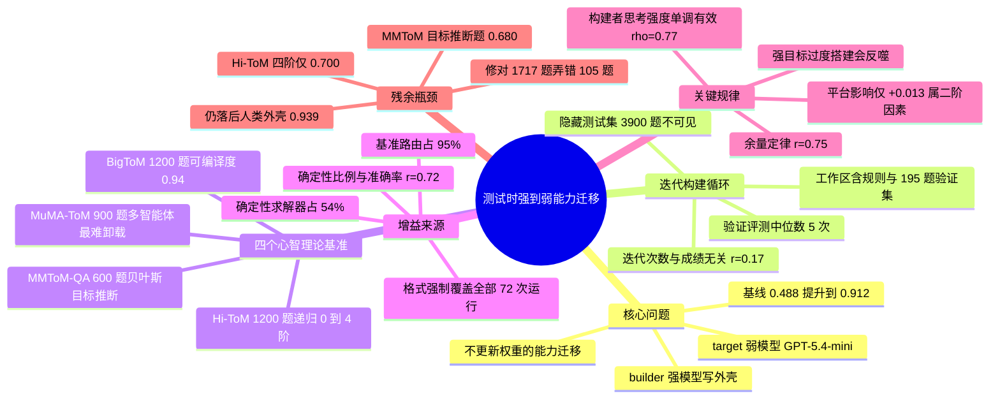

## 一、论文是干什么的？

过去要让一个小模型变强，主流做法是「补课」：找一个大模型当老师，生成一堆讲解和示范，再拿这些数据去训练小模型，改动它的参数。这条路叫**蒸馏**（distillation），有效，但代价是必须重新训练。这篇论文换了个思路问：能不能不动小模型一根汗毛，只在**它答题的那一刻**帮它一把？

作者用的类比其实很生活化。同一个新手厨师，扔进一个乱七八糟的厨房里，做什么都糊；但如果有位大厨提前把台面收拾好、把食材切配称量好、把火候写成贴在墙上的步骤卡、把最容易翻车的几步干脆改成用定时器和电子秤自动完成，那这位新手做出来的菜可以接近专业水准。厨师本人没有变强，是**任务变简单了**。论文把大厨叫 builder（构建者模型），把新手叫 target（目标模型），把那套收拾好的厨房叫 **harness**（外壳）或 scaffold（脚手架）——它由路由逻辑、提示词模板、确定性求解代码、少样本示例、校验环节、答案格式强制等零件拼成。

具体的实验设定像一场编程竞赛：强模型被放进 Cursor、Claude Code、GPT Codex 这样的编码 agent 环境里，只给它一份任务说明、一份「怎么调用目标模型」的示例代码，以及约占全量数据 **5%** 的验证集（195 题）。它看不到隐藏的 3900 题测试集，只能反复写代码、跑验证、看错题、再改，最后交出一个可执行入口。人类评测者拿这个入口跑全量测试集。结果是：目标模型 GPT-5.4-mini 的四基准宏平均准确率从 **0.488** 被抬到最高 **0.912**，相对提升约 87%——能力没有通过权重传过去，而是通过一层外壳传了过去。

## 二、核心方法与创新

### 2.1 问题是怎么被形式化的

论文把这个设定命名为 **strong-to-weak scaffolding**（强到弱脚手架）。记目标模型为 $M_{tar}$，构建者模型为 $M_{build}$。对每个基准 $\mathcal{D}^{(j)}$，随机抽 5% 作为验证集 $\mathcal{V}^{(j)}$，剩下的合并成隐藏测试集 $\mathcal{T}$。构建者理想中想解的是

$$S^{\star} = \arg\max_{S \in \mathcal{S}} \mathrm{Acc}(S, M_{tar}, \mathcal{T})$$

但 $\mathcal{T}$ 它看不见，只能退而求其次，用验证集当代理：

$$\hat{S} = \arg\max_{S \in \mathcal{S}_{build}} \mathrm{Acc}(S, M_{tar}, \mathcal{V})$$

这个「看不见测试集」的约束是整个设计的灵魂：构建者不可能靠背答案取胜，它必须抽象出**可复用的任务结构**，否则外壳在隐藏集上会当场失效。

### 2.2 迭代构建循环

初始工作区是 $\mathcal{W}_0 = \{\mathcal{R}, \mathcal{C}_{demo}, \mathcal{V}\}$，三个零件分别是规则文件、目标模型调用示范、带标注的验证集。之后进入论文 Algorithm 1 的循环：

1. **检查资源**：构建者读规则、读示范代码、翻验证样例，先搞清楚任务长什么样；
2. **提出或修订外壳**：$S_k \leftarrow M_{build}(\mathcal{W}_k)$，实质上就是写一坨 Python；
3. **在验证集上评测**：$\hat{Y}^{\mathcal{V}}_k \leftarrow S_k(M_{tar}, \mathcal{V})$，得到准确率 $a_k$；
4. **诊断并改进**：把错题集合 $\mathcal{E}_k$、当前外壳、当前分数一起并回工作区，进入下一轮；
5. 构建者自己决定何时停手，导出入口函数 $f_{\hat{S}}(x, M_{tar})$；
6. 人类评测者在隐藏集 $\mathcal{T}$ 上跑一遍，得到最终分数。

任务说明里明确写了「每次验证评测计 1 分成本，请谨慎使用」，所以构建者不会疯狂刷验证集。实测**平均 4.9 次、中位数 5 次**验证评测，范围 2 到 15 次。

### 2.3 三个反直觉的发现

**第一，验证次数几乎不影响最终成绩。** 最佳验证分与全量集成绩几乎一一对应（Pearson $r = 0.96$），平均乐观偏差只有 0.021，说明 5% 的验证切片是个诚实的代理、没有明显过拟合；但迭代次数本身与最终准确率基本无关（$r = 0.17$）。瓶颈不是反馈量，而是构建者**提假设的质量**。

**第二，真正起作用的是把推理搬进代码。** 论文用一套十二类技术的分类法人工标注了全部 72 次运行。格式强制出现在 100% 的外壳里，贪心解码（温度 0）98%，基准路由 95%，强制思维链 79%，确定性求解器 54%，自洽投票只有 5%。作者把这些分成两层：前面几项是**可靠性地板**，几乎人人都用，它们防止弱模型因为输出格式乱掉、采样抖动而白白丢分，但正因为人人都用，它们解释不了成绩差异；真正拉开差距的是第二层——极性/否定逻辑（关联 $+0.090$）、结构化抽取（$+0.055$）、少样本示例（$+0.042$）、混合回退（$+0.040$）、确定性求解（$+0.026$）。

**第三，「认知负荷卸载」是机制核心。** 作者给每道题的答案打上来源标签，算出**确定性比例**：有多少比例的题目完全由代码或规则直接答出、根本没让弱模型再推理一遍。这个比例与最终准确率的相关系数高达 $r = 0.72$。而代码行数与准确率只有微弱相关（$r \approx 0.22$）——重点不是写得多，而是卸掉了**对的那部分**负担。

各基准的可编译程度差异极大：BigToM 的确定性比例约 0.94（问题本身常常直接暴露「观察到 / 没观察到」这一关键区分），Hi-ToM 约 0.51（靠符号化的信念状态追踪），MMToM-QA 约 0.44，MuMA-ToM 只有约 0.36（自由形式的多智能体对话最难编译成规则）。

### 2.4 一条「余量定律」

论文还提出了一个很漂亮的经验规律：**提升幅度由目标模型剩下的可纠错余量决定**。把每个「构建者 × 基准 × 目标」的实际增益，对该目标在该基准上的余量 $1 - baseline$ 作图，相关系数 $r = 0.75$。换句话说，脚手架主要在做**能力回收**——把模型本来就会、只是没能稳定发挥出来的部分捞回来，而不是凭空创造新能力。推论也很实用：目标模型越接近天花板，过度搭建反而会打乱它原本正确的行为。

## 三、使用了哪些模型和计算资源？

**构建者模型**（都跑在真实的编码 agent 平台里）：Opus-4.7（低、中、高、超高四档推理强度）、Sonnet-4.6、GPT-5.5、GPT-5.4-mini、Codex-5.3、Gemini-3.1-Pro、Gemini-3.5-flash、Grok-0.1。除 Opus-4.7 做了推理强度扫描外，其余模型统一用最高推理强度。

**目标模型**：主力是 GPT-5.4-mini（弱基线 0.488），对照组是 Gemini-3.5-flash（基线已达 0.761）。

**平台**（构建者自己所处的 agent 外壳）：Cursor、Claude Code、GPT Codex。GPT 系与 Codex 系的「原生平台」是 GPT Codex，Opus 与 Sonnet 的原生平台是 Claude Code，Cursor 作为中立第三方。

**运行规模**：每个配置重复 3 次，共 **72 次实验运行**（其中以 GPT-5.4-mini 为目标的有 57 次）；隐藏测试集共 3900 题。

**推理强度对代码量的影响**：低强度产出的外壳约 510 到 650 行 Python，超高强度约 1000 到 1300 行。

**API 费用、单轮迭代耗时、墙钟时间、token 消耗**：暂无相关信息。论文全文未报告任何金额或时间数据，只在展望里把「推理成本」列为未来基准可以增加的次要指标。构建者调用的是各家云端 API，未使用本地 GPU 训练——因为整个方法完全不涉及参数更新。

## 四、实验结果

### 4.1 一句话版本

给 GPT-5.4-mini 套上自动搭建的外壳后，它在四个心智理论基准上的平均成绩从「基本靠蒙」（0.488，很多题是二选一）变成「接近满分线」（最好一次 0.912）。而且**所有 57 次运行、全部 11 个构建者配置，无一例外都超过了基线**。更有意思的是，套壳后的小模型在每个基准上都超过了不套壳的更大模型 GPT-5.4（基线 0.619）和 GPT-OSS-120B——**改造环境有时比换更大的模型更划算**。

天花板在哪里？人类专家手工设计的 UserHarness 外壳能把同一个 GPT-5.4-mini 推到 0.939，自动搭建的最好成绩 0.912 已经很接近，但还差一口气。

### 4.2 分构建者模型的成绩（目标为 GPT-5.4-mini）

| 构建者模型 | 运行数 | BigToM | Hi-ToM | MMToM | MuMA | 平均（±标准差） | 提升 |
|---|---|---|---|---|---|---|---|
| 无外壳基线 | – | 0.503 | 0.569 | 0.412 | 0.469 | 0.488 | – |
| GPT-5.5 | 6 | 1.000 | 0.803 | 0.842 | 0.857 | 0.875 ± 0.036 | +0.387 |
| Opus-4.7（超高） | 6 | 0.970 | 0.791 | 0.788 | 0.876 | 0.856 ± 0.022 | +0.368 |
| Gemini-3.5-flash | 3 | 0.986 | 0.712 | 0.778 | 0.777 | 0.813 ± 0.047 | +0.325 |
| Sonnet-4.6 | 6 | 0.977 | 0.712 | 0.742 | 0.810 | 0.810 ± 0.069 | +0.322 |
| Opus-4.7（高） | 6 | 0.922 | 0.739 | 0.777 | 0.791 | 0.807 ± 0.033 | +0.319 |
| Opus-4.7（中） | 6 | 0.944 | 0.699 | 0.751 | 0.778 | 0.793 ± 0.065 | +0.305 |
| Gemini-3.1-Pro | 3 | 0.910 | 0.732 | 0.618 | 0.593 | 0.713 ± 0.027 | +0.225 |
| Opus-4.7（低） | 6 | 0.887 | 0.688 | 0.609 | 0.659 | 0.711 ± 0.031 | +0.222 |
| GPT-5.4-mini（自己给自己搭） | 6 | 0.981 | 0.649 | 0.619 | 0.474 | 0.681 ± 0.062 | +0.193 |
| Codex-5.3 | 6 | 0.983 | 0.625 | 0.563 | 0.528 | 0.675 ± 0.043 | +0.187 |
| Grok-0.1 | 3 | 0.613 | 0.592 | 0.537 | 0.511 | 0.563 ± 0.036 | +0.075 |

所有运行的平均是 0.763（$+0.275$），最好的单次运行来自 **GPT-5.5 在 GPT Codex 上**，达到 0.912。

### 4.3 最好的外壳 vs 人类手工外壳（分基准）

| 基准 | 无外壳基线 | 最佳自动外壳 | 人类 UserHarness |
|---|---|---|---|
| BigToM | 0.503 | 1.00 | 0.95 |
| Hi-ToM | 0.569 | 0.80 | 0.87 |
| MMToM-QA | 0.412 | 0.84 | 0.98 |
| MuMA-ToM | 0.469 | 0.88 | 0.96 |

规律很清楚：**越能编译成规则的任务，自动外壳赢得越漂亮**。BigToM 被彻底做穿甚至反超人类外壳；而在需要贝叶斯目标推断的 MMToM-QA 上，人类工程师仍有 0.14 的优势。

### 4.4 换个更强的目标模型会怎样

| 构建者 | 目标 GPT-5.4-mini（基线 0.488） | 目标 Gemini-3.5-flash（基线 0.761） |
|---|---|---|
| GPT-5.5 | 0.855（+0.367） | 0.901（+0.140） |
| Opus-4.7（超高） | 0.840（+0.352） | 0.923（+0.162） |
| Gemini-3.5-flash | 0.813（+0.325） | 0.872（+0.111） |
| Gemini-3.1-Pro | 0.713（+0.225） | 0.881（+0.120） |
| Grok-0.1 | 0.563（+0.075） | 0.780（+0.019） |

平均看，弱目标提升 $+0.262$，强目标只提升 $+0.110$。而且强目标身上出现了**过度搭建反噬**：GPT-5.4-mini 在 20 组匹配对比中没有任何一次跌破基线，而 Gemini-3.5-flash 有 9/20 次在某个基准上退步，尤其是它本来就很强的 Hi-ToM（平均 $-0.04$）和近乎饱和的 MuMA-ToM（平均 $-0.02$）。它 96% 的总增益都来自唯一还有余量的 BigToM。构建者也确实会看菜下饭：面对更强的目标，纯靠模型自己作答的比例全面上升，MuMA-ToM 上从 40% 涨到 73%。

### 4.5 构建者的「思考强度」是条单调曲线

固定构建者为 Opus-4.7、目标为 GPT-5.4-mini，只调推理强度：低 0.711、中 0.793、高 0.807、超高 0.856（Spearman $\rho = 0.77$）。超高档显著优于高档（置换检验 $p = 0.013$）和低档（$p = 0.002$）。收益递减但始终为正，最大的一跃发生在低到中之间——也就是说，让构建者「想到一个可行的结构方案」是关键门槛，再往上是精雕细琢。

### 4.6 其他值得记住的数字

- **稳定性**：同一配置三次重复的宏平均标准差均值 0.036，比 $+0.275$ 的平均增益小一个数量级；但最不稳的一格重复间极差达 0.201，不稳定主要来自确定性求解器——一个逻辑 bug 就能在上千题的基准上抹掉几十个点。
- **是修复还是搬运错误**：最佳外壳在 3900 题上做配对 McNemar 检验，$\chi^2 = 1424.4$，$p < 10^{-4}$；修对了 1717 道原本答错的题，只弄错了 105 道原本答对的题。前八强外壳平均修好 83% 的基线错题，只破坏 7% 的基线正确题。
- **自我搭建也有效**：GPT-5.4-mini 给自己搭外壳也能涨 $+0.17$ 到 $+0.22$，但换成更强的构建者能涨到 $+0.31$。弱模型能捞到一部分结构，高分区间要靠强构建者解锁。
- **互补性**：多个顶级外壳修好的题目取并集，覆盖了 97% 的基线错误，说明不同构建者发现的是**部分不同**的修复机制。
- **平台影响是二阶的**：从中立的 Cursor 换到原生平台，平均只变化 $+0.013$（8 格中赢 5 格，置换检验 $p = 0.484$）。有意思的是存在「平台 × 思考强度」交互：Opus-4.7 在低强度下 Claude Code 反而落后 Cursor（$-0.034$），要到中、高、超高档才反超（$+0.045$、$+0.038$、$+0.032$）——好工具只有在使用者想得够深时才兑现价值。
- **残余错误在哪**：Hi-ToM 的准确率总体随递归阶数下滑，0 阶 0.999、1 阶 0.814、2 阶 0.736、3 阶 0.754、4 阶 0.700，有欺骗情节时进一步降低（0.772 对 0.829）；MMToM-QA 的错误集中在贝叶斯目标推断的第二类问题（qtype 2.1 仅 0.680）；MuMA-ToM 上简单信念题已达 0.985，但社会目标（0.872）和「对他人目标的信念」（0.880）仍是难点。

## 五、潜在应用与已落地应用

**潜在方向**（论文明确提出的）：

1. **廉价部署路线**。当你的生产系统必须用小模型控成本时，不必忍受它的原始水平——花一次性的算力让最强的模型给它写一套外壳，之后每次推理都吃这份红利。论文给的实操配方相当具体：用手头最强的构建者、给它最高推理强度、验证评测别超过五六次、优先把可证明的子任务卸载成代码、预算允许时并行造两三个外壳选验证分最高的那个。
2. **把「搭外壳」变成评测项**。作者建议把这套设定做成 builder 模型的标准基准：给定工作区、弱目标模型、隐藏任务和验证集，考的不是「你能不能答对题」，而是「**你能不能让另一个模型答对题**」，次要指标包括验证使用次数、推理成本、外壳复杂度、代码行数、跨重复的鲁棒性和卸载比例。
3. **外壳自演化的研究平台**。Claude Code、Codex、Cursor 这些编码环境目前仍主要由人设计，本文提供了一个可量化观察「模型自己改造环境」的实验场。
4. **两条路线的协同**。改进模型本身（后训练）和改造任务呈现方式（外壳）不是竞争关系；长远看模型会被训练得更善于使用特定外壳，外壳也会围绕特定模型的长短板自动优化。

**已落地应用**：暂无相关信息。论文未提及任何产品化部署或开源代码仓库。不过研究本身就跑在 Cursor、Claude Code、GPT Codex 三个已经商用的编码 agent 平台上，说明这套流程用现成工具即可复现。

## 六、网络上的讨论与评价

**Hugging Face Daily Papers**：该论文登上了当日 [Daily Papers 第 3 名](https://huggingface.co/papers/2608.12307)，由第一作者 Cheng Qian 于 8 月 13 日提交，截至本文写作时获得 107 个赞。

页面上的社区讨论目前只有两条：

- 作者本人（用户名 chengq9）留言："A strong model can transfer capability to a weaker model at test time by automatically building an inference harness."（一个强模型可以通过自动构建推理外壳，在测试时把能力迁移给弱模型。）
- Librarian Bot 自动推荐了一批相似论文，全部集中在「外壳」这一主题：Rethinking the Evaluation of Harness Evolution for Agents、Co-Harness: Co-Evolving Harnesses and Model Weights for LLM Agents、MemoHarness: Agent Harnesses That Learn from Experience、SoftSkill: Behavioral Compression for Contextual Adaptation、HarnessOpt-Bench: Evaluating LLMs at Harness Optimization、Evo-Bench: Can Language Models Improve Agent Harness?、TTHE: Test-Time Harness Evolution。

**同期语境**：这篇论文落在 2026 年一股明显的「harness 而非权重」研究浪潮里。同期可检索到的相关工作包括 [SIA: Self Improving AI with Harness & Weight Updates](https://arxiv.org/abs/2605.27276)（同时更新外壳与权重）、[Self-Harness: Harnesses That Improve Themselves](https://arxiv.org/abs/2606.09498)（无需更强外部模型的自我优化）、[Ouroboros](https://arxiv.org/html/2608.08311)（自我演化的编码 agent 核心），以及社区维护的 [Awesome-Harness-Self-Improvement](https://github.com/leezythu/Awesome-Harness-Self-Improvement) 阅读列表。需要说明的是：截至查证时，该阅读列表与 Lilian Weng 的 [harness 工程综述](https://lilianweng.github.io/posts/2026-07-04-harness/) 均**未**收录或引用本文，这些只是同主题的邻近工作，并非针对本文的评论。

**X（Twitter）、Reddit、Hacker News、知乎上的具体讨论**：暂无相关信息。多轮检索未找到可核实的第三方讨论帖或博客评论。

## 七、思维导图

