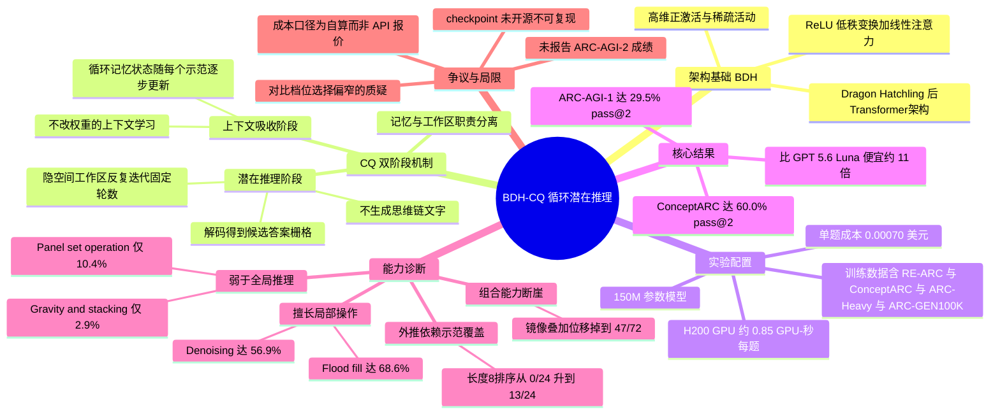

## 一、论文是干什么的？

想象你在做一套「看图找规律」的智力测验题：每道题先给你三五组「输入图 → 输出图」的示范，让你自己悟出背后那条规则，然后给你一张新的输入图，要你画出对应的输出图。这就是 ARC-AGI 这个著名基准的形式——它专门设计成「人类小孩看几眼就懂，但大模型经常抓瞎」。

目前主流大模型解这类题的办法，是「把想法说出来」：模型一边生成一长串思维链文字（「这个方块向右移动了两格……颜色好像换了……」），一边靠这串文字推进思考。这个办法有效，但很贵——每个中间念头都要变成 token 吐出来，既烧钱又慢。本文提出的 **BDH-CQ** 走了另一条路：**不说话，只在脑子里想**。它把示范样例一个个「吃」进一块会不断改写的循环记忆里（相当于边看边把规则记进脑子），然后针对待解的那张图，在一个高维的隐空间里反复迭代计算若干轮，最后直接把答案格子画出来，中间过程完全不落成文字。

结果相当惊人：一个只有 **1.5 亿参数**的模型（比常见大模型小三到四个数量级），在 ARC-AGI-1 公开评测集上拿到 **29.5% pass@2**，而单题推理成本只有 **0.0007 美元**。作为对比，得分 34.2% 的 GPT 5.6 Luna（Low 档）每题要 0.040 美元。论文的核心主张不是「我比大模型更聪明」，而是「我把成本-精度的帕累托前沿往外推了一大截」——用不到百分之一的钱，换来只低几个百分点的分数。

## 二、核心方法与创新

### BDH 是什么

**BDH** 全称 **Dragon Hatchling**（幼龙），是 Pathway 此前提出的一种**后 Transformer 序列模型架构**。论文对它的定义是：围绕**高维正激活**（high-dimensional positive activations）、**低秩通信**（low-rank communication）和**循环联想状态**（recurrent associative state）构建。具体地，BDH 层把 **ReLU 低秩变换**与**线性注意力**组合在一个很大的「神经元空间／特征空间」里运行。

作者把设计哲学总结为「借鉴生物学做对了的那几件事：局部交互、稀疏活动、持久状态、持续调整」，并明确强调这是「**受脑启发，但不是模仿脑**」（brain-inspired but not brain-imitative）。

打个比方：Transformer 像一间会议室，每轮讨论所有人都要重新读一遍完整的会议纪要（注意力回看全部历史）；BDH 更像一块**共享白板**——参与者只在白板上留下改动，白板本身就是记忆，下一轮直接在白板现状上继续写。白板很大但每次只有少数区域被点亮（稀疏），改动是局部的、累积的。

### CQ：把「学规则」和「用规则」拆开

BDH-CQ 的关键结构创新，是把解题过程明确切成两个互不相同的阶段，各自用一套状态。论文里 **CQ** 未被明确展开定义，从公式结构看对应 **Context（上下文）** 与 **Query（查询）** 这两段。

**第一阶段：上下文吸收（记忆更新）。** 每看完一个示范 $D_t$，模型就更新一次自己的循环记忆状态：

$$S_t = U_\theta(S_{t-1}, D_t)$$

$S_t$ 是吃完第 $t$ 个示范之后的上下文状态。注意这里**没有任何梯度下降、没有改一个权重**——规则是被「写进状态」的，不是被「训练进参数」的。这正是上下文学习（in-context learning）的本义，只不过 BDH 把承载它的容器从「注意力 KV 缓存」换成了一块**显式的循环联想记忆**。看完全部 $K$ 个示范后得到 $S_K$，可以理解为「模型已经把这道题的规则记住了」。

**第二阶段：潜在推理（迭代计算）。** 拿到待解的输入图 $x^\star$ 后，模型先把它编码进一个「工作区」，然后在工作区里反复迭代 $R$ 轮，最后解码出答案：

$$H_0 = E_\theta(x^\star, S_K)$$

$$H_{r+1} = F_\theta(H_r, S_K), \quad r = 0, \ldots, R-1$$

$$\hat{y} = G_\theta(H_R)$$

论文特别强调 $S_t$ 与 $H_r$ **职责分离**这一点的重要性：「$S_t$ 随证据出现而变化，支撑上下文学习；$H_r$ 承载用于回答当前查询的进行中的计算。」用比喻说，$S_K$ 是**你脑子里刚背下来的那条规则**（读完题目说明就固定了），$H_r$ 是**你在草稿纸上一遍遍涂改的演算过程**（针对这一道具体的题）。两者混在一起，就是今天大多数模型的做法；拆开，才能让「反复想」这件事变得便宜——因为反复的只是 $H_r$ 这一小块工作区，而不是把整段上下文重新过一遍。

### 为什么不说话反而更划算

论文在引言里给出的动机很直白：思维链把中间步骤序列化成 token，代价是「token 消耗、延迟、推理算力」三重开销；而在连续隐空间里迭代，可以「**保留多个部分假设或候选变换而无需把每一个都序列化出来**」。也就是说，潜在推理天然支持「同时脑补好几种可能」这种叠加态式的思考，而文字思维链每次只能沿着一条路往下写。

### 可调的「思考力度」

BDH-CQ 支持三档**推理力度**（reasoning effort：LOW / MEDIUM / HIGH），本质上就是调节迭代轮数 $R$ 一类的旋钮，让用户在精度和成本之间自由取舍。这相当于给了小模型一个「多想一会儿」的开关。

### 需要说清楚的一点

论文对实现细节保留得相当克制，原文明确写道「维度、确切的更新规则和实现细节仍属专有」，以及「完整的内部训练配方仍属专有」。所以 $U_\theta$、$F_\theta$ 的具体形式、$R$ 的确切取值、层数、神经元空间维度等，论文均未披露。这也是后续社区批评的焦点之一。

## 三、使用了哪些模型和计算资源？

| 项目 | 数值 |
|---|---|
| 模型规模 | 150M（1.5 亿）参数 |
| 架构 | BDH（Dragon Hatchling），后 Transformer |
| GPU 型号 | NVIDIA H200 |
| GPU 数量（训练） | 暂无相关信息 |
| 训练时长 | 暂无相关信息 |
| 单题推理耗时 | 约 0.85 H200 GPU-秒 |
| 单题推理成本 | 0.00070 美元（按 3 美元／H200-小时折算） |
| MIN 力度档成本对比 | 0.00088399 美元 vs 标准配置 0.00265246 美元，即约为其三分之一（这一组是 MIN 消融实验单独的一套核算口径，与上一行 0.00070 美元的主结果口径不同，不可直接相减比较）|
| API 成本 | 不适用，模型自建自跑，非调用外部 API |
| 外部 LLM 依赖 | 无（这是一个自研的独立小模型，不依赖任何 LLM） |
| 训练超参数（batch size、epoch、学习率） | 暂无相关信息（原文声明为专有） |

需要注意的是，论文报告的是**计算推理成本**（computed inference cost），即按 H200 单价 3 美元／小时乘以实测 GPU-秒得出，而不是某个商业 API 的挂牌价——这与其对手 GPT 5.6 Luna 的 0.040 美元／题（API 报价）在口径上并不完全对等。

## 四、实验结果

### 主结果

| 评测集 / 条件 | N | Pass@1 | Pass@2（95% 置信区间） |
|---|---|---|---|
| ARC-AGI-1 公开评测（按任务） | 400 | 97（24.25%） | 118（**29.50%**）[25.24, 34.15] |
| ARC-AGI-1 公开评测（按测试对） | 419 | 108（25.78%） | 130（31.03%） |
| ConceptARC 语义 ID（按任务） | 160 | 73（45.63%） | 95（59.38%）[51.63, 66.68] |
| ConceptARC 不透明 ID（按任务） | 160 | 72（45.00%） | 96（60.00%）[52.26, 67.27] |
| ConceptARC（按测试对） | 480 | — | 374（77.92%） |

一个有意思的对照实验：把 ConceptARC 里带语义含义的概念 ID 换成完全不透明的编号，成绩基本没变（59.38% 对 60.00%）——说明模型确实是从示范里现学规则，而不是靠标签名字里的语义线索作弊。

### 成本-精度对比

| 系统 | Pass@2 | 每题成本 |
|---|---|---|
| **BDH-CQ（150M）** | **29.5%** | **0.00070 美元** |
| GPT 5.6 Luna（Low） | 34.2% | 0.040 美元 |
| HRM | 暂无相关信息 | 1.48 美元 |
| TRM | 暂无相关信息 | 1.76 美元 |

相对 GPT 5.6 Luna（Low），BDH-CQ 便宜约 **57 倍**；在 2026 年 7 月 30 日对方 API 降价之后，这个倍数收窄到约 **11 倍**。

### 思考力度可调

| 力度 | Pass@2 | 成本下降 |
|---|---|---|
| HIGH | 29.5% | 0% |
| MEDIUM | 27% | 11% |
| LOW | 21% | 22% |

### 它擅长什么、不擅长什么

论文最有价值的部分其实不是那个成本数字，而是一整套「机制分层」诊断——作者自己生成了 1131 道任务，按 16 类底层操作分类打分：

| 操作类型 | N | 解决率 |
|---|---|---|
| Flood fill（漫灌填充） | 51 | 68.6% |
| Denoising（去噪） | 65 | 56.9% |
| Scaling（缩放） | 82 | 53.7% |
| Cropping and extraction（裁剪抽取） | 74 | 44.6% |
| Translation（平移） | 87 | 35.6% |
| Tiling and repetition（平铺重复） | 79 | 34.2% |
| Line drawing（画线） | 84 | 29.8% |
| Rotation（旋转） | 75 | 25.3% |
| Recolor by property（按属性重着色） | 75 | 25.3% |
| Object sorting and rank（物体排序） | 68 | 19.1% |
| Object counting（物体计数） | 86 | 18.6% |
| Reflection（镜像） | 72 | 16.7% |
| Symmetry completion（对称补全） | 61 | 16.4% |
| Occlusion repair（遮挡修复） | 56 | 16.1% |
| Panel set operation（面板集合运算） | 48 | 10.4% |
| Gravity and stacking（重力堆叠） | 68 | 2.9% |

规律很清楚：**局部的、可以「一格格蔓延」的空间操作它做得好**（漫灌 68.6%）；**需要全局比较、计数、排序、多步物理模拟的它几乎不会**（重力堆叠只有 2.9%）。

### 组合能力的断崖

论文还测了「单个操作会不会 + 两个操作能不能叠」：

| 操作 | 单独执行 | 与位移组合 |
|---|---|---|
| 位移 Relocation | 72/72 | 不适用 |
| 旋转 Rotation | 72/72 | 72/72 |
| 镜像 Reflection | 72/72 | 47/72 |
| 换色 Color swap | 26/72 | 0/72 |

镜像单独做满分，一旦和位移组合就掉到 47/72；换色和位移组合直接归零。这是很硬的证据：模型学到的是**一批彼此独立的变换模板**，而不是可以自由拼装的组合式表征。

### 示范覆盖度决定一切

论文另一个关键发现是：**外推能力几乎完全取决于示范里有没有覆盖到相应复杂度**。长度为 8 的排序任务，如果示范只给短样例，成绩是 **0/24**；把示范换成覆盖了同等复杂度的样例，立刻升到 **13/24**。深度为 5 的嵌套任务同理，从 19/24 升到满分 **24/24**。换句话说，它是个极其出色的「模仿者」，但几乎不会「举一反三超出示范范围」。相应地，遇到示范中从未出现过的参数取值，成功率是 **0%**；需要根据条件选择不同规则时，准确率从 100% 掉到 56.7%。

还有一个一致性问题：160 道 ConceptARC 任务里有 **52 道**只答对了 3 个测试输入中的 1 到 2 个——说明模型「悟到规则」和「稳定地把规则用到底」之间还有明显落差。

论文**未报告 ARC-AGI-2 的成绩**，作者表示当前这套诊断为攻克更难的基准提供了「具体的开发议程」。论文也**未提出任何单义性（monosemanticity）或机制可解释性方面的主张**。

## 五、潜在应用与已落地应用

**论文与官方博客明确提到的方向：** Pathway 在研究博客中列出了几个设想中的应用场景——**行程规划**、**网络安全调查**、**交通调度协同**、**自主工作流**。共同点是都需要「持久状态 + 低推理成本 + 高频反复决策」，而不需要模型把推理过程解释给人听。

**更一般地看，这套范式适合的地方：**

- **边缘与端侧部署**：1.5 亿参数、单题不到一 GPU-秒，理论上可以塞进本地设备做实时感知与决策。
- **超高频调用场景**：日志异常检测、工业质检、风控规则匹配这类每天跑几百万次的任务，成本差三个数量级是决定性的。
- **流式／持续学习系统**：$S_t$ 这种「边看边改写记忆」的结构，天然契合数据不断流入的场景，也正好是 Pathway 这家公司的实时数据流主业。

**落地状态：** Pathway 表示「我们正开始与设计合作伙伴合作，识别持久状态、潜在推理与低推理成本可能创造全新效用的应用」。**没有公开的产品化时间表，也没有开源发布计划**——那个 150M 的 checkpoint 不是可下载的公开产物。作为对照，BDH 基础架构本身有公开代码仓库 [pathwaycom/bdh](https://github.com/pathwaycom/bdh)，任务生成工具也有 [pathwaycom/arc-task-gen](https://github.com/pathwaycom/arc-task-gen)。

**必须承认的局限：** 从第四节的诊断看，这**不是**一个通用推理器。它是「**可验证的窄域专才**」——在 ARC 风格的网格变换这一个分布上被训练得很好，组合能力弱、外推能力弱、跨基准泛化未经验证。任何把它当作通用智能进展来读的解释，论文本身都没有支持。

## 六、网络上的讨论与评价

这篇论文在 HuggingFace 上拿到 604 票，热度很高，但值得注意的是——**HuggingFace 论文页与 alphaXiv 页面均未见实质性的社区评论线程**，Reddit、Hacker News、知乎上也未搜索到成规模的讨论帖。传播主要发生在 X 与几家技术博客。

**作者方的传播口径。** Pathway CEO Zuzanna Stamirowska 在 [X 上发文](https://x.com/zuzanna_pathway/status/2087139483372441782)：「Pathway 的 BDH-CQ 模型重新定义了 ARC-AGI-1 上的成本效率前沿：29.5% 只要 0.0007 美元。这由上下文学习和潜在推理实现。欢迎来到后 Transformer 时代。」公司同步发了 [BusinessWire 新闻稿](https://www.businesswire.com/news/home/20260811268264/en/Pathways-150M-Parameter-Model-Breaks-the-ARC-AGI-1-Cost-Efficiency-Frontier)，被 Morningstar 等财经媒体转载。

**alphaXiv 官方账号**在 [X 上的概括](https://x.com/askalphaxiv/status/2088038388343468370)比较中性：「这篇论文不生成 CoT，而是让样例更新一个循环记忆，然后在连续潜在状态里反复推理，不把中间步骤说出来。」

**最尖锐的批评来自 explainx.ai**，[其文章](https://explainx.ai/blog/pathway-bdh-cq-150m-post-transformer-arc-agi-august-2026)的核心指控是「**主张范围蔓延**」：作者认可「底层架构和支撑论文都是真实且可引用的」，但指出「**这个故事的大多数聚合报道丢掉了精度差距，只留下了那个倍数**」——Luna 在同一测试上仍有 34.2%，比它高 4.7 个百分点，而 11 倍便宜这个数字抹不掉这个差距。文章还提出三条具体质疑：其一，「整个已发表结果的范围仅限于 ARC-AGI-1」，缺乏更广泛验证；其二，Luna（Low）是「GPT-5.6 最便宜、推理力度最低的配置，不是 GPT-5.6 最强的配置」，对比档位选得偏窄；其三，「**你没法下载并运行 BDH-CQ**」，因为那个 150M checkpoint 并非公开发布的产物。文章的结论是把它读作「成本曲线上的一个真实点位，而不是伪装起来的能力主张」。不过该文也承认，Pathway **自己的措辞其实是精确的**——官方说的是打破「成本效率前沿」，一个帕累托式的主张，从未声称在原始分数上追平或超越 GPT-5.6；走样发生在二手转载环节。

**Ken Ashe（AI Optimist）的评论**[相对温和](https://kenashe.ai/blog/2026-08-11-bdh-cq-makes-arc-reasoning-cheaper-by-thinking-in-latent-space/)，他认为「最好的教训是架构层面的，不是宣传层面的」：值得学的是「运行时提供样例 + 随样例到达而更新的记忆 + 重复的隐藏计算」这套模式，「如果一个 1.5 亿参数模型能以几分之一美分的代价做有用的迭代推理，那是另一种部署对话」。同时他也提醒「公开摘要没有告诉我们足够多的信息，不足以把这当成一次通用推理的突破」，并直言「我不会仅凭这个结果就替换一个生产系统」。他的落脚点是「胜利在于把推理方法匹配到任务的几何结构」，而不是简单地偏爱小模型。

整体来看，社区的共识大致是：**结果本身可信且有意思，架构方向值得关注，但被媒体放大成了一个它并不主张的故事**，而且封闭的实现细节让外部无法独立复现。

## 七、思维导图

