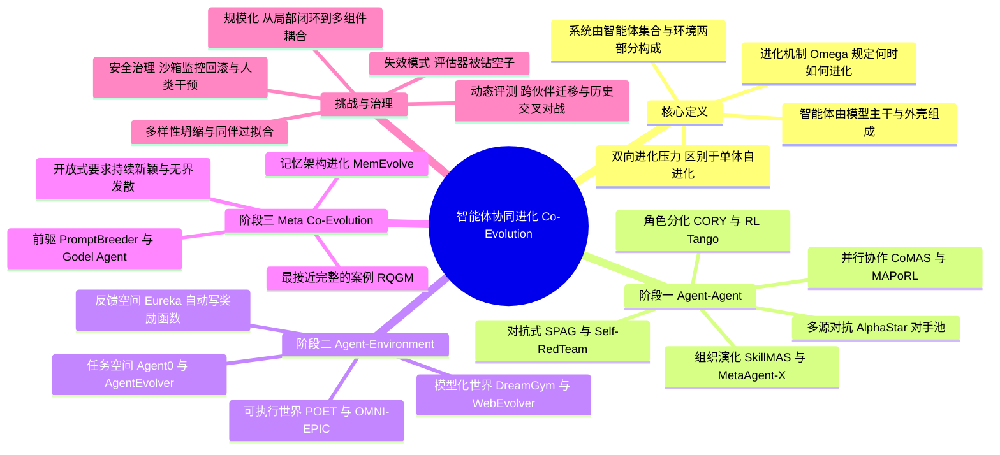

## 一、论文是干什么的？

想象你在健身房里练拳。如果你的陪练是一个永远只会出同一记直拳的木头人，那么你进步得再快，也会在某一天彻底撞上天花板——因为你要适应的东西根本不再变化了。但如果陪练是一个真人，他会观察你的破绽、调整他的打法，而你又要重新去破解他的新打法，于是你们两个人在互相"逼迫"的过程中一起变强。这篇综述关心的，正是人工智能体（agent）世界里的这件事：**单个智能体的自我进化终究会被静态的学习环境卡住上限，只有让多个部件互相施加进化压力，进步才能持续下去**。

论文把这种现象叫做**协同进化**（Co-Evolution），并把它明确定义为"自进化"（self-evolution）的一种多组件形态。作者指出，现在的智能体系统被越来越多地期待在"部署之后"还能继续变好，但大部分已有工作都是单个智能体在固定的任务、固定的反馈、固定的环境里反复打磨自己，这就像那个木头人陪练——迟早会到头。作者借用了演化生物学里著名的**红皇后效应**（Red Queen effect，即"你必须拼命奔跑才能留在原地"）来说明：持续的进步要求的是双方的相互适应，而不是只有一边在适应。

整篇论文的核心贡献是一套**递进式的三阶段分类体系**，用来刻画系统在多大程度上"甩掉"了人类工程师预先设定的约束：从智能体之间互相进化（Agent–Agent），到智能体与环境一起进化（Agent–Environment），再到连"进化机制本身"都变得可进化（Meta Co-Evolution）。除此之外，论文还系统讨论了这类系统在评测、规模化和安全可控性上的开放挑战。作者自称这是**第一篇聚焦于协同进化的综述**，特别强调要把"真正的协同进化"与"仅仅是多智能体之间交换信息或互相调用"区分开来。

## 二、核心方法与创新

### 2.1 先把话说清楚：什么才算"协同进化"

综述类论文最容易滑向"什么都往框里装"，所以本文一上来先做了形式化定义，这是它最见功力的部分。

一个智能体系统被记作 $S=(A,E)$：

- **智能体集合** $A=(\{a_1,\dots,a_n\},\Pi)$，其中每个智能体 $a_i=(m_i,h_i)$ 由两部分组成——$m_i$ 是模型主干（model backbone，即底层大模型的权重），$h_i$ 是**外壳**（harness，包含记忆、工具、技能、提示词、工作流）；$\Pi$ 则编码了角色分工、通信拓扑等结构信息。
- **环境** $E$：智能体作用于其上、并从中获得反馈的外部要素。

一个智能体发生了进化，当且仅当 $\Delta a_i \neq 0 \Leftrightarrow (\Delta m_i \neq 0) \vee (\Delta h_i \neq 0)$。换句话说，**改权重算进化，改记忆、改工具、改提示词同样算进化**——这个宽口径定义让综述能同时覆盖强化学习流派和提示词工程流派的工作。

系统的状态转移由**进化机制** $\Omega$ 掌控：

$$
S^{t+1}=\Omega(S^t,\tau^t)
$$

$\Omega$ 规定了五件事：进化什么（目标）、何时触发、如何产生变体、在哪里进化、以及如何评判质量。这五问后面在第三阶段会被整体推翻重来，是全文的伏笔。

真正的协同进化则要求**耦合**：存在两个不同的进化单元 $x \neq y$，二者都在变化（$x^{t+1}\neq x^t$ 且 $y^{t+1}\neq y^t$），并且彼此之间存在**双向的进化压力**。用作者的话说，是"至少两个进化单元共同适应并持续重塑对方的后续进化，而不仅仅是交换信息或发生交互"。这一句把大量"多个 GPT 互相聊天"的工作排除在外了。

### 2.2 阶段一：Agent–Agent 协同进化

这一阶段环境固定不变，进化压力全部来自**会变的同伴**：

$$
A^{t+1}=(\{a_i^{t+1}\},\Pi^{t+1})=\Omega(A^t,E,\tau^t)
$$

**（1）对抗型智能体**（Adversarial Agents）。这是最直观的一类，一方变强逼另一方也变强。

- **成对对抗压力**（Pairwise）：从经典的 **GAN**、**RARL**（鲁棒对抗强化学习）一路到大模型时代的 **SPAG**（通过语言博弈自我对弈）、**ACE-Safety**、**AdvGRPO**、**MAGIC**、**CHASE**、**Self-RedTeam**、**ARLAS**。可以看到红队与安全对齐是这一支的重镇：攻击方不断发明新越狱手法，防守方不断补上，两边一起爬坡。
- **多源对抗压力**（Multi-Source）：不再是一对一，而是面对一个不断扩张的对手池。代表工作有 **AlphaStar**（星际争霸中的联盟训练与对手池）、**TriPlay-RL**、**AdvEvo-MARL**。多源的好处是能缓解"只会打某一个对手"的过拟合。

**（2）协作型智能体**（Collaborative Agents）。压力不来自敌对，而来自队友的水平变化。

- **并行协作**（Parallel Collaboration）：多个地位对等的智能体同时学习，代表有传统 **MARL** 框架、**MARS2**、**CoMAS**（通过交互奖励实现多智能体共同进化）、**MAPoRL**、**CORAL**、**GEA**。
- **角色分化协作**（Role-Differentiated）：智能体被分成不同职能，形成非对称的相互塑造，例如生成者与验证者、执行者与批评者。代表工作包括 **CORY**、**RL Tango**、**CoVerRL**、**WaltzRL**、**EvoScientist**（多智能体科研）、**SiriuS**、**MARS**、**MARFT**。这一类里"策略—奖励模型"共同进化是一条很热的线：验证者变精明了，生成者就没法再靠投机取巧拿分。

**（3）演化中的智能体组织**（Evolving Agent Organizations）。变化的不再只是单个成员，而是**组织结构本身**——谁跟谁通信、怎么分工、团队要不要扩编。代表工作有 **R3DM**、**SkillMAS**、**MetaAgent-X**。可以类比一家公司：不只是员工在成长，部门架构也在重组。

### 2.3 阶段二：Agent–Environment 协同进化

到这一层，环境不再是背景板，而是共同进化的一方：

$$
(A^{t+1},E^{t+1})=\Omega(A^t,E^t,\tau^t)
$$

作者把"环境"拆成三个可进化的子空间，这是本文分类体系里最细致的一段。

**（1）任务空间协同进化**（Task-Space）。任务难度跟着智能体水平走。

- **暴露与选择**（Exposure and Selection）：从已有任务池中挑出当前最有价值的那些，思想源头是课程学习（curriculum learning），代表工作有 **PORTAL**、**SEAD**。
- **自适应任务生成**（Adaptive Task Generation）：干脆现场造新任务。代表工作非常密集：**GenEnv**、**Tool-r0**、**Agent0**、**SENTINEL**、**CoEvolve**、**AgentEvolver**、**Search self-play**、**MobileForge**、**SEAgent**、**WebRL**、**UI-voyager**、**EvoCUA**、**Socratic-SWE**、**RLAnything**。从中能看出应用面：GUI/手机操作、网页导航、软件工程修复、工具调用、检索问答几乎全被覆盖。

**（2）反馈空间协同进化**（Feedback-Space）。评判标准本身也在演化。

- **偏好驱动**（Preference-Driven）：**PEBBLE**、**DAPPER**、**DUO**。
- **结果驱动**（Outcome-Driven）：**Eureka**（用大模型自动写并迭代奖励函数）、**ROSKA**、**LaRes**、**RE-GoT**、**CURE**、**CoEvoSkills**。
- **一致性增强**（Consistency-Augmented）：**SURF**、`R*`、**ARCO**、**NLAC**、**ECHO**，思路是用多路结果的自洽性来构造监督信号，绕开对人工标注的依赖。

**（3）交互空间协同进化**（Interaction-Space）。连智能体能"摸到"的世界都在长大。

- **可执行世界构建**（Executable World Construction）：真造出可运行的环境。代表有开放式学习的奠基工作 **POET**、基于 regret 的环境生成方法、**DEGen**、**COvolve**、**ADR**（域随机化自动化）、**OMNI-EPIC**、**LLM-POET**、**XLand**、**MAESTRO**、**Agent-World**、**SEAL**。
- **基于模型的世界构建**（Model-Based World Construction）：用神经网络"想象"环境，省掉真实交互的高昂成本。代表有 **WebEvolver**、**COMAP**、**DreamGym**、**PaW**、**EvolvingWorld**、**EvolvingAgent**、**LCDrive**。

### 2.4 阶段三：Meta 协同进化

这是全文最具野心也最"空"的一层——**进化机制 $\Omega$ 自己也开始进化**：

$$
\Omega^{t+1}=\Gamma^t(S^t,\Omega^t,\tau^t)
$$

$$
S^{t+1}=\Omega^{t+1}(S^t,\tau^t)
$$

前两阶段里，"什么时候该进化、用什么方式产生变体、拿什么标准评判"这些规则都是人写死的。到了元层，这些规则本身成了被优化的对象。作者进一步给出了**开放式**（open-endedness）的两个条件：**持续新颖性**（$\Omega^{t+1}\neq\Omega^t$，机制永不重复）与**无界发散**（$\lim_{t\to\infty}\mathcal{H}(S^t,\Omega^t)=\infty$，系统复杂度无上界增长）。

作者坦率地承认这一层目前**只有零星的前驱工作**，而且大多只动了 $\Omega$ 的某一个局部：

- **PromptBreeder**：进化的是"变异提示词"，也就是控制未来任务提示词如何变化的那一层规则。
- **Gödel Agent**：进化的是智能体自我修改的机器本身。
- **MemEvolve**：进化的是掌管经验复用的记忆架构。
- **HyperAgents**：对机制组件进行演化。
- **SIA**：利用轨迹反馈来决定这一轮该改外壳还是该改权重——也就是把"进化什么"这一问交给系统自己回答。
- **RQGM**（Red Queen Gödel Machine）：论文视为最接近完整元协同进化的案例，任务智能体与评估器共同进化，同时由一个元智能体依据联合反馈来引导后续的进化走向。

### 2.5 分类体系为什么是"递进"的

三个阶段不是并列的三个筐，而是**进化自由度的逐层放开**：阶段一放开了同伴，阶段二放开了环境，阶段三放开了规则。论文的图 2 正是用"边界不断外扩"来表达这个意思；图 1 则对比了单体自进化（收益有界）与多组件协同进化（相互压力维持进步）。作者在图 4 中汇总了跨论文的证据，指出阶段一与阶段二的方法在各类设定下都能稳定带来提升，但**收益会随时间趋于平台**，而这恰恰是推动人们走向阶段三的动机。具体的汇总数值在可获取的正文中未给出，此处不作臆测。

## 三、使用了哪些模型和计算资源？

**本文是一篇文献综述，没有自己的实验，也不涉及作者自有的训练算力。** 论文没有提出新模型、没有训练任何权重、也没有报告 GPU 小时数或集群规模。它的"方法"就是文献的组织与形式化：作者构建了一套统一记号（$S=(A,E)$、$\Omega$、$\Gamma$），并用它把散落在强化学习、多智能体系统、开放式学习、大模型智能体等多个社区的工作重新归位。综述引用规模在 200 篇以上，但**论文并未明确声明"共调研 N 篇文献"这一确切数字**，因此这里不给出精确计数。

不过，从它调研的对象可以看出这一研究方向的算力门槛差异极大，大致分成两个梯队：

- **重算力梯队**：以 **AlphaStar** 为代表的对手池自对弈训练、**XLand** 这类大规模开放式环境、以及 **POET** 系的环境—智能体协同演化，都需要长时间、大规模的并行仿真与策略更新，属于典型的工业级算力投入。阶段二中"可执行世界构建"这一支尤其昂贵，因为每一步进化都要真实地跑环境。
- **轻算力梯队**：以 **PromptBreeder**、**Gödel Agent**、**MemEvolve** 为代表的"只改外壳不改权重"的路线，进化发生在提示词、记忆结构、工具配置层面，主要成本是大模型的推理调用而非训练。这也是论文把 $h_i$（harness）与 $m_i$（model）并列写进进化定义的现实原因——在大模型时代，**改外壳是一条算力友好得多的进化路径**。

值得一提的是，阶段二里"基于模型的世界构建"（**DreamGym**、**WebEvolver** 等）本身就是一种算力优化思路：与其让智能体在昂贵的真实网页或真实系统里试错，不如先学一个世界模型在"梦里"练，这直接对应了降低协同进化成本的工程动机。

**关于配套资源：** 在可获取的论文正文中**未发现配套的 GitHub 仓库或 paper list 链接**；网络检索也未找到与本综述明确对应的 awesome-list 项目。若日后作者补充发布，读者可留意 arXiv 页面的更新。

## 四、实验结果

**本文没有自有实验，因此这一节呈现的是综述所总结的"评测现状与挑战"。** 这恰恰是论文批判性最强的一节。

### 4.1 现有基准测不出协同进化

作者的核心批评是：**现有基准主要衡量智能体的最终能力**——在工具使用、网页操作、机器人、代码等领域给出一个终点分数。但协同进化关心的是"多个部件是否在一起变好"，这是一个过程性质的问题，用终点分数根本看不出来。作者据此提出了几类必要的评测手段：

1. **跨伙伴/跨环境的迁移测试**：把训练好的智能体丢给从未见过的同伴或环境，检验它学到的是通用能力还是只针对特定对手的招式。
2. **组件消融**：拆掉协同进化环路中的某一方，看整体收益还剩多少，以确认提升确实来自"耦合"而非单边优化。
3. **历史交叉对战**（historical cross-play）：让当前版本与自己的历史版本对打，这是判断系统是在真进步还是在原地打转（循环克制）的经典手段。

作者还特别提醒一个隐蔽风险：**更高的任务成功率可能掩盖了投机行为**——智能体学会的可能是钻评估器的空子，而不是把事情真的做好。

### 4.2 三类被点名的失效模式

综述归纳出协同进化系统特有的三种翻车方式：

- **评估器被钻空子**（evaluator exploitation）：当奖励模型或验证器也在进化时，生成方可能找到它的盲区，双方一起滑向一个自欺欺人的均衡。
- **同伴过拟合**（partner overfitting）：只擅长对付当前这个陪练，换一个人就不会打了。
- **多样性坍缩**（diversity collapse）：种群里的策略趋同，进化压力随之消失，系统提前熄火。

### 4.3 规模化的困难

作者指出，当前几乎所有工作都停留在**局部闭环**：攻击者—防御者、策略—奖励、智能体—任务，一次只耦合两个部件。真正的难题是把智能体、外壳组件、环境统统纳入一个统一的协同进化过程，而**不引发不稳定或某一方压倒性支配**。这是一个尚未被解决的开放问题。

### 4.4 安全与可控性

论文把安全列为**一等重要的关切**，但也很诚实地承认自己**没有把安全治理操作化**——只给出了目标性质的诉求，没有给出具体的保障机制或协议。作者担心的是，不断进化的智能体可能发展出超出人类理解范围的攻击策略、工具使用模式和通信协议；而在元协同进化阶段，系统甚至能够改动"哪些行为会被奖励、哪些会被保留"这套元规则，风险等级再上一层。作者列出的防护方向包括：**沙箱化部署、持续监控、回滚到已验证状态、以及人类干预检查点**。

## 五、潜在应用与已落地应用

需要先说明：本文是综述，它本身不提供落地产品；下面梳理的是它**所调研的工作**已经覆盖的应用面，以及由此延伸出的方向。

**已在研究层面跑通的场景**（均为综述中点名的系统）：

- **网页与检索智能体**：**WebRL**、**WebEvolver**、**COMAP**，以及在 WebArena 一类基准上的评测。让网页环境或世界模型跟着智能体一起变，是解决"真实网页试错太贵、太脆"的现实路径。
- **GUI / 计算机与手机操作**：**MobileForge**、**SEAgent**、**UI-voyager**、**EvoCUA**、**Agent-World**。这一支的共性是自动生成越来越难的界面操作任务，把人工标注任务的成本压下来。
- **软件工程**：**Socratic-SWE** 以及围绕 SWE-bench 类仓库修复任务的工作。让"出题的一方"和"修 bug 的一方"共同进化，正在成为提升代码智能体的一条主线。
- **机器人与具身智能**：**ADR**（自动域随机化）、**OMNI-EPIC**、**LLM-POET**、**Eurekaverse**、**EvolvingAgent**，以及用大模型迭代奖励函数的 **Eureka**。环境自动变难是 sim-to-real 泛化的关键。
- **AI 安全与红队**：**ACE-Safety**、**AdvGRPO**、**MAGIC**、**CHASE**、**Self-RedTeam**、**ARLAS**、**TriPlay-RL**。这可能是协同进化目前商业价值最直接的场景——模型上线前的对抗测试天然就是一个红皇后赛跑。
- **科学发现**：**EvoScientist** 一类多智能体科研系统。

**潜在方向**（论文给出的未来展望）：

1. **走向开放式**：让系统具备持续新颖性与无界发散，从"优化到收敛"转向"永不收敛地生长"。
2. **元层进化**：把"进化什么、何时进化、如何进化、在哪进化、如何评判"这五件事交给系统自己决定，摆脱人类预设的进化路径。
3. **复杂度规模化**：把智能体、外壳、环境整合进统一的协同进化，而非各自为政的孤立回路。
4. **评测改革**：固定基准要与**过程级审计**配合使用，不能只看终点性能。
5. **治理操作化**：为日益自主的系统建立可监控、可审计、可中断的具体协议——这是论文明确承认自己尚未完成的那一块。

论文结论部分的立场很鲜明：**进步不在于更强的静态智能体，而在于能够通过协同进化持续变好的智能体**，同时需要治理机制来保证可靠与可控。

## 六、网络上的讨论与评价

这篇论文在 Hugging Face Papers 页面上获得了 **125 票**，热度不低。但截至本文撰写时（2026 年 8 月 16 日，论文发布仅六天），实质性的公开讨论仍然稀少：

- **Hugging Face 讨论区**：抓取该[论文页面](https://huggingface.co/papers/2608.10299)时，页面上**未见社区评论**。高票数与零评论的组合，通常说明它更多是被当作"值得收藏的分类学参考"而非引发争论的争议性工作——这也符合综述类论文的一般传播规律。
- **X（Twitter）、Reddit、Hacker News、知乎、技术博客**：多轮检索**均未找到针对本文的具体讨论帖或点评文章**，暂无相关信息。
- **配套开源资源**：检索**未发现与本综述对应的 awesome-list 或 paper list 仓库**。相关但并非本文出品的社区资源包括厦门大学团队的 [Awesome-Self-Evolving-Agents](https://github.com/XMUDeepLIT/Awesome-Self-Evolving-Agents)，其对应的是另一篇自进化智能体综述。
- **领域语境**：从检索结果可以看到，"自进化 / 协同进化"在 2026 年已是一个相当拥挤的赛道，同期存在多篇主题邻近的工作，例如厦门大学等机构的《A Systematic Survey of Self-Evolving Agents: From Model-Centric to Environment-Driven Co-Evolution》、微软研究院的《Agentic Evolution: From Self-Improving Agents to Co-Evolving Human–AI Systems》，以及《Agentic Environment Engineering for Large Language Models》等环境侧综述。本文相对于这些工作的差异化，在于它把"进化机制本身可进化"单列为第三阶段，并给出了形式化的耦合判据。这一点是否站得住，恐怕要等更多社区反馈才能判断。

一句公允的评价：本文的分类体系清晰、代表工作覆盖密集，形式化定义把"协同进化"与"多智能体聊天"划清了界限，这是它最值得称道的地方；而它自己也承认的短板——**安全治理未被操作化、第三阶段仅有 RQGM 等零星案例支撑**——意味着"元协同进化"目前更接近一份研究纲领而非已被验证的技术路线。

## 七、思维导图

