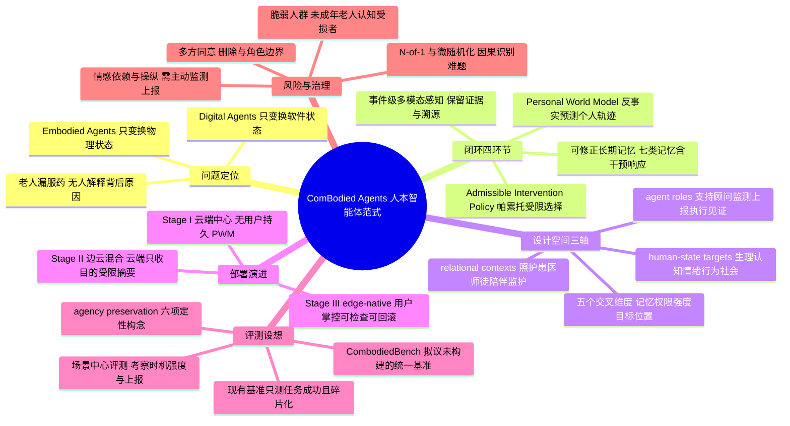

## 一、论文是干什么的？

想象一位独居老人今天忘了吃降压药。现在市面上的 AI 大致能做两件事：一个软件智能体（Digital Agent）会再推一条提醒，一个具身智能体（Embodied Agent）——比如家用机器人——会把药盒端到老人面前。这两件事都完成了「任务」，但两者都没有回答一个更要紧的问题：他到底是**忘了**，还是**记混了**，还是**吃了之后头晕不舒服所以不想吃**，还是**他清醒地决定不吃**？不同的原因，对应的合理支持完全不同——前者需要提醒，第二种需要重新讲解，第三种需要联系医生调整剂量，第四种可能需要尊重他的拒绝。这个开篇例子，就是这篇论文全部论证的起点。

作者由此指出智能体 AI 存在一个**结构性缺口**：数字智能体围绕「软件状态的变化」组织，具身智能体围绕「物理状态的变化」组织，而**没有任何一支把「一个具体的人随时间演化的状态与能动性」当作建模、干预和评估的首要对象**。他们提出的新范式叫 **ComBodied Agents**（论文正文中也写作 Combodied Agents，可理解为「陪伴式／共身智能体」）：它持续感知、建模、预测并支持个体的人类状态轨迹（human-state trajectory），而软件工具、传感器、可穿戴设备、机器人乃至人类服务都只是**行动通道**（action channels），不是最终目标。用一个类比说：数字智能体像一个只会替你把表格填完的助理，具身智能体像一个会替你跑腿的管家，而 ComBodied Agent 更像一位长期跟着你的**家庭医生兼教练**——他关心的不是这次事情办没办成，而是你这半年身体、认知、情绪、习惯和人际关系整体上是变好了还是变差了，以及你自己做决定的能力有没有被他削弱。这是一篇 38 页、6 幅图、10 张表的立场与框架论文（position / framework paper），由 Université de Montréal 与 Mila 的 Bang Liu 组牵头，联合新加坡 A*STAR、清华、剑桥、牛津等共 16 家机构完成。

## 二、核心方法与创新

### 2.1 三种「行动基底」的分野

论文首先把智能体按**行动基底**（action substrate，即模型与评测围绕哪类目标状态组织）分成三支，这构成全文的坐标系：

| 维度 | Digital Agents | Embodied Agents | ComBodied Agents |
| --- | --- | --- | --- |
| 主要目标 | 变换数字状态（界面、代码、API、工作流） | 变换物理／仿真物理状态（导航、操作、机器人控制） | 建模并支持人的演化状态与能动性 |
| 组织性问题 | 能完成什么外部任务？ | 能控制什么物理环境？ | 这个人的状态、能力与能动性如何随时间变化？ |
| 评估目标 | 正确性、效率、任务完成度 | 安全性、控制可靠性、物理成功率 | 人的轨迹收益、自主性保全、长期能力 |
| 代表系统 | 代码编辑器、数据分析智能体、浏览器自动化 | 机械臂、自动驾驶、家用机器人 | 个人健康伴侣、自适应学习系统、记忆助手 |

作者进一步给出 ComBodied Agents 的五条**定义性属性**：以人为中心的状态建模（人是首要对象）、长期性（longitudinality，跨长时程推理）、干预性（提醒、建议、教练、上报）、共同能动（co-agency，人机之间可调整的分工），以及**能动性保全**（agency preservation，维护自主、控制与尊严）。

### 2.2 闭环：感知 → 记忆 → 预测 → 可准入干预 → 反馈

论文最核心的贡献，是把散落在个人助理、健康智能体、AI 陪伴、自适应人机系统里的碎片能力，合并成一个统一的闭环。四个环节如下。

**第一环：事件级多模态感知**（event-based multimodal perception）。论文定义它为「对碎片化个人数据的获取、过滤、对齐与解释，以服务于人类状态理解与长期建模」。关键在于它不追求把原始信号全部留下，而是走一条**证据链**：观测 → 事件 → 推断状态 → 预测轨迹 → 授权干预（observation → event → inferred state → predicted trajectory → authorized intervention）。智能体维护的是一个**带不确定性的隐状态后验**，而非一个笃定的结论：

$$
Z_t \sim q_\phi(\cdot \mid D_{\leq t}, M_t, C_t)
$$

其中 $D_{\leq t}$ 是截至 $t$ 时刻的个人数据，$M_t$ 是记忆，$C_t$ 是当前时空／情境上下文。相关记忆通过检索取出：$R_t = \mathrm{Read}(M_t; Z_t, C_t, G_t)$，$G_t$ 为当前协商的目标。人的状态转移与观测生成写作：

$$
H_{t+1} \sim T_H(\cdot \mid H_t, a_t^{agent,*}, a_t^{user}, \Xi_t), \qquad O_{t+1} \sim \Omega(\cdot \mid H_{t+1}, C_{t+1})
$$

也就是说，下一刻的人类状态由当前状态、**智能体的动作**、**本人的动作**和外生扰动 $\Xi_t$ 共同决定——本人始终是转移方程里的一个显式主体，而不是被作用的环境。论文同时强调每条事件记录都要保留来源、设备、采样方式、置信度与敏感度等**溯源元数据**，原始音视频与生理波形在抽取事件后即删除，只保留目的明确的事件描述。

**第二环：可修正的长期记忆**（longitudinal and correctable memory）。论文把它拆成七类：情景记忆（具体事件与交互）、语义化个人记忆（稳定事实、偏好、价值观、边界）、轨迹记忆（健康、行为、情绪、认知的变化）、目标与承诺记忆、关系记忆（家人、照护者、医生、社交联系）、干预—响应记忆（把每次提醒／建议与其被接受、拒绝、带来的收益或伤害连起来），以及用户控制记忆（限制、更正、删除请求）。更新规则为：

$$
M_{t+1} = \mathrm{Update}(M_t, O_{t+1}, a_t^{agent,*}, Y_{t+1}, F_{t+1})
$$

$Y$ 是结果，$F$ 是反馈。这里最能体现「以人为中心」的一点是：记忆必须能被本人**检查、区分（哪些是我说的、哪些是模型推断的）、更正与删除**，而且更正必须向后传播、改变未来行为。这与只做「事实存储」的普通记忆助手是本质区别。

**第三环：Personal World Model（PWM，个人世界模型）**。论文定义它是「目的受限的、个体特异的事件动力学模型」，输出的是校准过的分布而非点估计：

$$
p_\theta(Z_{t+1:t+\Delta},\, E_{t+1:t+\Delta},\, Y_{t+1:t+\Delta} \mid D_{\leq t}, Z_t, C_t, G_t, s_{t:t+\Delta})
$$

其中 $s$ 是**情景设定**（scenario），涵盖用户的决策、智能体的干预与支持、以及相关的环境或社会变化。PWM 的功能定位是：给定这个人被治理的事件历史与当下时空情境，输出在不同决策与干预下的「状态—事件—结果」轨迹，并根据后续事件与干预—响应记忆不断更新。这是「反事实」的能力——它要能回答「如果我今晚提醒他，和如果我不提醒，一周后的服药依从性分别会怎样」。

论文在这里划了一条重要的界线：PWM **不是** Human Digital Twin（人类数字孪生）。它明确拒绝「把一个人穷尽复刻」的路线，主张**目的受限**（purpose-bounded）、**不确定性感知**（uncertainty-aware）、**用户可更正**（user-correctable）的表征——只建模已经约定的支持情境所需的那部分，而且 PWM 的输出要保留替代解释、矛盾证据和不确定性，而不是给一个自信的单点结论。

**第四环：可准入干预策略**（admissible intervention policy）。这是整个框架的伦理承重墙。智能体不是在所有可能动作里选最优，而是**只能在一个受约束的可准入集合 $A_t^{adm}$ 内**做多目标帕累托选择：

$$
a_t^{agent,*} \in \operatorname*{Pareto\,Argmax}_{a \in A_t^{adm}} \; \mathbb{E}_{p_\theta^a}\big[U(Y_{t+1:t+\Delta}, G_t)\big]
$$

可准入集合强制执行同意、范围、安全、不确定性、可逆性与上报要求，并且**必然包含「不干预」「先澄清」「转介」三个选项**。之所以用帕累托而非单一标量最大化，是因为效用 $U$ 里的收益、能力成长、自主性、人际关系这几项之间存在真实的权衡，作者不愿把它们压成一个可被刷高的分数。动作空间被整理为十类：Inform（认知）、Remind（注意／执行）、Recommend（决策）、Coach（能力／习惯）、Nudge（行为倾向）、Reflect（自我理解）、Coordinate（社会／机构）、Protect（安全／自主）、Escalate（高风险状态）、Execute（受托的外部执行）。

### 2.3 设计空间：三条轴 + 五个交叉维度

论文用三条轴组织整个设计空间。**第一轴是人类状态目标**（human-state targets）：生理健康（慢病管理、服药依从、症状监测）、认知功能（学习、记忆、决策、元认知）、情绪健康（情绪调节、压力管理、韧性）、行为改变（习惯养成、目标追求）、社会与关系（维系联结、冲突处理、家庭协调）、能力发展（技能构建、独立性）、目标追求与意义建构、安全与风险缓解。**第二轴是关系情境**（relational contexts）：照护者与被照护者、患者与医者、学习者与导师、同事或协作者、伴侣式陪伴、监护式看护。**第三轴是智能体角色**（agent roles）：支持者／赋能者、顾问、监测者／哨兵、上报者／中介、执行者、见证者／记录者。

在三条轴之上，还有五个横切维度决定一个具体系统落在哪里：**记忆范围**（只记最近上下文，还是长期模式，还是终身史）、**主动性与权限**（谁决定何时提供什么支持）、**干预强度**（从静默观察到温和推动再到主动保护）、**评估目标**（任务完成、人的收益、自主性保全或其组合）、**部署位置**（云端、混合、端侧）。

### 2.4 从云端 LLM 到端侧原生个人模型

论文用一整节论证「个人模型应当往端上走」。它把**端侧原生个人模型**定义为「一个由用户控制的技术栈，其长期记忆、PWM、偏好、干预策略与安全边界主要保存在用户侧设备上」，理由是本地所有权支撑隐私、连续性、低时延、断网韧性，以及**可检查与可重置**。演进被分成三阶段：

- **阶段一，云端中心**：云上的基础模型负责推理、记忆检索与回复生成，设备只是界面与传感端点；个性化靠提示词、对话历史和画像实现。适合快速原型与低风险场景，缺陷是没有用户拥有的持久 PWM，记忆难以检查与更正。
- **阶段二，边云混合**：端上做隐私敏感的感知、本地上下文跟踪、记忆过滤与安全检查，云上提供外部知识、复杂推理与专门工具；原始信号与私密记忆留在本地，云端只收到**目的受限的摘要**。前提是本地持有敏感个人状态的权威副本，并强制执行披露与权限校验。
- **阶段三，端侧原生**：由用户控制的端侧模型持有记忆、PWM 与干预策略，动用云端成为需要显式说明的例外。高敏感场景必须走到这一步，因为只有这样才谈得上检查、回滚与控制。

作者提醒，这三阶段描述的是「重心所在」而非严格的时间顺序，同一个 ComBodied Agent 完全可以对不同任务处在不同阶段。

## 三、使用了哪些模型和计算资源？

**需要如实说明：这是一篇立场与框架论文（position / framework paper），不包含任何模型训练、微调或推理实验，因此论文中没有报告任何具体的 LLM 型号选择、GPU 型号、显存、训练时长或算力预算。** 它的贡献是定义性、架构性与分类性的，而非实证性的：没有实验结果、没有消融、没有基线对比，也没有用户研究或真实部署数据。

论文在讨论技术底座时**引用**了若干已有模型与系统作为讨论对象，但这些只是文献综述层面的引用，不代表本文运行过它们。被提到并归类的既有工作包括：通用侧的大语言模型与多模态基础模型；健康推理方向的 Med-PaLM、Health-LLM、PHIA；时序临床记录建模的 BEHRT、Med-BERT；记忆与长时评测方向的 MemoryBank、LongMemEval；感知工具链上的 OpenFace（面部动作单元与视线）、GeMAPS/eGeMAPS（声学特征标准）、MERBench（多模态情绪识别）；数据与基准方面的 MIMIC-IV（电子病历）、Ego4D（第一人称视频与情景记忆）、StudentLife（纵向移动感知加自陈）、OPPORTUNITY（多模态可穿戴活动识别）、AWARE（移动感知框架）、Sotopia（社会互动评测），以及 Data Cards、Datasheets for Datasets 等文档规范；互操作标准方面提到 HL7 FHIR、SMART on FHIR 与 OMOP 通用数据模型。

关于算力的唯一实质性论述出现在第 5 节：作者主张把个人模型的核心能力压到用户侧设备上运行，并给出了迁移到端侧的判据——当端侧模型能以可接受的质量完成**重复性的个人任务**、并在**断网时仍能维持关键的安全与控制功能**时，就应当把重心下移。但论文没有给出任何具体的参数量、量化方案、时延数字或功耗测算。

## 四、实验结果

**本文没有实验结果。** 第 6 节「Benchmark & Evaluation」提出的是「应当如何评测」，而不是「我们评测了什么」；其中提出的 **CombodiedBench** 是一个**拟议中**待构建的统一基准，论文中没有该基准的任何数据规模、任务数量或榜单成绩。下面如实整理论文提出的评测要求与指标设想。

**对现有基准的批评**：作者认为现有公开资源在健康、学习、感知、社交等领域**高度碎片化**，且普遍以「任务是否成功」为准绳，缺乏对**能力成长、自主性保全、关系安全**的跨类型统一评测。换言之，一个把用户伺候得越来越无能的系统，在今天的榜单上依然能拿满分。

**场景中心评测**（scenario-centered evaluation）：评测单元应从孤立任务转为**长时程的人类状态支持场景**，横跨健康、学习、生产力、情绪支持、老年照护等域，并且必须在**不确定性、目标冲突、可逆性约束**下考察智能体的行为——特别是干预的**时机、强度校准与上报恰当性**。

**能动性保全指标**（agency-preservation metrics）：论文给出的是一组概念性构念，**并未给出任何数学公式或具体计算方法**：

| 指标构念 | 含义 |
| --- | --- |
| 理解保持 / 认识论能动性 | 用户对决策依据的理解是增强了还是被掏空了 |
| 能力轨迹 | 在长期使用辅助后，技能是保持增长还是发生萎缩 |
| 自主与控制 | 用户是否保有拒绝、更正与收回授权的实质选择权 |
| 校准的依赖 | 用户对建议的信任是否恰当，既不盲从也不无视 |
| 关系与尊严效应 | 干预是加固还是替代了真实的人际关系，是否助长谄媚 |
| 可逆性 | 智能体的动作能否撤销，人能否从被削弱的状态中恢复 |

需要强调的是，这些指标在论文中只有定性描述，唯一与之相关的形式化表达就是式 8 里那个多目标帕累托最大化——效用 $U$ 显式保留收益、能力、自主性、关系之间的取舍，但论文明确没有指定任何单一的合成度量。

## 五、潜在应用与已落地应用

论文本身勾勒了六个代表性场景，都属于**设想中的应用形态**，论文未报告任何一个已经实现或部署的系统：

1. **服药依从与慢病自我管理**：伴侣型智能体跟踪症状与用药，预测依从性风险，在尊重用户对打扰频率的偏好下给出恰当时机的提醒或教练式支持。
2. **教育支持与能力成长**：导师型智能体建模个体学习轨迹，预测概念缺口并提供脚手架，但评估目标是**独立推理能力的增长**，而不是考试分数的提升。
3. **原居安老与安全看护**：系统观察活动与健康模式，识别跌倒或行为变化，并与家人或照护机构协同，同时保全老人的尊严与残余的独立性。
4. **行为健康与习惯改变**：教练型智能体通过反思式反馈、动机修复与环境协调支持行为改变，并**主动避免让用户依赖系统本身**。
5. **职场自适应助理**：生产力伴侣学习个体工作节律与偏好流程，预测认知负荷，建议休息或工具使用，并对自身建议保持透明。
6. **家庭协调与关系连续性**：共享的记忆与日程系统维护家庭义务、家族历史与沟通模式，同时尊重每个成员的隐私与角色边界。

从更广的落地角度看，论文实际上是在为一批**已经存在的产品类别**提供统一叙事与批评框架：它把任务型对话智能体、工具调用智能体、计算机操作智能体、记忆助手、个性化智能体、陪伴智能体、健康智能体、学习智能体逐一列出，指出各自的短板（例如记忆助手「只存事实而不建模轨迹」，个性化智能体「常常在优化参与度而非长期福祉」，陪伴智能体存在情感依赖与关系边界越界风险，学习智能体可能助长过度依赖并削弱独立推理），并说明 ComBodied 框架分别补上了什么。因此，可穿戴设备厂商、数字健康与慢病管理平台、AI 陪伴类应用、自适应教育产品、以及正在把模型往手机与眼镜上搬的端侧 AI 团队，是这套框架最直接的潜在采用者。**关于具体商业产品是否已采用本框架，暂无相关信息。**

在治理层面，论文给出的方向也具有直接的落地含义：目的受限的个人表征（而非全量数字孪生）、用户可检查与可更正的记忆、需要区分「本人陈述」与「模型推断」、do-not-remember 规则与删除请求、多方共享数据时标注焦点用户与各参与方的可见性、按角色（陪伴者／教练／监测者／保护者／上报者）划定边界以防越权，以及对情感过度依赖、操纵风险与社会关系被替代的**主动监测与上报机制**。第 8 节还列出了八类开放挑战：能动性与对齐风险、隐私同意与控制、脆弱与高风险人群（未成年人、老人、认知受损者）、纵向与因果学习（观察数据中的个体干预效应识别、N-of-1 与微随机化试验设计）、能动性对齐的干预分工、可信个人基础设施（端侧安全、记忆同步、用户发起的重置与回滚）、多智能体共存的 ComBodied 生态与冲突消解，以及跨文化与全生命周期的适配差异。

## 六、网络上的讨论与评价

这篇论文在 [Hugging Face Daily Papers](https://huggingface.co/papers/2608.10915) 上获得 186 票，被列为 **#2 Paper of the day**（当日第二名），由用户 `leoli` 于 2026 年 8 月 12 日提交。

在 Hugging Face 的社区讨论区，目前可见的互动很有限，只有两条：

- 论文提交者 `lifuguan`（标注为 Paper submitter）留下了一条极简的推广式评论，内容仅为大写的论文名 **COMBODIED AGENTS**，没有展开论述。
- `librarian-bot`（Hugging Face 的自动化文献推荐机器人）发布了一条自动消息，基于 Semantic Scholar API 列出了它认为相似的论文，包括：*From World Action Models to Embodied Brains: A Roadmap for Open-World Physical Intelligence*、*HoloAgent-0: A Unified Embodied Agent Framework with 3D Spatial Memory*、*ETA: A New Agentic Paradigm for Embodied Tasks*、*When Multi-Robot Systems Meet Agentic AI: Towards Embodied Collective Intelligence*、*A Taxonomy of Cognitive Capability Gaps in Generative and Agentic AI*、*From Passive Mirrors to Active Agents: Holonic Digital Twins for Physical AI over Networks*、*Human Centric Embodied Intelligence for Soft Wearable Robotics*（均为 2026 年）。这份自动推荐列表本身透露出一个信号：算法把它与「具身智能路线图」类论文归为一簇，而论文作者恰恰是要把自己与具身路线区分开——这种归类偏差某种程度上正印证了作者所说的「结构性缺口尚未被普遍认知」。

在 Hugging Face 之外，通过关键词与 arXiv ID 的多轮检索，**未找到 X/Twitter、Reddit、Hacker News、知乎或独立技术博客上针对本文的实质性讨论或评论**。论文于 2026 年 8 月 11 日投稿、8 月 12 日更新 v2，截至本文写作时（2026 年 8 月 16 日）仅公开数日，社区反应尚未展开。检索中出现的中文相关内容多为泛智能体综述（如知乎上关于 AI Agent 与 Agentic AI 分类法的综述译介）与具身智能行业文章，与本文并无直接引用关系。因此，**关于本文在社交媒体与技术社区的深入评价与批评意见，暂无相关信息**，需待后续观察。

值得一提的是，从论文自身的定位看，它未来最可能引发的争议点是清晰的：一是「让 AI 长期建模一个人的生理、认知、情绪与人际状态」本身的隐私与权力问题——论文用端侧原生与可删除记忆来回应，但这套主张在商业激励下能否成立，尚待检验；二是「能动性保全」这组指标目前只有定性描述、没有可计算的形式化定义，如何避免它沦为一句无法证伪的口号，是框架能否从立场文章走向工程实践的关键。

## 七、思维导图

