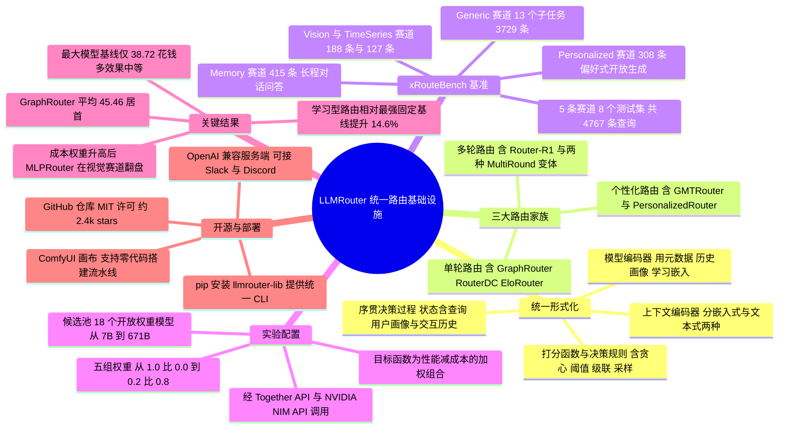

## 一、论文是干什么的？

想象你家小区门口有一排餐馆：有人均三百的私房菜，有二十块管饱的沙县，还有专做川菜、专做日料的小馆子。你今天想吃什么、预算多少、赶不赶时间，决定了你该进哪一家。天天吃私房菜当然「不会错」，但钱包受不了；天天吃沙县又满足不了偶尔的硬需求。真正聪明的做法，是门口站一个熟悉你口味的领位员，看一眼你的需求就把你带到最合适的那家店。

大模型的世界现在就是这样一条美食街。GPT 级别的巨型模型贵而强，7B 的小模型便宜而快，还有专攻代码、专攻数学的「偏科生」。这篇论文的出发点非常直白：**没有任何一个大模型能在所有问题和所有预算下都是最优解**，所以需要「路由器」（router）来给每个请求挑模型。问题在于，学术界这几年冒出了几十种路由方法，各写各的代码、各测各的数据集，彼此之间根本没法公平比较，也没法组合复用。LLMRouter 这篇工作要做的就是三件事：第一，用一套统一的数学语言把所有路由方法「翻译」成同一种形式；第二，造一个覆盖面足够广的基准 xRouteBench，让大家在同一把尺子下比；第三，把 16 种以上的代表性路由器重新实现进一个模块化的开源库，训练、评测、部署一条龙。

换句话说，这不是一篇「我又发明了一个更好的路由算法」的论文，而是一篇「我给这个方向修了条路、建了个度量衡」的基础设施论文。论文于 2026 年 8 月 7 日提交至 arXiv（cs.CL），在 HuggingFace Papers 上获得 85 票，配套代码开源在 [github.com/ulab-uiuc/LLMRouter](https://github.com/ulab-uiuc/LLMRouter)（MIT 许可，约 2.4k stars、235 forks），基准数据集发布在 [HuggingFace 的 ulab-ai/xRouteBench](https://huggingface.co/datasets/ulab-ai/xRouteBench)。

## 二、核心方法与创新

### 2.1 把路由看成一个「序贯决策过程」

论文最核心的抽象是：**路由不是一次分类，而是一个序贯决策过程**（sequential decision process）。在第 $t$ 步，路由器观察到一个「状态」$s_t = (q, u, h_t)$，其中 $q$ 是当前查询，$u$ 是用户画像/偏好，$h_t$ 是到目前为止的交互历史；然后从候选模型集合 $\mathcal{M}$ 里选一个模型去执行，或者决定「到此为止，输出答案」。

这个视角的好处是它一口气把三类看起来很不一样的路由都装了进去：只看 $q$ 的单轮路由、要看 $h_t$ 的多轮路由、要看 $u$ 的个性化路由，其实只是状态里包含哪些分量的差别。

### 2.2 五个可插拔部件

作者进一步把任何一个路由器拆成五个零件。这就像把所有的「领位员」都拆成「怎么听懂客人需求」「怎么记住每家店的特点」「怎么打分」「怎么拍板」「怎么从反馈里学」这五步。

**一、上下文编码器**（context encoder，记作 $E_q$）：负责把状态 $s_t$ 变成机器能算的表示。论文归纳出两种形态——**嵌入式**，即用 sentence embedding 把查询变成向量，供 kNN 检索或判别式分类器使用；**文本式**，即干脆把状态原封不动写进提示词，让一个 LLM 自己去读。

**二、模型编码器**（model encoder，记作 $E_m$）：负责给每个候选模型 $m \in \mathcal{M}$ 建立「档案」。论文列了四类信息来源：静态元数据（参数量、定价、模型说明）、历史画像（过往表现、Elo 评分）、可学习嵌入（与上下文编码器联合训练）、以及口头描述（把模型名字直接塞进提示词）。

**三、打分函数**（scoring function，记作 $g$）：衡量「当前状态」和「某个候选模型」有多匹配，即计算 $g(E_q(s_t), E_m(m))$。具体实现可以是嵌入相似度、双线性积、分类头，也可以是在「查询-模型」二部图上做消息传递（GraphRouter 走的就是这条路）。

**四、决策规则**（decision rule，记作 $d$）：把分数变成动作。最朴素的是贪心 $\arg\max$；也可以是成本感知的阈值判断（分数不够高就换便宜模型）；可以是级联式的「接受或升级」（小模型先答，答不好再交给大模型）；还可以是带探索的采样。

**五、学习信号**（learning signal，记作 $\mathcal{L}$）：决定这些零件怎么被训练。论文分了四档——非参数化（完全不训练，如 kNN）、监督式（用逐点的对错标签）、偏好式（用成对比较）、以及强化学习（用整条轨迹的回报，Router-R1 属于此类）。

统一目标函数是一个质量与成本的加权组合，形式为 $\alpha \cdot \mathrm{perf} - \beta \cdot \mathrm{cost}$。其中 $\alpha$ 是性能权重，$\beta$ 是成本惩罚权重。论文测了五组权重配置，从纯质量导向的 $(\alpha, \beta) = (1.0, 0.0)$ 一直到重成本的 $(0.2, 0.8)$。这个设计是整篇论文实验部分最有价值的地方之一——它逼着每个路由器在不同「预算气候」下亮相，而不是只在一个舒适区里刷分。

### 2.3 三大路由家族

- **单轮路由**（single-turn）：只观察查询，做一次分发。代表方法包括 kNNRouter、SVMRouter、MLPRouter、EloRouter、MFRouter（矩阵分解）、RouterDC、Hybrid LLM、AutoMix、GraphRouter、CausalLM，外加两个规则基线（永远选最小模型 / 永远选最大模型）。
- **多轮路由**（multi-turn）：观察查询与交互历史，允许在终止前多次分发。代表方法有 Router-R1、kNN-MultiRound、LLM-MultiRound。
- **个性化路由**（personalized）：额外观察用户上下文，从跨用户的偏好反馈中学习。代表方法有 GMTRouter 与 PersonalizedRouter。

论文强调，这些方法过去分散在互不兼容的技术栈里，LLMRouter 把它们重写进同一套接口，才第一次让「公平比较」成为可能。

### 2.4 xRouteBench：一把覆盖五条赛道的尺子

光有框架不够，还得有数据。作者做了一条自动化流水线：从既有公开基准里抽题 → 把每道题分发给 18 个候选模型全部跑一遍 → 用任务专用指标给每个回答打分 → 同时记录 token 级成本。这样就得到了「每题 × 每模型」的完整质量-成本矩阵，路由器的监督信号可以直接从中构造出来。

评分指标随任务而变，包括精确匹配与近似匹配、多选题准确率、token 级 F1、数学答案验证、以及基于执行的代码评测。

最终的 xRouteBench 包含 8 个测试集、5 条赛道、共 4767 条查询：

| 赛道 | 数据集 | 规模 | 任务类型 |
|---|---|---|---|
| Generic LLM Tasks | 13 个子任务（MBPP、MATH、GSM8K、MMLU-Pro、OpenBookQA、ARC、MMLU、CommonsenseQA、BoolQ、SQuAD、HellaSwag、HumanEval、AIME） | 3729 | 文本问答、代码、数学 |
| Memory | LoCoMo、LongMemEval | 415 | 长程对话式问答 |
| Vision | Geometry3K、MathVista、Charades-Ego | 188 | 图像与视频数学推理 |
| TimeSeries | TSRBench | 127 | 时间序列模式推理 |
| Personalized | Chatbot Arena、MT-Bench | 308 | 基于偏好的开放式生成 |

值得注意的是，把视觉、视频、时间序列、长期记忆这些「非纯文本」场景纳入路由评测，是这个基准相对以往工作的主要扩展面——过去的路由研究基本只在通用文本问答上打转。

## 三、使用了哪些模型和计算资源？

**候选模型池**：18 个开放权重模型，参数量跨度从 7B 到 671B，具体包括：

- Gemma-2-9B
- Mistral-7B、Mistral-Small-24B、Mixtral-8x7B、Mixtral-8x22B
- Qwen2.5-7B、Qwen3-Next-80B、Qwen3-Coder
- Llama-3-8B、Llama-3-70B、Llama-3.3-70B、Llama-4-Maverick
- GPT-OSS-20B、GPT-OSS-120B
- RNJ-1-15B
- DeepSeek-V3.1、Cogito-v2（后两者均为 671B 级）

这些模型通过 **Together API** 与 **NVIDIA NIM API** 调用，也就是说论文并没有自建推理集群跑候选池，而是走商用 API，因而能拿到真实的 token 级计价。

**训练路由器所用的 GPU 型号与训练耗时**：暂无相关信息。论文正文与可获取的附录段落中没有给出显卡型号、训练时长、学习率、epoch 数或 batch size 等训练配置。

**评测的 API 总花费**：暂无相关信息。论文附录 Table 9 列出了 18 个候选模型的每 token 单价，但可获取的页面内容中未显示具体价格数值，也没有给出 4767 条查询乘以 18 个模型这一整轮评测的总开销金额。

## 四、实验结果

一句大白话总结：**学会挑模型，比死磕最贵的模型划算得多，而且「谁是最好的路由器」这个问题的答案会随着你的预算而改变。**

先看最反直觉的一条：永远调用最大的模型，花钱最多，效果却只能算中等，还被学习型路由全面压制。原因很朴素——很多题目大模型反而做错了，却被更小更便宜的模型做对了。论文原话是：「always calling the largest model incurs the highest cost yet delivers only mediocre performance and is dominated by the learned routes」。

### 4.1 纯质量导向下的主结果（$\alpha=1.0$，$\beta=0.0$）

| 方法 | 跨赛道平均分 |
|---|---|
| GraphRouter | 45.46 |
| SVMRouter | 45.10 |
| EloRouter | 44.68 |
| 最大模型固定基线（Largest-LLM） | 38.72 |
| 最小模型固定基线（Smallest-LLM） | 37.94 |

摘要中「学习型路由相对最强固定模型基线取得 14.6% 的相对提升」正是基于这一类对比口径：分子是学习型路由的成绩，分母是表现最好的那个固定模型基线，比较的是加权目标下的表现而非绝对准确率的简单差值。

分赛道的单点最好成绩：

| 赛道 / 数据集 | 最优路由器 | 分数 |
|---|---|---|
| Generic LLM Tasks | RouterDC | 80.56 |
| Generic LLM Tasks（次优） | GraphRouter | 80.54 |
| Memory / LoCoMo | SVMRouter | 27.64 |
| Memory / LongMemEval | SVMRouter | 42.62 |
| Vision / Geometry3K | EloRouter | 45.90 |
| Vision / MathVista | EloRouter | 50.00 |
| TimeSeries | EloRouter | 63.78 |

### 4.2 个性化赛道

| 方法 | 准确率 |
|---|---|
| GMTRouter | 68.78% |
| PersonalizedRouter | 67.86% |
| EloRouter | 66.40% |

专门为用户偏好设计的路由器确实赢了通用路由器，说明「同一个问题，不同用户想要的答案风格不同」这件事是可以被学出来的。不过领先幅度不到 2.4 个百分点，谈不上碾压。

### 4.3 成本权重一变，排名就翻盘

这是论文最有工程价值的发现。当成本惩罚权重 $\beta$ 从 0.0 提高到 0.8：

- $\beta = 0$（只看质量）时，RouterDC 在 Generic LLM Tasks 上领跑，EloRouter 拿下 Vision 与 TimeSeries。
- $\beta \geq 0.4$（成本敏感）时，在 $\beta=0$ 时排名接近垫底的 MLPRouter，反而成为 Vision 赛道上的最优选择。

论文的结论是：「Router rankings reverse in favor of lightweight designs under tighter cost constraints」——预算越紧，轻量设计越吃香，排名会直接反转。**没有任何一个路由器能在所有性能-成本权衡点上通吃**。这意味着任何只报告单一预算设定下成绩的路由论文，其结论都可能是脆弱的。

## 五、潜在应用与已落地应用

**已落地的部分**（均来自项目自身的开源生态）：

- **开源库本身**：`pip install llmrouter-lib` 即可安装，提供统一 CLI，覆盖训练、推理与交互式对话；同时提供插件机制，允许第三方接入自定义路由器。仓库当前约 2.4k stars、235 forks，MIT 许可。
- **OpenAI 兼容服务端**：论文提到可以把任意一个路由器暴露为 OpenAI 兼容的 API 服务，并与 OpenClaw 集成，从而部署到 Slack、Discord 等消息平台，支持流式输出与多模态输入。这意味着已有的、任何一个使用 OpenAI SDK 的应用，理论上只要换一个 base URL 就能接上路由。
- **ComfyUI 可视化画布**：提供拖拽式节点，用于零代码搭建数据生成与路由训练流水线，并实时监控表现。
- **路由记忆**：框架内置的 routing memory 会跨轮次保存交互历史，这是多轮路由器能工作的前提。
- **数据生成流水线**：内置处理 11 个基准数据集（Natural QA、Trivia QA、MMLU、GPQA、MBPP、HumanEval、GSM8K、CommonsenseQA、MATH、OpenBookQA、ARC-Challenge）的自动化 API 调用与评测能力，使用者可以为自己的模型池重新生成一份「质量-成本矩阵」。

**潜在应用方向**：

- **企业级 LLM 网关的成本治理**。论文的 $\alpha$ 与 $\beta$ 权重机制，天然对应企业里「这个部门这个季度的推理预算」这类现实约束；成本权重一变排名就翻盘的发现，提示企业不该固化选择某一个路由算法，而应该按预算档位分别选型。
- **多模态与长上下文服务的分流**。Vision、TimeSeries、Memory 三条赛道的引入，说明路由不只适用于纯文本聊天，也适用于图像理解、视频问答、长程记忆检索这类调用单价差异更悬殊的场景。
- **个性化助手**。个性化赛道的结果支持这样一种产品形态：助手在使用中逐渐学会「这位用户偏好哪种模型的输出风格」，而不是靠人工设置。
- **路由研究的公共评测底座**。作者明确邀请社区把自己的路由器接进来做基准对比，这一点如果成立，xRouteBench 有机会成为该子领域的默认评测集。

## 六、网络上的讨论与评价

这篇论文所属的 LLMRouter 项目，在社区里的可见度主要来自开源仓库而非论文本身。

- **HuggingFace Papers**：该论文页面显示 85 票。页面上的具体社区评论内容暂无相关信息（多次抓取均未能取回讨论区文本）。
- **GitHub**：`ulab-uiuc/LLMRouter` 仓库约 2.4k stars、235 forks，MIT 许可。检索结果显示该项目在 2026 年 1 月突破 1000 stars，2026 年 2 月发布了 ComfyUI 可视化界面与 OpenClaw Router 服务端。
- **Threads**：账号 [@sung.kim.mw](https://www.threads.com/@sung.kim.mw/post/DS42OcJkdO1/u-lab-at-uiuc-released-llm-router-an-open-source-library-for-llm-routing/) 于 2025 年 12 月 30 日发帖介绍该库，强调其「支持 16 种路由模型，包括 KNN、SVM、MLP、矩阵分解、Elo 评分、基于图的路由器、基于 BERT 的路由器、混合概率路由器」。
- **X/Twitter、Reddit、Hacker News、知乎**：多轮检索未发现聚焦于本论文或该库的专门讨论帖，暂无相关信息。

一个可以观察到的生态背景是：同一课题组此前的多项工作（ICLR 2025 的 GraphRouter、NeurIPS 2025 的 Router-R1、TMLR 2025 的 PersonalizedRouter）都被收编进了这个统一框架，因此 LLMRouter 在某种程度上也是该组多年路由研究的整合与工程化产物。同期另有一篇独立工作 [LLMRouterBench（arXiv:2601.07206）](https://arxiv.org/abs/2601.07206) 也在做「大规模基准 + 统一框架」，说明这个方向的标准化需求在 2026 年确实是一个共识性痛点，而非单一团队的自说自话。

## 七、思维导图

