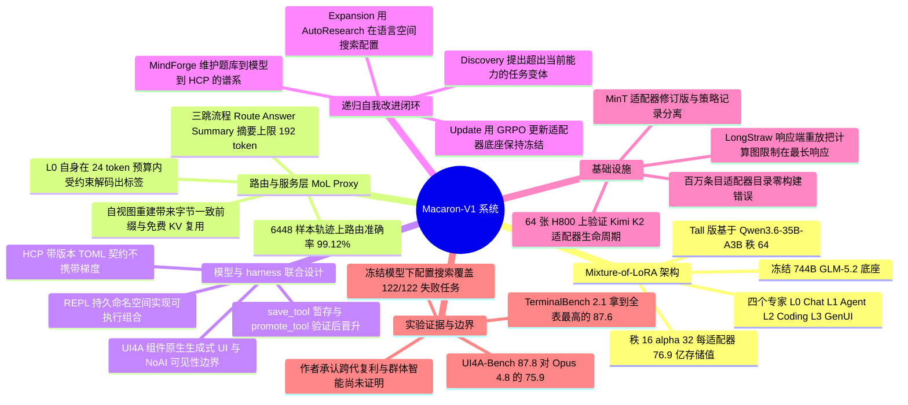

## 一、论文是干什么的？

今天的大模型有一个很别扭的地方：它在训练阶段几乎什么都能学，可一旦发布上线，它就被「冻」在那一刻了。你跟它相处半年，它还是第一天的样子；厂商想让它学会一件新事，往往得把整个模型重新训一遍。这就像请了一位记忆力停在入职当天的私人助理——你每天教他你家楼下哪家餐厅不靠谱，他明天还是会推荐那一家。

Macaron-V1 是 Mind Lab 交出的一份答卷，它想让模型「上线之后还能继续长本事」。做法可以用一个厨房来打比方：厨房本身（灶台、锅具、水电）是一个 7440 亿参数的冻结底座模型 GLM-5.2，谁也不许改动；真正干活的是四位「专职厨师」——每位厨师就是一个小小的 LoRA 适配器，分别负责聊天（L0）、智能体长任务（L1）、写代码（L2）、生成式界面（L3）。每来一个用户请求，由聊天厨师 L0 先看一眼菜单，判断这道菜该谁做，然后把请求交给对应的专家。想教会系统一门新菜系，不需要重砌厨房，只要再招一位厨师（再训练并注册一个 LoRA）就行。这套架构就叫 **Mixture-of-LoRA**（MoL，LoRA 混合体）。

论文本身是一份 49 页的技术报告，覆盖了三层：架构层的 MoL 与路由服务、算法层的「模型与运行环境（harness）联合设计」加递归自我改进（RSI）闭环、以及基础设施层的 MinT（模型状态谱系管理）、LongStraw（超长上下文强化学习执行栈）和 MindForge（自我改进生命周期编排）。旗舰型号 Macaron-V1-Venti 对外标称 748B，另有一个基于 Qwen3.6-35B-A3B 的 50B 小号 Macaron-V1-Tall 供本地部署。作者也非常克制地强调：这份报告验证的是「当前这一代系统跑得通」，而持续学习能否跨代复利、群体智能会不会涌现，仍然是开放问题。

## 二、核心方法与创新

### 2.1 Mixture-of-LoRA：把「专精」变成显式可观测的动作

MoL 的设计原则只有一句话：技能与思维模式相近的任务合并进同一个 LoRA，技能差异巨大的任务拆到不同 LoRA。作者的动机是，聊天、工具调用、写代码、画界面这四种活儿的「思考形状」完全不同，硬塞进一次联合后训练容易互相干扰。（论文诚实地注明：本次发布没有做预算对齐的单 LoRA 对照实验，所以这只是设计动机，不是实证结论。）

由此得到两个关键性质：

- **底座冻结**。梯度只进适配器，底座权重不会被后来的专精训练覆写。
- **适配器可移植**。因为底座共享，A 团队训练的专家可以和 B 团队的专家跑在同一个运行时上。

具体规格上，Venti 的四个适配器用 LoRA 秩 $r=16$、$\alpha=32$，作用在注意力与 MLP 的 `q_a_proj`、`q_b_proj`、`kv_a_proj_with_mqa`、`kv_b_proj`、`o_proj`、`gate_proj`、`up_proj`、`down_proj` 上，每个适配器的张量头里存了 7,688,042,496 个数值（BF16）。Tall 用秩 $r=64$、$\alpha=128$，每个适配器 3,775,651,840 个值（L2 用 F32 存），加上 35B 名义底座约合 50.1B。作者特意声明：748B 是发布标签，不等于实际驻留张量计数。

### 2.2 路由不是外挂分类器，而是 L0 自己的判断

多数 MoE 系统里，路由是隐藏在网络内部的门控。MoL 反过来，把「选哪个专家」提升为每轮对话一个**显式、可观测、可记账**的动作，由 MoL Proxy 执行。一次普通用户消息走三跳：

1. **Route（路由）**：L0 在 24 token 的解码预算内，用受约束解码语法（输出只能是 L0 到 L3 四个合法标签之一）判断该交给谁。
2. **Answer（作答）**：被选中的专家从自己的会话视图作答。
3. **Summary（摘要）**：专家产出一段不超过 192 token 的摘要，服务端保存、不返回给客户端，作为其他专家后续可继承的共享上下文。

这里最巧的设计叫**自视图**（own-view）：每个专家看到的消息列表由 Proxy 从一条只追加的时间线里确定性地重建——自己的历史轮次逐字保留（含完整推理、工具调用与工具结果），别人的历史轮次统统折叠成那 192 token 的摘要。好处是双重的：既不泄露其他专家的私有状态，又因为重建结果字节级一致，引擎原生的前缀缓存能天然命中，KV 复用变成「免费的副产品」，不需要改动 vLLM 或 SGLang。

另外两个工程细节值得一提：**工具结果粘性**——当作答阶段以工具调用结尾时，下一轮工具结果被锁定在同一个专家上，跳过路由与摘要；**事务性回滚**——Proxy 在每轮前给会话状态打检查点，引擎故障或客户端断连时恢复，避免半截轮次污染历史。

### 2.3 模型与运行环境联合设计：harness 才是真正的训练对象

论文有一个相当锋利的观点：大模型只会吐字，把字变成动作的是 **harness**（运行环境/脚手架）。用户能看到的一切——有哪些工具、界面怎么渲染、工具结果怎么回喂——都住在这一层。所以 Macaron-V1 把 harness 当成一等训练目标，反复强调「可训练的对象是模型与 harness 这一对，而不是协议本身」。

三个组件撑起这一层：

- **UI4A**：组件原生的生成式 UI harness。历史上生成式 UI 要么是 HTML 原生（表达力满分但继承了前端开发的全部坑），要么是 schema 原生（可验证但被组件目录卡死上限）。UI4A 让模型写普通前端代码（可 import Radix、shadcn、Recharts、KaTeX、lucide-react 等），但跑在运行时强制的边界内。它的心智模型是「import + component + state + Action」，其中每个用户手势都是含 Origin、State、Execution、Visibility 四个字段的结构化对象，Visibility 里还有一个 NoAI 边界用来遮蔽模型不该看到的字段。渲染框架无关，React、Vue、Svelte、SolidJS 共用同一份输出。作者从上一代 schema 方案 Macaron-A2UI 学到的最重要一课是：教模型**何时**该渲染界面，比教它**怎么**渲染更重要。
- **REPL 智能体 harness**：L1 专家背后的动作面。它是一个带持久 Python 命名空间的读取-求值-输出循环。核心机制叫**可执行组合**——中间值以变量形式留在运行时里，一串有依赖关系的操作在一轮里就能算完，模型不必把每个中间结果再用文字复述一遍。第二个机制叫**已验证复用**：`save_tool` 把模型自己写出的辅助函数暂存进候选池，`promote_tool` 才让它对后续查询可见，而晋升前必须通过一次针对留出参考答案的私有验证；晋升后的函数会同时出现在该用户的后续会话与 MindForge 的训练 rollout 里，所以「先验证后晋升」这个顺序是承重的，事后被证明有问题的会被记录并降级，而不是悄悄留着。
- **HCP（Harness Context Protocol）**：一份带版本的 TOML 契约，把原本散落在命令行参数、环境变量、本地文件和运行时默认值里的配置，收拢成一个可移植、可审计的产物。它标准化五类内容：运行时与模型选择、动作面（工具白名单、MCP 服务器、扩展、钩子）、上下文资源（系统提示、AGENTS.md 风格文件、技能、模板）、会话与工作区状态、环境契约（含不内嵌凭据的密钥引用）。论文特别澄清：HCP 本身不携带梯度，没有优化器会往它里面写；模型能做的是**改写它所描述的 harness**，也就是在语言空间里做自迭代。

### 2.4 递归自我改进：三阶段闭环

策略被形式化为在冻结稀疏底座上的智能体强化学习。记 $\theta$ 为冻结底座参数，$\phi$ 为可训练 LoRA 参数，$c$ 为带版本的 harness 配置，则策略写作

$$\pi_{\phi}(a_t \mid o_{\leq t};\, \theta,\, c)$$

其中 $o_{\leq t}$ 是 harness 暴露给模型的对话与观测，$a_t$ 可以是一条消息、一次澄清、一次离散工具调用，或一段交给 REPL 求值的表达式。一个 episode 记为

$$\tau = (o_0, a_0, \ldots, o_T, a_T, y)$$

$y$ 里装的是任务级结果与评测器附加的过程级判断。这个分解把两条容易混淆的更新路径分开了：**模型优化**改 $\phi$ 而 $\theta$ 不动，**配置搜索**换一个新的 $c$ 而不把 HCP 当作可学参数。训练后端用 GRPO 从筛选后的轨迹更新适配器。

MindForge 是这个闭环的控制面，维护的谱系是：

$$(\mathrm{problem\ bank},\ \mathrm{model},\ \mathrm{HCP}) \longrightarrow \mathrm{evaluated\ trajectories} \longrightarrow (\mathrm{dataset},\ \mathrm{next\ model},\ \mathrm{next\ HCP})$$

这条谱系才是一代 RSI 的最小单位——只有 checkpoint 而没有题库版本、选中数据和运行配置，实验记录就是残缺的。三个阶段分别是：

- **Discovery（发现）**：当前模型从带版本的种子题库出发，通过解除约束、注入隐藏偏好、串联子目标、埋入矛盾等方式，主动提出超出自身能力的更难任务变体。每个提案必须自带可验证答案或评测细则，且只有同时满足「质量（任务与评测定义良好）」和「学习价值（当前模型尚不能稳定解决）」两条才被保留。
- **Expansion（扩展）**：在固定的模型与 HCP 组合下执行这些任务，评测器同时给任务结果和过程行为打分，审计负责把失败归因到模型、任务还是 harness 配置。对提示、技能、工具暴露、钩子等 HCP 承载资源的候选改动，通过重跑受影响的切片来验证。接受与否**看观测到的行为，不看提示词作者的直觉**；自动评测通过是准入门，只有触及工具暴露或安全边界的改动才需要人工复核。这一支被称为 AutoResearch，即语言空间里的搜索。
- **Update（更新）**：轨迹筛选剔除无效运行、去重、保留既有效又有信息量的样本，交给训练后端更新 LoRA 专家，底座保持冻结；同时把接受的 HCP 注册为下一代的运行配置。

### 2.5 一个很有说服力的小实验：本事是「没有」还是「没被激发出来」？

作者挑了 122 个模拟任务（来自 TerminalBench 2.1 的 29 个源家族），挑选标准就是冻结的 GLM-5.2-FP8 底座在官方奖励下**每一个都不通过**。然后全程不做任何一次优化器步骤，只改 HCP 承载的资源、技能、工具暴露和钩子。结果是：69 个作业、450 次任务尝试（每任务平均 3.69 次）之后，累计独立覆盖达到 122/122——每个任务都至少在某一种配置下通过过一次。

这个结果的解读非常关键：**在基线配置下失败，并不等于这个行为不存在于冻结模型里**。很多时候不是模型「不会」，而是运行环境没把它「问出来」。作者同时给出了严谨的边界：因为搜索是自适应的（每个作业专挑还没覆盖的任务打），122/122 是自适应配置选择下的覆盖天花板，不是任何单一配置泛化能力的留出估计。

## 三、使用了哪些模型和计算资源？

**基础模型**

| 型号 | 底座 | 适配器 | 对外标签 |
|---|---|---|---|
| Macaron-V1-Venti | 冻结 GLM-5.2，744B | 4 个，秩 16，$\alpha=32$，每个 7,688,042,496 个存储值 | 748B |
| Macaron-V1-Tall | Qwen3.6-35B-A3B | 4 个，秩 64，$\alpha=128$，每个 3,775,651,840 个存储值 | 50B（约 50.1B） |

另有单独合并的 Macaron-V1-Coding-Venti 检查点，论文明确将其排除在第六节所有表格与结论之外。评测中的对比模型为 Opus 4.8、GPT-5.5、Gemini 3.1 Pro、GLM-5.2、Qwen 3.7 Max、Minimax M3 共六个。ChatBench 使用私有 GLM-5.2 作为评判模型，VitaBench 使用复现的 GLM-5.1 评判器。

**适配器训练超参数**（附录 B.6，以 L2 编码专家的配置为基准）

- 优化器 AdamW，学习率 $5\times10^{-6}$，batch size 4，4 个 epoch，线性预热加余弦调度，预热比例 0.1
- L0（Chat）与 L2 相同；L1（Agent）除 epoch 数为 1 外与 L2 相同；L3（GenUI）除 batch size 为 2、epoch 数为 1 外与 L2 相同
- 强化学习算法为 GRPO

**GPU 型号与数量**（务必注意：论文明确说明，这些数字来自配套的系统报告，而**不是**与 Macaron-V1 匹配的训练运行）

- MinT 配套实验：在一个 1.04T 总参数、32.6B 激活参数的 Kimi K2 底座上，用 **64 张 H800** 跑倒计时任务的 LoRA 强化学习。论文强调这只证明适配器生命周期能在该模型与负载上执行，既不代表 Macaron-V1 是在 Kimi K2 上训练的，也不代表该运行可从本文复现。
- LongStraw 执行凭证：Qwen3.6-27B 路径在 **8 张 H20**（CP8）上完成 2,088,960 prompt 加 8,192 response 共 2,097,152 个位置的精确响应端重放（$G=2$ 与 $G=8$；$G$ 从 2 增到 8 只多占 0.208 GB 峰值分配）；同样 8 张 H20 上完成 4,448,256 加 8,192 共 4,456,448 个位置的常驻前缀复用检查（8 次优化器步、64 次成员重放共用一次捕获的前缀）。GLM-5.2 路径在 **32 张 H20**（rollout TP8/PP4，训练 CP32/EP32）上完成一次 2,097,152 token prompt、每成员生成 5 token（4 个计分）、$G=2$ 的端到端在线事务。
- 部署侧：H20 可支撑 16 路并发 56K token 请求、8 路 180K token 请求或 4 路 230K token 请求；B300 上 DCP2、DCP4、DCP8 开启 EAGLE 后分别提供约 2.34M、4.67M、9.34M 逻辑 KV token。8 张 B300 上，CP8 LayerSplit 把 900K token 冷启动 needle 测试的 TTFT 从 107.1 秒降到 49.2 秒；DCP8 加 EAGLE 在并发 1 时达到 8.6 ms 平均 TPOT 与 110 tokens/s 输出吞吐，并发 16 时为 18.0 ms 与 757 tokens/s。

**LongStraw 的核心思路**：长上下文下常规全序列自动求导是内存瓶颈。设共享 prompt 长度为 $P$，GRPO 组内有 $G$ 条响应、长度分别为 $R_i$，LongStraw 改为不带自动求导地捕获架构相关的 prompt 状态，再逐条重放响应，其活跃内存边界约为

$$M_{\mathrm{live}} \approx M_{\mathrm{weights}} + M_{\mathrm{prefix}}(P) + M_{\mathrm{grad}} + \max_i M_{\mathrm{graph}}(R_i) + M_{\mathrm{score}}\!\left(\sum_i R_i\right)$$

也就是计算图规模由**最长的那一条响应**决定，而不是由整组的 prompt 加 response 共同决定。作者提醒：这只是限制了图的生命周期，并没有消除上下文相关的内存与计算。

**训练总时长、训练语料规模、API 成本、每个完整计算单位的耗时**：暂无相关信息。论文在局限性一节主动承认，本报告未提供完整的逐专家训练规格。

**已披露的耗时类数据**：三跳延迟见下表（48 条多轮请求，温度 0）。

| 跳 | Venti 平均 | 占比 | Tall 平均 | 占比 |
|---|---|---|---|---|
| Route（L0 受约束解码，24 token） | 0.54 s | 12% | 0.20 s | 11% |
| Answer（专家生成） | 3.17 s | 68% | 1.24 s | 70% |
| Summary（192 token 上限） | 0.97 s | 20% | 0.32 s | 19% |
| 合计 | 4.68 s | 100% | 1.76 s | 100% |

另外，MinT 配套实验测得「只交接适配器」相比「materialize 并加载完整合并检查点」，把交接步骤的实测耗时缩短了 18.3 倍（Qwen3-4B，秩 32）和 2.85 倍（Qwen3-30B，秩 16）——这是路径特定的延迟比值，不是通用的训练提速或推理吞吐提升。

## 四、实验结果

### 4.1 路由到底准不准，贵不贵？

路由在一条 6,448 样本的轨迹上测（样本来自 LoRA 训练数据，**不是独立留出集**，所以作者把它定性为实现层面的诊断而非泛化估计）：Venti 准确率 6391/6448 = 99.12%，Tall 在同一条轨迹上 6386/6448 = 99.04%，两者都是 100% 规范标签合规、零请求或解析错误。分类别看，L2（Coding）100%，L1（Agent）最低 97.11%，残差错误集中在 L0 与 L1 边界，也就是「普通闲聊」和「个人助理任务」这两个语义上最接近的类别。多跳切换单独测：三段独立对话里的八轮 L1/L2 交替，24/24 轮正确，含 21/21 次会话内领域切换和 18/18 次专家重入。

代价方面，路由跳加摘要跳合计约占三跳总时长的 32%（Venti）和 30%（Tall），这个占比在两种底座规模上都稳定。

路由会不会伤害质量？在 Vita delivery 上做三臂对比（每种子 100 个任务，5 个种子）：

| 模型 | 方案 | 奖励 |
|---|---|---|
| Venti | 直连 L1（不路由） | 0.636 ± 0.026 |
| Venti | 路由，关闭 KV 复用 | 0.650 ± 0.030 |
| Venti | 路由，开启 KV 复用 | 0.632 ± 0.019 |
| Tall | 直连 L1（不路由） | 0.410 ± 0.030 |
| Tall | 路由，关闭 KV 复用 | 0.398 ± 0.035 |
| Tall | 路由，开启 KV 复用 | 0.386 ± 0.054 |

大白话就是：在这个精度下**没看出路由或 KV 复用把质量拉下来**，但样本太小且未配对，也不能反过来声称两者等价。

### 4.2 主结果：十二条基准

下表是 Macaron-V1-Venti 与六个对比模型的逐行分数（0 到 100，越高越好；带星号的是从公开榜单导入的参考值，同一行内不带星号的模型共用同一套任务与评测协议）。

| 基准 | Venti | GLM-5.2 | GPT-5.5 | Opus 4.8 | Gemini 3.1 | Qwen 3.7 | Minimax M3 |
|---|---|---|---|---|---|---|---|
| ChatBench | 58.3 | 54.5 | 55.5 | 52.8 | 52.0 | 52.5 | 49.1 |
| LivingBench | 64.0 | 60.5 | 61.9 | 63.8 | 52.1 | 56.1 | 57.1 |
| VitaBench | 60.0 | 55.8 | 55.8 | 56.5 | 55.2 | 61.2 | 56.8 |
| VitaBench2 | 46.0 | 43.1 | 47.4 | 46.3 | 50.2 | 47.6 | 39.4 |
| $\tau^3$-Bench | 69.3 | 69.1 | 61.1 | 67.7 | 67.1* | 63.0 | 61.2 |
| PinchBench | 94.0 | 88.1 | 89.0* | 91.8* | 82.9* | 93.4* | 86.1 |
| ClawGym | 77.7 | 74.6 | 82.5 | 80.5 | 77.5 | 75.7 | 76.2 |
| SWE-Verified | 85.6 | 80.4 | 82.9* | 88.6* | 80.6* | 80.4* | 80.5* |
| TerminalBench 2.1 | 87.6 | 82.7* | 83.4* | 78.9* | 70.7* | 73.5* | 66.0* |
| DeepSWE | 58.4 | 54.9* | 70.0* | 58.0* | 10.0* | 18.0* | 20.0* |
| SWE Atlas QnA | 49.5 | 48.9* | 45.4* | 57.3* | 13.5* | 22.6 | 37.9 |
| UI4A-Bench | 87.8 | 67.1 | 72.1 | 75.9 | 60.3 | 62.5 | 63.0 |

说人话就是：

- **强项在终端操作和生成式 UI**。TerminalBench 2.1 拿到 87.6 是全表最高；UI4A-Bench 87.8 对 Opus 4.8 的 75.9、GPT-5.5 的 72.1，是差距最大的一项。这一行的可信度也最高——所有模型共用同样的 161 个案例、同样版本的 UI4A 运行时、视口、交互驱动器、评判器与计分策略。拆到分层得分看，Venti 在约束遵循上 94.2 对 Opus 4.8 的 82.2（领先 12.0），视觉质量 90.0 对 GPT-5.5 的 83.4（领先 6.6），交互 95.0 对 Opus 4.8 的 93.4（领先 1.6）。UI4A-Bench 的五个分层权重固定为工程可行性 8%、任务质量 18%、视觉质量 38%、交互 20%、约束遵循 16%。
- **个人智能两项领先但幅度有限**。ChatBench 58.3 比 GPT-5.5 高 2.8 分，LivingBench 64.0 只比 Opus 4.8 高 0.2 分。作者自己就说，ChatBench 用的是私有 GLM-5.2 评判器，与 GLM 同源可能对 GLM 派生的回答有利，而且没有区间估计，那 0.2 分不该被当作已确立的优势。
- **智能体与编码是有输有赢的**。VitaBench 60.0 输给 Qwen 3.7 Max 的 61.2；ClawGym 77.7 输给 GPT-5.5 的 82.5；DeepSWE 58.4 远低于 GPT-5.5 的 70.0；SWE-Verified 85.6 与 SWE Atlas QnA 49.5 都低于 Opus 4.8。编码与终端这几行用的是 Claude Code 的智能体脚手架而非生产 MoL harness，评的是整套发布系统而非 L2 适配器的单独贡献。

### 4.3 小号模型 Tall 对比自己的底座

| 基准 | Macaron-V1-Tall | Qwen3.6 35B-A3B |
|---|---|---|
| ChatBench | 54.9 | 48.0 |
| LivingBench | 48.4 | 47.1 |
| PinchBench | 86.2 | 82.5 |
| ClawGym | 64.0 | 58.6 |
| SWE-Verified | 75.4 | 73.4 |
| TerminalBench 2.1 | 56.2 | 52.5 |
| UI4A-Bench | 59.3 | 33.9 |

七行全胜，差距从 LivingBench 的 1.3 分到 UI4A-Bench 的 25.4 分。但这是端到端系统对比而非参数对齐的组件消融——两边在参数量、适配器、路由乃至 harness 行为上都不同，无法归因到某一个部件。

### 4.4 多模态是否被文本适配器「训坏」了

Tall 的专家全部用纯文本数据训练，作者用五个视觉语言基准检查有没有把多模态能力削掉（no-thinking 模式，全数据集）：

| 基准 | 底座 | Tall MoL | 差值 |
|---|---|---|---|
| OCRBench v1（%） | 88.80 | 89.60 | +0.80 |
| MMBench-EN dev | 86.08 | 86.68 | +0.60 |
| MMMU val（%） | 59.89 | 61.22 | +1.33 |
| MME perception | 1785.56 | 1732.57 | -52.99 |
| MME cognition | 604.64 | 671.07 | +66.43 |

作者拒绝把这解读为「多模态能力得以保留」，因为既没有重复级方差，也没有视觉智能体任务和适配器/路由消融。

### 4.5 部署与消融要点

- **权重驻留**：MoL 存一个 744B 底座加约 30.8B 适配器值（约 774.8B 逻辑参数），而「复制底座」方案要存四份合并后的底座（2.976T 参数）。MoL 约为其 26.0%，即减少 74.0% 的存储参数值。作者同时明确：这只说明 MoL 去掉了重复的底座驻留，**并不**主张它比独立部署的合并专家有更低的 TTFT 或更高的吞吐。
- **注意力后端正确性**：FlashMLA 稀疏注意力在 GLM-5.1 与 GLM-5.2 上各 48 个长上下文配置全部输出干净；而默认的 DSA 解码路径在 GLM-5.1 的 48 个配置里只有 6 个干净。分片 DCP 路径存在系统性损坏，复制式 DCP 布局则通过检查。
- **扩展阶段分相**：69 个作业分四相——重试控制（作业 1 到 10，50 次尝试，池化通过率 12.0%，覆盖 2/122）、Portfolio v1 全集扫描（11 到 12，244 次尝试，6.1%，覆盖 14/122，全程 109 个 harness 错误里有 97 个落在这两个作业）、技能与 HCP 搜索（13 到 48，76 次尝试，64.5%，覆盖 60/122）、加入停止门钩子（49 到 69，80 次尝试，81.2%，覆盖 122/122）。最后一相与全集扫描在单次尝试产出上相差 13 倍，但因为任务组合、定向策略和错误率都不同，作者只把它当作搜索轨迹的描述，不作因果归因。
- **可执行组合的效果**：一个跨订单、工单、SLA 与净收入的复合查询任务，两种方案都给出精确答案 8208，但离散的「一轮一次工具调用」用了 48 轮，REPL 组合只用 6 轮。
- **UI4A 的表示长度**：48 个画廊案例配对比较，UI4A 平均 672 个输出 token，原始 HTML 平均 1,224 个，降低约 45%，48 对全部更低。作者提醒这只是描述性的长度比较，未控制输出质量，也没测延迟或服务成本。配套工作另报告在交互式卡片上时间到首次渲染最多快约 6 倍。

## 五、潜在应用与已落地应用

**已落地**

- Macaron-V1-Venti、Macaron-V1-Coding-Venti、Macaron-V1-Tall 三个型号已在 Hugging Face 上开放权重（`mindlab-research` 组织下），MoL 的参考实现开源在 [MindLab-Research/Mixture-of-LoRA-Harness](https://github.com/MindLab-Research/Mixture-of-LoRA-Harness)，MinT 相关的 `verl-mint` 与 `areal-mint` 也在 GitHub 上。
- 官方 API 位于 [mint.macaron.im](https://mint.macaron.im)（全球）与 mintcn.macaron.xin（中国大陆）。第三方推理平台如 Novita AI、FriendliAI 已上架 Macaron-V1-Venti 的 API 与 Playground。
- Macaron Artifacts 作为产品侧的插件，可用于在 Claude Code 中做可视化，同时把真实交互回流给 RSI 闭环。
- 论文中的 Personal Intelligence 基准（Macaron ChatBench 46 个案例、Macaron LivingBench 40 个场景）本身就取材于去标识化的真实产品对话和真实故障分类，说明这套模型已经在真实的个人助理产品里跑。
- 据韩亚科技媒体 KrASIA 报道，Preview 版本在商业化两周内达到了 1000 万美元年度经常性收入；该数字出自媒体报道而非论文。

**潜在方向**（论文路线图）

- **更多专家**：近期在训的专家覆盖领域研究和非英语长文写作等前四个专家未覆盖的方向；决策支持类领域在发布前必须先做专门的安全评测。每个新专家都以「注册一个适配器」的方式上线，而不是重训底座。
- **UI4A 更多渲染目标**：Flutter 与原生移动端是下一批渲染器，协议不变，只需加一个小渲染器和一层组件导入。
- **第三方适配器与个性化**：让外部团队的专家和用户专属适配器跑在与官方专家同一个运行时上。MinT 那套百万条目可寻址目录提供了寻址机制（实测构建了 $10^6$ 条打包的 Qwen3-30B 秩 1 适配器目录，零构建错误，并跨全部 100 个存储分片抽检了 256 条）。作者明确说明这是「产物可寻址性」的结果，不代表单个引擎能在显存里装下一百万个适配器，也不代表这一百万条是独立训练的、行为各异的策略。
- **与 artifact 闭环更深整合**：把真实交互在明确知情同意与选择加入的前提下喂回 RSI。

**论文自陈的局限**（这部分作者写得比很多同类报告都坦诚）

1. **递归自我迭代的规模化**：发布的只是 RSI 闭环的一个快照，无法区分「复利式的 RSI 效果」和「一轮自生成数据训练」，跨代增益尚未测量。自生成任务容易收敛到当前策略最容易发现的形状，与真实用户行为的分布不同，闭环可能把自己优化进局部模式。
2. **场景丰富度**：内部基准覆盖面仍窄，模拟器与真实用户的残余错配会造成评测与部署的落差；作者观察到在部分模拟会话中经历多次偏好漂移事件后出现「角色稳定性」的定性退化。
3. **评测范围与出处**：内部基准与 RSI 闭环共享来源域和故障分类，独立性弱于冻结的外部测试集；表中若干带星号的值来自公开榜单。
4. **数据治理、可复现性与安全范围**：报告没有记录去标识化产品对话用于研究的同意或选择加入依据、去标识化流程与再识别审计、留存与访问控制，也没有伦理审查结论；没有提供完整的逐专家训练规格，也没有独立的安全与红队评测。作者因此明确表示，本结果应被视为一次系统层面的刻画，**不构成该发布适用于安全关键场景的证据**。
5. **群体智能的涌现**：MoL 是为群体智能设计的，但本次发布尚未证明它。当前测试只覆盖四个自家专家的路由、视图与注册，没有验证不同团队或不同用户训练出的专家群体能否产生超越任一成员的能力。这是作者眼中「下一代最核心的开放问题」。

## 六、网络上的讨论与评价

- **官方发声**：Mind Lab 在 X 上的发布推文这样定调——今天的 AI 有个奇怪的地方，它几乎什么都能学，直到它被部署；Macaron-V1 是试图改变这一点的尝试。推文强调 Venti 是第一个在 GLM-5.2 上做后训练的模型，而 LongStraw 使得最长 200 万 token 上下文的后训练成为可能。（[原推文](https://x.com/Macaron0fficial/status/2079921910196961283)）
- **HuggingFace 论文页**：截至整理时获得 331 个赞，并被收入三个用户收藏集。页面上的可见评论主要是 Librarian Bot 的自动相关论文推荐（涉及智能体强化学习系统与 harness 学习等方向），除此之外未见实质性的人工讨论帖。
- **媒体报道**：KrASIA 的报道《Mind Lab puts continual learning to the test with Macaron-V1》给出的评价偏正面，重点有三：一是称其在十二项基准中的六项取得领先；二是引述 Preview 版商业化两周内达到 1000 万美元 ARR；三是称多适配器协作相比单适配器版本带来约 25% 的提升。需要注意，最后这个 25% 的数字**未出现在论文正文中**，读者应以论文表格为准。该报道还认为持续学习已经从少数研究者探索的方向变成了行业共识。
- **第三方托管平台的观点**：Novita AI 的模型介绍页把 Macaron-V1-Venti 的最强用例总结为编码、长时运行的智能体和对上下文与规划要求高的 GenUI 工作流，并指出它在 ChatBench、LivingBench、PinchBench、TerminalBench 2.1 和 UI4A-Bench 上领先所列基线。
- **Reddit、Hacker News、知乎**：多轮检索未能找到围绕本文的实质性讨论帖，暂无相关信息。

综合来看，目前公开的评价以官方叙事与产业媒体转述为主，尚缺少来自独立研究者的批判性复现或质疑。考虑到论文自身对内部基准独立性、评判器同源、数据治理缺失等问题的坦白，后续第三方复现将是判断这套方法成色的关键。

## 七、思维导图

