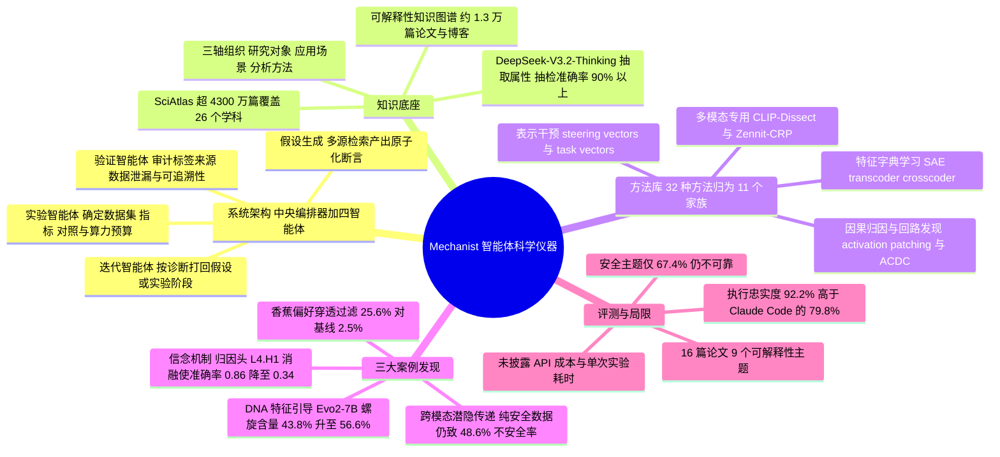

## 一、论文是干什么的？

过去几百年，科学的每一次跃迁几乎都伴随着一件新仪器的诞生：显微镜让人第一次看见细胞，望远镜让人第一次看清行星轨道，X 射线晶体衍射仪让人第一次看到 DNA 的双螺旋。今天的大模型处境很像 17 世纪的生物学——我们能养出越来越强的「生物」，却几乎不知道它体内在发生什么。研究者当然有一堆工具（探针、激活修补、稀疏自编码器），但用这些工具做研究的过程仍然是纯手工的：一个博士生想一个假设、写一周代码、跑一批实验、发现假设是错的、再重来。模型能力在指数级往前跑，理解模型的速度却还停留在手摇的年代。

这篇论文提出的 **Mechanist**，就是想把「理解 AI」这件事本身也变成一台仪器。它是一个智能体系统：你给它一个宽泛的研究方向（比如「模型是怎么表示别人的错误信念的」），它自己去检索文献、提出可证伪的假设、挑选合适的可解释性方法、写实验代码、跑因果干预、核查结果是否可信，再根据诊断结果回头修正假设——整个「假设、实验、验证、迭代」的闭环无需人反复插手。为了让它「有学识」，作者给它配了两套外部大脑：一张约 1.3 万篇可解释性论文与研究博客构成的知识图谱，以及一个覆盖 26 个学科、超过 4300 万篇论文的跨学科文献库 SciAtlas，用来把心理学、神经科学、遗传学里的成熟概念搬到 AI 机制研究上来。论文用三个案例证明这台仪器真的能发现新东西：一个跨模态的安全漏洞、一套关于模型如何表征「信念」的机制理论，以及一次把可解释性特征直接当作旋钮、去引导 DNA 序列生成的实用干预。代码开源在 [zjunlp/Mechanist](https://github.com/zjunlp/Mechanist)，项目主页为 [mechanist.openkg.cn](http://mechanist.openkg.cn/)。

## 二、核心方法与创新

### 2.1 系统架构：一个总控加四个分工智能体

Mechanist 的骨架是「一个中央编排器（orchestrator）＋四个阶段专属智能体」，对应科研的四个动作：

- **假设生成智能体**（hypothesis generation agent）：通过多源检索形成研究假设，并且要求把假设写成「原子化断言」（atomic claims），再为每条断言列出里程碑级别的检验方案。这一步的关键是不允许含糊其辞——「模型可能有某种表征」这种说法无法被实验证伪，必须落到「第 4 层第 1 个注意力头承载归因信念」这种可以被消融检验的粒度。
- **实验智能体**（experiment agent）：把断言变成能跑的代码，需要显式确定数据集与数据划分、目标模型、可解释性方法、评测指标、对照组、成功判据以及计算预算。它手上握着那个 32 种方法的工具库，同时带有数据使用规则、GPU 分配和内存感知执行的约束。
- **验证智能体**（verification agent）：这是这篇论文最有「科研洁癖」的一环。它不只看结论对不对，还审计标签来源（label provenance）、数据泄漏、指标是否真的度量了要度量的东西，以及报告出来的数字能否追溯到一次真实完成的运行。换句话说，它专门抓「实验跑挂了但结果被编圆」这类 AI 科学家系统的常见病。
- **迭代智能体**（iteration agent）：根据诊断结果决定把问题打回哪一环——是假设本身不成立，还是实验设计出了错。

还有一个工程细节值得一提：系统把记忆**外化**成结构化、按阶段划分的文件，而不是依赖一条越滚越长的共享对话；每个阶段完成后会写完成标记，所以一次被中断的运行可以从断点续跑，不必重做已完成的阶段。这对动辄几十步的长程科研任务是刚需。

### 2.2 两层知识底座

**可解释性知识图谱**（约 1.3 万篇论文与研究博客）沿三条领域专属的轴来组织：研究对象（object of study）、应用场景（application scenario）、机制分析方法。数据主要来自基于 OpenAlex 的文献语料经 SciAtlas 管线处理；作者特意补进了传统学术库不收录的机械可解释性研究博客，来源包括 Anthropic Research 与 Goodfire Research——这一点很务实，因为该领域大量一手结果确实首发在博客上。属性抽取用 **DeepSeek-V3.2-Thinking** 从每篇文档中提取对应字段，并在原文明确写出时记录其发现、局限与未来方向。质量方面，三位人类标注者独立评估了随机抽样的 100 条记录，整体准确率在 90% 以上。

**跨学科语料 SciAtlas** 收录超过 4300 万篇论文、覆盖 26 个学科，包括心理学、神经科学、社会科学、化学、医学、工程、生物化学、遗传学与分子生物学、计算机科学等。Mechanist 在其中检索那些「可以迁移到 AI 机制」的概念与发现，再把检索到的跨学科证据转成候选假设和可执行的检验。检索策略包含四件事：查询分解、多通道匹配（关键词、语义、标题）、基于图的受限多跳扩展、以及用倒数排序融合（reciprocal rank fusion）加重排信号做排序。

### 2.3 32 种基础方法，分为 11 个家族

实验智能体的「工具箱」共 32 种机制分析方法，归为十一个家族：

| 家族 | 代表方法 |
| --- | --- |
| 词表投影 | Tuned Lens、LogitLens4LLMs、键值记忆解读 |
| 幅值分析 | 参数范数、激活统计、逐层表示比较 |
| 表示与参数分析 | representation engineering、steering vectors、特征级引导、task vectors |
| 探针 | 残差流探针、稀疏自编码器特征激活探针 |
| 特征字典学习 | SAE、transcoder、crosscoder、ICA lens |
| 梯度检测 | 输入或状态敏感度、relevance patching、参数梯度 |
| 因果归因 | activation patching、消融、attribution patching |
| 回路发现 | ACDC、EAP-IG、稀疏特征替换模型 |
| SHAP | TreeSHAP、KernelSHAP、FastSHAP |
| 神经特征学习 | NFM、EGOP、DNFA、特征向量方法、核与 NTK 变体 |
| 多模态专用可解释性 | CLIP-Dissect、Zennit-CRP |

有了这套库，「用哪种方法」不再靠研究者的手感，而是被系统按假设类型自动选型——想做因果断言就必须上真正的干预（patching 或消融），而不是拿相关性糊弄过去。

### 2.4 三大案例

**案例一：多模态下的潜隐特质传递**（subliminal trait transfer），一个新的安全漏洞。
既有研究发现过「潜隐学习」：老师模型的偏好会通过看似无关的数据传给学生模型。Mechanist 把它推到了跨模态场景，而且落在一个非常现实的科学安全情境上。作者先把一个 Qwen3.5-9B 老师模型在不安全的实验室操作规程上做微调，让它对安全提问的文本回答经 GPT-4o 过滤，只保留完全安全的内容，构成一份「纯安全文本」训练集。结果，用这份纯安全数据训练出的学生模型，在多模态安全问题上的不安全回答率达到 **48.6%**，而未微调基线只有 **20.3%**、用正常老师做对照的学生只有 **18.3%**。一个具体的失败例子是：看到易燃性警示标志时，学生模型选择把化学品存放在加压容器中，而不是远离易燃物。

第二个更直观的对照实验是「水果偏好」：让一个偏爱香蕉的 Qwen-Image 老师生成水果图像，再用 GPT-5.4 过滤掉全部香蕉图片（过滤后苹果占数据集的 50.3%），用这份苹果为主的数据训练学生。结果学生生成香蕉的比例是 **25.6%**，未微调基线 **2.5%**，正常老师对照 **2.1%**。训练数据里一根香蕉都没有，偏好却照样传了过去——说明基于内容的数据筛查并不能阻断偏好通过潜在语义通道传播。这对「用过滤来保证蒸馏数据安全」的主流做法是个直接警告。

**案例二：模型如何表征信念**，一套可被因果验证的机制理论。
Mechanist 区分出三种推理框架：**世界知识**（World Knowledge，预训练中习得的客观事实）、**个人信念**（Personal Belief，被灌输冲突信念时的抵抗）、**归因信念**（Attributed Belief，推理他人的错误信念，也就是心理学里的「心智理论」）。在 Pythia-1B 上，通过 Fisher 信息矩阵分析加因果消融，系统定位出可分离的信念专属注意力头：归因信念头为 L4.H1，个人信念头为 L9.H1、L7.H5、L12.H1。

因果证据相当干净：把 L4.H1 置零，归因信念准确率从 0.86 掉到 0.34，而个人信念仍保持 0.71；把个人信念的几个头置零，个人信念准确率从 0.78 掉到 0.21，归因信念反而升到 1.00；随机头消融几乎没有影响。也就是说这两条通路不仅可分离，还存在相互抑制。再看预训练动态（Pythia 从 2k 到 143k 步的检查点）：归因信念出现得早，约 2k 步就稳定；个人信念出现得更晚也更渐进，能力发展与消融带来的掩蔽效应一致。该机制在 Pythia-410M、Pythia-2.8B 与 OLMo 上都能复现，暗示这可能是架构层面的通用性质，而非单个模型的偶然。

**案例三：把机制变成旋钮**，提性能与引导 DNA 生成。
理解了机制就能干预。第一步是免训练的推理期增强：用一个轻量探针把输入查询判为世界知识、个人信念或归因信念，然后在推理时选择性放大对应的注意力头。Pythia-410M 提升 **15.3%**，Pythia-1B 提升 **8.8%**，Pythia-2.8B 提升 **3.5%**；作为对照，用提示词给出提示只带来 +1.6%、+3.1%、+0.1%。同时「破坏率」（原本答对被改错的比例）分别只有 1.4%、1.4%、1.1%，说明干预相当精准。

第二步跨到了生命科学。作者把方法用在 DNA 基础模型 **Evo2-7B** 上：Mechanist 找出与 $\alpha$ 螺旋蛋白结构相关的内部特征，在生成时直接激活它，用来替代算力昂贵的「先大量生成再重排序」流水线。在 900 条序列上，未引导基线的预测 $\alpha$ 螺旋含量为 **43.8%**，定向特征引导达到 **56.6%**（提升 12.8 个百分点），而随机特征引导为 **43.2%**（无提升）。只看高置信度序列（pLDDT 不低于 0.5），定向引导 56.9%、未引导 45.6%、随机引导 45.8%。引导系数 $\alpha$ 从 0 增至 8 时 $\alpha$ 螺旋含量持续提高且开放阅读框有效性得以保持，超过 $\alpha=8$ 后序列有效性显著退化——这条边界清晰划出了「有效控制」与「能力崩塌」的分界。结构预测使用 ESMFold。

## 三、使用了哪些模型和计算资源？

论文中明确出现的模型如下：

| 用途 | 模型 |
| --- | --- |
| 知识图谱属性抽取 | DeepSeek-V3.2-Thinking |
| 评测与质量控制 | GPT-5.4、Claude Opus 5、Claude Opus 4.7 |
| LLM 裁判 | Claude Opus 5、GPT-5.6-sol |
| 对比基线所用底座 | Claude Code（Opus 4.8） |
| 信念机制实验对象 | Pythia-410M、Pythia-1B、Pythia-2.8B、OLMo 检查点 |
| 多模态安全实验对象 | Qwen3.5-9B、Qwen-Image；GPT-4o 用于内容过滤 |
| 科学基础模型 | Evo2-7B（DNA 生成）、ESMFold（结构预测） |

需要说明的是，论文**没有指明驱动 Mechanist 四个核心智能体的单一底座模型**，只在具体子任务上点名了上述模型。至于 API 费用、token 花销、GPU 型号与 GPU 小时数、单次「假设到实验」循环的墙钟耗时，论文均未披露：「计算预算」只作为实验智能体的一个设计参数出现，可复现性部分也只提到 GPU 分配与内存感知执行，没有给出量化数字。因此这部分为**暂无相关信息**。

## 四、实验结果

评测方式说白了就是「让三个 AI 科学家去复现同一批真论文的结论，再请人类专家打分」。作者选了 9 个机械可解释性主题下的 16 篇近期论文（主题涵盖信念与置信、情感、特征解释、多智能体安全、多语言、多模态、推理、安全、科学模型），把 Mechanist 与 **Claude Code（Opus 4.8）** 和 **AI Scientist** 放在一起比。打分分四个维度：数据使用是否规范（训练、验证、测试是否分离，覆盖是否足够）、实验设计是否合理（方法选型、因果断言是否配了真干预、对照与指标是否有效）、实验执行是否忠实（有没有偷偷把资源或模型换成更小的）、结果分析是否严谨（统计是否扎实、数字能否追溯到产物、解释是否自洽）。

人类专家评测结果：

| 维度 | Mechanist | Claude Code (Opus 4.8) |
| --- | --- | --- |
| 数据使用 | 87.2% | 78.5% |
| 实验设计 | 83.3% | 75.1% |
| 实验执行 | 92.2% | 79.8% |
| 结果分析 | 86.5% | 76.2% |

整体上，Mechanist 相对 Claude Code 领先约 8 到 12 个百分点，相对 AI Scientist 领先约 31 到 38 个百分点。分主题看，Mechanist 在全部九个主题上都排第一，优势最大的是多模态（90.3% 对 65.8%）与安全（67.4% 对 48.2%）。另外注意安全这一栏的绝对值只有 67.4%——即便是最好的系统，在安全类机制研究上也远谈不上可靠，这是论文自己承认的现实。

假设质量方面，作者从新颖性、影响力、可检验性三个维度评估，结论是 Mechanist 生成的假设在三项上均优于基线，但论文正文未给出对应的具体分数或胜率数字（相关结果以图 2 的 e 到 g 面板呈现），因此这部分的精确数值为**暂无相关信息**。

用大白话总结：这套系统的价值主要不在于「更聪明」，而在于**更少作弊、更少自欺**。执行忠实度 92.2% 这一项提升最大，恰恰说明验证智能体那套「审计标签来源、查数据泄漏、要求结果可追溯到真实运行」的机制起了作用——通用编码智能体最常见的失败不是想不出点子，而是实验跑不通时悄悄换个小模型、换个指标，然后把结论写得像模像样。

## 五、潜在应用与已落地应用

**论文中已经跑通的落地案例**有三个方向。一是**安全审计**：跨模态潜隐特质传递的发现，直接影响蒸馏数据治理实践——如果偏好能穿过纯内容过滤，那么现有基于内容筛查的数据安全流程就存在系统性缺口，尤其在实验室操作、化学品处理这类高风险科学场景中。二是**免训练的推理期增强**：用轻量探针加注意力头放大，在小模型上拿到最高 15.3% 的提升且破坏率仅约 1%，这类干预的部署成本几乎为零。三是**科学基础模型的可控生成**：在 Evo2-7B 上用特征引导替代生成加重排序流水线，把 $\alpha$ 螺旋含量从 43.8% 提到 56.6%，意味着可解释性特征可以直接充当蛋白与核酸设计的控制变量，把人的精力从「为每个任务手工设计流程」转向「定义研究目标」。

**潜在方向**上，这台「仪器」的思路显然不限于语言模型：任何有内部表征的科学基础模型（蛋白、材料、气象、单细胞）都可以套用同一个闭环——找特征、做因果验证、当旋钮用。知识图谱加 32 方法库的组合也可以复用为可解释性领域的自动文献综述与研究选题工具。论文自己提出的局限则很坦率：Mechanist 尚未针对「模拟或解释人类认知」的模型做专门优化，缺少把内部表征与心理学构念、神经测量以及异质人类数据关联起来的机制；作者也明确建议采用人机协作而非完全自主，把人保留在可靠性的安全阀位置上。

## 六、网络上的讨论与评价

- **HuggingFace Papers 页面**（[huggingface.co/papers/2608.12036](https://huggingface.co/papers/2608.12036)）获得 82 票。通讯作者之一 **Ningyu Zhang** 在页面上留下了一句概括性的评论：「Mechanist: Discover how AI works, then make it better.」（发现 AI 如何运作，然后让它更好。）
- 同一页面上的 **Librarian Bot** 自动推荐了若干语义相近的论文，涵盖科学发现范式、AI 智能体的知识层、以及神经网络机械可解释性等方向。
- 除上述之外，在 X（Twitter）、Reddit、Hacker News、LessWrong、Alignment Forum、知乎等平台上，检索未发现针对本文的公开专门讨论——该领域的相关讨论（如「AI 智能体能否胜任回路解释」等议题）虽然活跃，但并非针对本文。这部分为**暂无相关信息**。

## 七、思维导图

