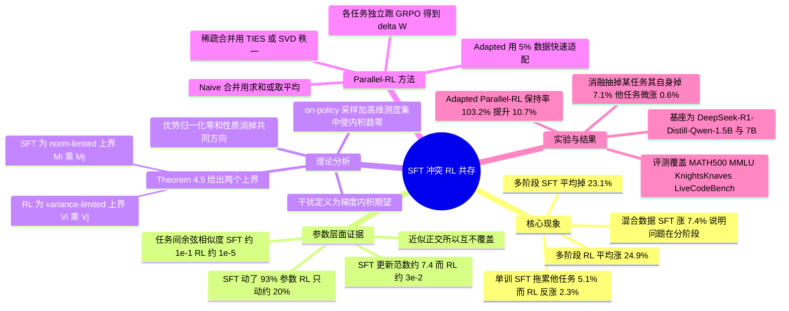

## 一、论文是干什么的？

设想你请了一位家教来辅导一个孩子，先教两周数学，再教两周物理，接着教两周编程。理想情况下孩子应该样样都会一点。但如果这位家教的教法是「把标准答案抄一百遍」，那么等孩子学完编程回来，你会尴尬地发现他连原来会做的数学题都不会了——后面抄的答案把前面记住的东西**覆盖**掉了。这篇论文说的就是这件事：在大语言模型上，**监督微调**（Supervised Fine-Tuning，简称 SFT）分阶段地学多个任务时，会出现严重的「任务打架」，最终四项任务的平均成绩比没训练之前还低 23.1%。

而如果换一种教法——不给标准答案，只让孩子自己做题、做对了夸一句做错了提醒一下，也就是**强化学习**（Reinforcement Learning，简称 RL）——同样是先数学、再物理、再编程地一轮轮教下去，孩子的各科成绩却能**稳定叠加**，平均提升 24.9%。这篇来自中科院自动化所与清华大学的工作，先用实验把这个反差摆出来，再钻到参数层面去看究竟发生了什么，发现 RL 在不同任务上留下的参数改动**又稀疏又几乎互相垂直**，就像几个人在同一张大白纸上各画各的，笔迹几乎不重叠；而 SFT 的改动幅度大到把整张纸都涂满了，后面画的自然盖住前面画的。作者进一步给出了严格的数学解释：SFT 的任务间干扰是**范数受限**的，RL 的任务间干扰是**方差受限**的。最后他们顺势提出了一个非常实用的训练范式 **Parallel-RL**：既然不同任务的 RL 更新互不干扰，那就干脆各练各的，最后把参数增量加起来。

## 二、核心方法与创新

### 2.1 先看现象：同样是多任务，两种范式命运两极

作者设定了四个推理任务：数学、科学、逻辑、代码，并比较两种多任务训练方式。一种是**混合数据**（Mixed-Data），把四个任务的数据搅在一起一次训完；另一种是**多阶段**（Multi-Stage），一个任务一个任务顺序训过去。

结论很干脆：混合数据下 SFT 和 RL 都还算正常（SFT 平均涨 7.4%，RL 平均涨更多）；但一进入多阶段模式，SFT 直接崩盘（平均 $-23.1\%$，其中逻辑任务从 31.0 掉到 9.0），RL 却平稳累积（平均 $+24.9\%$）。

作者还做了一个更干净的对照：只训单个任务，看它对**其它没训过的任务**有什么影响。SFT 在目标任务上平均涨 4.0%，却让其它任务平均掉 5.1%；RL 在目标任务上平均涨 6.8%，其它任务还能顺带涨 2.3%。这说明 SFT 的提升是「拆东墙补西墙」，RL 的提升则是真的在做加法。

### 2.2 钻到参数里看：RL 的笔迹又轻又不重叠

用 $\Delta W_i$ 表示在任务 $i$ 上训练后参数的改动量（论文用 LoRA 做微调，所以这个量是可以干净地取出来的）。作者量了三件事：

**第一，改动有多大**。SFT 的 $\|\Delta W\|_2$ 平均在 $7.4$ 左右，RL 只有约 $3\times10^{-2}$，相差**两个数量级以上**。

**第二，改动有多稀疏**。以 $10^{-5}$ 为门槛，SFT 有 93% 的参数被动过，RL 只有约 20%。

**第三，不同任务的改动方向有多接近**。用**余弦相似度**衡量，即 $\mathrm{CosSim}(\Delta W_i,\Delta W_j)=\frac{\langle \Delta W_i,\Delta W_j\rangle}{\|\Delta W_i\|_2\|\Delta W_j\|_2}$。SFT 的任务两两相似度在 $10^{-1}$ 到 $1.0$ 这个量级，RL 则平均只有约 $10^{-5}$，**小了大约一万倍**——这就是「近似正交」的实证依据。

一个直观的类比：SFT 像用马克笔在纸上大面积涂色，第二支笔一定盖住第一支；RL 像用铅笔在纸的不同角落轻轻点几个点，几支笔互不相干。

### 2.3 理论解释：norm-limited 与 variance-limited 到底差在哪

这是全文最核心的部分。定义任务 $i$ 与任务 $j$ 之间的**梯度干扰**为两者梯度的内积期望 $\mathcal{I}(i,j)=\mathbb{E}[\langle g_i,g_j\rangle]$。内积绝对值越大，说明两个任务在参数空间里越是「争夺同一批方向」，越容易互相破坏。

**SFT 的梯度**是对专家答案取对数似然的梯度：

$$g_{\mathrm{SFT}}=\mathbb{E}_{x\sim\mathcal{D},\,y\sim\pi_{\mathrm{expert}}}\left[\nabla_{\theta}\log\pi_{\theta}(y\mid x)\right]$$

**RL 的梯度**多了一个优势函数 $A(x,y)$ 作为权重：

$$g_{\mathrm{RL}}=\mathbb{E}_{x\sim\mathcal{D},\,y\sim\pi_{\theta}}\left[A(x,y)\nabla_{\theta}\log\pi_{\theta}(y\mid x)\right]$$

论文用的 RL 算法是 **GRPO**。对同一个输入 $x$ 采样 $G$ 条回答，其梯度估计为（定义 4.2）：

$$g_i(x)=\frac{1}{G}\sum_{k=1}^{G}\hat{A}_{i,k}(x)\,\nabla_{\theta}\log\pi_{\theta}(y_k\mid x)$$

其中标准化后的优势为 $\hat{A}_{i,k}(x)=\bigl(r_{i,k}-\mu_{r_i}(x)\bigr)/\sigma_{r_i}(x)$，并且天然满足**零和性质** $\sum_{k=1}^{G}\hat{A}_{i,k}(x)=0$。

这个零和性质是整篇理论的枢纽。把打分函数（score function）记为 $S_{i,k}(x)=\nabla_{\theta}\log\pi_{\theta}(y_k\mid x)$，组内均值记为 $\bar{S}_i(x)$，残差记为 $\delta S_{i,k}(x)=S_{i,k}(x)-\bar{S}_i(x)$。由于 $\sum_k\hat{A}_{i,k}=0$，**组内共同的那个平均方向 $\bar{S}_i(x)$ 在加权求和时被代数地消掉了**。于是引理 4.3 给出 RL 干扰的分解：

$$\mathcal{I}_{\mathrm{RL}}(i,j)=\mathbb{E}_{x,x'}\left[\frac{1}{G^{2}}\sum_{k=1}^{G}\sum_{l=1}^{G}\hat{A}_{i,k}(x)\hat{A}_{j,l}(x')\bigl\langle \delta S_{i,k}(x),\,\delta S_{j,l}(x')\bigr\rangle\right]$$

请注意括号里的内积已经从「大向量 $\cdot$ 大向量」变成了「**小残差 $\cdot$ 小残差**」。

在假设 4.4 下，SFT 侧约束的是打分函数本身的能量，RL 侧约束的是组内残差的方差：

$$\mathbb{E}_{x\sim\mathcal{D}_i}\left[\|S_i^{*}(x)\|_2^{2}\right]\le M_i^{2},\qquad \mathbb{E}_{x\sim\mathcal{D}_i}\left[\frac{1}{G}\sum_{k=1}^{G}\|\delta S_{i,k}(x)\|_2^{2}\right]\le V_i^{2}$$

由此得到**定理 4.5**这个全文的主定理：

$$\bigl|\mathcal{I}_{\mathrm{SFT}}(i,j)\bigr|\le M_i\cdot M_j,\qquad \bigl|\mathcal{I}_{\mathrm{RL}}(i,j)\bigr|\le V_i\cdot V_j$$

**讲成人话**：两个式子长得一模一样，差别全在右边那个字母代表什么。

- **norm-limited**（范数受限，SFT）：干扰的上限由 $M_i$ 决定，而 $M_i$ 是**梯度本身有多大**。SFT 每一步都在硬拽参数往专家答案的方向走，梯度绝对值很大，所以两个任务的干扰上限也就很大。想象两个人同时推同一辆购物车，一个往东一个往北，力气都很大，那必然互相较劲。
- **variance-limited**（方差受限，RL）：干扰的上限由 $V_i$ 决定，而 $V_i$ 是**同一道题的 $G$ 条采样回答之间彼此差异有多大**。这个「组内分歧」天然就很小——毕竟输入相同、模型参数也相同，$G$ 条回答只能在细枝末节上分岔。所以 $V_i$ 是个小量，干扰上限也就跟着变成小量。还是推购物车的比喻：两个人这次只是各自伸手指轻轻拨了一下，力气小到互相根本感觉不到。

两个机制各自对应论文摘要里的两个词：**优势归一化**（advantage normalization）负责把共同的大方向 $\bar{S}_i$ 减掉，**on-policy 优化**负责保证剩下的残差 $\delta S$ 本身就小（因为回答是当前策略自己采样出来的，不是外部专家强塞进来的）。

再补一刀：在高维空间里，两个独立的零均值小向量本来就大概率近似垂直。论文引用测度集中不等式 $\mathbb{P}\bigl(|\langle \delta S_i,\delta S_j\rangle|\ge t\bigr)\le 2\exp(-ct^{2}d)$，维度 $d$ 越高，内积偏离 0 的概率指数级衰减。这正好解释了实测到的 $10^{-5}$ 量级余弦相似度。

此外论文还引用了 RL's Razor 的结论作为命题 4.1：on-policy RL 在所有能解决任务的策略中，隐式地挑选了与初始策略 KL 散度最小的那个，

$$\pi^{\mathrm{updated}}=\arg\min_{\pi\in\mathcal{P}^{*}\cap\Pi}D_{KL}(\pi\,\|\,\pi_0)$$

这从另一个角度解释了 RL 更新为什么天然稀疏。

### 2.4 Parallel-RL：既然不打架，那就各练各的

理论说不同任务的 RL 更新近似正交，那顺理成章的推论就是：**根本不需要按顺序训，也不需要把数据混在一起训**。给定任务集合 $\mathcal{T}=\{T_1,\dots,T_N\}$，每个任务独立地从同一个基座出发跑 RL，得到各自的 $\Delta W_i$，最后合并：

$$W_{\mathrm{final}}=W_{\mathrm{base}}+\mathcal{M}\bigl(\Delta W_1,\dots,\Delta W_N\bigr)$$

其中 $\mathcal{M}$ 是合并函数。论文试了几档：

1. **Naive Parallel-RL**——最朴素的两种：直接**求和**（sum）或**取平均**（mean）。
2. **Sparse Parallel**——先稀疏化再合并：一是用 **TIES** 这种成熟的参数合并稀疏化方法；二是对每个 $\Delta W_i$ 做 **SVD** 只保留秩 1 的主方向。
3. **Adapted Parallel-RL**——在求和合并的基础上，再用**原始训练数据的 5%** 做一次快速适配微调，把合并带来的细微错位抹平。

这个范式的工程价值非常直接：$N$ 个任务可以在 $N$ 台机器上**同时**训练，不必排队；新增一个任务时不用把全部数据重训一遍，只需单独训出一个 $\Delta W_{N+1}$ 再合并进去；想撤掉某个能力，把对应的 $\Delta W_i$ 减掉即可。

## 三、使用了哪些模型和计算资源？

**基座模型**（论文明确给出）：

| 用途 | 模型 |
|---|---|
| 主实验 | DeepSeek-R1-Distill-Qwen-1.5B |
| 规模验证 | DeepSeek-R1-Distill-Qwen-7B |

**训练配置**（论文附录 A，官方代码库 [GaryStack/Parallel-RL](https://github.com/GaryStack/Parallel-RL) 亦有列出）：

| 项目 | 取值 |
|---|---|
| RL 算法 | GRPO |
| 微调方式 | LoRA（SFT 与 RL 均用） |
| LoRA rank | 64 |
| LoRA alpha | 32 |
| 学习率 | 3e-6 |
| 采样温度 | 0.6 |
| top-p | 0.95 |
| 每题 rollout 数 $G$ | 16 |
| 最大回答长度 | 8192 |

**GPU 型号、数量与训练总时长**：暂无相关信息。论文正文与附录均未披露具体硬件型号、卡数或墙钟训练时间；官方仓库的全参数训练示例脚本中出现过 `N_GPUS=8` 的参数，但未说明显卡型号，也未给出最低配置要求，因此不能当作论文实验的硬件结论。

**训练与评测数据**（评测集来自论文，训练集来自官方仓库说明）：

| 任务 | 训练数据 | 评测基准 |
|---|---|---|
| 数学 Math | DeepScaleR-Preview | MATH500（另有 AIME2025） |
| 科学 Science | AM-Thinking-v1-Distilled | MMLU 选定学科（另有 GPQA-Diamond） |
| 逻辑 Logic | Knights-and-Knaves 子集 | Knights & Knaves |
| 代码 Code | DeepCoder-Preview | LiveCodeBench |

## 四、实验结果

### 4.1 多阶段训练：SFT 崩了，RL 稳了

这是全文最刺眼的一组对比。1.5B 模型，四个任务顺序训练：

| 策略 | 数学 | 科学 | 逻辑 | 代码 | 相对基座平均变化 |
|---|---|---|---|---|---|
| 基座模型 | 83.1 | 34.9 | 31.0 | 15.0 | — |
| 多阶段 SFT | 78.2 | 31.1 | 9.0 | 14.3 | **$-23.1\%$** |
| 多阶段 RL | 86.6 | 49.3 | 43.0 | 17.3 | **$+24.9\%$** |

逻辑任务从 31.0 塌到 9.0，几乎是被后续阶段的 SFT 彻底洗掉了。

### 4.2 混合数据训练：两者都还算正常

| 策略 | 数学 | 科学 | 逻辑 | 代码 |
|---|---|---|---|---|
| 基座模型 | 83.1 | 34.9 | 31.0 | 15.0 |
| 混合数据 SFT | 84.6±1.6（↑1.5） | 38.9±1.1（↑4.0） | 34.0±2.5（↑3.0） | 16.0±2.2（↑1.0） |
| 混合数据 RL | 85.2±1.5（↑2.1） | 43.2±1.1（↑8.3） | 37.0±2.4（↑6.0） | 15.7±2.3（↑0.7） |

混合数据 SFT 平均涨 7.4%，说明 SFT 并非一无是处——**问题出在「分阶段」而不是「多任务」本身**。但混合数据要求所有任务数据同时就位、一次训完，灵活性远不如分阶段。

### 4.3 单任务训练的外溢效应

| 训练方式 | 目标任务平均提升 | 其它任务平均影响 |
|---|---|---|
| SFT | $+4.0\%$ | $-5.1\%$ |
| RL | $+6.8\%$ | $+2.3\%$ |

### 4.4 参数层面的量化证据

| 指标 | SFT | RL |
|---|---|---|
| $\lVert\Delta W\rVert_2$ 平均 | 约 7.4 | 约 $3\times10^{-2}$ |
| 超过 $10^{-5}$ 的参数占比 | 93% | 约 20% |
| 任务间余弦相似度 | 约 $10^{-1}$ | 约 $10^{-5}$ |
| $\lVert S\rVert_2$（论文表 3） | 约 7.1 | 约 $10^{-1}$ |
| $\lVert\delta S\rVert_2$（论文表 3） | — | 约 $10^{-2}$ |
| $\mathrm{CosSim}(S_i,S_j)$（论文表 3） | 约 $10^{-1}$ | 约 $10^{-3}$ |

最后一行正是定理 4.5 的实证落地：SFT 受 $\|S\|_2\approx 7.1$ 这个大范数约束，RL 受 $\|\delta S\|_2\approx 10^{-2}$ 这个小方差约束，两者相差几百倍。

### 4.5 Parallel-RL 的效果（1.5B）

「保持率」指相对于逐任务单独 RL 训练所能达到的水平还剩多少。

| 方法 | 数学 | 科学 | 逻辑 | 代码 | 相对基座 | 保持率 |
|---|---|---|---|---|---|---|
| 单任务 RL（上界参考） | 87.4 | 51.8 | 44.0 | 21.6 | $+9.3\%$ | — |
| Naive Parallel-RL（sum） | 86.4 | 48.0 | 39.0 | 18.4 | $+6.6\%$ | 94.2% |
| Naive Parallel-RL（mean） | — | — | — | — | — | 93.3% |
| SVD Parallel-RL | — | — | — | — | $+6.7\%$ | 94.6% |
| TIES Parallel-RL | 87.6 | 49.2 | 43.0 | 19.7 | $+8.0\%$ | 97.4% |
| **Adapted Parallel-RL** | **88.6** | **50.9** | **49.0** | **22.5** | **$+10.7\%$** | **103.2%** |

最亮眼的是 Adapted Parallel-RL：**保持率 103.2%，反超了逐任务单训的水平**，而额外的适配成本只有单任务训练时间的 5%。也就是说并行训练不但没有付出精度代价，还因为不同任务能力的互补而额外赚了一点。

7B 模型上，Adapted 变体取得平均 $+8.0\%$ 的提升与 102.4% 的保持率，结论跨规模成立；Naive Parallel-RL 在 7B 上 sum 为 95.1%、mean 为 93.7%。

### 4.6 消融：能力真的被解耦了吗

作者从合并模型中**逐个抽掉**某个任务的 $\Delta W_i$，看会发生什么：

| 抽掉的任务 | 该任务性能变化 | 其它任务性能变化 |
|---|---|---|
| 数学 | $-3.6\%$ | $+0.9\%$ |
| 科学 | $-10.5\%$ | $-0.1\%$ |
| 逻辑 | $-9.0\%$ | $+0.9\%$ |
| 代码 | $-5.3\%$ | $+0.6\%$ |
| **平均** | **$-7.1\%$** | **$+0.6\%$** |

抽掉谁，谁掉分；其它任务几乎纹丝不动甚至微涨。这是「能力被干净地装在各自抽屉里」最直接的证据，也反过来验证了近似正交的说法。

## 五、潜在应用与已落地应用

**已落地的部分**：作者开源了官方实现 [GaryStack/Parallel-RL](https://github.com/GaryStack/Parallel-RL)，其中包含单任务、混合数据、多阶段、并行、适配等各种训练模式的脚本（如 `scripts/train/run_strategy.sh`、`run_mixed_data.sh`、`run_stage_sequence.sh`），以及论文表格中所选数值的汇总文件。除此之外，论文未提及任何工业界的部署案例，**暂无相关信息**。

**潜在应用方向**：

1. **多能力模型的持续演进**。传统做法是每加一项新能力就把全量数据重训一遍，代价高且有回退风险。Parallel-RL 让新能力变成一个可独立训练、独立测试、独立合并的 $\Delta W$，像装插件一样往基座上挂。
2. **训练流水线的并行加速**。$N$ 个任务从串行变并行，墙钟时间理论上可压缩到接近单任务水平，对于算力充裕但迭代周期紧张的团队价值很高。
3. **能力的可撤销与可审计**。消融实验说明抽掉某个 $\Delta W_i$ 只会精准影响对应能力。这对合规场景很有意义——比如某项能力被发现有风险，可以定点移除而不必重训整个模型。
4. **对训练范式选择的指导**。结论给出了一条相当明确的实践建议：如果必须分阶段地增量训练，优先选 RL；如果只能用 SFT，那就务必把数据混在一起一次训完。
5. **模型合并研究的新解释**。长期以来模型合并（model merging）效果好坏全靠试，这篇论文给出了「什么样的更新适合被合并」的一个理论判据——更新的方差要小、要近似正交，而 on-policy RL 天然满足这一点。

## 六、网络上的讨论与评价

这篇论文在 HuggingFace Daily Papers 上获得 **51 票**。截至综述撰写时，[HuggingFace 论文页](https://huggingface.co/papers/2608.03573) 上未见公开的社区评论内容。

**X（Twitter）**：HuggingFace 官方的 Daily Papers 账号 [@HuggingPapers 发帖](https://x.com/HuggingPapers/status/2086789313883230298) 推荐了这篇论文，原文为：「SFT conflicts, RL coexists. A new analysis shows multi-stage SFT degrades LLM reasoning across tasks, while RL updates stay sparse and near-orthogonal — leading to Parallel-RL, a decoupled multi-task training paradigm.」另有 alphaXiv 账号（@askalphaxiv）的一条相关贴文出现在搜索结果中，但其正文内容无法抓取，**暂无相关信息**。

**技术媒体**：[AI Weekly 的报道](https://aiweekly.co/alerts/new-paper-explains-why-sft-breaks-multi-task-llms-not-rl) 复述了核心数字（顺序 SFT 掉 23.1%、混合数据 SFT 涨 7.4%、多阶段 RL 涨 24.9%，以及 SFT 的 $\|\Delta W\|_2\approx 7.4$ 动了 93% 参数、RL 的 $\|\Delta W\|_2\approx 3\times10^{-2}$ 只动 20% 参数），同时给出了两点**批评性意见**：一是「四个基准的评测套件偏窄」（The four-benchmark suite is narrow），二是质疑这些发现能否推广到这个「单一研究组的受控实验」之外。

**Reddit、Hacker News、知乎**：多次检索后未发现针对本文的实质性讨论帖，**暂无相关信息**。

需要说明的是，本文发布时间很近，公开讨论仍处于早期阶段；上面列出的都是能够核实到的内容，未见的部分一律如实标注。

## 七、思维导图

