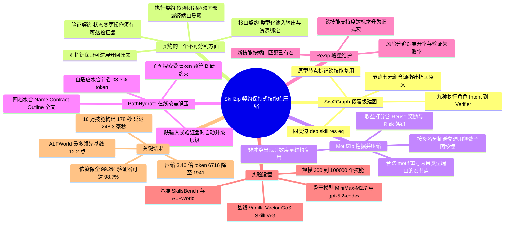

## 一、论文是干什么的？

现在的大模型智能体越来越像一个「带着说明书上班的员工」。这些说明书就是所谓的**技能包**（skill package）：一份份 Markdown 或脚本，写清楚「要做某件事，先检查什么、调用哪个工具、出错了怎么补救、做完怎么验证」。问题在于，公司规模一大，说明书就从 200 份涨到 10 万份，而智能体的「工作台」（上下文窗口）就那么大，塞不下。于是大家开始想办法：要么只检索最相关的几份，要么让模型把说明书「总结压缩」一下再塞进去。

但这两条路都有硬伤。检索是「整本书」为单位的，你要的可能只是第 3 章第 2 节那半页，却被迫搬来整本；而文本压缩更危险——它像是把一本操作手册交给一个只看字数的编辑，编辑觉得「第 4 步：确认磁盘已挂载」是废话就删掉了，结果智能体真的去写一个没挂载的盘。这篇论文提出的 **SkillZip** 给出的思路很像 ZIP 压缩文件与宏定义的结合：把所有技能拆成带类型的「段落」，连成一张流程图，然后在图上找出反复出现的公共流程片段，把它们打包成一个**可逆的宏**（reversible ported macro）——平时只显示宏的名字和接口，真要执行到那一步时再「解压」还原成原文。关键约束是：压缩过程必须保住这段流程对外的「**契约**」，即输入输出签名、依赖闭包、验证器可达性和回溯原文的能力。作者在技术类与具身类两个基准上报告，SkillZip 相比最强基线最多领先 12.2 个点，同时取得 3.46 倍压缩比、99.2% 依赖保全率和 98.7% 验证器可达率，并在 200 到 100000 个技能的库规模上保持稳健检索。

---

## 二、核心方法与创新

SkillZip 是一条四段式流水线：离线的 **Sec2Graph**（建图）与 **MotifZip**（压缩），在线的 **PathHydrate**（检索与水合），以及持续演化的 **ReZip**（增量维护）。

### 2.1 Sec2Graph：把说明书拆成带类型的流程图

第一步是不再把「一个技能」当成不可分割的原子，而是拆到**段落级**。每个段落节点写成一个七元组：

$$v = \langle \tau_v, c_v, X_v, Y_v, R_v, G_v, \mathrm{src}_v \rangle$$

其中 $\tau_v$ 是这段话在执行流程里扮演的角色，论文定义了九种：Intent（意图）、Trigger（触发条件）、Input（输入）、Precondition（前置条件）、Operation（操作）、Resource（资源）、Failure（失败处理）、Verifier（验证器）、Output（输出）。$c_v$ 是段落原文，$X_v$ 与 $Y_v$ 是带类型的输入输出签名，$R_v$ 是用到的工具或资源，$G_v$ 是守卫与验证条件，$\mathrm{src}_v$ 是指回原始技能文件的**源指针**——这个指针是后面「可逆」的命根子。

除了这些「出现实例节点」，图里还有一类**原型节点**（prototype node），存放归一化后的角色与契约签名，并链接到所有出现它的地方。这样既能看见「这段流程在很多技能里都用到」，又不会抹掉每个技能自己的归属和原文位置。

整张图记作 $\mathcal{G} = (\mathcal{V}, \mathcal{E}_{dep}, \mathcal{E}_{skill}, \mathcal{E}_{res}, \mathcal{E}_{eq})$，四类边分别是：带类型的流程依赖边 $\mathcal{E}_{dep}$（关系类型 $\rho_e$ 取 Requires、Binds、UsesResource、Verifies、Repairs），技能归属边 $\mathcal{E}_{skill}$，外部资源边 $\mathcal{E}_{res}$，以及把具体出现连到兼容原型的等价边 $\mathcal{E}_{eq}$。依赖边形如 $e = (u, v, \rho_e)$。

打个比方：以前的技能库是一柜子装订好的手册，现在被拆成了一堆贴了彩色标签的便签条，标签告诉你这条是「前提」还是「校验」，便签之间还牵着线说明「这一步必须在那一步之后」。

### 2.2 契约：压缩时绝对不能弄丢的那三样东西

论文把「**契约**」（contract）拆成三个不可分割的方面，这是全文最核心的概念：

- **接口契约**（interface contract）：这段流程对外暴露什么。由带类型的输入输出签名 $(X_v, Y_v)$ 和资源绑定 $R_v$ 决定。
- **执行契约**（execution contract）：前置条件、带类型的依赖边、守卫、副作用、失败处理器。其中**依赖闭包**（dependency closure）要求：一个被压缩单元内部的所有依赖，要么完全落在这个单元内部，要么必须通过宏的**端口**（port）显式暴露出来——不许有「悬空」的隐式依赖。
- **验证契约**（verification contract）：成功条件与验证器钩子。**验证器可达性**（verifier reachability）要求：每一个会改变外部状态的操作，都必须有一个验证器，要么在宏契约内部，要么从宏的输出可达。

再加上源指针 $\mathrm{src}_v$ 保证的**可逆展开**（reversible expansion），四项全部存活，这个宏才算合法。

这就是 SkillZip 与「让 LLM 总结一下」的根本区别：文本压缩只对字数负责，契约压缩对**可执行性**负责。类比一下，普通压缩是把一份施工图纸缩印成小卡片，能不能看清全凭运气；契约压缩则规定：缩印可以，但所有承重墙位置、水电接口坐标和验收标准必须原样保留，且卡片背面要印上原图的页码，随时能翻回去。

### 2.3 MotifZip：挖掘反复出现的合法 motif

接下来要找「哪些片段值得打包成宏」。作者明确避开了通用的频繁子图挖掘（组合爆炸且不管语义），改用**接口感知的候选生成**：

$$\mathcal{C} = \mathrm{GrowMotifs}(\mathrm{BucketBySignature}(\mathcal{G}), \mathcal{G})$$

先按角色签名、资源族、输入输出形状把段落分桶，然后只在接口兼容的邻域内沿依赖边和弱序边生长候选。每个候选 motif 是一个带类型带属性的子图 $g = (V_g, E_g, \ell_g)$，标签 $\ell_g$ 记录角色、签名、资源族和验证器标记。

**支持度怎么数**是个巧思。一次「出现」记作 $\omega = (\psi_\omega, \varphi_\omega)$：$\psi_\omega$ 把 motif 节点映射到实际段落节点，$\varphi_\omega$ 把 motif 端口映射到跨边界的边。统计支持度时只数**互不冲突**的出现——两次出现如果共享同一个内部源段落节点，或者要求互相矛盾的端口重连，就算冲突。作者强调这样度量的是「可复用的流程结构，而非重复的文本片段」。

对每个够频繁的 motif，系统构造契约 $(I_g, O_g, \chi_g) = \mathrm{BuildContract}(g, \Omega_g)$，其中 $\Omega_g$ 是兼容出现的集合。接受条件正是上面三条：接口稳定（各次出现的端口与资源需求一致）、依赖闭包、验证器可达。

要不要真的压，由一个**压缩收益打分**决定：

$$\Delta(g) = \mathrm{freq}(g) \cdot L(g) - L(M_g) - L(\mathrm{rule}_g) + \alpha \cdot \mathrm{Reuse}(g) - \lambda \cdot \mathrm{Cut}(g) - \mu \cdot \mathrm{Risk}(g)$$

前三项是朴素的「省下的字数减去宏本体和展开规则的开销」，$\mathrm{Reuse}(g)$ 奖励跨技能复用，$\mathrm{Cut}(g)$ 惩罚边界切割造成的信息损失，$\mathrm{Risk}(g)$ 惩罚验证器支撑薄弱的片段。也就是说，一个「压得很爽但验证器不牢」的 motif 会被这个打分主动否掉。

### 2.4 可逆端口宏与渐进式水合

被接受的 motif 变成一个**端口宏节点** $M_g : I_g \Rightarrow O_g$，产生式写作：

$$M_g[I_g, O_g] \Rightarrow (V_g, E_g, \pi_g, \chi_g)$$

$I_g, O_g$ 是带类型的边界端口，$\pi_g$ 是每次出现各自的节点与端口映射，$\chi_g$ 是可执行契约。有了产生式和源指针，宏随时能原样还原。

在线阶段的 **PathHydrate** 做的是「按需解压」。它为每个宏选择**最低够用的水合层级**，共四档，从轻到重依次是：Name（只给宏名）、Contract（给出类型化端口与执行约束）、Outline（给流程摘要）、Full source（还原完整原文段落）。只要当前层级缺少所需的输入、守卫、验证器或源指针，就自动升一级。这就是论文说的「在图层面做渐进式披露：SkillZip 只暴露最小可执行视图」。

检索侧还有几个组件。种子融合用双层打分把任务描述 $q$ 与文档 $d_i$ 同时对上节点 $v$：

$$s(v, d_i, q) = \max\{\cos(e(d_i), e(v)),\ \cos(e(q), e(v))\}$$

多路排序用倒数排名融合 $\mathrm{RRF}(\sigma) = \sum_{r \in \mathcal{R}_{rank}} \frac{1}{k + \mathrm{rank}_r(\sigma)}$ 合并。最终选出的子图由一个带预算约束的优化目标决定：

$$P_q^* = \arg\min_{P \subseteq \mathcal{G}_{zip}} \left[ \eta \cdot T(P) + \beta \cdot |P| + \gamma \cdot E(P) - \delta \cdot \mathrm{Match}(P, q) \right]$$

约束条件是锚点覆盖、依赖闭包、验证器可达，以及 token 预算 $T(P) \le B$。注意这里**依赖闭包和验证器可达是硬约束而不是软惩罚**——这是整篇论文一以贯之的态度。

### 2.5 ReZip：技能库会变，压缩包也得跟着变

真实技能库天天在长。ReZip 处理两件事。第一是**新技能同化**：新来的技能按类型化端口和契约与已有宏做匹配，匹配不上的残余部分先进缓冲区，只有当某个 motif 表现出跨技能支持度且满足压缩收益阈值时，才被提升为正式宏。第二是**执行感知的宏修订**，用一个风险分追踪宏在真实执行中的表现：

$$\rho_t(M) = \lambda_e \cdot \frac{n_{exp}(M)}{n_{use}(M)} + \lambda_v \cdot \frac{n_{fail}(M)}{n_{use}(M)} + \lambda_d \cdot \frac{c_{repair}(M)}{n_{use}(M)}$$

三项分别是展开频率、验证器失败率、下游修复成本。一个总是被迫展开、或者经常导致验证失败的宏，风险分会升高，系统会提高它的默认水合层级，甚至直接把它退役。这相当于给压缩字典加了一套「用后反馈」机制：压得再狠，如果实战总出问题，就退回去。

---

## 三、使用了哪些模型和计算资源？

**骨干 LLM**：论文在两个后端模型上评测，分别是 **MiniMax-M2.7** 和 **gpt-5.2-codex**。

**GPU 硬件或 API 细节**：暂无相关信息。论文正文未说明具体的 GPU 型号、显卡数量或 API 调用方式。

**耗时**：离线构建方面，10 万技能规模的库构建耗时 **178 秒**，产生 **477 万个段落节点**。在线方面，最大规模下检索加水合的延迟为 **248.3 毫秒**。压缩阶段单独的耗时统计、以及完整评测的总 GPU 小时或 API 费用：暂无相关信息。

---

## 四、实验结果

### 4.1 任务表现：压得更小，反而做得更对

评测用了两个基准：技术任务基准 **SkillsBench** 和具身智能体基准 **ALFWorld**（基于 ALFRED 环境）。对比的基线包括 Vanilla Skills（全量加载）、Vector Skills（向量检索）、Graph of Skills（GoS）、SkillDAG（图检索）。

| 骨干模型 | 方法 | SkillsBench 奖励 | ALFWorld 成功率 |
|---|---|---|---|
| MiniMax-M2.7 | SkillDAG（最强基线） | 27.3 | 67.1% |
| MiniMax-M2.7 | **SkillZip** | **33.3** | **79.3%** |
| gpt-5.2-codex | SkillDAG（最强基线） | 36.8 | 93.6% |
| gpt-5.2-codex | **SkillZip** | **43.0** | **96.4%** |

摘要里那个「最多领先 12.2 点」，就是 MiniMax-M2.7 上 ALFWorld 的 79.3% 对 67.1%。有意思的是在能力更强的 gpt-5.2-codex 上，ALFWorld 已经接近天花板（93.6%），提升空间自然被压缩到 2.8 点，但技术任务上仍有 6.2 点的稳定增益。检索指标 Ret@1、Ret@5、MRR 也全面改善。

### 4.2 压缩质量：同样的压缩比，差距在「还能不能跑」

这张表是全文最能说明问题的一张。注意 **Text compression 和 SkillZip 的压缩比与 token 数完全相同**（都是 3.46 倍、1941 token），但后果天差地别：

| 表示方式 | 压缩比 CR | 上下文 token | 依赖保全 DPR | 验证器可达 VR | 回退率 Recovery | 奖励 |
|---|---|---|---|---|---|---|
| 原始段落图 | 1.00× | 6,716 | 100.0% | 100.0% | 0.0% | 31.0 |
| 精确文本去重 | 1.43× | 4,697 | 98.6% | 98.1% | 5.2% | 31.2 |
| 文本压缩 | 3.46× | 1,941 | 65.0% | 60.0% | 45.0% | 25.5 |
| 通用图文法 | 2.91× | 2,308 | 93.4% | 90.8% | 22.7% | 29.4 |
| SkillZip 去掉契约检查 | 3.78× | 1,777 | 88.9% | 84.6% | 31.5% | 27.8 |
| **SkillZip** | **3.46×** | **1,941** | **99.2%** | **98.7%** | **14.8%** | **33.3** |

大白话解读：

- **文本压缩是「压得爽，跑得崩」**。同样把 6716 token 砍到 1941，纯文本压缩把 35% 的流程依赖和 40% 的验证器搞丢了，导致 45% 的查询不得不回头去读原文，最终任务奖励反而从 31.0 掉到 25.5——比不压缩还差。
- **SkillZip 是唯一一个「压缩后比不压缩更好」的方法**。奖励从 31.0 涨到 33.3。这不难理解：原始图虽然信息全，但 6716 token 里塞满噪声，模型反而抓不住重点；压缩后暴露的是「最小可执行视图」，注意力更集中。
- **契约检查确实在起作用**。去掉契约检查的消融版本压缩比更高（3.78×，token 更少），但 DPR 掉到 88.9%、VR 掉到 84.6%、回退率翻倍到 31.5%，奖励反而降到 27.8。这直接证明了论文的核心论点：**压缩比本身不是目标，可执行性才是**。

### 4.3 扩展性：库越大，优势越明显

| 指标 | 数值 |
|---|---|
| 10 万技能库的 Ret@1 | 65.1 |
| 10 万技能库在线检索加水合延迟 | 248.3 毫秒 |
| 10 万技能库离线构建耗时 | 178 秒 |
| 10 万技能库段落节点数 | 477 万 |
| Ret@1 相对 SkillDAG 的优势（200 技能） | +6.2 |
| Ret@1 相对 SkillDAG 的优势（10 万技能） | +23.3 |

优势从 6.2 拉大到 23.3，说明段落级建图加宏压缩这套机制的收益是**随规模放大的**：库越大，重复流程越多，可压缩的 motif 越多，同时平铺检索的噪声也越严重。

### 4.4 系统开销：省的不只是 token

在 SkillsBench 加 MiniMax-M2.7 的配置下，相比 SkillDAG：

| 开销指标 | 降幅 |
|---|---|
| 累计 prompt 处理量 | -47.0% |
| 平均工具调用次数 | -21.7% |
| 未命中缓存的 prompt 输入 | -18.7% |
| 端到端任务耗时 | -21.1% |

工具调用少了两成，说明智能体走弯路的次数变少了——上下文更干净，试错就更少。

### 4.5 消融实验

| 移除的组件 | 后果 |
|---|---|
| 段落级节点（退回整技能粒度） | Ret@1 降 6.9 点，奖励降 5.4 |
| MotifZip 压缩 | 上下文膨胀 52.9%，奖励降至 31.0 |
| 依赖闭包约束 | DPR 掉到 82.3% |
| 验证器约束 | VR 掉到 76.4% |
| 自适应水合（保留则节省） | 节省 33.3% token 且保真度不降 |

---

## 五、潜在应用与已落地应用

### 潜在方向

- **企业级智能体技能中台**。大型组织的运维手册、合规流程、财务审批规程高度重复（「先建工单、再走审批、最后归档」这类骨架到处都是）。SkillZip 的宏机制天然适合把这些公共骨架抽成一个带端口的可复用单元，各部门只填自己的差异部分。
- **代码智能体的工具与脚手架管理**。gpt-5.2-codex 上的 6.2 点提升指向一个现实场景：仓库里成百上千的构建脚本、CI 配置、迁移流程存在大量同构片段，段落级建图比按文件检索精确得多。
- **具身与机器人任务规划**。ALFWorld 上 12.2 点的提升说明「拿起—移动—放置—验证」这类动作骨架非常适合宏化，验证器可达性约束对物理世界的安全执行尤其关键。
- **上下文预算受限的边缘部署**。3.46 倍压缩加 248 毫秒延迟意味着在小上下文窗口的本地模型上跑大技能库成为可能。
- **契约保持思想外推到其他压缩场景**。论文真正的方法论贡献是「压缩必须以可执行契约为不变量」，这个思路可以迁移到 RAG 文档压缩、长对话记忆压缩、工具描述压缩等一系列上下文工程问题上。

### 已落地应用

暂无相关信息。论文未提及任何工业部署、开源代码仓库或产品集成。

---

## 六、网络上的讨论与评价

该论文在 [HuggingFace Papers](https://huggingface.co/papers/2608.05604) 上获得 73 票，属于当日较受关注的条目，但页面上的社区讨论区暂无公开评论。

在 X（Twitter）、Reddit、Hacker News、技术博客与知乎上，针对本文的专门讨论：暂无相关信息。经检索，未能找到直接讨论 arXiv:2608.05604 的公开帖子或长文。检索过程中出现的几个相关线索值得一提，但**均非对本文的讨论**：

- 存在一篇标题高度相似但内容不同的论文 [SkillZip: Evaluation-Free Skill Compression for Self-Evolving Agents by Discovering Reusable Structure](https://arxiv.org/abs/2608.11079)（arXiv:2608.11079），主张用「最短忠实结构解释」做免评测的技能压缩。检索时极易与本文混淆，需注意区分。
- 本文的基线之一 Graph-of-Skills 对应论文 [arXiv:2604.05333](https://arxiv.org/abs/2604.05333)。
- 本文使用的基准 SkillsBench 在 Hacker News 上有[独立讨论帖](https://news.ycombinator.com/item?id=47040430)，但讨论对象是基准本身而非 SkillZip。

---

## 七、思维导图

