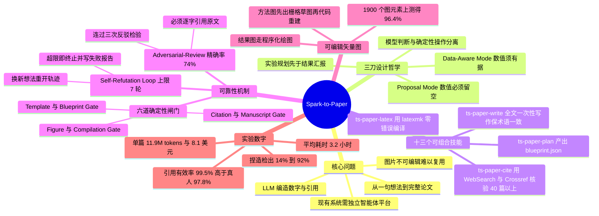

## 一、论文是干什么的？

想象你有一个想法：「用某种新的注意力机制去做轴承故障诊断」。从这句话到一篇能投稿的完整论文，中间要做的事情多得吓人——查文献、确认别人有没有做过、设计实验、跑实验、看结果、发现结果不支持你的假设、改方法、再跑、画图、排版、检查每一条引用是不是真的存在。这中间任何一环出错，整篇论文就废了。过去两年出现了不少「AI 科学家」系统想把这条流水线自动化，但它们几乎都要求你先搭一整套独立的智能体平台：调度服务、消息总线、状态数据库，一样不能少。

这篇论文提出的 **Spark-to-Paper**（直译「从火花到论文」）走了一条更轻的路：**它不造新平台，而是把整条流水线拆成十三个「技能」（skill），直接塞进你已经在用的编码助手里**。打个比方，别人是为了做一顿饭专门盖了一间中央厨房，而它是往你家现成的厨房里添了十三样趁手的工具——一把切菜刀、一个计时器、一台称重秤。你只要在命令行里丢进一句研究想法，它就顺着「规划 → 找引用 → 写作 → 精修 → 对抗评审 → 画图 → 编译 → 跑实验」的流程，最后吐出一个能用 LaTeX 编译通过的完整论文工程。作者报告的成绩是：引用有效率 $99.5\%$、图片可编辑率 $96.4\%$、平均每篇花 $8.1$ 美元、耗时 $3.2$ 小时。这篇论文在 Hugging Face Daily Papers 上拿到了当日第一。

## 二、核心方法与创新

### 2.1 第一刀：把「模型判断」和「确定性操作」切开

整个系统最根本的设计哲学是一句话：**凡是能被程序直接验证对错的事，就绝不交给大模型去判断**。

作者把论文生产中的工作分成两类。一类叫「模型判断」，比如这一节该怎么组织、这篇文献跟我的主题相不相关、这组实验数据到底能不能支撑我的结论——这些没有唯一正确答案，依赖上下文，只能让 LLM 来拿主意。另一类叫「确定性操作」，比如这个 DOI 到底存不存在、LaTeX 能不能编译通过、结果表里还有没有没填的占位符——这些有明确的对错判据，写成程序一跑就知道。

于是系统在每个阶段之间插了一排**确定性闸门**（deterministic gates），过不去就不许往下走：

| 闸门 | 检查什么 |
|---|---|
| Template Gate | 会议/期刊模板规范的结构是否合法 |
| Blueprint Gate | 规划出的论文蓝图是否符合投稿要求 |
| Citation Gate | 参考文献的标识符能否解析、元数据是否自洽 |
| Manuscript Gate | 有没有未替换的占位符、结果表结构是否合法、数值是否有据可依 |
| Figure Gate | 需要的图是否都存在、是否匹配其角色 |
| Compilation Gate | 组装好的 LaTeX 工程必须零错误编译通过 |

这一排闸门是整个系统可靠性的地基。用作者的原话：因为这些条件可以被直接陈述和验证，所以它们被实现为确定性程序，而不是模型判断。

### 2.2 第二刀：把「实验规划」和「结果汇报」切开

大模型写论文最臭名昭著的毛病是**编数字**——表格里的 $91.3\%$ 是它凭感觉写出来的，不是跑出来的。Spark-to-Paper 用一个很朴素但有效的办法治它：**在看到结果之前，先把「需要哪些证据」这件事定死**。

系统在入口处会先做「输入路由」，判定进入两种模式之一：

- **Proposal Mode**（提案模式）：输入里没有任何实测数据。这时系统可以设计实验、可以把结果表的**结构**搭出来（几行几列、每列是什么指标），但**表格里的数值必须留空**，不许生成。
- **Data-Aware Mode**（数据感知模式）：已经有实测结果。这时论文里每一句定量陈述都必须能追溯到那批数据。

这个模式标记会一路传播到下游所有阶段，并由前面说的 Manuscript Gate 强制执行。等到实验真的跑完了，系统再回过头来按照实测结果修订论断——是接受、是修正、还是干脆放弃这个说法。

### 2.3 第三刀：给「自我反驳循环」装刹车

这是本文提出的一个新概念，也是最有意思的部分。

**Self-Refutation Loop**（自我反驳循环）指的是这样一种失效模式：系统提出一个假设，设计实验去验证，跑完发现证据不足以支撑；于是它修改方法、改实验设计、再跑一轮；再次发现不支持；再改再跑……**它一遍遍地否定自己的结果，却始终不肯承认「这个想法可能本来就不成立」**，只是在同一个研究方向上原地打转。这就像一个人为了证明某条路能走通，反复换鞋、换背包、换出发时间，就是不肯抬头看一眼那条路的尽头其实是堵墙。

Spark-to-Paper 的处理办法直接而干脆：**把「实验—批判—修订」的循环上限设为 7 轮**。超过 7 轮研究目标仍然得不到支持，当前研究轨迹就地终止。系统会把原始想法、尝试过的方法与实验、观察到的结果、以及证据为何不足的原因全部写进一份**失败报告**，然后换一个新想法重开一条轨迹。换句话说，它把「这条路走不通」本身当作一种合法的研究产出保存下来，而不是硬凑一个成功。

### 2.4 两层评审：自审 + 对抗评审

- **Self-Review**（自审）是局部的：每次编辑之后，检查改动过的内容跟周围上下文是否还一致，防止改着改着前后矛盾。
- **Adversarial-Review**（对抗评审）是全文级的：多个**相互隔离**的评审通道从互补视角审稿，包括理论严谨性、实验设计、系统有效性等。关键约束是——**提出的问题必须逐字引用原文中的具体段落，并且要连续通过三次反驳检验才算成立**，才会触发修订。评审会一直迭代到「再多审一轮也审不出新的存活问题」为止。

这个「必须引原文 + 三次反驳」的设计是为了压制 LLM 评审最常见的毛病：泛泛而谈的假阳性意见。论文报告对抗评审的精确率为 $74\%$。

### 2.5 图：不是画出来的，是「写代码写出来的」

大部分 AI 写论文系统输出的图是位图（PNG），放大就糊，作者拿到手也没法改。Spark-to-Paper 坚持产出**可编辑的矢量图**，并且对两类图走两条完全不同的路径：

- **结果图**走「程序化绘图」：系统读取实验输出文件，直接写 matplotlib 之类的绘图代码，编译成矢量 PDF。数据从哪来一清二楚。
- **方法示意图**走「基于代码的重建」：先用图像生成模型出一张栅格草图当作视觉参考，然后系统迭代地调整布局、几何关系、文字位置和视觉元素，用 HTML 重建后再转成矢量 PDF。

可编辑率的评测方式是数「图元素」：在大约 1900 个真值图元素上统计有多少是真正可编辑的矢量对象（刻意设计为栅格的图被排除在外），得到 $96.4\%$。

### 2.6 十三个技能具体是哪些

论文正文按阶段描述，项目主页则给出了这十三个技能的实际名称：

`ts-paper`（总入口）、`ts-idea2story`（想法转叙事）、`ts-paper-plan`（规划蓝图）、`ts-paper-cite`（文献检索与核验）、`ts-paper-write`（全文写作）、`ts-paper-refine`（精修）、`ts-paper-review`（评审）、`ts-paper-figure`（配图）、`ts-paper-data`（数据处理）、`ts-figure-svg`（矢量图生成）、`ts-figure-optimize`（图优化）、`ts-paper-latex`（LaTeX 组装编译）、`ts-paper-experiment`（实验执行）。

流水线的八个阶段依次是：规划阶段产出 `blueprint.json`，里面含标题、关键词、三条核心贡献和逐节字数目标；引用阶段通过 WebSearch 与 Crossref 查询，凑齐 40 篇以上经核验的参考文献；写作阶段整体性地一次写出所有章节以保证术语一致；精修阶段执行字数区间约束并清除 AI 味的语言模式；评审阶段跑对抗评审；配图阶段生成可编辑矢量图；编译阶段用 `latexmk` 做零错误组装；实验阶段自动运行可行的实验并回填结果表。

## 三、使用了哪些模型和计算资源？

- **大模型**：系统运行在 **Claude Code** 之上，使用 **Claude 系列**中的某个模型。论文的评测部分**未披露具体版本号**。
- **图像生成模型**：方法示意图的初稿参考使用了图像生成模型，论文**未指明具体型号**。
- **GPU 型号与数量**：**暂无相关信息**。论文明确说明系统就跑在 Claude Code 内部，不需要额外的部署基础设施，因此全文没有给出任何 GPU 规格。
- **训练**：本工作不涉及模型训练，纯推理与工具编排。
- **单篇论文的完整开销**（8 篇论文的平均值与区间）：

| 指标 | Spark-to-Paper 全系统 | 单次直出基线 |
|---|---|---|
| Token 消耗 | 11.9M，区间 10.2M 到 13.7M | 0.11M，区间 0.09M 到 0.13M |
| API 成本 | 8.1 美元，区间 6.9 到 9.6 美元 | 0.66 美元，区间 0.55 到 0.76 美元 |
| 墙钟耗时 | 3.2 小时，区间 2.6 到 3.9 小时 | 16 分钟，区间 13 到 19 分钟 |

可以看到，全流程比单次直出**贵约 12 倍、慢约 12 倍、Token 多约 100 倍**。这个代价买到的是下一节的可靠性提升。

## 四、实验结果

### 4.1 主结果：跟单次直出和真人预印本比

评测在**八个外部选定的研究主题**上进行，引用有效性在 384 条参考文献上统计，图片可编辑性在约 1900 个真值图元素上统计。

| 指标 | Spark-to-Paper | 单次 LLM 直出 | 真人预印本 |
|---|---|---|---|
| 引用有效率 | 99.5% | 81% | 97.8% |
| 图片可编辑率 | 96.4% | 不适用 | 58% |
| 每篇成本 | 8.1 美元 | 0.66 美元 | 不适用 |
| 墙钟耗时 | 3.2 小时 | 16 分钟 | 不适用 |

大白话解读：**引用这一项，机器已经比人做得更干净了**——真人预印本里也有 $2.2\%$ 的引用是有问题的（写错卷期、DOI 对不上之类），而这套系统靠确定性闸门把错误率压到了千分之五。**图的可编辑性差距更夸张**：真人预印本里只有 $58\%$ 的图元素是可编辑矢量（很多人直接往论文里贴截图），而这套系统做到 $96.4\%$。而单次直出的 LLM，五条引用里差不多有一条是编的。

### 4.2 消融：每一层防护到底值多少钱

消融实验用了一个固定的**探针语料库：36 个人工植入的探针，覆盖十种失效家族**（论文未逐一列举这十种家族的名称），看不同配置能揪出多少捏造内容。

| 配置 | 捏造检出率 | 评审精确率 | Token 增量 | 成本增量 |
|---|---|---|---|---|
| 单次直出草稿 | 14% | 不适用 | 基准 | 基准 |
| 仅加确定性闸门 | 69% | 不适用 | +8.1M | +5.3 美元 |
| 闸门 + 自审 | 81% | 不适用 | +1.1M | +0.6 美元 |
| 全栈，含对抗评审 | 92% | 74% | +2.6M | +1.6 美元 |

这张表是全文最有说服力的一张。**性价比最高的一步是加确定性闸门**：一口气把捏造检出率从 $14\%$ 抬到 $69\%$，代价是 5.3 美元——虽然贵，但这一步买到的提升占了总提升的近七成。**自审是最便宜的**：只花 0.6 美元就再涨 12 个百分点。**对抗评审最后再补 11 个百分点，花 1.6 美元**。三层叠起来，$92\%$ 的植入捏造能被抓出来。

### 4.3 跟同类系统的横向对比

| 系统 | 引用有效率 | 图片可编辑率 | 耗时 |
|---|---|---|---|
| Spark-to-Paper | 99.5% | 96.4% | 3.2 小时 |
| AI Scientist / v2 | 91% 到 93% | 0% 到 3% | 暂无相关信息 |
| Agent Laboratory | 96% | 0% | 19 分钟 |

结论很清楚：**这套系统用慢换质**。Agent Laboratory 十九分钟就能出一篇，但它产出的图完全不可编辑；Spark-to-Paper 慢了十倍，换来的是引用几乎零错、图基本全可编辑，而且**不需要任何独立的智能体平台**。

### 4.4 演示样例

项目主页公开了七篇跨六个研究领域的端到端生成样例，涵盖轴承故障诊断（ICML 2025 官方模板）、慢性病筛查与叶片病害分类（NeurIPS 2025 官方模板）、PM2.5 预测、电力负荷预测、水气质量预测、叶片病害识别（Traitement du Signal 模板）。

## 五、潜在应用与已落地应用

### 已落地

- **开源技能包**：项目已在 GitHub 开源（[Spark-To-Paper-Skills/spark-to-paper-skills](https://github.com/Spark-To-Paper-Skills/spark-to-paper-skills)），另有[项目主页](https://spark-to-paper-skills.github.io/spark-to-paper-skills/)展示七篇完整生成样例。安装即用，不需要额外服务。
- **多模板适配**：已经跑通 ICML、NeurIPS 官方样式与 Traitement du Signal 期刊格式，说明模板闸门这套机制是可迁移的。
- **Hugging Face Daily Papers 当日第一**：说明社区对「把重活装进现成编码助手」这条路线的兴趣度很高。

### 潜在方向

- **不写全文，只做单点工具**：十三个技能是可组合的，完全可以只抽出 `ts-paper-cite` 当引用核查器用在人写的稿子上，或者只用 `ts-figure-svg` 把已有的位图示意图重建成可编辑矢量图。后者对赶 deadline 的研究者可能是最实用的一个模块。
- **投稿前的自动体检**：确定性闸门那一排检查（占位符残留、结果表结构、编译零错误、引用可解析）本质上是一套投稿前 checklist，可以独立部署成期刊或会议的预审工具。
- **教学与训练**：失败报告机制会完整记录「想法—方法—结果—为何证据不足」，这批负面轨迹对研究方法教学和对科研智能体的训练数据构造都有价值。
- **企业内部的技术报告流水线**：把「实验规划先于汇报」这条纪律搬到工业界的 A/B 实验报告上，可以强制杜绝先有结论再补数据的写法。

### 需要警惕的风险

论文本身**没有专门的局限性章节，也没有伦理讨论章节**。但这类工作天然带来两个问题：一是学术出版体系可能被低成本高质量的生成稿件淹没；二是 $92\%$ 的捏造检出率意味着仍有 $8\%$ 漏网，而这 $8\%$ 恰恰是最难被人眼发现的那部分。作者在第 5.3 节承认，对自我反驳循环的「设上限」只是一个工程折中，并非彻底解决，部分轨迹仍会以同样的方式失败。

## 六、网络上的讨论与评价

- **Hugging Face 论文页**：该论文被评为 **#1 Paper of the day**（8 月 13 日由作者 Wenhao Wang 提交）。截至综述时点赞数在 590 上下。
- **作者本人的推介**：提交者 WenhaoWang 在评论区写道，Spark-to-Paper 现已登上 Hugging Face Daily Papers，丢进一句研究想法就能得到一份端到端草稿，包含经核验的引用、自动运行的实验和可编辑矢量图。
- **Librarian Bot 自动推荐**：Hugging Face 的机器人列出了若干相似工作，包括 StructureClaw、From Prompts to Contracts、LeanFlow、ORAgentBench、CodeTeam、ICAE-Bench、EvoClawBench，全部是 2026 年的智能体与工作流方向论文。这从侧面反映出「把智能体能力做成可审计的工程化工作流」是当前一个密集的研究簇。
- **收录情况**：该论文被 6 个 Hugging Face collection 收录，主题分别为 Planning、Skill、Applications and Uses、auto-research 等。
- **X/Twitter、Reddit、Hacker News、知乎的独立讨论**：经多轮英文与中文关键词检索，**暂无相关信息**。这类工作通常会引发关于「AI 灌水」的争议，但截至 2026 年 8 月 16 日，公开可检索到的讨论仍集中在 Hugging Face 论文页内部，尚未看到平台外的成规模争论。搜索中确实能看到一批社区自制的 Claude Code 学术写作技能包（如 academic-writing-skills、Skill-Research-Figure 等），说明「用编码助手技能做论文流水线」这个方向在中文开发者社区已有自发的平行实践，但它们与本文并无直接引用关系。

## 七、思维导图

