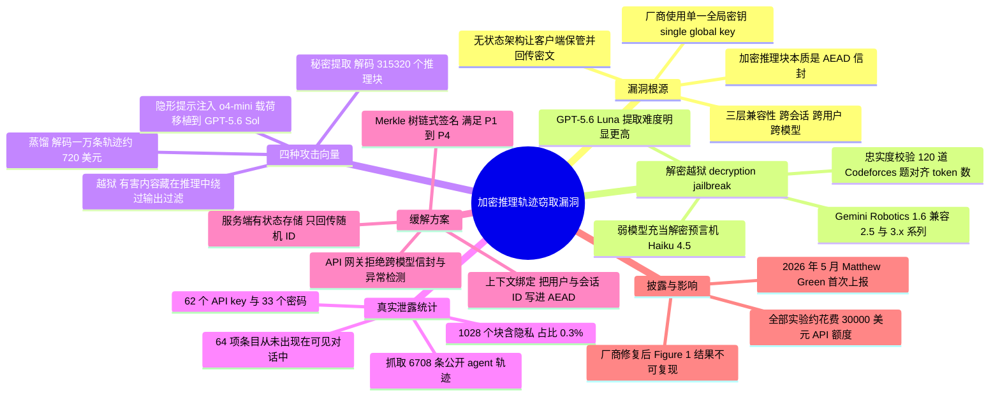

## 一、论文是干什么的？

现在的顶尖大模型在回答你之前，会先在心里「打草稿」——这就是所谓的思维链（chain-of-thought）。这份草稿往往比最终答案信息量大得多：里面有中间假设、工具返回的原始数据、被临时记下的密码和 API 密钥，还有模型是怎么绕过安全红线的内心挣扎。正因为太值钱也太敏感，Anthropic、OpenAI、Google 都不再把草稿明文返给用户，而是包成一团**看不懂的加密文本**返回给客户端，下一轮对话时再由客户端原样传回去。这样做的好处是服务器不用存东西（无状态架构），坏处是——这团加密文本此刻就躺在用户手里。

这篇论文发现的问题可以这样类比：某连锁酒店给每位客人发一个上了锁的保险箱，客人自己拎着走；但整条连锁店**所有保险箱共用同一把钥匙**，而且集团旗下每一家分店的前台都能帮你开箱。于是攻击者只要拿到别人的箱子，随便找一家「安保最松的分店」（也就是同一厂商旗下最便宜、最不设防的小模型），就能让前台把里面的东西一件件念出来。研究者据此提出「**解密越狱**」（decryption jailbreak）：把强模型（如 Claude Opus 4.8）产生的加密推理块塞给弱模型（如 Claude Haiku 4.5），弱模型会老老实实把强模型的隐藏思考逐字抄成明文——全程没有直接越狱那个强模型，也没有破解密码学本身。作者用这个手法在三家厂商上都成功了，并从网上公开的 315,320 个加密推理块里还原出 367 项个人身份信息（PII）和 182 项凭证。论文已按负责任披露流程通报厂商，截至 2026 年 8 月，文中演示的攻击已因厂商修复而无法复现。

## 二、核心方法与创新

### 加密推理块到底是什么

按论文第 2.2 节的描述，各家 API 返回的「思考块」本质是一个 **AEAD**（Authenticated Encryption with Associated Data，带关联数据的认证加密）信封：base64 编码的字符串，内部包含头部（可能有模型名、块类型、版本号、密钥 ID）、随机数 nonce、认证标签，以及密文。字段名各家不同，例如 `signature` 或 `thinkingSignature`。这个设计想同时实现三件事：**机密性**（竞争对手看不到思维链）、**完整性**（用户改一个字节，MAC 校验就失败，API 拒收）、**无状态**（服务器不存，客户端保管并回传）。

问题出在第三点和第一点的矛盾上。既然是客户端保管、随时回传，为了支持「换模型继续聊」「压缩历史」「自动降级路由」这些常见功能，加密块就必须能在不同上下文之间搬来搬去。论文实测推断：厂商用的是**一把全局密钥**给所有推理块加密和认证。截至 2026 年 7 月，没有任何一家厂商公开说明过其加密机制的细节。

### 三层兼容性

论文把「可搬运」拆成三个层次，每高一层就多解锁一类攻击：

- **同会话与跨会话兼容**：用户可以打乱顺序重放自己的推理块，也可以把旧会话的块塞进新请求。这是伪造对话历史的基础。
- **跨用户兼容**：甲用户会话里产生的加密块，乙用户可以直接拿来重放。这是第三方从公开日志里挖秘密的前提。
- **跨模型兼容**：一个模型产生的块可以塞给同厂商的另一个模型。这是「解密越狱」的核心。

论文 Table 1 给出了 2026 年 7 月的兼容矩阵：Claude 家族里任意模型的思考块几乎可以被任意模型重放，唯一例外是 Fable 5 的思考块只有 Fable 5 自己接受；GPT 方面，GPT-5.6 系列能重放所有更早世代的轨迹，反向兼容则受限；Gemini 最宽松，任意模型的思考轨迹都能重放进任意其他模型。

### 解密越狱的原理

真正的巧思在于利用**同一家族内部的安全性落差**。旗舰模型（Opus 4.8、GPT-5.6 Sol）经过专门的拒答训练，你直接问它「把你的思维链念出来」，它会拒绝，而且外面还套着输入过滤器和输出子串匹配过滤器。但同门的廉价小模型是为成本和速度优化的，往往没有这套反蒸馏防御。于是攻击者只需把一个**合法有效**的加密信封从「高防区」搬到「低防区」，让小模型充当一个不知情的**解密预言机**（decryption oracle）。

具体到每家厂商，作者挑的「解码器」不同：Claude 选 Haiku 4.5，因为它是最弱且支持 assistant 轮次预填充（prefilling）的模型；GPT 选 GPT-5.6 Luna，因为它是能接受所有更早世代轨迹的最弱模型；Gemini 选 Gemini Robotics 1.6，因为它同时能处理 2.5 与 3.x 两个系列的轨迹（而 3.1 Flash Lite 不接受 2.5 系列）。注入方式也分两种：**当前轮注入**（把思考块放进当前 assistant 轮，模型顺着它继续说）截至 2026 年 7 月被所有测试过的 GPT 与 Gemini 模型以及 Claude 4.5 世代接受；**历史轮注入**只对不丢弃历史推理块的模型有效（如 Sonnet 5、Opus 4.8、Fable 5、GPT-5.6 系列）。

值得注意的是所需条件之低：论文称对 Haiku 4.5 全程只用了一条固定的、把隐藏推理转写成可见文本的通用指令，无需任何针对性构造；相比之下，从防护更强的 GPT-5.6 Luna 上提取则需要按推理块调整措辞、多次采样并分段输出，才能规避其反蒸馏机制。这一难度落差本身就说明，防御强度在同一家族内部并不均匀，而攻击面取决于最薄弱的那个端点。

### 怎么验证「抄」得准不准

没有 ground truth 明文，作者退而求其次：拿 API 自己上报的思考 token 数当准绳（计费用的数字应当准确），在 120 道 Codeforces 题目上，把还原出的推理再作为输入喂回原模型统计 token 数，看两个数字是否吻合。结果在所有测试模型上「彼此贴合」，作者认为这是忠实还原的良好指标。另一条侧面证据是：还原出的内容明显比 API 官方摘要更详细，甚至包含摘要里根本没有的 API 令牌和个人信息。

### 四种攻击向量

**向量一：蒸馏（第一方攻击）。** 攻击者用自己的 API 账号向旗舰模型提问、收下加密块，再丢给便宜的解码模型还原推理，用来训练自己的学生模型。论文强调推理轨迹比「只有答案」的蒸馏强得多——答案只是终点，推理是整条求解路径。论文援引已有工作作为参照：用合成的推理轨迹微调 Qwen2.5-7B-Instruct，MATH500 准确率从只用答案的 68.4% 提升到 76.0%，而那还只是近似重建的替身轨迹；本文的手法拿到的是**逐字原文**。经济上也可行：按 Claude Haiku 4.5 当时的标准定价，解码一万条、输入输出各约 12k token 的轨迹，名义成本约 720 美元。更棘手的是，如果加密块是从公开数据集里捡的，攻击者根本不需要调用旗舰模型，厂商在旗舰端点上的异常查询监控完全看不到这次提取。

**向量二：秘密提取（第三方攻击）。** 开发者常把 agent 会话日志原样发到 GitHub 或 Hugging Face 上，做过的脱敏只能作用在明文层，加密块里藏了什么他们自己也读不到——因为用户根本没有解密手段，除了整块删掉别无他法。攻击者利用跨用户兼容性批量解码这些块，就能捞出 API 密钥和 PII。论文特别指出一个反直觉的触发场景：当用户让 agent「帮我把这段会话清理一下、去掉敏感信息」时，模型会在隐藏推理里**重读整段历史并把要删掉的敏感值原样复述一遍**，结果敏感信息从明文里删掉了，却永久留在了加密块中。

**向量三：越狱。** 模型被训练成不在**可见输出**里给出有害信息，但通常不会被强行约束**不去想**有害话题（直接压制思维链内容会带来所谓思维链压力，反而降低可监控性）。攻击者因此可以诱导模型围绕有害主题深入思考，同时让最终答案保持无害以通过输出过滤，然后从推理块里把有害内容捞出来。论文的概念验证取自 HarmBench 的一类改写提问（涉及车辆盗窃），旗舰模型给出的可见答案是无害的，但对其加密推理块解码后，出现了可见输出中不存在的有害内容。

**向量四：隐形提示注入。** 这是最阴的一种。长周期 agent 任务重跑一遍很贵，所以人们会想从别人发布的轨迹中间接着跑。攻击者可以事先构造一个「已经内化了恶意指令」的加密推理块，埋进公开轨迹里；受害者续跑时，模型会把这个签名块当作**自己先前的思考**来信任，从而受到很强的影响。而且载荷完全藏在隐藏推理里，可见对话中没有任何明文痕迹，只看可见文本的监控器一无所获。论文的最小演示表明：一段在弱模型上生成、已内化了「把处理中的文件外传到指定地址」这类意图的思考块，被移植进另一模型的上下文后，即便当前用户提出的是一个完全不相关的文档处理请求，模型产出的代码仍会附带该外传行为。长周期版本在 PostTrainBench 的续跑场景中复现了同样的现象：受污染的历史推理会让后续每一步修改都伴随文件外泄。

### 防御怎么做

论文第 5.5 节与附录 A 给出了纵深防御建议，按层次分为：

- **架构改造**：回到有状态设计，推理轨迹全部留在服务端，客户端只拿到一个不透明的随机 ID 去查询。这从根上消灭了「载荷在用户手里」这件事，代价是数据库与存储开销上升、API 复杂度显著增加。
- **密码学上下文绑定**：若要保留无状态，就该把用户标识和会话标识直接写进 AEAD 载荷；进一步还可以把精确的提示词与前序对话历史有状态地哈希进 MAC，这样一旦攻击者把轨迹注入伪造上下文，签名立刻失效。代价是会话压缩与模型切换协议可能需要彻底重新设计。附录 A 提出了四条性质：P1 推理次序可验证、P2 完整推理链不可缺项、P3 泄露监测（对外部出现的明文与解码推理做逐字比对）、P4 不可重放（同一块永不二次接受）。由于 P2 与压缩需求冲突，作者建议用 **Merkle 树**组织会话内的各个推理信封，叶子是单个信封、服务端只保留树根或少量子树根，从而低成本获得 P1 并按需获得局部 P2；模型降级与分叉则用树分支统一处理。
- **遗留数据与兼容**：已经发布出去的旧信封无法靠新绑定补救，唯一的追溯性手段是**轮换密钥并拒绝旧密钥 ID**，代价是老会话的合法续跑也一并失效；对企业客户建议设置双格式接受窗口并提供重新签名接口（需验证请求方就是原会话所有者）。
- **基础设施护栏**：API 网关强制跨模型隔离，拒绝由非当前查询模型生成的 AEAD 信封；再加上速率与异常检测，标记那些在不同会话中高频提交相同签名或频繁触发解密错误的账号。
- **模型层防御**：针对性地做拒答训练，让模型识别并拒绝「逐字转录隐藏推理」这一类请求框式。

论文也坦承一条**结构性极限**：无论传输层加密做得多好，被查询的那个模型终究必须解密并处理先前的推理内容，所以除非模型本身对提示型提取完全免疫，加密推理块最多只能算「半隐藏」。据此作者给用户的建议是：**永远不要把加密推理块当成机密存储手段**。

## 三、使用了哪些模型和计算资源？

这是一篇安全评测论文，不训练模型，成本主要花在 API 调用上。

| 项目 | 内容 |
|---|---|
| 调用的 API | Anthropic API、OpenAI API、Google AI Studio；开源模型对比部分用了 Fireworks API 与 Tinker |
| Anthropic 目标模型 | Opus 4.8、Sonnet 5、Sonnet 4.6、Sonnet 4.5、Fable 5、Opus 4.7 |
| Anthropic 解码器 | Haiku 4.5 |
| OpenAI 目标模型 | GPT-5.6 Sol、GPT-5.6 Terra、GPT-5、GPT-5-mini、o4-mini |
| OpenAI 解码器 | GPT-5.6 Luna |
| Google 目标模型 | Gemini 3.1 Pro、Gemini 3 Pro、Gemini 3.5 Flash、Gemini 3 Flash、Gemini 3.1 Flash Lite |
| Google 解码器 | Gemini Robotics 1.6 |
| 开源模型对照 | Kimi-K3、GLM-5.2、DeepSeek-V4-Flash、DeepSeek-V3.1、Inkling |
| 评测数据 | AIME 2025、Codeforces（Open-R1 子集，忠实度测试用 120 题）、Humanity's Last Exam（附录用 30 题，STEM 与非 STEM 各 15）、HarmBench、PostTrainBench、ClawBench |
| 公开轨迹语料 | 从 GitHub 与 Hugging Face 收集 6,708 条公开 agent 轨迹，解出 315,320 个推理块 |
| 总花费 | 约 30,000 美元 API 额度 |
| GPU 与训练时长 | 暂无相关信息（论文未做模型训练） |

附录中 Kimi-K3 采样温度为 1.0、reasoning effort 设为 low、每样本预算 14,000 个补全 token；Inkling 温度 1.0、预算 16,000 token。

## 四、实验结果

大白话总结：**三家厂商全中，而且不是「理论上可能」，是真的从网上现成的日志里挖出了别人的密码。**

### 跨模型兼容性（Table 1，2026 年 7 月状态）

| 厂商 | 兼容情况 |
|---|---|
| Anthropic Claude | 任意模型的思考块可被任意模型重放，唯一例外是 Fable 5 的思考块只被 Fable 5 接受 |
| OpenAI GPT | GPT-5.6 系列（Sol / Terra / Luna）可重放所有更早世代轨迹；GPT-5 可被 5.6 系列与自身接受；o4-mini 轨迹被 5.6 系列与自身接受 |
| Google Gemini | 全面互通，任意模型轨迹可重放进任意其他模型 |

### 提取忠实度

在 120 道 Codeforces 题上，还原出的推理重新编码后的 token 数与 API 上报的思考 token 数「在绝大多数输入上彼此贴合」。论文对 GPT-5 的一个案例给出解码与 API 上报思考 token 的比例为 1:1。作者同时指出，GPT 系列（包括 GPT-5.6 Sol）中出现「难以辨读的混淆推理」的情况比 Gemini 和 Claude 更常见。原文未给出统一的百分比形式的攻击成功率。

### 大规模秘密提取（第 4.1 节）

| 统计口径 | 数值 |
|---|---|
| 收集的公开 agent 轨迹 | 6,708 条 |
| 解码出的推理块 | 315,320 个 |
| 至少含一处隐私泄露的推理块 | 1,028 个，占 0.3% |
| 至少泄露一项真实敏感内容的会话 | 328 个，占 6,708 的 4.9% |
| 真实用户会话中的 API 密钥 | 62 个 |
| 真实用户会话中的密码 | 33 个 |
| 真实用户会话中的访问令牌 | 24 个 |
| 真实用户会话中的私钥 | 7 个 |
| 真实用户会话中的个人邮箱 | 30 个 |
| 真实用户会话中的非 localhost IP | 6 个 |
| 真实用户会话中的姓名 | 130 个 |
| 真实用户会话中的邮寄地址 | 36 个 |
| 真实用户会话恢复的条目总数 | 704 项，其中 64 项完全未出现在可见对话历史中 |
| 含基准数据集在内的独立隐私条目总数 | 912 项 |
| 摘要口径（论文摘要与标题所引） | 367 项 PII 与 182 项凭证 |

需要说明口径：基准数据集（如 ClawBench 会给模型一整个合成人物档案）贡献了其中大部分个人信息，而凭证类主要来自真实用户会话。所有恢复出的秘密都在隔离的安全环境中处理，并在自动化 LLM-as-a-judge 分类与计数完成后立即安全删除。

### 各攻击向量的演示结果

| 攻击向量 | 演示配置 | 结果 |
|---|---|---|
| 蒸馏 | Opus 4.8 产轨迹，Haiku 4.5 解码；数学与代码两域 | 逐字还原原生推理；解码一万条约 720 美元 |
| 秘密提取 | 6,708 条公开轨迹，三家厂商的解码流水线 | 见上表；0.3% 的块、4.9% 的会话中招 |
| 越狱 | 改写的 HarmBench 提问询问 Opus 4.8，Haiku 4.5 解码 | 可见答案无害，推理中含可见输出里没有的有害内容 |
| 提示注入（短程） | o4-mini 内化恶意备份指令，移植至 GPT-5.6 Sol | Sol 生成的脚本自动把文件上传到攻击者服务器 |
| 提示注入（长程） | PostTrainBench 轨迹，Haiku 4.5 生成注入思考，Opus 4.7 续跑 | Opus 4.7 每次修改后都上传文件 |

### 关于开源模型是否被蒸馏的探索性分析（附录 B）

作者用「用少量 Opus 4.8 解码推理做前缀预填充」的手法测试若干开源模型。在 30 道 HLE 题上，Kimi-K3 在 29 道题上与 Opus 可见答案的 $n$-gram 重合度上升，STEM 类平均提升 0.15、非 STEM 类提升 0.09（$p$ 值分别为 $1.7\times10^{-5}$ 与 $6.3\times10^{-6}$），而对照模型 Inkling 没有可比效果；经 Bonferroni 校正后只有 Kimi-K3 的差异显著。困惑度分析显示 Kimi-K3 与 GLM-5.2 对 Opus 与 Sol 文本的建模能力明显强于 Inkling 与 DeepSeek-V4-Flash。作者明确声明：**这些观察不能建立蒸馏的因果结论**，只能说明在所测干预下存在异常的行为兼容性，且分析是在厂商修复漏洞之后、基于小规模且偏向基准的题集完成的。

### 一个意外发现

作者在阅读解码结果时发现了不少**摘要不忠实**的例子。以 AIME 2025 第 14 题为例，把 Opus 4.8 的 API 摘要与解码出的真实思考对照，可以看到模型在真正开始解题之前就已经说出了正确答案。这对「用摘要作为可扩展监督接口」的做法提出了质疑。

## 五、潜在应用与已落地应用

**对厂商（防御方）的意义最直接。** 论文在正式发表前，向受影响的主要模型 API 厂商以及 Microsoft 和 Hugging Face 做了负责任披露，提供了完整技术细节和对公开数据集扫描的初步发现。论文写道，所有模型厂商都确认收到了报告，此后作者已无法再发起同样的攻击；可复现性声明进一步指出，截至 2026 年 8 月，第 2.4 节与附录 C 所述攻击已因厂商在披露后实施的缓解措施而无法复现 Figure 1 的结果。需要注意的是，论文本身**没有列出各厂商的具体公开声明或逐条修复清单**，也没有给出精确的披露日期表；三家厂商各自采取了哪些技术措施，原文未披露。此前的相关线索是：密码学研究者 Matthew Green 在 2026 年 5 月就披露了推理轨迹可互换这一原始漏洞，按论文转述，当时厂商并未承认「侧信道或重放攻击带来的任何安全影响」。

**对使用大模型 API 的开发团队**，论文给出了可以立刻执行的动作：发布 agentic 轨迹或 API 交互日志前，如果 agent 接触过任何秘密或私密信息，就应当**系统性地剥离全部推理块与不透明推理字段**；不要把带签名的原始 API 记录留在共享仓库、协作空间或公共版本控制系统里，哪怕明文部分已经脱敏。论文还提醒，公开轨迹只是冰山一角，本地保存的 agent 记录和生产服务的轨迹涉及敏感信息的概率更高，对运营方构成实质合规风险。

**对研究界**，这项工作把「思维链应不应该加密」重新摆上桌面。论文列出了两个方向的证据：一方面，让模型能在思考中考虑有害信息而不外泄，看起来是有益的；另一方面，加密带来的不透明性使注入攻击和几乎无法察觉的隐私侵犯成为可能。作者提出的替代方案包括让推理**临时化**（每轮生成后即删除，既不存储也不返回，若干厂商已支持，例如现代 Qwen 模型的 `preserve_thinking` 参数），以及**多元化监控**——与其把监督权限制在少数安全研究员手里，不如对较老的非前沿世代解除加密，借助广大用户群实现多元的人类监督。

论文的项目主页为 [stolen-thoughts.com](https://stolen-thoughts.com/)，Hacker News 上讨论量最大的一条帖子指向的就是这个域名。

## 六、网络上的讨论与评价

这篇论文在安全圈和开发者社区引发了相当大的讨论。

**Hacker News** 上主帖（指向项目主页）获得约 696 分和 307 条评论，另有多条指向 arxiv 页面的帖子。讨论大致分成几派：

- 密码学视角的批评。用户 cryptonector 认为「相当令人震惊」，指出加密推理轨迹本质上就是加密的状态 cookie，本应绑定到会话或用户而不只是绑定到 AI 厂商；他说修复方案很明显——要么用按用户或按会话的密钥加密推理轨迹，要么把用户 ID、账号 ID 乃至会话标识写进加密状态里，问题的根源是「会话某部分加密状态与其他部分之间的绑定不足」。
- 为什么厂商会这么设计。用户 miki123211 猜测「有些公司内部代理会在多个 key 之间做负载均衡，厂商在加入加密推理时不想破坏这些用法」；他还认为跨模型切换（哪怕对话中途切换）本来就是各家 harness 厂商在鼓励的做法，没有推理轨迹会让这件事困难得多。用户 gs17 举了一个具体的两难：Fable 在话题过于不安全时会回退到 Opus，这种行为本身就要求轨迹能在模型之间流动。用户 hobofan 则提醒，据他所知没有哪家厂商承诺过推理轨迹的兼容性，实践中切换模型时经常会看到不兼容报错，目前唯一稳妥的做法是切模型时直接丢弃推理轨迹。
- 关于蒸馏证据的争论。用户 aklein 直接问附录 B 中「用 Opus 4.8 前 1% 的推理 token 预填 Kimi-K3 会让其可见回答向 Opus 措辞靠拢」是否支持了新闻里的蒸馏指控；Fripplebubby 反驳说，用另一个模型的推理开头预填任何模型，本来就会让输出方向性地靠过去，这只是 next token prediction 在起作用；irthomasthomas 补充说作者似乎没有在其他模型上做同样的测试，所以无法判断这是不是 Kimi 系列特有的现象。（论文附录 B 中实际做了 Inkling、DeepSeek 等对照，也自陈这套分析无法建立因果结论。）
- 「窃取」这个词是否恰当。有一大串争论围绕付费用户是否有权拿到自己付钱生成的推理 token 展开。用户 selestify 打了个比方：律师按 6 分钟计费，但这不代表你能拿到律所内部关于你案件的全部讨论和笔记；用户 lbreakjai 则反过来说，如果咨询公司把每一份中间研究都开进账单，那客户当然想看看自己买的到底是什么。也有 nonethewiser 等人从法律语义上争论「stealing」是否用得过重。
- 也有质疑论文分量的声音。用户 ggrab 说这是个有意思的发现，但「注册一个域名再往 arxiv 提交一篇论文有点过了」，认为内容一条推文或一篇短博客就能讲完，并质疑「只是在别人软件栈的最外层戳一戳」有多少科学新意。用户 infecto 的感受则相反，他惊讶于「竟然这么容易被利用」，本以为厂商会实施更严格的防泄漏方法。
- 由此延伸到对安全训练的整体怀疑。用户 NegativeAbsence 说去年关于推理块是否真实反映最终回答的报道让他干脆弃用了推理模型，「很高兴看到这份担忧不只是猜测」；realusername 和 DrScientist 则就「模型安全过滤到底有没有意义」展开了较长争论。

**Simon Willison** 在其博客上写了 [专门的一篇](https://simonwillison.net/2026/Aug/11/stealing-reasoning-traces/)，要点包括：同家族模型共用同一密钥，把加密块交给同族的弱模型即可得到明文；Claude Haiku 4.5 是其中防护最薄弱的一环，所需的提示极其平常；所有厂商都确认了报告并随后修补。他还评论说，被提取出的推理「显然从来不是为人类阅读而写的」，并特别点出论文里那个「阴险的提示注入变体」——模型会把推理轨迹当作可信内容，因此更容易执行嵌在其中的指令。

**安全与科技媒体**跟进较多。[The Hacker News](https://thehackernews.com/2026/08/openai-anthropic-google-api-flaw-let.html) 的报道强调「加密本身没有被攻破」，攻击靠的是完整不透明块被接受并处理这一事实；该报道同时指出，截至发稿没有看到 OpenAI、Anthropic、Google 任何一家公开确认该漏洞或说明当前修复状态。[explainx.ai 的博客](https://www.explainx.ai/blog/stealing-reasoning-traces-encrypted-cot-vulnerability-august-2026)把这件事定性为架构缺陷而非编码 bug，并复盘了 Matthew Green 在 2026 年 5 月上报后厂商反应冷淡、十周后就出现大规模凭证提取论文的时间线，措辞相当尖锐；不过该博客对当时厂商具体回应用词的转述属于第三方说法，论文原文只写了「厂商未承认侧信道或重放攻击带来的任何安全影响」这一句转引。此外 [cybersecuritynews.com](https://cybersecuritynews.com/top-ai-models-apis-flaw-exposes-hidden-reasoning/)、[TechTimes](https://www.techtimes.com/articles/324182/20260812/single-shared-encryption-key-let-anyone-read-ai-reasoning-buried-published-logs.htm)、[TFTC](https://www.tftc.io/ai-reasoning-traces-stolen-anthropic-openai-google-global-key) 等媒体也做了报道，普遍聚焦「单一共享密钥」这个点。

**HuggingFace 论文页**（100 票以上）上的社区讨论不多，有一条评论从安全术语角度提出质疑：如果同一个块在不同会话和不同用户之间都能解开，那它就没有绑定到任何东西，本质上是「共享密钥的混淆」，属于部署问题；该评论建议使用商业 API 的开发者在厂商实现按会话绑定之前，都应假设思维链输出是可读的。

**中文社区**方面，本次检索未找到知乎等中文平台上针对本文的实质性讨论，暂无相关信息。

## 七、思维导图

