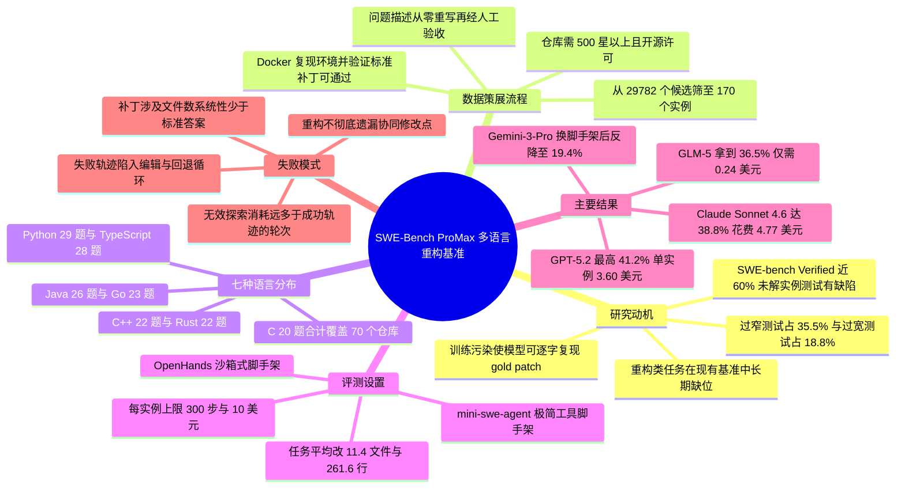

## 一、论文是干什么的？

如果把过去几年的「AI 写代码」比赛想象成一场体育赛事，那么 SWE-bench Verified 就是那条被跑了无数遍的标准跑道。问题在于，跑道本身出了毛病：一次审计发现，在模型解不出的那些题目里，**将近 60% 的实例带着有缺陷的测试**——要么测试写得太死，把功能上完全正确的改法也判成错（过窄测试，占 35.5%）；要么测试管得太宽，去检查题面里根本没提的行为（过宽测试，占 18.8%）。更尴尬的是，前沿模型已经能把标准答案补丁（gold patch）逐字背出来。这就像一场考试，题目泄露了，判卷标准还是错的，分数再高也说明不了什么。

这篇被 COLM 2026 收录的论文提出的 SWE-Bench ProMax，就是想重新修一条干净且更难的跑道。它选的项目不是「修 bug」，而是「**重构**」——在不改变程序对外行为的前提下，把代码结构改好。这件事之所以适合当考题，是因为它天然要求「牵一发而动全身」：你把一个接口改名，就得把所有调用它的地方一起改对，漏掉一处程序就崩。论文从七种语言（Python、Java、TypeScript、Go、C、C++、Rust）的真实提交中，人工策展出 170 个实例，平均每题要改 **11.4 个文件、261.6 行代码**，规模远超以往的同类基准。结果是：最强的前沿模型也只解决了 41.2%——跑道还远远没有被跑满。

## 二、核心方法与创新

ProMax 的核心贡献不在模型，而在「怎么造一套靠得住的题」。整个策展流程分三个阶段，从 **29,782 个候选提交**一路筛到最终的 170 个实例，留存率不到千分之六。

**第一阶段：数据采集。** 通过 GitHub API 抓取候选仓库，硬性门槛是至少 500 颗星、且采用经批准的开源许可（MIT、Apache 2.0、BSD 等）。时间上只取 2025 年 1 月之后的提交，目的很直白——尽量避开现有模型训练语料的覆盖范围，降低污染风险。提交信息里必须包含 refactor 一类的关键词，同时排除 bug fix 一类的关键词，确保拿到的确实是「重构」而非「修 bug」。

**第二阶段：环境构建。** 每个候选实例都要在「重构之前」的代码状态上搭出可复现的 Docker 环境。这一步淘汰率很高：环境搭不起来的丢掉，标准答案补丁打上去之后测试仍然跑不过的也丢掉。这保证了每道题至少存在一个已被验证可行的解。

**第三阶段：过滤与题面重写。** 这是论文着墨最多、也最能回应「基准质量危机」的一环，包含四个子步骤：

1. **提交分析**：借助大模型辅助解析每个提交到底做了什么改动、涉及哪些模块。
2. **质量过滤**：删掉只改动单个文件的任务（跨文件协同才是重构的难点所在），同时清洗测试集。这里给出了两条明确的判定标准——「**过窄测试**」是那些「强制要求特定实现细节而非行为结果」的测试，比如断言某个内部变量叫什么名字；「**过宽测试**」是那些「检查了超出本次重构范围之外的行为」的测试。两类都会把一个合格的解误判为失败或让评测失去针对性，所以由人工审阅逐条剔除。
3. **题面从零重写**：不直接复用原始 issue 或提交信息，而是重新撰写一份「精确、自洽的规格说明」。因为真实仓库里的 issue 常常语焉不详，模型答不对未必是能力不足，可能只是没猜到作者想要什么。
4. **人工验证**：最终的验收准则被论文写成了一句近乎公理的话——描述必须完整地指明这次重构要做什么，且测试**当且仅当**重构被正确实施时才通过。

七种语言的最终分布如下，共来自 70 个仓库：

| 语言 | 实例数 | 仓库数 |
|---|---|---|
| Python | 29 | 18 |
| TypeScript | 28 | 2 |
| Java | 26 | 11 |
| Go | 23 | 16 |
| C++ | 22 | 9 |
| Rust | 22 | 5 |
| C | 20 | 9 |

规模统计上，平均每个实例修改 11.4 个文件、261.6 行代码，最大的实例涉及 244 个文件、4,503 行代码；重写后的问题描述平均 685.3 个 token，标准答案补丁平均 8,179.5 个 token。论文在对比表中把自己与 HumanEval、SWE-bench、SWE-bench Verified、Multi-SWE-bench、SWE-PolyBench 等并列，指出 ProMax 是唯一同时满足「可执行验证、仓库级、多语言、面向重构、平均改动超过 5 个文件、专家策展」六项的基准。

## 三、使用了哪些模型和计算资源？

评测在两套开源智能体脚手架（agent scaffold）上进行：

- **mini-swe-agent**：SWE-agent 的极简重实现，只提供文件查看、编辑、搜索和 bash 执行这几种最基本的工具。
- **OpenHands**：一个开放的智能体平台，提供沙箱化的命令执行环境和结构化的文件编辑工具。

两套脚手架统一设定为每个实例最多 **300 步**、成本上限 **10 美元**。

参评的前沿模型共 6 个，分为闭源与开放权重两类：闭源为 GPT-5.2、Claude Sonnet 4.6、Gemini-3-Pro；开放权重为 GLM-5、Qwen3.5、Kimi-K2.5。论文报告的是通过 API 调用产生的美元成本，未提及自建 GPU 集群的规模；整体评测的总墙钟时长也未在文中给出，只逐模型给出了平均步数与平均单实例成本（见下节表格）。

成本侧最值得注意的结论是：**更贵并不等于更强**。在 OpenHands 下，Claude Sonnet 4.6 平均跑 117.9 步、花费 4.77 美元，解决率 38.8%，反而低于花费 3.60 美元的 GPT-5.2（41.2%）；而开放权重的 GLM-5 用每实例仅 0.24 美元就拿到 36.5%，约为 Claude Sonnet 4.6 的二十分之一成本。

## 四、实验结果

大白话总结：这套题很难，最强的模型也只做对了四成出头；而且「换个脚手架」带来的分数变化，有时候比「换个模型」还大。

**mini-swe-agent 脚手架下：**

| 模型 | 解决率 | 平均步数 | 平均成本（美元） |
|---|---|---|---|
| Claude Sonnet 4.6 | 30.6% | 99.5 | 2.32 |
| Gemini-3-Pro | 26.5% | 58.0 | 0.60 |
| Kimi-K2.5 | 26.5% | 85.3 | 0.37 |
| GLM-5 | 22.9% | 108.9 | 0.10 |
| GPT-5.2 | 21.8% | 25.2 | 0.19 |
| Qwen3.5 | 20.6% | 155.4 | 0.93 |

**OpenHands 脚手架下：**

| 模型 | 解决率 | 平均步数 | 平均成本（美元） |
|---|---|---|---|
| GPT-5.2 | 41.2% | 115.1 | 3.60 |
| Claude Sonnet 4.6 | 38.8% | 117.9 | 4.77 |
| GLM-5 | 36.5% | 114.2 | 0.24 |
| Qwen3.5 | 36.5% | 141.2 | 0.78 |
| Kimi-K2.5 | 32.9% | 99.6 | 0.72 |
| Gemini-3-Pro | 19.4% | 51.2 | 1.49 |

几个直观的观察：

- **脚手架的影响巨大。** 除 Gemini-3-Pro 外，所有模型从 mini-swe-agent 换到 OpenHands 后都明显提升，GPT-5.2 从 21.8% 直接跳到 41.2%。而 Gemini-3-Pro 反向下降（26.5% 到 19.4%），说明模型与工具接口之间存在明显的适配性差异。GPT-5.2 在 mini-swe-agent 下平均只跑 25.2 步就停手，与它在 OpenHands 下的 115.1 步形成鲜明对比，很可能是「过早收工」拖累了成绩。
- **语言之间差距悬殊。** C 语言是普遍的高分项（GPT-5.2 在 OpenHands 下达 75.0%），而 Python、Java、Go 这类训练语料丰富的主流语言反而偏低（GPT-5.2 的 Java 只有 19.2%）。TypeScript 波动最大：Claude Sonnet 4.6 在 OpenHands 下拿到 53.6%，Gemini-3-Pro 却是 0.0%。
- **开放权重模型性价比突出。** GLM-5 与 Qwen3.5 都做到 36.5%，与最强闭源模型只差不到 5 个百分点，而成本低一个数量级。

失败模式分析给出了两条互补的线索。其一是「**重构不彻底**」：智能体能识别并修改一部分受影响的文件，却没能把改动传播到所有需要协同更新的位置。按文件数统计，在小改动（大约 5 个文件以内）时智能体的补丁分布与标准答案高度吻合，一旦标准答案涉及更大范围就急剧发散——论文把它总结为「主导性失败模式是重构不彻底：智能体持续地比标准答案少改文件」。其二是「**无效探索**」：失败的尝试消耗的轮次显著多于成功的尝试，模型常陷入反复「编辑再回退」的循环，步数消耗掉了却没有扩大改动范围。

## 五、潜在应用与已落地应用

**已落地部分。** 数据集已在 HuggingFace 公开发布（[swe-bench-promax/SWE-Bench-ProMax](https://huggingface.co/datasets/swe-bench-promax/SWE-Bench-ProMax)），所有仓库均使用经批准的开源许可；论文本身已被 COLM 2026 接收。至于是否存在持续维护的公开排行榜，论文中未提及，属于暂无相关信息。值得一提的是，这项工作与产业界的动向高度同步：OpenAI 在 2026 年 2 月宣布[不再用 SWE-bench Verified 评估模型](https://openai.com/index/why-we-no-longer-evaluate-swe-bench-verified/)，理由正是测试缺陷与训练污染，ProMax 可以看作学术界对同一问题给出的替代方案。

**潜在应用方向。**

1. **智能体脚手架的选型依据。** 论文最刺眼的发现之一是同一模型换脚手架后成绩可以翻倍。对于要在企业内部部署代码智能体的团队，这意味着工具接口设计的投入回报可能不亚于换更强的模型。
2. **成本感知的模型路由。** GLM-5 以二十分之一的成本逼近头部闭源模型，为「便宜模型跑大多数任务、贵模型兜底」的分层调度提供了实测依据。
3. **大规模遗留系统迁移。** 七语言、跨文件、行为保持的任务设定，与真实世界的框架升级、API 迁移、模块拆分场景高度对齐，可作为此类工具的验收标尺。
4. **策展方法论的复用。** 「题面从零重写 + 过窄／过宽测试人工剔除 + 单文件任务过滤」这套流程本身可以迁移到其他领域的智能体基准建设中。
5. **训练信号来源。** 失败模式集中在「改漏文件」，提示后训练阶段可以专门针对「变更影响面分析」与「调用点全覆盖」设计奖励或数据。

## 六、网络上的讨论与评价

这篇论文在 HuggingFace Daily Papers 上获得 127 票，但截至撰写时，其论文页面上**没有可见的社区评论**；在 X／Twitter、Reddit、Hacker News、知乎上也未检索到针对这篇论文本身的专门讨论帖，属于暂无相关信息。目前能找到的第三方提及主要是技术周报类内容：[Deep Learning Weekly 第 468 期](https://www.deeplearningweekly.com/p/deep-learning-weekly-issue-468)收录了这篇论文，转述了其核心主张「代码重构要求跨多文件的、行为保持的协同修改，因而是对智能体能力更难也更真实的检验」，并复述了 170 个实例、7 种语言、平均 11.4 文件与 261.6 行、最高 41.2% 解决率这几个关键数字。

相比之下，论文所引用的那条「SWE-bench Verified 近 60% 未解实例测试有缺陷」的结论，在网络上引发了远为广泛的讨论。OpenAI 于 2026 年 2 月 23 日发布官方博文[《Why SWE-bench Verified no longer measures frontier coding capabilities》](https://openai.com/index/why-we-no-longer-evaluate-swe-bench-verified/)，宣布停止使用该基准，文中指出他们审计了模型经常失败的那 27.6% 子集，发现其中**至少 59.4%** 的题目存在会拒绝功能正确解的缺陷测试，并明确表态「在 SWE-bench Verified 上的提升不再反映模型真实软件开发能力的实质进步，而是越来越多地反映模型在训练时接触过多少这个基准」。多家科技媒体跟进报道了这一决定，包括 [blockchain.news](https://blockchain.news/news/openai-abandons-swe-bench-verified-contamination-flawed-tests)、[byteiota](https://byteiota.com/openai-abandons-swe-bench-verified-59-flawed-tests/) 与 [SiliconReport](https://www.siliconreport.com/openai-abandons-swe-bench-verified-citing-widespread-data-contamination-and-flawed-tests-6ebd9b34)，共同的叙事是：在 Verified 上拿到 80% 的模型，换到抗污染的 SWE-bench Pro 上只剩下大约 23%。ProMax 报告的 41.2% 上限，正好落在这一「祛魅」浪潮的延长线上。

需要补充一点作为读者的观察：论文本身**没有设置独立的局限性章节**。从 29,782 个候选中只保留 170 个实例，筛选比例极高，可能带来的选择偏差、以及 170 这个体量在统计显著性上的限制，论文没有正面展开讨论。

## 七、思维导图

