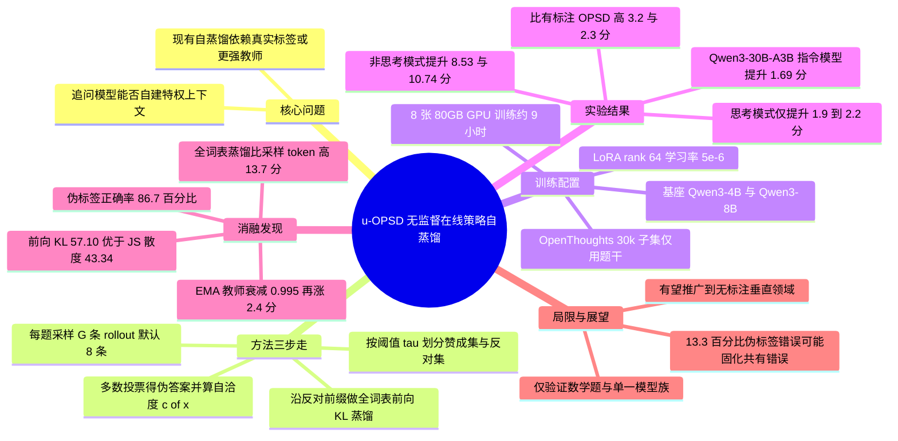

## 一、论文是干什么的？

想象一个正在备考数学竞赛的学生，手上有一本习题册，但**这本习题册没有答案页**。传统的做法是：要么请一位老师来判卷（对应有标注的强化学习，比如 GRPO），要么找一位更厉害的学长把标准解法写出来让他抄（对应知识蒸馏）。可如果既没有老师、也没有学长、更没有答案，这个学生还能不能靠自己变强？

这篇论文给出的回答是：能，而且效果可能比有老师还好。作者提出的方法叫 **u-OPSD**（unsupervised On-Policy Self-Distillation，无监督在线策略自蒸馏）。它的做法很像一个学生把同一道题**独立做上八遍**，然后看看这八遍的最终答案里哪个出现次数最多——那个「多数派答案」就被当成临时的标准答案（论文里叫「伪解」）。接着，这个学生把自己做对（与多数派一致）的那份草稿摊在桌上当作参考，回过头去逐字逐句地重看自己做错（与多数派不一致）的那份草稿，问自己「在这一步，如果我知道答案是那个，我下一笔该怎么写？」——这个「知道答案时的我」与「不知道答案时的我」之间的差距，就是训练信号。

这件事的意义在于：现有所谓的「自蒸馏」其实大多在偷偷作弊，它们依赖真实标签、环境反馈或更大模型的指导，因此算不上真正的「自」蒸馏。u-OPSD 把这些外部拐杖全部拿掉，只用模型自己生成的内容。作者在 AIME24、AIME25、HMMT25、MATH500、AMC23 五个数学推理基准上验证：在 Qwen3 的非思考模式下，4B 模型平均提升 **8.5 分**、8B 模型提升 **10.7 分**，并且**超过了用真实答案训练的 OPSD 与 GRPO**。

## 二、核心方法与创新

### 2.1 先理解它的「前身」：OPSD 在做什么

要看懂 u-OPSD，先看有监督版本的 OPSD。设 $\pi_\theta$ 是语言模型定义的下一个 token 分布，$\bar{\pi}\triangleq\pi_{\mathrm{sg}[\theta]}$ 是当前策略的**停止梯度副本**（stop-gradient copy，也就是「冻结的自己」）。OPSD 的关键洞察是：**同一个模型，在看到标准答案时和看不到标准答案时，是两个不同水平的模型**。看到答案的那个版本被当作「老师」$\pi_T$，看不到的那个版本是「学生」$\pi_S$。损失函数为：

$$
\mathcal{L}_{\mathrm{OPSD}}(\theta) = \mathbb{E}_{(x,y^{\star})\sim\mathcal{S}}\ \mathbb{E}_{y\sim\bar{\pi}(\cdot\mid x)}\ \sum_{t=1}^{|y|} D_\beta\big(\pi_T(\cdot\mid x, y^{\star}, y_{<t})\,\big\|\,\pi_S(\cdot\mid x, y_{<t})\big)
$$

其中 $x$ 是题目，$y^{\star}$ 是真实解答，$D_\beta$ 是散度。这是一种非常「奢侈」的监督：它不是给一个 0/1 的对错标量，而是在**每一个 token 位置上都给出一整个词表上的概率分布**作为目标，信息密度远高于强化学习的稀疏奖励。

问题也很明显：它需要 $y^{\star}$，也就是标准答案。

### 2.2 u-OPSD 的核心替换：用共识冒充标准答案

u-OPSD 的整个创新可以概括成一句话：**把 $y^{\star}$ 换成模型自己投票选出来的 $y^{+}$**。具体分三步。

**第一步，采样。** 对每道题 $x$，从当前策略独立采样 $G$ 条 rollout（默认 $G=8$）。

**第二步，投票。** 用答案抽取与规范化函数 $\mathrm{Ans}(\cdot)$ 从每条 rollout 中取出最终答案 $a^{(g)}$，然后取众数作为伪答案：

$$
\tilde{a}(x) = \arg\max_{a}\ \sum_{g=1}^{G}\mathbf{1}\big[a^{(g)} = a\big]
$$

同时定义**自洽置信度**（self-consistency score）：

$$
c(x) = \frac{1}{G}\sum_{g=1}^{G}\mathbf{1}\big[a^{(g)} = \tilde{a}(x)\big]
$$

只有当 $c(x)\ge\tau$（$\tau$ 为自洽阈值，论文默认取 0.5）**且**存在不一致的 rollout 时，这道题才会被用于训练。这一步相当于「学生自己判断这道题我心里有没有底」，没底的题就跳过。

**第三步，蒸馏。** 按答案是否等于 $\tilde{a}(x)$，把 $G$ 条 rollout 切成**赞成集** $\mathcal{Y}^{+}_x$ 和**反对集** $\mathcal{Y}^{-}_x$。从赞成集中选一条作为伪解 $y^{+}$（默认选**最短的那条**赞成 rollout，理由是简洁的解答干扰更小），把它拼进老师的上下文。然后沿着反对集里某条错误 rollout $y^{-}$ 的每一个前缀，去对齐两边的分布：

$$
\mathcal{L}_{\mathrm{u\text{-}OPSD}}(\theta) = \mathbb{E}_{x\sim\mathcal{U}}\ \mathbb{E}_{y^{(g)}\sim\bar{\pi}(\cdot\mid x)}\left[\mathbf{1}\big[\mathcal{Y}^{-}_x\neq\varnothing\big]\cdot\frac{1}{|\mathcal{Y}^{-}_x|}\sum_{y^{-}\in\mathcal{Y}^{-}_x}\frac{1}{|y^{-}|}\sum_{n=1}^{|y^{-}|} D_\beta\big(\bar{\pi}(\cdot\mid x, y^{+}, y^{-}_{<n})\,\big\|\,\pi_\theta(\cdot\mid x, y^{-}_{<n})\big)\right]
$$

请注意左右两边的**唯一区别**：老师 $\bar{\pi}$ 的条件里多了一个 $y^{+}$，学生 $\pi_\theta$ 没有。$\mathcal{U}$ 表示**无标注**的题目集合——训练集里根本没有 solution 字段被读取。

### 2.3 为什么这个设计说得通？

用一个生活化的类比：老师和学生是**同一个人**，区别只是老师「偷看了一眼共识答案」。因此老师不会教出模型能力之外的东西（不存在能力错配），但它确实比学生多知道一点点——多的那一点，正是可以被内化的部分。

更妙的是**训练位置的选择**。梯度只施加在「反对集」的前缀上，也就是模型**自信地做错了**的那些地方。如果一条 rollout 已经和共识一致，那说明模型在这里没什么可学的；只有当模型偏离共识时，才存在一个可利用的「知道答案 vs 不知道答案」的落差。这就是摘要里说的 correct itself precisely where it is confidently wrong。

### 2.4 散度的选择

$D_\beta$ 取的是**广义 Jensen-Shannon 散度族**，$\beta\to 0$ 的极限即前向 KL 散度：

$$
D_{\mathrm{KL}}\big(\bar{\pi}(\cdot\mid x, y^{+}, y^{-}_{<t})\,\big\|\,\pi_\theta(\cdot\mid x, y^{-}_{<t})\big)
$$

论文默认使用 $\beta=0$ 的前向 KL，理由是它「奖励学生集中到老师的某一个模态上」。消融显示这个选择相当关键：对称的 JS 散度会让训练**塌回基座水平**，反向 KL 则直接发散。

### 2.5 三个容易被忽略但重要的细节

- **全词表 vs 采样 token**：散度在**整个词表**上计算，而不是只在被采样到的 token 上。这一条带来 13.7 分的差距。
- **反对样本上限 $k$**：每道题默认只随机取 **1 条**不一致 rollout 参与训练（disagree-1）。取得越多反而越差。
- **老师是否更新**：默认把老师**冻结在初始策略**；消融中用 EMA（衰减 0.995）让老师缓慢跟随学生表现更好。

## 三、使用了哪些模型和计算资源？

**基座模型：**

| 类别 | 具体型号 |
|---|---|
| 主实验 | Qwen3-4B、Qwen3-8B（分别测试思考模式与非思考模式） |
| 指令模型 | Qwen3-4B-Instruct-2507、Qwen3-30B-A3B-Instruct-2507 |

**训练数据：** OpenThoughts 的 **30k 子集**（沿用 OPSD 的设置）。关键点是 u-OPSD **只使用其中的题目文本，从不读取 solution 字段**。

**GPU 与训练时长：** 所有训练均使用 **8 张 80GB 级别的 GPU**，并采用 colocated vLLM 生成（即生成与训练共享同一批卡）。论文未给出更具体的 GPU 型号（例如是 A100 还是 H100），此项为「暂无相关信息」。

一个完整训练单位的耗时如下：**150 步、$G=8$、4096 token 生成预算**的无监督训练约需 **9 小时**；对应的有监督版本约需 **3.5 小时**。差距来自 u-OPSD 需要为每道题额外采样 $G$ 条 rollout 并做投票。

**训练超参数：**

| 项目 | 取值 |
|---|---|
| 微调方式 | LoRA，rank 64，$\alpha=128$，作用于 attention 与 MLP 投影层 |
| 学习率 | $5\times10^{-6}$ |
| 梯度裁剪 | 0.1 |
| 采样温度 | 1.1，top-p 0.95，top-k 20 |
| 每题 rollout 数 | $G=8$（默认） |
| 自洽阈值 | $\tau=0.5$（默认） |
| 反对样本上限 | $k=1$ |
| 训练步数 | 150 步 |

**评测设置：** 使用 vLLM，温度 1.0，最大生成长度 38k。AIME24、AIME25、HMMT25 用 avg@12，MATH500、AMC23 用 avg@4。

**API 成本：** 该方法全程本地训练与推理，不涉及外部 API 调用，论文未报告任何 API 费用，此项为「暂无相关信息」。

## 四、实验结果

### 4.1 一句话总结

**在模型「不太会」的时候，u-OPSD 能带来非常大的提升，而且比用了标准答案的方法还强；在模型「已经很会」的时候，提升就变得很小。**

### 4.2 非思考模式（提升最显著）

五个数学基准的平均分：

| 模型 | 基座 | GRPO（有标注） | OPSD（有标注） | **u-OPSD（无标注）** |
|---|---|---|---|---|
| Qwen3-4B | 40.96 | 45.86 | 46.29 | **49.49**（+8.53） |
| Qwen3-8B | 43.57 | 45.43 | 52.04 | **54.31**（+10.74） |

也就是说，一个**完全没看过标准答案**的方法，在 4B 上比有监督的 OPSD 高 **3.2 分**，在 8B 上高 **2.3 分**。这是全文最有冲击力的结论。

### 4.3 思考模式（提升明显收窄）

| 模型 | 基座 | GRPO | OPSD | **u-OPSD** |
|---|---|---|---|---|
| Qwen3-4B | 74.85 | 76.35 | 76.20 | **77.05**（+2.20） |
| Qwen3-8B | 76.09 | 76.92 | 77.97 | **77.99**（+1.90） |

思考模式下基座本身就有 74 到 76 分，天花板很近，所有方法都只能挤出 2 分左右。u-OPSD 依然领先，但优势缩小到与 OPSD 持平的程度。

### 4.4 指令模型（pass@1）

| 模型 | 基座 | u-OPSD |
|---|---|---|
| Qwen3-30B-A3B-Instruct-2507 | 75.77 | **77.46**（+1.69） |
| Qwen3-4B-Instruct-2507 | 67.00 | **68.78**（+1.78） |

说明方法能扩展到 MoE 与更大规模的指令模型，但幅度同样受限于基座本身的水平。

### 4.5 消融实验的关键发现

| 消融维度 | 结论 |
|---|---|
| 自洽阈值 $\tau$ | 接受**所有**题目最好（59.21）；$\tau=0.5$ 得 53.93；$\tau=0.9$ 严格过滤反而掉到 44.40 |
| rollout 数 $G$ | $G=4$ 与 $G=8$ 几乎无差别（约 57.10）；$G=12$ 涨 4.7 分；$G=16$ 收益递减 |
| 老师更新策略 | 冻结初始策略得 57.10；EMA（衰减 0.995）在最佳检查点再涨 2.4 分，第 150 步涨 4.1 分 |
| 散度计算范围 | 全词表 logit 蒸馏 57.10，只用采样 token 43.45，差距 13.7 分 |
| 老师参考解选择 | 用**最长**的赞成 rollout 得 59.00，最短得 57.10 |
| 反对 rollout 数量 | $k=1$ 最稳；不设上限最差，某配置在 HMMT25 掉到 10.00，低于基座 |
| 散度族 | 前向 KL（$\beta=0$）最优 57.10；对称 JS 塌到 43.34（基座水平）；反向 KL 训练发散 |

### 4.6 伪标签到底有多准？

这是全文最值得关注的一组数字：**96.3%** 的 rollout 能解析出可用的 boxed 答案，**94.0%** 的题目能通过自洽阈值拿到伪标签，而这些伪标签中有 **86.7%** 与真实答案一致。

换句话说，有 **13.3% 的伪标签是错的**，但模型仍然整体变强了——这暗示密集的分布级监督对少量噪声有相当的容忍度。

## 五、潜在应用与已落地应用

**潜在方向：**

1. **无标注垂直领域的模型自提升。** 法律、医疗、金融、工业运维这些领域，题目容易搜集但标准答案昂贵稀缺。u-OPSD 只要有题干就能训练，天然适配。
2. **持续学习与在线自我改进。** 由于老师和学生是同一个模型，理论上可以在部署后用真实用户查询持续做这套流程，无需回流人工标注。
3. **合成数据管线的替代方案。** 相比「大模型生成数据、小模型学」的常规蒸馏，这条路子不需要更强的教师模型，规避了模型许可与蒸馏合规问题。
4. **与强化学习互补。** 论文强调该方法提供的是 token 级分布监督而非标量奖励，理论上可与 GRPO 等 RL 方法叠加。
5. **多模态推理迁移。** 相关的 OPSD 系列工作已延伸到视觉推理方向，u-OPSD 的共识构造在有可自动抽取答案的多模态任务上同样可行。

**已落地应用：** 论文本身为学术研究，作者开源了代码仓库 [williamium3000/u-opsd](https://github.com/williamium3000/u-opsd) 和[项目主页](https://williamium3000.github.io/u-opsd/)。除此之外，尚未见到公开报道的工业界生产环境部署案例，此项为「暂无相关信息」。

## 六、网络上的讨论与评价

**HuggingFace Papers：** 该论文在 HuggingFace 论文页获得 **200 票**，属于当期热度较高的作品。页面上未见公开的社区评论文本，此项为「暂无相关信息」。

**X（Twitter）上的讨论：** [alphaXiv 官方账号](https://x.com/askalphaxiv/status/2085757874127397129)发帖点评，认为虽然大模型能从自己的 rollout 中变强，但多数所谓自蒸馏「still cheats a bit by using gold answers, verifier rewards, or a stronger teacher」（仍然靠标准答案、验证器奖励或更强的教师在偷偷作弊），而这篇论文「makes it actually self-supervised」（让它真正变成自监督）。该帖同时提出了一个尖锐的担忧：「Majority vote is clever, but it can also turn a shared mistake into a confident teacher.」（多数投票很聪明，但它也可能把一个共有的错误变成一位自信的老师。）这与论文自己报告的 13.3% 伪标签错误率正好对应。

**技术博客：** Ritvik Rastogi 在 Medium 的 Papers Explained 系列中撰写了[专文解读](https://ritvik19.medium.com/papers-explained-595-unsupervised-on-policy-self-distillation-13e21a1df42d)。他的整体评价偏正面，强调该方法「transfers the solution-conditioned next-token distribution」而非简单模仿，并总结出一条规律：**共识蒸馏在基座模型相对较弱时最有效**，这解释了为何思考模式下增益只有 1.9 到 2.2 分。他也承认这构成了方法的适用边界。文章基本没有提出反面论证。

**论文聚合平台：** [alphaXiv](https://www.alphaxiv.org/abs/2608.06296) 与 [Takara TLDR](https://tldr.takara.ai/p/2608.06296) 均收录并生成了摘要，alphaXiv 的概述认为这项工作说明「外部监督并非提升大模型推理能力的必要前提」，并看好其在人工标注稀缺的专业领域扩展到无标注数据集的潜力。

**LinkedIn：** Asteris.ai 账号发布了该论文的分享贴，但可获取的内容中未包含实质性评论文字。

**Reddit（r/MachineLearning、r/LocalLLaMA）与 Hacker News：** 检索未发现针对该论文的讨论帖。论文发布于 2026 年 8 月初，时间较近，此项为「暂无相关信息」。

**中文社区（知乎等）：** 检索未发现针对本文的中文原创讨论，仅有 alphaXiv 的机器翻译页面。此项为「暂无相关信息」。

## 七、思维导图

