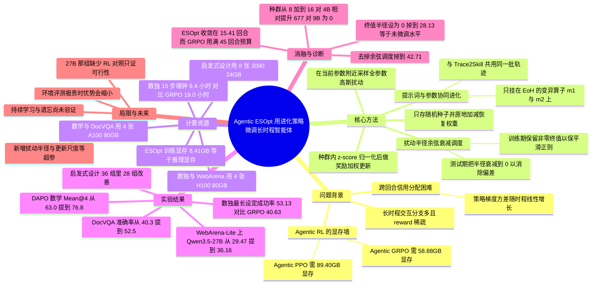

## 一、论文是干什么的？

先解释三个名词。**LLM 智能体**（LLM agent）指的是让大语言模型不再只回答一次问题，而是反复地「看环境 → 做动作 → 看环境反馈 → 再做动作」，直到把任务完成，比如在网页上点几十次鼠标去完成一次退货申请。**长时程**（long-horizon）指的就是这种一条任务要走很多步的情况，论文里最长的设定允许智能体在一个网页任务里做 30 个动作、在一道数独题里做 45 个回合。**强化学习**（RL，reinforcement learning）是目前给大模型「事后调教」的主流手段，代表算法是 PPO 和 GRPO，它的基本思路是：让模型试着做，做对了给奖励，然后用**反向传播**（backpropagation，一种沿着计算图逐层求导、算出「每个参数该往哪个方向调」的技术）去更新参数。

这个领域原本卡在两个地方，而且都是真问题。第一是**显存墙**。反向传播要把前向计算过程中的中间结果（activations，激活值）全部存下来，还要存优化器状态、参考模型（reference model）等等。论文实测：在同一个数独环境里微调一个 40 亿参数的 Qwen3.5-4B，纯推理只要 8.41GB 显存，GRPO 要 58.88GB，PPO 要 89.40GB。等模型放大到 270 亿参数，作者明确说「在四张 H100 80GB 上，全参数 Agentic RL 已经不再可行」。第二是**信用分配**（credit assignment，指把最终的成败奖励合理地摊派到中间每一步动作上）。长任务里通常只有终局奖励：数独要么完全解对得 1 分，要么 0 分，中间每一步都没有分数。让 RL 去判断「45 步里到底哪一步该负责」，随着步数变长会越来越难，方差随时程近似线性增长。

这篇论文的破法是：干脆不用反向传播，改用**进化策略**（ES，evolution strategies）。生活类比是这样的：反向传播像一个带着地图、指南针和高精度海拔仪的登山者，他能算出「往东北迈半步海拔升得最快」——很精确，但代价是背包里要装一堆沉重的仪器（激活值、优化器状态、参考模型）。进化策略则像一个不看地图的人：他站在原地，往四周随机选 32 个方向各派一个「分身」走一小段，看谁站得更高，然后按「谁高谁权重大」的加权平均，朝那个综合方向挪一步。他不需要任何仪器，只需要一双能走路的腿——对应到工程上，就是只需要**推理级显存**（inference-level GPU memory，即把模型加载进来跑一遍前向所需的最小显存）。

更关键的是，作者认为在长时程智能体这个场景里，ES 不只是「更省的替代品」，而是「结构上更合适的方案」。因为 ES 是一次采一个整体的参数扰动、跑完一整条轨迹、然后把这条轨迹的总奖励直接记在这一个扰动方向上——它压根不需要把奖励拆到每一步。用接力赛打比方：RL 是「队伍赢了，现在请评委给 45 个交接棒动作分别打分」；ES 是「这套调过参数的选手赢了，把功劳记在这套参数上」。步数越多，前者越难，后者不受影响。

最后，作者把这个框架命名为 **Agentic ESOpt**，并在五类场景上验证：可控时程的多回合数独、ReAct 式工具调用的数学推理与文档问答（DocVQA）、WebArena-Lite 网页智能体、以及测试时的自动启发式设计（AHD）。核心结果是：数独 15 步设定上比最强 GRPO 高 12.50 个百分点；在四张 H100 上把 Qwen3.5-27B 的网页智能体做了全参数适配，成功率从 29.47% 提到 36.16%；在 36 组启发式设计对比中 28 组变好。

> 小注（标题不一致）：arXiv 摘要页、HuggingFace 论文页与 GitHub 仓库简介写的都是 `Minimal GPU Requirements`，而 PDF 首页与 arXiv HTML 正文的标题是 `Minimal GPU Memory Requirements`，多一个 Memory。有趣的是一作在 HF 的自荐帖里用的也是带 Memory 的那版。本文的 `originalTitle` 按 arXiv 元数据（摘要页）记录，即不带 Memory 的那一版。

## 二、核心方法与创新

### 2.1 先把问题写清楚：多回合轨迹与稀疏奖励

论文把智能体定义为一个反复观察、反复动作的策略：

$$
a_t\sim\pi_\theta(a_t\mid o_{\le t},c_t)
$$

- $\theta$：LLM 的全部参数。
- $a_t$：第 $t$ 回合的动作（一句工具调用、一次网页点击、一次填格子）。
- $o_{\le t}$：到第 $t$ 回合为止的全部交互历史（观测）。
- $c_t$：**外部上下文**，可以是提示词、记忆、技能文档或工具说明。这一项很重要，后面「提示词与参数协同进化」全靠它。
- $\pi_\theta$：由参数 $\theta$ 决定的策略，也就是这个 LLM 本身。

一次任务产生轨迹 $\tau=(o_1,a_1,\ldots,o_H,a_H)$，其中 $H$ 是**时程**（走了多少个回合就终止）。回报是 $R(\tau)=\sum_{t=1}^{H}\gamma^{t-1}r_t$，$r_t$ 是第 $t$ 步的即时奖励，$\gamma$ 是折扣因子。论文强调：在多数智能体任务里 $r_t$ 中间全是 0，只有最后一步才有非零奖励，这就是**稀疏奖励**。

优化的对象可以是 $c_t$（提示词空间方法，冻结模型只改提示词，轻但只能激发模型已有的行为），也可以是 $\theta$（SFT / OPD / GRPO / PPO）。作者把 SFT 和 OPD（on-policy distillation，从更强模型的 token 分布里学）排除在对比之外，理由是它们需要「标量环境奖励之外的额外标注」，成本不可比。

### 2.2 为什么 RL 在长时程上会吃亏：一个方差论证

这是全文的理论支点，也是「ES 不只是更便宜」的论据。考虑一条 $H$ 步的轨迹，只有终局回报 $R(a)$，带一个基线 $b$，那么策略梯度估计量是：

$$
\hat{g}_{\mathrm{PG}}=(R(a)-b)\sum_{t=1}^{H}\nabla_\theta\log\pi_\theta(a_t\mid s_t)
$$

关键在那个 $\sum_{t=1}^{H}$：每一步都贡献一个「打分项」（score term）。在「回报与任何单步动作弱相关、各步打分项近似不相关」的假设下（这是 Salimans 等人 2017 年 OpenAI ES 论文里的经典假设），方差近似为：

$$
\operatorname{Var}[\hat{g}_{\mathrm{PG}}]\approx\operatorname{Var}[R(a)]\operatorname{Var}\!\left[\sum_{t=1}^{H}\nabla_\theta\log\pi_\theta(a_t\mid s_t)\right]\propto H
$$

也就是说，噪声随时程线性增长。而 ES 只采一个扰动 $\epsilon$ 给整条轨迹用：

$$
\hat{g}_{\mathrm{ES}}=(R(a(\theta+\sigma\epsilon))-b)\frac{\epsilon}{\sigma},\qquad \operatorname{Var}[\hat{g}_{\mathrm{ES}}]\approx\operatorname{Var}[R(a)]\operatorname{Var}\!\left[\frac{\epsilon}{\sigma}\right]
$$

$\epsilon/\sigma$ 这一项里没有对 $H$ 的求和，所以这部分方差不随时程增长。

**类比**：RL 像「45 个人合作做一道菜，最后只知道客人满意与否，还要给每个人单独打绩效」，人越多噪声越大；ES 像「换一整支厨师班子，客人满意就说明这支班子好」，不管几个人都是一个整体评价。

**如果不这样会怎样？** 论文自己给出了反例边界：ES 并没有「时程无关」的总方差。作者在附录 C.3 明确写了「本分析不主张 ES 的总方差与 $H$ 无关，也不主张 ES 普遍优于策略梯度」——时程变长时 ES 也会因为回报分布变稀疏、区分度变低而变难，而且它的估计质量还依赖参数维度 $d$、扰动半径 $\sigma$、种群规模 $G$。它只主张：在其它困难源大致可比时，时程变长会给策略梯度额外加一项跨步累加，而 ES 的参数打分项没有这一项。这个「诚实的边界声明」也是这篇论文比较可信的地方。

配套的实证诊断也在附录里：作者做了一个纯示意的推算，若每回合正确率为 $p$，最短成功路径的成功率为 $S_{H^*}=p^{H^*}$，$p=0.95$ 时 $H^*=5/10/15$ 分别只剩 0.774、0.599、0.463——同样的单步误差，任务越长惩罚越狠。

### 2.3 Agentic ESOpt 的主体：扰动、评估、奖励加权更新

优化目标是期望回报（$c$ 为固定的外部上下文）：

$$
J(\theta;c)=\mathbb{E}_{\tau\sim\pi_\theta(\cdot\mid c)}\left[R(\tau)\right]
$$

ES 不直接优化它，而是优化它的**高斯平滑版本**（Gaussian-smoothed objective）：

$$
J_\sigma(\theta;c)=\mathbb{E}_{\epsilon\sim\mathcal{N}(0,I)}\left[J(\theta+\sigma\epsilon;c)\right]
$$

- $\epsilon\in\mathbb{R}^d$：一个和全部参数同维度（$d$ 维）的高斯噪声向量，也就是「扰动方向」。
- $\sigma$：**扰动半径**（perturbation radius / scale），控制这一步试探迈多大。
- $\mathcal{N}(0,I)$：标准正态分布，$I$ 是单位协方差矩阵，意思是各个参数方向独立同分布地抖动。

对它求导得到 **ES 伪梯度**（pseudo-gradient，之所以叫「伪」，是因为它不是真的对网络求导，而是用采样估出来的一个方向）：

$$
\nabla_\theta J_\sigma(\theta;c)=\frac{1}{\sigma}\mathbb{E}_{\epsilon}\left[J(\theta+\sigma\epsilon;c)\,\epsilon\right]
$$

直觉解读：「哪个方向的分身考得好，就往那个方向多加一点」。注意整个式子里只出现 $J$ 的**函数值**，不出现 $J$ 的导数——这就是「黑箱」（black-box）的含义，环境甚至不需要可微。

实现上采 $G$ 个扰动 $\epsilon_1,\ldots,\epsilon_G$，得到 $G$ 个奖励 $R_i$，先做**种群内 z-score 归一化**降方差：

$$
\hat{R}_i=\frac{R_i-\mu_R}{s_R+\varepsilon},\quad \mu_R=\frac{1}{G}\sum_{j=1}^{G}R_j,\quad s_R^2=\frac{1}{G}\sum_{j=1}^{G}(R_j-\mu_R)^2
$$

- $\mu_R$：这一代 $G$ 个分身的平均奖励。
- $s_R$：标准差；$\varepsilon$ 是防止除零的小常数。
- 归一化的作用：把二值成功率、连续 ANLS 分数、TSP 路径长度这些量纲完全不同的奖励，统一成「在本代种群里排第几」的相对分数。这是论文能把同一套更新公式套到五种任务上的关键。

最终的参数更新是：

$$
\theta_{t+1}=\theta_t+\frac{\alpha}{G}\sum_{i=1}^{G}\hat{R}_i\,\epsilon_i
$$

- $\alpha$：**有效更新尺度**（update scale），相当于学习率。
- 论文特别注明：与教科书版 ES 不同，这里**故意省掉了 $1/\sigma$ 因子**，把 $\alpha$ 当成实际的步长；而且用的是**单边扰动**（one-sided perturbation），不是常见的正负成对（antithetic）采样。

**省显存的工程诀窍**（沿用 Qiu 等人 2026 的 ES at Scale 做法）：不保存 $G$ 份扰动向量，只保存每个扰动的**随机数种子**（noise seed），需要时用种子重新生成同一个 $\epsilon$，并用**原地加减**（in-place addition/subtraction）把权重改过去、评估完再改回来。这样显存占用就等于「加载一份模型跑推理」的量。附带好处是整个优化历史可复现：论文的 Math/DocVQA 实验就是把种子序列记录下来，最终评估时从原始 checkpoint 重放一遍更新序列。

### 2.4 扰动半径的余弦衰减：这篇论文相对已有 ES 工作的主要方法增量

只要 $\sigma>0$，你优化的就不是原目标 $J$ 而是平滑版 $J_\sigma$，两者有偏差。论文的 Lemma 1 给出了这个偏差的主导项：

$$
J_\sigma(\theta;c)=J(\theta;c)+\frac{\sigma^2}{2}\mathrm{Tr}\!\left(\nabla_\theta^2 J(\theta;c)\right)+O(\sigma^4)
$$

- $\nabla_\theta^2 J$：Hessian 矩阵（二阶导），$\mathrm{Tr}(\cdot)$ 是它的迹。
- 解读：这一项可以看成**正则化**。做最大化时它会惩罚「尖锐的局部最优」、偏好「平坦的参数邻域」——直觉上，平坦的解泛化更好。
- 但同时它也是**偏差**：$\sigma$ 越大，正则越强，偏离真实目标也越远。

已有 ES 微调工作（如 ES at Scale）通常全程用固定 $\sigma$，不管这个权衡。Agentic ESOpt 的做法是让 $\sigma$ 按余弦曲线衰减：

$$
\sigma_t=\sigma_T+(\sigma_0-\sigma_T)\frac{1+\cos(\pi t/T)}{2},\qquad t=0,1,\ldots,T
$$

- $\sigma_0$：初始半径（大，用于广探索 + 强正则）。
- $\sigma_T$：终止半径（小，用于精细利用 + 低偏差）。
- $T$：总更新步数；$t$ 为当前步。
- 余弦形状的意思是：前期降得慢（多探索一会儿），中期快降，后期又平缓地停在 $\sigma_T$。

这里有一个很漂亮的设计分叉：**训练期保留非零 $\sigma_T$，测试期把 $\sigma_T$ 降到 0**。理由是训练期你要的是泛化，那点平滑正则是有益的；而测试时计算（test-time compute）只关心当前这一道题的最优解，不需要泛化，所以要把偏差压到零。

**如果不这样会怎样？** 数独消融给了直接答案（Table 1，$H^*=15$）：完整 Agentic ESOpt 53.13%；去掉余弦衰减、固定 $\sigma$（即 Vanilla ES）掉到 42.71%；把终值 $\sigma_T$ 设为 0（即末期完全不平滑）掉到 28.13%——这个数字和没微调过的基座 Qwen3.5-27B 的 28.13% 恰好相同，等于说过拟合把训练收益全吃掉了。作者还给了训练曲线证据：Agentic ESOpt 在第 60 步是 39.58%，靠前期更充分的探索避开了局部最优，到第 100 步继续爬到 53.13%——原文的对照对象是 Vanilla ES，意思是固定 $\sigma$ 的版本在后期就爬不动了。

### 2.5 提示词与参数的协同进化：ES 的「黑箱接口」红利

绝大多数**测试时计算**方法（test-time compute，即不改模型权重、靠多次采样/搜索来提升效果）和提示词优化方法都会冻结模型。结果是：搜索只能重新加权或重新组合「冻结策略本来就会的行为」，如果任务本身需要改变策略本身，就搜不出来。

Agentic ESOpt 的更新是「拿标量分数 → 改权重」，轻到可以塞进任何搜索循环里。作者写成一个交替外循环：

$$
\theta_{t+1}=\mathcal{U}_{\mathrm{ES}}(\theta_t;c_t,\mathcal{D}_t),\quad c_{t+1}=\mathcal{U}_c(c_t;\mathcal{D}_t)
$$

- $\mathcal{D}_t$：第 $t$ 轮收集到的轨迹与分数。
- $\mathcal{U}_{\mathrm{ES}}$：ES 参数更新算子。
- $\mathcal{U}_c$：外部的提示词/技能更新规则（可以是另一个 LLM 写的技能文档，也可以是进化算法的交叉变异算子）。
- 关键点：$\mathcal{D}_t$ 被**两边共用**。同一批 rollout 既喂给 ES 更新参数，又喂给提示词优化器——所以协同进化几乎不增加额外开销。

论文实测了两种组合：
1. 与 **Trace2Skill**（一个把轨迹里的局部经验蒸馏成可迁移「技能文档」的提示词空间方法）串行组合：先跑 ES，把过程中产生的轨迹一次性交给 Trace2Skill 蒸出技能，最终评估时重放同一串参数更新 + 注入技能。
2. 与 **EoH**（Evolution of Heuristics，一个用 LLM 生成启发式算法代码、再用交叉变异迭代的自动启发式设计框架）在线组合：保留 EoH 原有的所有算子，只在**变异算子 m1 与 m2** 上挂参数更新，每个外层代产生两个 ES 更新批次。

### 2.6 具体算法流程（以训练期为例）

1. 载入基座 LLM 参数 $\theta_0$，设定 $G$、$\sigma_0$、$\sigma_T$、$\alpha$、总代数 $T$。
2. 第 $t$ 代：按余弦公式算出当代半径 $\sigma_t$。
3. 采 $G$ 个整数种子，各生成一个全参数高斯扰动 $\epsilon_i$。
4. 对每个 $i$：原地把权重改成 $\theta_t+\sigma_t\epsilon_i$，在环境里跑完整 rollout（同一代内所有扰动**评在同一批任务上**，保证可比），拿到标量奖励 $R_i$，然后原地把扰动减回去。
5. 对 $G$ 个奖励做种群内 z-score 归一化得到 $\hat{R}_i$。
6. 用种子重建各 $\epsilon_i$，执行 $\theta_{t+1}=\theta_t+\frac{\alpha}{G}\sum_i\hat{R}_i\epsilon_i$，并把种子、奖励、调度、更新写进 `history.json`（据官方仓库 README）。
7. 可选：把这一代的轨迹交给 $\mathcal{U}_c$ 更新技能文档或启发式种群。
8. 每 10 代做一次只读评估；跑满 $T$ 代结束。

### 2.7 训练算力账：为什么「种群更大」不等于「更贵」

一个自然的质疑是：ES 一代要跑 32 条轨迹，GRPO 一个 prompt 只跑 8 条 rollout，ES 不是贵四倍吗？论文用一笔 FLOPs 账拆了这个疑问（**FLOPs** 即浮点运算次数，衡量一段计算总共要做多少次乘加，比「跑了几条轨迹」更能反映真实开销）。设模型有 $P$ 个参数、一条轨迹经过模型的 token 数为 $\bar{L}$，则前向约 $2P\bar{L}$ FLOPs、反向约 $4P\bar{L}$ FLOPs。于是（$T$ 为迭代数、$B$ 为 prompt batch、$G$ 为每 prompt 的 rollout 数或扰动方向数）：

- ES：只有策略前向，$\mathrm{FLOPs}_{\mathrm{ES}}=2TBGP\bar{L}$
- GRPO：策略前向 + 参考模型前向 + 策略反向，$\mathrm{FLOPs}_{\mathrm{GRPO}}=8TBGP\bar{L}$
- PPO：再加 critic 前向和 critic 反向，$\mathrm{FLOPs}_{\mathrm{PPO}}=14TBGP\bar{L}$

即**每条轨迹**，ES 的模型侧成本只有 GRPO 的 1/4、PPO 的 1/7。所以数独上 ES 的 $G=32$ 与 GRPO 的 8 rollout 正好抵平：$2\times32/(8\times8)=1$；而在 Math/DocVQA 上 ES 用 $G=16$、GRPO 用 8 rollout，比值是 $2\times16/(8\times8)=1/2$，ES 只花 GRPO 一半的模型侧算力。

代价写在局限里，很诚实：ES 是「用更多次独立环境评估，换掉反向传播和参考模型」。如果**环境本身极贵**（比如每次 rollout 要调真实网页、跑一个慢速仿真器），那么瓶颈会从模型算力转移到 rollout 成本，这个交换就不划算了。

## 三、使用了哪些模型和计算资源？

这一节是本文的核心卖点所在，逐条列出。

| 条目 | 内容 |
|---|---|
| 主实验用的 LLM / 基座模型 | **Qwen3.5-4B**（数独、ReAct 数学推理、DocVQA 的被微调对象）；**Qwen3.5-27B**（WebArena-Lite 全参数微调，也用作数独/Math/DocVQA 的仅评估参考基线）；**Qwen3.5-9B**（仅用于种群规模敏感性消融）；**LLaMA-3.1-8B-Instruct**（自动启发式设计 AHD 全部实验）。参数规模覆盖 4B 到 27B |
| 对比的 baseline 模型 | 同基座的 **Agentic GRPO**（8 rollout，两套采样配置 GRPO-A/GRPO-B，基于 VERL）；**Agentic PPO**，具体实现为 **Turn-PPO**（Li et al. 2026），带一个独立的 Qwen3.5-4B critic，另加新初始化的 value head；**Vanilla ES**（固定 $\sigma$，即本文去掉余弦调度的消融版）；**Trace2Skill**（提示词/技能空间优化，不改权重）；未微调的 Qwen3.5-4B / 27B；WebArena 上另报 **GPT-5.4 / GPT-5.4-mini / GPT-5.4-nano** 作为闭源参考点；AHD 上的 **Greedy Construct**、**ACO**、**EoH**、独立 **Sample** |
| 评测/打分用的模型（如 LLM-as-judge） | **没有使用 LLM-as-judge**。奖励全部是程序化标量：数独为二值终局奖励（棋盘完全合法才得 1）；Math 为解析后最终答案的精确匹配（exact match）；DocVQA 为连续 **ANLS** 分数（阈值准确率取 ANLS 严格大于 0.5）；WebArena-Lite 用 benchmark 自带 evaluator 给二值成功；AHD 用求解器执行生成的启发式代码后返回目标值。唯一用到的外部大模型是 **GPT-5.4-nano**，被当作 Trace2Skill 的技能蒸馏器（Math 与 DocVQA 明确写了，temperature 为 1）；WebArena 那一路的技能蒸馏所用模型原文未明确写出型号 |
| 训练硬件 | **数独：4 张 NVIDIA H100 80GB**；**WebArena-Lite（Qwen3.5-27B）：4 张 NVIDIA H100 80GB**；**ReAct 数学推理：4 张 NVIDIA A100 80GB**；**DocVQA：4 张 NVIDIA A100 80GB**；**AHD：一个 8 张 RTX 3090 24GB 的集群**。注意 AHD 那组是消费级 24GB 显卡，这恰好是「最小显存」主张最有说服力的一处 |
| 推理/评测硬件 | 原文未单列评测硬件，从上下文看与训练同机（表 2 明确写 GRPO 与 ESOpt 跑在同样的四张 H100 上并「充分利用了可用硬件」）。ES 的训练显存等于推理显存，所以两者本来就没有区别 |
| 显存占用对比（最关键的一组数字） | Qwen3.5-4B 上：**Agentic ESOpt 仅 8.41GB**（等于该模型的推理显存）；**Agentic GRPO 58.88GB**；**Agentic PPO 89.40GB**。ESOpt 比 GRPO 低 **85.7%**。作为参照，Qwen3.5-27B 的推理显存是 **51.75GB**。作者明确指出在 4 张 H100 80GB 上，27B 的全参数 Agentic RL 已不可行，而 ESOpt 可行 |
| 是否用商业 API | 是，但只用在两处：WebArena-Lite 表格里把 **GPT-5.4 / GPT-5.4-mini / GPT-5.4-nano** 作为闭源参考基线；以及用 **GPT-5.4-nano** 做 Trace2Skill 技能蒸馏。附录 F 也承认实验使用了「API-hosted models」。具体是哪家的哪个端点，原文未披露 |
| 单个完整计算单位的耗时 | 原文给了两组实测墙钟时间。**数独**（4 张 H100，Qwen3.5-4B，100 代）：ESOpt 在 $H^*=5/10/15$ 分别为 **3.1 / 5.8 / 9.4 小时**，对应 GRPO 为 **5.4 / 13.1 / 19.0 小时**——时程越长，ESOpt 的墙钟优势越大（15 步时快约一半）。对应 FLOPs 为 ESOpt **3.1 / 6.3 / 9.4 EFLOPs**，GRPO **3.2 / 7.6 / 10.9 EFLOPs**。**AHD 端到端**（8 张 3090，$T=1000$，构造式 Sample 脚手架）：TSP 从 54.8 分钟变 60.6 分钟、KP 从 41.2 变 48.6、ASP 从 51.7 变 56.7，即挂上 ESOpt 只多花 **5.0 到 7.4 分钟**，也就是 **+9.7% 到 +18.0%**。Math / DocVQA / WebArena 三组实验的墙钟时间**原文未披露**；**单条 rollout 的耗时原文未披露** |
| 每代采样多少扰动 / 种群规模 / 总轨迹数 | 数独：$G=32$，每个方向都在同一批 32 道题上评分（即每代 $32\times32=1024$ 次「方向-题目」rollout），共 100 代；Math：$G=16$，每方向 16 道题，原文明确写「每代 $16\times16=256$ 条方向-题目轨迹」，共 25 代；DocVQA：$G=16$，每方向 16 题，每代 256 条，共 40 代；WebArena-Lite：$G=8$，每方向 8 个网页任务，原文明确写「每代 $8\times8=64$ 次方向-任务评估」，共 70 代；AHD：每个更新批次 10 / 20 / 30 个方向（视脚手架与预算），共 50 或 100 个更新批次。对照组 GRPO 的总轨迹数原文直接给了：Math **3200 条**、DocVQA **5760 条**（这两个数字写在原文附录的 GRPO 配置表里）。ES 侧的总轨迹数见下方独立说明 |
| 关键超参（跨任务基本统一） | 更新尺度 $\alpha$：多数设定为 $5\times10^{-4}$，WebArena 为 $2.5\times10^{-4}$。$\sigma$ 调度：数独 $10^{-3}\to2.5\times10^{-4}$（$H^*=5/10$）与 $7\times10^{-4}\to5\times10^{-4}$（$H^*=15$）；Math/DocVQA $10^{-3}\to5\times10^{-4}$；WebArena 恒定 $1.5\times10^{-3}$；AHD $10^{-3}\to0$。全部采用单边高斯扰动 + 种群 z-score 归一化。作者在局限里说这套 $\sigma_0\approx10^{-3}$、$\alpha\approx5\times10^{-4}$ 在 5 个实验里通用性很好 |
| 推理服务框架（vLLM / SGLang 等） | **论文正文与附录完全没提任何推理服务框架**（全文检索无 vLLM / SGLang / PyTorch 字样）。以下版本号**来自官方 GitHub 仓库 README，不是论文数据**：README 的「已验证软件栈」表列出，Qwen3.5 的 Agentic-ESOpt 与评测用 Python 3.10 + PyTorch 2.10.0 + Transformers 4.57.6 + vLLM 0.19.1；多回合 GRPO 用 Python 3.11 + PyTorch 2.6.0 + Transformers 4.51.1 + 内置 VERL（`algorithms/verl/`）；DocVQA 环境额外需要 `bubblewrap` 与 `tesseract-ocr`。仓库还提示这两套环境依赖冲突、必须分开装。由此**可以推测**（本综述的推断）rollout 侧是走 vLLM 的，但 README 并没有明确描述「vLLM 起服务 + 种子重放改权重」这样一套架构 |
| 金钱成本 | **原文未披露**任何 API 费用或云成本数字 |
| 代码是否开源 | 是，MIT 许可。代码：[github.com/zz1358m/Agentic-ESOpt](https://github.com/zz1358m/Agentic-ESOpt)（截至 2026-08-22 为 40 star、4 fork、0 open issue，创建于 2026-06-22，最近一次 push 为 2026-08-19）。项目主页：[Project-Agentic-ESOpt](https://zz1358m.github.io/Project-Agentic-ESOpt/)。还放出了四个微调后 checkpoint：[Agentic-ESOpt Checkpoints Collection](https://huggingface.co/collections/zz1358m/agentic-esopt-checkpoints-collection)，含 Math、DocVQA、WebArena（27B）、Sudoku-Mask15 四个权重 |

> **本综述的推算，非论文数据。** 原文只给了「方向数 × 每方向题数 × 代数」这三个分项，从来没有报告 ES 侧的总轨迹数。下面四个总数是本综述自己乘出来的，请勿当成论文原文数字引用：
>
> - 数独：$32$ 方向 $\times\,32$ 题 $\times\,100$ 代 $=102{,}400$ 条，约 10.2 万条
> - Math：$16\times16\times25=6{,}400$ 条
> - DocVQA：$16\times16\times40=10{,}240$ 条，约 1.02 万条
> - WebArena-Lite：$8\times8\times70=4{,}480$ 条
>
> AHD 一路无法这样折算，因为它的「一个方向」对应的是执行一份启发式代码、而不是一条智能体轨迹。

一句话总结这一节：**这篇论文最硬的证据不是准确率，而是那三个显存数字（8.41GB / 58.88GB / 89.40GB）和「4 张 H100 跑 27B 全参数微调」这件事**。它把「要不要买 8 卡机」这个决策，变成了「有推理机就能微调」。

## 四、实验结果

### 4.1 可控时程数独：核心的「交叉点」证据

数独环境被设计成时程可控：遮住 5 / 10 / 15 个格子，每个合法动作最多填一格，所以**最短成功时程** $H^*$ 就分别是 5 / 10 / 15。交互预算是遮盖数的三倍（15 / 30 / 45 回合）。只有整盘完全解对才得 1 分。训练集与评测集各 32 题，3 次评估取均值。

| 方法 | 训练显存 | $H^*=5$ | $H^*=10$ | $H^*=15$ |
|---|---|---|---|---|
| Qwen3.5-27B（未微调，仅参考） | 51.75GB | 86.46 | 50.00 | 28.13 |
| Qwen3.5-4B（未微调） | 8.41GB | 63.54 | 31.25 | 10.42 |
| 加 Agentic PPO（Turn-PPO） | 89.40GB | **90.63** | 56.25 | 0.00 |
| 加 Agentic GRPO-A（温度 0.7） | 58.88GB | 80.21 | 44.79 | 30.21 |
| 加 Agentic GRPO-B（温度 1.0） | 58.88GB | 85.42 | **67.71** | 40.63 |
| 加 **Agentic ESOpt**（$G=32$） | **8.41GB** | 89.58 | 62.50 | **53.13** |
| 消融：去掉 $\sigma$ 余弦衰减 | 8.41GB | 85.42 | 55.21 | 42.71 |
| 消融：$\sigma_T$ 设为 0 | 8.41GB | 85.42 | 54.17 | 28.13 |

这张表最有意思的地方不是「ESOpt 赢了」，而是**名次会随时程翻转**：$H^*=5$ 时 PPO 第一，$H^*=10$ 时 GRPO 第一，$H^*=15$ 时才轮到 ESOpt 第一，且领先 GRPO 12.50 个百分点。作者自己强调这种「顺序反转」比「全面碾压」更有说服力，因为它正好对上第 2.2 节的理论预测。PPO 在 15 步下直接归零，原因是稀疏终局奖励让 critic 学不到有意义的价值信号。另一个诊断很直观：$H^*=15$ 设定下交互预算是 45 回合，GRPO 到第 60 步就把 45 回合用满了（说明它在瞎走），而 ESOpt 最终稳定在 **15.41 回合**，几乎贴着最短路径。

### 4.2 ReAct 式工具调用：数学推理与 DocVQA

Math 在 400 道 DAPO 题上训练，在 100 道留出 DAPO 题 + 30 道分布外的 AIME 2026 上评测；DocVQA 在 50 题验证子集上训练、100 道留出题上评测。两者时程上限 50 回合，每回合生成上限 Math 4096 token、DocVQA 512 token。被微调对象都是 Qwen3.5-4B。

| 模型 / 方法 | DAPO Mean@4 | AIME 2026 Mean@4 | DocVQA ANLS Mean@4 | DocVQA 准确率 Mean@4 |
|---|---|---|---|---|
| Qwen3.5-27B 无技能（仅参考） | 65.8 | 76.7 | 0.5036 | 51.8 |
| Qwen3.5-4B 无技能（基线） | 63.0 | 55.8 | 0.3875 | 40.3 |
| 加 Agentic GRPO | 68.8 | 58.3 | 0.4627 | 48.0 |
| 加 **Agentic ESOpt** | **76.8** | **70.8** | **0.5043** | **52.5** |
| 相对基线提升 | 上升 13.8 | 上升 15.0 | 上升 0.1168 | 上升 12.3 |
| Trace2Skill（只改提示词） | 64.8 | 50.8 | 0.4612 | 47.3 |
| 加 Agentic GRPO 加 Trace2Skill | 67.8 | 50.0 | 0.4743 | 49.5 |
| 加 **Agentic ESOpt 加 Trace2Skill** | **77.3** | **71.7** | **0.5086** | **52.8** |

三个指标平均下来，ESOpt 比基座模型高 13.7 点、比 Agentic GRPO 高 8.3 点。值得注意的两点：一是 4B 模型经 ESOpt 微调后，在 DAPO（76.8 对 65.8）和 DocVQA 准确率（52.5 对 51.8）上都反超了未微调的 27B；二是 Pass@K 没有塌——ESOpt 在所有报告的 Pass@4 指标上都优于对应的 GRPO 版本，附录里把重复采样曲线延伸到 $k=32$ 依然保持优势。这一点很重要，因为 RL 微调常见的副作用就是「平均分上去了、多样性/覆盖度掉了」。

### 4.3 WebArena-Lite：27B 全参数微调的可行性验证

WebArena-Lite 是从 WebArena 派生的 165 任务浏览器基准。智能体看 WebRL 风格的文本浏览器状态、在基于元素 id 的动作空间里操作，每任务最多 30 个浏览器动作，每次回复 2048 token 预算，视口 1280 乘 720。训练集是从原始 812 个 WebArena 任务里剔掉映射到 Lite 的 165 个后，对剩余 647 个做站点分层切分得到 582 训练 + 65 验证；评测任务从不参与参数更新。ES 用 $G=8$，跑 70 代。

| 模型 / 方法 | Reddit | GitLab | CMS | Map | OSS | 数据集均值 |
|---|---|---|---|---|---|---|
| GPT-5.4 无技能（仅参考） | 47.62 | 46.88 | 46.67 | 19.05 | 21.01 | 34.14 |
| GPT-5.4-mini 无技能 | 39.68 | 29.17 | 30.48 | 13.10 | 13.77 | 23.23 |
| GPT-5.4-nano 无技能 | 39.68 | 27.08 | 19.05 | 11.90 | 8.70 | 18.79 |
| Qwen3.5-27B 无技能 | 50.79 | 35.42 | 41.90 | 8.33 | 21.01 | 29.47 |
| Qwen3.5-27B 加 **Agentic ESOpt** | 49.21 | 43.75 | 49.52 | 14.29 | 30.43 | **36.16** |
| 变化 | 下降 1.58 | 上升 8.33 | 上升 7.62 | 上升 5.96 | 上升 9.42 | **上升 6.69** |
| Qwen3.5-27B Trace2Skill | 49.21 | 39.58 | 46.67 | 13.10 | 28.26 | 33.94 |
| Qwen3.5-27B 加 **ESOpt 加 Trace2Skill** | 52.80 | 41.67 | 50.48 | 10.71 | 32.61 | **36.36** |
| 变化 | 上升 3.59 | 上升 2.09 | 上升 3.81 | 下降 2.39 | 上升 4.35 | **上升 2.42** |

微调后的 27B 开源模型（36.16%）超过了作为参考点的 GPT-5.4（34.14%）。附录里的全集评估曲线显示：从 29.50% 起步，70 次更新后到 35.76%，中间过程是非单调的，但最后一次更新达到了观察到的最好值。要特别注意：**这一组实验里没有 27B 的 RL 对照**——因为在 4 张 H100 上跑不起来，所以这组的定位是「大模型可行性」而非「ES 打赢 RL」。

### 4.4 测试时计算：自动启发式设计（AHD）

这一路是把 ESOpt 塞进现成的搜索脚手架（独立 Sample 与 EoH），在**相同评估预算**下比。全部用 LLaMA-3.1-8B-Instruct，跑在 8 张 3090 上。任务是让 LLM 写启发式代码去解 NP 难组合优化问题：构造式的 TSP / KP / ASP，以及 ACO 式（给蚁群优化器提供启发式信息）的 TSP / CVRP / BPP。

- 构造式：ESOpt 加 EoH 在两个预算下**六个测试集全部改善**；ESOpt 加 Sample 在 12 组对比里改善 9 组、1 平、2 退步。两个构造式基线合起来 24 组里改善 21 组。
- 合并 ACO 式后：**36 组「方法-预算」对比里改善 28 组，1 平，7 退步**，覆盖 12 个测试集、6 个场景。
- 消融（构造式 $T=1000$，TSP $N=50$，越低越好）：EoH 基线 6.545；ESOpt 加 EoH 6.463；只加噪声不做 ES 更新 6.484；固定 $\sigma$ 不做余弦调度 6.480。说明「奖励加权更新」和「余弦调度」两个部件都有贡献。
- 排除「调温度就能复现」的质疑：EoH 在温度 0.6 / 1.0 / 1.5 下分别是 6.51782 / 6.545 / 6.95927，最好的 0.6 仍不及 ESOpt 的 6.463。
- 显著性：TSP（$N=50$）重复 20 次，EoH 为 $6.5517\pm0.0729$，ESOpt 加 EoH 为 $6.5007\pm0.0868$，单边等方差 t 检验 $p=0.0258$；KP（$N=100,W=25$）为 $40.1562\pm0.0024$ 对 $40.1578\pm0.0017$，$p=0.0100$。两者都在 0.05 水平显著。

### 4.5 种群规模与模型强度的关系

这是论文的一个「初步观察」而非结论。在 15 步数独上用 Vanilla ES（固定 $\sigma=5\times10^{-4}$）比较：

| 基座 | $G$ | 最好测试成功率 | 最终测试成功率 | 最好值相对变化 | 最终值相对变化 |
|---|---|---|---|---|---|
| Qwen3.5-4B | 8 | 5.10 | 2.95 | 基准 | 基准 |
| Qwen3.5-4B | 16 | 35.42 | 22.92 | 上升 594.5% | 上升 677.0% |
| Qwen3.5-9B | 8 | 30.21 | 30.21 | 基准 | 基准 |
| Qwen3.5-9B | 16 | 37.50 | 30.21 | 上升 24.1% | 0.0% |

解读是：**基座越强，需要的采样方向数可能越少**。作者的直觉解释（引用 Gan 与 Isola 2026 的「neural thickets」发现）是：预训练更强的模型，其参数邻域里「有用的行为多样性」更稠密，所以随便采一个方向就更可能有信息量。这对「把 ES 推到前沿大模型」是个正面信号，但作者明确说建立普适的 scaling law 是未来工作。

另一个诊断值得一提：在 WebArena 的 27B 上，$\sigma_t=1.5\times10^{-3}$ 时，最终参数更新幅度有 83.68% 落在 $10^{-3}$ 以内、96.26% 落在 $\sigma$ 以内、99.42% 小于 $2\times10^{-3}$。这组数字出现在附录 A.1 的局限一节，用来回应 Hoy 等人 2026（参考文献 11，关于 ES 与 GRPO 更新几何差异的工作）指出的「ES 更新稠密、会在无关方向上随机游走，持续学习存疑」这一顾虑——作者的答复是「严格意义上稠密，但幅度上仍近似稀疏」。

### 4.6 这些数字该怎么读，哪些地方要打折扣

**该信的部分**：显存对比（8.41GB 对 58.88GB 对 89.40GB）和墙钟时间（9.4 小时对 19.0 小时）是同机实测，很难有水分；「4 张 H100 微调 27B 全参数」这件事本身就是可复现的工程事实，加上放出了 checkpoint 和 MIT 代码，可信度较高。数独上「名次随时程翻转」这个模式，也比单点提分更有解释力。AHD 那一路还做了 20 次重复的 t 检验，是全文统计最严谨的部分。

**该打折扣的部分**：

1. **数据规模都很小**。数独训练/评测各只有 32 道题，一道题的成败就能造成约 3 个百分点的抖动；DocVQA 只用 50 题训练、100 题评测；Math 训练 400 题、评测 100 加 30 题。这些体量下 5 到 10 个百分点的差距，说服力是有限的。
2. **PPO 在 15 步下的 0.00% 需要谨慎看待**。它可能反映的是「这一套 Turn-PPO 超参在这个环境下崩了」，而不是「PPO 类方法必然不行」。而且 PPO 只训了最多 500 步以对齐 FLOPs。
3. **27B 那组没有 RL 对照**，只有「有 ES / 没 ES」和「有技能 / 没技能」的配对。所以「27B 上 ES 优于 RL」并没有被实验支持，被支持的只是「27B 上 ES 跑得起来、并且有效」。
4. **GPT-5.4 的分数是参考点，不是公平对手**。它是零样本冻结评估，而 Qwen3.5-27B 那一侧在 582 个同分布的 WebArena 训练任务上做过适配，两者信息量不对等。
5. **部分收益很小甚至反向**。WebArena 的 Map 类别在技能组合下从 13.10 掉到 10.71；DocVQA 的 Pass@4 在技能组合下从 69.0 掉到 61.0；AHD 里 KP 的「改善」是 19.9958 变 20.0007 这种量级，虽然 t 检验显著，但实际工程意义有多大值得怀疑。36 组中的 28 组里，不少属于这种小幅改善。
6. **多了要调的超参**。作者自己列为第一条局限：$\sigma_0$、$\sigma_T$、$\alpha$、$G$ 都要调，最优值依赖模型、奖励分布和环境。虽然作者展示了一套跨 5 个实验通用的配置，但这属于「作者已经调好了」，换新任务未必一样顺。
7. **环境评测贵的时候优势会反转**。ES 是拿「更多次环境交互」换「不做反向传播」。如果 rollout 本身是瓶颈（真实 API 调用、慢速仿真、人工评分），这笔交换就不划算。
8. **持续学习尚未验证**。作者只声称「设定内适配」（in-setting adaptation），跨任务持续学习、灾难性遗忘等问题明确列为未解。

## 五、潜在应用与已落地应用

### 作者明确提到的

- **train-time 全参数智能体微调**：把通用模型调成特定领域的专才智能体，覆盖长时程推理（数独）、ReAct 式工具调用（Python 计算工具、OCR 与文档图像分析工具）、网页智能体（WebArena）。
- **test-time compute 的增强插件**：不改变外层搜索脚手架，只在里面挂一层参数更新。论文验证的具体载体是自动启发式设计（EoH 与独立采样），解 TSP、CVRP、KP、BPP、ASP 五类 NP 难组合优化问题。
- **与技能/提示词优化的协同**：与 Trace2Skill 组合，同一批 rollout 同时喂给参数更新和技能蒸馏。
- **未来工作里作者点名的方向**：扩到前沿级大模型并研究「种群规模随模型能力的 scaling law」；**量化 ES 优化**（把扰动直接加到量化权重上，需要尺度感知的噪声生成，这会把显存门槛再压一档）；更紧的「技能与参数」双空间协同进化；以及「涉及专有工具、API 和复杂工作流的工业场景在线适配」。

### 合理推演的潜在方向（本综述的推断，非原文主张）

- **只有推理卡的团队做私有化微调**。这是最直接的推论：如果你的机器能把模型加载起来做推理，理论上就能全参数微调它。AHD 那组用 8 张 3090 24GB 跑 8B 模型，是这条路径的一个现成样板。
- **不可微环境下的智能体优化**。因为 ES 只需要标量分数，环境完全不必可微、也不必保留计算图。像调用外部编译器、闭源 SaaS API、物理仿真器、人工打分这类「黑箱」环境，理论上都能接。
- **参数更新的「补丁化」分发**。既然只需保存随机种子序列就能重放整个优化历史（论文的 Math/DocVQA 评估流程正是这么做的），那么一次微调的产物可以是一个极小的「种子 + 奖励」日志而不是一份完整权重，这对多任务/多客户的权重管理可能有价值。
- **与在线自我改进循环结合**。作者在结论里说 ES 可能成为「智能体微调与在线自我改进的核心范式」，这条推得再远一点，就是让部署中的智能体一边服务一边根据成功率微调自己。
- 需要保留的怀疑：论文只测到 27B，且没有做长期持续学习实验，所以上面这些方向都还缺少直接证据。

### 已知的实际落地/被采用情况

**截至 2026-08-22 未见公开的工业落地案例**。已有的公开产出限于研究交付物本身：MIT 许可的代码仓库（40 star）、项目主页，以及 HuggingFace 上四个微调后的 checkpoint（Math、DocVQA、WebArena 27B、Sudoku-Mask15）。没有检索到任何企业采用、产品集成或第三方复现报告。

## 六、网络上的讨论与评价

**HuggingFace 论文页**（[huggingface.co/papers/2608.17310](https://huggingface.co/papers/2608.17310)）：截至 2026-08-22，**102 票**。评论区只有 **2 条**：

1. 第一作者 **Zhi Zheng**（用户名 zz1358m）于 2026-08-19 发的自荐帖，标题是「Will Agentic ESOpt Be the Future of Long-Horizon Agentic Fine-Tuning?」，内容基本是三点卖点的复述（模型可扩展性只需推理级显存、提示词与参数协同进化的灵活性、轨迹级参数归因带来的长时程可扩展性）。
2. **Librarian Bot**（自动机器人）于 2026-08-19 发的相似论文推荐列表，推荐了 [Hyper-ES](https://huggingface.co/papers/2608.05541)、[Cooperative Coevolution for Resource-Constrained Agentic LLM Post-Training](https://huggingface.co/papers/2608.02391)、[MADA-RL](https://huggingface.co/papers/2607.18006)、[Matryoshka Agent](https://huggingface.co/papers/2607.25090)、[Group-Graph Policy Optimization](https://huggingface.co/papers/2606.22995)、[CompactionRL](https://huggingface.co/papers/2607.05378)、[Beyond Flat Policies](https://huggingface.co/papers/2608.05999) 共 7 篇。

**没有任何人类第三方在 HF 评论区发表评价或质疑**。

**GitHub**（[zz1358m/Agentic-ESOpt](https://github.com/zz1358m/Agentic-ESOpt)）：40 star、4 fork、**0 个 open issue**，仓库创建于 2026-06-22，最近 push 2026-08-19。也就是说还没有出现社区提问或复现讨论。README 提供了简体中文版本。

**alphaXiv**（[alphaxiv.org/abs/2608.17310](https://www.alphaxiv.org/abs/2608.17310)）：页面在拇指图标旁显示 **78**。核对页面内嵌的统计数据后可以确认这个数字的性质：`publicTotalVotes` 为 78（对外显示的票数），`totalVotes` 为 35，而 `commentsCount` 为 **0**。也就是说 alphaXiv 上**一条评论都没有**，78 只是投票数。同一份数据还显示页面创建于 2026-08-19，累计访问 572 次。

**其他渠道均未检索到针对这篇论文的实质性公开讨论**。我尝试过的关键词与站点包括：以论文标题关键词、arXiv ID `2608.17310`、方法名 `Agentic ESOpt` / `Agentic-ESOpt` 分别做通用网页搜索；用中文关键词（进化策略、智能体微调、显存、论文解读）搜索知乎与中文技术博客；用 `reddit`、`twitter/X` 限定词搜索；以及直接查询 Hacker News 的 Algolia 全文接口（`"Agentic ESOpt"` 精确短语命中数为 **0**）。结果全部只指回 HuggingFace 论文页和 GitHub 仓库本身，没有独立的第三方评测、博客解读或批评意见。

**间接的相关背景讨论**（这些是关于 ES 微调这个大方向的，不是针对本文）：ES 用于单轮 LLM 微调的前作 [Evolution Strategies at Scale](https://arxiv.org/abs/2509.24372)（本文引用为参考文献 27）在社区里已有一定讨论度，例如 alphaXiv 的科普博客 [Evolution Strategies vs GRPO for LLM Fine-Tuning](https://www.alphaxiv.org/blog/es-for-fine-tuning-llms) 和 Cognizant AI Lab 的 [A New Fine-Tuning Approach for LLMs Using Evolution Strategies](https://www.cognizant.com/us/en/ai-lab/blog/evolution-strategies-fine-tuning-llm)。

**关于参考文献 11 的准确转述**：本文在附录 A.1 里主动引用了 [Matching Accuracy, Different Geometry: Evolution Strategies vs GRPO in LLM Post-Training](https://arxiv.org/abs/2604.01499)（参考文献 11，Hoy 等人 2026），并针对它做了回应。这里必须准确转述那篇文献的原意，不要放大：它的结论是 **ES 与 GRPO 在单任务准确率上打平甚至 ES 略优、在顺序持续学习设定下只要控制迭代预算 ES 也仍有竞争力**，但两者在参数空间里到达的解「几何形态」很不一样——ES 的更新幅度大得多、会带来更广的任务外 KL 漂移，GRPO 的更新更小更局部；作者由此指出这**对遗忘与知识保留有重要影响**。它并没有针对小模型、也没有断言 ES 一定更容易遗忘。而 Agentic ESOpt 在附录 A.1 里的转述与回应是：ES 会在与优化目标无关的方向上做随机游走，因此持续学习存疑；但实测的更新幅度其实高度集中（83.68% 在 $10^{-3}$ 以内、96.26% 在 $\sigma$ 以内、99.42% 小于 $2\times10^{-3}$），所以「虽然严格意义上是稠密更新，幅度上仍近似稀疏」。这是目前唯一一处成文的、与本文主张直接相关的技术张力，但它来自作者自己的引文与自我回应，不是外部社区提出的质疑。

一个中立的观察：HF 102 票 + alphaXiv 78 票 + GitHub 40 star，配上 0 个 open issue、0 条 alphaXiv 评论、0 条第三方人类评论，这个组合说明论文获得了不错的曝光，但还处在「被看见、尚未被检验」的阶段。

## 七、思维导图

