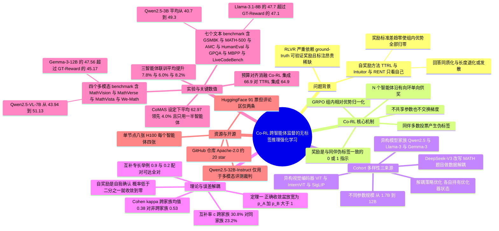

## 一、论文是干什么的？

先说清楚这篇论文想解决的那个「真问题」。

今天让大模型变会推理的最有效手段叫 **RLVR**（Reinforcement Learning with Verifiable Rewards，可验证奖励的强化学习）。这个名字听着复杂，机制其实很朴素：给模型一道数学题，让它自己写解答；如果最后的答案和标准答案一致，就给它一个「奖励」（reward，强化学习里衡量一次行为好坏的分数），不一致就不给。反复几万次之后，模型会逐渐学会那些能导向正确答案的思考方式。DeepSeek-R1 这一类推理模型能做出来，靠的就是这套流程。

问题出在「标准答案」这四个字上。**ground-truth 标签**（ground-truth，即人类确认过的、被当作唯一正确参照的答案）是要花钱花人力标出来的。更要命的是一个长期趋势：当模型的推理能力开始接近甚至超过人类专家时，人类根本没法可靠地判断它答得对不对——你没法给一个你自己都做不出来的题打分。所以「靠标准答案训练」这条路，天花板是人类自己的判断力。

学术界的第一个应对办法叫 **self-rewarding RL**（自奖励强化学习）：既然没有外部标准答案，就让模型自己给自己出答案。最典型的做法是 TTRL——让模型对同一道题采样一组解答（本文的实验里是 12 个），看哪个最终答案出现次数最多，就把那个「多数派答案」当成临时的标准答案（论文里叫 pseudo-label，伪标签），然后奖励所有和多数派一致的解答。听起来很聪明，实际上有个致命缺陷：**打分的人和被打分的人是同一个人**。

这里用一个生活类比：想象一个学生做完卷子，然后拿自己写的答案当答案册来批改自己的卷子。他每批一次，都会更加确信自己原来的答案是对的——哪怕那个答案根本是错的。批改一百次之后，他不但没有进步，反而把最初的那个错误固化成了信念，甚至连原本会尝试的其他解法都不再写了。论文观察到的现象和这个类比完全对应：模型的回答越来越**同质化**（homogenized）——所谓同质化，就像一家餐馆本来有八道菜，后来发现某道菜最受欢迎，于是把其他七道全撤了，菜单上只剩一道菜；模型也是这样，本来一道题能写出十几种不同的解法，训练到后面十二次采样写出来的几乎是同一篇答案。一旦如此，一组采样里所有解答的奖励都变成一模一样（奖励的标准差趋于 0），于是「哪个解答更好」这个信息彻底消失，训练要么停滞、要么回答长度爆炸性膨胀、要么直接发散——作者把这称为**训练崩塌**（training collapse）。

Co-RL 的破题思路一句话就能讲完：**别让模型自己批自己的卷子，让另一个来自完全不同学校的同学来批**。具体来说，让 $N$ 个彼此**不共享任何参数、不交换任何梯度**的模型同时做强化学习训练；每个模型的奖励，不是来自自己的多数派答案，而是来自「同伴」的多数派答案。因为两个独立预训练出来的模型犯的错不一样，同伴给出的答案就构成了一个真正外部的、去相关的参照——这是模型自己无论怎么采样都造不出来的信号。

更关键的一层洞察是：**同伴越不一样，这个外部信号越值钱**。如果两个模型是同一个家族、同一批预训练数据出来的，它们会在同样的地方犯同样的错（论文称之为**相关误差**，correlated errors）。这时互相批改的价值就退化了。所以作者把「差异」这件事推到极限：不同的模型家族（Qwen2.5、Llama-3、Gemma-3、InternVL）、不同的参数规模（1.7B 到 12B）、甚至用 DeepSeek-V3 把训练题目改写一遍，让两个智能体做的是「语义等价但表述不同」的题。结果是：在完全不用任何 ground-truth 标签的前提下，四个 LLM 在七个纯文本 benchmark 上的**平均分**分别提升 3.0% 到 8.6%，五个 VLM 在四个多模态 benchmark 上的平均分分别提升 2.3% 到 7.2%，多个设置下甚至超过了用真标准答案训练的上限参照。

这里要把摘要那两个百分比区间的含义说清楚，否则很容易读错。原文的措辞是「average gains of 3.0–8.6% across seven text-only benchmarks」，意思是：**先把七个 benchmark 的分数平均成一个数，再看这个平均分涨了多少；3.0 到 8.6 这个区间是四个被训练的 LLM 各自的平均分增益构成的区间**（最少的那个模型涨 3.0，最多的那个涨 8.6）。它**不是**「某一个模型在七个 benchmark 上各自增益的区间」——单个 benchmark 上其实有输有赢，第 4.6 节会举出具体倒退的格子。多模态那个 2.3% 到 7.2% 同理，是五个 VLM 各自「四个 benchmark 平均分」增益的区间。

## 二、核心方法与创新

### 2.1 先看清起点：GRPO 是怎么工作的

Co-RL 不是一个新的强化学习算法，它是一套「奖励从哪来」的新方案，底层仍然跑标准的 **GRPO**（Group Relative Policy Optimization，组相对策略优化）。所以先把 GRPO 讲明白。

给定一道题 $x$，模型（论文里叫策略 policy，记作 $\pi_\theta$，$\theta$ 是模型参数）采样出 $K$ 个解答 $\{y^1,\ldots,y^K\}$，每个解答拿到一个奖励 $r^k$。GRPO 不训练额外的价值网络（critic），它直接在这 $K$ 个解答内部做「相对比较」：

$$
\hat{A}^k=\frac{r^k-\mathrm{mean}(\{r^j\}_{j=1}^{K})}{\mathrm{std}(\{r^j\}_{j=1}^{K})+\epsilon}
$$

符号逐个解释：$\hat{A}^k$ 叫**优势**（advantage），意思是「第 $k$ 个解答比这一组的平均水平好多少」；$\mathrm{mean}$ 和 $\mathrm{std}$ 分别是这 $K$ 个奖励的均值和标准差；$\epsilon$ 是一个防止除零的极小常数。直观理解：一组里比平均分高的解答，优势为正，模型被推着更倾向于生成它；低于平均分的，优势为负，被推着远离它。

然后 GRPO 优化下面这个被裁剪过的目标函数：

$$
\mathcal{J}_{\mathrm{GRPO}}(\theta)=\mathbb{E}\left[\frac{1}{K}\sum_{k=1}^{K}\frac{1}{|y^k|}\sum_{t=1}^{|y^k|}\left[\min\left(\rho_{k,t}(\theta)\hat{A}^k,\ \mathrm{clip}(\rho_{k,t}(\theta),1-\delta,1+\delta)\hat{A}^k\right)-\beta\mathcal{D}_{\mathrm{KL}}^{k,t}\right]\right]
$$

其中 $\rho_{k,t}(\theta)=\dfrac{\pi_\theta(y_t^k\mid x,y_{<t}^k)}{\pi_{\theta_{\mathrm{old}}}(y_t^k\mid x,y_{<t}^k)}$ 是 token 级的**重要性比率**（新旧模型对同一个词的概率之比）；$|y^k|$ 是第 $k$ 个解答的 token 数；$\delta$ 是裁剪阈值，作用是不让单步更新走得太远；$\beta$ 控制 KL 正则的强度；$\mathcal{D}_{\mathrm{KL}}^{k,t}$ 惩罚模型偏离参考模型 $\pi_{\mathrm{ref}}$ 太多。

**这里有一个至关重要的隐含前提**：优势是靠组内标准差归一化的。如果一组里所有解答的奖励都相同，标准差就是 0，所有优势都归零——**模型学不到任何东西**。这正是理解「训练崩塌」的钥匙，后面会反复用到。

### 2.2 Co-RL 的核心：同伴投票产生的伪标签

现在换掉奖励的来源。设有 $N$ 个智能体，各自的策略是 $\{\pi_{\theta_1},\ldots,\pi_{\theta_N}\}$，参数完全独立。对每道无标注的题 $x$：

第一步，每个智能体 $n$ 各自采样 $K$ 个解答 $y_n^k$，并用一个抽取函数 $g(\cdot)$ 从中提取最终答案 $a_n^k=g(y_n^k)$（比如从 boxed 环境里把数字抠出来）。

第二步，构造伪标签。注意这一步的关键——**用的是同伴的答案，不是自己的**：

$$
\hat{a}_{-n}(x)\in\arg\max_b\sum_{j=1}^{K}\mathbf{1}\left[a_{n-1}^{j}=b\right]
$$

符号解释：$\hat{a}_{-n}(x)$ 是「供给智能体 $n$ 的伪标签」，下标 $-n$ 就是强调「不来自 $n$ 自己」；$b$ 遍历智能体 $n-1$ 产出的所有候选答案；$\mathbf{1}[\cdot]$ 是指示函数，括号里成立取 1、不成立取 0。所以整个式子就是「智能体 $n-1$ 的 $K$ 个答案里出现次数最多的那个」。索引按环状循环，即智能体 1 由智能体 $N$ 来监督——论文称之为**有向环**（directed ring）。

第三步，发奖励：

$$
r_n^k=\mathbf{1}\left[a_n^k=\hat{a}_{-n}(x)\right]
$$

也就是说，智能体 $n$ 的第 $k$ 个解答，只要最终答案和**同伴的多数派答案**一致就得 1 分，否则 0 分。这是一个纯 0/1 的稀疏奖励，不需要任何评分模型、不需要 LLM-as-judge、不需要学习出来的 reward model。

第四步，各自独立更新：

$$
\max_{\boldsymbol{\theta}}\ \mathcal{J}_{\mathrm{Co\text{-}RL}}(\boldsymbol{\theta})=\frac{1}{N}\sum_{n=1}^{N}\mathcal{J}_{\mathrm{GRPO}}\left(\theta_n;\{y_n^k,r_n^k\}_{k=1}^{K}\right)
$$

其中 $\boldsymbol{\theta}=(\theta_1,\ldots,\theta_N)$ 是所有智能体参数的集合。注意这个目标是「各家 GRPO 目标的平均」，梯度不跨智能体传播——每个 $\theta_n$ 的梯度只和自己那一项有关。智能体之间**唯一的耦合点就是奖励**。

**类比**：这像一个学习小组，每个人独立做题，然后把自己的最终答案报给下一位同学；每位同学拿上一位同学的「小组多数意见」当参考答案，来判断自己那 12 份草稿哪几份写对了。没有老师，没有答案册，也没人抄别人的解题过程——只交换最终结论。

**为什么不能让智能体自己也参与投票？** 论文明确强调「每个智能体绝不为自己的监督目标贡献任何一票」。一旦自己的票混进伪标签，自我确认的回路就重新接通了，Co-RL 就退化成半个 TTRL。

### 2.3 算法流程

论文给出的 Algorithm 1 可以直接翻成步骤：

1. 初始化 $N$ 个智能体 $\{\pi_{\theta_n}\}$，它们来自**不同的**基座模型。
2. 每个训练步：从无标注数据集 $\mathcal{D}$ 里采一个 batch 的 prompt $\mathcal{B}$。
3. 对 batch 里的每道题 $x$：让每个智能体 $n$ 独立采样 $K$ 个解答 $y_n^k$，抽取答案 $a_n^k \leftarrow g(y_n^k)$。
4. 对每个智能体 $n$：用同伴 $n-1$ 的答案按上面的公式算出伪标签 $\hat{a}_{-n}(x)$。
5. 对每个解答 $k$：赋奖励 $r_n^k \leftarrow \mathbf{1}[a_n^k=\hat{a}_{-n}(x)]$。
6. **所有 rollout 与所有伪标签全部算完之后**，才统一做一次 GRPO 更新，同时更新所有 $\{\theta_n\}$。

第 6 步的顺序不是细节。如果一边更新一边取伪标签，同伴的「答案」就会在一个 batch 内部漂移，监督信号会变得不可控。论文的做法保证了同一步内所有智能体看到的是彼此**同一个快照**的意见。

### 2.4 多样性的三个来源：为什么不一样才值钱

这是全文最重要的观念性贡献。作者把多样性拆成三个可操作的层次。

**第一，解耦的策略优化**。两个策略各自维护自己的参数和优化器状态（optimizer state，如 AdamW 的动量项），梯度不互通。这本身就是一种多样性来源：独立更新意味着两者不会被直接拉到一起，训练全程都能保持预测的低相关性。对比一下 Co-rewarding-II 这类方法——它的第二个「视角」是同一个模型的滑动平均副本，本质上还是自己，误差高度相关。

**第二，跨模型家族与跨规模**。这是主要来源。不同家族在整条研发流水线上都不一样：架构、tokenizer（分词器）、词表大小、预训练语料、后训练方式。论文举例：Qwen2.5 和 Llama 3 的分词器和词表大小、架构选择、预训练语料都不同；Gemma 用了 256K 的词表和交错的局部-全局注意力。到了视觉语言模型（VLM）差异更大，因为各家的**视觉编码器**（把图片转成向量的模块）根本不是一个东西：Qwen2.5-VL 用原生动态分辨率的 ViT，InternVL 用 InternViT，Gemma 3 用 SigLIP。规模差异是另一个正交的来源：容量不同的模型擅长与失手的题目分布不同，因此能在对方做错的题上提供有效信号。

**第三，输入形式的解耦**（也叫数据解耦）。即使模型和优化都解耦了，两个智能体做的还是同一批题。作者进一步用 DeepSeek-V3 把每道 MATH 题改写一遍，一个智能体训原题、另一个训改写题。改写不是换同义词，而是**把题目换到一个具体的现实场景里**，长度大约翻倍，但答案和行序严格不变。论文说在 300 对样本的抽查里，每一条改写都保住了答案和对齐。

论文给的一个真实例子：原题「$y=\frac{2}{x^2+x-6}$ 的图像有几条垂直渐近线？」被改写成「函数 $f(t)=\frac{2}{t^2+t-6}$ 描述一个化学反应随时间 $t$ 的温度，这个函数的图像上出现几条垂直渐近线？」。另一例：「三角形 $ABC$ 中 $AB=AC=14$、$BC=26$，最短的角平分线长多少？」改写成「一个三角形公园两条等边各 14 米、第三边 26 米，市政府计划从每个角修一条平分该角的小路，只建最短的那一条，它有多长？」两题答案分别是 2 和 $3\sqrt{3}$。

**类比**：第二种来源相当于找一个别的学校、用别的教材长大的同学；第三种来源相当于让你们俩做同一道题的两个不同版本的应用题包装。前者换掉「知识来源」，后者换掉「题面表述带来的思维定势」。

### 2.5 相关误差与训练崩塌，到底是什么

这两个概念是全文的因果核心，值得单独用生活语言讲透。

**相关误差**（correlated errors）：两个学生用的是同一本印错了的教科书。第 37 页那个公式印错了，两人都照着背下来，于是凡是用到这个公式的题，两人给出的是**同一个错误答案**。这时候他们互相对答案，会发现「我们答案一致」，从而双双确信自己是对的。多数投票在这种情形下完全失效——它只能发现「大家不一致」，发现不了「大家一致地错」。论文把这种情况单独度量为**错误一致率** $w$（wrong-agreement，两个模型都错、且错成同一个答案的比例），并明确说这是「多数投票检测不到的那部分」。

反过来，如果两个学生用的是不同出版社的教材、不同老师教的，他们的错就散落在不同的题上：A 错的题 B 往往对，B 错的题 A 往往对。这时 A 就能拿 B 的答案纠正自己——这才是 Co-RL 的燃料。

**训练崩塌**（training collapse）：想象一个作家开始只读自己写的东西。他觉得某种句式好，就更多地用它；用得越多，他重读时看到的就越是这种句式；于是他更加确信这是好句式。几个月后，他写的所有段落都长得一模一样，他的「品味」已经没有任何外部输入可以修正。翻译成 RL 的语言：模型越来越同意自己的伪标签，一组 12 个采样的奖励逐渐全变成 1（或全变成 0），奖励标准差趋近于零，2.1 节说的组内相对优势全部归零，学习信号消失。论文在 Figure 4 的三条曲线里正是这么测的：（a）MATH-500 验证准确率、（b）组内奖励标准差（按第一步归一化）、（c）平均生成长度。

论文观察到的具体崩塌形态：**RENT** 迅速把奖励标准差压到零，同时生成长度急剧变长，准确率下降甚至发散；**Intuitor** 同样大幅降低奖励波动，某些模型上出现长度退化；**TTRL** 相对稳定，但奖励波动整体下降，验证性能始终低于 Co-RL。而 Co-RL 在图里的四个骨干上都维持了非退化的奖励标准差和相对稳定的生成长度，同时准确率稳步提升。（附录 D.3 的原话是「across all four model families」，但 Figure 4 的四列其实是 Qwen2.5-3B、Llama-3.2-3B、Qwen2.5-7B、Llama-3.1-8B，即两个家族的四个规模，说「四个家族」是原文的措辞不严。）

多模态侧还有一个更漂亮的证据（Figure 5）：训练全程两个智能体的**一致率始终明显低于完全一致**，但**交换的伪标签准确率却在稳步上升**。也就是说，两个智能体并没有收敛成同一个模型（那就等于崩塌了），而是保住了各自的差异，同时给对方的监督越来越可靠。

### 2.6 理论：为什么跨智能体监督能纠错，自奖励不能

作者做了一个可解析的简化模型。固定一道题 $x$，把答案空间压成两种结果：正确答案 $a^\star$ 和「聚合起来的错误答案」。令 $p_n=\Pr_{\pi_{\theta_n}}(a=a^\star\mid x)$ 表示智能体 $n$ 答对的概率，$\eta$ 为 GRPO 的更新速率，并假设 $K$ 为奇数（这样多数投票不会平票；作者诚实地说明实验里 $K$ 是偶数，平票是确定性地打破而非丢弃）。

**自奖励的动力学**。令 $C\sim\mathrm{Bin}(K,p)$ 表示 $K$ 次采样里答对的次数（二项分布）：

$$
\dot{p}=\eta\,p(1-p)\,\mathbb{E}_{C\sim\mathrm{Bin}(K,p)}\left[\mathrm{sign}\left(C-\frac{K}{2}\right)\frac{\sqrt{C(K-C)}}{K}\right]
$$

这里 $\dot{p}$ 是 $p$ 随训练时间的变化率，$\mathrm{sign}(\cdot)$ 是符号函数。注意 $\mathrm{sign}(C-K/2)$ 这一项：它的正负完全由「这一组里多数派是对的还是错的」决定，而多数派又是由当前的 $p$ 决定的。

**Co-RL 的动力学**。令 $Z_{-n}=\mathbf{1}[\hat{a}_{-n}(x)=a^\star]$ 表示同伴给的伪标签是否正确：

$$
\dot{p}_n=\eta_n p_n(1-p_n)\,\mathbb{E}\left[\mathrm{sign}\left(Z_{-n}-\frac{1}{2}\right)\right]\mathbb{E}_{C_n\sim\mathrm{Bin}(K,p_n)}\left[\frac{\sqrt{C_n(K-C_n)}}{K}\right]
$$

结构上的差别一目了然：右边的 $\eta_n p_n(1-p_n)$ 与最后那个期望合在一起**恒为正**（论文把这一整块记作更新幅度 $q_K(p)>0$），所以更新的**方向**完全由中间那个期望、也就是同伴的信号决定。两智能体时可以写成极简形式：

$$
\dot{p}_A=q_K(p_A)\phi_K(p_B),\qquad \dot{p}_B=q_K(p_B)\phi_K(p_A)
$$

其中 $\phi_K(p)=2V_K(p)-1$ 是「带符号的多数投票方向」，$V_K(p)$ 是多数投票正确的概率。**$A$ 往哪走，由 $B$ 说了算**，这就是「解耦」在数学上的准确含义。

**命题 2（自奖励是自我确认的）**：对奇数 $K$，$\mathrm{sign}(G_K^{\mathrm{self}}(p))=\mathrm{sign}(p-\frac{1}{2})$。于是 $p(0)<\frac{1}{2}\Rightarrow p(t)\to 0$，$p(0)>\frac{1}{2}\Rightarrow p(t)\to 1$。翻译成人话：**如果模型一开始在这道题上答对的概率不到一半，自奖励训练会把它推向 0，把错误彻底固化。**

**定理 1（Co-RL 扩大了正确收敛盆）**：在对称的两智能体动力学下，$(1,1)$ 与 $(0,0)$ 都是渐近稳定的，$(1/2,1/2)$ 是鞍点，其内部分界线是 $p_A+p_B=1$。因此

$$
p_A(0)+p_B(0)>1\ \Longrightarrow\ (p_A(t),p_B(t))\to(1,1)
$$

$$
p_A(0)+p_B(0)<1\ \Longrightarrow\ (p_A(t),p_B(t))\to(0,0)
$$

差别在哪？自奖励要求**每个模型自己**在这道题上就超过 50%；Co-RL 只要求**两个模型之和**超过 100%。这是一个明显更宽松的条件。

作者给了一个极端例子说明威力：假设一半题目上 $(p_A,p_B)=(0.9,0.2)$，另一半上 $(p_A,p_B)=(0.2,0.9)$。两个模型的平均准确率都只有 0.55，但强项完全互补。自奖励下，每个模型只在自己 $p>1/2$ 的那一半题上成功，最终准确率 0.5；而 Co-RL 下 $p_A+p_B=1.1>1$ 在**每一道题**上都成立，定理 1 预测两者在所有题上都收敛到正确答案，最终准确率 1.0。

这个例子也顺手解释了为什么「多样性」在理论层面就是必需品：如果两个模型完全一样，$p_A=p_B=p$，条件退化成 $2p>1$ 即 $p>1/2$，和自奖励一模一样，什么都没赚到。

### 2.7 一个独立的实证支撑：预训练误差解耦的量化

附录 A 是全文我认为最扎实的一块，它在**任何 RL 训练之前**就把「不同家族的模型错得更不一样」这件事量化了，所以结论描述的是预训练模型本身，而不是训练过程的产物。

**度量方式**：在 500 道 MATH 第 3 到 5 难度级的题上，对各个基座 checkpoint 零样本单次采样（温度 $T=0.8$），用规则抽取和等价性判定打分。对一对模型来说，每道题落进「都对／只有 A 对／只有 B 对／都错」四格之一，四个指标都是这四格的计数：

- **互补率** $c$：恰好只有一个模型答对的题目比例，越高说明一方能纠正另一方的机会越多。
- **oracle 准确率** $u$：不在「都错」格里的题目比例，即一个完美选择器能达到的上限。
- **错误一致率** $w$：「都错」格里两模型还给出**同一个错误答案**的部分，这是多数投票发现不了的盲区。
- **Cohen's $\kappa$**：衡量两模型落在同一格的程度（超出偶然的部分），越低说明误差越解耦。

作者很诚实地提醒：$\kappa$ 和 $c$ 是同一次测量的两种读数，不是独立证据，在这 12 对模型上二者相关系数达 $r=-0.98$。

**结果**（Table 6，摘录）：

| 解耦层级 | 模型对 | $\kappa$ 越低越好 | $c$ 越高越好（%） | $w$ 越低越好（%） | $u$ 越高越好（%） |
|---|---|---|---|---|---|
| 不同家族 | Llama-3.2-3B × Phi-3.5-mini | 0.31 | 32.8 | 3.0 | 53.0 |
| 不同家族 | Qwen2.5-3B × Llama-3.2-3B | 0.38 | 31.2 | 2.4 | 63.0 |
| 不同家族 | Qwen2.5-3B × MiniCPM3-4B | 0.41 | 29.4 | 4.4 | 60.4 |
| 同一家族 | Qwen2.5-3B × Qwen3-1.7B-Base | 0.52 | 24.2 | 4.2 | 63.2 |
| 仅换种子 | Qwen2.5-3B × 自己 | 0.56 | 22.0 | 4.4 | 62.6 |
| 不同家族 | Qwen2.5-7B × Llama-3.1-8B | 0.42 | 29.4 | 1.8 | 71.4 |
| 同一家族 | Qwen2.5-7B × Qwen2.5-3B | 0.51 | 24.2 | 3.8 | 69.8 |
| 仅换种子 | Qwen2.5-7B × 自己 | 0.58 | 19.0 | 5.2 | 74.6 |

三个层级**完全不重叠**：所有「不同家族」的对都满足 $\kappa\le 0.42$ 且 $c\ge 29.4$；所有「同一家族」和「仅换种子」的对都满足 $\kappa\ge 0.51$ 且 $c\le 24.6$，中间没有任何一对落在夹缝里，两个规模档都如此。组内平均看，跨家族把 $\kappa$ 从 0.53 降到 0.38，把 $c$ 从 23.2 提到 30.8。

还有一个更干净的对照：固定一个「锚模型」只换搭档（Table 7）。相对于和自己配对，换同家族搭档只把 $\kappa$ 降低 0.04 和 0.07，而换不同家族搭档降低 0.18 和 0.16，同时把 $c$ 抬高 9.2% 和 10.4%。因为锚模型不变，能力这个变量被控住了，唯一的变量就是搭档的来源。

作者的结论说得很干脆：**同家族的同伴至少给了你一个不是自己产出的目标，这足以让训练稳定；但那个目标在四分之三的题目上只是复述你本来就会给的答案。跨家族才是买到剩余提升空间最便宜的办法。**

## 三、使用了哪些模型和计算资源？

| 条目 | 内容 |
|---|---|
| 主实验用的 LLM / 基座模型 | 文本侧：Qwen3-1.7B；Qwen2.5-3B 配 Llama-3.2-3B-Instruct；Qwen2.5-7B 配 Llama-3.1-8B-Instruct。多模态侧：Qwen2.5-VL（3B、7B）、InternVL3.5（2B、8B）、Gemma-3（4B、12B），按相近规模配对；7B 到 12B 的实验里 InternVL3.5-8B 作为共享搭档。注意 Gemma-3-4B 只出现在这份「Models」清单里，正文与附录的任何结果表都没有它的数字，摘要的说法也是「五个 VLM」（对应 2B、3B、7B、8B、12B）。CoMAS 对照实验用 Qwen2.5-3B-Instruct |
| 对比的 baseline 模型 | 无标签自奖励类：TTRL、Intuitor、RENT、Co-rewarding-II；多模态自奖励：MM-UPT；多智能体 RL：MAPoRL、CoMAS；有监督参照：带 ground-truth 奖励的 GRPO（论文记作 GT-Reward）；以及各基座模型自身（Base） |
| 评测/打分用的模型（LLM-as-judge） | 训练阶段**不用任何 judge 模型**，奖励纯粹来自同伴多数投票。仅在**多模态评测**的第二阶段用 Qwen2.5-32B-Instruct（温度 0）作为裁判，且它只能救回规则打分的假阴性，永远不能推翻规则已经判对的答案。另外用 DeepSeek-V3 改写 MATH 训练题（数据解耦），这是数据构造而非打分 |
| 训练硬件 | 单节点 8 张 H100 GPU，每个智能体分 4 张。GitHub README 补充说明为每节点 8 张 80GB GPU |
| 推理/评测硬件 | 原文未披露单独的评测硬件配置；README 的评测脚本示例使用单卡 |
| 是否用商业 API | 论文未说明 DeepSeek-V3 改写是走官方 API 还是本地权重，未披露端点信息。训练与评测主体流程不依赖商业 API（唯一的 judge 是自托管的 Qwen2.5-32B-Instruct） |
| 单个完整计算单位的耗时 | **原文未披露**任何 GPU 小时数、wall-clock 训练时长或单条轨迹耗时。论文只给了工作量的间接刻画：文本侧每个智能体每步有效 batch 128 个 prompt、每个 prompt 采 $K=12$ 个回答、3072 token 上限、训练 2 个 epoch；多模态侧 $K=8$、1024 token 上限、训练 1 个 epoch。评测侧披露的规模是 MathVision 测试集 3040 题、MathVerse testmini 3940 题（含全部五个版本）、MathVista testmini 1000 题、We-Math testmini 1740 题；AMC 每题采 8 个回答报 avg@8 并跨 3 个评测种子平均 |
| 金钱成本 | **原文未披露**任何 API 费用或云算力开销数字 |
| 代码是否开源 | 是，[github.com/DrStranded/Co-RL](https://github.com/DrStranded/Co-RL)（Apache-2.0，截至 2026-08-22 约 20 star、1 fork），项目主页 [drstranded.github.io/Co-RL](https://drstranded.github.io/Co-RL)。环境要求 CUDA 12.8、Python 3.12（文本）或 3.11（多模态）。仓库未见公开发布训练后的 checkpoint |

**其他值得记的训练细节**：全部实验用 AdamW 优化器，rollout 温度 1.0。文本模型学习率 $3\times10^{-6}$（沿用 Co-rewarding 的设置），多模态学习率 $1\times10^{-6}$（沿用 R1-V 的设置）。因为 Gemma-3 上 rollout 分布和训练前向分布会漂开（论文测到 vLLM rollout 引擎与训练前向之间每 token 约 0.13 的系统性 log 概率漂移，作者判定这是架构层面的差异而非可修的 bug），Gemma-3 且仅 Gemma-3 的运行额外加了 token 级的重要性采样比率截断。

论文附录 D.5 还老实交代了一批工程修复：Gemma-3 在 DeepSpeed ZeRO-3 下 embedding 初始化会因为多数 rank 持空分片而崩；Gemma-3 processor 在批量 prompt 长度不等时构造 token 类型张量会失败；vLLM 0.11.2 会把 Qwen2.5-VL 视觉塔的注意力后端从 xFormers 悄悄升级到 FlashAttention，而后者只支持 head 维度为 32 倍数、Qwen2.5-VL 视觉塔 head 维度是 80，于是加载即崩。这些都随代码一起发布，且作者声明不改变训练与评测语义。

## 四、实验结果

### 4.1 文本推理：七个 benchmark

评测集：数学用 GSM8K、MATH-500、AMC；代码用 HumanEval、MBPP、LiveCodeBench（v6 版本，走官方 harness，默认温度 0.2）；科学用 GPQA（Diamond 子集，boxed 答案 prompt）。除 LiveCodeBench 外都跑 lm-evaluation-harness，温度 0.6、top-$p$ 0.95、3072 token 生成预算。

3B 档主表（Table 1，平均分）：

| 方法 | Qwen2.5-3B 平均 | Llama-3.2-3B-Instruct 平均 |
|---|---|---|
| Base（基座） | 40.7 | 38.7 |
| GT-Reward（有标签上限参照） | 47.4 | 43.0 |
| TTRL | 47.3 | 43.1 |
| RENT | 44.9 | 38.6 |
| Intuitor | 45.6 | 39.7 |
| Co-rewarding-II | 45.6 | 41.8 |
| Co-RL（同家族） | 48.7 | 42.7 |
| Co-RL（不同家族） | 48.5 | 43.7 |
| Co-RL（不同家族加数据解耦） | **49.3** | **43.9** |

读法：连「同家族」这个最容易搭起来的配置就已经把 Qwen2.5-3B 从 40.7 抬到 48.7（提升 8.0），Llama-3.2-3B 从 38.7 抬到 42.7（提升 4.0）。加上跨家族、再加上数据解耦，两个模型都取得了最好的无标签平均分，且**都超过了用真标准答案训练的 GT-Reward**（49.3 对 47.4，43.9 对 43.0）。

7B/8B 档（Table 8，平均分）：Qwen2.5-7B 从 49.0 提到 53.6，Llama-3.1-8B-Instruct 从 44.7 提到 47.7。相比最强的自奖励基线，分别领先 0.8% 和 1.1%。Llama-3.1-8B 上 Co-RL 的 47.7 也超过了 GT-Reward 的 47.1。

把四个 LLM 的提升幅度并起来看：提升 8.6（Qwen2.5-3B，40.7 到 49.3）、提升 5.2（Llama-3.2-3B，38.7 到 43.9）、提升 4.6（Qwen2.5-7B，49.0 到 53.6）、提升 3.0（Llama-3.1-8B，44.7 到 47.7），这就是摘要里「3.0% 到 8.6%」的来源。

### 4.2 与多智能体 RL 方法对比（CoMAS 设定）

这一组按 CoMAS 的原始设定、官方实现和评测集来做，全部方法训练 Qwen2.5-3B-Instruct，先前方法的数字直接引用 CoMAS 原论文（Table 2，平均分）：

| 方法 | 平均分 |
|---|---|
| Base | 56.92 |
| MAPoRL | 58.22 |
| TTRL | 58.18 |
| CoMAS | 58.94 |
| Co-RL（不同家族） | **62.97** |

Co-RL 在七个 benchmark 中的五个上领先，平均领先 CoMAS **4.0%**，而且**只用了一半数量的智能体**，也不需要额外的评判机制。

这里作者做了一件值得表扬的事：他们指出 CoMAS 的评测协议在代码题上存在漏洞。协议是每题采 5 个样本，再发第 6 次调用对这 5 份草稿做汇总推理，只批第 6 份回答；在代码题上，如果这份回答里引用了多个候选解，harness 会把每个代码块都执行、遇到第一个通过的就停，于是「引用一堆候选」的模型实际上被按 pass@5 打分，而「给一个确定答案」的模型按 pass@1 打分。作者测出这个漏洞值 7.3% 给未训练的基线、值 2.4% 给自己的模型，因此在代码题上保留 5 样本预算但把汇总换成了「按公开样例输入的执行行为聚类后再多数投票」。

### 4.3 多模态推理：四个 benchmark

评测集：MathVision（3040 题）、MathVerse（testmini 3940）、MathVista（testmini 1000）、We-Math（testmini 1740）。贪心解码，16384 token 生成预算，图片长边缩到不超过 1024 像素以对齐训练时的预处理。

小规模对（Qwen2.5-VL-3B 与 InternVL3.5-2B，Table 4 摘录平均分）：

| 训练集 | 骨干 | Base | TTRL | Co-RL | GT-Reward |
|---|---|---|---|---|---|
| open-r1 | Qwen2.5-VL-3B | 37.24 | 42.54 | **43.89** | 42.97 |
| MMR1 | Qwen2.5-VL-3B | 37.24 | 37.97 | **41.12** | 41.03 |
| open-r1 | InternVL3.5-2B | 43.11 | 45.04 | **45.40** | 45.20 |
| MMR1 | InternVL3.5-2B | 43.11 | 45.30 | 45.15 | 44.65 |

大规模（7B 到 12B，Table 9，open-r1 训练集，InternVL3.5-8B 作共享搭档）：

| 骨干 | Base | TTRL | Co-RL | GT-Reward | Co-RL 相对 Base |
|---|---|---|---|---|---|
| Qwen2.5-VL-7B | 43.94 | 48.88 | 51.13 | 51.68 | 提升 7.2 |
| InternVL3.5-8B | 48.06 | 54.16 | 54.40 | 55.85 | 提升 6.3 |
| Gemma-3-12B | 41.78 | 44.45 | **47.56** | 45.17 | 提升 5.8 |

Gemma-3-12B 上 Co-RL 的 47.56 超过了 GT-Reward 的 45.17，而且三个家族上 Co-RL 都胜过 TTRL。摘要里「2.3% 到 7.2%」对应的两端是 InternVL3.5-2B 的提升 2.3（43.11 到 45.40）和 Qwen2.5-VL-7B 的提升 7.2。

### 4.4 三智能体：cohort 规模的扩展

作者把 Qwen2.5-3B、Llama-3.2-3B-Instruct、Qwen3-1.7B 三个模型放进同一次训练（Table 3，平均分）：

| 模型 | Base | GT-Reward | TTRL | Co-RL（三智能体） | 提升 |
|---|---|---|---|---|---|
| Qwen2.5-3B | 40.7 | 47.4 | 47.3 | 48.5 | 7.8 |
| Llama-3.2-3B-Instruct | 38.7 | 43.0 | 43.1 | 44.7 | 6.0 |
| Qwen3-1.7B | 39.1 | 47.2 | 47.3 | 47.3 | 8.2 |

三个模型的平均提升分别是 7.8%、6.0%、8.2%，且三者都**匹配或超过**了各自的 GT-Reward。在 Qwen2.5-3B 和 Llama-3.2-3B 上也胜过 TTRL；Qwen3-1.7B 上与 TTRL 打平（47.3 对 47.3）。这说明有向环的设计确实能从两个扩展到三个智能体，但也说明**更多智能体不等于线性更好**：1.7B 这个最小的成员没有从额外的搭档里拿到超出 TTRL 的额外收益。

### 4.5 最关键的消融：提升到底来自跨智能体监督还是多训了一个模型

这是我认为审稿人一定会问的问题，作者主动回答了（附录 D.4）。做法是构造一个**训练预算与推理预算都对齐**的对照：同样两个基座模型，各自独立用 TTRL 训练；推理时两边都做集成——每个模型出 4 个回答，8 个回答池化后多数投票（maj@8，$T=0.6$）。

文本侧（Table 10）：

| 设置 | GSM8K | MATH-500 | AMC | 平均 |
|---|---|---|---|---|
| TTRL（Qwen2.5-3B） | 88.2 | 68.8 | 39.8 | 65.6 |
| TTRL（Llama-3.2-3B） | 65.7 | 56.0 | 27.7 | 49.8 |
| TTRL（集成） | 88.2 | 68.0 | 38.6 | 64.9 |
| Co-RL（Qwen2.5-3B） | 87.4 | 72.8 | 37.4 | 65.9 |
| Co-RL（Llama-3.2-3B） | 87.3 | 58.8 | 33.7 | 59.9 |
| Co-RL（集成） | **90.1** | 70.8 | 39.8 | **66.9** |

这里有一个非常说明问题的数字：TTRL 的两个模型集成起来（64.9）**还不如它自己更强的那一个单模型**（65.6）。Co-RL 训出来的两个模型则不同：弱的那个从 49.8 级别被拉到 59.9，集成后 66.9 超过了任一单模型。至于为什么会这样，**下面这个解释是本综述的推断，论文只报了数字、没有给因果分析**：合理的读法是 TTRL 那个只有 49.8 的弱模型拖低了集成结果，而两个模型又都是在自己的输出上做强化的，犯错的方向也容易彼此重合。

多模态侧（Table 11）同样如此：open-r1 上 Co-RL 集成 50.88 对 TTRL 集成 48.80；MMR1 上 52.30 对 49.19。作者的结论是：**Co-RL 的优势没法用「多训了一个模型」或「集成」来解释，跨智能体监督真正改变的是这两个模型的预测如何互补。**

### 4.6 这些数字该怎么读，有哪些需要打折扣的地方

有几点需要冷静看待。

**第一，超过有监督不等于无标签比有标签强。** 论文里的 GT-Reward 是「用 ground-truth 奖励跑 GRPO」的单模型运行，它只训一个模型、也不做集成。Co-RL 是两个模型联训。所以有些「超过 GT-Reward」的比较，混入了额外算力和额外模型的贡献。作者自己在 D.4 做的预算对齐实验只对齐了 Co-RL 和 TTRL，**没有把 GT-Reward 也扩到两模型预算**，这是一个留白。

**第二，同一个数字在不同表里不一样，因为评测协议不同。** 比如 Qwen2.5-3B 在 Table 1（单样本、温度 0.6）的 GSM8K 落在 78.5 到 81.0 区间，而在 Table 10（maj@8）里是 87.4 到 88.2。**跨表比较数字是无意义的**，只能在表内比较。作者也明确警告过 MMR1 的运行用的是修正后的选择题打分器、open-r1 的运行用的是旧版打分器，所以这两块结果不能互相对比。

**第三，绝对量级不大，且不是每一格都赢。** 平均分的提升多在 3 到 8 个点，单个 benchmark 上则有输有赢：比如 Llama-3.2-3B 上 Co-RL（不同家族）的 LiveCodeBench 是 11.0，还低于 Base 的 12.0；InternVL3.5-2B 在 MMR1 上 Co-RL 的 45.15 略低于 TTRL 的 45.30。GPQA 这类知识密集的科学题上，各方法的数字普遍在 17 到 30 之间大幅抖动（Qwen2.5-7B 的不同家族加数据解耦变体甚至跳到 37.9），而 GPQA Diamond 只有几百题，这种量级的波动很难说是真实的能力差异还是采样噪声。论文没有报告主表结果的多种子标准差（只有 AMC 说明跨 3 个评测种子平均），这是可信度上的一个明显缺口。

**第四，训练数据分布很窄，泛化的解释要谨慎。** 文本侧训练只用了 MATH 第 3 到 5 级的题，但评测覆盖代码（HumanEval、MBPP、LiveCodeBench）和科学（GPQA）。数学题上训练出的收益转移到代码上，可能更多是「输出格式规整化」「不再废话」这类通用效应，而不是真的学会了编程推理。多模态侧训练也只在两个数学数据集上。

**第五，理论模型的简化很强。** 定理 1 建立在「二元答案空间、$K$ 为奇数、忽略裁剪与 KL 项、对称动力学」这一堆假设上。作者本人诚实标出实验里 $K$ 是偶数、平票是确定性打破的。所以定理应该当作**机制的定性说明**，而不是对实验数字的定量预测。

**第六，$\kappa$ 与 $c$ 不是两份独立证据。** 作者自己写明这两个指标相关系数 $r=-0.98$，是同一次四格测量的两种读数。所以附录 A 的「三个层级完全不重叠」实质上是**一个**发现，不是四个。

**第七，缺少一个重要的失败模式实验。** 如果 cohort 里的两个模型能力差距悬殊（比如 12B 配 0.5B），弱者的多数派意见会不会反过来污染强者？论文的配对全都是「相近规模」，三智能体那组里 1.7B 也没落后太多。这个边界在论文里没有被压测。

## 五、潜在应用与已落地应用

### 作者明确提到的

作者把 Co-RL 定位为「无标签推理训练」的通用配方，明确覆盖两类场景：**纯文本推理**（数学、代码、知识密集型科学题）和**多模态数学推理**。结论一节点出的未来方向有两条：一是理解「智能体的数量、多样性与交互拓扑如何塑造跨智能体学习」，注意目前只验证到有向环、$N=3$；二是发展**自适应的监督机制**，更有效地利用互补专长（现在的机制是无差别地信任同伴的多数派，不管同伴在这道题上是否可靠）。

另外，附录 A 那套误差解耦度量（$\kappa$、$c$、$w$、$u$）本身就是一个可复用的工具：在开跑之前，你可以先花 500 道题的推理成本，测一下候选搭档和你的模型误差重合程度，据此挑搭档。不过要照论文自己的口径说清楚：同家族搭档**并非无效**——第四节那张表里，光是同家族配对就已经把 Qwen2.5-3B 抬了 8.0 分、Llama-3.2-3B 抬了 4.0 分，足以让训练稳住。跨家族的真正价值在于**买到剩下那段提升空间最便宜**，因为同家族的同伴大约有四分之三的题目只是在复述你本来就会给的答案。

### 合理推演的潜在方向

- **超人类能力区间的自我提升。** 这是这条技术路线最有价值的想象空间：一旦模型能力越过人类可靠评判的边界，Co-RL 这类不需要人类标签的机制就是少数可行的训练信号来源。当然定理 1 也划出了硬边界，如果 cohort 里所有成员在某类问题上都不到 50% 正确率且错法相关，Co-RL 会一起收敛到错误答案，不会凭空变出正确知识。
- **模型多样性变成一种资产。** 如果跨家族的误差解耦确实是稀缺资源，那么「同时持有 Qwen 系与 Llama 系与 Gemma 系权重」在训练阶段就有了实际价值，而不只是做选型对比。这对开源生态是个正向激励。
- **企业内部的无标注领域适配。** 一个公司有大量内部技术问题但没有标准答案，理论上可以用两个来自不同家族的开源模型互相监督，在自己的语料上做 RL。成本关键点在于要同时跑两套 rollout。
- **给已有的自奖励流水线做防崩塌补丁。** 论文的机制本质上是把「奖励来源」和「被优化对象」解耦。任何已经在跑 TTRL 或 MM-UPT 的团队，理论上换掉伪标签来源这一处就能接上，改动量小。
- **推理时的顺带好处。** D.4 显示 Co-RL 训出来的两个模型集成起来的效果比独立训练的两个模型集成更好，这意味着 Co-RL 也可以被当成一种「训练一对互补模型」的方法，服务于线上 maj@k 集成部署。

### 已知的实际落地或被采用情况

截至综述撰写时（2026-08-22）**未见公开的工业落地案例**。可核实的公开进展只有：代码于 2026 年 8 月发布在 [GitHub](https://github.com/DrStranded/Co-RL)（Apache-2.0），仓库约 20 star、1 fork；同时有项目主页。仓库中未见发布训练后的模型 checkpoint，也未见第三方复现报告。README 明确说明仓库里的启动脚本是「示意性配置」（小模型对、短 rollout 预算），要复现论文数字需要自己调模型、batch、梯度累积、最大步数、数据集等变量。

## 六、网络上的讨论与评价

**HuggingFace Papers 页面**（[huggingface.co/papers/2608.17253](https://huggingface.co/papers/2608.17253)）：截至 2026-08-22 共 **91 票**赞成；页面记录的 arXiv 公布日是 2026-08-19，进入 Daily Papers 的日期是 2026-08-20，页面归属机构显示为 University of California at San Diego，提交者是用户 William Li（`williamium`）。投票者名单里能看到本文作者之一 Yuexin Bian（`alwaysbyx`）。

**评论区情况：如实说，非常安静。** 讨论区一共只有两条内容：

1. 提交时贴出的论文摘要本身（不含额外解释或回应）。
2. [Librarian Bot](https://huggingface.co/librarian-bots) 的自动化相似论文推荐，列出了 StructReward、SVR-R1、From RLVR to RLSVR、Consistency as Inductive Bias、MADA-RL、Off-Context GRPO、GFlowRL 等 7 篇由 Semantic Scholar API 推荐的相关论文。

也就是说，**91 票的关注度并没有转化成任何实质性的技术讨论、提问或质疑**。

**GitHub**：[DrStranded/Co-RL](https://github.com/DrStranded/Co-RL) 约 20 star、1 fork，Apache-2.0 许可。未见 issue 或 discussion 中的实质性技术往来。

**其他渠道：截至 2026-08-22 未检索到实质性的公开讨论。** 我尝试过的渠道与关键词组合包括：

- 论文全名加 `multi-agent RL`
- arXiv ID `2608.17253` 加 `reddit` 或 `alphaxiv`
- 方法名 `Co-RL` 加 `cross-agent supervision` 或 `label-free reinforcement learning`，并限定 X/Twitter
- 作者名 `Yijiang Li`、`Nuno Vasconcelos` 加 `peer reward`、`GRPO`
- 中文关键词「Co-RL 多智能体 强化学习 无标签 同伴奖励」

结果是：搜索引擎返回的几乎全是同名或近名的**其他**工作，需要特别提醒读者不要混淆——[Co-rewarding](https://arxiv.org/abs/2508.00410)（arXiv:2508.00410，本文的 baseline 之一，arXiv 页面注明已被 ICLR 2026 接收）、[CoVerRL](https://github.com/ZJU-REAL/CoVerRL)（生成器与验证器共演化，ACL 2026）、[Label-Free Reinforcement Learning via Cross-Model Entropy](https://arxiv.org/abs/2605.29009)（arXiv:2605.29009），以及 2025 年那篇统一多模态理解与生成的 [Co-Reinforcement Learning](https://arxiv.org/abs/2505.17534)（arXiv:2505.17534，同样简称 CoRL）。这些都不是本文。X/Twitter、Reddit（r/MachineLearning、r/LocalLLaMA）、Hacker News、知乎、Papers with Code 均未检索到针对本文的专门帖子或讨论线程。

**需要说明的一点**：本文所处的赛道非常拥挤。HuggingFace 上 Librarian Bot 一次就推荐了 7 篇高度相关的 2026 年论文，从相关工作一节也能看到 CoMAS、MAPoRL、MARFT、Multi-Agent Evolve 等一长串同期方法。在这个背景下，Co-RL 的差异化定位（不需要 LLM judge、不需要学习出来的 reward model、不需要智能体之间辩论或多轮通信，只在奖励这一处交换信息）是清晰的，但这个赛道的最终归属显然还没有定论。

## 七、思维导图

