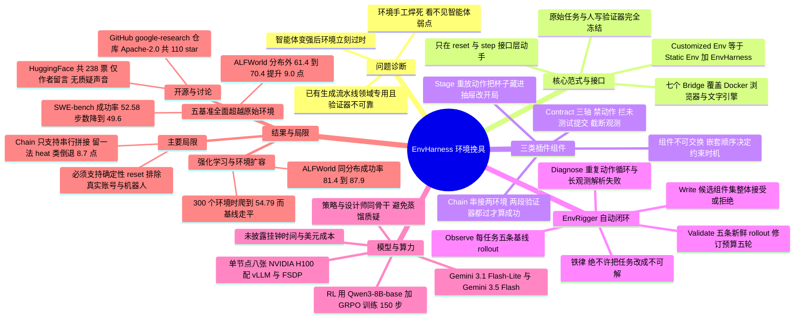

## 一、论文是干什么的？

先把背景铺开。今天的大语言模型（LLM，Large Language Model，也就是像 GPT、Gemini 这类能读写文字的大模型）正在从「聊天机器人」变成「智能体」（agent，指能自主调用工具、多步操作、完成一整件事的 AI 程序）。而智能体的能力增长，靠的已经不再是喂更多网页文本，而是**在环境里摸索**。这里的「环境」（environment）是一个专业词：它指一个能接收智能体动作、返回观测结果、并在最后判定「你做成了没有」的交互式沙盒。比如 SWE-bench 这个环境会给智能体一个真实的开源代码仓库和一个 bug 报告，让它改代码，最后跑测试判定是否修好；ALFWorld 这个环境会给智能体一个文字描述的房间，让它「把一个洗干净的杯子放到书桌上」。

问题在于：**这些环境几乎全是人手工焊死的，而且是静态的**。「静态」在这里有非常具体的含义：环境的交互逻辑（能做哪些动作、动作会引发什么后果）和验证器（verifier，判定任务成功与否的那段代码）都是人写死的，写完就不再变。这带来两个致命后果。第一，环境**看不见**面前这个智能体的弱点——不管来的是一个笨模型还是一个强模型，它给出的题目、给出的提示、给出的难度一模一样，无法针对性地补短板。第二，环境**很快过时**——智能体一旦学会解现有的题，这个环境就再也没东西可教了，训练信号归零。

打个生活化的类比：这就像一个只有一套固定器械、且器械高度不能调的健身房。新手来了觉得杠铃太重根本举不起来，练不动；老手来了觉得杠铃太轻，举一百下也没有增肌效果。更糟的是，教练（环境）连你哪块肌肉弱都不知道，只会让所有人做同一组动作。而现实中的好健身房会怎么做？教练看你练几组，发现你核心力量差，于是给你换个不稳定的平衡垫、把配重加两片、或者把两个动作串成一个组合动作——**器械本身没换，只是加了些外挂配件，训练刺激就完全不同了**。EnvHarness 干的就是这件事。

那学术界原本的解法是什么？是「环境生成」（environment generation）——既然手工造环境太贵，就让 LLM 自动造新环境。但这条路有两个硬伤。其一，**生成流水线天然是领域专用的**：一套为网页导航造环境的流水线，搬不到编程领域，也搬不到工具调用领域，因为它必须深入环境内部去构造交互逻辑和验证器。其二，**正确性又贵又不可靠**：环境和验证器都是 LLM 生成的，实践中必须「超量生成 + 重度过滤」，仍然无法保证生成的题目真的有唯一正确答案、验证器真的判得对。而且，生成出来的新环境**仍然是静态的**——只是数量变多了，本质没变。

这篇论文的破法很巧：**不造新环境，而是给老环境套一层可编程的外壳**。作者提出 **EnvHarness**（Environment Harness，环境挽具），它是一层可插拔组件（plug-in components）构成的可编程包装层，套在一个静态环境外面，只通过环境标准接口（`reset()` 用于重置开局、`step(action)` 用于执行一步动作）来改变它的行为，**完全不修改底层环境的一行代码**。这个设计带来三个连锁好处：因为只在接口层动手，所以它天然跨领域通用；因为底层任务和验证器完全没被碰过，所以每个被重塑的新环境都**继承了原来那个人类精心手写、值得信任的验证器**；因为包装层是程序化的，所以可以按当前智能体的弱点随时重新配置，实现动态化。

作者还进一步给这层外壳配了个自动化的「教练」：**EnvRigger**。它把目标策略（policy，即被训练的那个智能体）当成一个黑盒——不看模型权重，只看它跑出来的轨迹（trajectory，即「动作—观测」序列的完整记录），从成功和失败的轨迹里诊断出这个智能体的具体毛病，然后**自动写出**针对这个毛病的 EnvHarness 组件代码，再用新的 rollout（重新跑一批完整回合）来验证这个新环境是否既有挑战性又仍然可解。作者用了一个精彩的类比来定位自己的工作：业界已经很熟悉「智能体挽具」（agent harness，指给一个冻结的 LLM 外挂工具、记忆、执行循环，把它变成能干活的智能体，即 `Agent = Model + Harness`）；EnvHarness 把同一个思路用到了交互回路的**另一侧**，即 `Customized Env = Static Env + EnvHarness`。

---

## 二、核心方法与创新

### 2.1 范式：把「环境挽具」和「智能体挽具」对称起来

论文的思想起点是一个对称性观察。智能体挽具解决的是「冻结的 LLM 缺动作能力、缺记忆、缺循环」，做法是在模型权重之外加一层能力层，输出一个自主智能体。EnvHarness 解决的是「冻结的环境交互逻辑写死了」，做法是在环境实现之外加一层定制层（改初始状态、改规则、改观测），输出一个可定制环境。两者的共同点是：**通过外挂层扩展能力，而不改动核心系统**。

这个对称性不是修辞，它直接决定了工程可行性。改模型权重要做微调、要 GPU、要担心灾难性遗忘；同理，改环境内部代码要读懂那个仿真器、要重写验证器、要担心状态逻辑被搞坏。而在接口层加壳，两边都是「便宜、安全、可组合」的。

### 2.2 形式化定义：$w$ 是一个环境到环境的变换

论文把环境建模为一个六元组：

$$E=(\mathcal{S},\mathcal{A},\mathcal{O},T,R,s_0)$$

各符号含义逐个说明：

- $\mathcal{S}$：状态空间，环境所有可能内部状态的集合（比如房间里每个物体在哪、代码仓库当前的文件内容）。
- $\mathcal{A}$：动作空间，智能体能发出的所有合法动作的集合（比如 `take mug 1`、`bash: pytest`）。
- $\mathcal{O}$：观测空间，智能体能看到的所有可能观测的集合（注意观测通常只是状态的一部分，智能体看不到全部真相）。
- $T:\mathcal{S}\times\mathcal{A}\to\mathcal{S}$：转移函数，给定当前状态和一个动作，决定下一个状态是什么。这就是「环境的物理规律」。
- $R$：由验证器导出的奖励，即判定成功与否的打分逻辑。
- $s_0$：初始状态，也就是 `reset()` 之后智能体面对的开局。

一个 EnvHarness 组件就是一个**与具体环境无关**（environment-agnostic）的变换 $w$：

$$E'=w(E),\quad E'=(\mathcal{S}',\mathcal{A}',\mathcal{O}',T',R',s_0')$$

关键是 $w$ 只在接口层动手：它可以定制初始状态 $s_0'$、过滤暴露给智能体的动作与观测空间（$\mathcal{A}'$、$\mathcal{O}'$）、以及修改转移机制 $T'$，但绝不碰底层仿真器后端或实现细节。因为所有干预都在外部，**真值评估逻辑被完整保留**，原来的验证器照样能给这一局打分。这一条是整篇论文的信任基石：如果验证器也被 LLM 改了，那所有实验数字都不可信了。

### 2.3 三个具体组件：Stage、Contract、Chain

论文实例化了三类组件，分别对应环境定制的三种基本模式。为了讲清楚，作者全程用一个 ALFWorld 任务举例：「**把一个洗干净的杯子放到书桌上**」，其默认设定是杯子就摆在明面上、放好就立刻结束。

**Stage（舞台）——改开局**。记作 $w_{\mathrm{stage},\delta}$，由一串状态操纵动作 $\delta=(a_1,\dots,a_k)$ 指定。这串动作在 `reset()` 产生的初始状态 $s_0$ 上依次执行：

$$E'=w_{\mathrm{stage},\delta}(E)=(\mathcal{S},\mathcal{A},\mathcal{O},T,R,s_0'),\quad s_0'=T(\cdots T(T(s_0,a_1),a_2)\cdots,a_k)$$

这里只有初始状态变了，其余全不变。例如一个 Stage 执行 `take mug 1` → `open drawer 1` → `put mug 1 in drawer 1` → `close drawer 1`，把杯子藏进抽屉，逼智能体必须**先搜索**再拿，而不是伸手就够。反过来，另一个 Stage 可以提前把「洗杯子」这一步做掉，只留最后的摆放，从而**缩短任务时长、降低难度**。

类比：Stage 相当于教练在你进场前把器械重新摆放一遍——把哑铃藏到柜子里（加难），或者把跑步机先预热好（减难）。

**Contract（契约）——改交互规则**。记作 $w_{\mathrm{contract},r}$，由三个变换映射构成的三元组 $r=(f_A,f_T,f_O)$ 指定，每个默认为恒等映射：

$$E'=w_{\mathrm{contract},r}(E)=(\mathcal{S},\mathcal{A}',\mathcal{O}',T',R,s_0),\quad (\mathcal{A}',\mathcal{O}',T')=\big(f_A(\mathcal{A}),\,f_O(\mathcal{O}),\,f_T(T)\big)$$

- $f_A$ 改动作空间：可以重写或直接拦截智能体发出的动作。例：删掉「传送式导航」这种高层指令，逼智能体一步步走着找。
- $f_T$ 改转移动态：可以在特定条件下把响应改成失败并附上结构化反馈。例：如果智能体没握着杯子就发 `clean mug`，直接拦住，逼它先拿起来。
- $f_O$ 改观测：可以增补或遮蔽观测。例：把房间描述**截断到前两句**，逼智能体分几步才能建立起完整的空间认知。

注意 $R$ 不在 Contract 的可改范围里，这是刻意的设计。作者在设计者的系统提示词里明确写了：奖励轴不暴露，因为成功与否是基准自己的判决，改奖励无法真正改变评测指标——只会自欺欺人。

类比：Contract 相当于给你的动作加规矩——「深蹲必须蹲到底才计数」、「不许看镜子（遮观测）」、「不许用助力带（禁动作）」。

**Chain（串联）——改任务长度**。记作 $w_{\mathrm{chain},\ell}$，由一对 $\ell=(E_{\mathrm{ext}},g)$ 指定，其中 $E_{\mathrm{ext}}$ 是另一个环境，$g$ 是组合逻辑：

$$E'=w_{\mathrm{chain},\ell}(E)=(\mathcal{S}',\mathcal{A}',\mathcal{O}',T',R',s_0'),\quad E'=g(E,E_{\mathrm{ext}})$$

新的空间就是各基环境空间的并集（如 $\mathcal{A}'=\mathcal{A}\cup\mathcal{A}_{\mathrm{ext}}$），$R'$ 是新的复合奖励。组合逻辑 $g$ 不受限制，可以串行拼接、逐步交替（论文附录给了一个每步在 Red/Blue 两个环境间来回切换的 `Alternate` 实现），也可以根据中间结果动态分支。例：在杯子任务后面接上「在同一间房里把一个土豆加热并放到台面上」，只有**两段都被各自的验证器判定通过**，$R'$ 才返回成功。这逼智能体学会在「本来该停下」的地方继续扛着目标往下走。

类比：Chain 相当于把两个动作串成一个超级组，中间不许歇——训练的是耐力和目标持续性，而不是单个动作的力量。

**可组合性**。因为三类组件共享同一套标准接口，它们可以自由堆叠：

$$E'=w_{\mathrm{chain},\ell}\big(w_{\mathrm{contract},r}\big(w_{\mathrm{stage},\delta}(E)\big)\big)$$

在这个例子里，$w_{\mathrm{stage},\delta}$ 把杯子藏进抽屉以强制空间搜索，$w_{\mathrm{contract},r}$ 把观测截成两句以考察部分可观测性，$w_{\mathrm{chain},\ell}$ 追加一个后续任务以考察目标持续性。作者特别提醒这些变换**不可交换**（$w_1\circ w_2\neq w_2\circ w_1$）：嵌套顺序决定了哪些约束在初始化阶段生效、哪些在交互阶段生效。

### 2.4 任务与策略条件化：为什么必须「因人施教」

单个 EnvHarness 组件本身是**策略无关**的——按定义 $w$ 只是环境的变换，同一个组件可以原封不动套到任何策略上。但组件的**选择与参数化**必须同时以基础任务 $t$ 和策略 $\pi$ 的实际行为为条件。论文因此定义了「任务—策略条件化映射」$\mathcal{H}$：

$$E'=\mathcal{H}(E,t;\pi)=(w_k\circ w_{k-1}\circ\cdots\circ w_1)(E)$$

其中每个 $w_i$ 都是为了暴露 $\pi$ 在任务 $t$ 上的关键弱点而定制的组件。注意这里不检查模型内部权重，纯粹从输出行为出发——这也是为什么 EnvHarness 能对闭源商业模型同样适用。

### 2.5 EnvRigger：四阶段的自动化设计闭环

EnvRigger 是实现 $\mathcal{H}$ 的自动化系统，一个由 LLM 驱动的「环境设计师智能体」。它分四个阶段：

1. **Observe（观察）**：在当前环境里跑策略 $\pi$ 完成基础任务 $t$，收集一批 rollout 轨迹（论文设定 $K=5$ 条）。失败轨迹暴露待解决的弱点，成功轨迹则界定弱点的边界——哪些能力已经完好，从哪里开始崩。设计师同时看到成功率、逐条结果和样本轨迹。
2. **Diagnose（诊断）**：分析轨迹找根因，重点是系统性问题，例如「重复动作死循环」「长观测解析失败」「误读工具约束」。这一步还**决定定制方向**：如果策略挣扎，目标是搭脚手架、简化任务；如果策略成功率满分，说明当前环境太宽容，那就要**反向加难**，注入更有挑战的场景把潜在缺陷逼出来。输出是一段文字诊断。
3. **Write（撰写）**：根据诊断合成一个或多个 EnvHarness 组件。一个缺陷可能需要多个组件配合（比如一个 Stage 改开局加一个 Contract 过滤后续交互），它们作为**一个候选集整体**被提出。论文举的例子：如果诊断发现策略在依赖一条绕过学习的脆弱捷径，EnvRigger 就写一个 Contract 在特定条件下封掉那个动作。
4. **Validate（验证）**：用候选组件包装当前环境实例化 $E'$，跑一批**新的** rollout（同样 $K=5$ 条）。根据成功率、失败分布、超时数等聚合统计（明确规定**绝不**根据单条轨迹下判断）做三选一：接受、拒绝（不可解或没挑战性的一律拒），或者判定「信号尺度没调好」而打回细化。打回时轨迹和尺度反馈流回 Write 阶段，形成一个「写—验」循环，最多跑 5 轮，超预算则这个实例不产出组件。

设计师的系统提示词里有几条很有洞察力的工程约束，值得单独拎出来（这些是论文附录 A 的原文要点）：

- **不要把任务搞成不可解的**。提示词原话大意是：让成功变成不可能不叫「提升难度」；成功率为 0 因为不可能，和成功率为 1 因为太简单，一样没用。识别信号是「多数 rollout 以超时结束」或「成功率为 0 且失败集中在动作轴」，这时下一次提案**必须撤销或放松**那个限制——堆更多禁令是爬不回目标区间的。
- **偏好细微、狭窄的扰动**（改一个操作、改一个观测字段），而不是大范围封禁。
- **把基线当原始数据而不是提示**：要读出策略能不能解、怎么解（4 步的解法留下的余量远小于 30 步的解法，扰动幅度要匹配这个余量）、以及它实际依赖环境的哪些部分（扰动它从不使用的指令毫无意义）。
- **细化时不要推翻已见效的代码**：如果成功率朝目标区间移动了，说明扰动**类型**对了，只需调幅度（超了放松，不足则加紧），不要丢掉已经花了 $K$ 条 rollout 才建立起信号的代码。

一个重要的工程前提：为了让 Stage 引入的初始状态变更能被可靠复现，作者**假设基环境在验证阶段支持确定性重置**（deterministic reset）。

### 2.6 软件架构：ActionableEnv、Bridge、装饰器堆栈

这部分是论文附录 C 的内容，但它恰恰解释了「为什么真的能跨领域」，值得展开。

整个框架建立在一个承诺上：**每个基准、以及每个基准的每种变换，都呈现同一个接口**。策略、编排器、组件层都只针对一个抽象类型编程，无法区分手里拿的是原始基准还是套了任意多层组件的基准。三层结构如下：

- **`ActionableEnv`（通用环境接口）**：一个 Gymnasium 风格（Gymnasium 是强化学习界最通用的那套环境接口库）的交互循环，带类型化、经校验的数据契约。`reset(seed, options)` 初始化一局；`step(action)` 接收一个 `Action`（工具名 + 可 JSON 序列化的关键字参数），返回 `EnvResponse`（对 Gymnasium 五元组 observation/reward/terminated/truncated/info 的 Pydantic 包装，Pydantic 是 Python 里做数据结构校验的常用库）；`evaluate()` 返回终局 `EvaluationResult`；`observe()` 返回当前状态的新鲜观测。`observe()` 被刻意从 `reset()` 里分离出来——因为组件可能在 `reset` 返回之后、策略动手之前修改环境，`observe()` 让外层重新读一遍世界而不必再付一次 `reset` 的代价。`get_env_state()` 暴露一个**运行时安全视图**：只有纯数据，没有 Docker 句柄、浏览器页面或 socket，而这是组件钩子唯一被允许读取的状态。正是这条限制让组件代码可移植——同一个钩子既能跑在内存里的算术小游戏上，也能跑在容器化的代码仓库上，因为两者都不触碰状态视图底下的运行时。持久化则交给环境自己：`save_state()` 返回可序列化字典，类方法 `from_state(dict)` 反向重建。
- **`Bridge`（适配层）**：某个基准对 `ActionableEnv` 的直接实现，也是**系统里唯一知道底层运行时的一层**。作者实现了 7 个 Bridge，覆盖 4 类不同运行时：纯内存算术游戏（Toy24）、文字冒险引擎（ALFWorld 走 TextWorld）、按实例起的 Docker 容器（SWE-bench、OfficeQA、SpreadsheetBench，每个 `step` 都是一次无状态的 `docker exec`）、以及 Playwright 驱动的浏览器（WebArena 走 BrowserGym，还有 WebShop）。Bridge 之上的一切——策略循环、编排器、所有组件代码——在 7 个环境之间**逐字共享**。每个 Bridge 还会发布一份人类可读的 `env_state_schema()`，描述组件钩子可以读哪些字段，这份 schema 被注入设计师智能体的提示词，从而闭合了「Bridge 暴露什么」和「生成的代码能依赖什么」之间的回路。
- **组件层（装饰器模式）**：`EnvHarness` 本身是一个抽象装饰器，一个 `EnvHarness` **就是**一个 `ActionableEnv`，同时包裹另一个 `ActionableEnv`。默认实现把每个接口方法都转发给内层，所以具体组件只需重写它真正影响的那几个轴。因为被包裹对象自己也可以带组件，所以 `Rules(Setups(Toy24Bridge))` 依然是一个 `ActionableEnv`，与最外层交互的策略**无法观察到底下压了几层**。

一个小八卦但很有用的信息：论文附录 A 明确说**开源代码的命名早于论文术语**，代码里三个组件类叫 `Setups`、`Rules`、`Link`，设计师产出的候选带 `rules_code` 和 `in_env_actions` 两个字段。对照关系是 Stage → `Setups`（字段 `in_env_actions`）、Contract → `Rules`（字段 `rules_code`）、Chain → `Link`。想读代码的人务必记住这个映射。

还有一个细节体现了设计的严谨：`Setups` 是通过**动作重放**（action replay）来改初始状态的——先 reset 内层，再把 $\delta$ 里的动作一条条通过普通的 `inner.step()` 打进去。这样得到的开局状态**必然是一个可达状态**，而且用环境自己的动作词汇表达，不需要任何基准专用的状态 schema，保存下来的形式就是那串动作列表本身。重放完成后 `Setups` 会调用 `notify_replay_complete()`，让内层环境回退掉那些**不该记在智能体账上**的每局计数器（步数预算、重复动作守卫等）。

### 2.7 消融与「哪个设计真正起作用」

论文的分析章节实际上回答了这个问题，几个关键结论：

（1）**「因人施教」是核心，而不是「环境更多」**。环境扩容实验里，三种来源给同样数量的环境、走同样的技能抽取与检索协议。EnvHarness 从 47.67 一路爬到 54.79（+7.12 点）且到 300 个环境时仍在上升；同样预算下原始环境只到 52.13，生成环境只到 50.37。差别就在于：两个基线取环境的方式与学习者无关，而 EnvHarness **每一批都针对「已经装备了此前累积技能的那个策略」来合成**，从而让环境和策略共同进化。

（2）**Stage/Contract 提成功率，Chain 提效率，两者互补**。见表 5 的对照：只用 Stage/Contract 时 SWE-bench 成功率 52.58、平均步数 49.61；只用 Chain 时成功率 49.63（略低于原始环境的 49.88）但平均步数骤降到 41.96；把两套技能合起来则拿到最高成功率 54.30 且效率仍然优秀（43.12 步）。Chain 单用成功率略低是有道理的——它的训练条件极其严苛（必须两段全解），这让它优先学「长期目标保持」而不是「单任务成功率最大化」。

（3）**从静态环境里抽技能可能反而有害**。这是很反直觉但很重要的一条：在 SpreadsheetBench 上，从未改动环境抽出的技能**低于完全不用技能的基线**；在 SWE-bench 上，它反而把轨迹拉长了（53.58 步 → 55.01 步）。原因是静态环境只让智能体反复练它已经会做的行为，检索到的是冗余或次优的技能。而 EnvRigger 的「写—验」闭环只提交经过新鲜轨迹验证的组件，所以在技能学习的五个主结果基准上，EnvHarness 都稳定超过无技能基线。（注意这句只限技能学习那组结果；后面 4.2 节的强化学习实验比的是另一个对照，那里 ALFWorld 分布外有一处小幅落后。）

（4）**Chain 被排除在自动流水线之外**。作者诚实地说明：因为 EnvRigger 难以观察被拼接环境的内部状态，所以自动化管线里**不含 Chain**，Chain 的效果是单独分析的，且两个基环境是随机配对而非智能选择。

---

## 三、使用了哪些模型和计算资源？

| 条目 | 内容 |
|---|---|
| 主实验用的 LLM / 基座模型 | 关键设计：**EnvRigger（环境设计师）与策略智能体在每个基准上使用同一个模型骨干**，以确保增益不是来自蒸馏一个更强的外部模型。ALFWorld 与 WebArena 用 **Gemini-3.1-Flash-Lite**；SWE-bench Verified、OfficeQA、SpreadsheetBench 用 **Gemini-3.5-Flash**。技能抽取（skill extraction）也用同一个模型。参数规模原文未披露（均为闭源模型） |
| 跨模型泛化实验用的模型 | SWE-bench Verified 上测了 4 个：**Gemini 3.1 Flash-Lite**、**Qwen3.6 27B**（开放权重，27B）、**Gemini 3.5 Flash**、**Claude Sonnet 4.6**。这 4 个模型的无技能成功率跨度为 30.7 到 67.2 |
| 强化学习实验用的模型 | **Qwen3-8B-base**（80 亿参数，开放权重），用 **GRPO**（Group Relative Policy Optimization，组相对策略优化）训练 |
| 对比的 baseline 模型 | 方法基线共四类技能来源：**No Skills**（冻结策略裸跑）、**Original Envs**（从原始环境抽技能）、以及三个领域专用环境生成流水线——**GenEnv**（用于 ALFWorld）、**VeriEnv**（用于 WebArena）、**SWE-smith**（用于 SWE-bench Verified）。所有基线共享同一批种子实例、同一环境数量、同一抽取流水线、同一策略模型 |
| 评测/打分用的模型（如 LLM-as-judge） | **最终评测不使用 LLM-as-judge**（LLM-as-judge 指拿一个大模型去当阅卷老师给答案打分，容易打错也容易被讨好）。这是论文的核心卖点之一：每个被重塑的环境都保留原基准人类手写的验证器，成功与否由基准自己的判决给出，原文通篇未提及任何 LLM 打分环节。EnvRigger 只在**验证候选组件时**用 LLM 分析轨迹统计，但那不参与最终评测打分 |
| 训练硬件（RL 部分） | **单个计算节点，8× NVIDIA H100 GPU**。rollout 生成用 **vLLM**（一个专为大模型推理加速的开源引擎；配置为张量并行 TP=1，即单个模型不切分到多卡、GPU 显存利用率 0.5、强制 eager execution）；训练启用 **FSDP**（Fully Sharded Data Parallel，把模型参数和优化器状态切碎分摊到多张卡上以省显存）配合参数 offload、优化器 offload 和梯度检查点。单卡显存容量原文未点明型号细分（H100 常见为 80GB，但论文未写） |
| 推理/评测硬件 | 原文未披露。技能学习主实验用的是 Gemini / Claude 等闭源模型，通过 API 推理，因此不涉及自有 GPU；Qwen3.6 27B 部分的推理硬件原文未披露 |
| 是否用商业 API | **是**。策略与设计师使用 Google 的 Gemini 3.1 Flash-Lite / Gemini 3.5 Flash，跨模型实验还用了 Anthropic 的 Claude Sonnet 4.6。开源代码的 README 说明支持配置 OpenAI、经 Vertex AI 调用的 Claude、以及 Gemini 三种 provider。具体端点与调用量原文未披露 |
| 单个完整计算单位的耗时 | **原文没有给出任何挂钟时间（小时/分钟/秒）或 GPU 小时数**，这是本文信息披露上的一个明显缺口。原文给出的是**token 消耗**这一代理指标（表 11）：ALFWorld 上 GenEnv 用 38K 设计 token + 64.2M rollout token = 64.2M 总量，EnvHarness 用 **1.46M 设计 token + 226.6M rollout token = 228.0M**；WebArena 上 VeriEnv 用 20K + 137.7M = 137.8M，EnvHarness 用 **1.58M + 135.7M = 137.3M**。RL 部分给出的是训练步数：**共 150 个 epoch**（等价于 **150 步**，因为按其批次配置一个 epoch 就是一步） |
| rollout 数量 | EnvRigger 超参（附录 E.3，所有基准通用）：Observe 阶段每任务 **$K=5$ 条基线 rollout**；Validate 阶段每个候选 **$K=5$ 条新鲜 rollout**；写—验循环的修订预算 **最多 5 轮**；单个候选包含的组件数**不设上限**（由设计师自行决定），且候选是整体接受或整体拒绝。附录 G 的「指标定向」实验用了更密的 **$K=10$ 条 rollout** 来测量每个任务。评测侧每个实例**只尝试一次**（attempted once） |
| RL 超参数细节 | 全局训练批大小 16，PPO（Proximal Policy Optimization，近端策略优化，GRPO 的前身算法）mini-batch 256，PPO micro-batch 与 log-prob micro-batch 均为每卡 4；最大 prompt 长度 4096 token，最大 response 长度 512 token；环境历史长度 50、单局最长 50 步；随机种子固定为 0；非法动作惩罚系数 0.1；rollout 采样温度 0.4 |
| 数据集划分 | ALFWorld：训练 100 个标准训练集任务，评测所有剩余留出任务。WebArena：每个子域 20 个训练任务，评测其余全部。SWE-bench：训练用 SWE-bench Lite 的 100 个任务，评测 **407 个不在 Lite 里的 Verified issue**。OfficeQA：50 个训练任务（官方划分），172 个官方测试任务。SpreadsheetBench：400 个已验证任务中取 100 个训练，299 个留出任务（897 个实例）。训练与评测回合在每个基准上**严格不相交** |
| 金钱成本 | **原文未披露任何 API 费用或美元金额** |
| 代码是否开源 | 是，Apache-2.0 许可。[github.com/google-research/envharness](https://github.com/google-research/envharness)（截至 2026-08-22 为 110 star、3 fork），项目主页 [envharness.com](https://envharness.com/)（含一个浏览器内的 24 点游戏交互 playground，可实时编辑组件）。仓库包含 `envharness/` 核心库、`experiments/` 六个基准实现（toy24、alfworld、swebench、webarena、officeqa、spreadsheetbench）、`rl/` 强化学习工具、`scripts/` 与 `tests/`。**未发布预训练/微调后的模型权重** |

一句话总结算力画像：**这篇论文的主线实验（技能学习）几乎是纯 API 驱动的，真正动 GPU 的只有作为「兼容性验证」的 RL 部分，用的是 8 张 H100 跑 Qwen3-8B-base 的 GRPO**。作者自己在局限性一节承认，设计闭环是要花钱的：更弱的设计师需要更多轮迭代才能产出通过验证的挽具，而每一轮都要跑 rollout，所以产出一池高质量环境会消耗可观的时间和推理算力；不过这笔成本是**每个环境付一次**，而不是每个训练回合付一次。

---

## 四、实验结果

### 4.1 技能学习主结果

论文的主线设定是「技能学习」（skill-based learning）：先在环境里跑智能体，从轨迹里按 ReasoningBank 的做法抽取「技能」（skill，可理解为一条条可复用的经验条目，含适用条件描述和具体操作内容），然后把装备了技能的智能体放到**未见过的留出实例**上评测。所有数字是三次独立运行的均值。

先把表里的几个指标名解释清楚，免得看不懂：**成功率**（SR，Success Rate）就是任务做成的比例；**EM**（Exact Match，精确匹配）指答案与标准答案逐字完全一致才算对；**F1** 是一个比 EM 宽松的打分，把答案和标准答案当成词的集合，取「准确率」与「召回率」的调和平均，答对一部分也能拿到部分分；**Pass@1** 指只允许提交一次答案、这一次就必须对；**Mean Score** 是按更细的实例粒度平均出来的连续得分。另外 ALFWorld 有「同分布」（In-Dist）和「分布外」（OOD，Out-Of-Distribution）两个评测子集，这是基准自带的划分：前者的「物体—容器」组合在训练中见过，后者没见过，所以后者更能反映真本事而不是死记硬背。

| 基准 | 指标 | No Skills | Original Envs | 领域专用基线 | EnvHarness | 提升（对 Original Envs） |
|---|---|---|---|---|---|---|
| ALFWorld 同分布 | 成功率 | 62.6 | 63.3 | 63.3（GenEnv） | **66.2** | +2.9 |
| ALFWorld 分布外 | 成功率 | 60.7 | 61.4 | 61.9（GenEnv） | **70.4** | **+9.0** |
| ALFWorld 平均 | 成功率 | 61.7 | 62.4 | 62.6（GenEnv） | **68.3** | +5.9 |
| WebArena 平均 | 成功率 | 38.7 | 38.5 | 39.6（VeriEnv） | **41.6** | +3.1 |
| WebArena / Shop Admin | 成功率 | 44.1 | 44.6 | 49.7（VeriEnv） | **50.8** | +6.2 |
| SWE-bench Verified | 成功率 | 47.67 | 49.88 | 50.12（SWE-smith） | **52.58** | +2.70 |
| SWE-bench Verified | 平均步数（越低越好） | 53.58 | 55.01 | 54.72（SWE-smith） | **49.61** | −5.40 步（相对少 9.8%） |
| OfficeQA | EM | 54.23 | 54.40 | 无基线 | **56.20** | +1.80 |
| OfficeQA | F1 | 55.77 | 55.77 | 无基线 | **57.73** | +1.96 |
| SpreadsheetBench | Pass@1 | 46.44 | 45.88 | 无基线 | **49.15** | +3.27 |
| SpreadsheetBench | Mean Score | 61.32 | 61.47 | 无基线 | **62.48** | +1.01 |

用大白话讲：**在五个基准上，用 EnvHarness 重塑过的环境里练出来的技能，一律比在原始环境里练出来的技能强**。最亮眼的是 ALFWorld 的分布外任务 +9.0 点——这正好说明重塑环境教出来的是**可迁移的行为**而非死记硬背的配方。另外注意 SWE-bench 那一行：EnvHarness 是唯一一个**同时**提高成功率、降低步数的来源，而原始环境和 SWE-smith 的技能都把轨迹拉长了。作者说这个效率提升与 EnvRigger 的具体诊断直接对应：针对性的 Contract 和 Stage 就是为了打断重复动作死循环、过滤冗长观测而生成的。

还有一处容易看漏的细节：OfficeQA 的 F1 一栏，**无技能**和**原始环境技能**是完全一样的 55.77（原文给的标准差不同，分别是 2.98 和 1.59），也就是说在这个基准上，从没改动过的环境里抽技能，对 F1 的净贡献是零。这不是排版错误，而是原文表 3 里真实出现的同值，恰好为作者「静态环境只让智能体重复练已经会做的事」这句判断提供了一个干净的例证。

对领域专用基线的对比也值得单说：ALFWorld 上 EnvHarness 平均超 GenEnv 5.7 点，分布外场景超 8.5 点；SWE-bench Verified 上超专为该基准打造的 SWE-smith 2.46 点，同时每局少跑 5.11 步。而且 GenEnv 只能用于 ALFWorld、VeriEnv 只能用于 WebArena、SWE-smith 只能用于 SWE-bench，办公自动化那两个基准**根本没有生成基线存在**——EnvHarness 靠统一接口一套打通了全部五个。

### 4.2 强化学习

| 训练环境 | ALFWorld 同分布 | ALFWorld 分布外 | ALFWorld 平均 | WebShop 得分 | WebShop 成功率 |
|---|---|---|---|---|---|
| Original Envs | 81.4 | **89.6** | 85.5 | 75.6 | 66.0 |
| EnvHarness Envs | **87.9** | 88.8 | **88.4** | **79.2** | **67.4** |

用 Qwen3-8B-base + GRPO 在线训练，四个指标里 EnvHarness 赢了三个，ALFWorld 同分布成功率从 81.4 提到 87.9（+6.5 点），WebShop 得分 75.6 → 79.2、成功率 66.0 → 67.4。唯一小幅落后的是 ALFWorld 分布外（88.8 对 89.6），作者称之为「轻微、可忽略的权衡」。核心结论是：重塑后的环境不只是辅助数据，它本身就能提供**高效、独立的在线策略优化信号**。

### 4.3 环境扩容与共进化

同一预算下比三种环境来源，每 50 个环境产出一个技能库（每库 2 到 3 个技能，300 个环境时共 15 个技能）：

| 环境数量 300 时 | 解决率 |
|---|---|
| 起点（无技能） | 47.67 |
| 生成环境（SWE-smith） | 50.37 |
| 原始环境 | 52.13 |
| **EnvHarness** | **54.79（+7.12 点，且曲线仍在上升）** |

两个基线在 300 个环境时都已走平，而 EnvHarness 还在爬。作者对此的解释是：每一批环境都针对「已装备此前技能的当前策略」来合成，因此瞄的始终是学习者当下的能力边界。附录 F.2 还给出了共进化各轮次抽出的技能内容变化——从「基本的测试调用与文件编辑」，到「测试运行器自己崩了怎么保持测试循环」，再到「解释器解析与编辑前导航」，越往后越局部，也解释了为什么增益逐轮收窄。

### 4.4 跨模型泛化

| 策略模型 | 无技能 SR / 步数 | 原始环境技能 SR / 步数 | EnvHarness 技能 SR / 步数 | 相对增益 |
|---|---|---|---|---|
| Gemini 3.1 Flash-Lite | 30.7 / **36.7** | 36.8 / 50.0 | **40.0** / 50.6 | +8.7% |
| Qwen3.6 27B | 41.0 / 69.8 | 48.4 / **37.1** | **52.1** / 40.8 | +7.6% |
| Gemini 3.5 Flash | 47.7 / 53.6 | 49.9 / 55.0 | **52.6 / 49.6** | +5.4% |
| Claude Sonnet 4.6 | 67.2 / 29.3 | 69.2 / **25.4** | **72.4** / 25.6 | +4.6% |

EnvHarness 技能在全部四个策略上都超过原始环境技能，绝对提升 2.7 到 3.7 点，而这四个模型的裸成功率跨度从 30.7 到 67.2。作者的观察是：增益幅度**基本与底层策略强弱无关**——定制闭环既没在最弱的模型上崩掉，也没在最强的模型上饱和；策略能力改变的是诊断的**内容**，而不是闭环的**适用性**。步数一栏还揭示了三种截然不同的机制：Qwen3.6 27B 裸跑 69.8 步（最长），技能几乎把它砍半到 37.1，说明裸策略大部分预算花在无方向的试错上；Gemini 3.1 Flash-Lite 相反，裸策略 36.7 步就早早放弃，技能让它坚持到约 50 步同时解出更多任务，这里「变长」才是重点；Claude Sonnet 4.6 从 29.3 到约 25 步几乎不动，因为一个本来就很有方向感的策略没什么死时间可回收。

### 4.5 其他分析

- **留一法泛化（ALFWorld）**：从除某一类任务外的所有类型的环境抽技能，只在留出的那一类上评测。EnvHarness 在 6 类中赢了 4 类，平均高 3.1 点（60.6 → 63.7），最大增益是 `clean` 类 +16.4 点，但 `heat` 类**回退了 8.7 点**。
- **按指标定向重塑（ALFWorld，100 个任务，每任务 $K=10$ 条 rollout）**：给定目标区间，看有多少比例的任务的测量值落进区间内。成功率目标 $[0.4,0.6]$：从 6.0% 提到 **80.0%**，平均成功率从 0.74 拉到 0.48（原任务强烈双峰，要么必成要么必败，EnvHarness 把它们压进中间）。平均步数目标 $[25,35]$：从 18.0% 提到 **53.0%**（步数是更紧的约束，因为它钉的是一个精确步数而非比率）。
- **按自然语言指定弱点**：给设计师一句话描述弱点，它会写出让这个弱点在普通基准任务里「致命化」的组件。论文正文给了个漂亮的例子——弱点是「策略在没跑失败测试的情况下就提交补丁，修复未经验证」，设计师写出的 Contract 在 $f_T$ 轴上挂钩：只要命令里出现 `pytest` 或 `runtests.py` 就把 `ran_tests` 标记置真；如果检测到提交动作而 `ran_tests` 为假，就返回一个伪造的失败响应「git hook: pre-commit hook 'verify-tests' failed. Run the test suite before submitting.」。从由此产生的轨迹里蒸馏出的技能叫「验证驱动开发循环」：改代码前先跑测试确认失败存在，打完补丁再跑一遍确认修好。附录表 13 列了 9 个这样的「指定弱点 → 生成组件 → 蒸馏技能」案例。
- **算力开销对照**：见第三节表格。要点是——EnvHarness 在设计上花的 token 比单趟基线多得多（ALFWorld 上 1.46M 对 38K），这是刻意为之：把完整轨迹喂进提示词去诊断弱点，而不是盲目生成任务。但设计只占总预算的小头，rollout 才是大头。对比同样在**真实环境**里执行 rollout 的 VeriEnv，总量基本持平（137.3M 对 137.8M），所以第 4 节的增益不是靠比基线多花钱买来的。GenEnv 总量低 3.5 倍，但它的 rollout 是 LLM 模拟的而非真实执行的，省下的钱换来的是幻觉转移和漂移的成功信号。

### 4.6 这些数字该怎么读，哪里要打折扣

几点必要的提醒：

1. **「9.8% 更少步数」的分母是 Original Envs，不是 No Skills**。49.61 相对 55.01 少 9.8%，但相对无技能基线的 53.58 只少 7.4%。宣传数字选的是对自己最有利的那个对照。
2. **「最高 9.0 点」是单点最好成绩**。它来自 ALFWorld 的分布外一栏；跨五个基准的典型增益是 1 到 6 点，SWE-bench 主表是 +2.70，SpreadsheetBench 的 Mean Score 只有 +1.01，OfficeQA 的 EM 只有 +1.80。
3. **标准差不小，样本量不大**。论文报了三次运行的标准差（表 2/3 的灰色下标），其中 WebArena Reddit 子域上 Original Envs 的标准差高达 9.7、No Skills 的 GitLab 子域达 8.4。在这种噪声水平下，WebArena 上 +1.9 到 +2.3 点的单项增益很难说是稳固的。EnvRigger 的每个决策也只基于 $K=5$ 条 rollout，这个样本量对判断「成功率是否落进目标区间」是相当稀薄的。
4. **并非全线通吃**。RL 的 ALFWorld 分布外一项落后（88.8 对 89.6）；留一法里 `heat` 类**倒退 8.7 点**；Chain 单用时成功率略低于原始环境基线。这些不是致命问题，但说明「重塑」有代价。
5. **验证器信任是双刃剑**。保留原验证器确实排除了「LLM 判分幻觉」这一大类风险，非常可信。但反过来说，EnvHarness 无法创造原基准覆盖范围之外的**新任务类型**——它只能重塑既有任务，任务多样性的天花板被基准本身钉住了。
6. **设计师与策略同模型是优点也是限制**。用同一个骨干确实排除了「偷偷蒸馏更强模型」的质疑，是很干净的实验设计。但反过来，作者自己也承认更弱的设计师需要更多轮迭代；这套方法在很小的模型上（比如 3B 以下）能否自己写出可用的组件代码，论文没有测。
7. **无挂钟时间与成本披露**。只有 token 数，没有小时数、没有美元数。想复现的人无法据此估算预算。

---

## 五、潜在应用与已落地应用

### 作者明确提到的

- **技能学习 / 经验记忆的数据引擎**：主线用法就是给「从轨迹蒸馏可复用技能」这类自进化智能体方法（论文跟随 ReasoningBank 的技能抽取方式）提供更好的练兵场。
- **在线强化学习的训练环境**：论文用 Qwen3-8B-base + GRPO 验证了重塑环境能提供独立且更优的优化信号。
- **策略与环境的持续定向共进化**：反复执行 EnvRigger 闭环，让环境随策略变强而同步加难，把「环境供给」从一次性工程变成可持续过程。
- **按显式目标校准环境难度**：可以给一个定量目标（把成功率压进 $[0.4,0.6]$，或把平均步数压进 $[25,35]$），也可以给一句自然语言描述的能力弱点，系统会自动重塑环境去命中它。这对做课程学习（curriculum learning，按难度递进安排训练任务）的人非常直接可用。
- **未来方向**（附录 I）：（a）**新组件类型**——注入随机性或部分可观测性的组件、暴露辅助反馈通道的组件、把多个智能体放进同一环境的组件；（b）**超越纯文本环境**——扩展到视觉、GUI 驱动或具身环境，检验包装抽象在观测不再是符号时是否还成立。

### 合理推演的潜在方向

- **智能体能力的诊断与红队测试**：EnvRigger 的 Observe/Diagnose 两个阶段本身就是一个自动化的行为审计工具。把它单独拿出来，可以用于在部署前系统性地找出某个智能体产品的行为盲区（比如「它总不跑测试就提交」这类），生成可复现的失败复现环境。
- **评测基准的抗污染改造**：既然可以在不改任务和验证器的前提下重塑开局与规则，理论上就能把一个已经被训练数据污染的公开基准「重新洗牌」，生成同源但非记忆化的变体，且判分标准仍然可信。
- **企业内部智能体的定向补训**：企业往往有少量高价值的真实业务环境（内部 CRM、报表系统），手工造更多环境不现实。EnvHarness 的路子是给已有环境套壳，理论上更符合企业现实——尤其是它已经覆盖了 OfficeQA 和 SpreadsheetBench 这类办公自动化场景。
- **教学与课程设计**：把「按目标区间校准难度」的能力用在人类学习者身上（比如编程练习平台自动调节题目难度），机制是同构的。

以上四条是本综述作者的推演，论文本身并未主张。

### 已知的实际落地情况

**截至 2026-08-22 未见公开的生产落地案例**。论文由 Google Cloud AI Research 主导（第一作者是在该团队实习期间完成此工作的华盛顿大学圣路易斯分校学生），代码已在 `google-research` 组织下以 Apache-2.0 开源，但没有任何公开信息表明它已被接入 Google 的商业产品或第三方系统。仓库也**未发布任何训练好的模型权重**。

论文附录 H 明确列出的落地障碍值得注意，因为它们直接框定了适用边界：

1. **设计闭环有成本**：更弱的设计师需要更多迭代轮次，每轮都要跑 rollout，攒一池高质量环境要花可观的时间和推理算力。（缓解：每个环境只付一次，且随设计师变强而下降。）
2. **必须有可重置的 gym 式接口**：约束的关键是 `reset`——Stage 要把环境置入指定初始状态，Chain 要在子任务之间把环境退回已知状态，两者都预设环境**可以被恢复**而不只是向前推进。这就**排除了**由活体服务支撑的环境：比如在真实用户账号上操作的智能体（已发出的邮件、已下的订单无法撤销），或者一个物理机器人（周围环境不会在每局之间自动复位）。
3. **Chain 只支持纯串行组合**：Chain 靠拼接来组合子任务、靠各部分的验证器来验证结果。这正是它能继承可信验证的原因，但也意味着 Chain 完全**不知道被组合的子任务在语义上是否相关**，也无法表达带分支或共享中间状态的工作流。作者解释了根本原因：只有串行拼接才容许一个复合验证器（每段各自终止、各出一个判决，复合结果是它们的合取）；分支或交替之下根本没有这样一对判决可以合并。

---

## 六、网络上的讨论与评价

**HuggingFace Papers**：论文在 [huggingface.co/papers/2608.19880](https://huggingface.co/papers/2608.19880) 上获得 238 票（截至 2026-08-22 复核时的实际值），在 2026 年 8 月的日榜里属于热度很高的一篇。评论区只有两条内容：第一作者 **ChengsongHuang** 亲自留言，内容是「webpage: [envharness.com](https://envharness.com/) code are all released.」——即确认项目主页与代码全部开源；另一条是自动化的 **librarian-bot** 推荐相似论文（它列出了 EvoHarness-RL、Evo-Harness、Harness-R1、LEGO-RL、Evo-Bench、Echoverse、OpenForgeRL 等同期工作，侧面说明「harness + 环境进化」在 2026 年是个相当拥挤的赛道）。**评论区没有任何质疑或批评性讨论。**

**GitHub**：[google-research/envharness](https://github.com/google-research/envharness) 在 Apache-2.0 许可下开源，截至 2026-08-22 为 **110 star**、3 fork（HuggingFace 页面缓存的抓取值仍是 66 star，两天内增长明显）。仓库结构完整，含核心库、六个基准的实验目录、RL 工具、脚本与测试套件，并提供 `scripts/check_env.py`、`reproduce_smoke.sh`、`reproduce.py` 三级复现入口。截至撰写时**未检索到公开的 issue 或 discussion 讨论**。

**中文媒体**：[学术头条](https://www.163.com/dy/article/L4SLNLN50531E3NX.html)（2026 年 8 月 21 日）发布了一篇较完整的中文解读《谷歌提出 EnvHarness：让静态环境随 Agent 一起进化》，准确复述了 Stage / Contract / Chain 三组件与 EnvRigger 闭环，并强调了「保留成熟环境最贵的部分（交互后端 + 可信验证器），只按智能体能力动态调整训练内容」这一定位。该文属于介绍性质，**没有提出批评或独立验证**。此外知乎上有一篇 Harness 工程范式的综述《[10 篇论文系统拆解 Harness](https://zhuanlan.zhihu.com/p/2033117550712705501)》把本文作为该脉络中的一环提及；另有一篇《[Environment scaling 相关的项目和论文](https://zhuanlan.zhihu.com/p/1984703117749687785)》梳理了同一方向的阅读清单。两篇都是罗列与转述，**没有实质性的技术辩论**。

**alphaXiv**：[论文页面](https://www.alphaxiv.org/abs/2608.19880) 上 v1 版本累计 101 次浏览，**讨论区 0 条评论**。

**其他渠道**：本综述尝试了以下检索但未找到实质性讨论——英文关键词搜索（论文标题 + 方法名 + arXiv ID）、限定站点搜索（Reddit r/MachineLearning 与 r/LocalLLaMA、Hacker News、X/Twitter）、中文关键词搜索（「EnvHarness 谷歌 静态环境」「EnvRigger 论文解读」）。**截至 2026-08-22，除了上述作者本人留言、一篇中文媒体解读和若干中文综述性提及之外，未检索到来自研究社区的实质性技术讨论或质疑声音**。考虑到论文才发布两天，这属于正常状态。

一点客观观察（非引用他人评论）：这篇论文最容易被挑战的地方，从公开信息看有三处——一是 $K=5$ 条 rollout 的决策样本量偏小而基准方差不小；二是完全没有披露挂钟时间和金钱成本，复现预算无从估算；三是「保留原验证器」这个最大优点同时也是最大限制，任务多样性的上限被原基准锁死。这些是本综述作者的判断，尚未见社区公开提出。

---

## 七、思维导图

