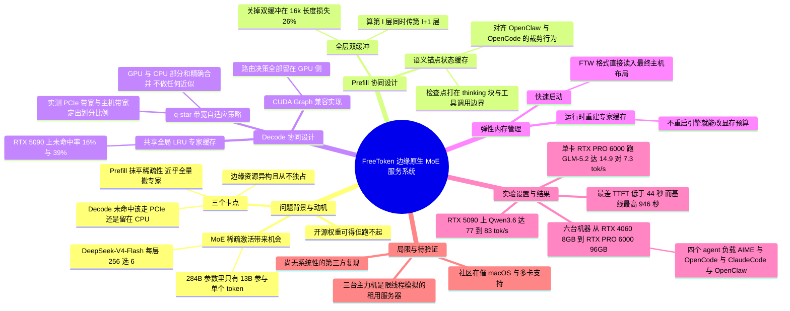

## 一、论文是干什么的？

过去两年里，开源权重模型（open-weight model，指厂商把训练好的模型参数完整公开、任何人都能下载的模型）的能力追赶速度快得惊人。DeepSeek-V4-Flash、GLM-5.2、Kimi-K3 这些模型在很多任务上已经逼近最强的闭源商业系统。但论文开篇提出了一个很扎心的观察：**公开参数只决定了谁能拿到模型，并不决定谁能跑得起模型**。前沿开源模型动辄需要价值数百万美元的数据中心级 GPU 集群；就算用托管 API，随着 agent（智能体，指能自己调用工具、多轮循环执行任务的 AI 程序）应用把推理需求推高，长期使用的账单对个人和小团队依然沉重。论文引用 Anthropic 的官方成本文档说，企业部署里平均每个开发者每个活跃日约 13 美元、每月 150 到 250 美元。于是出现一个尴尬局面：**能力鸿沟在飞速缩小，可及性鸿沟却没有**。

乍看这是个硬件问题，但论文指出全世界已有一亿台以上带独立显卡的消费级机器（Steam 月活超过 2 亿，其中约 72% 的系统装有 NVIDIA 独立显卡）。这些机器加起来是一个巨大的、却几乎闲置的算力池。所以缺的不是硬件，而是**一套能把每台异构消费机器当成一个统一推理平台的服务系统**——它得自动把这台机器的 GPU、CPU、内存、总线带宽都编排起来，找出这台机器能高效跑起来的最强模型配置。

MoE（Mixture-of-Experts，混合专家）架构正好给了这个机会。一层 MoE 里存着几百个专家（expert，本质是一组独立的前馈网络权重），但每个 token（词元，模型处理文本的最小单位）只会被路由到其中很少几个专家上。以 DeepSeek-V4-Flash 为例，它的 43 层里每层有 256 个可路由专家，每个 token 只激活 6 个，所以 284B 总参数中只有 13B 真正参与一次前向计算——按部署精度算，这份活跃参数是塞得进 RTX 5090 的 32GB 显存的。但麻烦在于：**稀疏只降低了每个 token 的计算量，并没有等比例降低必须准备好的权重总量**。完整专家池仍然远远超出显存，闲置专家只能放在主机内存或硬盘里，需要时再临时进入计算路径。

这里可以用一个生活化类比：想象你开一家只有一张小操作台的私房菜馆（GPU 显存），但菜单上有 256 道菜的配料（专家权重），全部堆在后院仓库里（主机内存）。每来一位客人（token）只点 6 道菜，理论上操作台完全够用；可问题是你不知道下一位客人点什么，每次都得跑去后院搬配料，而后院到厨房的手推车（PCIe 总线）一趟只能拉那么多。这里的 PCIe 是显卡插在主板上用的那条数据通道，是显存与主机内存之间唯一的搬运路线；它的带宽（每秒能搬多少字节）通常只有显存自身带宽的几十分之一，所以是整台机器上最容易堵住的地方。把放不进显存的权重先存在主机内存或硬盘、用到时再搬进来，这个做法业界称为 offload（卸载）。已有的边缘推理系统（llama.cpp、Ollama、KTransformers）就像各自选了一种固定的 offload 策略：有的把一批热门配料永久放在操作台上，有的干脆在后院现场做菜。它们都只解决了问题的一部分。

FreeToken 的答案是：**不固定策略，而是持续测量、持续重新分配**。它同时利用手推车（PCIe 传输）和后院的备菜台（CPU 直接执行专家），并且按这台机器实测的两个带宽把搬运和现场做按最优比例分开；它还知道 agent 每一轮对话会怎么裁剪历史，于是把状态检查点专门打在那些一定不会被删掉的语义边界上。最终效果是：8GB 显存的 RTX 4060 笔记本能以 39.3 tok/s 跑 35B 模型（用官方 NVFP4 量化版）；32GB 的 RTX 5090 游戏台式机能交互式地跑 284B 的 DeepSeek-V4-Flash；一张 96GB 的 RTX PRO 6000 工作站卡能跑 753B 的 GLM-5.2。

## 二、核心方法与创新

FreeToken 的整体架构建立在一个**两级专家内存层次**上：CPU 侧的主机内存里放着完整的可路由专家权重，这是真值来源（source of truth）；非专家权重（注意力层等）常驻 GPU；剩下的 GPU 显存被组织成**一个被所有 MoE 层共享的弹性专家缓存**。缓存的每个槽位（slot）装下评估某一个层-专家对所需的全部张量，因此驻留、查找、执行都只按逻辑标识「层号，专家号」操作，而不用管底层张量怎么切分。

这个设计有个很关键的推论，后面所有弹性机制都靠它：**因为完整专家池永远在主机内存里，GPU 显存只影响性能，永远不影响正确性**。缓存大小随便改、随便重建，输出都不会变。

### 2.1 为什么 Prefill 阶段会毁掉 MoE 的稀疏性

Prefill（预填充）指模型一次性读入整段提示词、算出第一个输出 token 之前的那个阶段，它直接决定 TTFT（time-to-first-token，首 token 延迟）。

论文指出一个反直觉的事实：**MoE 的稀疏性在 prefill 阶段基本不存在**。虽然单个 token 只走 $k$ 个专家，但一次 prefill 要处理几千个 token，这几千个 token 的路由取并集之后，几乎覆盖了每一层的全部专家。于是一次 prefill 实际上要把接近完整的专家池从主机搬一遍过 PCIe。以 FP4 精度部署的 DeepSeek-V4-Flash 为例，这意味着约 140GB 的专家权重传输：

- RTX 5090 系统（PCIe 5.0 x16，约 60 GB/s）：约 2 秒
- RTX 4090 / 3090 级台式机（PCIe 4.0 x16，约 25 GB/s）：约 5 秒
- 笔记本上常见的 x8 链路：10 秒以上

按需取用专家的引擎会把这整段时间暴露成 GPU 空转，这在 agent 场景里是不可接受的。

### 2.2 全层双缓冲：让传输和计算彻底重叠

既然 prefill 反正要用到几乎全部专家，FreeToken 干脆**不按需取**，而是从全局槽位池里分出**两块整层大小的缓冲区**：

1. GPU 用缓冲区 A 计算第 $l$ 层被路由到的专家；
2. 同时，一个专门的传输流（transfer stream）把第 $l+1$ 层的**完整专家集合**灌进缓冲区 B；
3. 算完之后两块缓冲区交换角色，继续下一层。

这里有个巧妙之处：**因为是整层加载，传输可以在那一层的路由结果还没算出来之前就开始**。如果只加载将被路由到的那几个专家，就必须先等路由算完，传输和计算就串行了。此外，这两块缓冲区和 decode 的缓存共用同一个槽位池，所以不存在 prefill 缓存和 decode 缓存两套东西，也不需要阶段切换的交接；prefill 结束时活下来的条目会直接给延迟敏感的 decode 阶段预热。当槽位池连两个整层都腾不出来时，FreeToken 会退回按需加载，而不是超额占用显存。

效果（RTX 5090 上跑 Qwen3.6-35B BF16）：开启重叠后，每个 8192-token 的 prefill 分块耗时 1.19 到 1.22 秒，正好等于把 64.4GB 专家池以 52.7 GB/s 传一遍的时间——也就是 PCIe 5.0 x16 链路的实际上限，说明专家计算已经被完全藏在传输后面，吞吐在 16k token 长度上达到 6.7k tok/s。关掉第二块缓冲区（传输与计算串行）会损失：4k token 时 19%、8k 时 25%、16k 时 26%——提示词越长，被隐藏的计算占比越高，惩罚也越大。

### 2.3 语义锚点状态缓存：让 agent 改历史时不用重算全部

第二个 prefill 成本来自**重复计算**。很多前沿模型用的是混合注意力架构：一部分层是标准全注意力，另一部分是滑动窗口注意力（sliding-window attention，只看最近一段）或循环层（recurrent layer）。比如 DeepSeek-V4-Flash 和 GPT-OSS 交错使用全注意力与滑窗注意力，Qwen3.6-35B-A3B 用 gated DeltaNet，Kimi-K3 用 Kimi Delta Attention。

循环层的特点是：**它把整段历史压缩进一个不断演化的状态里**，这个状态没法像 KV 缓存那样按位置局部复用（**KV 缓存**是 Transformer 推理时把已经处理过的 token 的注意力中间结果存下来的那份缓存，有了它就不必每生成一个字都把整段历史重算一遍；它天然按 token 位置一段一段排好，所以可以只复用前面一截）。而每保存一份这样的循环状态，占的内存相当于几百个 token 的 KV 缓存，所以引擎只能存很少几个检查点（checkpoint）。

麻烦来了：agent 几乎每一轮都会改写上下文。论文列出三个真实框架的行为：

- **OpenClaw**：把除最新一轮以外所有 assistant 轮次的 thinking 块全部剥掉；
- **OpenCode**：把超出保护窗口的旧工具输出替换成一个固定占位符；
- **SWE-agent**：只保留最后 $n$ 条观测，其余全部省略。

一旦历史里某个位置被改动，**所有在该位置之后拍下的检查点全部失效**，引擎必须退回改动点之前最后一个有效检查点。而检查点很稀疏，往往意味着要重新 prefill 几千个 token。消费级 GPU 藏不住这个成本：RTX 5090 的稠密 BF16 吞吐只有 H100 的约五分之一、B200 的约十分之一，一次长上下文的冗余重算就要占用 GPU 几十秒。

FreeToken 的解法叫**语义感知状态缓存**（semantic-aware state cache）。全注意力层的 KV 用基数前缀树（radix prefix tree）管理，沿用 SGLang 的做法；循环层的状态则挂在前缀树节点上，构成一小池检查点。关键在于**把有限的检查点预算花在语义锚点上**：thinking 段落、工具调用、工具输出、对话轮次这些由特殊 token 标记的边界。

为什么这样有效？因为上面三个框架的裁剪操作，删的都是被特殊 token 圈起来的整块内容，而且框架会精确保留被改动块之前的前缀。所以打在语义边界上的检查点，存活概率远高于打在任意位置的检查点。一次编辑之后，全注意力层可以复用到编辑点为止的 KV，循环层从最近存活的锚点恢复，**只有真正新增的后缀需要重算**。检查点槽位用 LRU（least recently used，最近最少使用）淘汰，与 KV 池独立。

类比一下：这就像给一份不断被删改的会议纪要做备份。如果你随机在某一行做书签，删掉一段之后书签大概率作废；但如果你只在每个议题的标题行做书签，无论中间的讨论细节被怎么精简，标题行都还在，你总能从最近的标题接着往下读。

### 2.4 Decode 阶段的共享 LRU 专家缓存

Decode（解码）是逐 token 生成的阶段，这时稀疏性回来了：每步只激活少数专家。但问题变成了**缓存未命中怎么处理**。

论文先批评现有做法：llama.cpp 在加载模型时就把 MoE 张量分配给设备；KTransformers 把一批热门专家钉在 GPU 显存里，其余全部在 CPU 上执行。但**路由随每个 token、每种负载而变**，在加载或 prefill 时冻结的放置方案只能截获很小一部分实际路由流量，结果大部分专家评估都掉到 CPU 上，GPU 和 PCIe 反而闲着。

FreeToken 利用的是 **token 间路由局部性**：连续若干步里，同一个 MoE 层反复路由到重叠或最近用过的专家（这一路由一致性现象已被跨模型族的测量工作证实）。于是它不做静态放置，而是维护一个**全局共享的 LRU 驻留空间**：命中就刷新该专家的新鲜度，未命中就把新选中的专家装入，淘汰模型最久没要的那个。这样稀缺的显存就一直跟着当前生成的工作集走。

消融验证（把四个负载的真实路由轨迹在三种放置策略上重放，缓存容量对齐）：在 RTX 5090 的实际服务容量下（相当于 Qwen3.6 专家池的 37%、DeepSeek-V4-Flash 专家池的 11%），FreeToken 的全局 LRU 未命中率是 **16%** 和 **39%**；KTransformers 的 prefill 期更新放置是 41% 和 59%；llama.cpp 的路由无关静态切分是 62% 和 89%。这个排序在所有负载、所有小于完整池的容量下都成立。

### 2.5 核心公式：$q^{\star}$ 带宽自适应策略

缓存不可能消除全部未命中（冷启动、工作集突变、容量有限）。剩下的未命中怎么办？这是全文最核心的创新点。

一个未命中的专家有两条出路：**(a)** 通过 PCIe 搬到 GPU 上执行；**(b)** 就在它权重所在的 CPU 上直接执行。论文指出这两条路**都从同一个主机内存子系统读字节**，所以不能各算各的。只靠传输，会让主机内存能供、但链路搬不动的那部分带宽白白闲置；只靠 CPU 执行，则让 PCIe 链路闲着，还放弃了填进缓存后未来命中的收益。而最优配比**因机器而异**，且看规格书算不出来——RTX 4060 笔记本配 LPDDR5、RTX 5090 台式机配 DDR5，两者在主机带宽与 PCIe 带宽这个天平上处于两个极端。

FreeToken 的做法是：在部署机器上实测两个带宽，然后用一个闭式公式算比例。设 $B_{\mathrm{P}}$ 为实测的 pinned 内存到显存的专家传输带宽（pinned 即「锁页」，指操作系统承诺不会换出、显卡可以直接读取的那类主机内存），$B_{\mathrm{H}}$ 为实测的主机侧专家计算有效带宽。把这一步的未命中集合 $\mathcal{M}$ 划分为填缓存集 $\mathcal{F}$ 与 CPU 执行集 $\mathcal{C}$：

$$\mathcal{M} = \mathcal{F} \cup \mathcal{C}, \qquad \mathcal{F} \cap \mathcal{C} = \varnothing, \qquad q = |\mathcal{F}|$$

其中 $\mathcal{M}$ 是本层本步所有未命中的（去重后的）专家集合，$\mathcal{F}$ 是决定搬进 GPU 缓存槽的那些，$\mathcal{C}$ 是决定就地在 CPU 上算的那些，$q$ 是 $\mathcal{F}$ 的元素个数（即搬几个）。$\mathcal{F}$ 里的专家搬进缓存后在 GPU 上执行并**留下来供未来复用**；$\mathcal{C}$ 里的专家直接从 CPU 侧专家池执行，不改变驻留状态。

设 $S$ 为一个完整专家的字节大小。因为 DMA 传输（direct memory access，显卡绕过 CPU 直接读主机内存的搬运方式）和 CPU 执行争抢同一个主机内存子系统，一条被打满的 PCIe 链路会留下如下**残余带宽**：

$$B_{\mathrm{R}} = \max(B_{\mathrm{H}} - B_{\mathrm{P}},\, 0)$$

这里 $B_{\mathrm{R}}$ 就是能给并发的 CPU 专家执行用的那部分带宽。于是两条分支的耗时分别是：

$$T_{\mathrm{fill}}(q) \approx \frac{qS}{B_{\mathrm{P}}}, \qquad T_{\mathrm{cpu}}(m-q) \approx \frac{(m-q)S}{B_{\mathrm{H}} - B_{\mathrm{P}}}$$

其中 $m = |\mathcal{M}|$ 是未命中总数，$T_{\mathrm{fill}}$ 是搬 $q$ 个专家过链路的时间，$T_{\mathrm{cpu}}$ 是在残余带宽上算 $m-q$ 个专家的时间。让两条并发分支耗时相等（谁也不等谁），解出：

$$\frac{q}{m-q} \approx \frac{B_{\mathrm{P}}}{B_{\mathrm{H}} - B_{\mathrm{P}}}, \qquad q^{\star} \approx m\,\frac{B_{\mathrm{P}}}{B_{\mathrm{H}}}$$

这个单一公式覆盖了所有硬件配比。注意它的一个漂亮性质：当 $B_{\mathrm{H}}$ 趋近 $B_{\mathrm{P}}$（主机内存带宽只够喂满 PCIe，CPU 没有余力）时，$q^{\star}$ 趋近 $m$，系统自动退化成纯按需填缓存，**不需要另写一套策略或分支**。

**先说怎么挑专家**。$q^{\star}$ 四舍五入取整；具体选哪几个专家进 $\mathcal{F}$，交给缓存替换策略决定；而且**永远至少填一个**，这样即使 CPU 承担了绝大多数未命中，缓存也还在持续升温。

**再说两条路径怎么并发**。先启动 CPU 分支，再跑 GPU 未命中路径——更新缓存、把 $\mathcal{F}$ 批量拷进显存、对合并后的 GPU 执行集 $\mathcal{G} = \mathcal{H} \cup \mathcal{F}$ 做分组求值（$\mathcal{H}$ 是本来就命中、不用搬的那些专家），同时 CPU 工作线程并发处理 $\mathcal{C}$。所以外界感受到的单层延迟，就是这两条并发分支里较慢的那一条，而这恰好就是上面那个公式在配平的量。

**最后说结果为什么是精确的**。GPU 和 CPU 各自算出自己那部分专家的部分和，再相加合并，**完整保持 MoE 的原始输出，不做任何算法近似**。这一点与另外几条路线形成鲜明对比：HOBBIT 取低精度副本、SiDA 与 SMoE 直接跳过得分低的专家、Pre-gated MoE 改路由器并重新微调——它们都是拿一点精度换速度，而 FreeToken 换的只是搬运策略。

类比：这就像餐厅同时用手推车从仓库运配料到主厨房、以及在仓库旁的备菜台现场处理这两条产线。手推车的运力是 $B_{\mathrm{P}}$，仓库整体的出货能力是 $B_{\mathrm{H}}$；手推车跑满之后仓库还剩多少出货能力，就是备菜台能用的量。按这个比例分单，两条产线同时收工，谁都不闲着。

### 2.6 把动态控制塞进 CUDA Graph

CUDA Graph 是把一串 GPU 操作预先录制成静态图、之后一次性重放的技术，能省掉大量 CPU 侧启动开销。但专家缓存天生是动态的：哪些专家未命中、要取几个、淘汰哪些槽位，每一步都不一样。如果由主机侧的 Python 调度来决定，每个 MoE 层都要插一次昂贵的设备同步。

FreeToken 的做法是：**把所有依赖路由的控制逻辑全部留在 GPU 上，并把这些动态量表达成静态图里的数据**——具体就是固定形状的工作缓冲区加上驻留在设备上的有效计数（valid count）。

- **设备侧缓存控制**：每个 MoE 层用一个 GPU kernel 一次做完所有事：对路由到的专家去重、对照驻留表分类命中与未命中、按带宽算出取用数 $q$、选出淘汰受害者、把逻辑专家 ID 重写成物理槽位 ID 或一个特殊的交给 CPU 标记。
- **一次遍历选受害者**：传统 LRU 每淘汰一个槽位就要全缓存扫一遍。FreeToken 用单遍 kernel 一次性找出 $K$ 个最久未用的候选槽，未命中路径直接消费其中前 $q$ 个（$q \le K$）。于是受害者发现的开销恒为一遍，与实际未命中数无关。
- **一次融合传输**：因为所有专家银行（expert bank）共享同一套逻辑专家到槽位的映射，一份驻留在设备上的源与目的索引表就能以一次固定形状的启动应用到所有 bank，用有效计数遮掉未使用的部分。
- **CPU 分支也进图**：对每个支持的 decode 批大小，FreeToken 预先准备好稳定的 pinned I/O 缓冲区和常驻任务描述符，把设备到主机的拷贝、一个 host-function 提交节点、并发的 GPU 路径、一个同步节点、主机到设备的结果回拷**全部一起录制**。重放时整个异构步骤一次跑完，不需要按 token 做 Python 调度。CPU 端是一个常驻的 C++ 线程池，绑定到物理核心，kernel 用架构相关的 SIMD 指令和 kernel 内反量化，保持整条路径是带宽受限而非计算受限，最后返回按门控加权的、按 token 的部分输出。

论文特别指出，这正是它相对 HybriMoE、SMoE 这类用主机侧启发式每步重算调度的方案的系统优势：那些方案的调度开销和逐层同步**没法录进 CUDA Graph**；llama.cpp 在混合模式下同样维持不住图执行。

### 2.7 弹性内存管理与快速启动

边缘环境的第三个现实是：**没有任何资源是独占的**。GPU 要跟桌面合成器、浏览器、游戏抢显存，可用预算在每次启动之间不同，甚至在服务过程中随时变化。而且最优的 KV 缓存与专家缓存切分本身也在漂移：agent 会话越聊越长，KV 需求持续增长，专家工作集大小基本不变，第一轮选的切分到第二十轮就是错的。

- **运行时缓存重配置**：在任意调度器安全点（scheduler safe point），FreeToken 可以按修订后的显存预算**重建 GPU 专家缓存，不重启引擎、不重新加载主机侧专家池**，并为新的缓存配置动态重建已捕获的执行路径。
- **快速引擎启动**：启动成本有两块——从磁盘把专家池读进主机内存，以及传统上必须做的 GPU 预热。FreeToken 把前者缩短、把后者直接取消。加载时**直接把专家权重读进它们最终的主机布局，读满之后才 pin 内存**；如果先 pin 空缓冲区，操作系统会为了稍后覆盖而先把几十 GB 的页面故障进来并清零，纯属浪费。预热则在设计上不必要：第一个请求就用冷缓存服务，它的未命中走 2.5 节的普通 decode 路径，缓存在正常服务中自然升温。
- **FTW 格式**：FreeToken 把各家模型五花八门的 checkpoint 布局规范化成一小组专家银行，每个 bank 用扁平化的层-专家标识 $lE+e$ 作为首维（$l$ 是层号，$E$ 是每层专家数，$e$ 是层内专家号），所有 bank 中同一标识的那些行合起来构成一个完整专家。FTW（FreeToken Weight）格式把权重**预先按这个运行时布局合并存好**，启动时可以完全跳过张量发现和重打包，用并行 direct I/O 读对齐的块直接进入尺寸精确的主机 bank。

论文给了个具体数字说明这为什么重要：DeepSeek-V4-Flash 的 FP4 部署，仅从 7 GB/s 的 NVMe 固态硬盘读那约 140GB 的专家池就要约 20 秒，预热还没开始。而在边缘机器上这个成本反复出现——用户要用时才开引擎、不用就关掉释放机器、换个模型又要重启。

- **平台适配与兜底**：加载时 FreeToken 按专家表示形式、GPU 架构、CUDA 环境挑选兼容 kernel，CPU 执行器按可用 SIMD 实现和物理核心布局分发。当完整专家池**无法被 pin 或注册给 DMA**（某些操作系统和驱动配置下的限制）时，FreeToken 回退到纯 CPU MoE 后端：专家权重留在可分页主机存储里，所有路由到的专家都在 CPU 上执行，非专家层仍在 GPU 上，只有激活值大小的输入、路由元数据和聚合输出跨越 CPU-GPU 边界。这条路用峰值传输带宽换取在快路径建立不起来的平台上也能跑。

## 三、使用了哪些模型和计算资源？

这是一篇系统论文，**没有训练环节**，所有算力都花在推理与评测上。

| 条目 | 内容 |
|---|---|
| 主实验用的 LLM / 基座模型 | 主要三个 MoE 模型：**Qwen3.6-35B-A3B**（35B 总参数、3B 激活，BF16；8GB 笔记本上改用官方 NVFP4 版本）；**DeepSeek-V4-Flash-0731**（284B 总参数、13B 激活，43 层、每层 256 个可路由专家、每 token 选 6 个，官方 checkpoint 的可路由专家原生 MXFP4 量化）；**GLM-5.2**（753B 总参数、40B 激活，NVFP4 可路由专家，433GB checkpoint）。论文称系统整体支持 20 个以上 MoE 模型 |
| 对比的 baseline 模型 | 不是对比模型，而是对比**服务引擎**：llama.cpp、Ollama、KTransformers、MoE-Infinity（仅在其支持的配置上） |
| 评测/打分用的模型（如 LLM-as-judge） | 未使用 LLM-as-judge。正确性靠任务本身把关：coding 负载必须产出参考 gold patch，邮件/日历负载必须走完全部 13 轮 |
| 训练硬件 | 不适用，本文不训练模型 |
| 推理/评测硬件 | 六台独立显卡机器，详见下面单列的完整矩阵 |
| 是否用商业 API | 未把商业 API 当作推理后端。但引用了 Anthropic 官方成本文档的价格数据，以及 LMArena Code Arena 的 Elo 榜（2026-08-10 快照）和托管模型的挂牌价来画成本与能力的帕累托前沿。论文的 W3 负载就是让 Claude Code 通过各引擎的 Anthropic 兼容端点驱动，可见 FreeToken 自身**提供** Anthropic 兼容端点（仓库 README 进一步写明它同时提供 OpenAI 兼容 API，这一点是仓库文档而非论文正文的说法） |
| 单个完整计算单位的耗时 | 单个 8192-token prefill 分块 1.19 到 1.22 秒（RTX 5090，Qwen3.6-35B BF16，等于以 52.7 GB/s 传完 64.4GB 专家池）；DeepSeek-V4-Flash FP4 一次 prefill 要搬约 140GB 专家权重，在 PCIe 5.0 x16 上约 2 秒、PCIe 4.0 x16 上约 5 秒、笔记本 x8 上 10 秒以上；从 7 GB/s NVMe 读 140GB 专家池约 20 秒；GLM-5.2 平均 TTFT 7.5 秒（llama.cpp 为 7.8 秒）；FreeToken 最差单轮 TTFT 全场低于 44 秒，基线最差达 946 秒 |
| 金钱成本 | 论文未报告自己的实验花费。引用的成本数字是企业部署 Claude Code 平均每开发者每活跃日约 13 美元、每月 150 到 250 美元；论文的核心卖点之一是本地跑等于 0 API 费用 |
| 代码是否开源 | 是，Apache 2.0 许可。[github.com/FlashML-org/FreeToken](https://github.com/FlashML-org/FreeToken)，桌面版下载 [flashml.ai](https://www.flashml.ai/) |

### 完整硬件测试矩阵（原文 Table 1）

$B_{\mathrm{P}}$ 是实测的主机到设备专家传输带宽（走 PCIe），$B_{\mathrm{H}}$ 是实测的 CPU 侧 MoE 专家 kernel 有效带宽。**所有带宽都是在实际部署的张量形状上测出来的，不是抄规格书**。

| 系统 | GPU（显存） | PCIe | $B_{\mathrm{P}}$ (GB/s) | CPU（线程） | 内存 (GiB) | $B_{\mathrm{H}}$ (GB/s) |
|---|---|---|---|---|---|---|
| 5090 | RTX 5090（32GB） | 5.0 x16 | 52.7 | 2 路 Xeon Gold 6459C（32） | DDR5 180 | 77.3 |
| 4090 | RTX 4090（24GB） | 4.0 x16 | 25.1 | 2 路 Xeon Platinum 8358P（32） | DDR4 240 | 63.2 |
| 3090 | RTX 3090（24GB） | 4.0 x16 | 25.3 | 2 路 Xeon Gold 6330（28） | DDR4 180 | 56.7 |
| 5090 台式机 | RTX 5090（32GB） | 5.0 x16 | 49.0 | Ryzen 9 9950X3D（32） | DDR5 192 | 53.8 |
| 4060 笔记本 | RTX 4060 Laptop（8GB） | 4.0 x8 | 11.8 | Core i9-13900H（20） | LPDDR5 32 | 47.5 |
| PRO 6000 | RTX PRO 6000（96GB） | 5.0 x16 | 51.5 | Xeon Platinum 8559C（48） | DDR5 512 | 178 |

关于这张表有几点必须说清楚（论文自己也交代了）：

- 3090 / 4090 / 5090 三台是**租来的双路服务器**，其 CPU 远超任何真实边缘主机。所以论文把这三台上的每次服务运行和带宽测量都**限制为 6 个 CPU 线程并绑定到 GPU 所在的 NUMA 节点**。这样限制后它们的主机带宽是 56.7 到 77.3 GB/s，与两台真实边缘机器在自然满线程下的水平同量级（台式机 16 核 53.8 GB/s，笔记本 14 核 47.5 GB/s）。表中三台服务器的 CPU 线程数与内存列给的是容器配额。
- 5090 台式机和 4060 笔记本是真实边缘硬件，不加限制运行，用来验证服务器上的模拟是否可信。
- 只有一台工作站级机器（单张 RTX PRO 6000 Blackwell，96GB）承担前沿规模演示。
- 主实验（RTX 5090）上 Qwen3.6 用 6 个 CPU 线程，DeepSeek-V4-Flash 用 8 个。
- 硬盘类型只在文中提到 7 GB/s NVMe 这一个数字作为启动成本的算例，**六台机器各自的 SSD 型号原文未披露**。
- 论文也**未披露**各引擎的具体版本号、CUDA 版本、以及每台机器上实际给专家缓存分配的显存绝对值（只给了占专家池百分比：Qwen3.6 的 37%、DeepSeek-V4-Flash 的 11%）。

### 四个 agent 评测负载

| 编号 | 负载 | 说明 |
|---|---|---|
| W1 | 数学推理 | AIME 竞赛题，长链式思维解码，无工具调用；单轮、解码主导 |
| W2 | 编码 agent | 通过 OpenCode 框架解 SWE-bench 仓库 issue，真实执行工具，3 个脚本化用户轮次 |
| W3 | 编码 agent（原生协议） | 同一个 issue，改由 Claude Code 通过各引擎的 Anthropic 兼容端点驱动，会派生并发请求的子 agent，会话长到 56k 到 65k token |
| W4 | 邮件/日历 agent | 通过 OpenClaw 在默认配置下对一个邮箱套件做 13 轮固定用户轮次（把它 120 秒的空闲看门狗关掉，好让慢引擎还能被测到），系统上下文地板约 24.5k token |

指标是 decode 吞吐（每请求平均 tok/s）和 TTFT（每请求平均）。论文明确说明：**因为 agent 轨迹在不同引擎上会分叉，所以不做跨引擎的墙钟总时长比较**。权重格式严格对齐：所有引擎都以 BF16 跑 Qwen3.6，都逐位一致地消费 DeepSeek-V4-Flash 的原生 MXFP4 专家块。

## 四、实验结果

### 主结果（RTX 5090，两个模型乘四个负载）

| 指标 | FreeToken | 最强基线的表现 | 差距 |
|---|---|---|---|
| Qwen3.6-35B-A3B decode 吞吐 | 77 到 83 tok/s | 原文未逐格给出基线绝对值 | 1.8 到 2.3 倍 |
| DeepSeek-V4-Flash decode 吞吐 | 22 到 25 tok/s | 原文未逐格给出基线绝对值 | 1.5 到 1.9 倍 |
| Agent 负载下的稳定性 | 三个 agent 负载都在单轮 W1 值的 12% 以内 | KTransformers 跑 DeepSeek-V4-Flash 在 W2 就已经丢掉 W1 速率的 31% | 说明单流基准会高估基线的 agent 表现 |
| 最差单轮 TTFT | 全部场景低于 44 秒 | llama.cpp 232 秒 / Ollama 179 秒 / KTransformers 946 秒 | 每个基线都至少在一个场景里超过 150 秒 |
| 平均 TTFT | 在六个多轮场景中的五个里最低 | Qwen3.6 与 W3 的组合是 KTransformers 的 GPU-prefill 分支更好；W1 的短孤立提示词有利于 llama.cpp | 论文没有隐藏输的那两格 |
| MoE-Infinity | 不适用 | 只能跑 W1（8.8 tok/s） | 它的按专家 prefill 暂存上限会在长提示词负载上直接中止，且自带服务端在请求间不保留 KV 缓存 |

论文强调尾部延迟比均值更有区分度，而且**它不是一个延迟统计量，而是一条可用性边界**：OpenClaw 出厂就带 120 秒空闲看门狗，Claude Code 的默认请求超时约十分钟。基线动辄冲到 150 秒以上，意味着真实客户端会直接放弃请求。

### 跨硬件结果（W2 编码 agent，Qwen3.6-35B-A3B）

| 机器 | FreeToken 相对最强基线 | 备注 |
|---|---|---|
| RTX 3090 | 1.3 倍 | 无 |
| RTX 4090 | 1.3 倍 | 无 |
| RTX 5090 服务器 | 1.9 倍 | 无 |
| RTX 5090 台式机 | 2.1 倍 | 与服务器同一 GPU 芯片，只有主机不同 |
| RTX 4060 笔记本 | 1.8 倍 | NVFP4 版本达 39.3 tok/s，是 RTX 4090 速率的 92%，而它只有 8GB 显存和 PCIe x8 |
| RTX PRO 6000（单卡，GLM-5.2 753B，数学负载） | 2.0 倍 | 14.9 tok/s 对 llama.cpp 的 7.3 tok/s，专家权重逐位相同，平均 TTFT 7.5 秒对 7.8 秒 |

另外，论文用 Codex 生产环境轨迹里 33 tok/s 的解码速度中位数当参照线：**8GB 的 RTX 4060 笔记本跑 35B 模型的 39.3 tok/s 已经超过了这条线**。

一个很能说明设计价值的对照：两台 5090 共享同一块 GPU 芯片，只在主机侧不同（多通道服务器与双通道消费级台式机）。从服务器换到台式机，**FreeToken 只掉 4% 的 decode 速率，而 llama.cpp 只保住原速率的 80%**——因为它的 CPU 常驻专家在两条 DDR5 通道上被饿死了。

还有一个能力边界的对比：KTransformers 在 RTX PRO 6000 上**根本没有能跑 GLM-5.2 的路径**——它的 GLM-5.2 方法要求 753GB 到 1.5TB 的主机常驻专家，而机器只有 512GiB 主机内存，且它的 CPU kernel 读不懂 GLM-5.2 的 NVFP4 布局。

### 消融：哪个设计真正起作用

1. **全层双缓冲**（2.2 节）：关掉第二块缓冲区，吞吐在 4k / 8k / 16k token 提示词上分别损失 19% / 25% / 26%。
2. **全局 LRU 专家缓存**（2.4 节）：在同等缓存容量下重放相同路由轨迹，未命中率为 16% 与 39%（FreeToken）、41% 与 59%（KTransformers）、62% 与 89%（llama.cpp）。这直接证明了跟着路由动的缓存优于冻结的静态放置。
3. **$q^{\star}$ 带宽自适应**：论文**没有给出单独关掉 CPU 协同执行的消融数字**，但两台 5090 的主机对照实验（掉 4% 对掉 20%）以及 4060 笔记本上 8GB 显存加 x8 链路却达到 4090 速率 92% 的结果，间接支撑了它的价值。

### 这些数字该怎么读，哪里要打折扣

- **三台主力测试机是租来的双路服务器**，靠限制 6 线程加 NUMA 绑定来模拟边缘主机。虽然论文用两台真实机器做了交叉验证，但双路服务器的内存子系统拓扑、缓存层次与真实消费级平台仍有差异，这是一个需要留意的方法学折扣。
- **模型和负载的样本量都很小**：主结果只有 2 个模型乘 4 个负载，coding 负载是一个 SWE-bench issue，邮件负载是 13 轮固定脚本。论文声称支持 20 个以上 MoE 模型，但只详细报告了 3 个。
- **不比较端到端墙钟时间**，只比 decode 吞吐和 TTFT。论文的理由（agent 轨迹会分叉）是站得住的，但这也意味着**没有同一个任务谁先做完的直接证据**，也没有任务成功率的横向对比（只说 coding 运行必须产出 gold patch、W4 必须走完 13 轮）。
- **对基线的配置调优程度无从判断**。比如 llama.cpp 的层分配、KTransformers 的热专家比例，这类系统对手工配置很敏感，论文没有披露调参过程和版本号。
- **W4 把 OpenClaw 的 120 秒看门狗关掉了**，这是为了让慢引擎还能测出数字。换句话说，在默认配置下某些基线在这个负载上是根本不可用而不是慢。这既是对基线的一种照顾，也说明尾延迟差距在实际使用中比表格看起来更严重。
- **精度是逐位对齐的**，这一点值得肯定：FreeToken 不靠低精度替身或跳过专家来换速度，所以吞吐提升不带隐藏的质量损失。这在一堆用近似换速度的同类工作里是加分项。
- **$q^{\star}$ 公式是个一阶近似**。它假设 PCIe 传输与 CPU 执行严格共享同一个主机带宽池、专家大小均匀、两条分支线性可加。实际系统里 NUMA、缓存命中、内存控制器排队都会让这个模型偏离；论文用实测标定、至少填一个、取整这些工程手段兜住，但**没有给出公式误差的定量分析**。
- **论文没有独立的局限性章节**，也没有专门评测并发多用户或大批量吞吐场景。$q^{\star}$ 的推导明确以「小批量 decode 下专家执行是内存受限的」为前提；实现层面确实为若干个 decode 批大小分别预捕获了 CUDA Graph，W3 负载也会派生并发请求的子 agent，但全文没有一组独立的并发扩展性实验。

## 五、潜在应用与已落地应用

### 作者明确提到的

- **本地 coding agent**：把 Claude Code、Codex 一类工具接到本机引擎的 Anthropic 兼容端点上（仓库 README 说还提供 OpenAI 兼容 API），用前沿开源模型，API 费用为 0。论文的图 1 直接把自己服务的那几个模型的图例标成「Served by FreeToken（Free!）」并在纵轴上与托管 API 的挂牌价对照，这个「免费」定位是论文自己给出的，不只是社媒说法。
- **本地工具型 agent**：邮件与日历助理（W4 就是用 OpenClaw 跑真实邮箱套件），这类涉及私人数据的场景本地化收益尤其明显。
- **本地数学与长链推理**（W1 的 AIME 场景）。
- **让个人和小团队摆脱 API 账单**：这是论文的核心动机，也是 FreeToken 这个名字（免费的 token）双关的来源。

### 合理推演的潜在方向

- **隐私敏感行业的本地部署**：医疗、法律、财务等不能把数据交出去的场景，现在可以在一台工作站上跑 700B 级模型。
- **教育与科研的低成本可及性**：没有集群预算的实验室可以用一张显卡做前沿模型的行为研究。
- **游戏与创作软件里的内建 AI**：论文正是拿 Steam 硬件调查（约 72% 的系统装 NVIDIA 独显、RTX 4060 Laptop 是最常见型号占 3.81%）来论证市场规模的，这个方向顺理成章。
- **弹性内存管理反哺数据中心**：GPU 显存只影响性能不影响正确性这个不变量，加上运行时无重启重建缓存的能力，对多租户共享的云端 MoE 服务同样有价值。
- **给其他推理引擎当组件**：$q^{\star}$ 这个闭式带宽划分策略本身很轻，理论上可以移植进 llama.cpp、vLLM、SGLang 的混合执行路径。

### 已知的实际落地情况

FreeToken 不只是论文，**已经是一个可下载的产品**：

- 桌面版 [flashml.ai](https://www.flashml.ai/) 提供 Windows 与 Linux 一键安装，撰写本综述时版本号为 v0.2.0-beta.13，带原生 GUI，内置 agent 框架，不需要 GGUF 转换、不需要从源码编译。
- CLI 版可通过 `uv pip install "freetoken[accel]"` 安装。
- GitHub 仓库 Apache-2.0 许可，创建于 2026-07-20，最后推送 2026-08-20。star 数正在快速增长，2026-08-22 经 GitHub API 复核为 **458 star、24 fork**；HuggingFace 论文页徽章上的 269 是更早的快照，不是当前值。
- 官方文档 [models.md](https://github.com/FlashML-org/FreeToken/blob/main/docs/models.md) 列出的已验证 checkpoint 覆盖 DeepSeek-V4、GLM-5.2、GLM-4.7、Qwen3.6 与 Qwen3.5 的 MoE 版、Qwen3.6 稠密版、Qwen3-30B-A3B、gpt-oss-120b 与 gpt-oss-20b、Gemma-4 系列、MiniMax-M2.5、Muse-Glimmer，量化格式覆盖 BF16、FP8、MXFP4、NVFP4（Gemma-4 还支持原生 GGUF）。文档同时给出四种 MoE 后端开关：`fused`（专家全驻 GPU）、`offload`（专家留在主机内存，GPU 上只放 LRU 槽位缓存，未命中全部走 PCIe 取回）、`cpu`（未命中全在 CPU 算）、`hybrid`（就是论文的 $q^{\star}$ 策略，需要先跑一次 `ft bench bw` 标定本机带宽），以及 `auto`（稠密模型一律解析为 `fused`，MoE 模型默认解析为 `offload`，当机器上已有 `ft bench bw` 的标定结果且推荐时升级为 `hybrid`；`fused` 本身永远不会被 `auto` 选中）。
- 需要注意的现实约束：**多模态 checkpoint 只按纯文本服务**；DeepSeek-V4 的 checkpoint 必须保留 `inference/config.json` 子目录。

## 六、网络上的讨论与评价

### HuggingFace 论文页

[HuggingFace 论文页](https://huggingface.co/papers/2608.16157)显示论文由通讯作者本人（用户名 andy-yang）于 8 月 19 日提交到 Daily Papers，页面上挂的机构标签是 University of California, Berkeley。

**关于票数需要澄清一点**：本综述撰写时（2026-08-22）该论文页的真实 Upvote 数是 **74**，本文 frontmatter 采用的就是这个值。页面上另有一个 **269**，那是 GitHub star 徽章的数字（对应 HuggingFace API 的 `githubStars` 字段），容易被误读成投票数——本周榜单整理过程中确实出现过这个混淆。两个数的量级差了三倍多，按票数排名和按 star 数排名会得出完全不同的位次，本文一律以 74 为准。

评论区目前只有两条：

1. 作者 andy-yang 自己发的一句宣传，大意是在你的游戏 PC 上服务 DeepSeek-V4-Flash。
2. 自动化机器人 librarian-bot 推荐的相关论文列表（Automated Tensor Scheduling for Hybrid CPU-GPU LLM Inference on Consumer Devices、OasisKV、Talaria、Beyond Capacity、CrossPool、SpecPrefetch 等）。

**也就是说：HuggingFace 上没有任何第三方的实质性技术讨论或质疑。**

### X（Twitter）

第一作者 Shuo Yang（论文标注他与 Xiaoze Fan 为同等贡献的并列第一作者）的[发布长帖](https://x.com/Andy_ShuoYang/status/2090856976880472439)（发布于 2026-08-21）是目前传播最广的渠道。**互动数据无法可靠核实**：X 现在对未登录访问返回付费墙，本综述只能通过官方 oembed 接口取到帖子正文，取不到浏览量、回复、转发、点赞的计数；从二手渠道看到的量级是数十万浏览、数百到千级互动，但**具体数字本文不予采信，故不列出**。

帖子正文本身是可核实的，给出的数字与论文一致：Qwen3.6 35B 在 8GB RTX 4060 笔记本上 39 tok/s、DeepSeek-V4-Flash 284B 在 RTX 5090 台式机上 22 到 25 tok/s、GLM-5.2 753B 在 RTX PRO 6000 工作站上 15 tok/s，并强调用的是官方 checkpoint、没有做极端量化。

帖子里还有一个论文正文没有的对比口径：**相对 Ollama，decode 快 3 到 4 倍、prefill 快 6 到 30 倍**。请注意这是**作者的社交媒体宣称，不是论文里的实验数据**——论文正文给的是「相对每个负载中最强的那个基线」1.8 到 2.3 倍（Qwen3.6）与 1.5 到 1.9 倍（DeepSeek-V4-Flash），两套口径的比较对象和统计方式都不同，不能互相替换引用。

作者身份可从公开主页核实：Shuo Yang 是 UC Berkeley EECS 博士生，Sky Computing Lab 与 LMSYS 成员，导师为 Ion Stoica。

### GitHub Issues（目前最有信息量的第三方反馈渠道）

仓库 [issues 区](https://github.com/FlashML-org/FreeToken/issues)在 2026-08-22 复核时共有 **9 个 issue（7 个开放）**，另有 7 个已合并或关闭的 PR——注意 GitHub 的 `issues` API 会把 PR 一起算进来，合计 16 条，容易误报成「16 个 issue」。这些用户诉求恰好勾勒出系统当前的边界：

| Issue | 内容 | 说明的局限 |
|---|---|---|
| #9 | Feature Request: macOS (Apple Silicon) Support，4 条评论，讨论最热 | 目前只支持 Linux 加 NVIDIA CUDA，Apple 统一内存平台不支持 |
| #15 | Support for dual GPU | 不支持多卡 |
| #16 | 报错 `NotImplementedError`，同一进程里同时存在 `sm_89` fp8 边界两侧的 GPU（主机侧 e4m3 约定是进程全局的） | 混合架构多卡场景有 bug |
| #14 | 请求支持更老的硬件（1080 与 2080 系列）；报告者说当前安装带的 PyTorch 版本不支持他的卡 | 官方只宣称支持 RTX 30 / 40 / 50 系 |
| #12 | GGUF 加量化加 MTP 支持 | 不吃 GGUF 生态（Gemma-4 除外），也还没有 MTP 多 token 预测 |
| #11 | Docker Support | 没有官方容器镜像 |
| #13 | FreeToken Engine Install Fails in Windows（已关闭） | Windows 安装曾有问题 |
| #10 | 询问 DeepSeek-V4-Flash 官方 checkpoint 里自带的 `dspark` 头（投机解码头）为何在仓库里找不到对应实现 | 还不支持投机解码；维护者回复说 `dspark` 与 `dflash2` 在路线图上 |

这些 issue 集中出现在 8 月 21 至 22 日，说明 X 发布带来的用户流量正在快速转化为真实使用反馈，开发也很活跃。#10 里有一条值得单独拎出来的信息：提问者说自己用这个引擎跑 DeepSeek-V4-Flash「没费多少功夫」，拿到的性能数字与论文报告的接近——这是目前唯一一条来自外部用户的、非正式的性能印证，虽然没有可复核的测量细节。

### 其他渠道

- **第三方媒体**：[AI Weekly 的编辑博客](https://aiweekly.co/editors-blog/found-first-song-han-zaharia-stoica-system-runs-753b-moe-on-one-workstation-gpu)以「Song Han、Zaharia、Stoica 的系统在一张工作站 GPU 上跑 753B MoE」为题做了正面报道，称团队来自 MIT（Song Han 组）与 UC Berkeley Sky Computing Lab（后者即 vLLM 的出处）。该页面已独立打开确认存在、标题与内容与上述概括一致。
- **关于机构归属，必须单独说清**：论文的 PDF 与 HTML 都**没有印出任何机构署名**——LaTeX 的机构字段渲染成了一个空的 `[`，首页除作者名与「Equal Contribution / Co-Advise」标记外，只给了 andy_yang@berkeley.edu 与 xuchenfeng@utexas.edu 两个通讯邮箱。HuggingFace 论文页挂了一个机构标签 "University of California, Berkeley"，但这个单一标签是不完整的：Song Han 在 MIT，Chenfeng Xu 的通讯邮箱在 UT Austin（其公开资料为 UT Austin 计算机系助理教授，博士毕业于 UC Berkeley），Shuo Yang 与 Kurt Keutzer、Matei Zaharia、Ion Stoica 在 UC Berkeley。因此本文 frontmatter 采用 **UC Berkeley / MIT / UT Austin** 的多机构写法，并在此明确标注：**依据是通讯邮箱与作者公开主页，不是论文自身的署名**。
- **未检索到的渠道**：截至 2026-08-22，我用「FreeToken edge-native MoE serving bandwidth-adaptive execution」「FreeToken FlashML GLM-5.2 RTX 5090 reddit LocalLLaMA」「site:reddit.com FreeToken flashml MoE serving engine」「FreeToken ktransformers llama.cpp 评测」「FreeToken MoE 本地部署 边缘 专家缓存 知乎」等至少五组关键词搜索，**未检索到 Reddit（r/MachineLearning、r/LocalLLaMA）、Hacker News、知乎、微信公众号、alphaXiv 上的实质性讨论**。直接抓取 old.reddit.com 的站内搜索被 Reddit 的网络策略拦截。Papers with Code 上也未见条目。目前所有可见讨论都集中在作者本人的 X 帖子、HuggingFace 页面和 GitHub issues 三处。
- **公开的质疑声音**：截至撰写时**未见任何公开的技术质疑，也未见系统性的第三方复现**。唯一沾边的是上面 GitHub issue #10 里一位用户顺带提到自己拿到了与论文接近的性能数字，但那不是可核查的复现实验。这一点值得读者留意——论文的所有性能数字目前实质上都只有作者一方的测量支持，尚无独立 benchmark 交叉验证。

## 七、思维导图

