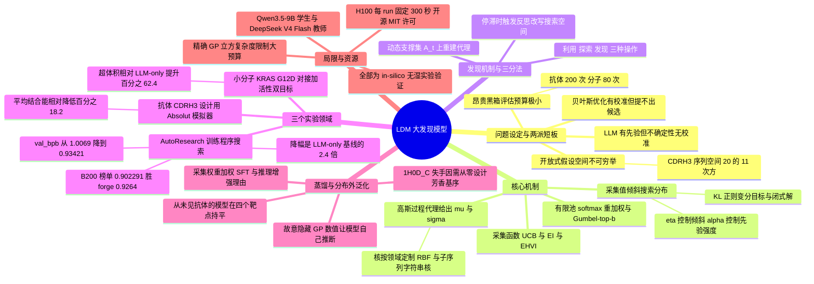

## 一、论文是干什么的？

先说一个几乎所有做实验的人都遇到过的困境。假设你要设计一个抗体，让它牢牢黏住某个病毒蛋白。抗体上真正决定黏不黏的那一小段叫 **CDRH3 环**（抗体重链上的第三个高变区，是决定结合特异性的主要部件），它大约 11 个氨基酸长，每个位置有 20 种氨基酸可选。于是可能性总数是 $20^{11}$，约合 $2\times10^{14}$，也就是两百万亿量级。而你每验证一条序列，都得跑一次昂贵的模拟，或者干脆做一次湿实验。你的预算可能只有两百次（这正是论文抗体实验的真实设定）。两百次，从两百万亿里面挑出好东西，这就是**科学发现**的真实难度。

过去两年，很多人自然想到用**大语言模型**（LLM，即在海量文本上预训练出来的生成式模型）来解决这件事。LLM 的优势很清楚：它见过无数分子式、蛋白序列、训练代码，所以它猜出来的候选往往语法合法、看着靠谱。这种「见过很多、所以知道什么东西长得像话」的能力，论文里叫**结构化先验**（structured prior）。但 LLM 有一个要命的短板：它对自己的判断校准得很差。原文的准确措辞是「语言或序列似然**不必然**与外部测得的科学性质相关」、「LLM 的内部置信度**不能可靠反映**它对某个外部属性的不确定性」——注意是「不可靠」而不是「完全无关」。论文在引言与 7.1 节引用了一批实证研究支撑这一点：在 ResearchClawBench 上最强的自主智能体做 40 个真实论文任务只拿到 21.5/50 分，在 PaperBench 上复现 ICML 论文只有 21.0%，而博士研究者是 41.4%；此外，一开始占优的 LLM 创意新颖度排名在真正执行之后会反转，LLM 生成的想法也倾向于向已有文献的重心收敛。换句话说，LLM 会滔滔不绝地提议，但它不知道哪个提议值得花掉你那两百次宝贵预算。

另一条路是几十年积累下来的**贝叶斯优化**（Bayesian Optimisation，简称 BO）。BO 的思路是：既然真实目标函数昂贵，那就先用少量已测数据拟合一个便宜的**代理模型**（surrogate model），让它既给出预测值也给出「我对这个预测有多没把握」，然后用一个**采集函数**（acquisition function）把这两者合成一个「值不值得测」的分数。BO 在预算受限时非常高效，但它有个硬前提：你必须先把搜索空间写清楚。分子、蛋白、程序这类空间根本写不清楚，甚至压根不能穷举。BO 能在它看得见的候选里排序，却无法凭空变出它从没表示过的候选。

**这就是本文的切入点**：两种方法的短板刚好是对方的长板。作者提出的 **Large Discovery Model**（LDM，大发现模型）就是把两者接成一个闭环：LLM 负责「往哪儿看」，也就是提出、修改、拓展候选；高斯过程代理负责「测哪个」，也就是给出均值与不确定性并合成采集值；每次真实实验的结果回来后，代理和 LLM 的上下文同时更新，下一轮提议就被新证据重新引导。

用一个生活化类比：**这就像找矿**。LLM 是那位读遍全世界地质文献的老专家，他能一眼看出「这片地层结构像是有铜」，能指出你自己完全想不到的新区域；但他说不准哪个具体钻孔位置含量最高。高斯过程是那台钻探数据分析仪，它只认已经打过的孔，但它能画出一张「预计含量分布图」，外加一张「我对哪里最没把握」的置信图。只用专家：他会一直在自己熟悉的老矿区绕圈；只用仪器：它永远不会告诉你去隔壁那座从没打过孔的山。把两者接起来，才是真正的勘探队。而所谓「用不确定性引导搜索」，就是说你不只钻预计含量最高的那个点，也愿意专门去钻那个「我完全没把握、但万一有大矿」的点，因为后者哪怕落空，也把整张地质图的精度往前推了一步。

论文还做了一件挺有价值的概念梳理：把搜索行为拆成**三种**而不是传统的两种。传统 BO 只讲**利用**（exploitation，去测预测值最高的点）和**探索**（exploration，去测不确定性最高的点）。LDM 加了第三种：**发现**（discovery），即改变搜索空间本身，把原本表示不出来、也到不了的候选拉进来。作者把设计空间按「相对于代理模型的已知程度」分成四个**认知状态**（epistemic regime）：已知的已知、已知的未知、未知的已知（存在于外部数据库、往期实验或并行探索进程里，但没有被检索进当前上下文）、未知的未知。这套四分法在流行文化里俗称 Rumsfeld 矩阵，原文没有用这个名字，只在配图处引了一本讲思维模型的书作为出处。利用作用在「已知的已知」上，探索解决「已知的未知」，而发现负责把「未知的未知」变成「已知的未知」；「未知的已知」需要额外的记忆读写操作，原文明确把它留给未来工作。这个三分法是全文实验部分反复验证的主线：每个领域的曲线都是「快速改善，卡在平台期，触发发现改写搜索空间，再次改善」。

## 二、核心方法与创新

### 2.1 三个零件：提议者、代理、采集函数

LDM 由三个部件组成，我们先把符号立起来。

在第 $t$ 轮，已经真实评估过的历史记为

$$
\mathcal{D}_t=\{(x_i,r_i)\}_{i=1}^{t-1}
$$

其中 $x_i$ 是一个设计（一段训练程序、一条氨基酸序列、一个 SMILES 分子串），$r_i$ 是它的实测奖励（带噪声，$r_i\approx R(x_i)$，$R$ 是我们想最大化但不知道形状的黑箱目标）。另外还有一个更宽的**搜索上下文** $\mathcal{C}_t$，它除了 $\mathcal{D}_t$ 还装着此前生成过的候选、代理的预测、采集值、约束反馈、精修轨迹等等。这个区别很重要：$\mathcal{D}_t$ 是喂给统计代理的**证据**，$\mathcal{C}_t$ 是喂给 LLM 的**记忆**。

**其一，生成式基座模型**。它定义提议分布

$$
p_{\theta,\alpha}(x\mid\mathcal{C}_t)
$$

$\theta$ 是模型权重，$\alpha$ 是**推理配置**，包括提示词策略、采样温度、推理流程、精修方案、测试时算力预算。作者刻意把 $\alpha$ 单列出来，是因为同一个模型不同用法，等效提议分布完全不同。$p_\theta$ 是裸模型分布，$p_{\theta,\alpha}$ 才是实际生效的提议分布。

**其二，概率代理**。它维护后验 $p(R\mid\mathcal{D}_t)$，对任意候选 $x$ 给出预测均值 $\mu_t(x)$ 和预测不确定性 $\sigma_t(x)$。这里的 $\sigma_t$ 是**认知不确定性**（epistemic uncertainty，因为证据不足而产生、可以通过多做实验降低），不是测量噪声那种不可消除的随机性。

**其三，基于模型的采集函数** $a_t(x)$，把 $(\mu_t,\sigma_t)$ 压成一个标量，回答「值不值」。

这里有一个作者反复强调的关键区分：LDM 用**采集值**而不是**奖励模型分数**来引导搜索。奖励模型回答的是「这个候选大概能拿多少分」；采集函数回答的是「把下一份算力或下一次昂贵实验花在它身上，值不值」。后者天然包含了「我对它没把握，所以测它能学到东西」这一层信息。类比一下：奖励模型像是只看预测分数录取学生，采集函数像是同时考虑「预测分高」和「这个学生的能力我还没摸清、值得面试一次」。

### 2.2 核心公式：采集值倾斜的搜索分布

LDM 的数学骨架只有一条式子。我们希望搜索分布 $q$ 既让期望采集值高，又不要跑得离 LLM 的先验太远，否则会生成一堆语法都不合法的垃圾。于是在第 $t$ 轮定义

$$
\pi_t=\arg\max_{q\in\Delta(\mathcal{X})}\left\{\mathbb{E}_{x\sim q}\!\left[a_t(x)\right]-\frac{1}{\eta}\mathrm{KL}\!\left(q\,\middle\|\,p_{\theta,\alpha}(\cdot\mid\mathcal{C}_t)\right)\right\}
$$

逐个符号解释：

- $\Delta(\mathcal{X})$：设计空间 $\mathcal{X}$ 上所有概率分布的集合，也就是「所有可能的搜索策略」；
- $\mathbb{E}_{x\sim q}[a_t(x)]$：按策略 $q$ 抽候选时，期望能拿到多高的采集值，这一项把概率质量往有价值的地方推；
- $\mathrm{KL}(q\|p_{\theta,\alpha})$：Kullback–Leibler 散度，衡量新策略 $q$ 偏离 LLM 先验多远，这一项是缰绳，防止策略脱离「合法、说得通的设计」这个区域；
- $\eta>0$：**采集倾斜强度**，$\eta$ 越大越听采集函数的话，越小越听 LLM 的话。

这个变分问题有唯一闭式解（论文 Proposition 1，由 Gibbs 变分原理，等价地说 Donsker–Varadhan 表示，直接给出）：

$$
\pi_t(x)=\frac{1}{Z_t}\,p_{\theta,\alpha}(x\mid\mathcal{C}_t)\,\exp\!\big\{\eta\,a_t(x)\big\},\qquad Z_t=\int_{x\in\mathcal{X}}p_{\theta,\alpha}(x\mid\mathcal{C}_t)\,\exp\!\big\{\eta\,a_t(x)\big\}\,\mathrm{d}x
$$

- $Z_t$ 是归一化常数，实践中从不显式计算；
- $\exp\{\eta\,a_t(x)\}$ 是**倾斜因子**，它把 LLM 原本的概率分布按采集值指数级地重新加权。

这个式子的两个极限特别有解释力：当 $\eta\to0$，倾斜消失，$\pi_t$ 退化成纯 LLM 采样，完全没有数据反馈；如果进一步假设 $p_{\theta,\alpha}(x\mid\mathcal{C}_t)\propto p_\theta(x\mid\mathcal{C}_t)^{\alpha}$（温度形式），那么当 $\alpha\to0$ 时先验被摊平成均匀分布，$\pi_t\propto\exp\{\eta\,a_t(\cdot)\}$；原文的准确措辞是「$\alpha\to0$ 之后**再把 $\eta$ 也取大**，才算恢复经典贝叶斯优化」，这一步不能省。**LDM 正是这两个极限之间的那片区域**。作者也诚实地指出，有些 LLM 推理后端并不满足这个温度形式，所以这段分析应当读作「$\alpha$ 含义最清晰的标准情形」。

作者还给了一个赌博机（bandit）视角的读法：科学设计不能事前列举，所以候选是从一个蓄水池（reservoir）里被逐步揭示出来的，这正是**无穷臂赌博机**的设定。$p_{\theta,\alpha}$ 就是蓄水池，$\eta\,a_t(x)$ 是奖励倾斜强度，$Z_t$ 是 log-sum-exp 归一化项。取众数就得到赌博机式的 argmax：

$$
x_{t+1}=\arg\max_{x\in\mathcal{X}}\big[\alpha\log p_\theta(x\mid\mathcal{C}_t)+\eta\,a_t(x)\big]
$$

### 2.3 代理为什么用高斯过程，以及不确定性到底怎么算

这里回答一个很多人看到摘要里 Bayesian non-parametric 会问的问题：**具体是什么非参数贝叶斯模型？** 答案是**高斯过程**（Gaussian Process，GP），不是狄利克雷过程，也不是中餐馆过程。原文 3.2 节写得很直白：we model this objective using a Gaussian Process，理由是 GP 样本效率极高、后验更新有精确闭式解、并且能在未探索区域给出有原则的非参数不确定性。

为什么 GP 算「贝叶斯非参数」？「贝叶斯」是因为它对未知函数给一个先验、见到数据后按贝叶斯公式更新成后验，输出的是一整个概率分布而不是单一预测值。「非参数」不是「没有参数」，而是**参数个数不被事先固定住**：GP 不是先写死「奖励函数是一条三次多项式」再去拟合那几个系数，而是把整条未知函数本身当成随机对象建模，预测时所有历史观测都通过核函数直接参与运算，你测的点越多，它能表达的函数形状就越复杂。对比一下就清楚了：线性回归的复杂度被参数个数封顶，无论给多少数据都只能画直线；GP 的复杂度随数据量自然增长，代价是每次预测都要把全部历史点算进来（这也是后面提到的立方复杂度的来源）。

先验写成

$$
R(x)\sim\mathcal{GP}\big(m(x),\,k(x,x')\big)
$$

- $m(x)$：先验均值函数，论文用常数先验 $m(x)=m_0$，$m_0$ 从数据里估；
- $k(x,x')$：正定核函数，衡量两个设计有多像。核的选择随领域变化：原文附录 C.1 只举了例子，说连续参数空间用 RBF 核、序列空间用字符串核（string kernel）；落到具体实验，autoresearch 用 RBF 核，分子任务用**子序列字符串核**（subsequence string kernel）衡量 SMILES 字符串相似度，抗体任务用的核原文没有指明。

观测带独立高斯噪声 $r_i=R(x_i)+\epsilon_i$，$\epsilon_i\sim\mathcal{N}(0,\sigma_n^2)$。用贝叶斯条件化，任意候选 $x$ 的后验预测均值与方差有闭式解：

$$
\begin{aligned}
\mu_t(x)&=m_0+\mathbf{k}_t(x)^{\top}\left(\mathbf{K}_t+\sigma_n^2\mathbf{I}\right)^{-1}\left(\mathbf{r}_t-m_0\cdot\mathbf{1}\right)\\
\sigma_t^2(x)&=k(x,x)-\mathbf{k}_t(x)^{\top}\left(\mathbf{K}_t+\sigma_n^2\mathbf{I}\right)^{-1}\mathbf{k}_t(x)
\end{aligned}
$$

- $\mathbf{K}_t$：$t\times t$ 的核矩阵，元素是 $k(x_i,x_j)$，也就是「已测过的点两两有多像」；
- $\mathbf{k}_t(x)$：长度 $t$ 的交叉协方差向量，元素是 $k(x_i,x)$，也就是「新候选和每个已测点有多像」；
- $\mathbf{r}_t$：已观测奖励向量；$\mathbf{1}$ 是全 1 向量；$\mathbf{I}$ 是单位矩阵。

第二个式子值得多说一句，它是整套方法「不确定性」的来源：$\sigma_t^2(x)$ 从先验方差 $k(x,x)$ 出发，**减掉**一项由「新候选与已测点的相似度」构成的修正。你测过的点越多、越接近 $x$，那一项越大，$\sigma_t(x)$ 就越小。接着上面的探矿类比：$\sigma_t$ 就是「离最近的钻孔有多远」。你脚下就是钻孔，含量已知；你走到荒野中央，仪器就只能耸肩。

核超参数（长度尺度、输出方差）、噪声方差 $\sigma_n^2$、先验常数 $m_0$ 都用 II 型最大似然（最大化边际对数似然）以 L-BFGS 之类的梯度法估计，每轮新观测进来后重估一遍。

### 2.4 采集函数：把均值和不确定性合成一个分数

论文实现了三种采集函数。最直观的是**置信上界**（Upper Confidence Bound，UCB）：

$$
a_t^{\mathrm{UCB}}(x)=\mu_t(x)+\sqrt{\beta_t}\,\sigma_t(x)
$$

$\beta_t>0$ 是探索权重系数。这个式子把探矿类比讲得最清楚：**打分等于预计含量加上探索奖金乘以不确定性**。你不只钻预计含量最高的点，你也愿意为「我完全不知道那里有什么」支付一笔溢价。$\beta_t$ 就是这笔溢价的价码，调大就更爱冒险，调小就更保守。

论文还指出 UCB 恰好让 2.1 节的三分法在公式里显形：在 $\pi_t(x)\propto p_{\theta,\alpha}(x\mid\mathcal{C}_t)\exp\{\eta\,a_t(x)\}$ 里，LLM 蓄水池项实现「**发现**」，$a_t$ 的高 $\sigma_t$ 尾部实现「**探索**」，高 $\mu_t$ 的众数实现「**利用**」。

第二种是**期望改进**（Expected Improvement，EI）：

$$
a^{\mathrm{EI}}(x)=\left(\mu_t(x)-r_t^{*}-\xi\right)\Phi(z)+\sigma_t(x)\varphi(z),\qquad z=\frac{\mu_t(x)-r_t^{*}-\xi}{\sigma_t(x)}
$$

- $r_t^{*}=\max_{i\leq t}r_i$：目前观测到的最好成绩，也就是现任冠军；
- $\xi\geq0$：探索调节超参数；
- $\Phi(\cdot)$ 与 $\varphi(\cdot)$：标准正态分布的累积分布函数与概率密度函数。

EI 回答的是「这个候选比现任冠军好多少，期望值是多少」，天然对「超不过现任」的候选打低分。

第三种是给多目标用的**期望超体积改进**（Expected Hypervolume Improvement，EHVI）。当你要同时优化多个互相打架的指标，比如分子要既能对接得牢又要活性高，就没有单一的「最好」了，只有一片**帕累托前沿**（Pareto front，即不牺牲某个指标就无法改善另一个的那批解）。**超体积**（hypervolume）是这片前沿相对一个固定参考点所支配的体积，越大越好。EHVI 算的是「把这个候选加进来，超体积期望能长多少」。多目标场景下 LDM 唯一的改动就是把标量 $a_t(x)$ 换成 EHVI 值，核心框架不动。

### 2.5 推理时搜索：怎么从一个算不出来的分布里采样

$\pi_t$ 的归一化常数 $Z_t$ 算不出来，$\mathcal{X}$ 也不可穷举。作者的办法很朴素但有效：**有限池近似**。第 $t$ 轮先从 LLM 抽 $N$ 个候选

$$
\{\hat{x}_{t,i}\}_{i=1}^{N}\sim p_{\theta,\alpha}(\cdot\mid\mathcal{C}_t)
$$

然后在这个有限池上做 softmax 重加权：

$$
\Pr(x_t=\hat{x}_{t,i})=\frac{\exp\big\{\eta\,a_t(\hat{x}_{t,i})\big\}}{\sum_{j=1}^{N}\exp\big\{\eta\,a_t(\hat{x}_{t,j})\big\}}
$$

$\eta=0$ 时等于在池子里随机瞎挑，完全忽略采集分数；$\eta$ 增大时概率质量往高采集值处集中；$\eta\to\infty$ 时退化为确定性的 best-of-$N$：

$$
x_{t+1}=\arg\max_{i\in\{1,\dots,N\}}a_t(\hat{x}_{t,i})
$$

候选池大小 $N$ 就是**测试时算力**（test-time compute）的旋钮。这是把 LLM 推理领域「多花推理算力能顶模型规模」那套经验搬到科学发现上，区别在于评判者是校准过的采集函数，而不是模型自己的语言似然或自评。

如果一轮要并行评估 $b$ 个候选，确定性版本取采集值前 $b$ 名；随机版本用 **Gumbel-top-b** 采样，即给每个权重加独立 Gumbel 噪声后按 $\log w_i+g_i$ 排序取前 $b$，得到一个 Plackett–Luce 型的不放回加权样本，好处是避免批次内选到重复候选。

论文也提到，对序列、程序这类逐步生成的空间，同样的原理可以推到中间生成步，用前缀价值函数 $V(x_{t,\leq i})=\mathbb{E}_{x_{t,>i}}[a_t(x_{t,\leq i},x_{t,>i})]$ 支持 beam search 或蒙特卡洛树搜索。但这部分作者留作未来工作，本文实验用的是整体候选重加权。

### 2.6 两种候选生成范式与动态搜索支撑集

LDM 的基础测度有两种实现方式，这个区分在实验里非常要紧：

1. **直接生成**（Direct Generation）：LLM 直接吐出完整候选设计，非法的用合法性检查器做拒绝采样滤掉。
2. **间接参数化**（Indirect Parameterisation）：当直接生成合法设计效率太低时，LLM 不吐候选，而是吐出一个**参数化的搜索区域**（中心、半径、局部边界等），再由外部采样器在这个区域里批量生成候选。好处是把 LLM 推理和候选生成解耦，$N$ 可以放大得多。

间接参数化带来一个漂亮的副产品：LLM 定义了当前的**活动搜索域**

$$
A_t:=\operatorname{supp}\,p_{\theta,\alpha}(\cdot\mid\mathcal{C}_t)\subseteq\mathcal{X}
$$

GP 不必在整个 $\mathcal{X}$ 上建模，只需在 $A_t$ 上建模，并且只用落在当前支撑集里的历史观测来拟合，即 $\mathcal{D}_t|_{A_t}=\{(x,r)\in\mathcal{D}_t:x\in A_t\}$。当 LLM 跨轮改写或扩展 $A_t$，比如在 autoresearch 里给代理模型加上一个新的程序特征维度，代理就在新的 $A_t$ 上重建。**这就是「发现」在代码层面的落地**：不是搜得更狠，而是搜索空间的坐标系变了。

如果不这么做会怎样？论文的消融给了答案（见 2.8 与第四节）：固定住第一轮的特征集，搜索会提前收敛到一个更差的平台。

### 2.7 完整算法流程

论文的 Algorithm 1（LDM 主循环）：

1. 给定黑箱奖励函数 $R$、先验均值 $m(\cdot)$、核 $k(\cdot,\cdot)$、初始数据 $\mathcal{D}_1$、初始上下文 $\mathcal{C}_1$、评估预算 $T$、批大小 $b$、候选池大小 $N$。
2. 对 $t=1,\dots,T$ 循环执行第 3 到 9 步。
3. 更新活动决策域：$A_t\leftarrow\operatorname{supp}p_{\theta,\alpha}(\cdot\mid\mathcal{C}_t)$。
4. 用 $\mathcal{D}_t$ 在 $A_t$ 上拟合 GP，得后验 $R\mid\mathcal{D}_t\sim\mathcal{GP}(\mu_t,k_t)$。
5. 由 $\{\mu_t,\sigma_t\}$ 构造采集函数 $a_t$，可选 EI、UCB 或 EHVI。
6. 从 $\pi_t\propto p_{\theta,\alpha}(\cdot\mid\mathcal{C}_t)\exp\{\eta\,a_t\}$ 抽出批次 $B_t=\{x_{t,1},\dots,x_{t,b}\}$，用 Algorithm 2。
7. 观测带噪黑箱奖励 $r_{t,i}=R(x_{t,i})+\epsilon_{t,i}$。
8. 更新数据集 $\mathcal{D}_{t+1}\leftarrow\mathcal{D}_t\cup\{(x_{t,i},r_{t,i})\}$。
9. 更新上下文 $\mathcal{C}_{t+1}\leftarrow\mathcal{C}_t\cup\{(x_{t,i},r_{t,i})\}$，若触发则再并入反思反馈。
10. 返回 $\arg\max_{(x,r)\in\mathcal{D}_{T+1}}r$。

第 9 步的「反思反馈」是关键的工程细节：当代理判断当前区域已经**停滞**（stale regime）时，才调用 LLM 写一段总结追加到 $\mathcal{C}_t$，让后续提议跳出当前机制家族。这一步和倾斜搜索的核心是正交的。

Algorithm 2（采集引导的推理时采样）：从 LLM 先验抽 $N$ 个候选，算采集分数 $s_i=a_t(\hat{x}_{t,i})$，确定性模式取前 $b$ 名，或随机模式算权重 $w_i=\exp\{\eta s_i\}$ 后用 Gumbel-top-b 抽样，返回批次。这里要提醒一处**原文内部的小不一致**：Algorithm 2 第 7 行的权重是 $w_i=\exp\{\eta s_i\}$（因为候选本来就是从 LLM 分布里抽出来的，先验已经隐含在池子的构成里），而附录 C.3 第 1 步把权重写成 $w_i=p_{\theta,\alpha}(x_i\mid\mathcal{C}_t)\cdot\exp\{\eta\,a_t(x_i)\}$，多乘了一个显式的 LLM 生成概率。两种写法对应两种不同的实现，原文没有说明以哪个为准。

### 2.8 慢学习：把搜索策略蒸馏进权重

前面所有内容都是**快循环**：模型权重 $\theta$ 冻结，靠推理时算力实现倾斜策略。但每一轮都重复一遍大规模过量生成加打分，代价很高。于是论文加了一条**慢循环**：把高预算测试时搜索的经验蒸馏进权重。

作者把这件事定位成一个新的微调范式，并做了一个很清爽的对比：聊天模型蒸馏的是**人类偏好价值**，推理模型蒸馏的是**验证价值**（有标准答案、有单元测试），而发现模型要蒸馏的是**认知价值**（$\mu_t$、$\sigma_t$、信息增益、帕累托前沿扩张）。目标不是记住「哪个分子是好分子」，而是学会「在当前研究状态下，下一个实验该怎么选」。作者拿 AlphaZero 的第 37 手打比方：一步棋之所以有价值，可能是因为它解决了一个关键未知、打开了搜索空间的新区域，而不是因为它当下后验均值最高。

数据是这么攒的：在搜索状态 $\mathcal{C}_t$，候选池 $\widehat{\mathcal{X}}_t=\{\hat{x}_{t,i}\}_{i=1}^{N}$ 被代理全部打分，诱导出有限池采样分布

$$
\widehat{\pi}^{(N)}_t(\hat{x}_{t,i}\mid\mathcal{C}_t)=\frac{\exp\left\{\eta\,a_t(\hat{x}_{t,i})\right\}}{\sum_{j=1}^{N}\exp\left\{\eta\,a_t(\hat{x}_{t,j})\right\}}
$$

注意这里的巧妙之处：**监督信号远多于最终真的送去做实验的那一个候选**。同一历史下生成的所有候选构成了一组「反事实的下一步动作」，它们的代理分数揭示了在这个搜索状态下利用、探索、可行性、前沿扩张的价值如何比较。这些全部被记录为 LDM-TTS 搜索经验。

**推理增强**（reasoning augmentation）是第二个设计。作者认为一个标量分数虽然给出了精确排序，却没有暴露「为什么这一步推进了搜索」这个可复用的理由。于是可选地给保留下来的动作配一段简短的**理由** $z_{t,i}$，说明它是要利用一个有希望的家族、探索一个不确定的家族、保持多样性、满足约束，还是扩张活动支撑集。训练目标是加权自回归损失：

$$
\mathcal{L}_{\mathrm{SFT}}(\phi)=-\sum_{t,i}\bar{w}_{t,i}\left[\lambda_z\log p_\phi(z_{t,i}\mid\mathcal{C}_t)+\log p_\phi(\hat{x}_{t,i}\mid\mathcal{C}_t,z_{t,i})\right]
$$

- $\bar{w}_{t,i}$：由上一个式子归一化得到的采集权重，采集值高的样本在训练里权重大；
- $\lambda_z=1$ 就是推理增强版策略学习；$\lambda_z=0$ 且省掉 $z_{t,i}$ 就是纯动作版；
- $\phi$ 是学生模型参数。

论文在附录 E.7 里报告了一个反直觉的设计选择：**微调时故意把 GP 的数值藏起来**。提示词里只给「实际试过哪些候选、真实结果如何」，不给 $\mu_t$、$\sigma_t$、$a_t$ 的数字，让模型必须自己从原始历史里推断出认知状态并用语言表达出来，比如「过去 15 轮没有改进、这个区域饱和了，换一个方向」。理由有两条：一是部署时采集循环本来就不会把 GP 数值喂给提议者，训练与部署对齐；二是实测显示分布外迁移更好。而且这个改动几乎不影响推理内容，在推理增强的训练轨迹里，只有 $1.3\%$ 明确引用了代理的数字，$97.2\%$ 本来就是从停滞长度、噪声水平、当前最佳这类观测结果推理的。

### 2.9 理论：把遗憾拆成三块

第 5 节给了一个针对 LDM 特点的遗憾分析。标准 GP-UCB 分析假定固定且完全可及的定义域，而这里可及候选集依赖于 LLM 蓄水池和演进中的上下文。有三个前提要先说清楚，它们都是原文明写的：一是这一节的采集函数**固定取 UCB**，即 $a_t(x)=\mu_t(x)+\sqrt{\beta_t}\sigma_t(x)$，分解与上界都不覆盖 EI 或 EHVI；二是分析只处理**串行选点**，不建模批量选择；三是性能是按真目标 $R$ 衡量的，而不是按用来引导搜索的采集函数衡量。

简单遗憾定义为 $\mathrm{Reg}_T=R(x^\star)-\max_{1\leq t\leq T}R(x_t)$，等价于 $\min_{1\leq t\leq T}\mathrm{Reg}_t$，其中即时遗憾 $\mathrm{Reg}_t=R(x^\star)-R(x_t)$。作者先界住平均遗憾，再靠 $\mathrm{Reg}_T\leq\frac{1}{T}\sum_{t=1}^{T}\mathrm{Reg}_t$ 这个标准关系转成简单遗憾保证（推论 1）。关键的即时遗憾分解是一个**恒等式**，不是不等式：

$$
\mathrm{Reg}_t=\underbrace{R(x^\star)-R_{t,A}^{\star}}_{\mathrm{Reg}_t^{\mathrm{disc}}}+\underbrace{R_{t,A}^{\star}-R(x_t)}_{\mathrm{Reg}_t^{\mathrm{opt}}}
$$

其中 $R_{t,A}^{\star}=\max_{x\in A_t}R(x)$ 是当前蓄水池支撑集内能达到的最好值。第一项 $\mathrm{Reg}_t^{\mathrm{disc}}$ 叫**发现缺口**，衡量「当前可达集里根本没有足够接近全局最优的设计」带来的损失，在 $x^\star\in A_t$ 时为零；第二项 $\mathrm{Reg}_t^{\mathrm{opt}}$ 是**域内优化遗憾**，衡量选中的 $x_t$ 离 $A_t$ 里最好的候选有多远。这一分解正好对应 LDM 的两个角色：蓄水池分布决定高质量区域会不会被发现，采集倾斜决定在已可达的候选中挑得有多准。

上界需要两条假设。**假设 1（UCB 校准）**：存在非减序列 $(\beta_t)_{t\geq1}$，使得以至少 $1-\delta_{\mathrm{gp}}$ 的概率，对所有 $t\leq T$ 与所有 $x\in\mathcal{X}$ 同时有 $|R(x)-\mu_t(x)|\leq\sqrt{\beta_t}\,\sigma_t(x)$；原文说明这个事件由标准核赌博机条件蕴含（$R$ 在核的再生核希尔伯特空间里、范数有界、核对角有界、观测噪声条件次高斯）。**假设 2（蓄水池覆盖与局部正则性）**：目标函数在最优点附近满足单侧 Hölder 条件 $R(x^\star)-R(x)\leq L\,\mathrm{d}_{\mathcal{X}}(x,x^\star)^{\chi}$，作用是把「离最优点的距离」换算成「目标值的差距」。在这两条假设下，取定 $\delta_{\mathrm{gp}},\delta_{\mathrm{samp}}\in(0,1)$ 与满足 $\sum_{t=1}^{T}\rho_t\leq\delta_{\mathrm{samp}}$ 的 $\rho_t>0$，则对任意满足 $\kappa_t(\zeta_t)>0$ 的 $\zeta_t\geq0$，**以至少 $1-\delta_{\mathrm{gp}}-\delta_{\mathrm{samp}}$ 的概率**，定理 1 给出平均遗憾上界：

$$
\frac{1}{T}\sum_{t=1}^{T}\mathrm{Reg}_t\leq\underbrace{\frac{L}{T}\sum_{t=1}^{T}(r_t^{\mathrm{cov}})^{\chi}}_{\text{discovery gap}}+\underbrace{2\sqrt{\frac{C_\lambda\beta_T\gamma_T}{T}}}_{\text{GP-UCB}}+\underbrace{\frac{1}{T}\sum_{t=1}^{T}\left[\zeta_t+\frac{1}{\eta}\log\frac{1}{\rho_t\kappa_t(\zeta_t)}\right]}_{\text{sampling shortfall}}
$$

三项分别是发现缺口、GP-UCB 优化项、LDM 采样欠额。符号含义：

- $r_t^{\mathrm{cov}}=\inf_{x\in A_t}\mathrm{d}_{\mathcal{X}}(x,x^\star)$：蓄水池覆盖半径，即当前可达集离真最优点最近有多远；
- $L$ 与 $\chi\in(0,1]$：单侧 Hölder 常数与指数，把距离换算成目标值差距；
- $\gamma_T$：最大信息增益；$C_\lambda=2/\log(1+\lambda^{-1})$；$\beta_T$ 是 UCB 校准序列；
- $\kappa_t(\zeta_t)=p_{\theta,\alpha}(U_t(\zeta_t)\mid\mathcal{C}_t)$：其中 $U_t(\zeta_t)=\{x\in A_t:a_t(x)\geq a_{t,A}^{\star}-\zeta_t\}$ 是采集值离当前最优不超过 $\zeta_t$ 的那批候选，$\kappa_t$ 就是蓄水池分配给这个集合的概率质量，是一个**可观测的蓄水池质量指标**。$\kappa_t$ 太小意味着即便做了指数倾斜，高采集值的设计也很难被抽出来；
- $\rho_t$：每轮的采样失败概率预算，要求 $\sum_{t=1}^{T}\rho_t\leq\delta_{\mathrm{samp}}$。

第三项的来源是引理 1（Gibbs 近最优采集采样）：在给定历史下，以至少 $1-\rho_t$ 的概率有 $a_{t,A}^{\star}-a_t(x_t)\leq\zeta_t+\frac{1}{\eta}\log\frac{1}{\rho_t\kappa_t(\zeta_t)}$。也就是说，从倾斜分布里抽一个候选，比直接在 $A_t$ 上精确最大化 UCB 要差一点，这个「差一点」就是采样欠额。

这个分解的实际含义很清楚，也是原文自己给出的读法：**一个好的 LLM 通过两条通道降低遗憾**，一是提出更接近全局最优的候选（缩小 $r_t^{\mathrm{cov}}$，压第一项），二是把更多概率质量分给高采集值候选（放大 $\kappa_t$，压第三项）。第三项还随 $\eta$ 变大而变小，这给了「倾斜要够锐」一个理论依据。要注意第二项按原文自己的说法就是「the usual GP-UCB information-gain term」，也就是常规 GP-UCB 的信息增益项，本身没有改进。**以下是本综述的解读**：这个定理的价值在于把发现缺口和采样欠额从 GP-UCB 的分析里单独拆出来、并把它们挂到 LLM 的支撑集与概率分配上，而不在于给出比 GP-UCB 更紧的收敛率；而且第一项里的 $r_t^{\mathrm{cov}}$、$L$、$\chi$ 都依赖于事先不可知的全局最优点 $x^\star$ 与目标函数的真实光滑性，所以这个上界整体上是一个结构性的解释工具，不是能直接算出数值的性能保证（$\kappa_t$ 是个例外，原文特意指出它是可观测量）。

### 2.10 消融告诉我们哪个设计真正起作用

作者在 autoresearch 上做了最干净的消融，外层 5 分钟训练预算固定，只动内层便宜的搜索预算：

- **测试时搜索预算有用**。N8H8（每轮打分 $8\times8=64$ 个节点）达到最好的平台，N4H4（16 个节点）收敛在更高也就是更差的值上。
- **发现机制有用，而且它的作用独立于搜索预算与采集函数这两个因素**（原文原话是 discovery is distinct from both the search budget and the acquisition function）。把它去掉、从第一轮起冻结特征集，搜索收敛到更差的平台。
- **采集函数的形式有用**。只用后验均值（纯利用）早期还有竞争力，但会卡在比 EI 和 UCB 都差的位置；UCB 表现最好，因为它主动把一部分测试时预算分给了建模不足的程序家族。
- **最强的对照是完全去掉价值信号**。附录 D.1 让一个 Codex 智能体在没有代理、没有采集函数、没有不确定性信号的条件下跑了 875 次实验，这就是 $\eta=0$ 的极限。它确实做出了真实的阶段性研究，依次是密集缩放、发明稀疏关联值记忆、围绕稀疏记忆重新平衡密集算力、前沿确认、显存感知的批量调参，但最终停在 `val_bpb` 约 $0.956$，而 LDM 是 $0.93421$。作者的诊断很精辟：**瓶颈不在提议表达力，而在价值**。没有 $\mu_t$、$\sigma_t$、$a_t$，运行日志就只是一份叙事性记忆，而不是一片可搜索的价值地形。

超参敏感性方面（KRAS G12D 分子任务）：LLM 采样温度 $T_{\mathrm{LLM}}$ 在 $\{0.25,0.5,0.75,1,1.25\}$ 中越大越好，$1.25$ 最优；采集温度 $\eta\in\{0,0.5,1,\infty\}$ 也是越大越好，且 $\eta$ 是最终帕累托前沿扩张的**主导因子**。但抗体任务上敏感性明显更弱，因为开源 LLM 在这个领域的序列级先验太差，直接生成近乎随机；policy 模式本身已经在做一种隐式的采集感知重要性采样，进一步重加权的边际收益就小了。

## 三、使用了哪些模型和计算资源？

| 条目 | 内容 |
|---|---|
| 主实验用的 LLM / 基座模型 | 分领域不同。**autoresearch 主对比**：论文只说固定住 coding model、环境和 5 分钟预算（the primary comparison holds the coding model, environment, and five-minute-per-run budget fixed），**未披露该编码模型的具体型号**；只有纯 LLM 消融基线（附录 D.1）明确点名用的是 **Codex 智能体**。**微调实验的学生模型**是 **Qwen3.5-9B**（论文未说明用的是全参数微调还是 LoRA，官方代码库的示例是全参数 SFT，见下方训练硬件一栏）。**微调实验的教师模型**是**自建部署的 DeepSeek V4 Flash**（原文用词 self-hosted），负责跑高预算测试时搜索并生成推理理由。**分子与抗体任务的提议者**是 Qwen3.5-9B，论文多处称其为「开源 LLM」。参照模型是 **Qwen3-Coder-30B** |
| 对比的 baseline 模型 | **autoresearch**：Karpathy 原版 autoresearch LLM-only 循环（无发现机制）、ReAct 式无采集函数参照、autoresearch@home 榜单上的 forge 与 overmind。**抗体**：纯 LLM 自回归生成、组合贝叶斯优化框架 TURBO 与 COMBO（原文拼法）、领域专用优化器 AntBO、随机搜索。**分子**：随机搜索、标准多目标贝叶斯优化 MOBO（同样用独立 GP 加 EHVI，并用 ReaSyn 维护动态候选池） |
| 评测/打分用的模型（如 LLM-as-judge） | **没有用 LLM-as-judge**，三个领域的奖励全部来自外部客观评估器。autoresearch 是实际训练一个小语言模型 5 分钟后测 validation bits per byte（`val_bpb`）。抗体用 **Absolut!** 基于结构的模拟器作为黑箱 oracle，返回格点结合能 $E_{\mathrm{bind}}$。分子用 **AutoDock Vina** 对接分数取负（$R_{\mathrm{Vina}}$）加上一个**神经网络结合活性预测器**（$R_{\mathrm{act}}$），针对 KRAS G12D 靶点。分子候选池扩展工具用 **ReaSyn** |
| 训练硬件 | autoresearch 主实验与纯 LLM 消融跑在 **NVIDIA H100** 上，每个候选程序固定 5 分钟即 300 秒训练预算；另有一次与榜单硬件对齐的 run（原文 matched-hardware leaderboard run）跑在 **NVIDIA B200** 上。**GPU 张数与显存论文未披露**，论文引用的 Karpathy autoresearch 项目本身描述为单 GPU nanochat 训练。**微调所用 GPU 型号、张数、显存论文未披露**。以下一条**来自 GitHub README 的示例命令，不是论文披露的实验配置**：示例用 4 张卡（`CUDA_VISIBLE_DEVICES=0,1,2,3`）配 DeepSpeed ZeRO-3 CPU offload 做 `Qwen/Qwen3.5-9B` 全参数 SFT |
| 推理/评测硬件 | **原文未披露**。以下来自 GitHub README：小分子与抗体任务支持纯 CPU 运行（示例命令里 `CUDA_VISIBLE_DEVICES=''`），GPU 需求按任务而定 |
| 是否用商业 API | 论文明确说教师模型 DeepSeek V4 Flash 是**自建部署**的，全文没有出现 API 一词。以下来自 GitHub README：代码库要求一个 **OpenAI 兼容的 Chat Completions 端点**（环境变量 `LLM_BASE_URL`、`LLM_API_KEY`、`LLM_MODEL_NAME`），可以接 vLLM、SGLang 之类的自托管服务，也可以接 LiteLLM 之类的远程网关。**论文未指明是否调用了任何商业 API 端点** |
| 单个完整计算单位的耗时 | 原文出现的时间与预算数字：**每个候选程序训练固定 5 分钟**（300 秒）。autoresearch 上 no-discover 基线约 **255 次 run** 后停滞在 $0.9767$；纯 LLM 循环跑了 **875 次实验**停在约 $0.956$；B200 榜单 run 在 **59 次 run** 内达到 $0.902291$。**抗体**：每个抗原总预算 **200 次 oracle 评估**，串行、每轮选 1 条序列，5 个抗原、多个随机种子。**分子**：总预算 **80 次昂贵评估**，5 个种子。内层便宜预算方面，autoresearch 的 N4H4 每轮打分 16 个节点、N8H8 打分 64 个节点；分子主实验的 Direct-Softmax 每轮让 LLM 生成 128 个 SMILES 候选，消融里的 `proposer{K}_bo{M}` 扫到 64/64；抗体提议者预算扫过 36、75、150、300。**整轮搜索的墙钟总耗时与 GPU 小时数原文未披露** |
| 金钱成本 | **原文未披露**，没有报告任何 API 费用或美元成本 |
| 代码是否开源 | 是。论文摘要末尾给出仓库地址 [yzailab/Large-Discovery-Models](https://github.com/yzailab/Large-Discovery-Models)；许可证 MIT、截至 2026-08-22 的 22 星与 2 fork 都是从 GitHub 侧核到的，不在论文里。项目主页 [largediscovery.net](https://largediscovery.net/)。HuggingFace 组织 [Yangtze-ailab](https://huggingface.co/Yangtze-ailab) 已发布 2 个模型（`LDM-CoT-SFT-Qwen3.5-9B-MixedScience`、`LDM-Acq-SFT-Qwen3.5-9B-MixedScience`）和 3 个数据集（`LDM-CoT-SFT-16K`、`LDM-TTS-Base-SFT-19K`、`LDM-CoT-Acq-SFT-16K`） |

补充几条关于代理模型配置的细节，都来自原文：autoresearch 用 **RBF 核**的 GP，且**为小样本稳定性把核超参固定住**，采集函数用 EI，批次轮次加一个多样性项；分子任务对两个奖励维度各拟合一个**独立 GP**，用**子序列字符串核**衡量 SMILES 相似度，采集函数用 EHVI，参考点全实验固定；抗体的微调对比实验统一用 EI，而附录 D.2.2 的消融在固定提议者预算 300 的条件下横比了 EI、UCB 及其变体与 mean、random，结论是校准过的采集函数普遍更好。GP 超参一般用 II 型最大似然加 L-BFGS 每轮重估，但 autoresearch 是上面说的固定核超参那个例外。

以下来自 GitHub README：代码库还额外实现了论文正文没报告的三个任务适配器（均改编自 MLS-Bench）：自适应 KV cache 量化、蛋白突变效应预测、离散因果发现。

顺便解释一下这里反复出现的核心指标 **BPB**。BPB 是 bits per byte，即「每字节比特数」，衡量语言模型在验证集上平均需要多少比特来编码一个字节的原始文本。它和困惑度（perplexity）是同一族指标，但因为分母是字节而不是词元，所以不受分词器差异影响，跨模型可比性更好。**BPB 越低越好**，说明模型对文本的压缩、也就是预测能力越强。论文里 `val_bpb` 从 $1.0069$ 降到 $0.93421$，直观理解就是同样一段文本，模型编码它所需的信息量减少了约 7%。

## 四、实验结果

### 4.1 三个领域的核心数字

| 领域 | 数据集与靶点 | 指标 | Baseline | LDM | 提升幅度 |
|---|---|---|---|---|---|
| AutoResearch 训练程序搜索 | nanoGPT 式训练，固定 5 分钟每 run，H100 | `val_bpb` 越低越好 | Karpathy LLM-only 循环 $0.9767$，约 255 run 后停滞 | $0.93421$ | 相对共同起点 $1.0069$，降幅 $0.0727$ 对 $0.0301$，即 **2.4 倍降幅** |
| AutoResearch 榜单对照 | autoresearch@home，B200 | `val_bpb` | forge $0.9264$，overmind $0.9274$ | $0.902291$，59 run | 超过此前最好公开结果 |
| AutoResearch 纯 LLM 上限对照 | 同上，H100 | `val_bpb` | 无 BO、无采集、875 次实验的 Codex 循环约 $0.956$ | $0.93421$ | 875 次实验也追不上 |
| 抗体 CDRH3 设计 | Absolut! 模拟器，5 个 PDB 靶点 1ADQ_A、1FBI_X、1H0D_C、1NSN_S、1OB1_C，空间 $20^{11}$ | 结合能 $E_{\mathrm{bind}}$ 越低越好 | LLM-only 反思 | 200 步评估后 | 平均结合能相对**降低 18.2%**；policy 模式达到与领域专用 AntBO 相当的水平 |
| 小分子多目标发现 | KRAS G12D，双目标为 AutoDock Vina 对接分数取负加神经网络活性 | 帕累托前沿超体积 HV 越高越好 | LLM-only 反思；经典贝叶斯优化 | 80 次评估预算 | HV 相对 LLM-only 提升 **62.4%**，相对经典 BO 提升 **63.1%** |

autoresearch 的表 1 还给出了 LDM 在固定 300 秒预算下保留的每一项改动及其实测贡献，这部分挺有意思，因为它们都是可解释的「物理」发现：n-gram 哈希记忆（零 FLOP 记住局部 n-gram 模式）贡献 $-0.0275$ BPB，QK-norm 贡献 $-0.0137$，把模型变窄（维度 768 降到 640，让固定 300 秒内跑更多步）贡献 $-0.0109$，窗口注意力加 softcap 贡献 $-0.0108$，平方 ReLU 贡献 $-0.0087$，值嵌入贡献 $-0.0079$，Muon 优化器贡献 $-0.0048$。在固定训练时间预算下，改善只能来自「处理更多词元」或「每个词元学到更多」这两条路。

### 4.2 微调也就是把搜索策略蒸馏进权重的效果

| 模型配置 | AutoResearch `val_bpb` 越低越好 | 抗体 $-E_{\mathrm{bind}}$ 越高越好 | 小分子 HV 越高越好，KRAS G12D，80 次评估，5 种子 |
|---|---|---|---|
| Base Qwen3.5-9B 无 CoT | $0.9965$ | $102.6$ | $16.49\pm5.87$ |
| Base Qwen3.5-9B 有 CoT | $0.9825$ | $104.4$ | 未报告 |
| LDM-SFT 无推理增强 | $0.9829$ | $105.1$ | $22.28\pm3.83$ |
| LDM-SFT 推理增强 | $\mathbf{0.9788}$ | $\mathbf{105.5}$ | $\mathbf{26.66\pm2.61}$ |
| DeepSeek V4 Flash 教师 两个变体 | 未报告 | 未报告 | $23.58\pm2.83$ 与 $24.55\pm3.59$（正文）；$24.55\pm3.59$ 与 $24.07\pm3.12$（附录表 6） |
| Qwen3-Coder-30B 参照 | $0.9801$ | 未报告 | 未报告 |

这里必须点出**原文自身的一处数字不一致**：6.4.3 节正文写教师「with reasoning 达到 $24.548\pm3.589$、without reasoning 达到 $23.582\pm2.832$」，而附录表 6 的 KRAS G12D 一列写的是 `without_cot` 为 $24.55\pm3.59$、`with_cot` 为 $24.07\pm3.12$，$23.58$ 这个数在表 6 里根本没出现。也就是说教师两个变体的 CoT 标签在正文和附录里对不上。本综述不替原文裁定哪个对，只把两处都列出来。

另外两个值得注意的现象：第一，**9B 的学生在分子任务上超过了它的教师**（$26.66$ 对教师最好的 $24.55$），也超过了 30B 的参照模型（在 autoresearch 上 $0.9788$ 对 $0.9801$）；第二，KRAS G12C 上的同类对比也一致，base 是 $11.64\pm2.63$，推理增强 SFT 是 $20.98\pm2.92$。

### 4.3 分布外泛化

这是全文最有说服力的一组结果。**病例级实验**：把 5 个抗体靶点里的 1FBI_X 和 1H0D_C 完全排除在训练之外，只在另外 3 个上微调，然后在留出的两个上测试。结果在 1FBI_X 上达到 $-110.57$（base 是 $-109.5$，在分布内模型是 $-113.4$），在 1H0D_C 上达到 $-95.4$，甚至**超过**了在分布内训练过的模型（$-94.6$）和 base（$-90.9$）。

**任务级实验**（更狠）：把整个蛋白任务从训练里删掉，只用 nanoGPT 和小分子轨迹微调一个带思维链的模型。这个模型从未见过任何抗体、任何 Absolut 结合地形、任何一条 CDRH3 序列，然后原封不动扔进抗体采集循环。结果在 5 个靶点中的 4 个上与在分布内模型相当：1FBI_X 达到 $-113.1$ 对 $-113.4$、1ADQ_A 达到 $-110.3$ 对 $-109.4$、1OB1_C 达到 $-106.6$ 对 $-105.5$、1NSN_S 达到 $-104.2$ 对 $-104.7$。

唯一失手的是 1H0D_C，只有 $-89.4$，还不如 base 的 $-90.9$。作者对这个例外的分析很坦诚也很有洞察：模型在循环里同时扮演两个角色，一是**按采集信号从候选池里挑**，二是**从零设计新候选**。1H0D_C 的地形异常浅（最好能达到约 $-95$，其他靶点是 $-104$ 到 $-113$），最优解在一个窄盆地里，必须刻意设计一个特定的芳香与疏水基序才能到达。任务级模型没有蛋白领域先验，只能退回到「从池子里挑最有希望的那个」，于是天花板就和 base 撞在一起了。**这个分离恰恰说明蒸馏出来的是「怎么用采集信号做探索与利用决策」这种任务无关技能，而不是领域知识**。作者还展示了两个模型的思维链对照：在分布内模型说的是「从 Y 开始做 $\pi$ 堆积、中间保留疏水核心」并造出池子里根本没有的 YRMQDQPWSLQ；而任务级模型说的是「我得从一千多个候选里挑一个，HLFQSCVSGPL 已经在池子里、氨基酸性质合适、不违反约束，就选它」。

另外，附录 E.7 的表 8 显示，**隐藏 GP 数值**的做法不但没伤害反而帮助了任务级分布外迁移：GP-hidden 版本拿到最好的平均结合能（$-106.9$）和 5 个抗原中 3 个的最佳结果，包括 1FBI_X 上决定性的 $-115.9$ 和困难靶点 1H0D_C 上的恢复（$-93.1$ 对 $-89.4$）。不过这张表的脚注给了一个不能忽略的折扣：**基线与 GP-in-prompt 行是 3 个随机种子，而 GP-hidden 行只有 1 个种子（seed 42）**，所以这条「隐藏 GP 更好」的结论证据强度相当弱。

### 4.4 这些数字该怎么读，哪里需要打折扣

必须说清楚几件事，否则很容易过度乐观。

**第一，三个领域全部是数字预言机，没有一次湿实验**。作者自己在第 6 节开头就明说了：三个案例都通过 in-silico 或数字 oracle 基准评估，这样才能做可控的序贯搜索实验；LDM 循环对评估器不可知，理论上可以换成湿实验测量，但「验证这类湿实验部署是未来工作的重要方向」。抗体的 Absolut! 是格点模型，分子的活性是神经网络预测器，这些和真实测定之间还有相当距离。

**第二，抗体任务上作者主动放低了姿态**。原文写得很明白：目标是把 LDM 定位为一个有竞争力的**通用**优化方法，而不是宣称胜过领域专用的 AntBO。policy 模式 LDM 达到与 AntBO 相当的水平，而 direct 模式只比裸 LLM 好一点点。这个诚实值得肯定，但也提醒读者：在有成熟专用方法的领域，通用框架目前的定位是打平而不是超越。

**第三，2.4 倍是降幅之比，不是绝对性能之比**。`val_bpb` 从 $1.0069$ 降到 $0.93421$（降 $0.0727$）对比降到 $0.9767$（降 $0.0301$），比值是 $2.4$。这个说法本身没问题，但读者不要误读成「性能好 2.4 倍」。而且 autoresearch 主对比里那个 coding model 的具体型号没有披露，跨方法可比性的核查因此打了折。

**第四，方差不小，有些结论区间重叠**。分子任务上作者自己写了 although the intervals overlap，即尽管区间有重叠。推理增强 SFT 的 $26.660\pm2.608$ 与教师的 $24.548\pm3.589$ 一个标准差是叠在一起的。抗体任务的分布外结论也是在 5 个靶点上 4 个持平、1 个失手，样本量不大。

**第五，微调实验的评估协议和主实验不完全一致**。表 7 里 LDM-SFT 在 autoresearch 上是 $0.9788$，而主实验 LDM 是 $0.93421$。这两个数字不能直接比，因为微调实验只跑了 80 次 LDM-TTS 迭代，目的是比较不同提议者，而不是刷绝对性能。

**第六，作者自己列出的局限**。精确 GP 对观测数的计算复杂度是**立方级**，大预算时会顶不住；测试时搜索依赖批量候选采样，LLM 推理开销可观；代理的核函数与特征表示**仍需按领域手工定制**，跨域自动化程度有限；框架性能被 LLM 预训练知识覆盖度封顶，在先验薄弱的领域很难显著胜过专用方法（抗体就是活例）；闭环只吃过程内的实验观测，没有系统接入外部已有知识和数据，大量「未知的已知」还闲置着。此外还有代理误配（misspecification）和奖励刷分（reward exploitation）的风险。

## 五、潜在应用与已落地应用

### 作者明确提到的

- **神经网络训练程序自动搜索**：论文最完整的案例，在 autoresearch@home 榜单上以 $0.902291$ 超过 forge（$0.9264$）与 overmind（$0.9274$）。这是一个当下就能用的场景，让智能体在固定训练时间预算下自己改 `train.py`。
- **抗体设计**：CDRH3 环序列优化，5 个抗原靶点。
- **小分子先导化合物发现**：KRAS G12D 与 G12C 的多目标优化（对接分数加活性）。
- **湿实验闭环**：作者明确说 LDM 循环对评估器不可知，可以把数字 oracle 换成湿实验测量，并把这列为重要的未来方向。
- **物理加速器实验与真实世界实验**：引言里把这些和昂贵模拟并列为 LDM 所针对的反馈来源。
- **未来工作里点名的方向**：记忆检索机制与**联邦式发现**框架，把外部知识库、已发表实验结果、并行探索进程的数据纳入闭环；稀疏高斯过程以突破立方复杂度；让 LLM 自主学习代理的核函数与先验设定，即端到端代理规格化；用偏好学习和强化学习进一步把采集引导的决策逻辑内化进生成分布。

### 合理推演的潜在方向（本文未做实验）

以下是基于方法通用性的推演，**不是论文的结论**：

- **材料与催化剂配方筛选**：这类问题同样是「昂贵评估加结构化空间加语义领域知识很重要」，而且相关文献（PHOENICS、Gryffin）本来就是 BO 系。
- **实验协议与工艺参数优化**：论文的间接参数化范式（LLM 定义搜索区域、外部采样器填充）特别适合这种「参数集本身会变」的场景。
- **编译器与内核自动调优、系统配置搜索**：autoresearch 案例本质上就是这一类，只是目标换成了 `val_bpb`。
- **提示词与智能体流程优化**：OPRO 这条线的工作可以直接套上校准的代理。

### 已知的实际落地与被采用情况

**截至综述撰写时（2026-08-22）未见公开的工业落地或第三方采用案例**。能确认的只有开源侧的动静：GitHub 仓库约 22 星、2 fork，MIT 许可；HuggingFace 上 Yangtze-ailab 组织已发布 2 个 SFT 模型和 3 个数据集，下载量分别为 343 与 6（模型）和 33、44、40（数据集），这些数字说明目前还处在刚发布的早期阶段。论文自己也在摘要末尾标明这是 LDM 的 **v0.1 初版发布**（initial release）。

## 六、网络上的讨论与评价

**HuggingFace Papers**：[huggingface.co/papers/2608.15669](https://huggingface.co/papers/2608.15669) 上有 **62 票**赞成，2026-08-18 由作者之一 Yihang Chen（用户名 scyyc9）提交到 Daily Papers。评论区共 **3 条**，其中 **2 条来自作者本人**：

- Yihang Chen（scyyc9，2026-08-18）：Discovery happens through repeated rounds of proposing, testing and learning. LDM uses every result to focus the next round, finding promising programs, proteins and molecules with fewer trials.
- Zhongwei Yu（Ease-Onway，2026-08-18）：This paper provides LDM as a unified architecture to combine LLM with Bayesian experimental design, and LLM can further learn experimental design through post training. The initial release provides case studies as proof of concept, showing the effectiveness of LDM in diverse open-ended design problems.
- 第三条来自 **Librarian Bot**（自动化机器人，2026-08-19），列出了 Semantic Scholar 推荐的 7 篇相似论文，包括 [Evidence-Informed LLM Beliefs for Continual Scientific Discovery](https://huggingface.co/papers/2606.29182)、[BayesEvolve: Explicit Belief States for Autonomous Scientific Discovery](https://huggingface.co/papers/2606.30335)、[Model Discovery Agent: LLM-assisted Bayesian experiment design](https://huggingface.co/papers/2608.09696) 等。这组推荐本身有信息量：同期至少有三四篇工作在做「LLM 加贝叶斯信念状态 / 贝叶斯实验设计」，说明这是一个正在快速形成的赛道，而不是孤立的想法。

**GitHub**：[yzailab/Large-Discovery-Models](https://github.com/yzailab/Large-Discovery-Models) 22 星、2 fork，MIT 许可，主分支 50 次提交，最后一次推送是 2026-08-19，README 自述处于 LDM v0.1 release candidate 阶段。仓库的 issue 列表共 12 条且全部已关闭，内容清一色是作者自己的开发条目（`Infra`、`add finetuning`、注册新任务、更新文档等），**没有任何外部提出的技术质疑或复现报告**。

**alphaXiv**：[alphaxiv.org/abs/2608.15669](https://www.alphaxiv.org/abs/2608.15669) 上有该论文页面和一份 AI 自动生成的 overview，**但没有任何人类撰写的评论或讨论**。页面上那个显示在点赞图标旁边的数字 18 到底是什么，可以从页面内嵌的数据里直接读到：该论文的指标是 `commentsCount: 0`、`totalVotes: 4`、`publicTotalVotes: 18`、累计访问 72。所以 **18 是 alphaXiv 的公开投票数，评论数确切为 0**。

**项目主页**：[largediscovery.net](https://largediscovery.net/) 上有一篇官方博文 Large Discovery Models: from generation to discovery 和团队页（列出 12 位作者与 6 家机构），内容与论文一致，没有额外的第三方评价。

**结论：截至 2026-08-22，未检索到实质性的第三方公开讨论**。核查过的渠道包括：HuggingFace 论文 API 与论文页内嵌的评论数据、HuggingFace 组织下的模型与数据集接口、GitHub REST API（仓库元数据、issue 列表、提交数）、alphaXiv 页面内嵌的指标数据、项目官网首页与 blog、team 页，以及 Hacker News 的 Algolia 全站检索和通用网页搜索。所有渠道返回的相关结果都只指向 arXiv、HuggingFace、GitHub、项目官网这四个官方入口，没有独立第三方的评论、质疑或复现报告。Reddit 因爬虫策略限制未能检索，X/Twitter、知乎、LinkedIn、Medium 也没有在通用搜索里出现相关结果。这与论文才发布 6 天的时间点是相符的。

**唯一算得上质疑声音的，其实来自论文自己在 7.3 节引用的两篇文献**，而且作者把它们当成设计动机而不是回避。两篇的标题与结论如下（均照原文转述，未做加工）：

- Gupta、Hartford、Liu，[LLMs for Bayesian Optimization in Scientific Domains: Are We There Yet?](https://arxiv.org/abs/2509.21403)：原文说这篇 find that current LLMs show no sensitivity to experimental feedback in BO tasks，即发现当前 LLM 在贝叶斯优化任务里**对实验反馈没有敏感性**，而线性赌博机、GP 优化这类经典方法持续胜过 LLM 智能体。
- Kristiadi 等，[A Sober Look at LLMs for Material Discovery: Are They Actually Good for Bayesian Optimization Over Molecules?](https://arxiv.org/abs/2402.05015)：原文说这篇 concluding that uncertainty taken directly from point-estimated LLMs is unreliable，即从点估计 LLM 直接取出的不确定性不可靠；并且 LLM 对分子贝叶斯优化有用，主要局限于它给有原则的 GP 代理**充当固定特征提取器**、且经过领域数据预训练或微调的情形。

要注意这两篇批评的对象都是「把 LLM 本身当优化器或不确定性来源」的做法，并不是在批评「LLM 加 GP」这个组合本身。作者的回应正是顺着这个区分来的：these critiques directly motivate LDM's design，我们保留一个显式的校准后验也就是 GP 代理，只把 LLM 当作候选蓄水池。这种把批评意见摆到台面上并据此定架构的写法，是这篇论文可信度的加分项。

## 七、思维导图

