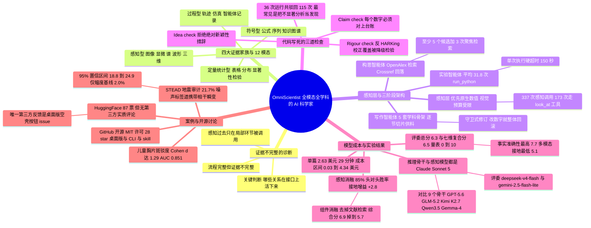

## 一、论文是干什么的？

先说一个很容易被忽略的现象。过去两年里，「AI 科学家」（AI Scientist，指能自动完成科研全流程的智能体系统）这个方向进步飞快：给它一个研究方向，它能自己想点子、自己写代码、自己跑实验、自己画图、自己写论文，甚至自己给自己写审稿意见。从流程覆盖度上看，这条链条已经差不多是完整的了。

但这篇论文指出了一个尖锐的问题：**流程完整不等于证据完整**。现有系统绝大多数只在四种东西上做推理——文本、代码、标签、以及人类提前算好的摘要统计量。也就是说，一张病理切片图像、一段三分量地震波、一个 CAD 三维点云，在进入智能体之前，都已经被人类压缩成了「一行数字」。智能体看到的从来不是原始记录，而是别人替它挑好的表示。

作者用了一个很关键的判断句：问题不在于「什么东西能被序列化成 token」，而在于「哪些关系在这道接口上活了下来」（which relations survive the interface）。图片配一句说明文字，局部形态就没了；把时间序列压成一个无序特征向量，时间顺序就没了；把多通道记录压成几个标量，通道之间的不一致就没了。作者把这种状况总结成一句对比：现有系统是 **workflow-complete**（流程完整的），但 **evidence-incomplete**（证据不完整的）。

打个生活化的比方。这就像你请一位侦探来破案，但你不允许他进现场，只给他一份别人整理好的表格：「现场温度 22 度，脚印长 27 厘米，门锁完好」。这位侦探可能推理能力极强，但他永远不可能注意到「墙上那道划痕的方向不对」——因为那道划痕根本没有出现在表格里。他能回答的问题，从一开始就被那张表格的列名框死了。而 OmniScientist 想做的事，就是让侦探自己走进现场，自己决定要看哪面墙。

那么这篇论文怎么破局？它提出 **OmniScientist**，一个端到端（end-to-end，指从最原始输入一路做到最终产出、中间不需要人插手）、omni-modal（全模态，指同一套系统能处理图像、信号、音频、视频、三维结构、轨迹、表格、公式、序列、图等各种数据形式）的 AI 科学家。核心设计是：**让感知贯穿整个科研生命周期**。原始观测不只是在某一步被瞄一眼，而是同时参与「选什么问题」「怎么设计实验」「跑完之后看什么」「哪些结论能写进论文」这四件事。

系统的输入极简：一个规范文件（specification file），里面写清楚数据在哪、研究对象是什么、每条记录测的是什么属性、以及一句开放式请求「找一个具体、新颖、可检验的问题，自己决定方法，在真数据上跑真代码，产出一篇可发表的短论文」。除此之外什么都不给——不给方法，不给假设，不给分析思路。作者在 36 个真实公开数据集上跑了这套流程，36 个全部从原始数据一路走到了编译好的 PDF 论文。

## 二、核心方法与创新

整个系统由 **一个感知层 + 三个自主智能体**（ideation 构思、experiment 实验、writeup 写作）组成，外面套一层「确定性流水线」（deterministic pipeline，指阶段之间的跳转由代码控制而不是由模型自己说了算）。下面逐个拆开。

### 2.1 把科学证据分成四大家族

在讲模块之前，先讲这篇论文的一个分类学贡献。已有的分类习惯按「表示形式」来分（图像、序列、图……），作者改成按「解读它主要需要哪种推理」来分，得到 4 个与学科无关的证据家族：

| 证据家族 | 典型产物 |
|---|---|
| 感知型（Perceptual） | 图像、视频、显微照片、雷达、天文与遥感影像、科学图表的视觉形态、音频、三维结构 |
| 符号型（Symbolic） | 自然语言文档、公式、变量、规则、序列、知识图谱、逻辑与因果关系、数学模型 |
| 定量统计型（Quantitative-statistical） | 表格、测量值、分布、曲线、相关性、显著性检验、回归结果 |
| 过程型（Procedural / dynamic） | 实验步骤、代码执行、智能体轨迹、仿真、动态演化、实验方案 |

**为什么要这么分**？因为这个分类直接决定了引擎需不需要为每个学科重写代码。感知层是按「家族 → 模态 → 工具」三层组织的：一个新学科进来，只要它的数据落进这 4 个家族、12 个模态里，就自动解锁对应的工具，引擎一行都不用改。作者在附录 E 里放了地震学那个案例的完整规范文件，全文只有四个字段承载科学内容（role 角色、subject 研究对象、property 每条记录测什么、request 开放请求），加一个成员文件列表。这就是「加一个学科只需加一个文件」的技术兑现。

### 2.2 感知层：先用数字读，实在不行才画图

感知层的设计有一个很务实的取舍。如果每次都把数据渲染成图片再让视觉模型去看，成本会爆炸。所以作者的做法是**优先原生数值分析**（native numeric analysis）：先从原始产物里直接抽关键属性，比如 FFT 频谱峰值、趋势点、包络；只有在「空间或结构模式确实是关键」的时候，才去渲染视觉表示。而且视觉感知有**预算约束**（budget-constrained）：预算用完就返回「budget exhausted」，逼智能体有针对性地看，而不是漫无目的地扫。

这个设计在工具表上体现得非常清楚——每个模态都同时暴露「视觉通道」和「原生通道」两套工具：

| 工具 | 模态 | 返回什么 | 可用案例数 | 调用次数 |
|---|---|---|---|---|
| look_at_image | 图像 | 视觉语言模型对指定图像文件的读解 | 11 | 49 |
| look_at_signal | 信号 | 每通道一个时序面板：起跳、爆发、包络 | 6 | 47 |
| look_at_3d | 三维 | 点云或网格的 XY、XZ、YZ 投影渲染图 | 5 | 40 |
| look_at_table | 表格 | 形状、列名、数据类型、表头、汇总统计 | 1 | 22 |
| look_at_audio | 音频 | 渲染出的波形与频谱图 | 4 | 17 |
| look_at_video | 视频 | 抽样帧，一起送去看 | 3 | 13 |
| look_at_trajectory | 轨迹 | 按时间着色的路径 + 速度曲线 | 3 | 7 |
| analyze_signal | 信号 | 趋势、主要 FFT 频率、峰值、统计量 | 6 | 40 |
| analyze_audio | 音频 | 时长、采样率、RMS、频谱质心、零交叉 | 4 | 39 |
| analyze_3d | 三维 | 点数、包围盒、质心、范围、PCA 主轴 | 5 | 21 |
| read_trace | 轨迹记录 | 一条轨迹或一次智能体运行日志的有序序列 | 2 | 20 |
| analyze_trajectory | 轨迹 | 路径长度、位移、直线度、速度、转角 | 3 | 19 |
| analyze_video | 视频 | 帧数、帧率、分辨率、帧差运动量 | 3 | 3 |

**这张表回答了一个关键质疑**：视觉通道到底是真用了还是摆样子？论文附录 D 的原话是「337 次感知调用里有 173 次落在 `look_at_*` 上」，超过一半，而且每个工具至少被调用过一次。（顺手核一下：上表 13 个工具的调用次数加起来正好是 337，与原文吻合；但只把 7 个 `look_at_*` 工具加起来是 195 而不是 173，这是原文自身的一处小出入，读的时候心里有个数就好——不论按 173 还是 195，视觉通道过半的结论都成立。）类比一下：这就像给研究员配了一台显微镜和一把游标卡尺——大部分时候卡尺够用而且更快，但真正要判断细胞形态时，只有显微镜能给答案，而记录显示他确实经常去用显微镜。

### 2.3 构思阶段（Ideation）：先看材料，再查文献，再想 5 个点子

构思阶段跑的是 **ReAct 循环**（一种让模型交替「观察—推理—行动」的智能体范式）。它自己决定步骤顺序，但典型流程是：

1. 先 `list_materials` 盘点手上有什么材料，并决定要不要看原始观测；
2. 通过 **OpenAlex**（一个开放的学术文献元数据库）检索文献，失败时回落到 **Crossref**；
3. 基于观察到的具体模式，头脑风暴**至少 5 个**候选研究项目，每个都自评「新颖性风险」（novelty_risk）和可行性；
4. 挑出唯一一个「真正新颖且完全可计算」的候选；
5. 把它发展成一个完整、可被推翻的提案，调用 `finalize_idea`。

关键在于第 5 步之后：提案必须先通过一个**代码写死的检查**（code-enforced check）才算过关。这个检查不是让模型自我打分，而是一个 Python 谓词函数，输入是本阶段的 finalize 载荷加上循环累积状态，输出「通过」或者一个拒绝理由字符串。拒绝理由会被当作新的观察追加到对话里，智能体继续跑，直到通过或步数预算耗尽。

检查的具体条款包括：必须有明确的研究问题 + 假设 + 实验方案 + 可推翻标准（四项都不能为空）；必须有 5 个自筛候选；必须有至少 3 次聚焦的文献检索，其中一次专门针对选中的点子；选中的点子必须标记为「完全可计算」，需要动手做物理实验的提案直接拒绝；必须给出泄漏检查、有效样本量估计、以及视觉审计记录。

还有一条特别有意思：**绝对新颖性措辞会被拒绝**。因为一次有界的检索根本不可能证明「前无古人」，所以系统会自动把「first」「never explored」「no prior work」这类说法改写成「based on this search, appears under-explored」（就本次检索而言，似乎研究较少）。这是一个很小但很诚实的设计。

### 2.4 实验阶段（Experiment）：跑真代码，然后被反复驳回

实验阶段把选定的点子翻译成方法设计，靠迭代式代码生成来实现。它跑在一个受控的 `run_python` 环境里，管理子进程执行和图像捕获。出错就分析报错、重新生成脚本，一直循环到跑通。过程中它也可以用感知层去检查原始输入数据，或者验证自己刚生成的实验图里的结构模式。

实验设计被要求包含**至少 4 项分析**：一个主假设检验，加上基线、消融、机制探针、敏感性扫描这类必要对照。

跑完之后是一个代码写死的退出检查（论文里的 Algorithm 1），我把它翻译成中文流程：

1. 若报告结果 $R$ 的 metric 字段为空 → 拒绝；
2. 若真实输出集合 $O$ 里没有任何一次运行成功 → 拒绝（必须真的执行过代码）；
3. 对 $R$ 中报告的每一个数字 $n$：若 $n \notin O$ → 拒绝（每个数字都必须能追溯到真实输出）；
4. 若数据集不是从磁盘加载的 → 拒绝；
5. 若 $R$ 报告了 2 个及以上的 $p$ 值 → 必须在**所有跑过的检验**（包括被降级的那些）上做多重比较校正；
6. 若头条结论不在「被支持的分析」集合里 → 拒绝（反 HARKing）；
7. 未被支持的非头条分析保留在轨迹里；
8. 返回「接受」。

第 5 条是这套设计里我认为最狠的一刀。**HARKing**（Hypothesising After Results are Known，即「看到结果之后再编假设」）是实证科研里最常见的软性造假。常规做法是：跑 20 个检验，挑出唯一显著的那个写成论文，校正分母只算 1。OmniScientist 强制要求校正分母覆盖调试循环中尝试过的**每一个**检验，这样「把失败的分析悄悄删掉」就没法缩小分母了。类比：这好比考试不许只交你考得最好的那一门成绩单，必须交全部科目的成绩，然后按全部科目算平均分。

如果实验崩了或者得到 null 结果，确定性流水线会把控制权退回构思阶段重新想题——但最多回退 2 次，防止无限循环。

### 2.5 写作阶段（Writeup）：五种学科骨架 + 逐节切片供料

写作阶段解决的是「广度如何在成品上体现」的问题。如果只有一个模板，那所有论文读起来都像同一个学科。所以这一阶段带了 **5 套结构规范**（structural specification），固定各刊物风格的骨架和篇幅：

| 风格 | 章节顺序 | 摘要词数 |
|---|---|---|
| 机器学习 | Introduction, Related Work, Method, Experiments, Conclusion, Limitations | 150 到 220 |
| 生物医学 | Introduction, Results, Discussion, Methods | 150 到 200 |
| 地球与空间 | Introduction, Data, Methods, Results, Discussion, Conclusions | 150 到 250 |
| 物理 | Introduction, Theory and Methods, Results, Discussion, Conclusion | 150 到 250 |
| 化学 | Introduction, Experimental Section, Results and Discussion, Conclusions | 150 到 250 |

风格从案例规范里解析出来，或者从研究对象推断，并且**与研究领域解耦**，所以同一个引擎能分别用地震学和材料学各自的行话写论文。

起草时的一个关键机制是**逐节切片供料**：每一节只从它需要的那一片结构化实验记录里展开。方法细节只送到方法与数据节，决定性数字只送到结果节，一个章节**没法引入它从未被给过的细节**。摘要最后写，也从同一批记录来，所以摘要里的数字必然和正文一致。

剩下的机器都是确定性的：一个「论点规划器」（thesis planner）从被支持的分析里挑出头条论断，把其余结果分配给支撑证据、对照或稳健性检查；参考文献通过 OpenAlex API 检索；输出过滤器负责裁剪，但**如果裁得太多就整体回滚**；最后一道 meta-audit 拿生成的论断去对实验记录，才编译 PDF。

论文润色环节还有一条「守卫式修订」（guarded revision）：如果润色改动了任何一个数字、引用、论断或模型名，**整个润色 pass 被整体撤销**。编译失败时按顺序有四层回退：修复 pass、润色前草稿、无引用版本、最朴素的基础模板。

### 2.6 三道检查在 36 次运行中到底拦下了什么

这是全文我最喜欢的一张表——它不吹功能，而是老实公布这些检查实际开火的记录。36 次主实验运行中，检查总共**驳回了 115 次 finalize 尝试**：构思检查驳回 28 次（分布在 36 次运行中的 23 次里），严谨性检查驳回 87 次（分布在 32 次运行里）。只有 4 次运行从头到尾、两道关口都没被退回过。

| 检查 | 触发条件 | 驳回次数 | 涉及运行数 |
|---|---|---|---|
| 构思检查 · Schema | 必填字段留空 | 12 | 10 |
| 构思检查 · 有效样本 | 决定性事件估计留空 | 4 | 4 |
| 构思检查 · 新颖性证据 | 选中点子的检索证据留空 | 3 | 3 |
| 构思检查 · 视觉审计 | 看了图但审计留空 | 3 | 3 |
| 构思检查 · 论断范围 | 数据不能确立什么留空 | 3 | 3 |
| 构思检查 · 新颖性措辞 | 提案里出现绝对新颖性措辞 | 2 | 2 |
| 构思检查 · 广度 | 自筛候选不足 5 个 | 1 | 1 |
| 严谨性检查 · 降级 | 把不显著的分析留在论文里 | 51 | 26 |
| 严谨性检查 · Schema | 结论判定留空 | 21 | 16 |
| 严谨性检查 · 头条选择 | 头条未设、未列首位、或降级名有误 | 9 | 8 |
| 严谨性检查 · Schema | 未报告关键数字 | 3 | 3 |
| 严谨性检查 · 溯源 | 报告的数字不在真实标准输出里 | 1 | 1 |
| 严谨性检查 · 感知 | 没看原始证据就想结题 | 1 | 1 |
| 严谨性检查 · 多重检验 | 检验计数缺失或少报 | 1 | 1 |
| **合计** | | **115** | |

**这张表告诉我们「自主研究员最常在哪里犯错」**：三分之二的驳回都关于**结果选择**，而不是算错数。典型场景是——智能体跑了一整套分析，其中一项不显著，草稿里却还把它当成发现。真正的捏造极为罕见：36 次运行里只有 1 次溯源驳回。这个分布反过来也验证了溯源检查的合理性——数字通常确实是从真实标准输出里抄下来的。

### 2.7 消融实验：哪个设计真正在起作用

作者在地震学案例上做了留一消融（每次固定骨干模型、只去掉一个组件）。先说口径：这一组消融的分数由**单个评委**（deepseek-v4-flash）打出，「综合分」在这里指 7 维复合分，与主表的双评委口径不同，所以下面的数字只适合组内互相比较：

- **去掉先验文献检索，掉得最狠：综合分从 6.9 掉到 5.7**。原因是系统会开始提出冗余或早已发表的点子。
- **把迭代智能体循环压成单次通过**，稿件质量显著退化。
- **去掉新颖性检查**，新颖性评分整整掉 1 分——这说明这个检查精确命中了它的目标维度。
- **溯源强制**（provenance enforcement）比较特殊：它是代码层的确定性约束，**不直接改变评分量表所评的叙述文本**，所以在分数上看不出来。它的作用是从数学上保证每一条报告的实证论断都可追溯。

这个结果值得单独说一句：分数掉最多的不是感知，而是文献检索。也就是说在这套设计里，「不要重复别人做过的事」对论文质量的贡献，甚至大于任何单一的技术模块。

## 三、使用了哪些模型和计算资源？

| 条目 | 内容 |
|---|---|
| 主实验用的 LLM / 基座模型 | **推理骨干（reference reasoning backbone）就是 Claude Sonnet 5**（论文引 Anthropic 2026）。它驱动全部 3 个阶段，也是唯一被替换的组件。作者明确写道：因为 Sonnet 5 在完整评测套件上稳定性最高，所以把它定为后续全部分析的主推理骨干 |
| 感知模型 | **同样固定为 Claude Sonnet 5，并且永远不跟随骨干变化**。这是刻意的实验设计：每一次「看原始观测」都由同一个模型服务，因此评分变化可以完全归因于推理能力。Sonnet 5 是闭源模型，参数规模本身未公开 |
| 对比的 baseline 模型 | 共 9 个骨干：Claude Sonnet 5、GPT-5.6（OpenAI 2026）、GLM-5.2（Zhipu 2026）、Kimi K2.7（Kimi 2025），以及开放权重的 Qwen3.5 系列（9B / 27B / 122B，Qwen Team 2026）和 Gemma-4 系列（26B / 31B，Google 2026）。闭源模型走官方 API 调用，开放权重模型**本地部署** |
| 消融对比的 baseline 系统 | 「盲测变体」（blind variant）：只接收预先算好的标量特征、永远接触不到原始观测，用来模拟传统纯文本系统的接口。另有 1 个「vision-off」变体（心脏病学案例） |
| 评测 / 打分用的模型（LLM-as-judge） | **2 位「跨家族」评委：deepseek-v4-flash 与 gemini-2.5-flash-lite**。刻意选自被测系统之外的模型家族，以规避自我偏好。评委还做过验证：评委间一致性 Krippendorff $\alpha=0.66$（这个系数衡量多位评委给的分数彼此有多吻合，1 是完全一致、0 相当于随机打分，论文取 $>0.6$ 作为可接受门槛）、自我偏好偏差为 0、冗长度偏差 $\rho=0.16$（阈值约 0） |
| 训练硬件 | **不适用**。这篇论文不训练任何模型，纯推理编排系统 |
| 推理 / 评测硬件 | **原文未披露**。论文只说开放权重骨干「本地部署」（served locally / run locally），没有给出任何 GPU 型号、张数或显存 |
| 是否用商业 API | 是。闭源模型「通过其官方 API 调用」（Anthropic、OpenAI、Zhipu、Kimi），文献检索用 **OpenAlex API**、回落到 **Crossref** |
| 单次完整运行的耗时 | 有明确数字（每篇论文口径）：**Claude Sonnet 5 约 29 分钟**；GPT-5.6 约 12 分钟；Qwen3.5-27B 约 30 分钟；Gemma-4-31B 约 14 分钟 |
| Token 消耗 | Sonnet 5：输入 98k / 输出 191k，缓存命中率 93%；GPT-5.6：122k / 112k，缓存命中 89%；Qwen3.5-27B：1.4M / 75k；Gemma-4-31B：714k / 41k |
| 金钱成本 | **一次完整的三阶段执行成本在 0.03 到 4.34 美元之间**，取决于骨干模型，实验阶段占大头。按模型细分：Sonnet 5 每篇 2.63 美元、GPT-5.6 每篇 4.34 美元、Qwen3.5-27B 每篇 0.06 美元、Gemma-4-31B 每篇 0.03 美元 |
| 步数与预算超参 | 构思阶段最多 24 步 + 8 次文献检索，视觉感知采用自适应图像预算 $\min(24,\max(8,2g))$ 次检视（$g$ 为数据里的标签组数）；实验阶段最多 50 步 + 8 次视觉检视，每次 `run_python` 执行**硬超时 150 秒**；最多允许 2 次回退到构思阶段；文本生成每次调用上限 8,000 token |
| 每次运行的产出物 | 一份结构化 JSON 记录、一份 Markdown 摘要、一份可重放的执行轨迹、一份编译好的 PDF 报告 |
| 代码是否开源 | **是**。[GitHub: Omni-Scientist/OmniScientist](https://github.com/Omni-Scientist/OmniScientist)（MIT 许可证），[项目主页](https://omni-scientist.github.io/)。仓库含 engine 参考实现与评测框架、TypeScript/Bun 写的 CLI 终端智能体、桌面版工作台、以及一个 Claude Code skill |

一个补充观察：这套系统对**提示词缓存**（prompt caching）依赖很重——Sonnet 5 的缓存命中率高达 93%。这也解释了为什么输出 token（191k）会比输入 token（98k）还多：输入被缓存反复复用，真正付全价的输入不多。

另外要注意开放权重模型的 token 结构完全不同：Qwen3.5-27B 输入 1.4M、输出仅 75k。这暗示较弱的模型在同一套「被检查反复驳回」的循环里，会经历远多的轮次和更长的上下文重放，输出却更短。

## 四、实验结果

### 4.1 主结果：36 个案例全部跑通，评委总分 6.3

评测方式：每篇生成的论文在 **7 个维度**上打分，**量表是 0 到 10 分**（给评委的提示词要求打 1 到 10 的整数）。7 个维度是——5 个标准同行评审维度加 2 个任务专属维度：

1. **novelty** 新颖性：相对真实先验工作的原创性
2. **soundness** 可靠性：方法与统计是否正确（对照、多重比较校正、无泄漏）
3. **clarity** 清晰度：表达与结构
4. **significance** 重要性：发现的重要程度
5. **reproducibility** 可复现性：细节是否足够重跑
6. **mm_grounding** 多模态接地：论文是**真的**用了视觉/观测证据，还是只是在标量特征上做统计
7. **factual_accuracy** 事实准确性：论文里每一个头条数字是否都能追溯到作者的结果台账

**这里有两个极易混淆的口径，读之前必须先分清**。论文的 Metrics 一节写明它同时报告两种分数：一个是 **7 维复合分**（composite score，就是 7 个维度得分的算术平均），另一个是**评委独立给出的总分**（judges' independent overall scores）。摘要和正文里反复出现的 **6.3**，是后者，也就是下面这张表最右侧 `Overall` 列的值；而 Sonnet 5 的 7 维复合分是 **6.5**（把 6.3、7.0、7.0、6.3、6.1、5.1、7.7 相加除以 7 正好是 6.5），它出现在下一张覆盖率表的最后一行。这两个数字不是笔误，也不是同一个指标——引用时务必说明用的是哪一个。

用 Sonnet 5 骨干在全套 36 案例上的逐维度成绩（末列 `Overall` 是评委独立总分，不是前 7 列的平均）：

| 维度 | Novelty | Sound. | Clarity | Signif. | Reprod. | MM-grnd | Factual | Overall |
|---|---|---|---|---|---|---|---|---|
| 全学科均值 | 6.3 | 7.0 | 7.0 | 6.3 | 6.1 | 5.1 | 7.7 | **6.3** |

九个骨干模型的横向对比（Overall 列）：

| 骨干 | Novelty | Sound. | Clarity | Signif. | Reprod. | MM-grnd | Factual | Overall |
|---|---|---|---|---|---|---|---|---|
| Sonnet 5 | 6.3 | 7.0 | 7.0 | 6.3 | 6.1 | 5.1 | 7.7 | 6.3 |
| GLM-5.2 | 6.2 | 7.1 | 6.8 | 6.4 | 5.9 | 6.6 | 7.5 | **6.5** |
| Kimi K2.7 | 6.2 | 7.2 | 6.7 | 6.2 | 5.5 | 5.8 | 8.0 | 6.2 |
| GPT-5.6 | 5.2 | 6.3 | 6.3 | 5.0 | 5.2 | 4.2 | 7.7 | 5.6 |
| Qwen3.5-122B | 4.7 | 5.5 | 6.2 | 4.8 | 4.8 | 4.8 | 6.5 | 5.1 |
| Qwen3.5-27B | 5.0 | 5.6 | 5.9 | 4.9 | 4.6 | 4.9 | 6.4 | 5.1 |
| Gemma-4-31B | 4.7 | 5.0 | 5.6 | 4.5 | 4.4 | 4.6 | 6.5 | 4.8 |
| Gemma-4-26B | 4.4 | 4.4 | 5.0 | 4.0 | 3.7 | 3.8 | 5.1 | 4.2 |
| Qwen3.5-9B | 4.0 | 4.1 | 4.8 | 3.7 | 3.7 | 3.9 | 4.8 | 4.0 |

**但这张表必须配着覆盖率一起读**，否则会误导。各骨干实际完成的案例数差别巨大：

| 骨干 | Sonnet 5 | GPT-5.6 | GLM-5.2 | Kimi K2.7 | Qwen3.5-122B | Qwen3.5-27B | Qwen3.5-9B | Gemma-4-31B | Gemma-4-26B |
|---|---|---|---|---|---|---|---|---|---|
| 派发案例数 | 36 | 10 | 18 | 9 | 34 | 36 | 32 | 36 | 34 |
| 完成论文数 | 36 | 9 | 17 | 6 | 30 | 32 | 18 | 32 | 25 |
| 综合分均值（7 维复合分） | 6.5 | 5.7 | 6.7 | 6.5 | 5.4 | 5.3 | 4.1 | 5.0 | 4.3 |

注意这张表最后一行是 **7 维复合分**，所以同一个 GLM-5.2 在上一张表的 `Overall` 列是 6.5、在这里是 6.7，Kimi K2.7 是 6.2 对 6.5——不是数据打架，是两个口径。而覆盖率才是这两张表真正的看点：GLM-5.2 的成绩只在 17 个案例上取得，Kimi K2.7 更是只有 6 个。只有 Sonnet 5 是 36 派发 / 36 完成的满覆盖，作者也正是因为它「在完整评测套件上稳定性最高」，才把它定为主骨干。

### 4.2 跨学科稳定性与三个主要发现

- **端到端质量在头部骨干之间高度一致**：Sonnet 5 全套评委总分 6.3，GLM 与 Kimi 在各自子集上落在非常相近的区间。
- **跨学科、跨模态高度稳健**：无论按学科分组还是按证据模态分组，中位综合分紧密落在 **6.1 到 7.1** 之间；作者还做了案例级置换检验，跨领域差异**没有一个达到统计显著**。
- **事实准确性始终是最高的维度**：各骨干之间维度排序高度一致（成对 Spearman 相关中位数 0.82），事实准确性稳居第一。用 Sonnet 5 时，36 个完成案例中有 **30 个**的事实准确性达到 7.0 分以上。作者归因于共享的溯源要求——退出检查把每个报告结果都锚定到真实程序输出，不管模型多能言善辩。

逐案例来看，分数并不是平的。最高的两个案例都是 7.5 分（地质学 / 岩石物理、生态声学），后面跟着一批 7.0 分的案例，共 13 个（振动光谱、材料信息学、符号回归、地震学、海洋生物学、病理学、放射学、心脏病学、植物病理、海洋生物声学、渔业、土木测绘、工业声学）；最低分是凝聚态 / 纳米，Overall 仅 2.5、事实准确性只有 1.0，其次是引力波、分子化学、睡眠神经科学，都只有 4.5。也就是说 36 个案例里确实有明显失手的。

### 4.3 感知消融：85% 的头对头胜率

这是全文最核心的因果证据。作者拿完整系统和「盲测基线」（只收预先算好的标量特征）配对比较，同一个任务、同一个骨干，让跨家族评委组做随机化顺序的头对头评判（随机化是为消除位置偏差）。**在 5 个配备了标量盲测对照的案例上，感知系统以案例平均 85% 的比较胜率取胜。**

逐维度增益（正值表示感知系统更好，跨 5 个盲测对 + 1 个 vision-off 对，由 2 评委组打分）：

| 案例 | Novelty | Sound. | Clarity | Signif. | Reprod. | MM-gr. | Factual | Overall |
|---|---|---|---|---|---|---|---|---|
| 星系跨巡天 | +2.5 | +1.2 | +1.0 | +2.3 | +0.7 | +1.3 | +2.0 | +1.7 |
| 地震学 | +1.0 | +1.5 | -1.0 | +1.5 | +0.5 | +1.5 | +0.5 | +1.5 |
| 病理学 | +1.5 | +1.0 | +0.5 | +1.0 | +0.5 | +3.0 | -0.5 | +1.5 |
| 机械 CAD | +0.5 | +0.5 | +3.5 | +2.5 | +2.5 | +1.0 | +2.0 | +3.0 |
| 植物表型 | +1.0 | +0.0 | +0.0 | +0.5 | +0.7 | +4.0 | +0.3 | +0.3 |
| 心脏病学（vision-off） | +0.3 | +0.3 | +0.3 | +0.0 | +1.3 | -1.7 | +0.0 | +0.3 |
| **宏平均增益** | **+1.14** | **+0.75** | **+0.72** | **+1.31** | **+1.03** | **+1.53** | **+0.72** | **+1.39** |

正文里还另报了一组更醒目的数字：换成「两个条件共同的那位评委」计分时，增益最大的是**多模态接地**（+2.8）和**重要性**（+1.8），而事实准确性在两个条件下同样高。注意这 +2.8 和上表评委组算出的多模态接地宏平均 +1.53 是两个不同的量，别混着引用。作者的解读很到底：接地提升是「能不能直接读原始观测」的直接后果，而重要性提升说明**多模态感知拓宽了一项研究能够支撑的论断范围**。事实准确性没差别，恰恰是因为两个条件都过同一道溯源检查。

排除平局后，感知系统在全部 7 个维度上拿下 **70% 到 87%** 的胜选。差异体现在平局率上：多模态接地、重要性、新颖性这三项平局率接近零（两份稿件在这些方面始终可区分），而事实准确性和可复现性大约四分之一的比较是平局（因为两个条件共享溯源检查）。

### 4.4 机制分析：感知改变的是研究轨迹本身

这一节回答「85% 是不是只是文风好看」。作者对 5 组配对运行做了定性分析，结论是两个系统走上了**完全不同的研究轨迹**：

| 案例 | 只有原始记录才带的证据 | 感知系统问的问题 vs 盲测系统问的问题 |
|---|---|---|
| 星系跨巡天 | 从图像上读出的形态学 | 感知：视觉模型对同一批星系的形态读解在更浅的巡天上会不会退化？ / 盲测：这 3 个类别能否沿 8 个给定特征轴分开？ |
| 地震学 | 波形的跨分量偏振 | 感知：多大比例的噪声标签道携带了相干偏振瞬变？ / 盲测：频率形状特征在做完衰减校正后是否仍留有深度印记？ |
| 病理学 | 切片的纹理与核密度 | 感知：complex 类是不是纯组织原型的成分混合？ / 盲测：类别混淆矩阵是否遵循先验相似性排序？ |
| 机械 CAD | 点云的主轴几何 | 感知：功能定义的标签是否对应潜在的几何形态型？ / 盲测：尺寸标准化后的零件族是否显示更紧的描述子离散度？ |
| 植物表型 | 重复扫描间的逐点器官标签 | 感知：两个物种在「同时长几片叶」上是否有差异？ / 盲测：去掉尺寸轴后两个物种能否在形状描述子上分开？ |

地震学案例最能说明盲测的操作性缺陷：盲测系统只凭文本特征名，设计出的研究**需要实际记录里根本不存在的数据字段**，被迫大规模返工重新规划；而感知系统一开始就靠直接观察形成了立刻可执行的假设。

### 4.5 系统自己的结论分布

36 次主实验的自评判定（来自已验证的实验记录）：

| 结果 | 数量 | 占比 |
|---|---|---|
| supported（预设假设成立） | 16 | 44% |
| mixed（部分成立） | 17 | 47% |
| refuted（预设假设不成立） | 2 | 6% |
| 无判定（实验阶段耗尽步数预算） | 1 | 3% |
| 完整起草并配图的稿件 | 36 | 100% |
| 通过严谨性检查退出实验阶段 | 35 | 97% |
| 被完整 2 评委组打分的稿件 | 36 | 100% |
| 进入稿件的分析总数 | 265 | 每次运行 7.4 项 |
| 被降级进轨迹的分析数 | 67 | 每次运行 1.9 项 |

作者特意说明：2 个 refuted 和 17 个 mixed **不是系统故障**，而是严谨性检查的预期行为——它把诚实的负面结果当作一个合法的退出，并禁止把弱结果提升成头条。67 项被降级的分析同样是这个机制的产物：系统算出来的东西里大约五分之一，跑了、发现不行、就被刻意挡在论文之外。

运行组成（36 次主实验的平均值）也很说明问题：构思阶段平均 8.8 步、19.9 次工具调用、8.7 次文献检索、8.4 次感知调用（其中 4.5 次视觉），**0 次代码执行**；实验阶段平均 36.0 步、37.2 次工具调用、**31.8 次 `run_python`**、仅 1.0 次感知调用。两个阶段性格完全不同：构思是检索密集 + 感知密集，实验是执行密集，而且它只偶尔回头看原始证据——因为塑造了问题的那次观察早就做完了。

这里要指出原文的**两处对不上的地方**，引用这组数字时要小心。第一，运行组成那张表的表注写着「构思步数预算 24、实验步数预算 50，没有任何一次运行把任何一个预算跑完」（表里的最大值确实是 19 和 49），但紧邻的结论分布表里又记着 1 次运行「实验阶段耗尽步数预算」因而没能给出判定——两句话不能同时成立，原文没有解释。第二，方法部分写构思阶段「最多 8 次文献检索」，但同一张表里文献检索的均值是 8.7、最大值是 10，已经越过了这个上限。这类小账不平不影响主结论，但说明这些附录统计量没有被逐一对齐过。

### 4.6 两个案例研究

**案例一：审计一个地震学基准数据集**。系统拿到约 1,500 条 STEAD 目录里的三分量宽频地震图，地震标签和噪声标签对半分。视觉处理原始波形时，智能体在一条**被明确标为噪声**的道上看到了清晰的「起跳—衰减」包络，而那里本该只有平稳背景。系统**没有推翻数据集标签**，而是把这个冲突转化成一个精确的研究问题：到底多大比例的噪声标签道携带了相干瞬变能量？

它自己搭了一个复合检测器，整合 STA/LTA 特征函数、幅度、直线度（rectilinearity）、平面度（planarity）和一个跨通道重合项。阈值设在 3 个标签无关代理零模型的 99 百分位。结果：

| 头条与对照 | 值 | 异质性与稳健性 | 值 |
|---|---|---|---|
| 全检测器流行率 | 21.7%（163/750） | BH / HH / HN 通道流行率 | 32.8 / 29.1 / 2.4% |
| 95% 置信区间 | [18.8, 24.9]% | 通道 $\chi^2$ | $p=5.7\times10^{-14}$ |
| 仅幅度基线 | 2.0% | 逐台网流行率范围 | 0 到 65% |
| 消融：去掉重合项 | 2.0% | 台网 $\chi^2$ | $p=3.5\times10^{-14}$ |
| 零模型误报率（目标 1%） | 1.07% | 台站簇 bootstrap 95% CI | [17.9, 25.8]% |
| 敏感性（误报率、零模型、窗长） | 稳定在 19 到 25% | | |

关键的是那个消融：去掉跨通道重合项，检出率直接塌回 2.0% 的仅幅度基线，这就把「跨分量的时间重合」隔离出来，确认它是检测器真正在用的机制。这个 19% 到 25% 的估计还在 50 倍范围的误报率、3 个不同零模型、4 种窗长选择、以及横跨 417 个台站的台站簇 bootstrap 下都保持稳定。而当经验数据推翻了一个预注册的「仪器类型」假设时，系统客观地把流行率发现挂成头条，把仪器问题降级为边界结果。

**案例二：儿童胸片里的纹理签名**。智能体拿到只带 normal 或 pneumonia 标签的儿童正位胸片，没有任何预计算特征。直接读片时它观察到：肺炎肺野**不是整体更亮，而是不均匀地斑驳**，致密斑块紧挨着清亮区。它把这个观察转化成一个可测量的量——滑动窗局部香农熵图的空间离散度，并**预先指定**假设：这种「斑驳度」能独立于整体熵水平区分两类。

| 效应与泛化 | 值 | 判别力与稳健性 | 值 |
|---|---|---|---|
| 斑驳度效应量（全部图像） | $d=1.25$ | AUC，仅均值熵 | 0.840 |
| 　开发集 | $d=1.26$ | AUC，均值 + 斑驳度 | 0.851 |
| 　留出集 | $d=1.29$ | AUC，仅斑驳度 | 0.847 |
| 标签差异，Mann-Whitney | $p<0.0001$ | AUC，原始像素基线 | 0.634 |

熵导出特征拿到 0.840 到 0.851 的分数，显著超过原始像素基线的 0.634，说明判别信号来自局部结构模式而非原始像素强度。这个发现在滑窗尺度和包围盒尺寸的消融下都保持强统计显著性，并且全程满足 Bonferroni 校正（同时做很多次统计检验时，只看单次的显著性会让「碰巧显著」的概率累积起来，Bonferroni 的办法就是按检验次数成比例地把显著性门槛收紧）。

### 4.7 这些数字该怎么读、哪里要打折扣

这一节很重要，请务必读完再引用上面任何数字。

1. **6.3 分是 LLM 评委给的，不是人类同行评议**。两位评委是 deepseek-v4-flash 和 gemini-2.5-flash-lite——都是「flash / lite」量级的快速小模型。作者做了三项评委验证（一致性 $\alpha=0.66$、自我偏好 0、冗长度 $\rho=0.16$），这比很多论文严谨，但「小模型评委给自动生成论文打 6.3 分」与「这篇论文能被 NeurIPS 接收」之间没有任何已建立的换算关系。作者自己也在提示词里写了「不要给虚高分数」，但这终究只是提示词。
2. **样本量小得必须注意**。36 个案例、每个案例 1 个数据集，感知消融只有 **5 个配对**（外加 1 个 vision-off）。「85% 胜率」是在 5 个案例上平均出来的比较胜率，不是 36 个案例的结论。
3. **骨干对比不是同题作战**。GPT-5.6 只被派发 10 个案例、完成 9 个；Kimi K2.7 派发 9 个、完成 6 个。所以「GPT-5.6 只有 5.6 分」这句话不能直接理解成「GPT-5.6 比 Sonnet 5 弱 0.7 分」——它们评的根本不是同一批题。作者在正文里也明确说 GPT、GLM、Kimi 是「在特定子集上评测，仅供比较参考」。
4. **同一组消融里混着两种评分口径**。表 12 的逐维度增益是**评委组**（2 位评委）打出的分差，多模态接地的宏平均增益是 +1.53；而正文里那两个更抢眼的数字（多模态接地 +2.8、重要性 +1.8）来自另一张图，用的是「两个条件共同的那位评委」。引用时别把 +2.8 和 +1.53 当成同一件事。另外表 12 里有负值（地震学 clarity -1.0、病理学 factual -0.5、心脏病学 MM-gr -1.7），说明感知并非在每个案例的每个维度上都赢。
5. **溯源检查保证的是「可追溯」，不是「正确」**。检查确认的是每个数字都出现在真实 stdout 里、代码真的跑过、数据真的从磁盘加载了。它不能保证智能体的统计方法选对了、不能保证结论有科学意义。事实准确性维度得分最高（7.7），部分正是因为这个维度被检查机制直接兜住了——它衡量的是「数字对不对得上台账」，不是「科学论断对不对」。
6. **多模态接地是 Sonnet 5 的最弱维度**（5.1 分），明显低于其他维度。而且作者自己指出，多模态接地在骨干强弱之间只变化 1.2 分（事实准确性和可靠性各变化 2.9 分），结论是：**更强的推理骨干并不自动带来这些多模态任务所要求的感知能力**。这是全文最诚实的一句自我限定。
7. **有明显失手的案例**。凝聚态 / 纳米案例的 Overall 只有 2.5 分、事实准确性只有 1.0 分。36 个案例「全部跑通」指的是「产出了编译好的稿件」，不等于「36 篇都合格」。
8. **论文没有独立的 Limitations 章节**。我通读全文确认：正文 6 节 + 附录 A 到 G、共 19 张表，没有专门的局限性小节；全文出现的 Limitations 一词，是写作阶段那套机器学习模板里的章节名，而不是这篇论文自己的章节。上面这些折扣项有一部分是我从数据表和方法描述里推出来的，而不是作者集中承认的。

## 五、潜在应用与已落地应用

### 作者明确提到的

- **数据集审计与基准质量检查**。案例一就是一个完整的例子：系统在广泛使用的 STEAD 地震学基准上发现 21.7% 的「噪声」标签道其实携带相干偏振瞬变。作者本人把这类应用定位成「审计一个地震学基准」。这条路很有现实价值——很多领域的公开基准都可能有标签噪声，而人工重审成本极高。
- **从原始观测里发现新的可测量指标**。案例二从胸片的视觉观察出发，构造出「局部熵斑驳度」这个新指标，并证明它相对原始像素基线有实质判别增益。作者强调这一步（先看见空间模式，再把它概念化成可量化指标）是纯文本统计挖掘**完全无法企及**的归纳步骤。
- **跨学科快速扩展**。加一个新学科只需写一个规范文件，引擎完全不变。论文覆盖的 5 个学科族已经包括物理科学、地球与空间、生命与医学、农业与生态、工程与信息，共 36 个二级案例。
- **在验证过的实验记录上做端到端发现**。附录列出了 13 次端到端运行的头条发现，都逐字取自验证过的实验记录，涵盖放射学、病理学、星系形态、遥感、地震学、心脏病学、生态声学、机械 CAD、植物表型、材料信息学、符号回归、知识工程、以及一个 CS/ML 方法论案例。

### 合理推演的潜在方向

以下是我基于论文机制做的推演，**作者没有明确宣称**：

- **混杂因子体检器**。心脏病学案例的头条发现是「仅录制协议元数据就能预测异常（AUC 0.60），且跨源崩塌到 0.35，暴露了一个混杂」。这个模式很有意思——它其实是在给数据集做「捷径学习」体检。同类的还有遥感案例：仅颜色特征就能恢复 76.2% 的十类准确率（联合特征 83.2%），揭示了一条颜色捷径。这套能力可以独立包装成一个「发数据集之前先自动查一遍捷径和混杂」的工具。
- **交叉验证方案审计**。材料信息学案例发现随机 $k$ 折交叉验证低估了外推误差，留一族外验证的 RMSE 高出 3.1 到 7.0 倍。这类「你的评测协议本身有问题」的发现，对整个机器学习社区都有直接价值。
- **给科研新手当训练轮**。那张「115 次驳回」的表本身就是一份很好的教材：它精确指出自主研究者最常犯的错误是「把不显著的分析当成发现」。把三道检查独立出来做成一个人类研究者的写作前自检工具，技术上没有障碍。
- **不适合的场景要说清楚**：任何需要动手做湿实验的研究，构思检查会**直接拒绝**（必须标记为完全可计算）。所以这套系统本质上是一个「计算科学家」，不是一个能进实验室的科学家。

### 已知的实际落地 / 被采用情况

代码已经以 MIT 许可证开源，并且**已经打包成可安装的产品形态**，这比多数同类论文走得远：桌面工作台（Windows、macOS、Linux 三个平台都提供下载包）、单文件 CLI（可用于终端、服务器或 CI）、以及一个不需要 API key 的 skill 版本（装进已有的智能体里跑）。项目主页还挂了 5 篇由系统端到端生成的代表性论文样例，覆盖物理、植物科学、遥感、机械诊断、地震学，分数在 6.3 到 7.2 之间。

不过要照着 README 自己的说法打折：macOS 上安装、启动、菜单栏、退出、重启、单实例、回环绑定与签名都验证过了，但「在 macOS 上端到端跑完一篇论文」还在待办清单上；Windows 包由 CI 构建、能编译，**但缺一份来自真实 Windows 机器的完整跑通报告**。这句自我说明在下一节会重新出现。

**但截至 2026-08-22，未见任何第三方机构或课题组公开报告把它用于真实科研生产的案例**。GitHub 仓库创建于 2026-08-16（论文投稿后 3 天），28 star、1 fork，版本号 v0.1.1，README 自称「早期软件」。这个体量说明它还处在刚发布阶段。

## 六、网络上的讨论与评价

我按规范尝试了以下渠道：HuggingFace 论文页与评论区、arXiv 摘要页与全文、GitHub 仓库（含 API 查 star / fork / issues）、项目主页，以及 4 组不同关键词的网络搜索（英文标题全称、arXiv ID、中文关键词「多模态 全学科 论文 知乎」、以及「reddit / Hacker News / alphaXiv + perception layer」）。以下是实际找到的东西。

### HuggingFace

[HuggingFace 论文页](https://huggingface.co/papers/2608.13558) 显示 **87 票**，2026-08-20 由第一作者 Li Bobo（HF 用户名 BradNLP）提交到 Daily Papers，机构标注为 National University of Singapore。第一作者 Bobo Li 和通讯作者 Hao Fei 都已在 HF 上完成作者身份认证。

评论区共 2 条：

1. **librarian-bot**（HF 官方推荐机器人，2026-08-15）列出了 7 篇 Semantic Scholar API 推荐的相似论文，包括 PaperClaw、Scaling Scientific Discovery Environments for Turn-Level Agentic RL、FirstResearch、FARS、LEDGERMIND、DSAgentBench、DataClawEval。这是自动生成的，不是人类评价。
2. **第一作者 Li Bobo 本人**（2026-08-20）的自我介绍帖，归纳了四点：端到端科学发现、全模态跨学科（一条流水线处理 12 种科学数据模态、36 项真实研究）、开箱可用（Desktop / CLI / Skill，支持 Windows/macOS/Linux，可装进 Claude Code、Codex、WorkBuddy 等智能体）、以及结果（36/36 端到端完成，原始数据感知对纯特征输入胜率 85%）。

**评论区没有任何第三方的质疑、批评或深入讨论**。这一点值得注意：87 票的热度和 0 条第三方实质评论之间存在明显落差。

### GitHub

[Omni-Scientist/OmniScientist](https://github.com/Omni-Scientist/OmniScientist)：**28 star、1 fork、MIT 许可证、主语言 TypeScript**，创建于 2026-08-16，最后推送 2026-08-20，主题标签 agent / ai-scientist / llm / research / skill。

Issue 区目前只有 **1 个 issue，已关闭**，而且是一条相当有分量的技术反馈——用户 `xuzhenliu` 在 2026-08-17 提交了中文 issue [「⋯」更多操作按钮点击无响应（前端空壳按钮）](https://github.com/Omni-Scientist/OmniScientist/issues/1)。他扒开了 Windows x64 桌面版 v0.1.0 的前端打包产物（Vite 构建的 React 单页应用，主包 `/assets/index-DTuzSSzl.js`），逐一定位出三处按钮**根本没有绑定 `onClick` 处理函数**：聊天标题栏的「更多会话操作」、助手消息的「更多操作」、以及「加入笔记」按钮，并且对照列出了同一区域里 `onClick` 完好、点击正常的按钮（复制、工作台开关、侧栏开关、语言切换）。他自己把严重程度定为「低（非阻断）」，因为核心研究流程不受影响。他还引用了官方安装文档里的一句话：「Windows 桌面版尚无真人完整跑通记录」。维护者 `unikcc` 在同日回复「感谢反馈，我们核实后会修复」，issue 随后关闭。

这条 issue 是我在整个检索过程中找到的**唯一一条来自第三方的实质性技术评价**，而且它指向的是一个真问题：论文里的系统能力和已发布桌面版的工程完成度之间存在差距，v0.1.0 的桌面 UI 存在未接线的空壳按钮。

### 其他渠道

- **X / Twitter**：搜索结果里出现 [一条 @SciFi 账号的推文](https://x.com/SciFi/status/2089110421579969013)，搜索摘要显示的内容就是论文标题本身。我抓取该页面时返回 HTTP 402，因此**推文正文与点赞、转发、回复数一概无法核实**，只能确认这条链接存在、且看起来是标题加链接的自动转发。除此之外未搜到任何人类写的评论性推文。
- **Reddit（r/MachineLearning、r/LocalLLaMA）、Hacker News、知乎、微信公众号、Papers with Code**：多组关键词均**未检索到任何针对本文的讨论帖**。
- **alphaXiv**：未检索到本文的讨论页。
- **一个必须提醒的重名坑**：搜索时会大量命中另一篇同名论文 [arXiv:2511.16931 OmniScientist: Toward a Co-evolving Ecosystem of Human and AI Scientists](https://arxiv.org/abs/2511.16931)（第一作者 Chenyang Shao，来自清华，代码在 [另一个同名仓库](https://github.com/tsinghua-fib-lab/OmniScientist)），以及配套的 [MirrorMind（arXiv:2511.16997）](https://arxiv.org/abs/2511.16997)。那是一篇讲「人机共演化科研生态」的完全不同的工作。有一个细节可以彻底打消混淆：**本文自己就引用了那一篇**——参考文献里的 Shao et al. 2025 正是 arXiv:2511.16931，被列为「把科研流水线嵌入协作生态」的相关工作。所以两者是彼此知情的不同论文，不是同一项工作的两个版本。我逐一核对过：[alphaXiv 的讨论页](https://www.alphaxiv.org/abs/2511.16931) 和 [emergentmind 的条目](https://www.emergentmind.com/papers/2511.16931) 挂的都是 2511.16931，本文（2608.13558）在这两个站上都没有对应页面。**引用时务必以 arXiv ID 区分**，不要把两篇的评价混为一谈。

**小结：截至 2026-08-22，除了作者本人的自我介绍、一条 bot 推荐、一条自动转发推文，以及那条关于桌面版按钮的 GitHub issue 之外，未检索到实质性的第三方公开讨论或独立评测**。87 票热度主要来自 HuggingFace Daily Papers 的曝光，尚未转化为社区层面的技术辩论。

## 七、思维导图

