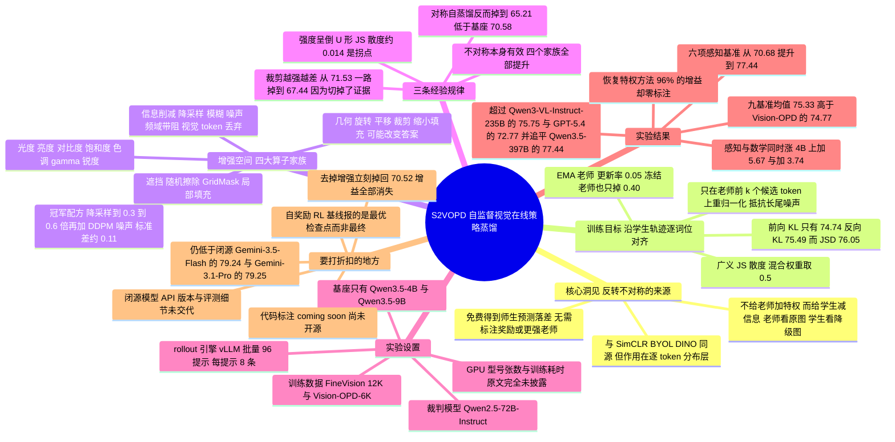

## 一、论文是干什么的？

先把场景说清楚。现在提升一个已经训练好的大模型，主流路线之一叫**在线策略蒸馏**（On-Policy Distillation，简称 OPD）。要理解它，先要理解三个词。

第一个词是**策略**（policy）。在强化学习的语言里，一个会生成文字的模型就是一个策略：给它一个输入，它输出下一个词的概率分布。第二个词是**蒸馏**（distillation），指用一个老师模型的输出概率去教一个学生模型，让学生学会老师的判断，而不只是学会一个孤零零的正确答案。第三个词是**在线策略**（on-policy），意思是训练时喂给学生的句子，是学生自己现场写出来的，而不是从别处抄来的现成语料。这一点很关键：如果拿老师写的完美答案去训练学生，学生真正自己写作时会遇到大量它从没见过的中间状态，出现所谓的训练与推理不匹配；而在线策略蒸馏让学生先自己写（这一步叫 **rollout**，即让模型自由生成一整条回答轨迹），然后老师逐个词位地告诉它「在你自己走到的这一步，我认为下一个词的概率应该长这样」。这样监督信号密集，而且正好落在学生真正会犯错的地方。

问题出在这套机制的前提上。在线策略蒸馏能奏效，靠的是一个叫**师生不对称性**（teacher-student asymmetry）的东西：老师必须掌握学生不掌握的信息或能力，否则老师给出的分布就和学生自己的分布一模一样，两者相减等于零，学生什么也学不到。过去获得这种不对称性只有两条路。第一条路是**换个更大更强的老师**，比如用一个 235B 的模型去教一个 4B 的模型；但当你想提升的恰好是当下最强的模型时，你根本找不到更强的老师。第二条路叫**在线策略自蒸馏**（On-Policy Self-Distillation，OPSD），老师和学生是同一个模型，但给老师偷偷塞点小抄——学术上叫**特权信息**（privileged information），比如标准答案、已经验证过的推理过程、环境反馈，或者在视觉任务里直接告诉老师「答案就在图片的这个框里」（这叫 ground-truth region of interest，真值感兴趣区域）。这条路的麻烦是：小抄需要人来写。模型能力越强，人类能可靠提供的监督就越跟不上，标注成本也越高。

于是本文提出了那个真正的问题：**当手上什么特权信息都没有的时候，有信息量的不对称性还能从哪儿来？**

这篇论文的答案听起来近乎顽皮：**别想着给老师加东西，改成给学生减东西**。老师照常看那张清晰的原图；而学生只能看到同一张图被故意弄糊、缩小、加了噪点之后的版本。两边看到的视觉证据不一样，预测自然就分歧了，不对称性就这么凭空出现了——不需要任何标注、奖励函数、区域框，也不需要另外养一个更大的老师模型。作者把这套方法命名为 **S2VOPD**（Self-Supervised Visual On-Policy Distillation，自监督视觉在线策略蒸馏）。

打个生活里的比方。想象你在训练一个新来的实习生做产品质检。传统做法是请一位二十年经验的老师傅来带（更强的老师），或者你偷偷把标准答案递给老师傅让他照本宣科地纠错（特权信息）。这篇论文的做法是：老师傅和实习生其实是同一个人的两个版本——你让实习生**戴上一副磨砂眼镜**去看零件，而不戴眼镜的那个版本负责给出判断。实习生看得模糊，会犯下「看不清就瞎猜」的典型错误；清晰视角给出的判断则成了纠正的标尺。反复练下来，实习生学会的是「在证据不足的时候也要往正确方向推断」，而这种能力恰好会迁移回清晰视角——这就是为什么最终模型在正常清晰图片上的表现也变强了。

效果相当惊人：在六个细粒度感知基准上，S2VOPD 把 Qwen3.5-4B 的平均准确率从 70.68% 拉到 77.44%，一个 4B 的小模型因此超过了论文对比的开源模型（最高到 235B 的 Qwen3-VL-Instruct），也超过了 GPT-5.4，并且追平了 397B 的 Qwen3.5。不过它并没有登顶：闭源的 Gemini-3.5-Flash 与 Gemini-3.1-Pro 仍然高出约 1.8 分。在训练数据完全对齐的条件下，它拿到了那些使用特权信息的方法所获增益的 96%，而它一个标注都没用。

## 二、核心方法与创新

### 2.1 底座：在线策略蒸馏到底在优化什么

先把在线策略蒸馏的骨架摆出来，后面所有创新都是挂在这根骨架上的。

给定一个图像加问题的数据对 $(x,q)$，设 $\pi_{\theta}$ 是我们要优化的学生策略（$\theta$ 是它的参数），$\pi_{\phi}$ 是老师策略。在线策略蒸馏的做法分三拍：

1. **学生自己生成**。让学生针对这个问题采样 $n$ 条完整回答轨迹 $y^{(1)},\ldots,y^{(n)}$。本文取 $n=8$。
2. **老师逐词位打分**。把学生写出来的每条轨迹拿给老师，在每一个词位 $t$ 上，让老师看着学生自己写出的前缀（记作 $y_{<t}$）给出它心目中的下一词分布。注意老师并不重新写一遍，它只是对学生的路径做「如果是我，这一步我会怎么选」的点评。
3. **拉近两个分布**。让学生的下一词分布向老师的下一词分布靠拢，逐词位、逐条轨迹地求平均。

写成公式就是本文的训练目标：

$$
\mathcal{L}(\theta)=\mathbb{E}_{(x,q)\sim\mathcal{D}}\;\mathbb{E}_{y\sim\pi_{\theta}(\cdot\mid\tilde{x},q)}\left[\frac{1}{|y|}\sum_{t=1}^{|y|}D\Big(\pi_{\phi}\big(\cdot\mid x,q,y_{<t}\big)\;\Big\|\;\pi_{\theta}\big(\cdot\mid\tilde{x},q,y_{<t}\big)\Big)\right]
$$

逐个符号解释：

- $\mathcal{D}$：训练数据集，每个样本是一个图像加问题对。
- $x$：**原始的、干净的图片**，只有老师能看到。
- $\tilde{x}$：**被增强（也就是被故意弄坏）后的图片**，学生只能看到这个。它由 $\tilde{x}=T(x)$ 给出，$T$ 是一个随机的图像变换。
- $q$：文字问题。
- $\pi_{\theta}(\cdot\mid\tilde{x},q)$：学生在「坏图加问题」条件下的策略；$\pi_{\phi}(\cdot\mid x,q,y_{<t})$：老师在「好图加问题加学生已写前缀」条件下的下一词分布。
- $y$：学生采样出来的一整条回答轨迹；$|y|$ 是它的 token 数；$y_{<t}$ 是它前 $t-1$ 个 token 构成的前缀。
- $\frac{1}{|y|}\sum_{t=1}^{|y|}$：对轨迹里每个词位求平均，避免长回答天然获得更大的损失权重。
- $D(\cdot\,\|\,\cdot)$：两个词表分布之间的散度（衡量差异的量），具体选哪个见 2.4 节。
- 外层的两重期望 $\mathbb{E}$：先对数据集取期望，再对**学生自己的策略**取期望。第二重期望是「在线策略」这个词的全部含义所在——比较发生的位置 $y_{<t}$ 是学生自己走到的状态，所以监督恰好打在学生推理时真会遇到的地方。

这里有个容易忽略的细节：老师和学生条件里的图片**不是同一张**（一个是 $x$，一个是 $\tilde{x}$），但前缀 $y_{<t}$ **是同一条**。也就是说，两个模型在完全相同的「已说出的话」这一上下文下，仅仅因为看到的图不同而产生分歧。这个分歧就是全部的学习信号。

### 2.2 核心洞见：把不对称性的方向反过来

这一节是全文的灵魂，值得慢慢讲。

**为什么必须有不对称性？** 假设老师和学生完全一样（同一个模型、同一张图、同一个前缀），那么 $\pi_{\phi}=\pi_{\theta}$，上面那个散度恒等于零，梯度为零，什么都学不到。更糟的是，实际实现里老师是学生的滑动平均，两者略有差别但差别毫无信息量，此时优化目标退化成「让学生更像它自己稍早的版本」，效果是**放大模型原有的自信错误**而不是纠正它。论文的消融实验直接证实了这一点：去掉增强做对称自蒸馏，六项感知基准的均值只有 70.52%，而基座本来就有 70.68%；在算力更省的分析协议下甚至从 70.58% 掉到 65.21%。也就是说，没有不对称性的自蒸馏是**有害**的，不是无效的。

**反直觉的那一点：给学生加难度，等价于给老师开特权。** 这是本文最值得咀嚼的观念转换。传统思路是「老师知道的比学生多」，所以要往老师那边加信息。但多和少是相对的——老师信息量减去学生信息量这个差值，你既可以通过抬高被减数来放大，也可以通过压低减数来放大。老师看清图、学生看糊图，从学生的处境来看，与「学生看清图、老师额外拿到了一份标准答案」在结构上是同一件事：都是老师掌握了学生手里没有的证据。

再回到生活类比。学校里的考试有两种拉开师生差距的办法。第一种是请一位更博学的老师来讲评（换更强的老师），第二种是把答案册递给老师（特权信息）。但还有第三种，几乎没人想到：**不动老师，把学生的考卷印得模糊一点**。学生因为看不清题目里的关键数字而算错，老师拿着清晰的考卷说「这一步你应该这么走」。老师并没有变强，也没有拿到答案，但它相对于学生的优势是真实存在的，而且这种优势**完全免费、可以无限量供应**，因为把图弄糊是一行代码就能做的事，不需要任何人来标注。

这个转换带来三个具体好处。其一，**不需要更强的老师**，所以可以用于提升当前最强的模型。其二，**不需要标注**，所以数据可以无限扩展。其三，**不对称性的形状和大小是可控的旋钮**——你想让学生在什么维度上吃亏（分辨率？颜色？空间关系？局部遮挡？），就选相应的增强算子；你想让差距多大，就调强度。整篇论文的后半部分基本都在研究这个旋钮怎么拧。

作者也诚实地指出了思想来源：这与视觉自监督学习（Self-Supervised Learning）里的经典套路同源。SimCLR、MoCo 这类**对比学习**方法把同一张图的两个不同增强视图的表征拉近；BYOL、SimSiam、DINO 这类师生方法让一个视图去预测另一个增强过的视图，老师往往就是学生的动量平均；半监督学习里的一致性正则更是直接用弱增强的预测去监督强增强的输入。S2VOPD 借了同一个原理（增强本身就是监督的来源），但用途不同：前者是在**表征层面**定义不变性，S2VOPD 是在**生成式的逐 token 分布层面**制造不对称。

顺带一提，视觉增强在视觉语言模型训练里一直用得很少，原因很实在：几何或光度扰动可能改变指令相关的内容（图里的文字、物体身份、空间关系都可能被改坏）。近期的例外是视觉推理强化学习，NoisyRollout 用扰动图片来增加探索多样性，VPPO 和 PRPO 比较同一策略在干净图与扰动图上的分布，用来定位感知关键 token 并重加权策略梯度。但这些方法里两个视图都由**同一个策略**评估，增强只是调节由外部奖励驱动的学习；而 S2VOPD 只给学生做增强，师生分歧本身就是训练信号，不需要奖励也不需要标注。

### 2.3 老师从哪儿来：EMA 动量老师

既然不需要更强的老师，那老师是谁？答案是：学生自己的**指数滑动平均**（Exponential Moving Average，EMA）版本。更新规则是

$$
\phi\leftarrow(1-\eta)\,\phi+\eta\,\theta
$$

其中 $\phi$ 是老师参数，$\theta$ 是学生参数，$\eta$ 是更新率，本文取 $\eta=0.05$（等价于论文表格里说的 teacher decay 等于 0.95）。直观理解：老师是学生的慢速影子，每一步只向学生挪动 5%，因此比学生更平滑、更稳定，不会被单步噪声带跑。

有意思的是，消融实验显示这个 EMA 其实**没那么重要**。把老师直接冻结成初始基座模型（完全不更新），六项感知均值只从 76.35% 掉到 75.95%，仅损失 0.40 个百分点，仍然保留了 93% 的增益。把更新率在 0.95 到 0.999 之间扫一遍，均值波动不超过 0.8 个百分点，而且没有单调趋势。结论很清楚：**性能来自构造出来的视图不对称，而不是来自老师的自我改进**。EMA 只是一个稳定的工程选择。

### 2.4 散度的选择：为什么是 JS 而不是 KL

上面公式里的 $D$ 具体取什么？本文用的是**广义 Jensen-Shannon 散度**（generalized JSD），记作 $D^{\alpha}_{\mathrm{JS}}$。它的定义是先做一个混合分布，再算两侧到混合分布的 KL 散度的加权和：

$$
D^{\alpha}_{\mathrm{JS}}\big(p\,\|\,q\big)=\alpha\,D_{\mathrm{KL}}\big(p\,\|\,m\big)+(1-\alpha)\,D_{\mathrm{KL}}\big(q\,\|\,m\big),\qquad m=\alpha\,p+(1-\alpha)\,q
$$

其中 $p=\pi_{\phi}(\cdot\mid x,q,y_{<t})$ 是老师分布，$q=\pi_{\theta}(\cdot\mid\tilde{x},q,y_{<t})$ 是学生分布，$m$ 是二者的混合分布，$\alpha$ 是混合权重（本文取 $\alpha=0.5$），$D_{\mathrm{KL}}$ 是 Kullback-Leibler 散度。当 $\alpha$ 取 0 或 1 时，它分别退化成前向 KL 和反向 KL；取 0.5 时是对称的中点。广义 JSD 的一个技术优点是：即使两个分布几乎没有重叠，它的值也**有界**，不会像 KL 那样炸到无穷。

为什么中点最好？论文给出了一个很清晰的解释，可以用比喻理解：

- **前向 KL**（$\alpha=0$）过于求覆盖。它要求学生把老师赋予概率的地方全部覆盖到，包括那些**依赖学生根本看不到的细节**才能确定的选项。这就像要求戴着磨砂眼镜的实习生复述出老师看到的每一根划痕，强人所难，只会逼出胡编。
- **反向 KL**（$\alpha=1$）过于求众数。它允许学生只盯住自己最有信心的那个峰值，把老师那些温和的纠正信号统统丢掉。这就像实习生只听老师喊得最大声的那句话，细致的建议全当没听见。
- **JSD**（$\alpha=0.5$）在两者之间：既传递有用的老师信息，又不施加「必须模仿不可见视觉细节」的过度压力。

实测排序是 JSD 优于反向 KL 优于前向 KL，在每一个报告的基准上都成立。六项感知均值分别是 76.05%（JSD）、75.49%（反向 KL）、74.74%（前向 KL）。（提醒一下：这里 JSD 那一行是 76.05%，而组件消融表里同为默认配置的完整方法记的是 76.35%，两张表在原文中就没对齐，本综述照原样引用。）

还有一个稳定性技巧：两个分布都**只在老师的前 $k$ 个候选 token 上计算并重新归一化**。词表动辄十几万，长尾部分全是噪声，截断到老师认为最可能的那一小撮再比较，能大幅稳定优化。（论文未披露 $k$ 的具体取值；它与后文数学基准解码时用的 top-$k$ 等于 20 不是同一个参数。）

### 2.5 增强空间：四大算子家族的形式化

方法讲完了，真正的研究工作才开始：**怎么造这个不对称？** 作者做了据他们所知第一次针对在线策略蒸馏的、受控的大规模增强空间搜索。

变换 $T$ 由三部分指定：一组原子算子（各带施加概率与强度区间）、一个组合策略、一个决定到底要不要做增强的全局概率。作者按「如何改变学生可获得的视觉信息」把算子分成四个家族：

| 家族 | 直觉 | 代表算子 | 论文给出的强度范围 |
|---|---|---|---|
| **信息削减** | 保持空间布局不变，减少可用视觉信息 | 降采样，且不放大回原尺寸，因此视觉 token 数也变少 | 缩放系数 $s\sim\mathcal{U}(0.3,0.6)$，另试过 0.4 到 0.7、0.25 到 0.5 |
| | | 降采样三档随机 | 每样本从 0.2 到 0.35、0.35 到 0.5、0.5 到 0.75 三个区间之一抽取 |
| | | 高斯模糊，即软低通 | 半径 $\mathcal{U}(0.5,1.5)$、$(1.5,3.0)$、$(3.0,6.0)$ |
| | | 频域带阻，挖掉二维频谱的一个环带 | 内半径 0.15 到 0.35，带宽 0.15 到 0.3 |
| | | 高斯噪声，加性，降低信噪比 | DDPM 第 200 步，$\sigma\approx0.11$，施加概率 0.5 |
| | | 局部马赛克 | 施加概率 0.4 |
| | | 视觉 token 丢弃，保留者的分辨率与位置不变 | 丢 15% / 30% / 50% |
| **几何** | 改变空间组织 | 旋转 | $\pm 35^{\circ}$ |
| | | 平移 | 最多边长的 15% |
| | | 裁剪 | 最小尺度 0.7 / 0.5 / 0.3 |
| | | 缩小填充，把场景缩到带边框的画布上 | 尺度 $\mathcal{U}(0.4,0.8)$ |
| **光度** | 改外观，不动几何与内容 | 颜色抖动，亮度与对比度与饱和度各以 0.8 概率施加 | 0.5 到 1.5 / 0.5 到 1.8 / 0.2 到 1.8 |
| | | 重度光度，色调与 gamma 与锐度各以 0.5 概率施加 | 色调 $\pm 0.15$；gamma 0.6 到 1.6；锐度 0.2 到 2.5 |
| **遮挡** | 删掉局部区域，其余不动 | 随机擦除，灰色填充或噪声填充 | 不超过 3 块，面积占比 5% 到 30% |
| | | GridMask，规则栅格遮挡，灰色填充 | 格子周期 0.1 到 0.3，保留比 0.5 到 0.7 |

上表照抄的是论文 Table 1，它并没有把正文提到的每个算子都列进去：光度家族的正文里还提到直方图均衡化，遮挡家族还提到「填充式裁剪」（filled crops），这两个 Table 1 没给强度范围。

四个家族的区别值得多说一句。信息削减和遮挡都是减少信息，但前者是**全局均匀**的（整张图都变糊），后者是**空间局部**的（某几块彻底没了，其余完好）。几何家族是唯一可能**改变正确答案**的家族——把物体挪了位置，「杯子在桌子左边还是右边」这个问题的答案就变了。光度家族最温和，物体边界和空间关系完全保留。

采样过程的形式化：设候选算子集合为 $\mathcal{A}=\{A_{1},\ldots,A_{M}\}$，算子 $A_{j}$ 带有施加概率 $\rho_{j}$ 和强度 $\lambda_{j}\sim P_{j}$。先抽一个全局增强指示变量

$$
z\sim\operatorname{Bernoulli}(p)
$$

$p$ 控制有多大比例的学生视图会被增强。若 $z=0$，学生拿到原图，即 $T(x)=x$；若 $z=1$，则各算子独立抽取自己的开关

$$
b_{j}\sim\operatorname{Bernoulli}(\rho_{j}),\qquad j=1,\ldots,M
$$

然后按固定顺序复合被选中的算子：

$$
T(x)=\begin{cases}x,& z=0,\\[4pt] \big(A_{M}^{b_{M}}(\,\cdot\,;\lambda_{M})\circ\cdots\circ A_{1}^{b_{1}}(\,\cdot\,;\lambda_{1})\big)(x),& z=1,\end{cases}
$$

其中 $A_{j}^{0}$ 表示恒等映射（不做这个算子），$A_{j}^{1}$ 表示真的施加。这一套记号的价值在于：它把家族、强度、单算子概率、复合方式、以及保留原图的比例 $1-p$ 这五个旋钮统一到一个可系统扫描的参数化里。全程只对学生视图做增强，老师永远看原图。

### 2.6 冠军配方：降采样加高斯噪声

扫完整个空间之后，最强的配置简单到有点扫兴：**信息削减家族里的两个算子复合，先降采样，再加高斯噪声**。全局概率取 $p=1$，也就是每一个学生视图都要被增强：

$$
T(x)=A_{\mathrm{noise}}\big(A_{\mathrm{down}}(x;s);\lambda_{\mathrm{noise}}\big),\qquad s\sim\mathcal{U}(0.3,0.6)
$$

细节有三个值得注意：

1. $A_{\mathrm{down}}$ **降采样之后不放大回原分辨率**。这意味着学生输入的视觉 token 数量真的变少了，不只是画质变差，而是信息通道本身变窄。
2. 噪声以 $\rho_{\mathrm{noise}}=0.5$ 的概率独立施加，形式是一个 DDPM 前向步 $x\mapsto\sqrt{\bar{\alpha}_{t}}\,x+\sqrt{1-\bar{\alpha}_{t}}\,\varepsilon$，取 $t=200$，等价于标准差约 0.11 的加性高斯噪声，且对原信号的衰减可以忽略。
3. **附带的工程红利**：学生输入分辨率更低，rollout 和学生前向传播的开销都下降了。也就是说这个方法不但不花钱买监督，还顺手省了算力。

### 2.7 算法流程

把所有零件串起来，一步训练迭代长这样：

1. 从数据集采一批图像加问题对，本文批量为 96 个 prompt。
2. 对每个样本抽一个随机变换 $T$，生成学生视图 $\tilde{x}=T(x)$（默认配方：降采样到 0.3 到 0.6 倍，再以 0.5 概率加噪）。
3. 用 vLLM 作为推理引擎，让学生在 $\tilde{x}$ 上采样 $n=8$ 条 rollout，每条最长 1024 token。
4. 把这些 rollout 的前缀原封不动喂给 EMA 老师，但老师条件在**原图** $x$ 上，逐词位取出老师的下一词分布。
5. 只保留老师的前 $k$ 个候选 token 并重归一化，学生侧同样处理。
6. 计算逐词位的 $D^{\alpha}_{\mathrm{JS}}$，对轨迹长度取平均，得到损失。
7. 反向传播更新学生参数 $\theta$，学习率 $2\times10^{-6}$。
8. 用 $\phi\leftarrow(1-\eta)\phi+\eta\theta$ 更新老师，$\eta=0.05$。
9. 回到第 1 步。全程没有奖励函数、没有价值网络、没有对参考模型的 KL 惩罚项，那个散度就是全部的训练信号。

### 2.8 消融告诉我们哪个设计真正起作用

作者用一整节（4.3）加一节消融（4.4）来回答「到底什么在起作用」。这部分的分析实验为了省算力，评测时生成预算从 4096 token 降到 2048 token，所以绝对数值比主表略低，但**组内互相可比**。

**发现一：不对称本身就是关键，四个家族全都有效。** 在这个分析协议下，基座模型 70.58%；把 $T$ 设为恒等映射做对称自蒸馏，掉到 65.21%（比基座还差）；而四个家族单独使用分别达到信息削减 75.65%、光度 74.40%、几何 74.30%、遮挡 72.44%。换句话说，**任何一种**制造不对称的方式都远好于不制造不对称。这是全文最有力的证据：起作用的不是某个精巧算子，而是「有落差」这件事本身。

**发现二：强度是倒 U 形，中等最好。** 所有家族都表现出先升后降。作者用一个巧妙的量来横向比较不同增强：**师生预测落差**，定义为训练前十步里师生分布之间的逐 token JS 散度均值。这个量和各增强的强度参数吻合得很好（重度模糊确实比轻度模糊造成更大的落差）。具体数字：分辨率削减在 0.3 到 0.6 区间取得 75.65% 的峰值，更弱和更强的设置分别是 75.25% 和 75.05%；模糊从 74.20% 升到 75.71% 再回落到 75.07%；视觉 token 丢弃从 72.55% 升到 73.96% 再回落到 73.72%。把准确率对落差作图，规律是：落差增大时性能上升，到 JS 散度约 0.014 处见顶，此后下降。

**发现三：落差大不等于落差好，增强必须保住与问题相关的证据。** 裁剪是反面教材。和信息削减类不同，裁剪的性能随强度**单调下降**：轻、中、重三档分别是 71.53%、68.76%、67.44%。最强的裁剪造出了整个研究里最大的师生落差，却只拿到 67.44%，仅略高于不做增强的自蒸馏。更说明问题的是，即使是最温和的裁剪设置（它造成的落差恰好和最优的分辨率、模糊配置相当）也要低它们 3 个百分点以上。退化在那些答案依赖局部或全局视觉证据的基准上尤其明显：从中度裁剪到重度裁剪，V\*Bench 掉 2.1%、HR-Bench 8K 掉 2.4%、MME-RealWorld 掉 2.1%。原因很直白：裁剪可能把回答问题所需的证据整块切掉，此时学生的输入已经**变得无法回答**，师生分歧大是因为题目被毁了，而不是因为学生能力不足，这样的落差提供不了有用的学习信号。

用类比说：磨砂眼镜（信息削减）让实习生看得模糊但整个零件还在视野里，他还有得练；而裁剪相当于**直接把零件的一半藏起来**，实习生不是看不清而是没得看，此时老师的纠正就成了不可能完成的任务，练不出任何东西。

**发现四：去掉增强，一切归零；换掉 EMA，几乎无损。** 正式配置下的组件消融（论文 Table 4，S2VOPD-4B，六项感知均值）非常干净：完整方法 76.35%；去掉学生视图增强（让学生看和老师一样的干净图）掉到 70.52%，基本等于基座的 70.68%，增益全部消失；把老师冻结在基座（保留增强但不做 EMA）只掉到 75.95%，损失 0.40 个百分点。这两个数字合在一起构成了全文最锋利的一刀：**增益的来源是构造出来的不对称，不是老师的自我进化。**

## 三、使用了哪些模型和计算资源？

| 条目 | 内容 |
|---|---|
| 主实验用的基座模型 | Qwen3.5-4B 与 Qwen3.5-9B。全文所有训练实验都只在这两个规模上做，二者同属 Qwen3.5 一个模型家族。**需要特别澄清一个常见误读**：摘要里「all four augmentation families improve performance」（四个家族全都提升性能）说的是四类**增强算子**家族，即信息削减、几何、光度、遮挡，见 2.5 节；它与「测试了四个模型家族」毫无关系。论文从未在四个模型家族上做过实验 |
| 对比的 baseline 模型 | 开源模型：MiniCPM-V-4.5、Qwen2.5-VL-7B、MiMo-VL-RL-7B、Qwen3-VL-4B、Thyme-7B、DeepEyes-7B、DeepEyesV2-7B、Qwen3-VL-Instruct-8B 与 235B、GLM-4.5V、GLM-4.6V-106B、Kimi-K2.5 与 K2.6（1T）、SenseNova-MARS-8B、Qwen3.5-397B。闭源模型：GPT-5.1、GPT-5.2、GPT-5.4、Gemini-3-Flash、Gemini-3.5-Flash、Gemini-3.1-Pro。方法类 baseline：对称自蒸馏（论文里记作 w/o Aug.）、特权信息方法 ZwZ 与 Vision-OPD 与 Opsd、自奖励强化学习方法 TTRL 与 Intuitor 与 RENT |
| 评测或打分用的模型 | Qwen2.5-72B-Instruct 作为 LLM 裁判。流程是先抽取最终答案做近似精确匹配，只有规则判不了的样例才交给裁判模型裁定 |
| 训练硬件 | **原文未披露。** 全文没有 GPU 型号、张数、显存的任何说明；4.3 节仅提到「受算力限制」而把分析实验的生成预算从 4096 降到 2048 token |
| 推理或评测硬件 | **原文未披露。** 只说明 rollout 用 [vLLM](https://github.com/vllm-project/vllm) 作为推理引擎 |
| 是否用商业 API | 原文把 GPT-5.1 与 5.2 与 5.4、Gemini-3-Flash 与 3.5-Flash 与 3.1-Pro 列为闭源对比对象，这类模型通常只能通过商业 API 评测，但**原文未说明**具体提供方端点、模型快照版本或调用方式 |
| 单个完整计算单位的耗时 | **原文未披露任何 GPU 小时或墙钟时间。** 以下规模数字是**本综述根据论文公开超参自行推算的，论文本身并未给出**：一次完整训练是 65 步（Vision-OPD-6K，6K 样本一个 epoch）或 130 步（FineVision 12K），批量 96 个 prompt、每 prompt 8 条 rollout，于是 $65\times96\times8=49{,}920$、$130\times96\times8=99{,}840$，即约 4.99 万条或 9.98 万条 rollout，每条最长 1024 token。评测侧：六项感知基准用贪心解码、上限 4096 token；三项数学基准用 24576 token 预算、温度 0.3、top-p 0.95、前 20 个候选 token、存在惩罚 1.5。自奖励强化学习 baseline 每 5 步存一次 checkpoint，共 13 个 |
| 金钱成本 | **原文未披露**，没有报告 API 费用或训练成本 |
| 代码是否开源 | **截至综述撰写时尚未开源。** 项目主页 [S2VOPD project page](https://williamium3000.github.io/s2vopd/) 上的 Code 按钮是禁用状态并标注 coming soon；对应仓库 [williamium3000/s2vopd](https://github.com/williamium3000/s2vopd) 目前只托管项目主页本身，star 数为 0，未见训练代码或模型权重 |

补充说明训练配置（这些原文都给全了）：所有实验使用同一套配置——批量 96 个 prompt，每 prompt $n=8$ 条 rollout，学习率 $2\times10^{-6}$，10 步 warmup，65 步或 130 步优化器步（分别对应 6K 与 12K 训练样本各跑一个 epoch），老师 EMA 更新率 $\eta=0.05$，最大 prompt 长度 8192 token、最大回复长度 1024 token。

训练数据有两套：主表用的是从 [FineVision](https://huggingface.co/datasets/HuggingFaceM4/FineVision) 自然图像域采样的 12K 个问题；为了和前人方法公平对比，另外用了 Vision-OPD-6K，这个数据集自带真值区域标注，但那些标注**只提供给 Vision-OPD 使用**，S2VOPD 从头到尾没用过。

## 四、实验结果

### 主结果：4B 打赢 235B

第一张主表是在 FineVision 12K 上训练（零标注），在六个细粒度感知基准上评测。这六个基准分别是 V\*Bench（在高分辨率图里找小目标）、ZoomBench、HR-Bench 4K 与 8K（高分辨率图像理解）、MME-RealWorld 及其中文子集。

| 模型 | 规模 | V\* | Zoom | HR-4K | HR-8K | MME-RW | MME-RW-CN | 六项均值 |
|---|---|---|---|---|---|---|---|---|
| Qwen3.5，本文基座 | 4B | 84.29 | 47.69 | 84.38 | 80.13 | 63.86 | 63.70 | **70.68** |
| **S2VOPD，本文** | 4B | 91.48 | 55.98 | 86.38 | 82.00 | 76.13 | 72.66 | **77.44** |
| Qwen3-VL-Instruct | 235B | 91.10 | 56.09 | 86.13 | 80.38 | 71.74 | 69.04 | 75.75 |
| Qwen3.5 | 397B | 87.96 | 57.16 | 89.38 | 85.50 | 74.82 | 69.82 | 77.44 |
| GPT-5.4 | 未公布 | 76.96 | 52.66 | 84.00 | 77.88 | 74.20 | 70.93 | 72.77 |
| Gemini-3-Flash | 未公布 | 86.39 | 59.29 | 87.88 | 85.00 | 74.86 | 72.62 | 77.67 |
| Gemini-3.5-Flash | 未公布 | 89.01 | 61.42 | 89.12 | 86.62 | 75.31 | 73.97 | 79.24 |
| Gemini-3.1-Pro | 未公布 | 87.96 | 61.18 | 89.63 | 86.88 | 76.53 | 73.31 | 79.25 |
| Vision-OPD，用真值区域 | 4B | 92.15 | 59.76 | 84.50 | 80.38 | 74.88 | 70.76 | 77.07 |
| ZwZ，用真值区域，基座为 Qwen3-VL-4B | 4B | 92.67 | 55.74 | 81.75 | 79.50 | 68.52 | 68.09 | 74.38 |
| Opsd，用标准答案 | 4B | 81.68 | 52.54 | 81.25 | 77.75 | 71.91 | 71.96 | 72.85 |

大白话版本：**同一个 4B 模型，用一堆不需要标注的糊图训练一遍，六项感知平均分涨了 6.76 个百分点**，从此超过了表里除 397B 以外的全部开源模型（含 235B 的 Qwen3-VL-Instruct，领先 1.69 分）、追平了 397B 的 Qwen3.5（两者都是 77.44）、超过了整个 GPT-5 系列。**但它没有登顶**：论文说它与 Gemini-3-Flash「on par」（打成平手），严格看 77.44 仍比 Gemini-3-Flash 的 77.67 低 0.23 分；比 Gemini-3.5-Flash 的 79.24 低 1.80 分，比 Gemini-3.1-Pro 的 79.25 低 1.81 分。换句话说，这个 4B 模型追上了开源阵营的顶端和 GPT-5 系列，但闭源最强的两个 Gemini 仍在它上面。它还超过了所有用了特权信息的方法（Vision-OPD 77.07、ZwZ 74.38、Opsd 72.85）。涨幅最大的两项是 MME-RealWorld（63.86 到 76.13，加 12.27）和它的中文子集（63.70 到 72.66，加 8.96）。

### 公平对比：同数据、同配置、九个基准

上一张表里 S2VOPD 用的训练数据和别人不一样，所以作者又在 Vision-OPD-6K 上重跑了所有方法，65 步、同配置、同评测协议，并加上三个数学推理基准（MathVista、MathVerse、MathVision）来看副作用。

| 方法，4B 规模 | 是否用特权信息 | 六项感知均值 | 三项数学均值 | 九基准总均值 |
|---|---|---|---|---|
| 基座 Qwen3.5-4B | 否 | 70.68 | 69.54 | 70.30 |
| ZwZ，基座是 Qwen3-VL-4B 而非 Qwen3.5-4B | 是，真值区域 | 74.38 | 54.82 | 67.86 |
| Opsd | 是，标准答案 | 75.81 | 64.96 | 72.19 |
| Vision-OPD | 是，真值区域 | 76.56 | 71.19 | 74.77 |
| Intuitor | 否，自奖励 RL | 69.27 | 73.00 | 70.51 |
| RENT | 否，自奖励 RL | 69.27 | 73.28 | 70.61 |
| TTRL | 否，自奖励 RL | 73.65 | 72.60 | 73.30 |
| **S2VOPD，本文** | **否** | **76.35** | **73.28** | **75.33** |

除 ZwZ 一行外，其余方法都以 Qwen3.5-4B 为基座、在 Vision-OPD-6K 上训练 65 步。表中「六项感知均值」与「三项数学均值」两列是本综述用论文逐基准数字算出来的，最右列九基准总均值是论文原文给出的 Avg；本综述对全部 16 行（4B 与 9B 各 8 行）重算了九基准均值，与原文 Avg 列在四舍五入范围内完全一致。

在 9B 规模上，S2VOPD 的九基准均值是 76.35，仅次于 Vision-OPD 的 76.56，是所有无特权信息方法里的第一名（比最强的自奖励 baseline，即 Intuitor 的 75.65，高 0.70）；在 4B 规模上它以 75.33 的九基准均值超过包括 Vision-OPD 在内的**全部**方法。（提醒别看错：76.35 这个数字在本文里出现两次，一次是 9B 的九基准均值，一次是 4B 的六项感知均值，纯属巧合。）

这张表还揭示了一个此前不太被强调的现象：**特权信息方法会伤害推理能力**。Opsd 在 4B 上把 MathVision 拉低了 9.3 个百分点、9B 上低 7.9 个百分点；ZwZ 更极端，在 4B 上把 MathVerse 从 67.56 砸到 40.48，掉了 27.1 个百分点。作者的解释是这些方法训练在感知导向的数据上，把模型的行为过度拉向感知。反过来，自奖励强化学习方法（TTRL、Intuitor、RENT）普遍改善数学推理，可能因为 GRPO 诱导出更长、更审慎的回答，但它们的感知涨幅有限。S2VOPD 是两边同时涨的：4B 上感知加 5.67、数学加 3.74；9B 上分别加 3.57 和加 3.19。这里要替论文补一句准确的话——**它并不是表里唯一两边都涨的方法**：本综述逐行重算后发现，4B 上 Vision-OPD（感知加 5.89、数学加 1.65）和 TTRL（加 2.97、加 3.06）也都两边为正。论文原文并没有声称唯一性，它的说法是 S2VOPD「achieves the best of both」，即感知接近最强、数学与最强并列，从而拿到无特权信息方法里最高的九基准总均值。

那个 96% 是这么来的：在同数据条件下，最强的特权方法 Vision-OPD 把六项感知均值从 70.68 抬到 76.56（加 5.89），S2VOPD 抬到 76.35（加 5.67），$5.67/5.89\approx96\%$。

### 消融与超参

| 实验 | 配置 | 六项感知均值 |
|---|---|---|
| 组件消融 | 完整 S2VOPD | 76.35 |
| 组件消融 | 去掉增强，即对称自蒸馏 | 70.52 |
| 组件消融 | 去掉 EMA，老师冻结在基座 | 75.95 |
| 老师更新率 | decay 取 0.95 | 76.35 |
| 老师更新率 | decay 取 0.99 | 75.56 |
| 老师更新率 | decay 取 0.999 | 76.00 |
| 散度 | $\alpha=0.0$，前向 KL | 74.74 |
| 散度 | $\alpha=0.5$，即 JSD | 76.05 |
| 散度 | $\alpha=1.0$，反向 KL | 75.49 |

增强家族与强度的分析结果（2048 token 分析协议，仅组内可比）：基座 70.58、对称自蒸馏 65.21、信息削减 75.65、光度 74.40、几何 74.30、遮挡 72.44；裁剪三档从 71.53 到 68.76 再到 67.44，单调下滑。

### 这些数字该怎么读，哪里要打折扣

几条必要的提醒：

1. **两张主表的绝对数值不能混着比。** 主表用 12K FineVision 训练 130 步、评测生成上限 4096 token，得到 77.44；公平对比表用 6K Vision-OPD 训练 65 步，同样 4096 token，六项感知得到 76.35；4.3 节的分析实验只用 2048 token 预算，基座就只有 70.58 而不是 70.68。**跨协议引用数字很容易得出错误结论。**
2. **成绩有天花板，别读成「4B 全面登顶」。** 77.44 仍低于 Gemini-3.5-Flash 的 79.24 与 Gemini-3.1-Pro 的 79.25，也略低于 Gemini-3-Flash 的 77.67。论文摘要只说超过对比的开源模型和 GPT-5.4，没有声称超过全部闭源模型。
3. **4B 超过 235B 这个说法，是在特定 6 个感知基准上的均值。** 这六个基准全部围绕高分辨率与细粒度视觉感知，恰好是 S2VOPD 的训练信号最对症的能力维度。这不代表 4B 模型在通用能力上追平了大模型，论文本身也只声称感知与数学两块有提升。
4. **闭源模型的数字来源不明。** GPT-5.x 与 Gemini-3.x 的评测细节（API 版本、快照日期、思考预算、是否开启工具）原文没有交代，闭源模型的分数随时间漂移是常态，这几行的可复现性最弱。
5. **自奖励 RL baseline 的比较方式需要注意。** 论文说这三个方法训练严重不稳定、最终会崩溃，有的退化到接近随机水平，所以给它们报的是 13 个 checkpoint 里的**最好**成绩，而 S2VOPD 报的是**最后**一个 checkpoint。作者称这是保守地偏向 baseline，这个处理合理且透明；但反过来说，这也意味着这三个 baseline 的数字并不是同一种意义上的「训练完成后的结果」。
6. **只有单一模型家族。** 所有训练实验都在 Qwen3.5 系列（4B 和 9B）上做，没有跨架构验证（比如 InternVL 或 Gemma 系视觉模型）。方法是否与具体模型家族无关，还需要更多证据。
7. **没有独立的局限性章节，也没有失败案例分析。** 论文正文没有 Limitations 一节，对增强超参需要多少搜索成本、方法在纯文本任务或视频上是否适用、以及那 $k$ 值取多少等问题都没有交代。
8. **代码尚未放出。** 复现依赖作者后续开源，目前无法独立验证。

## 五、潜在应用与已落地应用

**作者明确提到的。** 论文的定位很清楚：这是一条**无标注提升视觉语言模型感知能力**的通用路径。结论一节的原话大意是，有用的监督不必来自增加外部标签，而可以来自「小心控制学生被允许看到什么」。作者还明确指出一个可控性：更换增强算子可以把学到的能力**偏向局部感知或整体感知**，而降采样加噪声是最稳健的默认配方。此外作者点出了一个直接的工程好处，即学生输入分辨率更低，rollout 和前向传播都更便宜。

**合理推演的潜在方向**（以下是本综述的推演，不是论文的主张）：

- **端侧小模型的能力压缩。** 既然 4B 模型能在感知基准上追上百倍参数的模型，这套流程对「想在手机或边缘设备上跑一个够用的视觉模型」的场景很有吸引力，而且不需要采购标注。
- **迁移到其他模态的减信息不对称。** 同样的原理原则上可以移到音频（给学生降码率或加背景噪声）、视频（给学生降帧率或抽帧）、文档理解（给学生降 DPI）。论文只验证了静态图像。
- **超越人类监督上限的自我提升。** 论文动机里那句「模型能力超过人类可靠提供的监督」，指向的是前沿模型的自提升问题：当没有更强的老师、也没人能写出标准答案时，给自己降级也许是仍然可用的少数抓手之一。
- **和自奖励 RL 的组合。** 论文的表格显示两类方法的强项互补，一边补感知、一边补推理，把师生视图不对称与内在奖励信号结合是很自然的下一步。
- **增强强度的自适应调度。** 既然性能对师生落差是倒 U 形、拐点在 JS 散度约 0.014，那么训练中在线测量落差并自动调节增强强度（类似课程学习）是显而易见的改进方向；论文用的是固定分布。

**已知的实际落地或被采用情况。** 截至综述撰写时未见公开落地案例。代码与模型权重都还没放出（项目页 Code 按钮标为 coming soon），Hugging Face 论文页显示引用该论文的模型、数据集、Space 数量均为 0，只被 4 个用户收藏夹（VisionLM、Vision、cv gen、Distillation）收录。

## 六、网络上的讨论与评价

**Hugging Face 论文页。** [huggingface.co/papers/2608.14144](https://huggingface.co/papers/2608.14144) 显示 167 票，被标为当日第 2 名论文（#2 Paper of the day），由第一作者 Yijiang Li（HF 账号 williamium）于 2026-08-17 提交，页面归属机构显示为 University of California at San Diego。评论区目前只有三个讨论线程、共四条留言，且都不是实质性技术讨论：

1. 第一作者本人贴了一遍论文摘要，获得 1 个红心表情。
2. 一位用户 ootrootr2010 发了一条阿拉伯语留言，随后又给自己的这条留言回了一条一模一样的内容（这就是四条留言里多出来的那一条），内容是请求「制作一个给儿童的 5 分钟数字教学视频」，与本文完全无关，属于误投或垃圾留言。
3. 自动化机器人 librarian-bot 贴出了 Semantic Scholar 推荐的 7 篇相似论文：[RP-OPSD: Resolution-Privileged On-Policy Self-Distillation for Multimodal Large Language Models](https://huggingface.co/papers/2607.24447)、[Visual Contrastive Self-Distillation](https://huggingface.co/papers/2607.21556)、[On-Policy Self-Distillation without Any Supervision](https://huggingface.co/papers/2608.06296)、[V-Zero: Answer-Label-Free On-Policy Distillation with Contrastive Evidence Gating for Fine-Grained Visual Reasoning](https://huggingface.co/papers/2606.25319)、[OPD-V: Visual On-Policy Self-Distillation with Modality Balance](https://huggingface.co/papers/2608.05131)、[Perception Before Supervision: Self-Contained Visual Distillation from Counterfactual Blind Spots](https://huggingface.co/papers/2608.09931)、[VAD: Attributing Visual Evidence for Target Reconstruction in Multimodal On-Policy Distillation](https://huggingface.co/papers/2607.28590)。这份清单本身有参考价值：它说明 2026 年中「无特权信息的视觉在线策略自蒸馏」正在成为一个拥挤的赛道，其中 RP-OPSD 的标题（分辨率特权自蒸馏）与本文思路高度接近，值得关心该方向的读者交叉阅读。

**GitHub。** 官方仓库 [williamium3000/s2vopd](https://github.com/williamium3000/s2vopd) 创建于 2026-08-13，最后推送 2026-08-18，star 数 0、fork 数 0、open issue 数 0，内容目前只是项目主页。没有代码、没有 issue、没有 discussion。

**alphaXiv。** 论文在 [alphaXiv 页面](https://www.alphaxiv.org/abs/2608.14144) 上有条目，抓取时页面显示 369 次浏览、45 个点赞（页面上那个数字挂在一个 thumbs-up 图标上，是点赞计数，不是评论计数——旁边的 Comments 入口本身并不显示任何数字）。评论正文没有被渲染进抓取到的静态内容里，我无法读取也无法核实其中说了什么，因此这里**不引用任何具体观点**。

**其他渠道：未检索到实质性讨论。** 我用四组关键词做了搜索，分别是英文方法名加全称、「S2VOPD asymmetry for free on-policy distillation Qwen3.5-4B discussion reddit twitter」、中文「视觉 on-policy 蒸馏 学生 降采样 不对称 S2VOPD 知乎」，以及排除 arXiv 与 Hugging Face 与 alphaXiv 域名后的编号加方法名检索，覆盖 X/Twitter、Reddit 的 r/MachineLearning 与 r/LocalLLaMA、Hacker News、知乎、Papers with Code、GitHub issues 等目标站点。除了论文本体的镜像页（arXiv HTML、ResearchGate、OpenTrain AI 等自动聚合站）之外，**截至 2026-08-22 未检索到任何署名的实质性公开讨论、评测复现或质疑声音**。中文侧的命中全是论文本体页面或泛论 On-Policy Distillation 这个大方向的内容，没有针对本文的分析。核查时另做了两项独立验证：一是英文检索会带出两个 on-policy 蒸馏方向的 awesome 清单仓库（`nick7nlp/Awesome-LLM-On-Policy-Distillation` 与 `chrisliu298/awesome-on-policy-distillation`），但逐字检查它们的 README 后确认**两份清单目前都还没有收录本文**，那只是搜索引擎的主题匹配；二是没有检索到任何第三方复现仓库或评测报告。

**一点主观判断。** 167 票、当日第 2，说明这个「反转不对称方向」的点子在社区里很吸引眼球，它简单、直觉上有趣、而且省钱。但目前的热度基本停留在摘要级别的认可，还没有第三方复现、没有代码、没有独立评测。考虑到闭源模型对比数字缺少细节、所有训练实验只在 Qwen3.5 一个家族上完成，而且最终成绩仍在两个最强 Gemini 之下（即这条路子并没有把 4B 送到绝对最前沿），谨慎的读者应当把当前的结论视为**有说服力但待验证**。

## 七、思维导图

