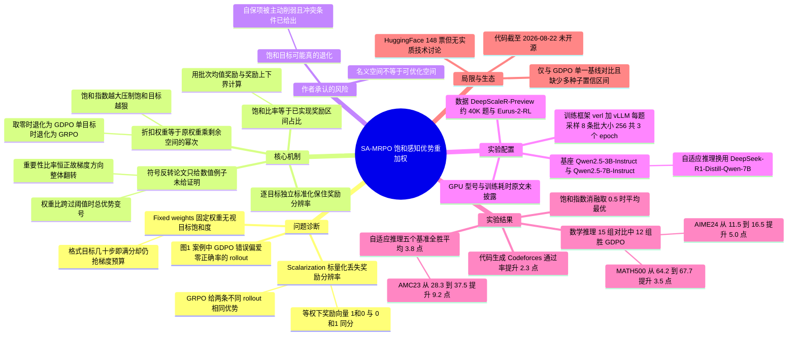

## 一、论文是干什么的？

现在训练一个会做数学题、会写代码的大语言模型，最后一道工序几乎都是**强化学习**（Reinforcement Learning，简称 RL）。具体做法叫 **RLVR**（Reinforcement Learning with Verifiable Rewards，可验证奖励强化学习）：给模型一道有标准答案的题，让它自己写一遍解答，然后用一段程序去检查答案对不对，对了给正分、错了给零分，再用这个分数去推动模型参数往「更容易答对」的方向走。这里最流行的算法是 **GRPO**（Group Relative Policy Optimization，组相对策略优化），也就是 DeepSeek-R1 用的那一套。GRPO 的巧妙之处在于：它不去额外训练一个「价值网络」来预测这道题该得多少分，而是对同一道题一次采样好几个不同的解答（论文里叫 **rollout**，即模型自己生成的一条完整回答），把这一小组解答的平均分当作基准线，谁比组内平均分高就是「优势为正」，往这个方向学；谁比平均分低就是「优势为负」，往反方向躲。这个「比自己的同组同学考得好还是差」的分数，就叫**优势**（advantage）。

问题出在：现实里我们几乎从不只关心一件事。我们希望模型**答案正确**，同时希望它**别啰嗦**（长度约束），同时希望它**按规定格式输出**（比如把思考过程包在指定标签里），写代码时还希望它**至少能跑通不报错**。这就是**多奖励**（multi-reward）设定：一次训练里同时有好几个打分器。业界的标准做法非常朴素——先把这几个分数按事先定好的权重加成一个总分，再拿这个总分去做组内标准化。听起来天经地义，但作者指出这里有两个根本性的毛病。

第一个毛病叫「**奖励分辨率丢失**」。把向量压成一个标量，本来不一样的东西就变成一样的了。举个论文里的原话例子：两个目标等权重时，奖励向量 $(1,0)$ 和 $(0,1)$ 加起来都等于 1。一条回答是「答案对了但格式乱」，另一条是「格式漂亮但答案错了」，在总分眼里它们一模一样，于是 GRPO 给它们完全相同的优势值。这就像一所学校只看总分排名：一个学生数学 100 语文 0，另一个数学 0 语文 100，总分都是 100，老师于是给两人完全一样的评价和一样的补课安排——显然荒谬。

第二个毛病更隐蔽，叫「**固定权重无视目标饱和度**」。「格式正确」这种目标通常训练几十步就学会了，正确率飙到 99% 以上，几乎再没有可提升的空间了——论文把这种状态叫**饱和**（saturation）。但因为权重是训练开始前写死的常数，这个已经做满分的目标在整个训练过程中依然按原比例抢占梯度。作者用了一个很到位的说法：训练在持续把**梯度预算**（gradient budget，可以理解为「模型每一步能学的东西总量是有限的」）花在已经解决的问题上。这好比一个学生期末复习，语文已经稳定 148 分了，数学还在 60 分挣扎，但他的复习计划表还是死板地写着「语文两小时、数学两小时」。任何一个正常的家教都会说：语文别练了，把时间挪给数学。这篇论文做的事，本质上就是给强化学习装上这个「正常家教的常识」。

作者提出的方法叫 **SA-MRPO**（Saturation Aware Advantage Reweighting for Multi-Reward Policy Optimization，面向多奖励策略优化的饱和感知优势重加权）。它做两件事：第一，**不再先加总**，而是让每个奖励目标各自在组内做标准化，保住奖励向量的分辨率（这一步其实是沿用了此前 GDPO 的思路）；第二，也是本文的真正新东西，**按每个目标当前的饱和程度自动给它的贡献打折**——一个目标离它的上限越近，它在优势里的话语权就越小。折扣的强弱由一个标量超参数 $\gamma$ 控制，$\gamma=0$ 就退化成 GDPO，单目标时进一步退化成原版 GRPO。作者还强调了一个容易被低估的结论：这种重加权**不只是把更新幅度缩小或放大，它能直接把一条 rollout 的总优势正负号翻过来**，也就是把「鼓励这么写」变成「别这么写」。

在实验上，数学推理的两目标和三目标组合里，SA-MRPO 在 15 组基准对比中有 12 组把更难的正确率目标做得比 GDPO 好，AIME24 上最多领先 5.0 个百分点；在一个刻意构造出「显式饱和区」的自适应推理设定里，五个数学基准全部提升，平均 3.8 个百分点，AMC23 最多提升 9.2 个百分点；代码生成上测试用例通过率最多提升 2.3 个百分点。同时，那些已经饱和的辅助目标基本被维持在原有水平附近。

## 二、核心方法与创新

这一节把论文的数学骨架完整拆开。为了方便对照，先统一符号约定：设 $\pi_{\theta}$ 是待训练的策略（也就是我们的大模型，参数为 $\theta$），$q$ 是一道题（query），$o$ 是模型生成的一条回答序列，$B$ 是一个批次里的题目数，$G$ 是每道题采样的 rollout 数量，$n$ 是奖励目标的个数。下标约定：$i$ 指第几道题，$j$ 指这道题的第几条 rollout，$k$ 指第几个奖励目标，$t$ 指回答里的第几个 token。

### 2.1 起点：GRPO 的组内相对优势长什么样

对每道题 $q_i$，一个被冻结的行为策略 $\pi_{\theta_{\mathrm{old}}}$ 采样出 $G\geq 2$ 条 rollout：$o_{i,j}\sim\pi_{\theta_{\mathrm{old}}}(\cdot\mid q_i)$。多目标时的标准做法是先把 $n$ 个奖励按预设权重 $w_k$ 加总成一个标量：

$$r_{\mathrm{sum}}^{(i,j)}\;\triangleq\;\sum_{k=1}^{n} w_k\, r_k^{(i,j)}$$

其中 $r_k^{(i,j)}$ 是第 $k$ 个打分器给第 $j$ 条 rollout 打的分，$w_k\geq 0$ 是人手指定的权重。然后在同一道题的这一组 $G$ 条 rollout 内部做标准化（也就是减均值除标准差，统计学上叫 z-score）：

$$A_{\mathrm{GRPO}}^{(i,j)}\;\triangleq\;\frac{r_{\mathrm{sum}}^{(i,j)}-\mathrm{mean}\left\{r_{\mathrm{sum}}^{(i,1)},\dots,r_{\mathrm{sum}}^{(i,G)}\right\}}{\mathrm{std}\left\{r_{\mathrm{sum}}^{(i,1)},\dots,r_{\mathrm{sum}}^{(i,G)}\right\}}$$

逐符号解释：分子是「这条 rollout 的总分」减去「同组 $G$ 条的平均总分」，为正说明它在同组里算好的；分母是同组总分的标准差，作用是把不同题目的难度差异归一化掉——一道大家都答对的简单题，组内分数波动小，除以一个小的标准差反而会放大信号，这是 GRPO 的既有设计，不是本文要改的地方。

拿到优势后，GRPO 最大化一个带裁剪的代理目标：

$$\mathcal{J}_{\mathrm{GRPO}}(\theta)=\mathbb{E}\left[\frac{1}{G}\sum_{j=1}^{G}\frac{1}{|o_{i,j}|}\sum_{t=1}^{|o_{i,j}|}\min\Big(\rho_{i,j,t}(\theta)A_{\mathrm{GRPO}}^{(i,j)},\ \mathrm{clip}\big(\rho_{i,j,t}(\theta),1-\epsilon,1+\epsilon\big)A_{\mathrm{GRPO}}^{(i,j)}\Big)\right]$$

这里 $|o_{i,j}|$ 是该回答的 token 数（除以它表示对每个 token 取平均），$\epsilon>0$ 是裁剪阈值，$\mathrm{clip}(x,a,c)\triangleq\max(a,\min(x,c))$ 把数值夹在区间内，而重要性比率

$$\rho_{i,j,t}(\theta)\;\triangleq\;\frac{\pi_{\theta}\big(o_{i,j,t}\mid q_i,\,o_{i,j,1:t-1}\big)}{\pi_{\theta_{\mathrm{old}}}\big(o_{i,j,t}\mid q_i,\,o_{i,j,1:t-1}\big)}$$

衡量「新策略比采样时的旧策略，有多倾向于吐出这个 token」。裁剪的意义是防止一步走太远。**注意一件对理解本文很关键的事**：$\rho_{i,j,t}$ 恒为正数，所以某个 token 到底是被鼓励还是被抑制，方向完全由优势 $A$ 的正负号决定。这也是为什么「能翻转符号」是一个比「能缩放幅度」强得多的结论。

论文明确说明：标准 GRPO 里可选的 KL 惩罚项（系数 $\beta\geq 0$，用来拉住模型别跑离参考策略太远）在本文推导中被省略，因为它与奖励构造这件事无关。

### 2.2 病灶一：标量化把不同的答案压成同一个

如上一节所写，$r_{\mathrm{sum}}^{(i,j)}$ 是一个加权和，而加权和是一个多对一映射。等权重下 $(1,0)$ 与 $(0,1)$ 都映到 1，于是两条 rollout 的分子完全相同，$A_{\mathrm{GRPO}}^{(i,j)}$ 也完全相同。

论文的图 1 用一个 $G=4$ 的具体小例子把三种方法摆在一起对比（格式目标已饱和、正确率目标未饱和）：rollout 2 和 rollout 3 的标量总分相同但奖励画像不同，GRPO 给它们都是**零优势**，等于这两条采样白采了；GDPO 能区分它们，但它给了「正确率为零、只是格式漂亮」的 rollout 3 **更大**的优势——这显然是我们不想要的；SA-MRPO 因为把饱和的格式目标打了折，反而给 rollout 3 一个比 rollout 2 **更负**的优势，同时把最高的优势留给正确率最高的 rollout 4。（这张图里的具体奖励值与三种方法各自算出的优势值，抄录在 2.6 节末尾，可以直接拿来验算。）

**类比：** 标量化像是把学生的各科成绩融成一个「总评 A/B/C」再发下去。你看到两个 B，完全不知道一个是「偏科但有救」、另一个是「全面平庸」。GDPO 是把成绩单拆开发，SA-MRPO 是拆开发之外，还在成绩单上写清「语文这科班里都满分了，别看它，看数学」。

### 2.3 病灶二：固定权重看不见「还剩多少可学」

$w_k$ 是训练前写死的常数，整个训练过程不变。哪怕格式奖励的批次均值已经是 0.99，它的权重依然是原来那么大，依然在争抢有限的更新方向。作者在相关工作里点名了两个并行方法作为对照：DVAO 按奖励**方差**调权重，GD2PO 处理各目标优势之间的**冲突**——但这两者都没有显式地问「这个目标离它的天花板还有多远」。于是一个已经饱和的目标仍能与一个大有可为的目标施加相当的影响力。SA-MRPO 的定位就是把「剩余空间」直接写进权重里。

### 2.4 SA-MRPO 第一步：每个目标各自做组内标准化

对每道题 $q_i$ 和每个目标 $k$，先算出该目标在这一组 $G$ 条 rollout 上的均值与标准差：

$$\mu_k^{(i)}\;\triangleq\;\mathrm{mean}\left\{r_k^{(i,1)},\dots,r_k^{(i,G)}\right\},\qquad \sigma_k^{(i)}\;\triangleq\;\mathrm{std}\left\{r_k^{(i,1)},\dots,r_k^{(i,G)}\right\}$$

然后得到**逐目标的组内相对优势**：

$$A_k^{(i,j)}\;\triangleq\;\frac{r_k^{(i,j)}-\mu_k^{(i)}}{\sigma_k^{(i)}}$$

$A_k^{(i,j)}$ 读作「第 $j$ 条 rollout 在第 $k$ 个目标上，相对于同组兄弟的好坏程度」。这一步保住了奖励向量的分辨率：$(1,0)$ 和 $(0,1)$ 现在会得到完全不同的两个优势向量。**如果不这样做**，就会退回 2.2 节那种「两条不同的回答拿到相同优势」的信息损失。

### 2.5 SA-MRPO 第二步：饱和度与打折权重（本文真正的新东西）

先要一个能刻画「这个目标当前学到什么程度了」的量。论文用的是该目标在**当前整个批次**（不是单个组，而是 $B\times G$ 条 rollout 全部）上的平均奖励：

$$\bar r^{(k)}\;\triangleq\;\mathrm{mean}\left\{r_k^{(i,j)}\;:\;i\in\{1,\dots,B\},\ j\in\{1,\dots,G\}\right\}$$

再设 $r_{\min}^{(k)}$ 与 $r_{\max}^{(k)}$ 分别是第 $k$ 个目标可达的奖励下界和上界（对规则型奖励来说这两个数是设计奖励函数时就写死的，不需要估计）。于是定义**饱和比率**：

$$s^{(k)}\;\triangleq\;\frac{\bar r^{(k)}-r_{\min}^{(k)}}{r_{\max}^{(k)}-r_{\min}^{(k)}}\;\in\;[0,1]$$

逐符号解释：分子是「已经拿到手的那部分奖励」，分母是「理论上总共可以拿的奖励幅度」。所以 $s^{(k)}$ 就是「这个目标的可得奖励区间，已经吃掉了百分之几」。$s^{(k)}$ 越小，说明剩余空间越大；$s^{(k)}$ 越接近 1，说明这个目标已经贴着天花板了。$1-s^{(k)}$ 就是**剩余空间**（remaining headroom）。

**生活类比**（饱和度）：想象你在给一个杯子倒水。$r_{\min}^{(k)}$ 是空杯，$r_{\max}^{(k)}$ 是杯口，$\bar r^{(k)}$ 是当前水位，$s^{(k)}$ 就是「杯子满了几成」。同时倒五个杯子而水壶里的水有限时，理性的做法是先倒那些还很空的杯子，而不是往已经九成满的杯子里继续小心翼翼地滴水——滴进去的边际收益接近零，还容易溢出。

有了饱和度，就可以定义**打折后的权重**和**饱和感知的组相对优势**（批次归一化之前）：

$$\widetilde{A}^{(i,j)}\;\triangleq\;\sum_{k=1}^{n}\widetilde{w}_k\,A_k^{(i,j)},\qquad \widetilde{w}_k\;\triangleq\;w_k\left(1-s^{(k)}\right)^{\gamma}$$

$\widetilde{w}_k$ 由三部分决定：$w_k$ 是人给的先验重要性，$\left(1-s^{(k)}\right)$ 是剩余空间，$\gamma\geq 0$ 是**饱和指数**，控制打折的凶狠程度。$\gamma$ 越大，饱和目标被压得越狠。举个直观的数：若某目标 $s^{(k)}=0.99$，则 $1-s^{(k)}=0.01$；$\gamma=0.5$ 时折扣因子是 $0.1$，$\gamma=1$ 时折扣因子直接变成 $0.01$。

由于 $s^{(k)}$ 会随训练不断变化，$\widetilde{A}^{(i,j)}$ 的整体尺度在不同更新步之间会漂移。为此还要在整个批次上再做一次归一化：

$$\widehat{A}_{\mathrm{SA}}^{(i,j)}\;\triangleq\;\frac{\widetilde{A}^{(i,j)}-\mathrm{mean}(\mathcal{A})}{\mathrm{std}(\mathcal{A})},\qquad \mathcal{A}\;\triangleq\;\left\{\widetilde{A}^{(i,j)}:i\in\{1,\dots,B\},\ j\in\{1,\dots,G\}\right\}$$

最后把 $\widehat{A}_{\mathrm{SA}}^{(i,j)}$ 直接塞进 2.1 节那个一模一样的裁剪代理目标里：

$$\mathcal{J}_{\mathrm{SA\text{-}MRPO}}(\theta)=\mathbb{E}\left[\frac{1}{G}\sum_{j=1}^{G}\frac{1}{|o_{i,j}|}\sum_{t=1}^{|o_{i,j}|}\min\Big(\rho_{i,j,t}(\theta)\widehat{A}_{\mathrm{SA}}^{(i,j)},\ \mathrm{clip}\big(\rho_{i,j,t}(\theta),1-\epsilon,1+\epsilon\big)\widehat{A}_{\mathrm{SA}}^{(i,j)}\Big)\right]$$

**这里有一个非常重要的工程含义**：SA-MRPO 只改了「优势怎么算」，完全没有动策略更新公式本身。所以在 verl 之类的训练框架里，改动集中落在优势计算这一处，不涉及优化器、也不涉及新的网络。不过要说明来源：**「只有几十行代码」和「不增加显存开销」是本综述根据算法结构做的判断**，论文既没有报告改动规模或显存开销，也（截至本综述撰写时）没有开源代码可供核对。

### 2.6 为什么说它能「反转符号」而不只是缩放幅度

先看论文给出的权重比值恒等式。对任意两个目标 $a$ 和 $b$，只要 $w_a>0$、$w_b>0$ 且 $s^{(a)},s^{(b)}\in[0,1)$：

$$\frac{\widetilde{w}_a}{\widetilde{w}_b}=\frac{w_a}{w_b}\left(\frac{1-s^{(a)}}{1-s^{(b)}}\right)^{\gamma}$$

若目标 $a$ 比目标 $b$ 更饱和，即 $s^{(a)}>s^{(b)}$，则括号里的比值 $\lt 1$，于是 $\widetilde{w}_a/\widetilde{w}_b$ 关于 $\gamma$ **严格递减**；特别地，对任意 $\gamma>0$ 都有 $\widetilde{w}_a/\widetilde{w}_b\lt w_a/w_b$。也就是说，饱和目标的相对话语权一定被压低，而且 $\gamma$ 越大压得越低。**以上这一段（恒等式加「严格递减」的结论）是论文 4.1 节明确写出来的。**

**接下来必须先交代一件事。**「饱和感知重加权能反转更新的符号」这个结论，论文只在摘要、引言和贡献列表里各声明了一次，**正文里没有任何命题、定理或证明**，唯一的支撑是图 1 那个 $G=4$ 的数值例子。**以下推导是本综述根据论文自己的公式补出来的，不是论文原文的内容**，目的是把这个被反复宣传的结论变成可检验的东西。

以两个目标为例，某条 rollout 在批次归一化之前的聚合优势是

$$\widetilde{A}^{(i,j)}=\widetilde{w}_1A_1^{(i,j)}+\widetilde{w}_2A_2^{(i,j)}$$

关键在于 $A_1^{(i,j)}$ 和 $A_2^{(i,j)}$ 是两个各自减过组内均值的 z-score，**它们的符号完全可以相反**——一条回答完全可能在格式上高于同组平均（$A_{\mathrm{format}}\gt 0$）而在正确性上低于同组平均（$A_{\mathrm{correct}}\lt 0$）。不妨设 $A_1^{(i,j)}\gt 0$、$A_2^{(i,j)}\lt 0$，把不等式 $\widetilde{w}_1A_1^{(i,j)}+\widetilde{w}_2A_2^{(i,j)}\gt 0$ 两边同除以正数 $\widetilde{w}_2A_1^{(i,j)}$，就得到

$$\widetilde{A}^{(i,j)}\gt 0\quad\Longleftrightarrow\quad\frac{\widetilde{w}_1}{\widetilde{w}_2}\;\gt\;-\frac{A_2^{(i,j)}}{A_1^{(i,j)}}$$

右边这个阈值是个正数，只由这条 rollout 自己的两个 z-score 决定，跟权重无关。于是结论很干净：**总优势的正负号，取决于权重比 $\widetilde{w}_1/\widetilde{w}_2$ 落在这个阈值的哪一侧**。而本节开头那个恒等式说明，这个权重比会随饱和度和 $\gamma$ 连续变化。所以当格式目标饱和到一定程度、$\widetilde{w}_1/\widetilde{w}_2$ 被压到阈值以下时，原本被判为「正、值得鼓励」的这条 rollout 就翻转成「负、应当抑制」。

**顺手纠正一个容易想当然的地方**：最后那层批次归一化并不参与符号翻转。因为每个 $A_k^{(i,j)}$ 在自己那一组内的均值恰好是零，而 $\widetilde{w}_k$ 是批次级的常数，所以 $\widetilde{A}^{(i,j)}$ 在整个批次上的均值也恰好是零，即 $\mathrm{mean}(\mathcal{A})=0$。换句话说，式 (1) 只是把尺度除回 1，零点一步都没有移动，符号完全由重加权本身决定。

图 1 的数值正好能验证以上两点。那一组 $G=4$ 的例子里，图上标的格式奖励依次是 97/100、99/100、100/100、98/100（即 $0.97$ 到 $1.00$），标注饱和度 $s=0.98$；正确性奖励依次是 0/100、1/100、0/100、5/100（即 $0.00$ 到 $0.05$），标注饱和度 $s=0.02$。三种方法给出的优势分别是 GRPO $(-1.41,\,0.00,\,0.00,\,+1.41)$、GDPO $(-2.07,\,+0.20,\,+0.61,\,+1.25)$、SA-MRPO $(-0.74,\,-0.23,\,-0.69,\,+1.65)$。rollout 3 就是「格式满分、正确率为零」那一条：GDPO 给它 $+0.61$（正，鼓励），SA-MRPO 给它 $-0.69$（负，抑制），符号确实翻了过来；rollout 2 也从 $+0.20$ 翻成 $-0.23$。同时每一行四个数求和都是零（四舍五入误差内），正好印证上一段说的「零点没有移动」。（数值取自论文图 1；本综述用论文公式复算过，图里 SA-MRPO 那一行对应 $\gamma=1$ 且尚未除以批次标准差。）

**生活类比**（符号反转）：一个销售员这个月签了很多小单（数量指标漂亮），但大客户一个没谈成（金额指标难看）。如果公司的考核权重仍然一半给数量，他这个月是「表扬对象」，同事们会争相模仿他刷小单。而一旦公司发现数量指标全员早已超额（饱和），把数量权重砍到很低，同一个人同一份业绩立刻变成「反面案例」——不是「表扬得少一点」，是**从表扬变成批评**，方向完全反了，团队的行为也会跟着反过来。这就是「翻转符号」和「缩放幅度」的区别：后者只是喇叭音量变小，前者是喇叭改口喊了相反的话。

由于 $\rho_{i,j,t}(\theta)$ 恒正，优势符号一翻，这条 rollout 里每个 token 的梯度方向就全部反转。所以这个结论的实际后果是：SA-MRPO 不只是「少练一点已经会的」，它可能主动去**惩罚**那种「靠已饱和目标撑分、在难目标上摆烂」的回答模式。

### 2.7 算法流程与它对 GDPO/GRPO 的严格推广

论文的算法 1 一共 12 行，翻译成中文流程是：

1. **输入**：一批题目 $\{q_i\}_{i=1}^{B}$、预设权重 $\{w_k\}_{k=1}^{n}$、每个目标的奖励上下界 $\{(r_{\min}^{(k)},r_{\max}^{(k)})\}_{k=1}^{n}$、饱和指数 $\gamma$、裁剪阈值 $\epsilon$。
2. 对每道题 $q_i$，用旧策略采样 $G$ 条 rollout $\{o_{i,j}\}_{j=1}^{G}$。
3. 对所有 $i,j,k$ 计算奖励 $r_k^{(i,j)}=R^{(k)}(q_i,o_{i,j})$。
4. 对每个目标 $k$：算批次均值 $\bar r^{(k)}$。
5. 对每个目标 $k$：算饱和比率 $s^{(k)}=\dfrac{\bar r^{(k)}-r_{\min}^{(k)}}{r_{\max}^{(k)}-r_{\min}^{(k)}}$。
6. 对每条 rollout：算 $\widetilde{A}^{(i,j)}=\sum_{k}w_k\left(1-s^{(k)}\right)^{\gamma}\dfrac{r_k^{(i,j)}-\mu_k^{(i)}}{\sigma_k^{(i)}}$。
7. 在整个批次上归一化得到 $\widehat{A}_{\mathrm{SA}}^{(i,j)}$。
8. 用 $\{\widehat{A}_{\mathrm{SA}}^{(i,j)}\}$ 沿 $\nabla_{\theta}\mathcal{J}_{\mathrm{SA\text{-}MRPO}}(\theta)$ 做梯度上升，更新 $\theta$。

注意第 4 到 5 步是**批次级**统计，第 6 步里的 $\mu_k^{(i)}$ 和 $\sigma_k^{(i)}$ 是**组级**统计。这个「组内看相对好坏、批次上看整体进度」的双层结构是 SA-MRPO 的核心结构特征。

关于推广关系，论文给出的是一个直接的代入：当 $\gamma=0$ 时，所有折扣因子恒等于 1，于是

$$\widetilde{w}_k=w_k,\qquad \widetilde{A}^{(i,j)}=\sum_{k=1}^{n}w_kA_k^{(i,j)}$$

这正是同样权重与归一化下的 **GDPO**（Group reward-Decoupled Policy Optimization，逐奖励解耦归一化的策略优化）优势。而在单目标（$n=1$）情形下，它进一步退化为原版 **GRPO**。所以 SA-MRPO 严格包含这两者为特例——这也意味着「用了 SA-MRPO 最差不过是 GDPO」这个说法在算法结构上是成立的（能不能调到不比 GDPO 差则是调参问题）。

### 2.8 作者自己写下的失效模式（这一节很诚实，值得读）

论文专门用 4.2 节讨论「什么时候这套东西会坏事」，态度相当克制。

**风险一：饱和目标可能真的退化。** 设 $J_k(\theta)$ 是第 $k$ 个目标对应的策略代理目标，$g_k(\theta)\triangleq\nabla_{\theta}J_k(\theta)$ 是它的梯度。饱和加权后的上升方向是

$$d(\theta)\;\triangleq\;\sum_{k=1}^{n}\widetilde{w}_k\,g_k(\theta)$$

沿这个方向走，目标 $a$ 的一阶变化量是

$$DJ_a(\theta)[d]=\widetilde{w}_a\left\|g_a(\theta)\right\|^{2}+\sum_{k\neq a}\widetilde{w}_k\,g_a(\theta)^{\top}g_k(\theta)$$

第一项 $\widetilde{w}_a\left\|g_a(\theta)\right\|^{2}$ 恒为非负，是目标 $a$ 对自己的「自保项」；后面的交叉项 $g_a(\theta)^{\top}g_k(\theta)$ 描述别的目标的更新对目标 $a$ 的连带影响。如果所有交叉项都非负（各目标梯度方向大体一致），则聚合方向在一阶意义上不可能让 $J_a$ 下降。反之，目标 $a$ 会退化的精确局部条件是：

$$\sum_{k\neq a}\widetilde{w}_k\,g_a(\theta)^{\top}g_k(\theta)\;\lt\;-\widetilde{w}_a\left\|g_a(\theta)\right\|^{2}$$

作者接着点出一个诚实但重要的观察：因为 $\widetilde{w}_a=w_a(1-s^{(a)})^{\gamma}$ 随饱和度上升而下降，**饱和感知加权恰恰是在主动削弱保护该目标的自保项**。所以当一个不饱和目标的梯度与它冲突足够强时，把资源挪过去确实会让原本已经学好的目标掉下来。作者明确表态：SA-MRPO 应被理解为一条**自适应目标分配规则**，而不是一个能保证「每个饱和目标单调不退化」的约束式多目标方法；能不能用则是个经验问题——难目标上的收益是否盖过易目标上的损失。这在多目标优化文献里是个老问题（目标争夺同一份有限的模型容量），作者也承认容量竞争只是产生负梯度对齐的一种机制。

**风险二：名义空间不等于可优化空间。** $1-s^{(k)}$ 度量的是「预设奖励区间里还没实现的比例」，当奖励上下界由奖励函数直接写定时这个量是精确可观测、无需估计的。但「名义上还差很远」不等于「当前模型真有能力补上」。一个目标可能离满分很远，而当前策略类能达到的最好水平也就那样了。作者因此强调 $s^{(k)}$ 只能解读为**剩余名义奖励空间**，不是「剩余可达改进」的证明。有趣的是，作者不把这当成方法的失效模式，理由是饱和比率确实忠实刻画了在预设区间内的进度，剩余部分不可达是底层策略类的容量决定的，不是这个度量的错。

### 2.9 消融实验：饱和指数到底在控制什么

论文 5.5 节用一个独立的消融回答了「饱和指数 $\gamma$ 是不是真的在按预期分配优化资源」。在 Qwen2.5-3B-Instruct 和 Qwen2.5-7B-Instruct 上、DeepScaleR-Preview 数据集、只用正确性和长度两个奖励、训练 1 个 epoch，扫描 $\gamma\in\{0,0.25,0.5,0.75,1.0\}$。

训练曲线（图 2）呈现了一个非常干净的权衡：相比 $\gamma=0$，任何正的 $\gamma$ 都让训练中的**正确性奖励更高**；同时**长度奖励随 $\gamma$ 变大而逐渐下降**，在 $\gamma=0.75$ 和 $\gamma=1.0$ 时尤为明显。作者据此论证：这不是普通的超参敏感性，而正是加权规则直接控制的资源分配权衡。

下游评测（表 4，Qwen2.5-3B-Instruct 两目标设定）也印证了同一件事：五个基准的平均准确率上，**每一个正的 $\gamma$ 都优于 $\gamma=0$**；其中 $\gamma=0.5$ 平均最高，并且在 AIME24 和 AMC23 上最强；更大的 $\gamma$ 准确率仍有竞争力，但超长比例 Exceed 普遍上升，与图 2 里长度奖励下降的现象一致。

顺便记一个论文自身的小矛盾：表 4 的注释写明 $\gamma=0.25$ 那一列就是表 1 里的 SA-MRPO 两目标结果（逐格核对确实完全一致，$\gamma=0$ 那列也与表 1 的 GDPO 两目标完全一致），可 5.5 节又说这组消融只训练 1 个 epoch，而 5.1 节的主协议是 3 个 epoch。两处必有一处笔误，论文没有交代。

| 配置 | AIME24 Acc | Minerva Acc | AMC23 Acc | MATH500 Acc | Olympiad Acc |
|---|---|---|---|---|---|
| Base（未训练） | 0.6% | 6.7% | 10.7% | 26.3% | 4.5% |
| $\gamma=0$（等价 GDPO） | 5.0% | 16.2% | 33.2% | 57.1% | 20.6% |
| $\gamma=0.25$ | 8.5% | 16.6% | 34.9% | 58.2% | 19.3% |
| $\gamma=0.5$ | 9.0% | 16.9% | 35.6% | 58.6% | 20.1% |
| $\gamma=0.75$ | 8.7% | 17.0% | 35.3% | 58.8% | 19.4% |
| $\gamma=1.0$ | 7.4% | 16.8% | 34.8% | 58.5% | 20.7% |

对应的 Exceed（超出 4000 token 预算的回答比例，越低越好）在 AIME24 上从 $\gamma=0$ 的 0.0% 上升到 $\gamma=1.0$ 的 1.1%，AMC23 从 0.0% 升到 0.4%，MATH500 从 0.0% 升到 0.3%。**所以这个消融真正揭示的、真正起作用的设计就是那个折扣因子本身**：饱和感知重加权确实把优化压力从长度挪到了正确性，而 $\gamma$ 就是这把方向盘，中等值（0.25 到 0.5）整体最平衡。

## 三、使用了哪些模型和计算资源？

| 条目 | 内容 |
|---|---|
| 主实验用的 LLM / 基座模型 | 数学推理与消融：**Qwen2.5-3B-Instruct** 和 **Qwen2.5-7B-Instruct**；自适应推理：**DeepSeek-R1-Distill-Qwen-7B**；代码生成：**Qwen2.5-7B-Instruct**。参数规模即 3B 与 7B |
| 对比的 baseline 模型 | 主要对手是 **GDPO**（逐奖励解耦归一化，即本文 $\gamma=0$ 的特例），以及各表中的 **Base**（同一基座 RL 训练前的原始模型）。GRPO 只作为概念对照在方法部分讨论，实验表中未单独列出数字。论文强调 GDPO 与 SA-MRPO 使用完全相同的训练数据、奖励函数与优化超参，唯一差别是聚合优势的构造方式——不过这句保证论文只写在代码实验那一节，数学实验一节没有重申 |
| 评测/打分用的模型（如 LLM-as-judge） | **无**。全部为规则型可验证奖励；自适应推理一节明确写了没有使用任何学习得到的裁判模型或外部奖励模型 |
| 训练框架与推理引擎 | 训练用 **verl**，rollout 生成与评测用 **vLLM** |
| 训练数据 | 数学与自适应推理：**DeepScaleR-Preview**，约 40K 道竞赛级数学题；代码：**Eurus-2-RL** |
| 训练硬件 | **原文未披露**（全文未出现任何 GPU 型号、卡数或显存信息） |
| 推理/评测硬件 | **原文未披露**（只说明用 vLLM 做生成） |
| 是否用商业 API | **原文未披露**；从方法与奖励设计看未使用任何商业 API |
| 单个完整计算单位的耗时 | **原文未披露任何时间数字**。全文能找到的计算量描述只有训练规模：主实验训练 **3 个 epoch**，全局批大小 **256**，每题采样 $G=8$ 条 rollout，最大回答长度 **4096 token**（代码评测为 2048）；饱和指数消融只训练 **1 个 epoch** |
| 金钱成本 | **原文未披露** |
| 其他可查到的超参 | 评测温度 0.6、top-$p$ 为 0.95、每题采样 16 条并报告平均 pass@1；长度预算 $l=4000$；自适应推理的分段长度奖励区间 $B_{\min}=1024$、$B_{\max}=2048$；$\gamma$ 扫描范围 $\{0,0.25,0.5,0.75,1.0\}$，其中 3B 两目标主结果用 $\gamma=0.25$。**学习率、裁剪阈值的具体数值、各目标权重的具体取值，以及 7B 与代码实验用的饱和指数，原文均未披露**；KL 惩罚项被论文明确省略 |
| 代码是否开源 | **截至 2026-08-22 未开源**。论文正文与摘要都没有代码链接，HuggingFace 论文页也没有关联仓库。在 HuggingFace 讨论区有人直接问代码在哪，通讯作者于 [2026-08-19 在论文页回复](https://huggingface.co/papers/2608.16072) 说仍在准备、会在本月内发布 |

奖励函数的定义值得单列，因为它决定了 $r_{\min}^{(k)}$ 和 $r_{\max}^{(k)}$：

- **长度奖励**（数学推理，二值）：$\mathcal{R}_{\mathrm{length}}(o)=1$ 当 $|o|\leq l$（$l=4000$），否则为 0。
- **正确性奖励**（二值）：$\mathcal{R}_{\mathrm{correct}}(o)=1$ 当从回答中解析出的最终答案 $\mathrm{Extract}(o)$ 等于标准答案 $y$，否则为 0。
- **格式奖励**（二值）：要求整条回答匹配 `<think>...</think>\n<answer>...</answer>` 的 XML 风格模板，且 `<answer>` 与 `</answer>` 各恰好出现一次，满足则为 1，否则为 0。
- **分段长度奖励**（自适应推理）：$|o|\leq B_{\min}$ 时为 1；$B_{\min}\lt|o|\lt B_{\max}$ 时为 $\dfrac{B_{\max}-|o|}{B_{\max}-B_{\min}}$；$|o|\geq B_{\max}$ 时为 0。其中 $B_{\min}=1024$、$B_{\max}=2048$。这个设计的妙处在于它**造出了一个显式的饱和区**：回答一旦短于 1024 token，奖励就顶到 1，再压缩毫无收益，正好是 SA-MRPO 要处理的情形。
- **通过率奖励**（代码）：$\mathcal{R}_{\mathrm{pass}}$ 等于通过的测试用例数除以测试用例总数，是本文唯一的连续型奖励。
- **可执行性奖励**（代码，二值）：程序能编译并无错误执行则为 1，否则为 0。

评测基准：数学与自适应推理用 **AIME24**、**AMC23**、**MATH500**、**Minerva Math**、**OlympiadBench**；代码用 **APPS**、**CodeContests**、**Codeforces**、**TACO**。

## 四、实验结果

### 4.1 数学推理：两目标与三目标

先用大白话概括：**难的那个目标明显变好，容易的那个目标基本没掉**，也就是答对题的比例上去了而超长的比例没上去。作者的统计口径是三种配置乘五个基准共 15 组对比，SA-MRPO 在 12 组里准确率高于 GDPO。

下面两张表的数值全部逐格取自论文表 1（论文表 1 是多层表头的合并表，这里按模型与目标数拆成两张便于阅读）。**「变化」一栏论文原表没有，是本综述用相邻两列相减算出来的**，只有 7B 的 AIME24（$+5.0$）与 MATH500（$+3.5$）两个差值论文正文里自己写了。

Qwen2.5-7B-Instruct（三目标：正确性加长度加格式）：

| 基准 | 指标 | Base | GDPO | SA-MRPO | 变化 |
|---|---|---|---|---|---|
| AIME24 | Acc | 11.7% | 11.5% | **16.5%** | +5.0 |
| AIME24 | Exceed | 3.5% | 1.2% | 1.5% | +0.3 |
| Minerva | Acc | 16.1% | 24.2% | **24.8%** | +0.6 |
| AMC23 | Acc | 41.1% | **44.6%** | 43.5% | -1.1 |
| MATH500 | Acc | 50.0% | 64.2% | **67.7%** | +3.5 |
| Olympiad | Acc | 23.8% | 25.3% | **26.1%** | +0.8 |

Qwen2.5-3B-Instruct（左半两目标为正确性加长度，右半三目标再加格式）：

| 基准 | 指标 | Base | GDPO 两目标 | SA-MRPO 两目标 | GDPO 三目标 | SA-MRPO 三目标 |
|---|---|---|---|---|---|---|
| AIME24 | Acc | 0.6% | 5.0% | **8.5%** | 6.7% | **8.1%** |
| Minerva | Acc | 6.7% | 16.2% | **16.6%** | 16.9% | **18.1%** |
| AMC23 | Acc | 10.7% | 33.2% | **34.9%** | 31.5% | **35.2%** |
| MATH500 | Acc | 26.3% | 57.1% | **58.2%** | 58.9% | **59.5%** |
| Olympiad | Acc | 4.5% | 20.6% | 19.3% | 20.6% | 20.0% |

三种配置里失手的那一个基准都不一样：7B 三目标输在 AMC23（44.6% 到 43.5%，输 1.1 个百分点），两个 3B 配置都输在 OlympiadBench（两目标 20.6% 到 19.3%，输 1.3 个百分点；三目标 20.6% 到 20.0%，输 0.6 个百分点）。**论文只说「五个基准里改进了四个」，这三个差值同样是本综述自己相减算的。** Exceed 一栏的变化全部在 1.1 个百分点以内（最大的一处是 3B 三目标的 AIME24 从 0.6% 到 1.7%），说明正确率的提升没有靠「放弃长度约束、无限拉长思维链」换来。

### 4.2 自适应推理：把饱和区写进奖励里的干净验证

这是全文最能说明机制的实验：DeepSeek-R1-Distill-Qwen-7B，两个规则奖励（正确性加分段长度），长度奖励在 1024 token 以下顶格饱和。与上一节不同，这张表最后一栏的差值是论文表 2 自带的（原表列名为 $\Delta$ Acc.），不是本综述算的。

| 基准 | SA-MRPO Acc | SA-MRPO Len | GDPO Acc | GDPO Len | Acc 差值 |
|---|---|---|---|---|---|
| AIME24 | 7.3 | 804 | 5.2 | 566 | **+2.1** |
| Minerva | 15.9 | 277 | 15.4 | 214 | **+0.5** |
| AMC23 | 37.5 | 417 | 28.3 | 290 | **+9.2** |
| MATH500 | 51.5 | 270 | 47.1 | 187 | **+4.4** |
| Olympiad | 20.9 | 529 | 18.1 | 406 | **+2.8** |
| **平均** | **26.6** | 459 | 22.8 | 333 | **+3.8** |

五个基准全胜，平均 3.8 个百分点。代价是回答变长了，平均从 333 token 增到 459 token。作者的辩护很有说服力：**两种方法的平均长度都远低于饱和阈值** $B_{\min}=1024$，所以那些多写出来的 token 完全没有触及长度奖励的惩罚区。换句话说，GDPO 是在「已经拿满分的科目上继续刷题」，把本可以用来推理的篇幅白白压缩掉了；SA-MRPO 把这部分推理预算还给了正确性。

### 4.3 代码生成

Qwen2.5-7B-Instruct，两个规则奖励（测试通过率加可执行性）。Pass 是平均测试用例通过率（越高越好），Bug 是出现编译或运行时错误的程序比例（越低越好）。Pass 的四个差值论文正文自己写了（$+0.6$、$+1.4$、$+2.3$、$-0.4$），Bug 的差值是本综述相减算的。

| 基准 | 指标 | Base | GDPO | SA-MRPO | 变化 |
|---|---|---|---|---|---|
| APPS | Pass | 43.8% | 53.2% | **53.8%** | +0.6 |
| APPS | Bug | 19.6% | **8.5%** | 9.9% | +1.4 |
| CodeContests | Pass | 12.4% | 19.2% | **20.6%** | +1.4 |
| CodeContests | Bug | 32.9% | 15.5% | 15.5% | 0.0 |
| Codeforces | Pass | 8.7% | 10.6% | **12.9%** | +2.3 |
| Codeforces | Bug | 34.4% | **8.6%** | 9.0% | +0.4 |
| TACO | Pass | 29.0% | **36.0%** | 35.6% | -0.4 |
| TACO | Bug | 23.1% | **11.0%** | 12.4% | +1.4 |

四个基准里三个通过率更高（TACO 输 0.4），Bug 率略有上升但都在 1.4 个百分点以内，两种方法都远好于未训练的基座。这一组的意义在于它把「已饱和的易目标加未饱和的难目标」这个结构换到了另一个语境：可执行性是很容易先满足的基本要求，通过率才是真难题。

### 4.4 这些数字该怎么读，哪里需要打折扣

**第一，模型规模和训练量都不大。** 全部实验在 3B 和 7B 上完成，训练 3 个 epoch、最大回答 4096 token。这在 2026 年的推理模型语境下属于小规模验证。SA-MRPO 在 30B 以上模型、更长上下文、或十几个奖励目标的复杂配方里是否同样有效，本文没有证据。

**第二，绝对分数偏低，小样本基准波动大。** AIME24 只有 30 道题，7B 模型从 11.5% 到 16.5%，折算成题数只相当于平均多做对 1.5 道；3B 模型在 AIME24 上的 5.0% 相当于平均只做对 1.5 道，已经接近噪声下限。虽然论文每题采样 16 条求平均，这缓解了但没有消除方差问题。**论文没有报告多随机种子的重复实验和置信区间**，所以「12 组胜出」这个漂亮的口径应当谨慎对待，尤其是那些 0.4 到 0.8 个百分点的胜负。

**第三，维持已饱和目标是经验现象而非保证。** 摘要用的措辞是 empirically maintaining，论文 4.2 节自己给出了饱和目标可能退化的精确条件，也承认方法不提供任何单调保证。代码实验里 Bug 率在三个基准上都小幅上升，就是这个理论风险的实际影子。

**第四，饱和指数需要调，而最优值随设定变化。** 消融显示 3B 两目标下 $\gamma=0.5$ 最好，但表 1 里 3B 两目标的主结果用的是 $\gamma=0.25$；7B 和代码实验用的 $\gamma$ 论文没写。这意味着复现和迁移时需要自己扫一遍，而每一次扫都是一次完整 RL 训练的代价。

**第五，比较对象比较单一。** 实验里的直接对手只有 GDPO。相关工作提到的 DVAO、GD2PO、SAW、Dynamic Reward Weighting、Focal Reward 等同样在做动态权重分配的方法，都没有实证对比。所以我们知道「饱和感知比固定权重好」，但不知道「按饱和度分配」是否优于「按方差分配」或「按冲突分配」。

**第六，长度变长在有些场景是成本。** 自适应推理里回答从 333 token 涨到 459 token，虽然没越过奖励阈值，但推理成本实打实增加了约 38%。如果部署侧真正在意 token 花费，这个权衡要重新算账。

## 五、潜在应用与已落地应用

**作者明确提到的方向。** 论文本身把适用范围界定得很清楚：**有界的可验证奖励**（bounded verifiable rewards）场景。这正是因为 $s^{(k)}$ 的定义需要知道 $r_{\min}^{(k)}$ 和 $r_{\max}^{(k)}$，而规则型奖励天然把这两个数写在奖励函数里，不需要额外估计天花板。论文实验覆盖的三类任务就是作者主张的直接落地面：多目标数学推理（正确性加长度加格式）、可控的自适应推理（在分段长度奖励下尽量答对，也就是把推理篇幅控制在预算内）、代码生成（可执行性加测试通过率）。引言里还顺带列举了同类多目标常见维度：安全性、格式、可执行性等。

**合理推演的潜在方向**（以下是本综述的推演，不是论文的承诺）：

- **格式或工具调用协议的合规训练。** 凡是「协议合规」这类几十步就学满的目标，配上一个长期学不完的能力目标，就是 SA-MRPO 的典型用例。Agent 训练里的「工具调用 JSON 是否合法」加「任务是否真的完成」几乎是教科书式的饱和与未饱和配对。
- **安全对齐与能力提升的共训。** 拒答率之类的安全指标很容易先饱和，之后继续加压会造成过度拒答；按饱和度自动降权，理论上能减少这种「安全税」。但论文 4.2 节的警告在这里格外重要——安全是最不能接受「非单调退化」的目标，直接照搬风险不小，很可能需要配一个硬约束下限。
- **RLHF 里的多维偏好。** 有用性、无害性、简洁性等维度进展速度不同，饱和感知加权是个自然的替代方案。不过奖励模型给出的分数不是有界规则奖励，$r_{\max}^{(k)}$ 需要估计，这与论文明确划定的适用边界不符，属于需要额外工作的延伸。
- **多语言、多领域的数据配比。** 把「目标」换成「领域」，饱和度就变成「这个领域的准确率还剩多少空间」，思路可以平移到课程学习式的数据配比上。
- **工程上的低门槛。** 因为只改优势计算、不改策略更新，理论上任何基于 verl、TRL、OpenRLHF 的多奖励训练管线都能以极小改动接入，这会显著提高被试用的概率。

**已知的实际落地或被采用情况。** 截至 2026-08-22，**未见任何公开落地案例**。论文没有开源代码（作者在 HuggingFace 讨论区表示本月内发布），GitHub 上搜不到对应仓库，HuggingFace 上也没有关联的模型、数据集或 Space（论文页的 linkedModels、linkedDatasets、linkedSpaces 均为空）。作为对照，它的直接基线 GDPO 来自 NVlabs，已有[公开仓库](https://github.com/NVlabs/GDPO)（截至 2026-08-22 约 499 个星标），仓库标题标注被 ICML 2026 接收，这也侧面说明这条技术路线本身在被认真对待。

## 六、网络上的讨论与评价

**HuggingFace 论文页。** [该论文在 HuggingFace Papers 上获得 148 个赞](https://huggingface.co/papers/2608.16072)，由作者 Yijiang Li（HuggingFace 账号 williamium）于 2026-08-18 自行提交到 Daily Papers；页面上挂的机构标签是 University of California at San Diego。讨论区一共三条主帖，实质内容不多：

- 2026-08-18，作者 williamium 发了一条帖，内容就是论文摘要本身。这条帖下面有两条回复，是全站唯一有信息量的对话：用户 **tamim-korex** 在 2026-08-19 直接问 bro where is the source code（源码在哪），作者当天回复 we are still preparing. Will release within this month（还在准备，本月内发布）。截至本综述撰写时（2026-08-22）代码仍未出现。
- 2026-08-18，用户 **khtsly** 留言一个词：nice。
- 2026-08-19，**Librarian Bot** 自动推荐了七篇语义相近的论文，包括 [Don't Mix Rewards, Mix Policies: Policy Decomposition and Optimization for Multi-Reward RL](https://huggingface.co/papers/2607.29246)、[QLPO: Quadrant-weighted Sampling for Length-aware Policy Optimization](https://huggingface.co/papers/2607.21793)、[ReCo: Reweighting GRPO Against Distributional Concentration](https://huggingface.co/papers/2607.26862)、[RRPO: Reference-Relative Policy Optimization with Stratified Conditional Rollouts](https://huggingface.co/papers/2607.18470) 等。这份清单本身说明一件事：2026 年围绕「怎么改 GRPO 的优势和奖励聚合」的论文极其密集，SA-MRPO 处在一个非常拥挤的赛道里。

**GitHub。** 用 GitHub 仓库搜索 SA-MRPO 未找到任何对应项目；论文页也没有关联仓库，星标数无从统计。

**alphaXiv。** [该论文的 alphaXiv 页面](https://www.alphaxiv.org/abs/2608.16072)存在（页面上显示 7 个赞），但页面上看不到任何用户评论或评审意见。

**其他渠道。** 我用四组不同关键词做了检索：一是方法名 SA-MRPO 加全称，二是英文论文标题加 arXiv 编号，三是方法名与 GDPO、Reddit、Twitter 组合，四是中文关键词「SA-MRPO 饱和 多奖励 强化学习 GRPO」。结果是：**截至 2026-08-22 未检索到任何针对本文的实质性公开讨论**——X/Twitter、Reddit（r/MachineLearning、r/LocalLLaMA）、Hacker News、知乎、微信公众号、Papers with Code 上都没有找到专门讨论这篇论文的帖子或文章。检索命中的都是同赛道的其他论文（GDPO、DVAO、GD2PO、SAW、MO-GRPO 等）以及 GRPO 的通用科普内容。这与 148 票的热度形成了一个典型对比：HuggingFace Daily Papers 的点赞更多反映「标题和摘要吸引人」，并不代表社区已经深入读过或验证过。

**需要如实指出的一点质疑。** 目前唯一来自社区的实质性声音就是那条「源码在哪」。对一篇核心贡献是「一行权重公式」的方法论文来说，这个提问是合理且要紧的：方法本身简单到几十行就能实现，但论文缺失了学习率、裁剪阈值、各目标权重、以及除 3B 两目标外的饱和指数取值等关键超参，缺少多种子重复与置信区间，也没有硬件与耗时信息。在代码发布之前，独立复现这些 1 到 5 个百分点的提升是有实际困难的。

## 七、思维导图

